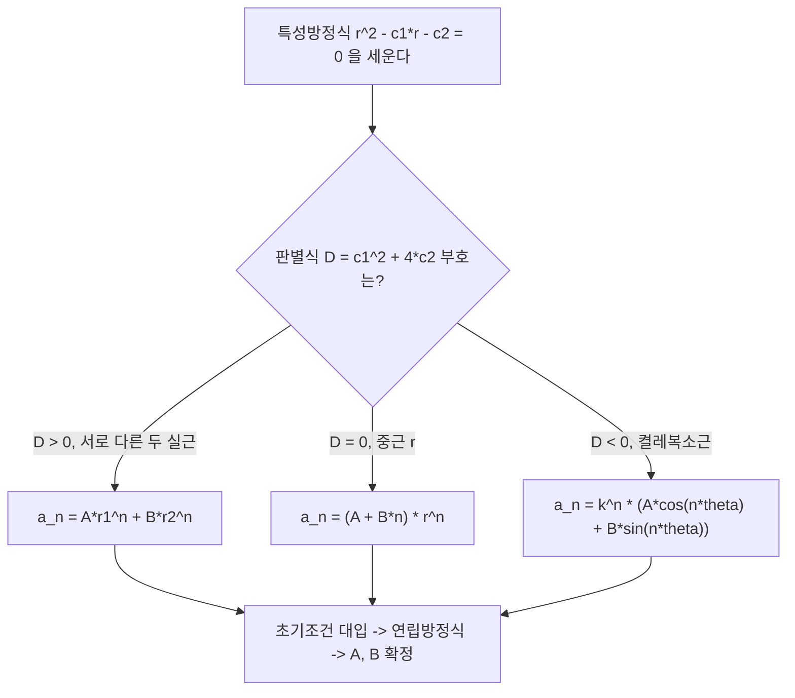

<Callout type="info">
  **이번 문서의 목표:** 이 파일을 다 읽으면 상수계수 선형 점화식을 특성방정식으로 세워, 근의 세 가지 유형(서로 다른 실근·중근·복소근)에 맞는 일반해 공식을 고르고, 초기조건을 대입해 미지수를 확정하는 전 과정을 손으로 풀 수 있다.
</Callout>

## 왜 점화식을 "풀어야" 하는가

12편에서 점화관계(recurrence relation)는 수열의 항을 앞선 항들로 정의하는 방식이라고 배웠다. 예를 들어 $a_n = a_{n-1} + 2a_{n-2}$ 라는 규칙과 $a_0 = 1$, $a_1 = 1$이라는 출발값(초기조건, initial condition)만 있으면 원리적으로 $a_{100}$까지 계산할 수 있다. 하지만 실제로 $a_2, a_3, \ldots, a_{100}$을 하나씩 손으로 계산하는 것은 시험장에서 불가능하다.

> **쉽게 말하면:** 점화식을 "푼다"는 것은 앞 항을 몰라도 $n$만 넣으면 바로 $a_n$이 나오는 닫힌 형태(closed form, 일반항 공식)를 찾는 일이다.

이 편에서 다루는 방법은 **상수계수 선형 점화식**(linear recurrence relation with constant coefficients)에만 적용되는 표준 절차다. "상수계수"는 점화식에 곱해지는 숫자가 $n$에 따라 변하지 않는다는 뜻이고, "선형"은 $a_{n-1}$, $a_{n-2}$ 같은 항들이 제곱이나 곱셈 없이 1차식으로만 나타난다는 뜻이다. 예를 들어 $a_n = 3a_{n-1} - a_{n-2}$는 선형·상수계수이지만, $a_n = a_{n-1}^2$나 $a_n = n \cdot a_{n-1}$은 이 편의 방법이 통하지 않는다.

## 동차 선형 점화식의 정의

**차수 $k$의 동차(homogeneous) 선형 점화식**은 다음 형태를 갖는다.

$$
a_n = c_1 a_{n-1} + c_2 a_{n-2} + \cdots + c_k a_{n-k}
$$

- $c_1, c_2, \ldots, c_k$: 상수(계수), $c_k \neq 0$이어야 한다(그렇지 않으면 실제로는 $k$차가 아니다).
- "동차"라는 말은 우변에 $a_n$들의 조합 이외의 상수항이나 $n$의 함수가 더해지지 않는다는 뜻이다. 예를 들어 $a_n = 2a_{n-1} + 3$처럼 순수 상수항이 붙으면 비동차(non-homogeneous) 점화식이라 부르며, 이 편에서는 다루지 않는다(19편의 종합 문제에서 응용 범위로만 짧게 언급한다).
- 이 편은 **2차 동차 선형 점화식**($a_n = c_1 a_{n-1} + c_2 a_{n-2}$)을 중심으로 다룬다. 독학사 출제기준에서 변별력을 갖는 유형이 대부분 2차이기 때문이다. 방법 자체는 3차 이상으로도 그대로 확장된다.

## 특성방정식: 왜 $r^n$ 꼴을 대입하는가

> **쉽게 말하면:** 점화식을 만족하는 후보로 $a_n = r^n$ 꼴(등비수열)을 대입해 보고, 그 $r$이 만족해야 하는 조건을 다항방정식으로 뽑아낸다.

점화식 $a_n = c_1 a_{n-1} + c_2 a_{n-2}$에 $a_n = r^n$ (단, $r \neq 0$)을 대입하면 다음과 같다.

$$
r^n = c_1 r^{n-1} + c_2 r^{n-2}
$$

양변을 $r^{n-2}$로 나누면(이 나눗셈이 가능한 이유는 $r \neq 0$으로 가정했기 때문이다) 다음 2차방정식을 얻는다.

$$
r^2 - c_1 r - c_2 = 0
$$

이 방정식을 **특성방정식**(characteristic equation)이라 부르고, 이 방정식의 해 $r$을 **특성근**(characteristic root)이라 한다. 즉 점화식의 재귀 구조를 다항식 하나로 압축한 것이 특성방정식이다. 이렇게 정의한 이유는, $r^n$ 꼴 수열들의 **1차결합**(선형결합, linear combination)도 여전히 원래 점화식을 만족한다는 선형대수적 성질(중첩원리, superposition) 때문이다 — 이 성질 덕분에 특성근을 찾기만 하면 그 근들의 조합으로 일반해를 만들 수 있다.

특성근의 개수와 종류에 따라 일반해의 형태가 세 가지로 갈린다. 아래에서 실제 숫자로 세 경우를 모두 검산한다.

## 경우 1 — 서로 다른 두 실근

특성방정식이 서로 다른 두 실근 $r_1 \neq r_2$를 가지면, 일반해는 다음과 같다.

$$
a_n = A \cdot r_1^n + B \cdot r_2^n
$$

- $A$, $B$: 초기조건으로 결정되는 상수. 아직 값이 정해지지 않은 미지수라서 임의상수(arbitrary constant)라 부른다.
- $r_1$, $r_2$: 특성방정식의 두 근.

**예제.** $a_n = a_{n-1} + 2a_{n-2}$, $a_0 = 1$, $a_1 = 1$의 일반항을 구하라.

1단계 — 특성방정식을 세운다.

$$
r^2 - r - 2 = 0
$$

2단계 — 인수분해로 근을 구한다.

$$
(r-2)(r+1) = 0 \implies r_1 = 2,\ r_2 = -1
$$

3단계 — 일반해의 형태를 쓴다.

$$
a_n = A \cdot 2^n + B \cdot (-1)^n
$$

4단계 — 초기조건 $a_0 = 1$을 대입한다($n=0$이면 $2^0 = 1$, $(-1)^0 = 1$이다).

$$
A + B = 1
$$

5단계 — 초기조건 $a_1 = 1$을 대입한다.

$$
2A - B = 1
$$

6단계 — 두 식을 연립해서 푼다. 첫 식에서 $B = 1 - A$이므로 이를 둘째 식에 대입한다.

$$
2A - (1 - A) = 1 \implies 3A = 2 \implies A = \frac{2}{3}
$$

$$
B = 1 - \frac{2}{3} = \frac{1}{3}
$$

7단계 — 일반항을 완성한다.

$$
a_n = \frac{2}{3} \cdot 2^n + \frac{1}{3} \cdot (-1)^n
$$

**검산.** $n=2$일 때 점화식으로 직접 계산하면 $a_2 = a_1 + 2a_0 = 1 + 2 = 3$이다. 공식에 $n=2$를 대입하면 $\frac{2}{3} \cdot 4 + \frac{1}{3} \cdot 1 = \frac{8}{3} + \frac{1}{3} = \frac{9}{3} = 3$으로 일치한다. 이렇게 **공식으로 구한 항과 점화식으로 직접 계산한 항이 일치하는지 확인하는 것**이 시험에서 스스로 채점하는 습관이다.

## 경우 2 — 중근(重根, repeated root)

특성방정식이 중근 $r$(같은 값이 두 번 겹치는 근)을 가지면, $A \cdot r^n$과 $B \cdot r^n$은 사실상 같은 함수라서 독립적인 두 해를 만들 수 없다. 이때는 $n$을 하나 곱한 $n \cdot r^n$이 추가로 독립인 해가 됨이 증명되어 있어(대입해서 직접 확인 가능), 일반해는 다음과 같다.

$$
a_n = (A + B n) \cdot r^n
$$

- $r$: 특성방정식의 (유일한) 중근.
- $A$, $B$: 초기조건으로 결정되는 임의상수.

**예제.** $a_n = 4a_{n-1} - 4a_{n-2}$, $a_0 = 1$, $a_1 = 4$의 일반항을 구하라.

1단계 — 특성방정식을 세운다.

$$
r^2 - 4r + 4 = 0
$$

2단계 — 인수분해한다.

$$
(r-2)^2 = 0 \implies r = 2\ (\text{중근})
$$

3단계 — 일반해의 형태를 쓴다.

$$
a_n = (A + Bn) \cdot 2^n
$$

4단계 — $a_0 = 1$을 대입한다($n=0$이면 $2^0=1$).

$$
A = 1
$$

5단계 — $a_1 = 4$를 대입한다.

$$
(A + B) \cdot 2 = 4 \implies A + B = 2 \implies B = 1
$$

6단계 — 일반항을 완성한다.

$$
a_n = (1 + n) \cdot 2^n
$$

**검산.** 점화식으로 직접 계산하면 $a_2 = 4a_1 - 4a_0 = 16 - 4 = 12$이다. 공식에 $n=2$를 대입하면 $(1+2) \cdot 4 = 12$로 일치한다.

## 경우 3 — 켤레복소근(共役複素根, complex conjugate roots)

판별식이 음수면 특성방정식은 실근이 아니라 **켤레복소근**(서로 실수부가 같고 허수부의 부호만 반대인 한 쌍의 복소수 근) $r = p \pm qi$를 갖는다. 여기서 $i$는 허수단위(imaginary unit, $i^2 = -1$)이다. 이 경우도 $A r_1^n + B r_2^n$ 형태 자체는 성립하지만, 계산 편의를 위해 극형식(polar form)으로 바꿔 쓴다.

복소수 $r = p + qi$의 절댓값(크기) $k$와 편각(각도) $\theta$(세타)를 다음과 같이 정의한다.

$$
k = \sqrt{p^2 + q^2}
$$

$$
\theta = \arctan\left(\frac{q}{p}\right)
$$

이렇게 정의하면 일반해는 다음과 같이 실수 계산만으로 쓸 수 있다.

$$
a_n = k^n \left( A \cos(n\theta) + B \sin(n\theta) \right)
$$

- $k$: 복소근의 절댓값(원점에서의 거리).
- $\theta$: 복소근의 편각(라디안 단위 각도).
- $A$, $B$: 초기조건으로 결정되는 임의상수.

**예제.** $a_n = 2a_{n-1} - 2a_{n-2}$, $a_0 = 1$, $a_1 = 2$의 일반항을 구하라.

1단계 — 특성방정식을 세운다.

$$
r^2 - 2r + 2 = 0
$$

2단계 — 근의 공식으로 근을 구한다.

$$
r = \frac{2 \pm \sqrt{4 - 8}}{2} = \frac{2 \pm 2i}{2} = 1 \pm i
$$

3단계 — 절댓값 $k$를 구한다($p=1$, $q=1$).

$$
k = \sqrt{1^2 + 1^2} = \sqrt{2}
$$

4단계 — 편각 $\theta$를 구한다.

$$
\theta = \arctan\left(\frac{1}{1}\right) = \frac{\pi}{4}
$$

5단계 — 일반해의 형태를 쓴다.

$$
a_n = (\sqrt{2})^n \left( A \cos\left(\frac{n\pi}{4}\right) + B \sin\left(\frac{n\pi}{4}\right) \right)
$$

6단계 — $a_0 = 1$을 대입한다($n=0$이면 $\cos 0 = 1$, $\sin 0 = 0$이다).

$$
A = 1
$$

7단계 — $a_1 = 2$를 대입한다($\cos\frac{\pi}{4} = \sin\frac{\pi}{4} = \frac{\sqrt{2}}{2}$이다).

$$
\sqrt{2}\left(A \cdot \frac{\sqrt{2}}{2} + B \cdot \frac{\sqrt{2}}{2}\right) = 2
$$

8단계 — 우변을 정리한다. $\sqrt{2} \cdot \frac{\sqrt{2}}{2} = 1$이므로,

$$
A + B = 2 \implies B = 1
$$

9단계 — 일반항을 완성한다.

$$
a_n = (\sqrt{2})^n \left( \cos\left(\frac{n\pi}{4}\right) + \sin\left(\frac{n\pi}{4}\right) \right)
$$

**검산.** 점화식으로 직접 계산하면 $a_2 = 2a_1 - 2a_0 = 4 - 2 = 2$이다. 공식에서 $n=2$를 대입하면 $(\sqrt{2})^2 = 2$이고, $\cos\frac{\pi}{2} = 0$, $\sin\frac{\pi}{2} = 1$이므로 $2 \cdot (0 + 1) = 2$로 일치한다.

## 초기조건은 왜 두 개가 필요한가

2차 점화식의 일반해에는 항상 임의상수가 두 개($A$, $B$) 있다. 미지수 두 개를 확정하려면 방정식도 두 개 필요하므로, 2차 점화식에는 초기조건도 반드시 두 개($a_0$, $a_1$처럼 연속한 두 항)가 주어져야 한다. 이는 이차방정식의 해가 두 개인 것과 같은 이유다 — **차수만큼 자유도가 생기고, 그 자유도만큼 조건이 있어야 답이 유일하게 정해진다.** 만약 초기조건이 하나만 주어지면 무수히 많은 수열이 그 점화식과 그 하나의 조건을 동시에 만족하게 되어 답을 하나로 정할 수 없다.

## 자주 틀리는 점

- **판별식 계산에서 부호 실수.** $r^2 - c_1 r - c_2 = 0$의 판별식은 $c_1^2 + 4c_2$이지, 이차방정식 공식을 기계적으로 외워 $c_1^2 - 4c_2$로 잘못 쓰는 경우가 많다. 반드시 원래 특성방정식을 $ar^2+br+c=0$ 표준형으로 바꾼 뒤 $b^2-4ac$를 계산해야 한다. 위 예제들에서는 $r^2-r-2=0$이 이미 표준형이므로 $b=-1$, $a=1$, $c=-2$를 넣어 $D=1+8=9>0$으로 확인한다.
- **중근인데 서로 다른 실근 공식을 쓰는 실수.** $a_n = A r^n + B r^n = (A+B) r^n$처럼 상수 하나로 합쳐져서 초기조건 두 개를 동시에 만족시킬 수 없게 된다. 중근이면 반드시 $n$을 곱한 항을 추가해야 한다.
- **초기조건 대입 시 지수 계산 실수.** $n=0$을 대입할 때 $r^0 = 1$(단, $r \neq 0$)이라는 사실을 잊고 $r^0$을 $0$으로 잘못 계산하는 경우가 있다.
- **연립방정식을 풀지 않고 일반해 형태만 쓰고 끝내는 경우.** 독학사 문항은 "특정 항의 값"이나 "$A+B$의 값" 등 최종 숫자를 요구하는 경우가 많으므로, 초기조건 대입까지 반드시 마무리해야 한다.

## 핵심 정리

- 상수계수 2차 동차 선형 점화식 $a_n = c_1 a_{n-1} + c_2 a_{n-2}$는 $r^n$을 대입해 특성방정식 $r^2 - c_1 r - c_2 = 0$을 얻는다.
- 서로 다른 두 실근이면 $a_n = A r_1^n + B r_2^n$, 중근이면 $a_n = (A+Bn) r^n$, 켤레복소근이면 $a_n = k^n(A\cos n\theta + B\sin n\theta)$이다.
- 임의상수 $A$, $B$는 초기조건 두 개를 대입한 연립방정식으로 확정한다.
- 구한 일반항은 항상 작은 $n$(예: $n=2$)에서 점화식 직접 계산과 대조해 검산한다.

## 마무리 복습

<Quiz
  questionNumber={1}
  question="점화식 a_n = 5a_(n-1) - 6a_(n-2) 의 특성방정식으로 옳은 것은?"
  options={['r^2 - 5r - 6 = 0', 'r^2 - 5r + 6 = 0', 'r^2 + 5r - 6 = 0', 'r^2 - 6r + 5 = 0']}
  correctAnswer={2}
  explanation="a_n = c1*a_(n-1) + c2*a_(n-2) 꼴에서 c1=5, c2=-6이므로 특성방정식은 r^2 - c1*r - c2 = 0, 즉 r^2 - 5r - (-6) = r^2 - 5r + 6 = 0이다."
  optionExplanations={['c2의 부호를 반대로 처리한 오답이다', '정답이다', 'c1의 부호까지 반대로 처리한 오답이다', 'c1과 c2의 위치를 서로 바꿔 계산한 오답이다']}
/>

<Quiz
  questionNumber={2}
  question="r^2 - 5r + 6 = 0의 두 근이 2와 3일 때, 이 점화식의 일반해 형태로 옳은 것은?"
  options={['a_n = A*2^n + B*3^n', 'a_n = (A+Bn)*2^n', 'a_n = A*2^n * B*3^n', 'a_n = 2^n + 3^n']}
  correctAnswer={1}
  explanation="서로 다른 두 실근 r1=2, r2=3을 가지므로 일반해는 두 지수함수의 1차결합인 a_n = A*2^n + B*3^n 형태다."
  optionExplanations={['정답이다', '중근일 때 쓰는 형태를 서로 다른 두 실근에 잘못 적용한 오답이다', '두 해를 곱으로 결합한 잘못된 형태다', '임의상수 A, B를 빠뜨린 오답이다']}
/>

<Quiz
  questionNumber={3}
  question="a_n = 4a_(n-1) - 4a_(n-2), a_0 = 1, a_1 = 4일 때 a_2의 값은?"
  options={['8', '10', '12', '16']}
  correctAnswer={3}
  explanation="점화식에 직접 대입하면 a_2 = 4*a_1 - 4*a_0 = 4*4 - 4*1 = 16 - 4 = 12다. 본문의 일반항 공식 (1+n)*2^n에 n=2를 대입해도 (1+2)*4=12로 같다."
  optionExplanations={['4*a_0을 더하지 않고 4*a_1만 취한 계산 오류다', '4*4-4*1을 12가 아닌 10으로 잘못 뺀 계산 오류다', '정답이다', '4*a_0을 빼지 않고 4*a_1에 4를 더한 계산 오류다']}
/>

<Quiz
  questionNumber={4}
  question="특성방정식이 중근 r=3을 가질 때, 일반해의 올바른 형태는?"
  options={['a_n = A*3^n + B*3^n', 'a_n = (A+Bn)*3^n', 'a_n = A*3^n + B*n', 'a_n = A*3^(2n)']}
  correctAnswer={2}
  explanation="중근일 때는 A*r^n과 B*r^n이 같은 함수가 되어 독립적인 두 해를 만들 수 없으므로, n을 곱한 항을 추가한 (A+Bn)*r^n 형태를 써야 한다."
  optionExplanations={['A*3^n과 B*3^n을 더하면 사실상 (A+B)*3^n으로 상수 하나만 남아 초기조건 두 개를 동시에 만족시킬 수 없다', '정답이다', 'n항에 r^n을 곱하지 않아 점화식을 만족하지 않는 형태다', '중근을 제곱해 지수에 넣는 것은 근거 없는 조작이다']}
/>

<Quiz
  questionNumber={5}
  question="특성방정식 r^2 - 2r + 2 = 0의 두 근이 1+i와 1-i일 때, 절댓값 k와 편각 theta로 옳은 것은?"
  options={['k = 2, theta = 파이/2', 'k = 루트2, theta = 파이/4', 'k = 루트2, theta = 파이/2', 'k = 2, theta = 파이/4']}
  correctAnswer={2}
  explanation="p=1, q=1이므로 k = 루트(1^2+1^2) = 루트2이고, theta = 아크탄젠트(1/1) = 파이/4다."
  optionExplanations={['k를 절댓값 공식이 아니라 p+q로 잘못 계산한 오답이다', '정답이다', 'k는 맞지만 theta를 아크탄젠트(1) 대신 파이/2로 잘못 읽은 오답이다', 'k와 theta 모두 잘못 계산한 오답이다']}
/>

<Quiz
  questionNumber={6}
  question="2차 상수계수 동차 선형 점화식을 풀 때 초기조건이 정확히 2개 필요한 이유로 가장 적절한 것은?"
  options={['특성방정식의 차수가 2차라서 근이 최대 2개이기 때문이다', '일반해에 임의상수가 2개 있어 이를 확정할 방정식이 2개 필요하기 때문이다', '수열의 첫째항과 둘째항이 항상 다르기 때문이다', '점화식이 2개의 이전 항을 참조하기 때문에 조건도 2개가 필요하다는 것은 우연의 일치일 뿐이다']}
  correctAnswer={2}
  explanation="일반해 A*r1^n+B*r2^n, (A+Bn)*r^n, k^n(A*cos(n*theta)+B*sin(n*theta)) 모두 임의상수가 A, B 두 개이므로, 이를 유일하게 확정하려면 연립방정식을 세울 조건이 정확히 2개 필요하다."
  optionExplanations={['근의 개수와 필요한 조건 개수가 우연히 같아 보이지만 실제 이유는 임의상수의 개수다', '정답이다', '첫째항과 둘째항이 다르다는 것은 필요조건이 아니며 이유로 부적절하다', '조건 개수가 2개인 것은 우연이 아니라 임의상수 개수와 정확히 대응하는 구조적 이유가 있다']}
/>

## 참고 자료

- [국가평생교육진흥원 독학학위제](https://bdes.nile.or.kr) — 독학사 2단계 이산수학 출제기준과 점화관계 단원 범위 확인
