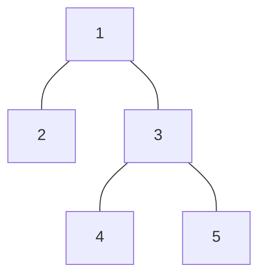

<Callout type="info">
  **이번 문서의 목표:** 이 파일을 다 읽으면 그래프가 오일러 회로·경로를 가지는지 차수만 보고 즉시 판정하고, 해밀턴 경로·회로를 실제로 찾아보며, 트리의 정점·간선 개수 관계를 이용해 스패닝 트리 문제를 풀 수 있다.
</Callout>

## 오일러 문제의 기원 — 쾨니히스베르크 다리

18세기 프로이센의 도시 쾨니히스베르크에는 강을 가로지르는 다리 7개가 있었고, 사람들은 "모든 다리를 정확히 한 번씩만 건너서 처음 출발한 곳으로 돌아올 수 있는가"라는 질문을 오랫동안 풀지 못했다. 수학자 오일러(Euler)는 이 문제를 육지 4곳을 정점으로, 다리 7개를 간선으로 바꾼 그래프 문제로 재구성해 "불가능하다"는 것을 최초로 증명했고, 이것이 그래프 이론의 출발점이 되었다. 14편에서 배운 정점·간선·차수 개념이 바로 이 문제를 푸는 도구다.

## 오일러 경로와 오일러 회로

> **쉽게 말하면:** 오일러 회로는 모든 간선을 정확히 한 번씩만 지나 원래 출발점으로 돌아오는 경로이고, 오일러 경로는 돌아오지 않아도 되는 버전이다.

- **오일러 경로**(Euler path/trail): 그래프의 모든 간선을 정확히 한 번씩만 지나는 경로(시작점과 끝점이 달라도 된다).
- **오일러 회로**(Euler circuit): 오일러 경로 중에서 시작점과 끝점이 같은 것.

이 정의는 "정점을 반복 방문해도 되지만, 간선은 절대 두 번 지나면 안 된다"는 점에서 14편의 일반적인 경로·사이클과 다르다. 오일러 경로·회로가 존재하는지는 그래프를 직접 그려서 시행착오로 찾을 필요 없이, **정점의 차수만 보고 즉시 판정**할 수 있다는 것이 이 개념의 핵심 쓸모다.

### 판정 조건

연결 그래프 $G$에 대해 다음이 성립한다(정리, theorem으로 증명되어 있는 사실이다).

- **오일러 회로가 존재할 필요충분조건**: 모든 정점의 차수가 **짝수**다.
- **오일러 경로(회로 아님)가 존재할 필요충분조건**: 차수가 **홀수인 정점이 정확히 2개**이고, 나머지는 전부 짝수다. 이때 경로는 반드시 그 두 홀수 차수 정점 중 하나에서 시작해 다른 하나에서 끝난다.
- 홀수 차수 정점이 3개 이상이면 오일러 경로도, 오일러 회로도 존재하지 않는다.

**왜 이런 조건이 성립하는가(직관).** 오일러 회로가 지나가는 정점을 생각해 보면, 시작점이 아닌 정점을 지날 때마다 "들어오는 간선 하나, 나가는 간선 하나"가 항상 쌍으로 소모된다. 즉 회로 도중에 있는 정점은 그 정점에 부속한 간선들이 전부 둘씩 짝지어 소모되어야 하므로 차수가 짝수여야 한다. 경로의 경우, 시작점과 끝점만은 짝을 이루지 못하는 간선이 하나씩 남을 수 있어 차수가 홀수여도 되지만, 나머지 정점은 회로와 똑같은 이유로 짝수여야 한다.

**예제 1 — 쾨니히스베르크 다리 문제.** 육지 4곳(A, B, C, D)을 정점으로 하고 다리 7개를 간선으로 옮기면, 각 정점의 차수는 $\deg(A)=3$, $\deg(B)=3$, $\deg(C)=3$, $\deg(D)=5$가 된다(실제 다리 배치를 그래프로 옮긴 결과다). 홀수 차수 정점이 A, B, C, D **네 개 모두**이므로, 판정 조건에서 홀수 차수 정점이 2개를 넘는다. 따라서 오일러 경로도 오일러 회로도 존재하지 않는다 — "모든 다리를 한 번씩만 건너 돌아올 수 없다"는 것이 이렇게 차수 계산만으로 증명된다.

**예제 2 — 오일러 회로가 존재하는 그래프.** $V=\{1,2,3,4\}$, $E=\{\{1,2\},\{2,3\},\{3,4\},\{4,1\}\}$ (정점 4개가 원형으로 이어진 사이클 그래프)를 생각하자.

1단계 — 각 정점의 차수를 센다. $\deg(1)=\deg(2)=\deg(3)=\deg(4)=2$로 전부 짝수다.

2단계 — 모든 정점의 차수가 짝수이므로 판정 조건에 의해 오일러 회로가 존재한다.

3단계 — 실제로 $1 \to 2 \to 3 \to 4 \to 1$이 모든 간선을 한 번씩만 지나 원점으로 돌아오는 오일러 회로임을 확인할 수 있다.

## 해밀턴 경로와 해밀턴 회로

> **쉽게 말하면:** 해밀턴 회로는 모든 정점을 정확히 한 번씩만 방문하고 원래 자리로 돌아오는 경로다. 오일러가 "모든 간선"을 기준으로 삼았다면, 해밀턴은 "모든 정점"을 기준으로 삼는다.

- **해밀턴 경로**(Hamiltonian path): 그래프의 모든 정점을 정확히 한 번씩만 방문하는 경로.
- **해밀턴 회로**(Hamiltonian circuit/cycle): 해밀턴 경로 중 시작점과 끝점이 같은 것.

오일러 경로와 달리, 해밀턴 경로·회로가 존재하는지 판정하는 **간단한 필요충분조건은 알려져 있지 않다**(이는 계산복잡도 이론에서 유명한 어려운 문제류에 속한다). 그래서 독학사 시험에서는 조건을 대입해 즉시 판정하기보다, 작은 그래프에서 직접 순서를 찾아보거나 "해밀턴 회로가 없음을 보여라" 유형으로 반례를 구성하는 문제가 나온다.

**예제.** $V=\{1,2,3,4,5\}$, $E=\{\{1,2\},\{2,3\},\{3,4\},\{4,5\},\{5,1\},\{1,3\}\}$인 그래프에서 해밀턴 회로를 찾아라.

1단계 — 정점을 하나도 빠뜨리지 않고 전부 방문하는 순서를 시도한다. $1 \to 2 \to 3 \to 4 \to 5 \to 1$을 확인해 보자.

2단계 — 이 순서에 쓰인 간선이 실제로 그래프에 있는지 하나씩 확인한다. $\{1,2\}$(있음), $\{2,3\}$(있음), $\{3,4\}$(있음), $\{4,5\}$(있음), $\{5,1\}$(있음). 다섯 정점을 모두 정확히 한 번씩 방문했고 마지막에 출발점 1로 돌아왔다.

3단계 — 따라서 $1 \to 2 \to 3 \to 4 \to 5 \to 1$은 해밀턴 회로다(참고로 $\{1,3\}$ 간선은 이 회로에서 쓰이지 않았을 뿐, 그래프에 존재하는 것은 맞다 — 해밀턴 회로가 그래프의 모든 간선을 다 쓸 필요는 없다는 점이 오일러 회로와의 결정적 차이다).

**자주 틀리는 점.** 오일러 회로 조건(모든 정점 차수 짝수)을 해밀턴 회로에도 그대로 적용하려는 실수가 많다. 두 개념은 기준 자체가 다르다 — 오일러는 **간선**을 전부 한 번씩, 해밀턴은 **정점**을 전부 한 번씩 방문하는 것이며, 서로 독립적인 성질이라 한 그래프가 오일러 회로는 있지만 해밀턴 회로는 없을 수도, 그 반대일 수도 있다.

## 트리: 사이클이 없는 연결 그래프

**트리**(tree)는 사이클이 하나도 없는 연결 그래프다. "나뭇가지" 모양을 떠올리면 직관적이다 — 뿌리에서 갈라져 나가기만 할 뿐 다시 만나 원을 이루지 않는 구조다.

트리에서 차수가 1인 정점을 **잎**(leaf, 말단 노드)이라 부른다.

### 트리의 핵심 정리 — 정점 수와 간선 수의 관계

> **쉽게 말하면:** 정점이 $n$개인 트리는 항상 간선이 정확히 $n-1$개다. 사이클이 없다는 조건이 간선 개수를 딱 하나로 고정시킨다.

$$
|E| = |V| - 1
$$

**직관적 이유.** 정점 1개짜리 트리(고립된 점 하나)는 간선이 0개다($1-1=0$으로 성립). 여기서 정점을 하나씩 새로 추가할 때마다, 그 새 정점을 기존 트리와 연결하려면 간선이 **정확히 하나** 필요하다(간선을 0개 붙이면 트리 전체가 연결되지 않고, 2개 이상 붙이면 사이클이 생겨 트리 정의를 어긴다). 따라서 정점을 하나 늘릴 때마다 간선도 정확히 하나씩 늘어나므로, 정점 $n$개짜리 트리는 항상 간선 $n-1$개를 갖는다.

**검산.** 정점 5개짜리 트리 하나를 그려 보자: $V=\{1,2,3,4,5\}$, $E=\{\{1,2\},\{1,3\},\{3,4\},\{3,5\}\}$. 간선 개수를 세면 4개이고, $|V|-1 = 5-1 = 4$로 정확히 일치한다. 이 트리에서 잎(차수 1인 정점)은 2, 4, 5로 세 개다.

## 스패닝 트리

**스패닝 트리**(spanning tree, 신장 트리)는 원래 그래프 $G$의 모든 정점을 포함하면서, 그 정점들을 연결하는 데 필요한 최소한의 간선만 남긴 부분 그래프(subgraph)다. 즉 $G$에서 사이클을 만드는 "여분의 간선"들을 제거해 트리로 만든 것이다.

**예제.** $V=\{1,2,3,4\}$, $E=\{\{1,2\},\{2,3\},\{3,4\},\{4,1\},\{1,3\}\}$인 연결 그래프(14편에서 다룬 예시와 같다, 간선 5개)의 스패닝 트리를 구하라.

1단계 — 스패닝 트리는 정점 4개를 모두 포함하면서 사이클이 없어야 하므로, 트리 정리에 의해 간선이 정확히 $4-1=3$개여야 한다.

2단계 — 사이클을 만드는 간선을 하나 제거한다. 예를 들어 $\{1,2\},\{2,3\},\{3,4\},\{4,1\}$은 사이클 $1\to2\to3\to4\to1$을 이루므로, 이 중 하나를 반드시 빼야 한다. $\{1,3\}$은 대각선으로 추가된 간선이므로 우선 그대로 두고, 사이클을 이루는 네 간선 중 $\{4,1\}$을 제거해 보자.

3단계 — 남은 간선 $\{\{1,2\},\{2,3\},\{3,4\},\{1,3\}\}$은 아직 4개다. $1\to2\to3\to1$이 여전히 사이클이므로($\{1,2\},\{2,3\},\{1,3\}$), 하나를 더 제거해야 한다. $\{1,3\}$을 제거한다.

4단계 — 남은 간선은 $\{\{1,2\},\{2,3\},\{3,4\}\}$로 3개이고, 이는 정점 4개를 모두 연결하면서 사이클이 없는 트리다. 트리 정리로 확인한 개수 $4-1=3$과 정확히 일치한다.

**같은 그래프에서 스패닝 트리가 여러 개 나올 수 있다.** 2단계에서 다른 간선을 제거했다면 다른 모양의 스패닝 트리가 나왔을 것이다. 독학사 문제에서는 "이 그래프의 스패닝 트리 개수를 구하라" 같은 계산형보다 "주어진 그래프에서 스패닝 트리 하나를 그리고 간선 개수를 확인하라" 유형이 이 난이도의 중심이다.

## 오일러·해밀턴·트리 비교표

| 구분 | 기준 | 판정 방법 |
|------|------|-----------|
| 오일러 회로 | 모든 간선을 한 번씩, 원점 복귀 | 모든 정점 차수가 짝수인지 확인(즉시 판정 가능) |
| 오일러 경로 | 모든 간선을 한 번씩, 복귀 불필요 | 홀수 차수 정점이 정확히 2개인지 확인(즉시 판정 가능) |
| 해밀턴 회로 | 모든 정점을 한 번씩, 원점 복귀 | 간단한 필요충분조건 없음(직접 탐색·반례 구성) |
| 스패닝 트리 | 모든 정점을 연결하는 최소 간선 집합 | 간선 개수가 항상 정점 개수 − 1 |

## 핵심 정리

- 오일러 회로는 모든 정점의 차수가 짝수일 때, 오일러 경로는 홀수 차수 정점이 정확히 2개일 때 존재하며 이는 차수만 보고 즉시 판정된다.
- 해밀턴 경로·회로는 모든 정점을 한 번씩 방문하는 개념으로, 오일러와 달리 간단한 판정 조건이 없어 직접 탐색해야 한다.
- 트리는 사이클이 없는 연결 그래프이며, 정점 $n$개인 트리는 항상 간선 $n-1$개를 갖는다.
- 스패닝 트리는 원래 그래프의 모든 정점을 포함하면서 사이클을 없앤 부분 그래프이며, 같은 그래프에서도 어떤 간선을 남기느냐에 따라 여러 개가 나올 수 있다.

## 마무리 복습

<Quiz
  questionNumber={1}
  question="어떤 연결 그래프의 모든 정점 차수가 짝수일 때, 이 그래프에 대해 반드시 참인 것은?"
  options={['해밀턴 회로가 존재한다', '오일러 회로가 존재한다', '트리다', '스패닝 트리가 존재하지 않는다']}
  correctAnswer={2}
  explanation="모든 정점의 차수가 짝수라는 것은 오일러 회로 존재의 필요충분조건이므로, 이 조건을 만족하면 오일러 회로가 반드시 존재한다."
  optionExplanations={['해밀턴 회로는 차수의 짝홀과 직접적인 필요충분관계가 없다', '정답이다', '트리는 사이클이 없는 그래프인데, 오일러 회로가 있다는 것은 오히려 사이클이 존재한다는 뜻이라 트리일 수 없다', '연결 그래프는 항상 스패닝 트리를 가진다']}
/>

<Quiz
  questionNumber={2}
  question="어떤 연결 그래프에서 차수가 홀수인 정점이 정확히 4개일 때 성립하는 것은?"
  options={['오일러 회로는 존재하지만 오일러 경로는 없다', '오일러 경로는 존재하지만 오일러 회로는 없다', '오일러 경로도 오일러 회로도 존재하지 않는다', '해밀턴 회로가 반드시 존재한다']}
  correctAnswer={3}
  explanation="오일러 회로는 홀수 차수 정점이 0개, 오일러 경로는 정확히 2개일 때만 존재한다. 홀수 차수 정점이 4개면 두 조건 모두 만족하지 못하므로 둘 다 존재하지 않는다."
  optionExplanations={['오일러 회로는 홀수 차수 정점이 0개여야 하므로 4개인 경우 성립하지 않는다', '오일러 경로는 홀수 차수 정점이 정확히 2개여야 하므로 4개인 경우 성립하지 않는다', '정답이다', '해밀턴 회로 존재 여부는 차수의 홀짝 개수와 직접적인 필요충분관계가 없다']}
/>

<Quiz
  questionNumber={3}
  question="쾨니히스베르크 다리 문제에서 네 육지의 차수가 3, 3, 3, 5였다는 것이 의미하는 바는?"
  options={['오일러 회로는 없지만 오일러 경로는 있다', '오일러 경로도 오일러 회로도 존재하지 않는다', '오일러 회로가 존재한다', '해밀턴 경로가 존재하지 않는다는 것을 의미한다']}
  correctAnswer={2}
  explanation="네 정점 모두 차수가 홀수(3, 3, 3, 5)이므로 홀수 차수 정점이 4개다. 오일러 경로 조건(홀수 차수 정점 정확히 2개)도, 오일러 회로 조건(홀수 차수 정점 0개)도 만족하지 못해 둘 다 존재하지 않는다."
  optionExplanations={['오일러 경로가 성립하려면 홀수 차수 정점이 정확히 2개여야 하는데 이 경우 4개다', '정답이다', '모든 정점 차수가 짝수여야 오일러 회로가 존재하는데 이 경우 전부 홀수다', '이 문제는 오일러 경로·회로에 대한 것으로, 해밀턴 경로의 존재 여부와는 별개의 판단이 필요하다']}
/>

<Quiz
  questionNumber={4}
  question="정점이 8개인 트리의 간선 개수는?"
  options={['6', '7', '8', '9']}
  correctAnswer={2}
  explanation="트리는 항상 간선 개수가 정점 개수보다 1 적으므로, 8-1=7개다."
  optionExplanations={['정점 개수보다 2 적게 계산한 오답이다', '정답이다', '간선 개수와 정점 개수를 같다고 잘못 계산한 오답이다', '정점 개수보다 1 많게 계산한 오답이다']}
/>

<Quiz
  questionNumber={5}
  question="스패닝 트리에 대한 설명으로 옳지 않은 것은?"
  options={['원래 그래프의 모든 정점을 포함한다', '사이클이 존재하지 않는다', '같은 그래프에서 스패닝 트리는 항상 하나뿐이다', '간선 개수는 정점 개수보다 1 적다']}
  correctAnswer={3}
  explanation="스패닝 트리는 어떤 간선을 남기느냐에 따라 여러 개가 나올 수 있어, 항상 하나뿐이라는 진술은 옳지 않다."
  optionExplanations={['스패닝 트리의 정의 자체가 모든 정점을 포함하는 것이므로 옳은 설명이다', '스패닝 트리는 트리이므로 사이클이 없다는 것은 옳은 설명이다', '정답이다(옳지 않은 설명)', '트리의 정점·간선 관계에 의해 옳은 설명이다']}
/>

<Quiz
  questionNumber={6}
  question="오일러 회로와 해밀턴 회로의 차이를 가장 정확히 설명한 것은?"
  options={['오일러 회로는 정점을 기준으로, 해밀턴 회로는 간선을 기준으로 정의된다', '오일러 회로는 간선을 기준으로, 해밀턴 회로는 정점을 기준으로 정의된다', '두 개념은 사실상 같은 것을 다른 이름으로 부른 것이다', '오일러 회로는 트리에서만, 해밀턴 회로는 일반 그래프에서만 정의된다']}
  correctAnswer={2}
  explanation="오일러 회로는 모든 간선을 정확히 한 번씩 지나는 것을 기준으로, 해밀턴 회로는 모든 정점을 정확히 한 번씩 방문하는 것을 기준으로 정의된다."
  optionExplanations={['기준이 서로 뒤바뀐 오답이다', '정답이다', '두 개념은 기준이 다른 독립적인 성질로 서로 다르다', '두 개념 모두 트리가 아닌 일반 그래프에서 정의되는 개념이다']}
/>

## 참고 자료

- [국가평생교육진흥원 독학학위제](https://bdes.nile.or.kr) — 독학사 2단계 이산수학 출제기준과 그래프·트리 단원 범위 확인
