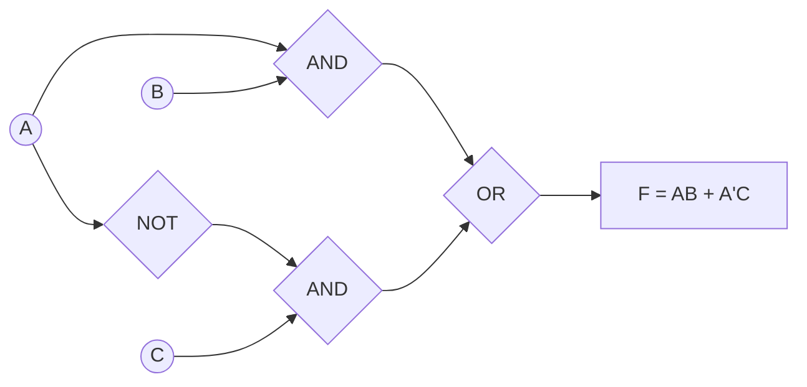

<Callout type="info">
  **이번 문서의 목표:** 이 문서를 다 읽으면 AND·OR·NOT·NAND·NOR·XOR 게이트의 동작을 진리표로 설명하고, 부울식을 회로로 옮기며, 2~3변수 카르노 맵으로 논리식을 최소화할 수 있다.
</Callout>

16편에서 부울대수(Boolean algebra, 참·거짓 두 값만 다루는 대수 체계)의 공리와 법칙(교환법칙, 결합법칙, 분배법칙, 드모르간 법칙, 흡수법칙)을 정리했다. 그 법칙들은 종이 위에서 논리식을 손으로 간소화할 때 쓰는 도구였다. 이 편에서는 그 논리식이 실제로 **어떤 전자 부품(게이트)으로 구현되는지**, 그리고 손으로 대수 법칙을 하나씩 적용하는 대신 **그림만으로 빠르게 간소화하는 카르노 맵**을 다룬다. 독학사 이산수학 시험에서는 진리표 완성, 게이트 조합 해석, 카르노 맵 최소화가 계산형 문제로 자주 나온다.

## 기본 논리게이트: 부울 연산을 전자회로로

> **쉽게 말하면:** 논리게이트는 0과 1을 입력받아 부울 연산 하나를 그대로 수행하는 전자 부품이다.

**게이트**(gate, 논리 연산을 수행하는 회로 소자)는 하나 이상의 입력을 받아 부울 연산 결과를 출력으로 내보낸다. 입력·출력은 항상 0(거짓) 또는 1(참) 두 값 중 하나다.

### AND, OR, NOT — 가장 기본이 되는 세 게이트

| 게이트 | 기호(연산) | 읽는 법 | 진리표 규칙 |
|---|---|---|---|
| AND | $A \cdot B$ 또는 $AB$ | 에이 앤드 비 | 입력이 모두 1일 때만 출력 1 |
| OR | $A + B$ | 에이 오어 비 | 입력 중 하나라도 1이면 출력 1 |
| NOT | $\overline{A}$ 또는 $A'$ | 에이 낫, 에이 프라임 | 입력을 반대로 뒤집는다 |

| A | B | AND($AB$) | OR($A+B$) |
|---|---|---|---|
| 0 | 0 | 0 | 0 |
| 0 | 1 | 0 | 1 |
| 1 | 0 | 0 | 1 |
| 1 | 1 | 1 | 1 |

NOT은 입력이 하나뿐이다. $\overline{0} = 1$, $\overline{1} = 0$이다.

### NAND, NOR — AND·OR 뒤에 NOT을 붙인 게이트

**NAND**(Not-AND, AND 다음에 NOT을 붙인 게이트)와 **NOR**(Not-OR, OR 다음에 NOT을 붙인 게이트)는 각각 AND, OR의 출력을 그대로 뒤집은 것이다.

$$
\overline{AB} = \text{NAND}(A,B)
$$

$$
\overline{A+B} = \text{NOR}(A,B)
$$

| A | B | $AB$ | NAND($\overline{AB}$) | $A+B$ | NOR($\overline{A+B}$) |
|---|---|---|---|---|---|
| 0 | 0 | 0 | 1 | 0 | 1 |
| 0 | 1 | 0 | 1 | 1 | 0 |
| 1 | 0 | 0 | 1 | 1 | 0 |
| 1 | 1 | 1 | 0 | 1 | 0 |

표에서 보듯 NAND 열은 AND 열을 그대로 뒤집은 값이고, NOR 열은 OR 열을 그대로 뒤집은 값이다(검산 완료).

### XOR — 서로 다를 때만 참

**XOR**(eXclusive OR, 배타적 논리합 — "둘 중 하나만" 참일 때 참이라는 뜻에서 "배타적")는 두 입력이 서로 다를 때만 1을 출력한다.

$$
A \oplus B
$$

- $\oplus$: XOR 기호, "에이 엑스오어 비"로 읽는다

| A | B | $A \oplus B$ |
|---|---|---|
| 0 | 0 | 0 |
| 0 | 1 | 1 |
| 1 | 0 | 1 |
| 1 | 1 | 0 |

일상 비유로는 스위치 두 개로 복도 전등을 켜고 끄는 3로 스위치 회로가 XOR과 같은 동작이다. 두 스위치가 같은 위치(둘 다 위 또는 둘 다 아래)면 불이 꺼지고, 서로 다른 위치면 불이 켜지도록 배선하는 것이 실생활에서 XOR을 쓰는 예다.

## 부울식과 회로의 대응

> **쉽게 말하면:** 부울식의 곱(AND)·합(OR)·부정(NOT)을 그대로 게이트로 바꿔 이으면 회로가 된다.

부울식 $F = AB + \overline{A}C$를 회로로 옮겨보자. 이 식은 "$A$와 $B$를 AND한 것"과 "$A$를 NOT한 것과 $C$를 AND한 것"을 OR로 합친 것이다.

**검산.** $A=1, B=0, C=1$을 대입해보자. $AB = 1 \cdot 0 = 0$이고, $\overline{A}C = 0 \cdot 1 = 0$이므로 $F = 0+0 = 0$이다. 회로도로도 같은 경로를 따라가면, $A=1$이 AND1에 들어가지만 $B=0$이라 AND1 출력은 0, $A=1$을 NOT하면 0이 되어 AND2도 0을 출력하므로 최종 OR 출력은 0이다. 대수식 계산과 회로 추적 결과가 일치한다(검산 완료).

### NAND는 만능 게이트다

**만능 게이트**(universal gate, 이 게이트 하나만으로 AND·OR·NOT을 전부 만들 수 있는 게이트)라는 개념이 시험에 종종 나온다. NAND 하나만으로 NOT, AND, OR을 모두 만들 수 있다는 것을 확인해보자.

**NOT 만들기.** NAND의 두 입력에 같은 신호 $A$를 넣으면 $\overline{A \cdot A}$가 되는데, $A \cdot A = A$이므로 결과는 $\overline{A}$다.

$$
\text{NAND}(A,A) = \overline{A \cdot A} = \overline{A}
$$

**AND 만들기.** NAND 출력을 다시 NAND(자기 자신과 묶어서, 즉 NOT)에 통과시키면 이중 부정이 되어 원래 AND가 남는다.

$$
\overline{\overline{AB}} = AB
$$

**OR 만들기.** 드모르간 법칙(16편)을 거꾸로 이용한다. $A$와 $B$를 각각 NAND-NOT으로 뒤집어 $\overline{A}$, $\overline{B}$를 만든 뒤, 이 둘을 NAND에 넣으면 된다.

$$
\overline{\overline{A}\cdot\overline{B}} = A+B
$$

세 번째 줄은 드모르간 법칙 $\overline{XY} = \overline{X}+\overline{Y}$에서 $X=\overline{A}$, $Y=\overline{B}$를 대입한 것과 같다($\overline{\overline{A}} = A$, $\overline{\overline{B}}=B$이므로 결과가 $A+B$가 된다). NAND만으로 세 기본 연산을 모두 구현할 수 있으므로, 실제 반도체 칩은 종류를 줄이기 위해 NAND(또는 NOR) 게이트만으로 대부분의 회로를 만든다.

## 카르노 맵: 진리표를 그림으로 간소화한다

> **쉽게 말하면:** 진리표의 결과를 그레이 코드 순서로 배열한 격자에 옮기고, 인접한 1들을 사각형으로 묶으면 그 묶음이 곧 간소화된 항이 된다.

부울 대수 법칙을 순서대로 적용해 논리식을 간소화하는 것(16편)은 식이 길어질수록 어느 법칙을 어디에 적용해야 할지 찾기 어려워진다. **카르노 맵**(Karnaugh map, K-map)은 진리표를 격자에 옮겨 놓고 눈으로 인접한 1들을 묶기만 하면 간소화된 식을 바로 읽어낼 수 있는 방법이다.

핵심은 **그레이 코드**(Gray code, 이웃한 두 값이 딱 1비트만 다르게 배열한 이진수 순서) 순서로 칸을 배열하는 것이다. 2변수라면 $00, 01, 11, 10$ 순서로 두며(보통의 이진수 순서 $00,01,10,11$이 아니다), 이렇게 하면 격자에서 물리적으로 이웃한 칸은 항상 논리적으로도 1비트 차이만 나서, 이웃한 칸끼리 묶으면 달라지는 변수 하나가 정확히 사라진다.

### 2변수 카르노 맵 예제

함수 $F(A,B)$가 $F(0,1)=1$, $F(1,1)=1$이고 나머지는 0이라 하자(진리표: $A=0,B=0 \to 0$; $A=0,B=1\to1$; $A=1,B=0\to0$; $A=1,B=1\to1$).

| A＼B | 0 | 1 |
|---|---|---|
| 0 | 0 | 1 |
| 1 | 0 | 1 |

$B=1$ 열의 두 칸이 모두 1이고 세로로 인접해 있으므로 이 둘을 하나로 묶는다. 이 묶음에서 $A$는 0과 1이 섞여 있으니 소거되고, $B$는 두 칸 모두 1이니 그대로 남는다.

$$
F = B
$$

**검산.** 원래 진리표에서 $F$는 $B=1$일 때만 1이고 $B=0$일 때는 $A$ 값과 상관없이 항상 0이다. 간소화된 식 $F=B$도 정확히 같은 규칙이므로 일치한다(검산 완료).

### 3변수 카르노 맵 예제

함수 $F(A,B,C) = \Sigma m(0,2,4,5,6)$을 간소화해보자. $\Sigma m(\ldots)$는 "괄호 안 번호에 해당하는 최소항(minterm)에서 $F=1$"이라는 표기다. 최소항 번호는 $(A,B,C)$를 이진수로 읽은 값이다: $m_0=(0,0,0)$, $m_2=(0,1,0)$, $m_4=(1,0,0)$, $m_5=(1,0,1)$, $m_6=(1,1,0)$.

**1단계: 진리표를 완성한다.**

| A | B | C | $F$ |
|---|---|---|---|
| 0 | 0 | 0 | 1 |
| 0 | 0 | 1 | 0 |
| 0 | 1 | 0 | 1 |
| 0 | 1 | 1 | 0 |
| 1 | 0 | 0 | 1 |
| 1 | 0 | 1 | 1 |
| 1 | 1 | 0 | 1 |
| 1 | 1 | 1 | 0 |

**2단계: 카르노 맵에 옮긴다.** 세로축은 $A$, 가로축은 $BC$를 그레이 코드 순서($00,01,11,10$)로 둔다.

| A＼BC | 00 | 01 | 11 | 10 |
|---|---|---|---|---|
| 0 | 1 | 0 | 0 | 1 |
| 1 | 1 | 1 | 0 | 1 |

**3단계: 인접한 1을 묶는다.** 카르노 맵은 맨 왼쪽 열과 맨 오른쪽 열도 원통처럼 이어진다는 점을 이용한다.

- **묶음 1(4칸).** $BC=00$ 열과 $BC=10$ 열은 원통 구조로 서로 인접하고, 이 두 열의 $A=0$행·$A=1$행이 전부 1이다($m_0, m_2, m_4, m_6$ 네 칸). 이 네 칸에서 $A$는 0과 1이 섞여 소거되고, $B$는 $BC=00$일 때 0, $BC=10$일 때 1로 섞여 소거되며, $C$는 두 열 모두 0이므로 그대로 남는다. → 이 묶음은 $\overline{C}$ 항이 된다.
- **묶음 2(2칸).** $A=1$행에서 $BC=00$과 $BC=01$이 인접한 2칸이다($m_4, m_5$). 이 두 칸에서 $A$는 둘 다 1이라 남고, $B$는 둘 다 0이라 남으며, $C$는 0과 1이 섞여 소거된다. → 이 묶음은 $A\overline{B}$ 항이 된다.

두 묶음을 합치면 $m_0, m_2, m_4, m_5, m_6$이 모두 적어도 한 번씩 포함되어 모든 1이 커버된다(묶음 1이 $m_0,m_2,m_4,m_6$을 담당하고, 묶음 2가 $m_5$를 추가로 담당하며 $m_4$는 두 묶음에 겹쳐서 포함되는데, 겹치는 것은 허용된다).

**4단계: 묶음들을 OR로 연결한다.**

$$
F = \overline{C} + A\overline{B}
$$

**검산.** 진리표의 $C=0$인 네 행($m_0,m_2,m_4,m_6$)을 보면 모두 $F=1$이므로 $\overline{C}$만으로 이 네 개가 정확히 설명된다. 남은 $m_5$($A=1,B=0,C=1$)는 $A\overline{B}=1\cdot1=1$로 설명되고, $m_1, m_3, m_7$($F=0$인 행)은 $\overline{C}$도 $A\overline{B}$도 만족하지 않는지 하나씩 확인하면 된다 — 예를 들어 $m_7=(1,1,1)$은 $C=1$이라 $\overline{C}=0$이고, $A=1$이지만 $B=1$이라 $\overline{B}=0$이므로 $A\overline{B}=0$, 합쳐서 $F=0$이 되어 진리표와 일치한다(검산 완료).

### 자주 틀리는 점

- 그레이 코드 순서 대신 보통 이진수 순서($00,01,10,11$)로 배열하면 이웃 칸이 2비트씩 차이 나서 잘못된 묶음이 나온다.
- 카르노 맵이 **원통 구조**라는 것을 잊고 맨 끝 행·열끼리는 인접하지 않는다고 착각한다.
- 묶음 크기는 반드시 $1, 2, 4, 8$처럼 2의 거듭제곱이어야 한다. 3칸이나 5칸으로는 묶을 수 없다.
- 묶음이 클수록 소거되는 변수가 많아지므로, 항상 **가능한 가장 큰 묶음**부터 찾아야 항의 개수가 최소가 된다.

## 핵심 정리

- AND는 곱, OR은 합, NOT은 부정이며, NAND·NOR은 각각 AND·OR 뒤에 NOT을 붙인 것이다. XOR은 두 입력이 다를 때만 1이다.
- 부울식의 AND·OR·NOT을 그대로 게이트로 바꿔 연결하면 회로가 되고, NAND 하나만으로 NOT·AND·OR을 모두 구현할 수 있다(만능 게이트).
- 카르노 맵은 그레이 코드 순서 격자에서 인접한 1을 2의 거듭제곱 크기로 묶어 논리식을 간소화하는 방법이며, 좌우·상하가 원통처럼 이어진다.

## 마무리 복습

<Quiz
  questionNumber={1}
  question="NAND 게이트의 출력이 AND 게이트의 출력과 갖는 관계로 옳은 것은?"
  options={['AND 출력과 완전히 같다', 'AND 출력을 그대로 뒤집은 값이다', 'AND 출력에 자기 자신을 다시 곱한 값이다', 'AND 출력과 아무 관계가 없다']}
  correctAnswer={2}
  explanation="NAND는 Not AND의 줄임말로, AND 연산을 수행한 뒤 그 결과를 NOT으로 뒤집은 것이다. 진리표에서도 NAND 열은 AND 열의 값을 정확히 반전한 값이다."
  optionExplanations={['NAND는 AND의 반전이므로 같은 값이 아니다.', '정답이다. NAND(A,B)는 AND(A,B)의 결과를 그대로 뒤집은 값이다.', 'NAND는 AND 결과를 다시 곱하는 것이 아니라 부정하는 연산이다.', 'NAND는 AND와 정확히 반대(부정) 관계를 갖는다.']}
/>

<Quiz
  questionNumber={2}
  question="XOR 게이트가 출력 1을 내는 경우로 옳은 것은?"
  options={['두 입력이 모두 0일 때', '두 입력이 모두 1일 때', '두 입력이 서로 다를 때', '두 입력 중 적어도 하나가 1일 때']}
  correctAnswer={3}
  explanation="XOR(배타적 논리합)은 두 입력이 서로 다를 때만 1을 출력한다. 입력이 (0,1) 또는 (1,0)일 때 1이 되고, (0,0)이나 (1,1)일 때는 0이다."
  optionExplanations={['두 입력이 모두 0이면 서로 같으므로 XOR 출력은 0이다.', '두 입력이 모두 1이면 서로 같으므로 XOR 출력은 0이다.', '정답이다. 서로 다를 때만 1을 출력하는 것이 XOR의 정의다.', '이것은 OR 게이트의 설명이다. XOR은 둘 다 1일 때는 0을 출력한다.']}
/>

<Quiz
  questionNumber={3}
  question="NAND 게이트 하나의 두 입력에 같은 신호 A를 동시에 넣으면 어떤 게이트와 같은 동작을 하는가?"
  options={['AND 게이트', 'OR 게이트', 'NOT 게이트', 'XOR 게이트']}
  correctAnswer={3}
  explanation="NAND(A,A) = (A·A)의 부정 = A의 부정이다. A·A는 A 자신과 같으므로, 결국 NAND에 같은 입력을 두 번 넣으면 NOT 게이트와 동일하게 동작한다."
  optionExplanations={['NAND(A,A)는 AND가 아니라 AND의 부정, 즉 그 결과를 한 번 더 뒤집은 것이다.', 'OR을 만들려면 NAND 여러 개를 드모르간 법칙에 맞춰 조합해야 하며 입력 하나를 반복하는 것만으로는 안 된다.', '정답이다. A·A=A이므로 NAND(A,A)=(A의 부정)이 되어 NOT과 같다.', 'XOR은 두 개의 서로 다른 입력이 필요한 연산이라 이 방법으로는 만들 수 없다.']}
/>

<Quiz
  questionNumber={4}
  question="카르노 맵에서 가로축·세로축을 그레이 코드 순서로 배열하는 이유로 가장 적절한 것은?"
  options={['계산 속도를 높이기 위해서다', '물리적으로 인접한 칸이 항상 1비트만 다르게 만들어 올바른 묶음을 만들기 위해서다', '표의 칸 수를 줄이기 위해서다', '진리표의 순서를 그대로 유지하기 위해서다']}
  correctAnswer={2}
  explanation="그레이 코드 순서(00, 01, 11, 10)로 배열하면 인접한 칸이 항상 1비트 차이만 나므로, 이웃한 1을 묶었을 때 정확히 어떤 변수가 소거되고 어떤 변수가 남는지가 논리적으로 맞아떨어진다."
  optionExplanations={['그레이 코드 배열은 계산 속도가 아니라 논리적으로 올바른 인접성을 만들기 위한 것이다.', '정답이다. 1비트 차이만 나는 인접성이 카르노 맵 묶음의 핵심 원리다.', '칸의 개수는 변수 개수에 따라 정해지며 배열 순서와 무관하다.', '보통 이진수 순서(00,01,10,11)가 아니라 그레이 코드 순서로 바뀐다는 것이 핵심이다.']}
/>

<Quiz
  questionNumber={5}
  question="3변수 카르노 맵에서 4칸(2×2 크기)을 하나로 묶었을 때 일어나는 일로 옳은 것은?"
  options={['3개의 변수가 모두 그대로 남는다', '공통으로 유지되는 변수 1개만 남고 나머지 2개 변수는 소거된다', '모든 변수가 소거되어 상수 1만 남는다', '묶은 칸의 개수만큼 변수가 새로 추가된다']}
  correctAnswer={2}
  explanation="카르노 맵에서 2의 k제곱 칸을 묶으면 k개의 변수가 소거된다. 4칸은 2의 2제곱이므로 2개의 변수가 소거되고 나머지 1개 변수만 항으로 남는다."
  optionExplanations={['4칸을 묶으면 그 안에서 값이 바뀌는 변수들은 소거되고 일부만 남는다.', '정답이다. 2의 2제곱인 4칸 묶음은 2개 변수를 소거하고 1개 변수만 남긴다.', '8칸(2의 3제곱)을 모두 묶어 모든 변수가 소거될 때만 상수 1이 남는다.', '카르노 맵 간소화는 변수를 소거하는 과정이며 새로 추가하지 않는다.']}
/>

<Quiz
  questionNumber={6}
  question="함수 F(A,B)에서 F(0,1)=1, F(1,1)=1이고 나머지는 0일 때, 카르노 맵으로 간소화한 결과는?"
  options={['F = A', 'F = B', 'F = A의 부정(NOT A)', 'F = A + B']}
  correctAnswer={2}
  explanation="B=1 열의 두 칸(A=0,B=1과 A=1,B=1)이 모두 1이고 세로로 인접하므로 하나로 묶인다. 이 묶음에서 A는 0과 1이 섞여 소거되고 B는 그대로 남아 F=B가 된다."
  optionExplanations={['F=1인 두 경우 모두 B=1이 공통이고 A는 0과 1로 섞여 있으므로 A는 답이 될 수 없다.', '정답이다. B=1 열이 통째로 1이므로 간소화 결과는 B다.', 'A의 부정은 F(0,1)=1일 때는 1이 되어 맞지만, F(1,1)=1일 때는 0이 되어 진리표와 맞지 않는다.', 'F(0,0)=0인데 A+B는 A=0,B=0일 때 0이 맞지만 F(1,0)도 0이어야 하는데 A+B는 1이 되어 진리표와 어긋난다.']}
/>

## 참고 자료

- [국가평생교육진흥원 독학학위제](https://bdes.nile.or.kr)
- [IEEE Standards Association](https://standards.ieee.org)
