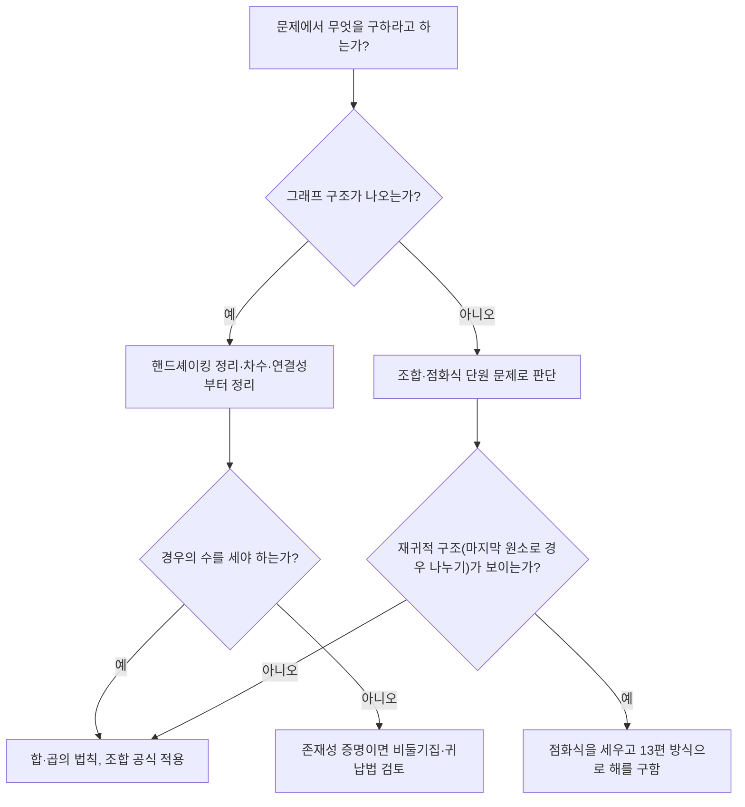

<Callout type="info">
  **이번 문서의 목표:** 이 문서를 다 읽으면 그래프의 차수·간선 관계를 조합·비둘기집 원리와 결합해 풀고, 조합적 상황을 점화식으로 세운 뒤 실제로 검산하며, 독학사 종합형 문제의 풀이 순서를 스스로 설계할 수 있다.
</Callout>

지금까지 조합·세기(09~10편), 정수론(11편), 점화관계(12~13편), 그래프·트리(14~15편), 귀납법 심화(18편)를 각각 독립된 단원으로 배웠다. 그러나 독학사 시험의 변별력 있는 문제는 이 단원들을 **한 문제 안에서 섞어** 낸다 — 그래프 문제를 풀다가 조합 계산이 필요하거나, 점화식을 세우는 데 그래프의 구조를 읽어야 하는 식이다. 이 편은 그런 결합 지점을 실제 문제로 연습한다. 아래 각 절에서 필요한 배경 개념은 해당 편을 다시 요약하지 않고 "자세한 내용은 NN편"으로만 짚고 넘어간다.

## 그래프의 차수와 세기를 함께 묻는 문제

> **쉽게 말하면:** 차수의 합은 항상 간선 수의 2배라는 사실(핸드셰이킹 정리) 하나만 알면, 차수·간선·정점 수 중 두 가지만으로 나머지 하나를 계산할 수 있다.

14편에서 다룬 **핸드셰이킹 정리**(handshaking theorem, 그래프의 모든 정점 차수를 더하면 항상 간선 수의 2배가 된다는 정리)를 실제 계산에 응용해보자.

**문제.** 정점이 15개인 트리(15편에서 배운, 순환이 없는 연결그래프)가 있다. 이 트리의 간선 수와 모든 정점의 차수를 합한 값은 각각 얼마인가?

**풀이.** 15편에서 정리하고 18편에서 귀납적으로 증명했듯, 정점이 $n$개인 트리는 간선이 항상 $n-1$개다.

$$
\text{간선 수} = 15 - 1 = 14
$$

핸드셰이킹 정리에 의해 모든 정점의 차수 합은 간선 수의 2배다.

$$
\text{차수의 합} = 2 \times 14 = 28
$$

**검산.** 정점 15개짜리 별 모양 트리(한 중심 정점이 나머지 14개와 모두 연결된 트리)를 생각하면, 중심 정점의 차수는 14, 나머지 14개 정점은 각각 차수 1이다. 차수 합은 $14 + 14\times1 = 28$로 위 계산과 일치한다(검산 완료).

## 비둘기집 원리와 그래프를 결합한 존재성 증명

> **쉽게 말하면:** 정점이 2개 이상인 단순그래프에는 반드시 차수가 같은 정점이 두 개 이상 존재한다 — 이유는 비둘기집 원리다.

10편에서 배운 **비둘기집 원리**(pigeonhole principle, 물건 수가 상자 수보다 많으면 적어도 한 상자에는 물건이 2개 이상 들어간다는 원리)를 그래프 문제에 적용해보자.

**명제.** 정점이 $n$개($n \ge 2$)인 단순그래프(simple graph, 자기 자신으로 가는 간선과 중복 간선이 없는 그래프)에는 차수가 같은 정점이 적어도 두 개 존재한다.

**증명(서술형 답안 형식).**

1. 단순그래프에서 각 정점의 차수는 $0$부터 $n-1$까지 $n$가지 값 중 하나를 가질 수 있다.
2. 그런데 차수가 $0$인 정점(다른 어떤 정점과도 연결되지 않은 고립된 정점)과 차수가 $n-1$인 정점(나머지 모든 정점과 연결된 정점)은 **동시에 존재할 수 없다** — 차수 $n-1$인 정점이 있다면 그 정점은 다른 모든 정점과 연결되어 있어야 하므로, 어떤 정점도 차수 $0$일 수 없기 때문이다.
3. 따라서 $n$개의 정점이 실제로 가질 수 있는 차수 값은 $\{0,1,\ldots,n-1\}$ 중 $n-1$가지뿐이다(0과 $n-1$이 동시에 나올 수 없으므로).
4. 정점은 $n$개인데 실제 가능한 차수 값은 $n-1$가지이므로, 비둘기집 원리에 의해 적어도 두 정점이 같은 차수를 가져야 한다. $\blacksquare$

**작은 예로 검산.** $n=4$인 그래프를 생각하자. 차수가 나올 수 있는 값은 이론상 $\{0,1,2,3\}$ 4가지이지만, 실제로는 최대 3가지($\{1,2,3\}$이거나 $\{0,1,2\}$ 중 하나)만 쓰일 수 있다. 정점 4개에 값 3가지를 배정하면 반드시 하나는 겹친다 — 예를 들어 차수가 각각 $1,2,2,3$이거나 $0,1,1,2$인 식으로, 항상 최소 한 쌍은 차수가 같다(검산 완료).

## 완전그래프의 간선 수: 조합으로 세기

> **쉽게 말하면:** 완전그래프의 간선 수는 정점 중 2개를 고르는 조합의 수와 정확히 같다.

**완전그래프**(complete graph, 모든 정점 쌍이 간선으로 연결된 그래프) $K_n$의 간선 수를 09편의 조합(combination) 공식으로 세어보자. 간선 하나는 서로 다른 두 정점을 순서 없이 고른 것과 같으므로, $n$개의 정점 중 2개를 고르는 조합의 수가 곧 간선 수다.

$$
|E(K_n)| = \binom{n}{2} = \frac{n(n-1)}{2}
$$

- $\binom{n}{2}$: $n$개 중 순서 없이 2개를 뽑는 조합의 수
- $E(K_n)$: $K_n$의 간선 집합

**작은 예로 검산.** $K_4$(정점 4개짜리 완전그래프)의 간선 수를 공식으로 구하면

$$
\binom{4}{2} = \frac{4 \times 3}{2} = 6
$$

실제로 정점을 $1,2,3,4$라 하고 모든 쌍을 나열하면 $\{1,2\},\{1,3\},\{1,4\},\{2,3\},\{2,4\},\{3,4\}$로 정확히 6개다(검산 완료).

## 조합과 점화식이 함께 필요한 문제: 연속한 1이 없는 이진수열

> **쉽게 말하면:** 연속한 두 자리가 모두 1인 경우를 피하는 이진수열의 개수를 세려면, "마지막 자리가 뭐였는지"로 경우를 나눠 점화식을 세운다.

**문제.** 길이가 $n$인 이진수열(0과 1로만 이루어진 문자열) 중, 연속한 두 자리가 모두 1인 경우가 없는 수열의 개수 $a_n$을 구하는 점화식을 세워라.

**풀이.** 길이 $n$인 조건을 만족하는 수열을 마지막 자리로 나눠 생각한다(12편의 점화관계 세우는 방식과 같은 논리다).

- 마지막 자리가 **0**이면, 앞의 $n-1$자리는 조건을 만족하는 아무 수열이나 와도 된다 — 경우의 수 $a_{n-1}$.
- 마지막 자리가 **1**이면, 그 앞 자리(끝에서 두 번째)는 반드시 0이어야 하고(연속한 1을 피하려고), 그 앞의 $n-2$자리는 조건을 만족하는 아무 수열이나 와도 된다 — 경우의 수 $a_{n-2}$.

두 경우는 겹치지 않으므로 합의 법칙(09편)에 의해 더한다.

$$
a_n = a_{n-1} + a_{n-2}
$$

초기값은 직접 나열해서 구한다. $n=1$일 때 가능한 수열은 "0", "1" 두 개이므로 $a_1=2$이고, $n=2$일 때는 "00", "01", "10" 세 개다("11"은 제외되므로) $a_2=3$이다.

**검산: n=3을 두 가지 방법으로 구해 비교한다.** 점화식으로는 $a_3 = a_2+a_1 = 3+2 = 5$다. 직접 나열하면 길이 3인 이진수열 8개 중 "11"을 포함하지 않는 것은 $000,001,010,100,101$로 정확히 5개다(검산 완료).

**결과 해석.** 이 점화식은 13편에서 다룬 상수계수 선형 점화식과 형태가 같아 특성방정식으로 닫힌해를 구할 수 있고, 초기값만 다를 뿐 유명한 피보나치 수열(Fibonacci sequence)의 점화식과 정확히 같은 형태다. 조합적 상황(경우를 나누어 세는 것)이 점화식(재귀적 정의)으로 자연스럽게 이어진다는 것이 이 문제의 핵심이다.

## 그래프 구조를 조합으로 세기: 사이클 그래프의 신장트리 개수

> **쉽게 말하면:** 사이클 모양 그래프에서 간선 하나만 제거하면 항상 트리가 되므로, 신장트리의 개수는 "간선 하나를 고르는 방법의 수"와 같다.

15편에서 다룬 **신장트리**(spanning tree, 그래프의 모든 정점을 포함하면서 순환이 없는 부분그래프)의 개수를 세는 문제도 조합으로 풀리는 경우가 있다.

**문제.** 정점 $n$개가 원형으로 이어진 **사이클 그래프**(cycle graph) $C_n$(간선이 정확히 $n$개이고, 모든 정점이 순서대로 원을 이루며 연결된 그래프)의 신장트리는 몇 개인가?

**풀이.** $C_n$은 정점 $n$개, 간선 $n$개다. 신장트리는 정점 $n$개, 간선 $n-1$개인 부분그래프여야 하므로, $C_n$의 간선 $n$개 중 정확히 1개를 제거해야 한다. 사이클에서 아무 간선이나 하나를 제거하면 순환이 사라지고 모든 정점이 여전히 한 줄로 연결된 트리가 되므로, 어떤 간선을 제거해도 항상 신장트리가 만들어진다. 따라서 신장트리의 개수는 "$n$개의 간선 중 제거할 1개를 고르는 방법의 수"와 같다.

$$
\binom{n}{1} = n
$$

**작은 예로 검산.** $C_4$(정점 4개짜리 사이클)를 생각하면 간선은 4개다. 각 간선을 하나씩 제거해보면 4가지 모두 정점 4개가 한 줄로 이어진 트리가 되고, 서로 다른 간선을 제거했으므로 4개는 모두 다른 신장트리다. 공식 $n=4$와 정확히 일치한다(검산 완료).

## 종합형 문제를 만나면: 풀이 순서 설계하기

독학사 종합형 문제는 대개 다음 순서로 접근하면 실마리를 찾기 쉽다.

## 자주 틀리는 점

- **핸드셰이킹 정리를 "정점 수의 2배"로 착각한다.** 항상 차수의 합이 **간선 수**의 2배라는 것을 정확히 기억해야 한다.
- **비둘기집 원리를 적용할 때 "가능한 상자 수"를 잘못 센다.** 차수 문제에서는 0과 $n-1$이 동시에 나올 수 없다는 점을 빠뜨리고 상자 수를 $n$개로 잘못 세는 실수가 흔하다.
- **점화식을 세울 때 경우가 겹치는지 확인하지 않는다.** "마지막 자리가 0인 경우"와 "마지막 자리가 1인 경우"처럼 서로 겹치지 않게 나눠야 합의 법칙을 그대로 쓸 수 있다.
- **작은 예로 검산하는 것을 생략한다.** 종합형 문제일수록 공식을 세운 뒤 $n=3, 4$ 같은 작은 값으로 직접 나열해 맞는지 확인하는 습관이 실수를 크게 줄인다.

## 핵심 정리

- 핸드셰이킹 정리(차수의 합 = 간선 수의 2배)와 트리의 간선 수 공식(간선 수 = 정점 수 $-1$)을 함께 쓰면 그래프 계산 문제 대부분이 풀린다.
- 정점이 2개 이상인 단순그래프에는 항상 차수가 같은 정점이 있다는 사실은 비둘기집 원리로 증명하며, "가능한 차수 값의 개수가 정점 수보다 1개 적다"는 것이 핵심이다.
- 완전그래프의 간선 수, 사이클 그래프의 신장트리 개수처럼 그래프의 특정 구조를 세는 문제는 조합 공식 $\binom{n}{k}$로 직접 계산할 수 있는 경우가 많다.
- 조합적 상황을 "마지막 원소가 무엇인가"로 나누면 점화식이 자연스럽게 세워지고, 13편의 방법으로 닫힌해를 구할 수 있다.

## 마무리 복습

<Quiz
  questionNumber={1}
  question="정점이 20개인 트리의 간선 수와 모든 정점의 차수 합을 순서대로 구하면?"
  options={['간선 19개, 차수 합 19', '간선 20개, 차수 합 40', '간선 19개, 차수 합 38', '간선 20개, 차수 합 20']}
  correctAnswer={3}
  explanation="트리는 정점 수-1개의 간선을 가지므로 20-1=19개다. 핸드셰이킹 정리에 의해 차수의 합은 간선 수의 2배이므로 2x19=38이다."
  optionExplanations={['간선 수는 맞지만 차수 합은 간선 수를 2배 해야 하는데 그대로 쓴 값이다.', '간선 수를 정점 수와 같다고 잘못 계산한 값이다(트리는 정점 수-1이 간선 수다).', '정답이다. 간선 19개, 차수 합은 2x19=38이다.', '간선 수와 차수 합 모두 정점 수를 그대로 쓴 잘못된 값이다.']}
/>

<Quiz
  questionNumber={2}
  question="정점이 2개 이상인 단순그래프에는 차수가 같은 정점이 적어도 두 개 존재한다는 것을 증명할 때 사용하는 원리는?"
  options={['핸드셰이킹 정리', '비둘기집 원리', '파스칼의 규칙', '유클리드 알고리즘']}
  correctAnswer={2}
  explanation="차수 값이 실제로는 n개가 아니라 n-1가지만 가능하다는 사실과, 정점은 n개라는 사실을 결합해 비둘기집 원리로 적어도 두 정점의 차수가 같음을 증명한다."
  optionExplanations={['핸드셰이킹 정리는 차수의 합과 간선 수의 관계를 다루며, 이 존재성 증명에는 직접 쓰이지 않는다.', '정답이다. 상자 수(가능한 차수 값 n-1가지)보다 물건 수(정점 n개)가 많다는 것이 비둘기집 원리의 적용 지점이다.', '파스칼의 규칙은 이항계수 사이의 관계식으로 이 증명과는 무관하다.', '유클리드 알고리즘은 최대공약수 계산법으로 이 증명과는 무관하다.']}
/>

<Quiz
  questionNumber={3}
  question="정점이 n개인 단순그래프에서 정점의 차수가 실제로 가질 수 있는 값의 가짓수가 n-1인 이유는?"
  options={['그래프는 항상 연결되어 있어야 하기 때문이다', '차수 0과 차수 n-1인 정점이 같은 그래프에 동시에 존재할 수 없기 때문이다', '차수는 항상 짝수여야 하기 때문이다', '정점 수가 짝수여야 하기 때문이다']}
  correctAnswer={2}
  explanation="차수 n-1인 정점이 있으면 그 정점이 나머지 모든 정점과 연결되어 있어야 하므로, 어떤 정점도 차수 0(고립된 정점)일 수 없다. 따라서 0과 n-1은 같은 그래프에서 동시에 나올 수 없어 실제 가능한 값은 n-1가지로 줄어든다."
  optionExplanations={['단순그래프는 연결되어 있지 않아도 되며(비연결 그래프도 단순그래프다), 이 논증의 핵심 이유가 아니다.', '정답이다. 차수 0과 차수 n-1의 동시 존재 불가능성이 가능한 차수 값을 n-1가지로 줄인다.', '차수가 항상 짝수여야 한다는 조건은 없으며, 홀수 차수 정점도 얼마든지 존재할 수 있다.', '정점 수의 홀짝 여부는 이 논증과 관련이 없다.']}
/>

<Quiz
  questionNumber={4}
  question="완전그래프 K6(정점 6개)의 간선 수는?"
  options={['12개', '15개', '30개', '36개']}
  correctAnswer={2}
  explanation="완전그래프의 간선 수는 정점 중 2개를 뽑는 조합 6C2 = (6x5)/2 = 15개다."
  optionExplanations={['6과 2를 곱하고 나누지 않은 것과 유사한 계산 실수로 나오는 값이다.', '정답이다. 6C2 = (6x5)/2 = 15개다.', '6x5를 그대로 둔 값으로, 순서 없는 조합에서 2로 나누는 것을 빠뜨린 결과다.', '6x6을 계산한 값으로 조합 공식과 무관한 값이다.']}
/>

<Quiz
  questionNumber={5}
  question="길이 n인 이진수열 중 연속한 1이 없는 수열의 개수 a_n에 대해, a_1=2, a_2=3일 때 a_4의 값은?"
  options={['5', '7', '8', '13']}
  correctAnswer={3}
  explanation="점화식 a_n = a_(n-1) + a_(n-2)에 따라 a_3 = a_2+a_1 = 3+2 = 5이고, a_4 = a_3+a_2 = 5+3 = 8이다."
  optionExplanations={['이것은 a_3의 값이며 a_4가 아니다.', '이것은 a_4가 아니라 a_3+a_2를 잘못 더한 값 등 계산 실수로 나올 수 있는 값이다.', '정답이다. a_3=5를 먼저 구한 뒤 a_4=a_3+a_2=5+3=8을 계산한다.', '이것은 a_5(=a_4+a_3=8+5=13)의 값이며 a_4가 아니다.']}
/>

<Quiz
  questionNumber={6}
  question="사이클 그래프 C5(정점 5개가 원형으로 연결된 그래프)의 신장트리 개수는?"
  options={['1개', '4개', '5개', '10개']}
  correctAnswer={3}
  explanation="C_n의 신장트리 개수는 간선 n개 중 제거할 1개를 고르는 방법의 수와 같으므로 5C1 = 5개다."
  optionExplanations={['사이클의 어느 간선을 제거해도 서로 다른 신장트리가 되므로 1개가 아니다.', '이것은 정점 수-1(간선 수)에 해당하는 값이며 신장트리 개수가 아니다.', '정답이다. 5개의 간선 중 하나를 제거하는 5가지 방법이 곧 5개의 서로 다른 신장트리를 만든다.', '이것은 5C2 = 10을 계산한 값으로, 이 문제는 간선을 2개가 아니라 1개 고르는 문제다.']}
/>

## 참고 자료

- [국가평생교육진흥원 독학학위제](https://bdes.nile.or.kr)
- [MathWorld - Graph Theory](https://mathworld.wolfram.com/topics/GraphTheory.html)
