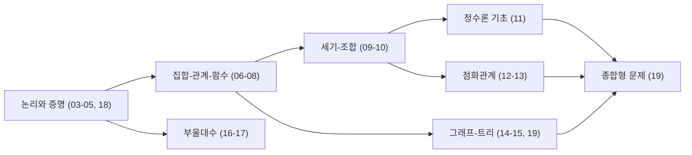

<Callout type="warning">
  **이 문서는 실제 기출 통계를 그대로 옮긴 것이 아닙니다.** 국가평생교육진흥원이 공개하는 이산수학 출제기준(평가영역)과 일반적인 이산수학 시험에서 반복적으로 나타나는 유형을 근거로 재구성한 경향 분석입니다. "최근 5년"이라는 표현은 일반적인 대학 이산수학·유사 자격시험에서 관찰되는 반복 패턴을 가리키는 것이지, 특정 회차의 실제 기출 문항 통계가 아닙니다. 실제 회차별 문항 수·배점·난이도 분포는 국가평생교육진흥원의 최신 시행 공고로 반드시 재확인해야 합니다.
</Callout>

## 단원별 출제 경향과 반복되는 함정

아래 표는 02~18편을 7개 출제기준 항목으로 묶어, 그 안에서 반복적으로 나타나는 문제 형태와 함정을 정리한 것이다. "문제 형태"는 객관식 사지선다 안에서 실제로 자주 쓰이는 발문 패턴을, "빈출 함정"은 오답을 고르게 만드는 전형적인 착각을 뜻한다.

| 출제기준 항목 | 대응 편 | 자주 나오는 문제 형태 | 빈출 함정 |
|---|---|---|---|
| 논리와 증명 | 02–04, 17 | 진리표 완성, 논리적 등가 판별, 증명 방법 구분(직접·대우·모순·귀납) | 조건문의 역·이·대우를 서로 혼동, 귀류법과 대우 증명법의 구조를 같은 것으로 착각 |
| 집합·관계·함수 | 05–07 | 집합 연산 계산, 관계의 성질(반사·대칭·추이) 판정, 단사·전사·전단사 구분 | 대칭성만 확인하고 추이성 확인을 생략, 정의역·공역 크기만으로 성급하게 단사·전사를 단정 |
| 세기·조합 | 08–09 | 순열·조합·중복조합 구분, 포함배제원리 적용, 비둘기집 원리로 존재성 증명 | 순서를 고려해야 하는데 조합 공식을 쓰거나 그 반대, 포함배제에서 교집합 항을 빼는 것을 빠뜨림 |
| 정수론 기초 | 10 | 유클리드 호제법으로 최대공약수 계산, 합동식의 나머지 계산 | 나눗셈 몫과 나머지를 뒤바꿔 대입, 최대공약수·최소공배수 공식의 곱셈 관계를 혼동 |
| 점화관계 | 11–12 | 특성방정식 세우기, 근의 종류별 일반해 형태 선택, 초기조건 대입 | 중근인데 서로 다른 두 실근 공식을 그대로 사용, 판별식 부호 계산 실수 |
| 그래프·트리 | 13–14, 18 | 차수 합과 간선 수 관계, 오일러 경로·회로 판정, 트리의 정점·간선 수 관계 | 오일러 판정 조건(차수의 짝홀)을 해밀턴 회로에도 그대로 적용, 차수 합 공식에서 2를 곱하는 것을 빠뜨림 |
| 부울대수 | 15–16 | 부울 법칙 이름 대며 논리식 간소화, 카르노 맵으로 최소 SOP 구하기 | 법칙 이름을 대지 않고 결과만 적어 서술형 감점, 카르노 맵에서 그레이 코드 순서 대신 보통 이진수 순서로 배열 |

이 관계도가 보여주는 것은, **종합형 문제(18편)가 정수론·점화관계·그래프·트리를 한 문제 안에서 섞어 낸다**는 점이다. 그래서 18편 이전 단원 각각을 따로 익혔더라도, 두세 단원이 한 문제에 얽힌 형태를 접해 본 적이 없으면 실전에서 당황하기 쉽다.

## 옳지 않은 것을 고르는 문항에 대한 접근법

독학사 이산수학은 "다음 중 옳지 않은 것은?" 형태의 발문이 특히 많다. 이 유형은 네 보기 중 세 개가 참인 진술이고 하나만 거짓인 진술이므로, 정답을 빨리 찾으려고 첫눈에 이상해 보이는 보기 하나만 고르면 함정에 걸리기 쉽다. 권장하는 순서는 다음과 같다.

## 자주 틀리는 점

- **단원별 공식만 외우고 "왜 그런지"는 넘어가는 실수.** 예를 들어 포함배제원리의 부호(더하고 빼는 순서)를 이유 없이 외우면, 세 집합·네 집합으로 확장된 문제에서 부호를 헷갈린다. 08~09편에서 다룬 "왜 두 번 세어지는가"라는 직관을 함께 기억해야 한다.
- **종합형 문제(18편)를 별도 단원처럼 취급하지 않는 실수.** 종합형은 새로운 개념이 아니라 이미 배운 개념 두세 개를 이어 붙인 것이므로, 어느 개념들이 섞였는지 식별하는 연습이 우선이다.
- **경향 분석을 암기 대상으로 여기는 실수.** 이 문서의 표는 "어디를 먼저 볼지" 정하는 도구이지, 표 자체를 외운다고 문제가 풀리지는 않는다. 실제 계산·증명 절차는 각 본론 편(02~18편)에서 다시 손으로 연습해야 한다.

## 핵심 정리

- 이 문서의 경향·우선순위는 실제 기출 통계가 아니라 출제기준과 일반적인 이산수학 시험 패턴에 근거한 재구성이다.
- 논리·집합·조합·정수론·점화식·그래프·부울대수 7개 항목 각각에서 반복되는 문제 형태와 함정이 있으며, 그중 그래프·트리와 점화관계가 체감 난이도와 복습 우선순위가 가장 높다.
- "옳지 않은 것을 고르시오" 유형은 네 보기를 독립적으로 판단하고, 정답을 찾은 뒤 나머지 세 보기도 참인지 재확인하는 순서로 접근한다.
- 종합형 문제(18편)는 새 개념이 아니라 기존 개념의 조합이므로, 어떤 개념이 섞였는지 식별하는 것이 우선이다.

## 마무리 복습

이 25문항은 02~18편 전체를 한 번씩 훑으며, 각 단원에서 앞서 정리한 "빈출 함정"을 직접 확인해 보는 문제로 구성했다.

## 확인 문제

<Quiz
  questionNumber={1}
  question={"명제 p→q(조건문)의 역(converse)에 해당하는 것은?"}
  options={["q→p","¬p→¬q","¬q→¬p","p→q"]}
  correctAnswer={1}
  explanation={"조건문 p→q에서 가정과 결론의 자리를 서로 바꾼 것이 역이다. p→q의 역은 q→p이다."}
/>

<Quiz
  questionNumber={2}
  question={"명제와 그 대우(contrapositive)의 진리값 관계로 옳은 것은?"}
  options={["항상 같다(논리적으로 동치이다)","항상 반대다","p, q의 값에 따라 관계가 달라진다","비교할 수 없다"]}
  correctAnswer={1}
  explanation={"p→q와 그 대우 ¬q→¬p는 모든 p, q 조합에서 항상 같은 진리값을 갖는 논리적 동치 관계이다. 이 성질이 바로 대우 증명법의 근거가 된다."}
/>

<Quiz
  questionNumber={3}
  question={"수학적 귀납법에서 기초 단계(base case)를 확인하지 않고 귀납 단계만 증명했을 때 발생하는 문제는?"}
  options={["귀납 단계가 참이어도 애초에 명제가 성립하는 자연수가 하나도 확인되지 않아 증명이 완성되지 않는다","증명 속도가 느려질 뿐 결론에는 영향이 없다","기초 단계는 생략해도 되는 형식적 절차일 뿐이다","귀납 단계만으로 모든 자연수에 대해 자동으로 참이 증명된다"]}
  correctAnswer={1}
  explanation={"귀납 단계는 'n=k에서 참이면 n=k+1에서도 참이다'라는 조건문일 뿐이므로, 애초에 어떤 자연수에서도 참임이 확인되지 않으면 이 조건문 자체가 공허하게 참이어도 실제로 성립하는 사례가 하나도 없을 수 있다. 기초 단계가 도미노의 첫 번째 조각을 넘어뜨리는 역할을 한다."}
/>

<Quiz
  questionNumber={4}
  question={"원소 수가 5인 집합의 멱집합(power set)의 원소 수는?"}
  options={["10","16","25","32"]}
  correctAnswer={4}
  explanation={"원소 수가 n인 집합의 멱집합 크기는 2의 n제곱이다. n=5이므로 2의 5제곱인 32이다."}
/>

<Quiz
  questionNumber={5}
  question={"집합 A, B에 대해 드모르간 법칙에 따라 교집합의 여집합 (A∩B)의 여집합과 같은 것은?"}
  options={["A의 여집합과 B의 여집합의 합집합","A의 여집합과 B의 여집합의 교집합","A와 B의 합집합","A와 B의 교집합"]}
  correctAnswer={1}
  explanation={"집합의 드모르간 법칙에 따르면 교집합의 여집합은 각 집합의 여집합끼리의 합집합과 같다. (A∩B)의 여집합은 A의 여집합과 B의 여집합의 합집합이다."}
/>

<Quiz
  questionNumber={6}
  question={"원소 수가 각각 2, 3, 2인 세 집합 A, B, C의 데카르트 곱 A×B×C의 원소 수는?"}
  options={["7","8","10","12"]}
  correctAnswer={4}
  explanation={"데카르트 곱의 원소 수는 각 집합의 원소 수를 모두 곱한 값이다. 2×3×2=12이다."}
/>

<Quiz
  questionNumber={7}
  question={"관계 R이 대칭적이면서 동시에 반대칭적일 수 있는 경우로 옳은 것은?"}
  options={["R의 모든 순서쌍이 (a, a) 형태(자기 자신과의 관계)로만 이루어진 경우","R이 공집합인 경우를 제외하면 절대 불가능하다","R이 전순서 관계일 때만 가능하다","R이 반사적이지 않을 때만 가능하다"]}
  correctAnswer={1}
  explanation={"대칭성은 aRb이면 bRa여야 하고, 반대칭성은 aRb이고 bRa이면 a=b여야 한다는 조건이다. 두 조건을 동시에 만족하려면, aRb인 모든 경우에서 결국 a=b여야 하므로 R은 (a, a) 형태의 순서쌍만으로 이루어질 수 있다(공집합인 경우도 두 조건을 공허하게 만족한다)."}
/>

<Quiz
  questionNumber={8}
  question={"정의역과 공역의 원소 수가 모두 5로 같은 함수가 전사(onto)임이 확인되었다면, 이 함수에 대해 추가로 확인할 필요 없이 결론지을 수 있는 것은?"}
  options={["이 함수는 반드시 단사(일대일)이기도 하므로 전단사이다","이 함수는 단사가 아닐 수도 있다","이 함수는 항등함수여야 한다","이 함수는 반드시 상수함수이다"]}
  correctAnswer={1}
  explanation={"정의역과 공역의 크기가 같은 유한집합 사이의 함수에서는 전사와 단사가 서로를 함축한다. 전사라면 공역의 5개 원소 모두가 어떤 입력의 출력이 되어야 하는데, 정의역도 5개뿐이므로 서로 다른 입력이 같은 출력을 내는 경우(비둘기집 원리로 보면 여유 자리가 없다)가 생길 수 없어 단사도 자동으로 성립한다."}
/>

<Quiz
  questionNumber={9}
  question={"f(x)=x+2, g(x)=3x일 때, 합성함수 (g∘f)(1)의 값은?"}
  options={["5","7","9","11"]}
  correctAnswer={3}
  explanation={"(g∘f)(x)=g(f(x))이므로 f를 먼저 적용한다. f(1)=1+2=3이고, 그 결과를 g에 대입하면 g(3)=3×3=9이다."}
/>

<Quiz
  questionNumber={10}
  question={"서로 다른 6장의 카드에서 2장을 순서를 고려해 뽑아 배열하는 경우의 수는?"}
  options={["15","21","30","36"]}
  correctAnswer={3}
  explanation={"순서를 고려하는 순열이므로 P(6,2)=6×5=30이다."}
/>

<Quiz
  questionNumber={11}
  question={"이항계수 C(9,2)의 값은?"}
  options={["18","27","36","45"]}
  correctAnswer={3}
  explanation={"C(9,2)=9×8을 2×1로 나눈 값이다. 9×8=72이고 72를 2로 나누면 36이다."}
/>

<Quiz
  questionNumber={12}
  question={"학생 40명 중 영어를 좋아하는 학생이 25명, 수학을 좋아하는 학생이 20명, 두 과목을 모두 좋아하는 학생이 10명일 때, 영어와 수학 중 어느 것도 좋아하지 않는 학생 수는?"}
  options={["5","10","15","25"]}
  correctAnswer={1}
  explanation={"포함배제원리로 영어 또는 수학을 좋아하는 학생 수를 구하면 25+20-10=35명이다. 전체 40명에서 이를 빼면 40-35=5명이 어느 것도 좋아하지 않는 학생이다."}
/>

<Quiz
  questionNumber={13}
  question={"유클리드 호제법으로 84와 30의 최대공약수를 구하는 과정으로 옳은 것은?"}
  options={["84=30×2+24, 30=24×1+6, 24=6×4+0 이므로 gcd는 6이다","84=30×2+24, 30=24×1+6, 24=6×3+6 이므로 gcd는 30이다","84와 30을 각각 소인수분해해야만 구할 수 있다","84÷30을 계속 반복하면 gcd는 0이 된다"]}
  correctAnswer={1}
  explanation={"유클리드 호제법은 나머지가 0이 될 때까지 나눗셈을 반복한다. 84를 30으로 나누면 몫 2, 나머지 24이고, 30을 24로 나누면 몫 1, 나머지 6이며, 24를 6으로 나누면 나머지가 0이 된다. 나머지가 0이 되기 직전의 나누는 수인 6이 최대공약수다."}
/>

<Quiz
  questionNumber={14}
  question={"23을 7로 나눈 나머지를 이용할 때, 23≡x (mod 7)를 만족하는 0 이상 7 미만의 x값은?"}
  options={["1","2","3","4"]}
  correctAnswer={2}
  explanation={"23을 7로 나누면 7×3=21이고 23-21=2이므로 나머지는 2이다. 따라서 x=2이다."}
/>

<Quiz
  questionNumber={15}
  question={"점화식 a_n = 6a_(n-1) - 9a_(n-2)의 특성방정식과 근의 종류로 옳은 것은?"}
  options={["r^2 - 6r + 9 = 0, 중근 r=3","r^2 - 6r - 9 = 0, 서로 다른 두 실근","r^2 + 6r + 9 = 0, 켤레복소근","r^2 - 9r + 6 = 0, 서로 다른 두 실근"]}
  correctAnswer={1}
  explanation={"c1=6, c2=-9이므로 특성방정식은 r^2 - 6r - (-9) = r^2 - 6r + 9 = 0이다. 이를 인수분해하면 (r-3)^2=0이므로 r=3인 중근을 갖는다."}
/>

<Quiz
  questionNumber={16}
  question={"문제 15의 점화식 a_n = 6a_(n-1) - 9a_(n-2)에서 a_0 = 1, a_1 = 6일 때, 일반해 (A+Bn)×3^n의 A, B 값은?"}
  options={["A=1, B=1","A=1, B=2","A=3, B=1","A=1, B=3"]}
  correctAnswer={1}
  explanation={"n=0을 대입하면 A×3^0=A=1이다. n=1을 대입하면 (A+B)×3=6이므로 A+B=2이고, A=1이므로 B=1이다."}
/>

<Quiz
  questionNumber={17}
  question={"점화식 a_n = 3a_(n-1), a_0 = 5일 때 a_3의 값은?"}
  options={["15","45","135","405"]}
  correctAnswer={3}
  explanation={"점화식을 직접 반복 적용한다. a_1=3×5=15, a_2=3×15=45, a_3=3×45=135이다."}
/>

<Quiz
  questionNumber={18}
  question={"피보나치형 점화식 a_n = a_(n-1) + a_(n-2)에서 초기조건으로 a_0 = 0 하나만 주어졌을 때 생기는 문제는?"}
  options={["a_1의 값을 정할 수 없어 무수히 많은 수열이 이 조건을 동시에 만족한다","점화식 자체가 성립하지 않는다","a_0=0이므로 모든 항이 자동으로 0이 된다","2차 점화식이 아니라 1차 점화식으로 바뀐다"]}
  correctAnswer={1}
  explanation={"2차 점화식의 일반해에는 임의상수가 2개 있으므로, 이를 확정하려면 초기조건도 2개(a_0, a_1)가 필요하다. a_0=0 하나만으로는 a_1을 자유롭게 어떤 값으로 두어도 점화식과 그 하나의 조건을 동시에 만족하므로, 수열이 유일하게 정해지지 않는다."}
/>

<Quiz
  questionNumber={19}
  question={"어떤 연결 그래프의 정점 5개의 차수가 각각 3, 3, 2, 2, 2일 때, 이 그래프의 간선 수는?"}
  options={["4","5","6","12"]}
  correctAnswer={3}
  explanation={"핸드셰이킹 정리(악수 정리)에 따르면 모든 정점의 차수 합은 간선 수의 2배와 같다. 차수 합은 3+3+2+2+2=12이므로, 간선 수는 12를 2로 나눈 6이다."}
/>

<Quiz
  questionNumber={20}
  question={"어떤 연결 그래프의 정점이 5개, 간선이 4개이고 사이클이 전혀 없을 때, 이 그래프에 대한 설명으로 옳은 것은?"}
  options={["이 그래프는 반드시 트리다","이 그래프는 스패닝 트리를 가질 수 없다","이 그래프는 오일러 회로를 반드시 갖는다","이 그래프는 해밀턴 회로를 반드시 갖는다"]}
  correctAnswer={1}
  explanation={"트리는 사이클이 없는 연결 그래프로 정의된다. 정점 5개, 간선 4개(=5-1)이고 사이클이 없다는 조건은 트리의 정의와 정점-간선 수 관계를 모두 만족하므로 이 그래프는 트리다."}
/>

<Quiz
  questionNumber={21}
  question={"어떤 연결 그래프의 모든 정점 차수가 짝수이면서, 차수가 홀수인 정점이 전혀 없을 때 반드시 성립하는 것은?"}
  options={["오일러 회로가 존재한다","해밀턴 회로가 존재한다","이 그래프는 트리다","스패닝 트리가 존재하지 않는다"]}
  correctAnswer={1}
  explanation={"모든 정점의 차수가 짝수라는 것은 오일러 회로 존재의 필요충분조건이므로, 오일러 회로가 반드시 존재한다."}
/>

<Quiz
  questionNumber={22}
  question={"부울식 A + AB(A와 B의 곱을 A에 더한 식)를 간소화하면?"}
  options={["A","B","AB","A+B"]}
  correctAnswer={1}
  explanation={"흡수법칙(absorption law)에 따르면 A + AB = A가 성립한다. A=1일 때 AB의 값과 무관하게 전체 식이 1이 되고, A=0일 때는 AB도 항상 0이 되어 전체 식이 0이 되므로, 이 식은 결국 A의 값과 정확히 같다."}
/>

<Quiz
  questionNumber={23}
  question={"3변수 카르노 맵에서 8칸(전체) 모두를 하나로 묶었을 때 남는 결과는?"}
  options={["1(상수 참)","0(상수 거짓)","세 변수가 모두 그대로 남는다","한 변수만 남고 나머지는 소거된다"]}
  correctAnswer={1}
  explanation={"카르노 맵에서 2의 k제곱 칸을 묶으면 k개의 변수가 소거된다. 8칸은 2의 3제곱이므로 3개의 변수가 모두 소거되어 상수 1(항상 참)만 남는다."}
/>

<Quiz
  questionNumber={24}
  question={"정점이 6개인 완전그래프(모든 정점 쌍이 간선으로 연결된 그래프)의 간선 수는?"}
  options={["12","15","18","30"]}
  correctAnswer={2}
  explanation={"완전그래프의 간선 수는 정점 6개 중 2개를 뽑는 조합의 수와 같다. C(6,2)=6×5/(2×1)=30/2=15이다."}
/>

<Quiz
  questionNumber={25}
  question={"독학사 시험에서 '다음 중 옳지 않은 것은?' 유형의 문항을 풀 때 가장 올바른 접근은?"}
  options={["보기 네 개 각각의 참·거짓을 정의에 따라 하나씩 판단한 뒤, 유일하게 거짓인 보기를 답으로 고른다","가장 복잡해 보이는 보기를 곧바로 답으로 고른다","앞의 세 보기가 비슷해 보이면 확인 없이 나머지 하나를 답으로 고른다","시간이 부족하면 첫 번째 보기를 답으로 찍는다"]}
  correctAnswer={1}
  explanation={"이 유형은 네 보기 중 정확히 하나만 거짓인 진술이다. 각 보기를 정의(반사·대칭·추이, 오일러·해밀턴 판정 조건 등)에 따라 독립적으로 판단하고, 거짓인 보기를 찾은 뒤 나머지 세 보기가 실제로 참인지 재확인하는 것이 실수를 줄이는 방법이다."}
/>

## 참고 자료

- [국가평생교육진흥원 독학학위제 - 과목별 평가영역](https://bdes.nile.or.kr) — 이산수학 출제기준 최신 공고 확인
- [Wolfram MathWorld — Discrete Mathematics](https://mathworld.wolfram.com/topics/DiscreteMathematics.html)
