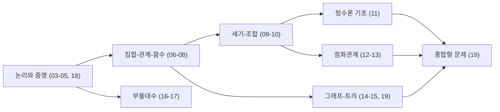

<Callout type="warning">
  **이 문서는 실제 기출 통계를 그대로 옮긴 것이 아닙니다.** 국가평생교육진흥원이 공개하는 이산수학 출제기준(평가영역)과 일반적인 이산수학 시험에서 반복적으로 나타나는 유형을 근거로 재구성한 경향 분석입니다. "최근 5년"이라는 표현은 일반적인 대학 이산수학·유사 자격시험에서 관찰되는 반복 패턴을 가리키는 것이지, 특정 회차의 실제 기출 문항 통계가 아닙니다. 실제 회차별 문항 수·배점·난이도 분포는 국가평생교육진흥원의 최신 시행 공고로 반드시 재확인해야 합니다.
</Callout>

## 단원별 출제 경향과 반복되는 함정

아래 표는 02~18편을 7개 출제기준 항목으로 묶어, 그 안에서 반복적으로 나타나는 문제 형태와 함정을 정리한 것이다. "문제 형태"는 객관식 사지선다 안에서 실제로 자주 쓰이는 발문 패턴을, "빈출 함정"은 오답을 고르게 만드는 전형적인 착각을 뜻한다.

| 출제기준 항목 | 대응 편 | 자주 나오는 문제 형태 | 빈출 함정 |
|---|---|---|---|
| 논리와 증명 | 02–04, 17 | 진리표 완성, 논리적 등가 판별, 증명 방법 구분(직접·대우·모순·귀납) | 조건문의 역·이·대우를 서로 혼동, 귀류법과 대우 증명법의 구조를 같은 것으로 착각 |
| 집합·관계·함수 | 05–07 | 집합 연산 계산, 관계의 성질(반사·대칭·추이) 판정, 단사·전사·전단사 구분 | 대칭성만 확인하고 추이성 확인을 생략, 정의역·공역 크기만으로 성급하게 단사·전사를 단정 |
| 세기·조합 | 08–09 | 순열·조합·중복조합 구분, 포함배제원리 적용, 비둘기집 원리로 존재성 증명 | 순서를 고려해야 하는데 조합 공식을 쓰거나 그 반대, 포함배제에서 교집합 항을 빼는 것을 빠뜨림 |
| 정수론 기초 | 10 | 유클리드 호제법으로 최대공약수 계산, 합동식의 나머지 계산 | 나눗셈 몫과 나머지를 뒤바꿔 대입, 최대공약수·최소공배수 공식의 곱셈 관계를 혼동 |
| 점화관계 | 11–12 | 특성방정식 세우기, 근의 종류별 일반해 형태 선택, 초기조건 대입 | 중근인데 서로 다른 두 실근 공식을 그대로 사용, 판별식 부호 계산 실수 |
| 그래프·트리 | 13–14, 18 | 차수 합과 간선 수 관계, 오일러 경로·회로 판정, 트리의 정점·간선 수 관계 | 오일러 판정 조건(차수의 짝홀)을 해밀턴 회로에도 그대로 적용, 차수 합 공식에서 2를 곱하는 것을 빠뜨림 |
| 부울대수 | 15–16 | 부울 법칙 이름 대며 논리식 간소화, 카르노 맵으로 최소 SOP 구하기 | 법칙 이름을 대지 않고 결과만 적어 서술형 감점, 카르노 맵에서 그레이 코드 순서 대신 보통 이진수 순서로 배열 |

이 관계도가 보여주는 것은, **종합형 문제(18편)가 정수론·점화관계·그래프·트리를 한 문제 안에서 섞어 낸다**는 점이다. 그래서 18편 이전 단원 각각을 따로 익혔더라도, 두세 단원이 한 문제에 얽힌 형태를 접해 본 적이 없으면 실전에서 당황하기 쉽다.

## 옳지 않은 것을 고르는 문항에 대한 접근법

독학사 이산수학은 "다음 중 옳지 않은 것은?" 형태의 발문이 특히 많다. 이 유형은 네 보기 중 세 개가 참인 진술이고 하나만 거짓인 진술이므로, 정답을 빨리 찾으려고 첫눈에 이상해 보이는 보기 하나만 고르면 함정에 걸리기 쉽다. 권장하는 순서는 다음과 같다.

## 자주 틀리는 점

- **단원별 공식만 외우고 "왜 그런지"는 넘어가는 실수.** 예를 들어 포함배제원리의 부호(더하고 빼는 순서)를 이유 없이 외우면, 세 집합·네 집합으로 확장된 문제에서 부호를 헷갈린다. 08~09편에서 다룬 "왜 두 번 세어지는가"라는 직관을 함께 기억해야 한다.
- **종합형 문제(18편)를 별도 단원처럼 취급하지 않는 실수.** 종합형은 새로운 개념이 아니라 이미 배운 개념 두세 개를 이어 붙인 것이므로, 어느 개념들이 섞였는지 식별하는 연습이 우선이다.
- **경향 분석을 암기 대상으로 여기는 실수.** 이 문서의 표는 "어디를 먼저 볼지" 정하는 도구이지, 표 자체를 외운다고 문제가 풀리지는 않는다. 실제 계산·증명 절차는 각 본론 편(02~18편)에서 다시 손으로 연습해야 한다.

## 핵심 정리

- 이 문서의 경향·우선순위는 실제 기출 통계가 아니라 출제기준과 일반적인 이산수학 시험 패턴에 근거한 재구성이다.
- 논리·집합·조합·정수론·점화식·그래프·부울대수 7개 항목 각각에서 반복되는 문제 형태와 함정이 있으며, 그중 그래프·트리와 점화관계가 체감 난이도와 복습 우선순위가 가장 높다.
- "옳지 않은 것을 고르시오" 유형은 네 보기를 독립적으로 판단하고, 정답을 찾은 뒤 나머지 세 보기도 참인지 재확인하는 순서로 접근한다.
- 종합형 문제(18편)는 새 개념이 아니라 기존 개념의 조합이므로, 어떤 개념이 섞였는지 식별하는 것이 우선이다.

## 마무리 복습

이 25문항은 02~18편 전체를 한 번씩 훑으며, 각 단원에서 앞서 정리한 "빈출 함정"을 직접 확인해 보는 문제로 구성했다.

## 확인 문제

<Quiz
  questionNumber={1}
  question={"명제 p→q(조건문)의 역(converse)에 해당하는 것은?"}
  options={["q→p","¬p→¬q","¬q→¬p","p→q"]}
  correctAnswer={1}
  explanation={"조건문 p→q에서 가정과 결론의 자리를 서로 바꾼 것이 역이다. p→q의 역은 q→p이다."}
/>

<Quiz
  questionNumber={2}
  question={"명제와 그 대우(contrapositive)의 진리값 관계로 옳은 것은?"}
  options={["항상 같다(논리적으로 동치이다)","항상 반대다","p, q의 값에 따라 관계가 달라진다","비교할 수 없다"]}
  correctAnswer={1}
  explanation={"p→q와 그 대우 ¬q→¬p는 모든 p, q 조합에서 항상 같은 진리값을 갖는 논리적 동치 관계이다. 이 성질이 바로 대우 증명법의 근거가 된다."}
/>

<Quiz
  questionNumber={3}
  question={"수학적 귀납법에서 기초 단계(base case)를 확인하지 않고 귀납 단계만 증명했을 때 발생하는 문제는?"}
  options={["귀납 단계가 참이어도 애초에 명제가 성립하는 자연수가 하나도 확인되지 않아 증명이 완성되지 않는다","증명 속도가 느려질 뿐 결론에는 영향이 없다","기초 단계는 생략해도 되는 형식적 절차일 뿐이다","귀납 단계만으로 모든 자연수에 대해 자동으로 참이 증명된다"]}
  correctAnswer={1}
  explanation={"귀납 단계는 'n=k에서 참이면 n=k+1에서도 참이다'라는 조건문일 뿐이므로, 애초에 어떤 자연수에서도 참임이 확인되지 않으면 이 조건문 자체가 공허하게 참이어도 실제로 성립하는 사례가 하나도 없을 수 있다. 기초 단계가 도미노의 첫 번째 조각을 넘어뜨리는 역할을 한다."}
/>

## 참고 자료

- [국가평생교육진흥원 독학학위제 - 과목별 평가영역](https://bdes.nile.or.kr) — 이산수학 출제기준 최신 공고 확인
- [Wolfram MathWorld — Discrete Mathematics](https://mathworld.wolfram.com/topics/DiscreteMathematics.html)
