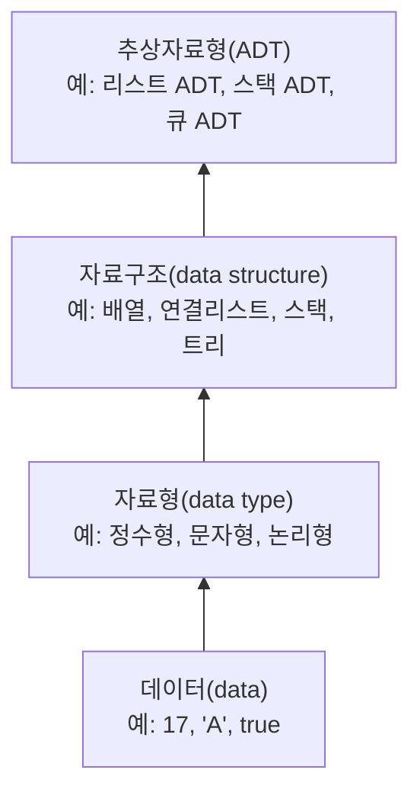

<Callout type="info">
  **이번 문서의 목표:** 이 문서를 다 읽으면 데이터, 자료형, 자료구조, 추상자료형(ADT)이라는 네 용어를 서로 헷갈리지 않고 구분해서 말할 수 있고, 어떤 문제를 보고 "이건 자료형 얘기인지 자료구조 얘기인지 ADT 얘기인지"를 즉시 가려낼 수 있다.
</Callout>

## 왜 용어부터 정리해야 하는가

독학사 2단계 자료구조 시험은 구현 코드를 짜는 시험이 아니라 **개념을 정확히 짝지을 수 있는지**를 묻는 시험이다. "다음 중 자료구조에 대한 설명으로 옳은 것은?"이나 "추상자료형에 대한 설명으로 옳지 않은 것은?" 같은 문항이 반복적으로 나오는데, 이 문항들을 틀리는 가장 흔한 이유는 개념을 몰라서가 아니라 **비슷하게 생긴 용어끼리 자리를 바꿔치기당해서**다. 자료형과 자료구조를 같은 말로 알고 있으면, "정수형은 자료구조다"처럼 틀린 문장을 옳다고 고르게 된다.

그래서 이 첫 편은 새로운 지식을 쌓기보다, 앞으로 17개 편에서 계속 쓰일 네 단어 데이터(data), 자료형(data type), 자료구조(data structure), 추상자료형(Abstract Data Type, 줄여서 ADT)을 하나의 위계 구조로 세워 놓는 데 집중한다. 이 위계를 한 번 제대로 잡아 두면, 뒤에 나올 배열·연결리스트·스택·트리·그래프 같은 구체적인 자료구조들이 전부 이 틀 안의 한 자리를 차지하는 것으로 보이기 시작한다.

## 데이터에서 자료구조까지 — 네 개념의 위계

네 용어는 서로 다른 층위에 있다. 아래에서 위로 올라가면서 "더 구체적인 값"에서 "더 추상적인 설계도"로 이동한다고 생각하면 순서가 잡힌다.

이 그림에서 화살표는 "포함 관계"가 아니라 "다루는 관점이 한 단계 더 추상적으로 올라간다"는 뜻으로 읽으면 된다. 데이터는 가장 구체적인 값 하나하나이고, 자료형은 그 값이 어떤 종류인지 정하는 분류이며, 자료구조는 여러 데이터를 묶어서 조직하는 방식이고, ADT는 그 조직 방식을 "무엇을 할 수 있는가"만 놓고 설명하는 명세다. 하나씩 순서대로 풀어보자.

### 데이터란 무엇인가

**데이터**(data)란 컴퓨터가 처리할 수 있는 형태로 표현된 값 그 자체를 말한다. `17`이라는 숫자, `'A'`라는 문자, `true`라는 논리값, 학생 한 명의 이름과 학번을 묶은 정보까지 전부 데이터다. 데이터는 그 자체로는 아무 규칙도 갖고 있지 않다. `17`이 나이인지, 점수인지, 배열의 크기인지는 데이터만 봐서는 알 수 없다. 그 값에 "너는 정수야"라는 규칙을 붙여 주는 것이 다음 단계인 자료형이다.

> **쉽게 말하면:** 데이터는 프로그램이 다루는 값 하나하나이고, 아직 아무런 규칙도 붙지 않은 날것의 값이다.

### 자료형이란 무엇인가

**자료형**(data type)이란 데이터가 어떤 종류의 값이고, 그 값에 어떤 연산을 적용할 수 있는지를 정해 놓은 분류 규칙이다. 정수형(integer)에는 덧셈·뺄셈 같은 산술 연산이 허용되고, 문자형(character)에는 산술 연산 대신 비교나 아스키(ASCII) 코드 변환 같은 연산이 어울린다. 자료형은 크게 두 갈래로 나뉜다.

- **기본 자료형**(primitive data type): 프로그래밍 언어가 처음부터 제공하는, 더 이상 쪼갤 수 없는 자료형이다. 정수형, 실수형, 문자형, 논리형이 여기 속한다. C 언어의 `int`, `float`, `char`가 대표적인 예다.
- **구조형 자료형**(structured data type, 사용자 정의 자료형이라고도 부른다): 기본 자료형을 여러 개 묶어서 만든 자료형이다. 배열, 구조체(struct), 그리고 이 과목의 주인공인 자료구조들이 넓게 보면 여기 속한다.

여기서 첫 번째 헷갈림 포인트가 나온다. "자료형"과 "자료구조"는 다른 말이다. 정수형은 자료형이지 자료구조가 아니다. 자료구조는 다음 단계에서 다룬다.

> **쉽게 말하면:** 자료형은 "이 값이 무슨 종류이고 무엇을 할 수 있는가"를 정하는 규칙이고, 정수형·실수형·문자형·논리형처럼 언어가 기본으로 주는 것과, 배열·구조체처럼 그것들을 묶어 만든 것으로 나뉜다.

### 자료구조란 무엇인가

**자료구조**(data structure)란 여러 개의 데이터를 효율적으로 저장하고, 꺼내고, 수정하기 위해 조직하는 방식이다. 정의에서 중요한 단어는 "효율적으로"다. 데이터 100개를 그냥 아무렇게나 늘어놓아도 저장은 되지만, 그 중 하나를 찾으려면 처음부터 끝까지 다 뒤져야 할 수도 있다. 자료구조는 "데이터를 어떤 모양으로 배치하면, 찾기·넣기·빼기 같은 연산을 더 빠르게 또는 더 적은 메모리로 할 수 있는가"라는 질문에 대한 답이다.

예를 들어 학생 30명의 성적을 순서대로 늘어놓고 앞에서부터 처례로 확인하는 방식은 **배열**(array)이라는 자료구조를 쓴 것이고, 최근에 처리해야 할 일을 쌓아 두었다가 가장 나중에 넣은 것부터 꺼내 쓰는 방식은 **스택**(stack)이라는 자료구조를 쓴 것이다. 자료구조를 무엇으로 고르느냐에 따라 같은 작업이라도 처리 속도와 사용하는 메모리가 크게 달라진다. 이 "속도와 메모리를 비교하는 방법"이 바로 다음 편(02편)에서 다룰 시간·공간 복잡도다.

> **쉽게 말하면:** 자료구조는 데이터 여러 개를 어떤 모양으로 쌓아 놓을지 정하는 설계 방식이며, 이 과목이 다루는 배열·연결리스트·스택·큐·트리·그래프·해시가 전부 자료구조의 구체적인 예다.

### 추상자료형(ADT)이란 무엇인가

**추상자료형**(Abstract Data Type, ADT)이란 자료구조가 "무엇을 할 수 있는가"만 명세하고, "그것을 어떻게 구현하는가"는 감춰 놓은 설계도다. 여기서 "추상"(abstract)이라는 단어가 핵심이다. 추상적이라는 것은 세부 구현을 보지 않고 겉으로 드러난 기능만 본다는 뜻이다.

예를 들어 스택 ADT는 다음 네 가지 연산만 약속한다.

- `push(x)`: 원소 `x`를 맨 위에 넣는다.
- `pop()`: 맨 위 원소를 꺼내서 제거한다.
- `peek()`(또는 `top()`): 맨 위 원소를 제거하지 않고 확인만 한다.
- `isEmpty()`: 스택이 비어 있는지 확인한다.

이 네 연산의 이름과 "무엇을 하는가"는 스택 ADT의 명세이지만, 이 연산들을 **배열로 구현할지 연결리스트로 구현할지는 ADT의 관심사가 아니다.** 배열로 구현하든 연결리스트로 구현하든, `push`와 `pop`이 "가장 나중에 넣은 것이 가장 먼저 나온다"(LIFO, Last-In-First-Out)는 약속만 지키면 둘 다 올바른 스택이다. 이 구현 방법의 차이는 09편(스택과 큐의 핵심 연산)에서 자세히 비교한다.

> **쉽게 말하면:** ADT는 "무엇을 할 수 있는가"에 대한 계약서이고, 자료구조는 그 계약서를 실제로 지키는 구체적인 구현물이다. 같은 ADT를 서로 다른 자료구조로 구현할 수 있다.

## ADT를 실제로 읽는 법 — 리스트 ADT를 예로

ADT 명세를 읽는 연습을 하나 더 해 보자. 여러 개의 데이터를 순서대로 담아 두는 **리스트 ADT**(list ADT)는 보통 다음과 같은 연산으로 명세된다.

| 연산 | 하는 일 | 입력 | 출력(반환값) |
|------|---------|------|-------------|
| `insert(i, x)` | `i`번째 위치에 원소 `x`를 끼워 넣는다 | 위치 `i`, 값 `x` | 없음(또는 성공 여부) |
| `remove(i)` | `i`번째 위치의 원소를 제거한다 | 위치 `i` | 제거된 값 |
| `get(i)` | `i`번째 위치의 값을 읽는다(제거하지 않음) | 위치 `i` | `i`번째 값 |
| `size()` | 현재 담긴 원소 개수를 센다 | 없음 | 원소 개수 |
| `isEmpty()` | 비어 있는지 확인한다 | 없음 | 참/거짓 |

이 표에 "배열로 구현하면 `insert`할 때 뒤 원소를 한 칸씩 밀어야 한다"거나 "연결리스트로 구현하면 링크만 바꾸면 된다" 같은 말은 한 마디도 없다. 그것이 정상이다. ADT 표는 **연산의 이름과 의미**만 정의하고, **어떻게 구현하는지**는 자료구조(배열이냐 연결리스트냐)가 결정한다. 이 리스트 ADT를 배열로 구현한 것이 06편의 배열이고, 연결로 구현한 것이 07편의 연결리스트다. 같은 계약서를 서로 다른 방식으로 이행하는 셈이다.

> **자주 틀리는 점:** ADT 설명 문제에서 "이 연산은 O(1)에 처리된다" 같은 복잡도 이야기가 나오면 주의해야 한다. 복잡도는 ADT 자체의 성질이 아니라 **어떤 자료구조로 구현했는가**에 따라 달라지는 성질이다. "리스트 ADT의 insert는 항상 O(1)이다"라는 문장은 옳지 않다 — 배열로 구현하면 최악의 경우 O(n)이고, 연결리스트로 구현하고 삽입 위치를 이미 알고 있다면 O(1)이 될 수 있다.

## 자료구조를 고르는 기준

자료구조 과목을 배우는 실질적인 이유는 "상황에 맞는 자료구조를 고를 수 있게" 되는 것이다. 고르는 기준은 크게 세 가지다.

1. **어떤 연산을 얼마나 자주 쓰는가**: 탐색을 자주 한다면 탐색이 빠른 구조(정렬된 배열, 이진탐색트리)가 유리하고, 삽입·삭제를 자주 한다면 연결리스트나 트리가 유리할 수 있다.
2. **데이터의 순서가 의미를 가지는가**: 순서 그대로 접근해야 한다면 리스트 계열, 우선순위대로 꺼내야 한다면 히프(11편), 마지막에 넣은 것부터 꺼내야 한다면 스택이 알맞다.
3. **메모리를 얼마나 쓸 수 있는가**: 배열은 크기를 미리 정해야 하고(또는 재할당 비용이 든다), 연결리스트는 포인터(링크)를 저장하는 추가 메모리가 필요하다.

이 세 가지 기준으로 자료구조를 비교하는 구체적인 방법은 각 편에서 시간·공간 복잡도(02편에서 읽는 법을 배운다)를 도구로 삼아 정량적으로 다룬다. 지금 단계에서는 "자료구조 선택은 항상 트레이드오프(trade-off, 하나를 얻으면 다른 하나를 잃는 관계)를 동반한다"는 감각만 잡아 두면 된다.

## 자주 틀리는 점

- **자료형과 자료구조를 같은 말로 쓰는 실수**: "정수형은 자료구조다"는 틀린 문장이다. 정수형은 기본 자료형이고, 배열·연결리스트·스택 같은 것이 자료구조다.
- **자료구조와 알고리즘을 혼동하는 실수**: 자료구조는 데이터를 "어떻게 담아 둘 것인가"에 대한 답이고, 알고리즘은 그 데이터를 가지고 "어떤 절차로 문제를 풀 것인가"에 대한 답이다. 정렬(16편)은 알고리즘이고, 정렬 대상이 되는 배열은 자료구조다.
- **ADT를 구현과 같다고 착각하는 실수**: ADT 문제에서 특정 구현 방식(배열이냐 연결리스트냐)을 전제로 한 보기가 나오면, 그것은 ADT 자체의 성질이 아니라 구현에 따라 달라지는 성질임을 의심해야 한다.
- **추상자료형의 "추상"을 막연하다는 뜻으로 오해하는 실수**: 여기서 "추상"은 "모호하다"는 뜻이 아니라 "구현 세부사항을 감추고 기능만 명세한다"는 정확한 기술적 의미다.

## 핵심 정리

- 데이터는 값 그 자체, 자료형은 그 값의 종류와 허용 연산을 정하는 규칙, 자료구조는 여러 데이터를 효율적으로 조직하는 방식, ADT는 그 조직 방식의 기능만 명세한 설계도다.
- 같은 ADT(예: 리스트 ADT, 스택 ADT)를 서로 다른 자료구조(배열, 연결리스트)로 구현할 수 있고, 구현 방식에 따라 연산의 복잡도가 달라진다.
- 자료구조를 고르는 기준은 자주 쓰는 연산의 종류, 데이터 순서의 의미, 사용 가능한 메모리 세 가지로 요약된다.
- 자료구조와 알고리즘은 다른 개념이다. 자료구조는 데이터를 담는 방식, 알고리즘은 데이터를 처리하는 절차다.

## 마무리 복습

<Quiz
  questionNumber={1}
  question="데이터, 자료형, 자료구조, 추상자료형(ADT)의 관계에 대한 설명으로 옳은 것은?"
  options={['자료형은 여러 데이터를 조직하는 방식이고 자료구조는 값의 종류를 정하는 규칙이다', '자료구조는 자료형보다 더 구체적인 값 하나하나를 가리키는 개념이다', 'ADT는 자료구조가 무엇을 할 수 있는지 명세하고 구현 방법은 자료구조가 결정한다', '데이터와 자료형은 완전히 같은 개념이며 구분할 필요가 없다']}
  correctAnswer={3}
  explanation="ADT는 연산의 이름과 의미만 명세하는 설계도이고, 그 연산을 배열로 구현할지 연결리스트로 구현할지는 자료구조가 결정한다. 나머지 보기는 자료형과 자료구조의 정의를 서로 바꿔 쓰거나 데이터와 자료형을 동일시하는 오류가 있다."
  optionExplanations={['자료형과 자료구조의 정의가 서로 바뀌어 있는 오답이다.', '자료구조가 아니라 데이터가 가장 구체적인 값 하나하나를 가리킨다.', '정답. ADT는 기능 명세, 자료구조는 그 명세를 실현하는 구현이라는 관계를 정확히 설명한다.', '데이터는 값 그 자체이고 자료형은 그 값의 종류와 연산 규칙이므로 서로 다른 개념이다.']}
/>

<Quiz
  questionNumber={2}
  question="다음 중 기본 자료형(primitive data type)에 해당하지 않는 것은?"
  options={['정수형', '문자형', '배열', '논리형']}
  correctAnswer={3}
  explanation="배열은 기본 자료형을 여러 개 묶어 만든 구조형 자료형이다. 정수형, 문자형, 논리형은 언어가 처음부터 제공하는 더 이상 쪼갤 수 없는 기본 자료형이다."
  optionExplanations={['정수형은 대표적인 기본 자료형이다.', '문자형도 기본 자료형이다.', '정답. 배열은 기본 자료형을 조합해 만든 구조형 자료형이다.', '논리형(참/거짓)도 기본 자료형이다.']}
/>

<Quiz
  questionNumber={3}
  question="스택 ADT에 대한 설명으로 옳지 않은 것은?"
  options={['push, pop, peek, isEmpty 같은 연산의 의미를 약속한다', '가장 나중에 넣은 원소가 가장 먼저 나온다는 성질(LIFO)을 지켜야 한다', '반드시 배열로만 구현해야 하고 연결리스트로는 구현할 수 없다', '내부 구현 방법이 달라도 연산의 의미만 같으면 같은 ADT로 볼 수 있다']}
  correctAnswer={3}
  explanation="ADT는 구현 방법을 특정하지 않는다. 스택 ADT는 배열로도, 연결리스트로도 구현할 수 있으며 LIFO 성질만 지키면 둘 다 올바른 스택이다."
  optionExplanations={['옳은 설명이다. ADT는 연산의 이름과 의미를 약속하는 명세다.', '옳은 설명이다. LIFO는 스택 ADT의 핵심 성질이다.', '정답(옳지 않은 설명). ADT는 구현 방법을 제한하지 않으므로 연결리스트로도 구현할 수 있다.', '옳은 설명이다. 구현이 달라도 연산 의미가 같으면 같은 ADT를 구현한 것으로 본다.']}
/>

<Quiz
  questionNumber={4}
  question="리스트 ADT의 insert 연산에 대한 설명으로 가장 적절한 것은?"
  options={['배열로 구현하든 연결리스트로 구현하든 항상 O(1)에 처리된다', '연산의 이름과 의미는 ADT가 정하지만 실제 처리 속도는 구현 방식에 따라 달라질 수 있다', 'ADT 명세 자체에 반드시 사용할 자료구조가 명시되어 있다', 'insert 연산은 자료구조와 무관하게 항상 같은 속도로 동작한다']}
  correctAnswer={2}
  explanation="ADT는 insert가 무엇을 하는지만 정의하고, 이를 배열로 구현하면 뒤 원소를 밀어야 해서 최악의 경우 O(n)이 되고 연결리스트로 삽입 위치를 이미 알고 있다면 O(1)이 될 수 있다. 즉 처리 속도는 구현 방식에 따라 달라진다."
  optionExplanations={['배열 구현에서는 뒤 원소를 밀어야 하므로 항상 O(1)이라고 단정할 수 없다.', '정답. ADT는 의미만 정의하고 실제 성능은 구현에 따라 달라진다.', 'ADT 명세는 구현 방법을 특정하지 않는 것이 원칙이다.', '구현 방식에 따라 처리 속도가 달라지므로 항상 같다고 볼 수 없다.']}
/>

<Quiz
  questionNumber={5}
  question="다음 중 자료구조에 해당하지 않는 것은?"
  options={['배열', '스택', '실수형', '연결리스트']}
  correctAnswer={3}
  explanation="실수형은 기본 자료형이다. 배열, 스택, 연결리스트는 여러 데이터를 효율적으로 조직하기 위한 자료구조다."
  optionExplanations={['배열은 자료구조다.', '스택은 자료구조다.', '정답. 실수형은 자료구조가 아니라 기본 자료형이다.', '연결리스트는 자료구조다.']}
/>

<Quiz
  questionNumber={6}
  question="자료구조를 선택할 때 고려해야 할 기준으로 옳지 않은 것은?"
  options={['자주 수행하는 연산의 종류(탐색, 삽입, 삭제 등)', '데이터의 순서가 갖는 의미', '사용 가능한 메모리의 양', '프로그램을 작성한 개발자의 이름']}
  correctAnswer={4}
  explanation="자료구조 선택 기준은 연산의 종류와 빈도, 데이터 순서의 의미, 메모리 제약 등 문제의 성질에 관한 것이다. 개발자의 이름은 자료구조 선택과 아무 관련이 없다."
  optionExplanations={['자주 쓰는 연산에 맞는 자료구조를 고르는 것은 핵심 기준이다.', '순서 접근이 필요한지 여부도 중요한 기준이다.', '메모리 제약도 중요한 선택 기준이다.', '정답. 개발자의 이름은 자료구조 선택과 무관한 요소다.']}
/>

## 참고 자료

- [MDN JavaScript Guide: Data structures](https://developer.mozilla.org/en-US/docs/Web/JavaScript/Guide/Data_structures) — 자료형과 자료구조의 기본 개념을 정리한 공신력 있는 참고 자료.
- [국가평생교육진흥원 독학학위제](https://bdes.nile.or.kr/) — 독학사 시험 체계와 과목별 평가영역 확인용 공식 사이트.

