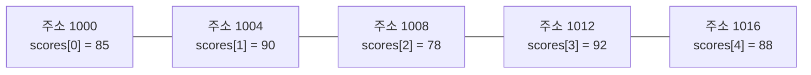

<Callout type="info">
  **이번 문서의 목표:** 이 문서를 다 읽으면 배열의 원소 하나가 메모리 주소 몇 번지에 있는지 직접 계산할 수 있고, 배열에 원소를 삽입하거나 삭제할 때 왜 다른 원소들을 옮겨야 하는지, 그 비용이 왜 최악의 경우 O(n)인지 설명할 수 있다.
</Callout>

## 왜 메모리 배치를 알아야 하는가

06편에서 배열을 자료구조로 배우기 전에, 그보다 한 단계 아래인 "배열이 실제로 메모리에 어떻게 놓이는가"를 먼저 짚어야 한다. 자료구조 시험에서 배열 관련 문제의 상당수는 "배열의 특정 원소가 몇 번지에 저장되는가", "배열 중간에 원소를 넣으려면 왜 다른 원소들을 밀어야 하는가" 같은, 배열의 **물리적 저장 방식**을 정확히 알아야 풀 수 있는 계산 문제다. 이 물리적 감각이 없으면 "배열은 탐색이 빠르고 삽입·삭제가 느리다"는 문장을 외우기만 할 뿐, 왜 그런지는 설명하지 못하게 된다.

컴퓨터의 메모리(memory, 프로그램이 실행되는 동안 데이터를 담아 두는 저장 공간)는 하나의 거대한 저장 칸 목록이라고 생각하면 된다. 각 칸에는 고유한 **주소**(address, 특정 저장 칸을 가리키는 번호)가 붙어 있고, 프로그램은 이 주소를 이용해 원하는 칸의 값을 읽거나 쓴다. 배열은 이 저장 칸들을 **어떻게 나눠 쓰는가**에 대한 가장 기본적인 방식이다.

## 연속 저장 — 배열의 핵심 성질

**배열**(array)이란 같은 자료형의 데이터를 메모리에서 **끊어짐 없이 붙어 있는 칸**에 순서대로 저장하는 자료구조다. 여기서 핵심 단어는 "연속"(contiguous, 사이에 빈틈 없이 이어져 있다는 뜻)이다. 정수 5개를 담는 배열이 있다면, 이 5개의 정수는 메모리 주소상에서 바로 옆자리에 나란히 놓인다.

크기 5인 정수 배열 `scores`가 주소 1000번지부터 시작하고, 정수 하나가 4바이트(byte, 메모리 용량의 기본 단위)를 차지한다고 하면 다음과 같이 배치된다.

표로 정리하면 다음과 같다.

| 인덱스 | 값 | 시작 주소 |
|--------|-----|-----------|
| `scores[0]` | 85 | 1000 |
| `scores[1]` | 90 | 1004 |
| `scores[2]` | 78 | 1008 |
| `scores[3]` | 92 | 1012 |
| `scores[4]` | 88 | 1016 |

주소가 4씩 커지는 이유는 정수 하나의 크기가 4바이트이기 때문이다. 인덱스가 하나 늘어날 때마다 그 자료형의 크기만큼 주소가 정확히 뛰어오른다. 이 "정확히 일정한 간격으로 뛰어오른다"는 성질이 바로 다음 절에서 다룰 주소 계산의 근거다.

> **쉽게 말하면:** 배열은 같은 크기의 상자들을 빈틈없이 한 줄로 붙여 놓은 것이고, 몇 번째 상자인지(인덱스)만 알면 그 상자가 있는 자리(주소)를 계산으로 바로 찾아갈 수 있다.

## 인덱스와 주소 계산 — 왜 배열 접근은 O(1)인가

**인덱스**(index)란 배열에서 몇 번째 칸인지를 나타내는 번호이며, 대부분의 프로그래밍 언어에서 **0부터 센다**(0-based indexing). 인덱스 `i`에 있는 원소의 실제 메모리 주소는 다음 공식으로 계산한다.

$$
\text{주소}(i) = \text{시작 주소} + i \times \text{원소 하나의 크기}
$$

- 시작 주소: 배열의 첫 번째 원소(`scores[0]`)가 저장된 주소.
- `i`: 찾으려는 원소의 인덱스.
- 원소 하나의 크기: 그 자료형이 차지하는 바이트 수(정수형이면 보통 4바이트).

앞의 `scores` 배열에서 `scores[3]`의 주소를 직접 계산해 보자. 시작 주소는 1000, 인덱스는 3, 원소 크기는 4바이트다.

$$
\text{주소}(3) = 1000 + 3 \times 4
$$

$$
= 1000 + 12 = 1012
$$

앞의 표에서 확인한 `scores[3]`의 주소 1012와 정확히 일치한다.

이 계산이 왜 중요한가 하면, 이 공식은 곱셈 한 번과 덧셈 한 번, 딱 두 번의 연산만으로 끝난다는 점이다. 배열의 크기가 5개든 500만 개든, `scores[3]`을 찾는 데 걸리는 연산 횟수는 똑같다. 그래서 **배열의 인덱스 접근은 O(1)**(02편에서 배운 상수 시간)이다. 이것이 배열의 가장 큰 장점이며, "배열은 임의 접근(random access, 순서와 상관없이 원하는 위치에 바로 접근할 수 있다는 뜻)이 빠르다"는 문장의 실제 근거다.

### 다차원 배열의 주소 계산

2차원 배열도 결국 메모리에는 1차원으로(한 줄로) 저장된다. 행 우선(row-major, 행 단위로 이어 붙이는 방식) 저장을 기준으로, `rows`행 `cols`열 배열에서 `array[r][c]`의 주소는 다음과 같이 계산한다.

$$
\text{주소}(r, c) = \text{시작 주소} + (r \times \text{cols} + c) \times \text{원소 크기}
$$

3행 4열(`rows = 3`, `cols = 4`) 정수 배열이 주소 2000번지에서 시작하고 원소 크기가 4바이트라고 할 때, `array[2][1]`의 주소를 구해 보자.

$$
\text{주소}(2, 1) = 2000 + (2 \times 4 + 1) \times 4
$$

$$
= 2000 + 9 \times 4 = 2000 + 36 = 2036
$$

이 식에서 `r × cols + c`(여기서는 `2 × 4 + 1 = 9`)는 "2차원 위치를 1차원 순서로 바꿔 몇 번째 칸인지" 세는 과정이다. 행이 2개 통째로 지나갔으니 `2 × 4 = 8`칸을 건너뛰고, 그 다음 3번째 행에서 1칸 더 이동한 것이 9번째 칸(0번부터 세므로 실제로는 10번째 칸)이라는 뜻이다.

> **자주 틀리는 점:** 행 우선 방식과 열 우선(column-major) 방식은 주소 계산식이 다르다. 행 우선은 `r × cols + c`, 열 우선은 `c × rows + r`이다. 문제에서 "행 우선으로 저장한다"는 조건을 놓치면 엉뚱한 주소를 계산하게 된다.

## 삽입·삭제 감각 — 배열이 느려지는 이유

배열은 접근은 빠르지만, **중간에 원소를 끼워 넣거나 빼는 연산은 느리다.** 이유는 배열이 "연속 저장"이라는 성질을 지켜야 하기 때문이다. 중간에 빈 칸을 하나 만들려면 그 뒤에 있는 원소들을 전부 한 칸씩 뒤로 밀어야 하고, 반대로 중간 원소를 빼내면 그 뒤 원소들을 한 칸씩 앞으로 당겨야 빈틈이 생기지 않는다.

배열 `[10, 20, 30, 40, 50]`의 인덱스 1(값 20) 자리에 새 값 `15`를 삽입하는 과정을 단계별로 따라가 보자.

| 단계 | 상태 | 설명 |
|------|------|------|
| 시작 | `[10, 20, 30, 40, 50]` | 삽입 전 배열 |
| 1단계 | `[10, 20, 30, 40, 50, _]` | 맨 뒤에 빈 칸을 하나 확보한다(배열 크기에 여유가 있다고 가정) |
| 2단계 | `[10, 20, 30, 40, _, 50]` | 인덱스 4의 값을 인덱스 5로 옮긴다 |
| 3단계 | `[10, 20, 30, _, 40, 50]` | 인덱스 3의 값을 인덱스 4로 옮긴다 |
| 4단계 | `[10, 20, _, 30, 40, 50]` | 인덱스 2의 값을 인덱스 3으로 옮긴다 |
| 5단계 | `[10, 20, 15, 30, 40, 50]` | 비어 있는 인덱스 2에 새 값 15를 채운다 |

인덱스 1 뒤에 있던 원소 4개(30, 40, 50, 그리고 이동으로 생긴 빈칸 포함)를 뒤로 밀어야 삽입 한 번이 끝난다. 만약 배열의 맨 앞(인덱스 0)에 삽입해야 했다면 나머지 원소 전부를 밀어야 하므로 **최악의 경우 `n-1`번의 이동**이 필요하고, 이는 02편에서 배운 대로 `O(n)`이다. 반대로 배열의 맨 뒤에 자리가 남아 있는 상태에서 맨 뒤에 추가하는 경우는 아무것도 밀 필요가 없으므로 `O(1)`이다.

삭제도 같은 원리다. 배열 `[10, 20, 30, 40, 50]`에서 인덱스 1(값 20)을 삭제하면, 그 뒤에 있던 30, 40, 50이 한 칸씩 앞으로 당겨져야 빈틈이 사라진다.

| 단계 | 상태 | 설명 |
|------|------|------|
| 시작 | `[10, 20, 30, 40, 50]` | 삭제 전 배열 |
| 1단계 | `[10, _, 30, 40, 50]` | 인덱스 1의 값을 제거해 빈 칸이 생긴다 |
| 2단계 | `[10, 30, _, 40, 50]` | 인덱스 2의 값을 인덱스 1로 당긴다 |
| 3단계 | `[10, 30, 40, _, 50]` | 인덱스 3의 값을 인덱스 2로 당긴다 |
| 4단계 | `[10, 30, 40, 50, _]` | 인덱스 4의 값을 인덱스 3으로 당긴다 |

> **쉽게 말하면:** 배열은 상자들이 빈틈없이 붙어 있어야 하는 규칙이 있어서, 중간에 상자를 끼우거나 빼면 그 뒤 상자들을 전부 한 칸씩 옮겨서 다시 빈틈을 없애야 한다. 그 이동 비용이 배열의 삽입·삭제를 느리게 만드는 원인이다.

이 "밀어야 하는 비용" 때문에 삽입·삭제가 잦은 문제에서는 04편에서 배울 **포인터로 연결하는 방식**(연결리스트)이 대안으로 등장한다. 연결리스트는 원소들이 메모리에서 연속으로 붙어 있을 필요가 없어서, 중간에 끼워 넣을 때 주변 원소를 밀지 않고 연결(링크)만 바꾸면 된다. 이 비교는 07편(단순 연결리스트)에서 배열과 정면으로 비교하며 다시 다룬다.

## 배열 크기의 고정 문제

배열은 "연속된 칸"을 미리 확보해 둬야 하므로, 만들 때 크기를 정해야 한다(정적 배열, static array). 만약 처음에 5칸을 확보했는데 6번째 원소를 넣어야 하는 상황이 오면, 단순히 옆 칸을 늘릴 수 없다(바로 옆 주소가 이미 다른 용도로 쓰이고 있을 수 있기 때문이다). 이런 경우 흔히 쓰는 해결책은 **더 큰 크기의 새 배열을 통째로 새로 만들고, 기존 원소를 전부 그 배열로 복사한 뒤, 기존 배열은 버리는 것**이다. 이 복사 과정은 원소 개수만큼 시간이 걸리므로 O(n)이다.

> **자주 틀리는 점:** "배열은 크기를 바꿀 수 없다"고 절대적으로 외우면, 프로그래밍 언어가 제공하는 동적 배열(dynamic array, 필요할 때 자동으로 더 큰 배열로 교체해 주는 기능)을 보고 혼란스러워한다. 정확히는 "배열이 차지하는 연속된 메모리 블록 자체의 크기는 한 번 정해지면 그 자리에서 늘어나지 않으며, 크기를 늘리려면 새 블록을 잡아 전체를 복사해야 한다"는 것이 정확한 이해다.

## 자주 틀리는 점

- **인덱스를 1부터 세는 착각**: 대부분의 언어에서 배열의 첫 원소는 인덱스 0이다. 인덱스 `i`가 곧 "시작점부터 몇 칸을 건너뛰었는가"를 의미하므로 0부터 시작하는 것이 자연스럽다.
- **주소 계산식에서 곱셈 순서를 헷갈리는 실수**: 1차원은 `인덱스 × 원소 크기`, 2차원 행 우선은 `(행 × 열의 개수 + 열) × 원소 크기`다. 행의 개수와 열의 개수를 바꿔 곱하면 틀린 주소가 나온다.
- **배열 접근과 배열 삽입·삭제의 복잡도를 같다고 생각하는 실수**: 인덱스로 값을 읽거나 쓰는 것은 O(1)이지만, 중간 삽입·삭제는 뒤 원소를 옮겨야 해서 최악의 경우 O(n)이다.
- **배열의 크기 변경이 공짜라고 착각하는 실수**: 동적 배열이 자동으로 커지는 것처럼 보여도, 내부적으로는 새 블록을 잡고 기존 원소를 전부 복사하는 O(n) 작업이 숨어 있다.

## 핵심 정리

- 배열은 같은 자료형의 데이터를 메모리에서 끊김 없이 이어진 칸에 순서대로 저장하는 자료구조다.
- 인덱스 `i`의 주소는 `시작 주소 + i × 원소 크기`로 계산하며, 이 계산이 곱셈·덧셈 한 번씩으로 끝나기 때문에 배열의 인덱스 접근은 O(1)이다.
- 2차원 배열의 행 우선 저장에서 `array[r][c]`의 주소는 `시작 주소 + (r × cols + c) × 원소 크기`로 계산한다.
- 배열 중간에 삽입·삭제를 하면 연속 저장 성질을 지키기 위해 뒤(또는 앞) 원소들을 한 칸씩 옮겨야 하며, 최악의 경우 이동 횟수는 O(n)이다.
- 배열의 크기를 늘리려면 더 큰 새 배열을 만들어 기존 원소를 전부 복사해야 하므로 이 작업도 O(n)이다.

## 마무리 복습

<Quiz
  questionNumber={1}
  question="배열이 메모리에 저장되는 방식에 대한 설명으로 가장 적절한 것은?"
  options={['원소들이 메모리 여기저기에 흩어져 저장되고 포인터로만 연결된다', '원소들이 메모리에서 끊김 없이 이어진 연속된 칸에 순서대로 저장된다', '원소마다 서로 다른 크기의 메모리 공간을 자유롭게 차지한다', '배열의 원소는 저장될 때마다 매번 새로운 자료형으로 바뀐다']}
  correctAnswer={2}
  explanation="배열의 핵심 성질은 연속 저장이다. 같은 자료형의 원소들이 메모리에서 빈틈없이 이어진 칸에 순서대로 놓이기 때문에 인덱스만으로 주소를 계산할 수 있다."
  optionExplanations={['포인터로 흩어진 원소를 연결하는 것은 연결리스트의 특징이다(04편에서 다룬다).', '정답. 배열은 연속된 메모리 칸에 원소를 순서대로 저장한다.', '배열은 같은 자료형의 원소가 모두 같은 크기를 차지해야 주소 계산이 성립한다.', '배열 원소의 자료형은 배열을 선언할 때 정해지며 저장 중에 바뀌지 않는다.']}
/>

<Quiz
  questionNumber={2}
  question="정수 배열 numbers가 주소 2000번지에서 시작하고 정수 하나가 4바이트를 차지할 때, numbers[5]의 주소는?"
  options={['2005', '2010', '2016', '2020']}
  correctAnswer={4}
  explanation="주소(i) = 시작 주소 + i × 원소 크기 공식에 대입하면 2000 + 5 × 4 = 2000 + 20 = 2020이다."
  optionExplanations={['인덱스에 원소 크기를 곱하지 않고 그대로 더한 계산이라 틀렸다.', '5 × 4가 아니라 다른 값을 곱한 계산으로 보인다.', '5 × 3처럼 잘못된 원소 크기를 곱한 계산으로 보인다.', '정답. 2000 + 5 × 4 = 2020이다.']}
/>

<Quiz
  questionNumber={3}
  question="배열의 인덱스로 특정 원소에 접근하는 연산의 시간복잡도가 O(1)인 이유로 가장 적절한 것은?"
  options={['배열의 크기가 항상 작기 때문이다', '주소 계산이 곱셈과 덧셈 한 번씩으로 끝나 원소 개수와 무관하기 때문이다', '배열은 항상 정렬되어 있어서 빠르게 찾을 수 있기 때문이다', '컴퓨터가 배열 전체를 미리 다 읽어 두기 때문이다']}
  correctAnswer={2}
  explanation="인덱스로 접근할 때 필요한 계산은 시작 주소에 인덱스와 원소 크기를 곱한 값을 더하는 것뿐이며, 이 연산 횟수는 배열의 크기(n)와 무관하게 항상 일정하기 때문에 O(1)이다."
  optionExplanations={['배열 크기가 커도 주소 계산 방식은 동일하므로 크기와는 무관하다.', '정답. 곱셈과 덧셈 한 번으로 끝나는 계산이 원소 개수와 무관하게 항상 일정하기 때문이다.', '배열이 정렬되어 있을 필요는 없다. 정렬 여부와 인덱스 접근 속도는 관계가 없다.', '컴퓨터가 배열 전체를 미리 읽어 두는 것이 아니라 필요한 주소만 계산해서 바로 접근한다.']}
/>

<Quiz
  questionNumber={4}
  question="3행 4열 정수 배열이 주소 1000번지에서 시작하고 원소 하나가 4바이트일 때, 행 우선(row-major) 저장 방식으로 array[1][2]의 주소는?"
  options={['1008', '1024', '1032', '1048']}
  correctAnswer={2}
  explanation="행 우선 주소 공식은 시작 주소 + (r × cols + c) × 원소 크기다. r=1, cols=4, c=2를 대입하면 1000 + (1 × 4 + 2) × 4 = 1000 + 6 × 4 = 1000 + 24 = 1024다."
  optionExplanations={['(r × cols + c) 계산에서 열의 개수를 반영하지 않은 값으로 보인다.', '정답. 1000 + (1 × 4 + 2) × 4 = 1024다.', '행과 열의 위치를 바꿔 계산했거나 다른 값을 곱한 결과로 보인다.', '실제 계산값보다 훨씬 큰 값이며 다른 공식을 적용한 것으로 보인다.']}
/>

<Quiz
  questionNumber={5}
  question="배열 [10, 20, 30, 40, 50]의 맨 앞(인덱스 0)에 새 값을 삽입할 때, 기존 원소 5개는 최악의 경우 어떻게 되는가?"
  options={['하나도 이동하지 않는다', '맨 끝 원소 1개만 이동한다', '기존 원소 5개가 전부 한 칸씩 뒤로 밀린다', '기존 원소의 절반만 이동한다']}
  correctAnswer={3}
  explanation="맨 앞에 삽입하면 연속 저장 규칙을 지키기 위해 기존 원소 5개가 전부 한 칸씩 뒤로 밀려야 한다. 이는 원소 개수 n에 정비례하므로 최악의 경우 시간복잡도는 O(n)이다."
  optionExplanations={['맨 앞 삽입은 뒤에 있던 원소들을 반드시 옮겨야 하는 경우다.', '1개만 옮기는 것으로는 연속 저장 규칙을 지킬 수 없다.', '정답. 맨 앞에 삽입하면 기존 원소 전부가 한 칸씩 밀려야 하므로 이동 횟수가 n에 비례한다(최악의 경우 O(n)).', '절반만 옮기면 중간에 빈 칸이나 중복된 값이 생겨 배열이 깨진다.']}
/>

<Quiz
  questionNumber={6}
  question="정적 배열(static array)의 크기를 늘려야 할 때 일반적으로 일어나는 일로 옳은 것은?"
  options={['기존 배열 바로 뒤 메모리 칸을 그대로 이어 붙여 사용한다', '더 큰 크기의 새 배열을 만들고 기존 원소를 전부 복사한 뒤 기존 배열을 버린다', '배열의 자료형을 바꿔서 더 많은 데이터를 압축해 담는다', '아무 작업 없이 즉시 크기가 늘어난다']}
  correctAnswer={2}
  explanation="배열이 차지한 연속된 메모리 블록은 그 자리에서 늘어날 수 없으므로, 더 큰 새 블록을 확보해 기존 원소를 전부 복사하고 기존 블록은 버리는 방식으로 크기를 늘린다. 이 복사 작업은 원소 개수에 비례해 O(n)이 걸린다."
  optionExplanations={['바로 뒤 메모리 칸이 이미 다른 용도로 쓰이고 있을 수 있어 그대로 이어 붙일 수 없다.', '정답. 새 블록을 확보해 기존 원소를 복사하는 방식으로 크기를 늘린다.', '자료형을 바꿔 압축하는 방식은 배열 크기 확장과 관련이 없다.', '크기 확장에는 새 블록 확보와 데이터 복사라는 실제 작업(O(n))이 필요하다.']}
/>

## 참고 자료

- [국가평생교육진흥원 과목별 평가영역](https://bdes.nile.or.kr/nile/study/nStudy2_1.do) — 자료구조 과목의 평가영역과 출제 범위를 확인해 배열의 메모리 배치 개념의 시험 비중을 맞추는 데 참고했다.
- [MDN Indexed collections](https://developer.mozilla.org/en-US/docs/Web/JavaScript/Guide/Indexed_collections) — 인덱스 기반 컬렉션(배열)의 구조와 성질을 설명한 참고 자료.
