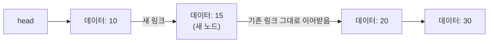

<Callout type="info">
  **이번 문서의 목표:** 이 문서를 다 읽으면 참조(포인터)가 "무엇의 주소를 담은 값"인지 설명할 수 있고, 노드와 링크로 이루어진 연결 구조가 배열과 어떻게 다른 방식으로 메모리를 쓰는지 그림으로 그려서 설명할 수 있다.
</Callout>

## 왜 포인터 감각이 먼저 필요한가

03편에서 배열은 "연속된 메모리 칸"에 데이터를 저장하기 때문에 중간 삽입·삭제 때마다 다른 원소들을 밀어야 한다는 것을 확인했다. 이 문제를 해결하는 방법은 "데이터를 굳이 붙여 놓지 않는 것"이다. 데이터가 메모리 여기저기 흩어져 있어도, 각 데이터가 "다음 데이터가 어디 있는지"를 자기 자신에게 표시해 두면, 흩어진 데이터를 순서대로 찾아갈 수 있다. 이 "어디 있는지를 표시해 두는 값"이 바로 **참조**(reference) 또는 **포인터**(pointer)다.

07편부터 배울 연결리스트, 12편의 트리, 15편의 그래프는 전부 이 포인터 감각 위에 세워진다. 이 감각이 없으면 "노드끼리 연결되어 있다"는 그림을 봐도 그것이 메모리에서 실제로 무엇을 의미하는지 그려지지 않는다.

## 참조(포인터)란 무엇인가

**참조**(reference, C 계열 언어에서는 흔히 **포인터**(pointer)라고 부른다)란 값 자체가 아니라 **다른 값이 저장된 메모리 주소를 담고 있는 값**이다. 03편에서 배운 "주소" 개념을 그대로 가져오면 된다. 보통의 변수가 정수나 문자 같은 값을 직접 담는다면, 참조 변수는 "그 값이 몇 번지에 있는가"라는 주소만 담는다.

일상적인 비유로 설명하면, 책 내용 전체를 손에 들고 다니는 대신 "그 책은 3층 서가 12번 칸에 있다"고 적힌 쪽지 한 장만 들고 다니는 것과 같다. 쪽지(참조)는 가볍고, 쪽지가 가리키는 실제 책(데이터)은 다른 곳에 있어도 된다. 쪽지에 적힌 위치만 바꾸면 다른 책을 가리키게 할 수도 있다.

> **쉽게 말하면:** 참조(포인터)는 값 자체가 아니라 "그 값이 어디 있는지 적어 둔 주소"를 담은 변수다.

### 널 참조 — 아무것도 가리키지 않는 상태

참조 변수가 "가리킬 대상이 없다"는 것을 나타내야 할 때가 있다. 예를 들어 연결리스트의 마지막 노드는 "다음 노드가 없다"는 것을 표시해야 한다. 이때 쓰는 특별한 값이 **널**(NULL, 또는 언어에 따라 `null`, `nullptr`)이다. 널은 "0번지를 가리킨다"는 뜻이 아니라 "**아무 데도 가리키지 않는다**"는 것을 나타내는 약속된 값이다.

> **자주 틀리는 점:** 널 포인터(NULL)와 "아직 초기화되지 않은 포인터"는 다르다. 널은 "명시적으로 아무것도 가리키지 않음"을 나타내는 정해진 값이지만, 초기화하지 않은 포인터는 쓰레기 값(garbage value, 이전에 그 메모리 자리에 남아 있던 의미 없는 값)이 우연히 들어 있어 어디를 가리킬지 예측할 수 없다. 시험에서 "포인터를 선언만 하고 초기화하지 않으면 NULL이 자동으로 들어간다"는 보기가 나오면 틀린 설명이다(언어와 상황에 따라 다르며, 명시적으로 NULL로 초기화하지 않는 한 보장되지 않는다).

## 노드 — 데이터와 링크를 함께 담는 상자

연결 구조에서 데이터를 담는 기본 단위를 **노드**(node)라고 부른다. 노드는 보통 두 부분으로 이루어진다.

- **데이터 필드**(data field): 실제로 저장하고 싶은 값(정수, 문자열 등).
- **링크 필드**(link field, 또는 포인터 필드): 다음 노드가 저장된 주소(참조)를 담는 부분. 다음 노드가 없으면 널(NULL)을 담는다.

노드 하나를 표로 나타내면 다음과 같다.

| 필드 | 저장 내용 |
|------|-----------|
| 데이터 필드 | 예: 정수 값 10 |
| 링크 필드 | 다음 노드의 주소(또는 다음 노드가 없으면 NULL) |

## 링크로 연결하기 — 배열과 다른 방식의 저장

노드 3개를 연결해 10 → 20 → 30 순서를 표현하는 **연결리스트**(linked list, 07편에서 본격적으로 다룬다)를 만들어 보자. 03편의 배열과 달리, 이 노드들은 메모리 주소상에서 서로 붙어 있을 필요가 **전혀 없다.**

| 노드 | 메모리 주소 | 데이터 필드 | 링크 필드(다음 노드 주소) |
|------|-------------|-------------|---------------------------|
| 첫 번째 노드 | 3016 | 10 | 3104 |
| 두 번째 노드 | 3104 | 20 | 3040 |
| 세 번째 노드 | 3040 | 30 | NULL |

이 표를 보면 주소가 3016 → 3104 → 3040으로 순서 없이 흩어져 있다. 배열이었다면 이런 배치는 불가능하다(연속되지 않았으므로). 하지만 각 노드가 "다음 노드의 주소"를 링크 필드에 적어 두고 있기 때문에, 첫 번째 노드의 주소(3016)만 알고 있으면 링크를 따라 3104, 3040 순서로 정확히 찾아갈 수 있다. 이 첫 번째 노드를 가리키는 참조를 보통 **머리 포인터**(head pointer)라고 부른다.

> **쉽게 말하면:** 연결 구조는 데이터를 아무 데나 놓아 두고, 각 데이터에 "다음 데이터가 어디 있는지" 쪽지(링크)를 붙여서 순서를 표현하는 방식이다. 순서가 메모리상의 물리적 위치가 아니라 링크가 가리키는 방향으로 정해진다.

## 배열의 인덱스 접근과 연결 구조의 접근이 다른 이유

03편에서 배열은 `시작 주소 + i × 원소 크기` 공식으로 임의의 원소 주소를 즉시 계산할 수 있어 O(1)이라고 했다. 연결 구조는 이 계산이 통하지 않는다. 세 번째 노드(값 30)의 주소를 알고 싶어도, 그 주소는 두 번째 노드의 링크 필드 안에만 적혀 있고, 두 번째 노드의 주소는 첫 번째 노드의 링크 필드 안에만 적혀 있다. 즉 **머리 포인터부터 링크를 하나씩 따라가야만** 원하는 노드에 도달할 수 있다.

세 번째 노드에 도달하려면 첫 번째 노드를 거쳐 두 번째 노드를 거쳐야 하므로 2번의 이동이 필요하고, `k`번째 노드에 도달하려면 `k-1`번의 이동이 필요하다. 그래서 연결 구조에서 `k`번째 원소를 찾는 연산은 최악의 경우 O(n)이다. 배열은 "계산으로 바로 찾아가고" 대신 "원소를 옮겨야" 느려지고, 연결 구조는 "링크를 따라가야" 해서 임의 위치 접근이 느려지는 대신 "링크만 바꾸면" 삽입·삭제가 빨라진다는 트레이드오프(trade-off)가 여기서 갈린다. 이 비교는 07편에서 배열과 연결리스트를 나란히 놓고 표로 정리한다.

## 연결 구조에서 삽입하는 감각 — 링크만 바꾸면 된다

03편의 배열 삽입은 뒤 원소를 전부 밀어야 했다. 연결 구조에서 같은 위치(두 번째 자리)에 값 15를 삽입하는 과정을 비교해 보면 차이가 분명해진다. 첫 번째 노드(10)와 두 번째 노드(20) 사이에 새 노드(15)를 끼워 넣는다고 하자.

1. 새 노드를 만들어 데이터 필드에 15를 넣는다.
2. 새 노드의 링크 필드에 "원래 첫 번째 노드가 가리키던 주소"(두 번째 노드의 주소)를 넣는다.
3. 첫 번째 노드의 링크 필드를 "새 노드의 주소"로 바꾼다.

이 과정에서 **기존 노드(10, 20, 30)의 데이터 필드는 단 하나도 옮기지 않았다.** 바뀐 것은 링크 필드 두 곳(새 노드의 링크, 첫 번째 노드의 링크)뿐이다. 이것이 "연결 구조는 삽입·삭제가 빠르다"는 말의 실제 근거이며, 정확한 삽입·삭제 절차와 각 경우(맨 앞, 중간, 맨 뒤)의 코드 수준 구현은 07편에서 다룬다. 지금 단계에서는 "배열은 옮기고, 연결 구조는 링크만 바꾼다"는 감각 차이만 확실히 잡아 두면 된다.

> **자주 틀리는 점:** "연결 구조는 삽입이 항상 O(1)이다"라고 성급히 일반화하면 안 된다. 링크만 바꾸는 작업 자체는 O(1)이지만, **삽입할 위치를 찾아가는 과정**(머리 포인터부터 링크를 따라가는 것)은 위치에 따라 O(n)이 걸릴 수 있다. "삽입할 위치를 이미 가리키는 참조를 들고 있는 상태"에서의 삽입만 O(1)이라는 조건이 붙는다.

## 자주 틀리는 점

- **참조(포인터)와 그 참조가 가리키는 값을 혼동하는 실수**: 참조 변수 자체의 값은 "주소"이고, 그 참조를 "따라가서(역참조)" 얻는 값이 실제 데이터다. 이 둘은 다른 것이다.
- **NULL을 0이라는 데이터 값으로 착각하는 실수**: NULL은 "아무것도 가리키지 않는다"는 상태를 나타내는 특별한 값이지, 데이터 필드에 저장된 정수 0과는 다른 개념이다.
- **배열의 인덱스와 연결 구조의 참조를 같은 것으로 보는 실수**: 인덱스는 "몇 번째인가"라는 순번이고 계산으로 주소를 즉시 구할 수 있지만, 참조는 "실제 주소 값 자체"를 담고 있으며 링크를 따라가야만 다음 원소에 닿을 수 있다.
- **연결 구조의 삽입·삭제가 무조건 배열보다 빠르다고 일반화하는 실수**: 삽입·삭제 위치를 찾아가는 데 걸리는 시간까지 포함하면, 위치에 따라 연결 구조도 O(n)이 걸릴 수 있다. "위치를 이미 알고 있을 때"라는 조건이 따라붙는다.
- **댕글링 참조(dangling reference)를 놓치는 실수**: 어떤 노드를 메모리에서 지웠는데, 다른 노드의 링크 필드가 여전히 그 지워진 주소를 가리키고 있으면 잘못된 위치를 가리키는 참조가 남는다. 노드를 삭제할 때는 그 노드를 가리키던 다른 링크도 함께 정리해야 한다.

## 핵심 정리

- 참조(포인터)는 값 자체가 아니라 다른 값이 저장된 메모리 주소를 담은 값이다.
- 노드는 데이터 필드와 링크 필드로 이루어지며, 링크 필드는 다음 노드의 주소를 담거나 다음 노드가 없으면 NULL을 담는다.
- 연결 구조는 노드들이 메모리에서 연속으로 붙어 있지 않아도 링크를 따라가며 순서를 찾을 수 있어, 배열의 "밀어야 하는" 문제를 피할 수 있다.
- 배열은 인덱스 계산으로 임의 위치에 O(1)로 접근하지만, 연결 구조는 머리 포인터부터 링크를 따라가야 해서 임의 위치 접근이 최악의 경우 O(n)이다.
- 연결 구조의 삽입·삭제는 위치를 이미 알고 있을 때 링크만 바꾸면 되어 O(1)이지만, 그 위치를 찾아가는 과정까지 포함하면 O(n)이 걸릴 수 있다.

## 마무리 복습

<Quiz
  questionNumber={1}
  question="참조(포인터)에 대한 설명으로 가장 적절한 것은?"
  options={['값 자체를 여러 개 복사해 저장하는 변수다', '다른 값이 저장된 메모리 주소를 담고 있는 값이다', '배열의 인덱스와 완전히 같은 개념이다', '항상 정수형 데이터만 가리킬 수 있는 특수한 자료형이다']}
  correctAnswer={2}
  explanation="참조(포인터)는 데이터 값을 직접 담는 것이 아니라, 그 데이터가 저장된 메모리 주소를 담고 있는 값이다."
  optionExplanations={['참조는 값을 복사해 저장하는 것이 아니라 주소만 담는다.', '정답. 참조는 다른 값이 저장된 주소를 담은 값이다.', '인덱스는 순번이고 계산으로 주소를 구하지만, 참조는 주소 값 자체를 담고 있어 서로 다른 개념이다.', '참조는 자료형과 무관하게 어떤 데이터든 그 주소를 담을 수 있다.']}
/>

<Quiz
  questionNumber={2}
  question="연결 구조에서 노드(node)를 구성하는 두 부분으로 옳은 것은?"
  options={['인덱스 필드와 크기 필드', '데이터 필드와 링크 필드', '시작 주소와 끝 주소', '자료형 필드와 이름 필드']}
  correctAnswer={2}
  explanation="노드는 실제 값을 담는 데이터 필드와, 다음 노드의 주소(또는 NULL)를 담는 링크 필드로 구성된다."
  optionExplanations={['인덱스와 크기는 배열에서 쓰이는 개념이며 노드의 구성 요소가 아니다.', '정답. 노드는 데이터 필드와 링크 필드로 구성된다.', '노드 자체가 시작 주소와 끝 주소를 갖는 것이 아니라, 노드 하나가 하나의 주소에 저장된다.', '자료형과 이름은 변수 선언에 관한 개념이며 노드의 필드 구성과는 다르다.']}
/>

<Quiz
  questionNumber={3}
  question="연결 구조의 마지막 노드가 링크 필드에 NULL을 저장하는 이유로 가장 적절한 것은?"
  options={['다음 노드가 0번지에 있다는 뜻이기 때문이다', '더 이상 다음 노드가 없다는 것을 나타내는 약속된 값이기 때문이다', '데이터 필드의 값이 0이라는 것을 나타내기 위해서다', 'NULL은 아무 의미 없이 관례적으로만 붙이는 값이기 때문이다']}
  correctAnswer={2}
  explanation="NULL은 특정 주소(0번지)를 가리킨다는 뜻이 아니라, 참조가 아무것도 가리키지 않는다는 것을 나타내는 약속된 값이다. 연결 구조의 끝을 표시할 때 이 값을 사용한다."
  optionExplanations={['NULL은 0번지라는 실제 주소를 가리키는 것이 아니라 아무것도 가리키지 않는다는 상태를 나타낸다.', '정답. NULL은 더 이상 가리킬 다음 노드가 없다는 것을 나타내는 약속된 값이다.', 'NULL은 링크 필드에 저장되는 값이며 데이터 필드의 값과는 무관하다.', 'NULL은 아무 의미 없는 관례가 아니라 참조 상태를 나타내는 명확한 의미를 가진 값이다.']}
/>

<Quiz
  questionNumber={4}
  question="배열과 연결 구조에서 임의 위치의 원소에 접근하는 방식의 차이에 대한 설명으로 옳은 것은?"
  options={['배열은 링크를 따라가야 하고 연결 구조는 계산으로 바로 접근한다', '배열은 인덱스 계산으로 O(1)에 접근하지만 연결 구조는 머리 포인터부터 링크를 따라가야 해 최악의 경우 O(n)이다', '두 자료구조 모두 임의 위치 접근이 항상 O(1)이다', '두 자료구조 모두 임의 위치 접근이 항상 O(n)이다']}
  correctAnswer={2}
  explanation="배열은 시작 주소에 인덱스와 원소 크기를 곱한 값을 더해 즉시 주소를 계산하므로 O(1)이지만, 연결 구조는 노드의 주소가 이전 노드의 링크 필드 안에만 적혀 있어 처음부터 링크를 따라가야 하므로 최악의 경우 O(n)이다."
  optionExplanations={['설명이 반대로 되어 있다. 배열이 계산으로 접근하고 연결 구조가 링크를 따라간다.', '정답. 배열은 O(1) 계산 접근, 연결 구조는 최악의 경우 O(n) 순차 접근이다.', '연결 구조의 임의 위치 접근은 항상 O(1)이 아니다.', '배열의 임의 위치 접근은 인덱스 계산으로 O(1)에 가능하다.']}
/>

<Quiz
  questionNumber={5}
  question="연결 구조에서 이미 알고 있는 위치의 바로 뒤에 새 노드를 삽입할 때 실제로 바뀌는 것은?"
  options={['그 뒤에 있던 모든 노드의 데이터 필드 값', '새 노드의 링크 필드와 앞 노드의 링크 필드', '연결 구조 전체를 새로운 메모리 블록으로 복사한 결과', '노드들의 메모리 주소 자체']}
  correctAnswer={2}
  explanation="삽입 위치를 이미 알고 있다면, 새 노드의 링크 필드에 원래 다음 노드의 주소를 넣고 앞 노드의 링크 필드를 새 노드의 주소로 바꾸는 것만으로 삽입이 끝난다. 기존 노드의 데이터나 주소 자체는 옮기지 않는다."
  optionExplanations={['연결 구조의 삽입은 기존 노드의 데이터 필드를 옮기지 않는 것이 핵심 장점이다.', '정답. 링크 필드 두 곳만 바꾸면 삽입이 끝난다.', '연결 구조의 삽입은 배열처럼 전체를 복사할 필요가 없다.', '기존 노드들은 원래 있던 메모리 주소에 그대로 남아 있으며 주소가 바뀌지 않는다.']}
/>

<Quiz
  questionNumber={6}
  question="다음 중 댕글링 참조(dangling reference)에 대한 설명으로 가장 적절한 것은?"
  options={['정상적으로 다음 노드를 가리키고 있는 링크 필드다', '이미 삭제된 노드의 주소를 여전히 가리키고 있는 참조다', '데이터 필드에 아무 값도 들어 있지 않은 상태다', 'NULL 값을 저장하고 있는 링크 필드를 가리키는 다른 이름이다']}
  correctAnswer={2}
  explanation="댕글링 참조는 가리키던 대상(노드)이 이미 삭제되었는데도 여전히 그 주소를 가리키고 있는 참조를 말한다. 노드를 삭제할 때 그 노드를 가리키던 다른 링크도 함께 정리하지 않으면 발생한다."
  optionExplanations={['정상적으로 유효한 노드를 가리키는 링크는 댕글링 참조가 아니다.', '정답. 이미 삭제된 대상을 여전히 가리키고 있는 참조가 댕글링 참조다.', '데이터 필드가 비어 있는 것과 댕글링 참조는 서로 다른 문제다.', 'NULL은 의도적으로 아무것도 가리키지 않는 상태이며 댕글링 참조와는 다르다.']}
/>

## 참고 자료

- [국가평생교육진흥원 독학학위제](https://bdes.nile.or.kr/) — 독학사 시험 체계와 자료구조 과목의 공식 정보를 확인하는 데 참고했다.
- [국가평생교육진흥원 과목별 평가영역](https://bdes.nile.or.kr/nile/study/nStudy2_1.do) — 자료구조 과목의 평가영역과 출제 범위를 확인해 연결 구조 개념의 시험 비중을 맞추는 데 참고했다.
