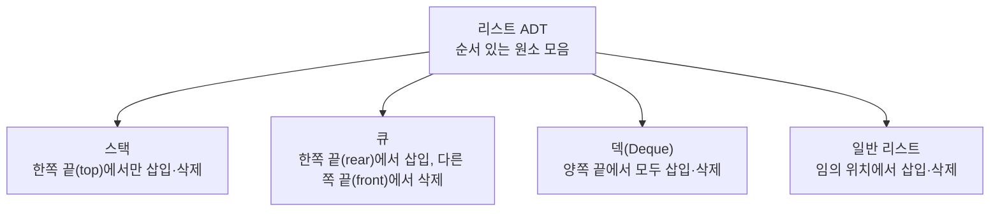

<Callout type="info">
  **이번 문서의 목표:** 이 문서를 다 읽으면 어떤 자료구조든 "데이터 구성 + 연산 명세" 형태의 ADT로 직접 써 볼 수 있고, 시험 문제에 나오는 "자료구조를 고르는 이유를 설명하라" 유형에서 복잡도·메모리·연산 빈도를 근거로 답할 수 있다.
</Callout>

## 왜 이 편이 다시 필요한가

01편(자료구조 공부를 위한 용어 지도)에서 데이터·자료형·자료구조·추상자료형(Abstract Data Type, ADT)의 위계를 세우고, 스택 ADT와 리스트 ADT를 예로 "연산의 이름과 의미만 정의하고 구현은 감춘다"는 ADT의 성질을 확인했다. 이 편은 그 위에서 두 가지를 더 깊게 다룬다. 첫째, ADT를 시험 답안처럼 **형식을 갖춰 쓰는 법**이다. 독학사 시험은 "다음 자료구조의 ADT를 정의하라"거나 "이 ADT 명세에서 잘못된 부분을 고르라"는 식으로 출제되므로, 표에 연산 이름만 나열하는 수준을 넘어 데이터 집합·연산·선행조건까지 갖춘 명세를 읽고 쓸 줄 알아야 한다. 둘째, 02편(시간·공간 복잡도 읽는 법)에서 배운 빅오(Big-O) 표기를 실제로 자료구조 선택 판단에 연결하는 법이다. "왜 이 상황에는 배열이 아니라 연결리스트를 써야 하는가" 같은 서술형 대비 문항은 복잡도 수치를 근거로 논리를 세워야 답이 완성된다.

> **쉽게 말하면:** 05편은 "ADT를 안다"에서 "ADT를 시험 답안 형식으로 쓸 수 있다"로, "복잡도를 읽는다"에서 "복잡도로 자료구조를 고르는 이유를 설명한다"로 넘어가는 편이다.

## ADT를 형식 갖춰 정의하는 법

시험에서 요구하는 ADT 정의는 보통 세 부분으로 구성된다.

1. **데이터 객체(data objects)**: 이 ADT가 다루는 값들의 집합. 예를 들어 스택 ADT의 데이터 객체는 "같은 자료형의 원소들을 순서대로 늘어놓은 유한 수열"이다.
2. **연산(operations)**: 그 데이터에 대해 수행할 수 있는 동작의 목록. 각 연산은 이름, 입력(매개변수), 출력(반환값), 그리고 **선행조건**(precondition, 이 연산을 호출하기 전에 만족해야 하는 조건)과 **후행조건**(postcondition, 연산이 끝난 뒤 보장되는 상태)까지 명시하는 것이 정석이다.
3. **오류 조건(error conditions)**: 선행조건이 깨졌을 때 어떤 일이 일어나는지. 예를 들어 빈 스택에서 `pop`을 호출하면 "스택 언더플로(underflow)" 오류가 난다.

스택 ADT를 이 형식으로 다시 써 보면 다음과 같다.

| 연산 | 입력 | 출력 | 선행조건 | 후행조건 |
|------|------|------|----------|----------|
| `push(x)` | 원소 `x` | 없음 | 스택에 공간이 있어야 함(오버플로 아님) | `x`가 스택의 맨 위에 추가됨 |
| `pop()` | 없음 | 제거된 맨 위 원소 | 스택이 비어 있지 않아야 함 | 맨 위 원소가 제거되고 그 아래 원소가 새 맨 위가 됨 |
| `peek()` | 없음 | 맨 위 원소(제거하지 않음) | 스택이 비어 있지 않아야 함 | 스택 상태 변화 없음 |
| `isEmpty()` | 없음 | 참/거짓 | 없음 | 스택 상태 변화 없음 |

이렇게 선행조건·후행조건까지 적으면 "빈 스택에서 `pop()`을 호출하면 어떻게 되는가?"라는 문제에 "선행조건 위반이므로 정의되지 않은 동작이거나 언더플로 오류를 내야 한다"고 정확히 답할 수 있다. 표에 선행조건 칸이 없으면 이 판단 근거가 사라진다는 점이 시험에서 자주 노리는 함정이다.

> **자주 틀리는 점:** "스택이 비어 있을 때 `pop()`을 호출하면 0을 반환한다"처럼 **구현에서 흔히 쓰는 편의적 처리**를 ADT의 정의로 착각하는 보기가 나온다. ADT 명세 자체는 그런 값을 정하지 않는다. 그것은 특정 구현이 선택한 오류 처리 방식일 뿐이다.

## 연산의 성질로 자료구조를 구분하기

같은 리스트 ADT라도 원소를 어디에 넣고 뺄 수 있는지에 따라 하위 종류가 갈린다. 이 구분은 09~10편(스택·큐)의 밑바탕이 되므로 여기서 미리 정리한다.

이 그림에서 중요한 것은 "무엇을 저장하는가"가 아니라 "어느 위치에서 연산이 허용되는가"가 자료구조의 정체성을 결정한다는 점이다. 스택과 큐는 저장하는 데이터의 종류가 같아도, 삽입·삭제가 허용된 위치가 다르기 때문에 서로 다른 ADT가 된다.

## 복잡도를 자료구조 선택의 근거로 쓰기

02편에서 배운 빅오 표기를 실제로 "왜 이 자료구조를 골랐는가"를 설명하는 데 쓰는 연습을 해 보자. 자료구조를 비교할 때는 항상 **어떤 연산을, 얼마나 자주 쓰는가**를 먼저 정해야 한다. 같은 자료구조라도 연산에 따라 복잡도가 다르기 때문이다.

예를 들어 정렬되지 않은 원소 $n$개를 배열에 저장한 경우와 정렬된 배열에 저장한 경우를 비교해 보자.

| 연산 | 정렬 안 된 배열 | 정렬된 배열 |
|------|-----------------|-------------|
| 특정 값 탐색 | $O(n)$ (처음부터 끝까지 순차 탐색) | $O(\log n)$ (이진 탐색, 16편에서 자세히) |
| 맨 뒤에 삽입 | $O(1)$ | $O(n)$ (정렬 위치를 찾고 뒤 원소를 밀어야 함) |
| 임의 위치 삭제 | $O(n)$ (빈 자리를 채우려고 뒤 원소를 당겨야 함) | $O(n)$ (동일) |

여기서 $n$은 저장된 원소의 개수를 뜻한다. 이 표가 보여 주는 것은 "정렬된 배열이 무조건 좋다"가 아니라 **탐색을 자주 하고 삽입은 드물게 한다면 정렬된 배열이 유리하고, 삽입이 잦다면 정렬 비용 때문에 오히려 불리해진다**는 트레이드오프(trade-off, 하나를 얻으면 다른 하나를 희생하는 관계)다. 서술형 답안에서는 "정렬된 배열을 쓴다"로 끝내지 않고, 반드시 "탐색 연산이 $O(\log n)$으로 빨라지는 대신 삽입 시 정렬 순서를 유지하려고 $O(n)$의 이동 비용이 든다"처럼 **양쪽 복잡도를 함께** 제시해야 만점 답안이 된다.

> **쉽게 말하면:** 자료구조 선택 근거를 쓸 때는 "이게 좋아서"가 아니라 "이 연산은 빨라지는 대신 저 연산은 느려진다"는 식으로 얻는 것과 잃는 것을 숫자(복잡도)로 짝지어 말해야 한다.

## 자료구조 선택 기준을 체크리스트로

01편에서 제시한 세 기준(연산 종류, 순서의 의미, 메모리)을 시험 답안에 바로 쓸 수 있는 절차로 정리하면 다음과 같다.

<Steps>
1. **어떤 연산이 가장 자주 일어나는가를 특정한다.** 탐색인지, 맨 끝 삽입/삭제인지, 임의 위치 삽입/삭제인지를 구체적으로 짚는다.
2. **그 연산의 복잡도를 후보 자료구조별로 적는다.** 표로 나열하면 비교가 쉬워진다(위 표 참고).
3. **데이터 크기 $n$이 커질 때 어느 연산이 병목이 되는지 판단한다.** $n$이 작으면 $O(n)$과 $O(\log n)$의 차이가 크지 않지만, $n$이 커지면 차이가 벌어진다.
4. **메모리 제약을 확인한다.** 배열은 미리 크기를 정하거나 재할당이 필요하고, 연결리스트는 링크(포인터)를 저장할 추가 공간이 필요하다.
5. **결론과 근거를 함께 쓴다.** "탐색이 잦고 삽입이 드물므로 정렬된 배열이 적합하다. 탐색은 $O(\log n)$이고 삽입은 $O(n)$이지만 삽입 빈도가 낮아 전체 성능에 미치는 영향이 작다"처럼 결론 + 근거 두 문장을 짝짓는다.
</Steps>

## 자주 틀리는 점

- **ADT 명세에 구현 세부사항(배열이냐 연결리스트냐, 반환값이 0이냐 -1이냐)을 섞어 넣는 오류**: ADT는 연산의 이름·의미·선행조건까지만 정의한다. 구체적인 반환값 관례는 구현이 정한다.
- **복잡도를 비교할 때 어떤 연산인지 특정하지 않고 "배열이 빠르다/느리다"처럼 뭉뚱그리는 오류**: 같은 배열도 인덱스 접근은 $O(1)$이지만 임의 위치 삽입은 $O(n)$이다. 연산을 반드시 특정해야 한다.
- **평균/최선/최악을 구분하지 않고 하나의 복잡도만 말하는 오류**: 02편에서 다룬 대로, "정렬 안 된 배열의 탐색은 최악의 경우 $O(n)$"처럼 어떤 경우를 말하는지 밝혀야 한다.

## 핵심 정리

- ADT 정의는 데이터 객체, 연산(입력·출력·선행조건·후행조건), 오류 조건 세 부분을 갖출 때 시험 답안 형식으로 완성된다.
- 스택·큐·덱·일반 리스트는 모두 리스트 ADT의 하위 종류이며, 삽입·삭제가 허용된 위치로 구분된다.
- 자료구조 선택은 특정 연산의 복잡도를 후보 자료구조별로 비교하고, 얻는 것과 잃는 것을 함께 근거로 제시해야 한다.
- 선택 절차는 "빈출 연산 특정 → 후보별 복잡도 비교 → $n$에 따른 병목 판단 → 메모리 제약 확인 → 결론과 근거 서술"의 순서로 진행한다.

## 마무리 복습

<Quiz
  questionNumber={1}
  question="ADT 명세에 반드시 포함되어야 하는 요소로 가장 거리가 먼 것은?"
  options={['연산의 이름과 입력/출력', '연산을 호출하기 전에 만족해야 하는 선행조건', '이 ADT를 배열로 구현할지 연결리스트로 구현할지에 대한 지정', '선행조건이 깨졌을 때의 오류 조건']}
  correctAnswer={3}
  explanation="ADT 명세는 연산의 이름·입력·출력·선행조건·후행조건·오류 조건까지 포함하지만, 구체적으로 어떤 자료구조로 구현할지는 명시하지 않는다. 그것은 구현 단계에서 결정된다."
  optionExplanations={['연산의 이름과 입출력은 ADT 명세의 핵심 구성 요소다.', '선행조건은 연산이 올바르게 동작하기 위한 전제 조건으로 명세에 포함된다.', '정답. 구현 방식(배열/연결리스트) 지정은 ADT의 관심사가 아니다.', '오류 조건도 명세의 일부로 다뤄야 한다.']}
/>

<Quiz
  questionNumber={2}
  question="빈 스택에서 pop() 연산을 호출했을 때 ADT 명세 관점에서 가장 올바른 설명은?"
  options={['항상 0을 반환한다', '선행조건(스택이 비어 있지 않음)을 위반했으므로 정의되지 않은 동작이거나 오류로 처리해야 한다', '가장 아래 원소를 대신 반환한다', '스택의 크기를 자동으로 늘려서 처리한다']}
  correctAnswer={2}
  explanation="pop()의 선행조건은 스택이 비어 있지 않아야 한다는 것이다. 이 조건이 깨졌으므로 ADT 명세상으로는 오류 조건으로 처리해야 하며, 특정 값을 반환하는 것은 명세가 아니라 구현의 편의적 선택이다."
  optionExplanations={['0을 반환한다는 규칙은 ADT 명세가 아니라 특정 구현이 임의로 정한 관례다.', '정답. 선행조건 위반은 오류 조건으로 다루는 것이 ADT 명세의 정석이다.', '가장 아래 원소를 반환한다는 규칙은 스택의 정의(LIFO)에 어긋난다.', '스택 크기를 자동으로 늘리는 것은 pop과 무관한 동작이다.']}
/>

<Quiz
  questionNumber={3}
  question="리스트 ADT의 하위 종류 중 양쪽 끝에서 모두 삽입과 삭제가 가능한 것은?"
  options={['스택', '큐', '덱(Deque)', '정렬된 배열']}
  correctAnswer={3}
  explanation="덱(Deque, Double-Ended Queue)은 양쪽 끝에서 삽입과 삭제가 모두 가능한 리스트 ADT의 하위 종류다. 스택은 한쪽 끝에서만, 큐는 한쪽 끝에서 삽입하고 반대쪽 끝에서 삭제한다."
  optionExplanations={['스택은 한쪽 끝(top)에서만 삽입·삭제가 가능하다.', '큐는 한쪽 끝에서 삽입, 반대쪽 끝에서 삭제하는 구조다.', '정답. 덱은 양쪽 끝에서 모두 삽입·삭제가 가능하다.', '정렬된 배열은 위치가 삽입되는 값에 따라 결정되는 별도의 구조다.']}
/>

<Quiz
  questionNumber={4}
  question="탐색이 매우 잦고 삽입은 거의 없는 상황에서 정렬되지 않은 배열 대신 정렬된 배열을 선택하는 근거로 가장 적절한 것은?"
  options={['정렬된 배열은 삽입도 항상 더 빠르기 때문이다', '정렬된 배열은 이진 탐색으로 탐색을 O(log n)에 처리할 수 있고, 삽입 빈도가 낮아 O(n)의 삽입 비용이 전체 성능에 주는 영향이 작기 때문이다', '정렬된 배열은 메모리를 전혀 사용하지 않기 때문이다', '정렬 여부는 탐색 속도에 아무 영향을 주지 않기 때문이다']}
  correctAnswer={2}
  explanation="정렬된 배열은 이진 탐색을 적용할 수 있어 탐색이 O(log n)으로 빨라진다. 삽입은 정렬 순서를 유지하기 위해 O(n)이 들지만, 문제 상황처럼 삽입이 드물다면 이 비용이 전체 성능에 미치는 영향은 작다."
  optionExplanations={['정렬된 배열의 삽입은 위치를 찾고 뒤 원소를 밀어야 하므로 오히려 O(n)으로 더 느리다.', '정답. 탐색은 O(log n)으로 빨라지고 삽입 비용은 빈도가 낮아 영향이 작다는 근거가 정확하다.', '정렬 여부와 메모리 사용량은 별개의 문제이며 이 근거는 사실과 무관하다.', '정렬 여부는 이진 탐색 적용 가능성을 결정하므로 탐색 속도에 직접 영향을 준다.']}
/>

<Quiz
  questionNumber={5}
  question="자료구조 선택 근거를 서술할 때 가장 바람직한 방식은?"
  options={['"이 자료구조가 더 좋다"고만 결론을 적는다', '가장 자주 쓰는 연산을 특정하고, 후보 자료구조별 복잡도를 비교한 뒤 얻는 것과 잃는 것을 함께 제시한다', '자료구조의 이름만 나열한다', '복잡도는 언급하지 않고 직관적으로만 설명한다']}
  correctAnswer={2}
  explanation="자료구조 선택 근거는 빈출 연산을 특정하고 후보별 복잡도를 비교한 뒤, 얻는 이득과 감수해야 하는 비용을 함께 제시해야 서술형 답안으로 완성된다."
  optionExplanations={['근거 없는 결론만으로는 서술형 답안이 완성되지 않는다.', '정답. 연산 특정, 복잡도 비교, 트레이드오프 제시가 모두 포함된 방식이다.', '이름만 나열하는 것은 근거를 제시한 것이 아니다.', '복잡도를 근거로 제시하지 않으면 정량적인 답안이 되지 않는다.']}
/>

<Quiz
  questionNumber={6}
  question="다음 중 스택 ADT의 push(x) 연산에 대한 설명으로 옳지 않은 것은?"
  options={['선행조건으로 스택에 공간이 있어야 한다(오버플로가 아니어야 한다)', '후행조건으로 x가 스택의 맨 위에 추가된다', '입력으로 원소 x를 받는다', '출력으로 항상 스택에 남아 있는 원소의 개수를 반환해야 한다']}
  correctAnswer={4}
  explanation="push(x)의 표준 명세는 출력을 없음으로 정의한다. 원소 개수를 반환하도록 강제하는 것은 ADT 명세가 아니라 특정 구현의 선택 사항일 뿐이다."
  optionExplanations={['오버플로 방지를 위한 선행조건은 옳은 설명이다.', 'x가 맨 위에 추가된다는 후행조건은 옳은 설명이다.', '원소 x를 입력으로 받는다는 설명은 옳다.', '정답. 원소 개수를 반드시 반환해야 한다는 것은 표준 ADT 명세에 없는 조건이다.']}
/>

## 참고 자료

- [국가평생교육진흥원 과목별 평가영역](https://bdes.nile.or.kr/nile/study/nStudy2_1.do) — 자료구조 과목의 범위와 평가영역을 확인할 수 있는 공식 안내.
- [MDN JavaScript reference](https://developer.mozilla.org/en-US/docs/Web/JavaScript) — 배열·객체 등 기본 구성 요소가 실제 언어에서 어떻게 제공되는지 확인할 수 있는 참고 자료.
