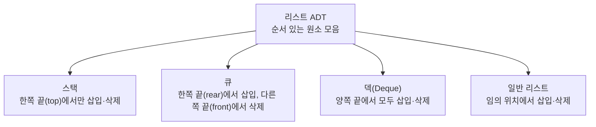

## 왜 이 편이 다시 필요한가

01편(자료구조 공부를 위한 용어 지도)에서 데이터·자료형·자료구조·추상자료형(Abstract Data Type, ADT)의 위계를 세우고, 스택 ADT와 리스트 ADT를 예로 "연산의 이름과 의미만 정의하고 구현은 감춘다"는 ADT의 성질을 확인했다. 첫째, ADT를 시험 답안처럼 **형식을 갖춰 쓰는 법**이다.

## ADT를 형식 갖춰 정의하는 법

시험에서 요구하는 ADT 정의는 보통 세 부분으로 구성된다.

1. **데이터 객체(data objects)**: 이 ADT가 다루는 값들의 집합. 예를 들어 스택 ADT의 데이터 객체는 "같은 자료형의 원소들을 순서대로 늘어놓은 유한 수열"이다.
2. **연산(operations)**: 그 데이터에 대해 수행할 수 있는 동작의 목록. 각 연산은 이름, 입력(매개변수), 출력(반환값), 그리고 **선행조건**(precondition, 이 연산을 호출하기 전에 만족해야 하는 조건)과 **후행조건**(postcondition, 연산이 끝난 뒤 보장되는 상태)까지 명시하는 것이 정석이다.
3. **오류 조건(error conditions)**: 선행조건이 깨졌을 때 어떤 일이 일어나는지. 예를 들어 빈 스택에서 `pop`을 호출하면 "스택 언더플로(underflow)" 오류가 난다.

스택 ADT를 이 형식으로 다시 써 보면 다음과 같다.

| 연산 | 입력 | 출력 | 선행조건 | 후행조건 |
|------|------|------|----------|----------|
| `push(x)` | 원소 `x` | 없음 | 스택에 공간이 있어야 함(오버플로 아님) | `x`가 스택의 맨 위에 추가됨 |
| `pop()` | 없음 | 제거된 맨 위 원소 | 스택이 비어 있지 않아야 함 | 맨 위 원소가 제거되고 그 아래 원소가 새 맨 위가 됨 |
| `peek()` | 없음 | 맨 위 원소(제거하지 않음) | 스택이 비어 있지 않아야 함 | 스택 상태 변화 없음 |
| `isEmpty()` | 없음 | 참/거짓 | 없음 | 스택 상태 변화 없음 |

이렇게 선행조건·후행조건까지 적으면 "빈 스택에서 `pop()`을 호출하면 어떻게 되는가?"라는 문제에 "선행조건 위반이므로 정의되지 않은 동작이거나 언더플로 오류를 내야 한다"고 정확히 답할 수 있다. 표에 선행조건 칸이 없으면 이 판단 근거가 사라진다는 점이 시험에서 자주 노리는 함정이다.

> **자주 틀리는 점:** "스택이 비어 있을 때 `pop()`을 호출하면 0을 반환한다"처럼 **구현에서 흔히 쓰는 편의적 처리**를 ADT의 정의로 착각하는 보기가 나온다. ADT 명세 자체는 그런 값을 정하지 않는다. 그것은 특정 구현이 선택한 오류 처리 방식일 뿐이다.

## 연산의 성질로 자료구조를 구분하기

같은 리스트 ADT라도 원소를 어디에 넣고 뺄 수 있는지에 따라 하위 종류가 갈린다. 이 구분은 09~10편(스택·큐)의 밑바탕이 되므로 여기서 미리 정리한다.

```mermaid
flowchart TD
    L["리스트 ADT<br/>순서 있는 원소 모음"] --> S["스택<br/>한쪽 끝(top)에서만 삽입·삭제"]
    L --> Q["큐<br/>한쪽 끝(rear)에서 삽입, 다른 쪽 끝(front)에서 삭제"]
    L --> D["덱(Deque)<br/>양쪽 끝에서 모두 삽입·삭제"]
    L --> G["일반 리스트<br/>임의 위치에서 삽입·삭제"]
```

이 그림에서 중요한 것은 "무엇을 저장하는가"가 아니라 "어느 위치에서 연산이 허용되는가"가 자료구조의 정체성을 결정한다는 점이다. 스택과 큐는 저장하는 데이터의 종류가 같아도, 삽입·삭제가 허용된 위치가 다르기 때문에 서로 다른 ADT가 된다.

## 복잡도를 자료구조 선택의 근거로 쓰기

02편에서 배운 빅오 표기를 실제로 "왜 이 자료구조를 골랐는가"를 설명하는 데 쓰는 연습을 해 보자. 자료구조를 비교할 때는 항상 **어떤 연산을, 얼마나 자주 쓰는가**를 먼저 정해야 한다. 같은 자료구조라도 연산에 따라 복잡도가 다르기 때문이다.

예를 들어 정렬되지 않은 원소 $n$개를 배열에 저장한 경우와 정렬된 배열에 저장한 경우를 비교해 보자.

| 연산 | 정렬 안 된 배열 | 정렬된 배열 |
|------|-----------------|-------------|
| 특정 값 탐색 | $O(n)$ (처음부터 끝까지 순차 탐색) | $O(\log n)$ (이진 탐색, 16편에서 자세히) |
| 맨 뒤에 삽입 | $O(1)$ | $O(n)$ (정렬 위치를 찾고 뒤 원소를 밀어야 함) |
| 임의 위치 삭제 | $O(n)$ (빈 자리를 채우려고 뒤 원소를 당겨야 함) | $O(n)$ (동일) |

여기서 $n$은 저장된 원소의 개수를 뜻한다. 이 표가 보여 주는 것은 "정렬된 배열이 무조건 좋다"가 아니라 **탐색을 자주 하고 삽입은 드물게 한다면 정렬된 배열이 유리하고, 삽입이 잦다면 정렬 비용 때문에 오히려 불리해진다**는 트레이드오프(trade-off, 하나를 얻으면 다른 하나를 희생하는 관계)다.

## 자료구조 선택 기준을 체크리스트로

01편에서 제시한 세 기준(연산 종류, 순서의 의미, 메모리)을 시험 답안에 바로 쓸 수 있는 절차로 정리하면 다음과 같다.

## 자주 틀리는 점

- **ADT 명세에 구현 세부사항(배열이냐 연결리스트냐, 반환값이 0이냐 -1이냐)을 섞어 넣는 오류**: ADT는 연산의 이름·의미·선행조건까지만 정의한다. 구체적인 반환값 관례는 구현이 정한다.
- **복잡도를 비교할 때 어떤 연산인지 특정하지 않고 "배열이 빠르다/느리다"처럼 뭉뚱그리는 오류**: 같은 배열도 인덱스 접근은 $O(1)$이지만 임의 위치 삽입은 $O(n)$이다. 연산을 반드시 특정해야 한다.
- **평균/최선/최악을 구분하지 않고 하나의 복잡도만 말하는 오류**: 02편에서 다룬 대로, "정렬 안 된 배열의 탐색은 최악의 경우 $O(n)$"처럼 어떤 경우를 말하는지 밝혀야 한다.

## 핵심 정리

- ADT 정의는 데이터 객체, 연산(입력·출력·선행조건·후행조건), 오류 조건 세 부분을 갖출 때 시험 답안 형식으로 완성된다.
- 스택·큐·덱·일반 리스트는 모두 리스트 ADT의 하위 종류이며, 삽입·삭제가 허용된 위치로 구분된다.
- 자료구조 선택은 특정 연산의 복잡도를 후보 자료구조별로 비교하고, 얻는 것과 잃는 것을 함께 근거로 제시해야 한다.
- 선택 절차는 "빈출 연산 특정 → 후보별 복잡도 비교 → $n$에 따른 병목 판단 → 메모리 제약 확인 → 결론과 근거 서술"의 순서로 진행한다.

## 마무리 복습

<Quiz
  questionNumber={1}
  question={"ADT 명세에 반드시 포함되어야 하는 요소로 가장 거리가 먼 것은?"}
  options={["연산의 이름과 입력/출력","연산을 호출하기 전에 만족해야 하는 선행조건","이 ADT를 배열로 구현할지 연결리스트로 구현할지에 대한 지정","선행조건이 깨졌을 때의 오류 조건"]}
  correctAnswer={3}
  explanation={"ADT 명세는 연산의 이름·입력·출력·선행조건·후행조건·오류 조건까지 포함하지만, 구체적으로 어떤 자료구조로 구현할지는 명시하지 않는다. 그것은 구현 단계에서 결정된다."}
/>

<Quiz
  questionNumber={2}
  question={"빈 스택에서 pop() 연산을 호출했을 때 ADT 명세 관점에서 가장 올바른 설명은?"}
  options={["항상 0을 반환한다","선행조건(스택이 비어 있지 않음)을 위반했으므로 정의되지 않은 동작이거나 오류로 처리해야 한다","가장 아래 원소를 대신 반환한다","스택의 크기를 자동으로 늘려서 처리한다"]}
  correctAnswer={2}
  explanation={"pop()의 선행조건은 스택이 비어 있지 않아야 한다는 것이다. 이 조건이 깨졌으므로 ADT 명세상으로는 오류 조건으로 처리해야 하며, 특정 값을 반환하는 것은 명세가 아니라 구현의 편의적 선택이다."}
/>

<Quiz
  questionNumber={3}
  question={"리스트 ADT의 하위 종류 중 양쪽 끝에서 모두 삽입과 삭제가 가능한 것은?"}
  options={["스택","큐","덱(Deque)","정렬된 배열"]}
  correctAnswer={3}
  explanation={"덱(Deque, Double-Ended Queue)은 양쪽 끝에서 삽입과 삭제가 모두 가능한 리스트 ADT의 하위 종류다. 스택은 한쪽 끝에서만, 큐는 한쪽 끝에서 삽입하고 반대쪽 끝에서 삭제한다."}
/>

## 참고 자료

- [국가평생교육진흥원 과목별 평가영역](https://bdes.nile.or.kr/nile/study/nStudy2_1.do) — 자료구조 과목의 범위와 평가영역을 확인할 수 있는 공식 안내.
- [MDN JavaScript reference](https://developer.mozilla.org/en-US/docs/Web/JavaScript) — 배열·객체 등 기본 구성 요소가 실제 언어에서 어떻게 제공되는지 확인할 수 있는 참고 자료.
