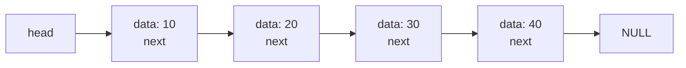

<Callout type="info">
  **이번 문서의 목표:** 이 문서를 다 읽으면 단순 연결리스트의 노드 구조를 그릴 수 있고, 맨 앞·중간·맨 뒤 삽입과 삭제를 포인터가 바뀌는 순서대로 정확히 추적할 수 있으며, 배열과 비교해 언제 연결리스트가 유리한지 설명할 수 있다.
</Callout>

## 왜 배열만으로는 부족한가

06편에서 배열은 인덱스로 즉시 접근할 수 있지만, 중간에 원소를 삽입·삭제할 때는 뒤 원소를 전부 이동해야 해서 $O(n)$이 든다는 것을 확인했다. 이 이동 비용이 생기는 근본 원인은 배열이 **메모리에서 반드시 연속된 자리**를 차지해야 하기 때문이다. 연결리스트(linked list)는 이 제약을 없앤다. 각 원소를 메모리 어디에나 흩어져 있게 두고, 대신 "다음 원소가 어디에 있는지"를 가리키는 **링크**(포인터)로 원소들을 실처럼 꿰어 연결한다. 04편(연결 구조를 읽기 위한 포인터 감각)에서 잡은 참조·노드·링크의 직관을 여기서 실제 자료구조로 완성한다.

> **쉽게 말하면:** 배열이 "번호표를 붙여 한 줄로 세워 놓은 자리"라면, 연결리스트는 "각자 다음 사람이 누군지 손에 쪽지를 들고 있는, 자리는 흩어져 있어도 순서는 유지되는 줄"이다.

## 노드와 단순 연결리스트의 구조

단순 연결리스트(singly linked list)를 이루는 기본 단위는 **노드**(node)다. 노드 하나는 두 부분으로 구성된다.

- **데이터 필드(data field)**: 실제로 저장하려는 값
- **링크 필드(link field, next 포인터)**: 다음 노드의 주소를 가리키는 포인터. 마지막 노드의 링크 필드는 "더 이상 다음이 없다"는 뜻으로 `NULL`을 가리킨다.

C에서는 구조체(struct)로 노드를 표현한다.

```c
#include <stdio.h>
#include <stdlib.h>

typedef struct Node {
    int data;           // 데이터 필드
    struct Node *next;  // 링크 필드(다음 노드를 가리키는 포인터)
} Node;
```

노드 4개가 `10 -> 20 -> 30 -> 40 -> NULL` 순서로 연결된 리스트를 그림으로 보면 다음과 같다.



리스트 전체를 대표하는 것은 **head 포인터** 하나뿐이다. head가 첫 번째 노드를 가리키고 있고, 그 노드가 다음 노드를 가리키고, 이 연결을 따라가면 마지막 노드의 `NULL`에 도달할 때까지 전체 리스트를 훑을 수 있다. 배열과 달리 "몇 번째 노드가 정확히 몇 번지에 있는가"는 미리 계산할 수 없다. 오직 head부터 링크를 따라가야만 $k$번째 노드에 도달할 수 있다는 점이 배열과의 가장 큰 차이다.

> **자주 틀리는 점:** 연결리스트에서 "3번째 원소에 접근하라"는 문제를 배열처럼 $O(1)$로 계산할 수 있다고 착각하면 안 된다. 연결리스트의 임의 위치 접근은 head부터 링크를 하나씩 따라가야 하므로 $O(n)$이다.

## 리스트 순회(traversal)

리스트의 모든 노드를 방문하며 값을 출력하는 순회 연산을 살펴보자.

```c
void printList(Node *head) {
    Node *cur = head;
    while (cur != NULL) {
        printf("%d ", cur->data);
        cur = cur->next;  // 다음 노드로 이동
    }
    printf("\n");
}
```

`10 -> 20 -> 30 -> 40 -> NULL` 리스트에 대해 이 함수가 실행되는 과정을 `cur` 포인터의 변화로 추적하면 다음과 같다.

| 단계 | cur이 가리키는 노드 | 출력 | cur = cur->next 이후 |
|------|----------------------|------|------------------------|
| 1 | 10 | "10" | cur는 20 노드를 가리킴 |
| 2 | 20 | "20" | cur는 30 노드를 가리킴 |
| 3 | 30 | "30" | cur는 40 노드를 가리킴 |
| 4 | 40 | "40" | cur는 NULL이 됨 |
| 5 | NULL이므로 반복 종료 | (없음) | - |

```text
10 20 30 40
```

노드가 $n$개면 `while` 문이 $n$번 돌고 종료 확인까지 1번 더 하므로, 순회의 시간 복잡도는 $O(n)$이다.

## 맨 앞 삽입 — 포인터 두 줄이면 끝

맨 앞에 새 노드를 넣는 연산은 연결리스트가 배열보다 압도적으로 유리한 지점이다. 기존 원소를 하나도 옮기지 않고 포인터만 바꾸면 된다. `5`를 맨 앞에 삽입하는 과정을 추적해 보자(기존 리스트: `10 -> 20 -> 30 -> NULL`).

| 단계 | 수행 내용 | head가 가리키는 노드 |
|------|-----------|------------------------|
| 0 | 삽입 전 | 10 (10 -> 20 -> 30 -> NULL) |
| 1 | 새 노드(값 5)를 생성 | head는 아직 10을 가리킴, newNode는 아직 아무도 안 가리킴 |
| 2 | newNode->next = head (newNode가 10 노드를 가리키게 함) | head는 여전히 10, newNode -> 10 |
| 3 | head = newNode (head가 새 노드를 가리키게 함) | head는 5 (5 -> 10 -> 20 -> 30 -> NULL) |

```c
Node* insertFront(Node *head, int value) {
    Node *newNode = (Node*)malloc(sizeof(Node));
    newNode->data = value;
    newNode->next = head;  // 새 노드가 기존 head를 가리킴
    return newNode;        // 새 노드가 새로운 head가 됨
}
```

이 연산은 리스트 크기와 무관하게 포인터 대입 두 번(`newNode->next = head`, `head = newNode`)이면 끝나므로 시간 복잡도는 $O(1)$이다. 배열의 맨 앞 삽입이 원소를 전부 밀어야 해서 $O(n)$인 것과 정반대다.

## 중간 삽입 — 두 노드 사이 끼워 넣기

`10 -> 20 -> 30 -> NULL`에서 `20`과 `30` 사이에 `25`를 삽입하는 과정을 추적해 보자. 핵심은 **삽입할 위치 바로 앞 노드**(여기서는 `20` 노드, `prev`라고 부른다)를 먼저 찾는 것이다.

| 단계 | 수행 내용 | 상태 |
|------|-----------|------|
| 0 | prev가 20 노드를 가리키도록 탐색(head부터 링크 1번 이동) | prev -> 20 |
| 1 | 새 노드(값 25) 생성 | newNode: data=25, next=미정 |
| 2 | newNode->next = prev->next (newNode가 30 노드를 가리키게 함) | newNode -> 30 |
| 3 | prev->next = newNode (20 노드가 새 노드를 가리키게 함) | 20 -> 25 -> 30 |

```c
void insertAfter(Node *prev, int value) {
    if (prev == NULL) return;
    Node *newNode = (Node*)malloc(sizeof(Node));
    newNode->data = value;
    newNode->next = prev->next;  // 순서 중요: 먼저 뒤쪽 연결부터 잇는다
    prev->next = newNode;        // 그다음 앞쪽 연결을 바꾼다
}
```

> **자주 틀리는 점:** `prev->next = newNode`를 먼저 실행하고 `newNode->next = prev->next`를 나중에 실행하면, 이미 `prev->next`가 `newNode` 자신을 가리키게 된 뒤라서 `newNode->next`도 자기 자신을 가리키게 되어 리스트가 끊어진다. **반드시 새 노드의 링크를 먼저 연결한 다음 앞 노드의 링크를 바꿔야** 순서가 안전하다.

노드 자체를 끼워 넣는 것은 포인터 대입 두 번, $O(1)$이지만, "20 노드를 찾는" 탐색 과정이 head부터 링크를 따라가야 하므로 $O(n)$이 걸린다. 그래서 전체 삽입 연산은 **삽입 위치를 이미 포인터로 알고 있다면 $O(1)$, 위치를 값으로 찾아야 한다면 $O(n)$**이라고 구분해서 답해야 한다.

## 삭제 — 앞 노드가 다음다음을 가리키게

`5 -> 10 -> 20 -> 30 -> NULL`에서 `20`을 삭제하는 과정을 추적해 보자. 여기서도 삭제할 노드의 **바로 앞 노드**(`10` 노드, `prev`)를 먼저 찾아야 한다.

| 단계 | 수행 내용 | 상태 |
|------|-----------|------|
| 0 | prev가 10 노드를 가리키도록 탐색 | prev -> 10, prev->next -> 20 |
| 1 | target = prev->next (삭제할 노드 20을 임시로 기억) | target -> 20 |
| 2 | prev->next = target->next (10 노드가 30 노드를 직접 가리키게 함) | 10 -> 30 (20은 리스트에서 빠짐) |
| 3 | free(target) (20 노드가 차지하던 메모리 반환) | 5 -> 10 -> 30 -> NULL |

```c
void deleteAfter(Node *prev) {
    if (prev == NULL || prev->next == NULL) return;
    Node *target = prev->next;
    prev->next = target->next;  // 삭제 대상을 건너뛰고 바로 연결
    free(target);
}
```

배열의 삭제가 뒤 원소를 전부 당겨야 했던 것과 달리, 연결리스트는 앞 노드의 링크 하나만 바꾸면 된다. 노드를 찾는 탐색까지 포함하면 $O(n)$, 삭제할 노드의 바로 앞 노드를 이미 알고 있다면 삭제 자체는 $O(1)$이다.

> **자주 틀리는 점:** `free(target)`을 `prev->next = target->next`보다 먼저 실행하면, 이미 해제된 메모리의 `next` 값을 읽으려다 오류가 나거나 예측 불가능한 값을 참조하게 된다. **링크를 먼저 바꾸고 메모리를 나중에 해제**하는 순서를 지켜야 한다.

## 배열과 연결리스트 비교

06편의 표에 연결리스트 열을 추가해 나란히 비교하면 다음과 같다.

| 연산 | 배열 | 단순 연결리스트 |
|------|------|-------------------|
| 인덱스로 접근 | $O(1)$ | $O(n)$ (head부터 순차적으로 이동해야 함) |
| 맨 앞 삽입/삭제 | $O(n)$ (전부 이동) | $O(1)$ (포인터만 변경) |
| 중간 삽입/삭제(위치를 이미 아는 경우) | $O(n)$ (이동 필요) | $O(1)$ (포인터만 변경) |
| 값으로 위치를 찾아 삽입/삭제 | $O(n)$ 탐색 + $O(n)$ 이동 | $O(n)$ 탐색 + $O(1)$ 변경 |
| 메모리 사용 | 원소 크기만 사용 | 원소 크기 + 링크(포인터) 크기 추가 필요 |
| 크기 변경 | 재할당 필요 | 노드 단위로 자유롭게 증가 |

이 표에서 눈여겨볼 점은 "값으로 위치를 찾는" 경우에는 두 구조 모두 탐색에 $O(n)$이 걸린다는 것이다. 연결리스트가 유리한 지점은 **삽입·삭제 위치를 이미 포인터로 알고 있을 때**이지, 무조건 배열보다 빠른 것이 아니다. 이 구분을 놓치면 "연결리스트는 삽입이 항상 $O(1)$이다"라는 틀린 결론에 빠지기 쉽다.

## 연결리스트의 응용 감각

단순 연결리스트는 그 자체로도 쓰이지만, 이후 편들의 기초가 된다. 스택과 큐(09편)는 연결리스트로 구현할 수 있고(맨 앞 삽입·삭제가 $O(1)$이라는 성질을 그대로 활용한다), 이진트리(12편)의 노드도 데이터 필드에 링크 필드가 두 개(왼쪽·오른쪽 자식) 있는 구조로 확장된 것이라고 볼 수 있다. 08편에서는 링크 필드를 하나 더 추가한 이중 연결리스트와, 마지막 노드가 다시 첫 노드를 가리키는 원형 연결리스트를 다룬다.

## 자주 틀리는 점

- **연결리스트의 임의 위치 접근을 배열처럼 $O(1)$로 착각하는 오류**: 연결리스트는 인덱스 계산이 불가능하고, head부터 링크를 따라가야 하므로 $O(n)$이다.
- **포인터 대입 순서를 바꿔 리스트를 끊어 먹는 오류**: 삽입 시 새 노드의 링크를 먼저 연결하고, 삭제 시 앞 노드의 링크를 먼저 바꾼 뒤 메모리를 해제해야 한다.
- **"연결리스트는 삽입이 항상 $O(1)$이다"라고 단정하는 오류**: 삽입 위치를 값으로 찾아야 한다면 탐색에 $O(n)$이 걸린다. 포인터를 이미 쥐고 있을 때만 삽입 자체가 $O(1)$이다.

## 핵심 정리

- 단순 연결리스트의 노드는 데이터 필드와 다음 노드를 가리키는 링크 필드로 구성되며, head 포인터 하나로 전체 리스트를 대표한다.
- 순회·값으로 위치 찾기는 $O(n)$이고, 삽입·삭제 위치를 이미 포인터로 알고 있다면 그 연산 자체는 $O(1)$이다.
- 삽입은 "새 노드의 링크를 먼저 연결 → 앞 노드의 링크를 바꾼다" 순서로, 삭제는 "앞 노드의 링크를 바꾼다 → 메모리 해제" 순서로 해야 리스트가 끊어지지 않는다.
- 연결리스트는 맨 앞·중간 삽입·삭제가 빠른 대신 인덱스 접근이 느리고 링크를 저장할 추가 메모리가 필요하다는 트레이드오프를 가진다.

## 마무리 복습

<Quiz
  questionNumber={1}
  question="단순 연결리스트의 노드를 구성하는 두 요소로 옳은 것은?"
  options={['시작 주소와 끝 주소', '데이터 필드와 다음 노드를 가리키는 링크 필드', '인덱스와 값', '행 번호와 열 번호']}
  correctAnswer={2}
  explanation="단순 연결리스트의 노드는 실제 값을 담는 데이터 필드와, 다음 노드의 주소를 가리키는 링크 필드(next 포인터)로 구성된다."
  optionExplanations={['시작 주소와 끝 주소는 배열의 메모리 범위를 설명하는 개념이며 노드 구성 요소가 아니다.', '정답. 데이터 필드와 링크 필드가 노드를 구성하는 두 요소다.', '인덱스와 값은 배열에서 원소를 식별하는 방식이다.', '행 번호와 열 번호는 2차원 배열과 관련된 개념이다.']}
/>

<Quiz
  questionNumber={2}
  question="다음 중 단순 연결리스트의 리스트 순회(traversal)에 대한 설명으로 옳은 것은?"
  options={['head 포인터를 배열의 인덱스처럼 계산에 사용해 원하는 노드로 바로 이동한다', 'cur 포인터를 head부터 시작해 cur가 NULL이 될 때까지 next를 따라가며 모든 노드를 방문한다', '리스트의 마지막 노드부터 역순으로만 방문할 수 있다', '노드 개수와 관계없이 항상 일정한 횟수만 반복한다']}
  correctAnswer={2}
  explanation="순회는 cur 포인터를 head로 초기화한 뒤 cur가 NULL이 될 때까지 cur를 cur의 next로 반복해서 옮기며 모든 노드를 차례로 방문하는 연산이다. 노드가 n개면 반복 횟수도 n에 비례해 O(n)이다."
  optionExplanations={['연결리스트는 인덱스 계산으로 바로 이동할 수 없고 링크를 따라가야 한다.', '정답. cur를 head부터 NULL이 될 때까지 next를 따라 이동시키며 모든 노드를 방문하는 것이 순회다.', '단순 연결리스트는 next 링크만 있으므로 기본적으로 정방향으로만 순회할 수 있다.', '순회 횟수는 노드 개수 n에 비례하므로 항상 일정하지 않다.']}
/>

<Quiz
  questionNumber={3}
  question="단순 연결리스트에서 head부터 시작해 k번째 노드에 접근하는 연산의 시간 복잡도로 옳은 것은?"
  options={['O(1), 배열처럼 주소를 바로 계산할 수 있다', 'O(k), head부터 링크를 하나씩 따라가야 한다', 'O(log k), 이진 탐색을 적용할 수 있다', 'O(1), 링크 필드에 인덱스 정보가 저장되어 있다']}
  correctAnswer={2}
  explanation="연결리스트는 인덱스로 주소를 계산할 수 없으므로 head부터 링크를 하나씩 따라가야 k번째 노드에 도달한다. 따라서 시간 복잡도는 O(k)이며, 리스트 전체 길이 n에 대해서는 최악의 경우 O(n)이다."
  optionExplanations={['배열과 달리 연결리스트는 주소를 바로 계산할 수 없다.', '정답. head부터 링크를 순서대로 따라가야 하므로 O(k)다.', '연결리스트는 정렬 여부와 무관하게 링크를 순서대로만 따라갈 수 있어 이진 탐색을 적용할 수 없다.', '링크 필드에는 다음 노드의 주소만 저장되며 인덱스 정보는 없다.']}
/>

<Quiz
  questionNumber={4}
  question="다음 중 새 노드를 리스트의 맨 앞에 삽입하는 연산에 대한 설명으로 옳은 것은?"
  options={['기존 노드를 전부 한 칸씩 뒤로 밀어야 한다', '새 노드의 next가 기존 head를 가리키게 한 뒤 head를 새 노드로 바꾸면 되므로 O(1)이다', '리스트의 모든 노드를 순회한 뒤에만 삽입할 수 있다', '배열의 맨 앞 삽입과 동일하게 O(n)이다']}
  correctAnswer={2}
  explanation="연결리스트의 맨 앞 삽입은 새 노드의 next를 기존 head로 연결하고 head를 새 노드로 바꾸는 두 번의 포인터 대입만으로 끝나며 기존 노드를 이동할 필요가 없어 O(1)이다."
  optionExplanations={['노드를 이동하는 것은 배열의 맨 앞 삽입 방식이며 연결리스트에는 해당하지 않는다.', '정답. 포인터 두 번의 대입만으로 O(1)에 처리된다.', '맨 앞 삽입은 리스트를 순회할 필요가 없다.', '연결리스트의 맨 앞 삽입은 O(1)이며 배열의 O(n)과 대조된다.']}
/>

<Quiz
  questionNumber={5}
  question="prev가 가리키는 노드 바로 뒤에 새 노드를 삽입할 때, 다음 두 문장의 올바른 실행 순서는? (1) prev의 next를 newNode로 바꾼다. (2) newNode의 next를 기존 prev의 next로 연결한다."
  options={['(1) 다음 (2) 순서로 실행해야 한다', '(2) 다음 (1) 순서로 실행해야 한다', '순서는 결과에 영향을 주지 않는다', '두 문장을 동시에 실행해야 하며 순서 개념이 없다']}
  correctAnswer={2}
  explanation="(1)을 먼저 실행하면 prev의 next가 이미 newNode를 가리키게 되어, 이후 newNode의 next를 prev의 next로 연결하면 newNode가 자기 자신을 가리키게 되어 리스트가 끊어진다. 반드시 newNode의 next를 먼저 연결한 뒤 prev의 next를 바꿔야 한다."
  optionExplanations={['이 순서로 실행하면 newNode가 자기 자신을 가리키게 되어 리스트가 끊어진다.', '정답. 새 노드의 링크를 먼저 연결한 뒤 앞 노드의 링크를 바꿔야 안전하다.', '순서를 바꾸면 리스트가 끊어지므로 순서는 결과에 직접적인 영향을 준다.', 'C 코드는 한 줄씩 순차적으로 실행되므로 순서가 존재한다.']}
/>

<Quiz
  questionNumber={6}
  question="배열과 단순 연결리스트를 비교한 설명으로 옳지 않은 것은?"
  options={['배열은 인덱스로 즉시 접근할 수 있지만 연결리스트는 순차적으로 따라가야 한다', '연결리스트는 맨 앞 삽입이 O(1)이지만 배열은 O(n)이다', '연결리스트는 링크(포인터)를 저장할 추가 메모리가 필요하지만 배열은 그렇지 않다', '연결리스트는 값을 찾아서 삭제하는 연산 전체가 항상 O(1)이다']}
  correctAnswer={4}
  explanation="값을 찾아서 삭제하려면 먼저 그 값을 가진 노드(또는 바로 앞 노드)를 탐색해야 하며 이 탐색이 O(n)이다. 삭제 자체(포인터 변경)만 O(1)이지, 탐색까지 포함한 전체 연산이 항상 O(1)인 것은 아니다."
  optionExplanations={['배열의 O(1) 접근과 연결리스트의 O(n) 순차 접근 비교는 옳은 설명이다.', '맨 앞 삽입에서 연결리스트 O(1), 배열 O(n) 비교는 옳은 설명이다.', '연결리스트의 링크 필드가 추가 메모리를 차지한다는 것은 옳은 설명이다.', '정답(옳지 않은 설명). 값을 찾는 탐색 과정까지 포함하면 전체는 O(n)이다.']}
/>

## 참고 자료

- [국가평생교육진흥원 과목별 평가영역](https://bdes.nile.or.kr/nile/study/nStudy2_1.do) — 자료구조 과목의 범위와 평가영역을 확인할 수 있는 공식 안내.
- [MDN JavaScript reference](https://developer.mozilla.org/en-US/docs/Web/JavaScript) — 참조(reference) 기반 자료구조의 감각을 확인할 수 있는 참고 자료.
