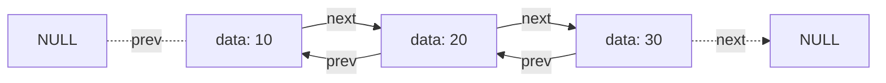
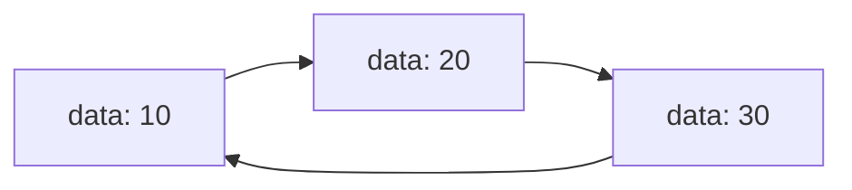

<Callout type="info">
  **이번 문서의 목표:** 이 문서를 다 읽으면 이중 연결리스트가 역방향 탐색을 지원하는 원리와 원형 연결리스트가 끝없이 순환할 수 있는 원리를 포인터 구조로 설명할 수 있고, 단순 연결리스트 대비 각각의 장단점을 삽입·삭제 과정으로 비교할 수 있다.
</Callout>

## 왜 링크를 하나 더 두거나 순환시키는가

07편에서 다룬 단순 연결리스트는 `next` 링크 하나로 앞으로만 이동할 수 있다. 그래서 "현재 노드의 바로 앞 노드가 무엇인지"를 알아내려면 head부터 다시 처음부터 탐색해야 하는 불편함이 있다. 또한 마지막 노드는 `NULL`을 가리키고 있어서, "마지막까지 갔다가 다시 처음으로 돌아가야 하는" 상황(예: 여러 사용자가 자리를 돌아가며 순서를 갖는 라운드 로빈(round robin) 방식)을 자연스럽게 표현하지 못한다. 이 편에서 다루는 **이중 연결리스트**(doubly linked list)는 링크를 하나 더 두어 "뒤로도 갈 수 있게" 하고, **원형 연결리스트**(circular linked list)는 마지막 노드가 다시 첫 노드를 가리키게 해 "끝나지 않고 순환하게" 만든다.

> **쉽게 말하면:** 이중 연결리스트는 "앞뒤로 다 갈 수 있는 줄"이고, 원형 연결리스트는 "마지막 사람이 다시 첫 사람 손을 잡아 원을 이루는 줄"이다.

## 이중 연결리스트의 구조

이중 연결리스트의 노드는 데이터 필드 하나와 링크 필드 두 개(이전 노드를 가리키는 `prev`, 다음 노드를 가리키는 `next`)로 구성된다.

```c
typedef struct DNode {
    int data;
    struct DNode *prev;  // 이전 노드를 가리키는 링크
    struct DNode *next;  // 다음 노드를 가리키는 링크
} DNode;
```

노드 3개가 연결된 이중 연결리스트를 그림으로 보면 다음과 같다. 첫 노드의 `prev`와 마지막 노드의 `next`는 각각 `NULL`이다.



이 구조 덕분에 어떤 노드를 손에 쥐고 있으면 `node->prev`로 바로 앞 노드에, `node->next`로 바로 뒤 노드에 $O(1)$로 이동할 수 있다. 단순 연결리스트에서는 "바로 앞 노드"를 알아내려면 head부터 다시 탐색해 $O(n)$이 걸렸던 것과 대조된다.

> **쉽게 말하면:** 이중 연결리스트는 각 노드가 "내 앞 사람"과 "내 뒷 사람"을 모두 손에 쥐고 있어서, 어느 방향으로든 바로 한 걸음 움직일 수 있는 구조다.

## 이중 연결리스트의 삽입 — 링크 네 개를 정확한 순서로

`10 ↔ 20 ↔ 30`(양방향 연결, 첫 노드 `prev`는 `NULL`, 마지막 노드 `next`는 `NULL`)에서 `20`과 `30` 사이에 `25`를 삽입하는 과정을 추적해 보자. `cur`는 `20` 노드를 가리키는 포인터라고 하자.

| 단계 | 수행 내용 | 상태 |
|------|-----------|------|
| 0 | 삽입 전 | 10 ↔ 20 ↔ 30 |
| 1 | 새 노드 생성(newNode, data=25) | newNode의 prev·next는 아직 미정 |
| 2 | newNode->next = cur->next (newNode가 30을 가리키게 함) | newNode -> 30 |
| 3 | newNode->prev = cur (newNode가 20을 가리키게 함) | 20 ← newNode |
| 4 | cur->next->prev = newNode (기존 30의 prev를 newNode로 바꿈) | 30의 prev -> newNode |
| 5 | cur->next = newNode (20의 next를 newNode로 바꿈) | 20 -> newNode |

```c
void insertAfterD(DNode *cur, int value) {
    DNode *newNode = (DNode*)malloc(sizeof(DNode));
    newNode->data = value;
    newNode->next = cur->next;
    newNode->prev = cur;
    if (cur->next != NULL) {
        cur->next->prev = newNode;  // 원래 다음 노드의 prev부터 갱신
    }
    cur->next = newNode;            // 마지막에 cur의 next를 갱신
}
```

이중 연결리스트의 삽입은 단순 연결리스트보다 바꿔야 할 링크가 두 배(4개)이지만, 삽입 자체(위치를 이미 알고 있을 때)는 여전히 $O(1)$이다. **순서가 중요한 이유**는 단순 연결리스트 때와 같다. `cur->next = newNode`를 먼저 실행해 버리면 그다음 줄에서 `cur->next->prev`가 이미 `newNode`를 가리키게 되어 원래의 `30` 노드에 접근할 방법이 사라진다.

> **자주 틀리는 점:** 이중 연결리스트 삽입 문제에서 `prev`와 `next` 중 **하나만 갱신하고 끝냈다고 착각**하는 오류가 잦다. 새 노드 하나를 끼워 넣으려면 항상 **4개의 링크**(newNode->next, newNode->prev, 앞 노드의 next, 뒤 노드의 prev)를 전부 맞춰야 리스트가 정상적으로 연결된다.

## 이중 연결리스트의 삭제

`10 ↔ 20 ↔ 30`에서 `20`을 삭제하는 과정을 추적해 보자. `target`은 `20` 노드를 가리키는 포인터다.

| 단계 | 수행 내용 | 상태 |
|------|-----------|------|
| 0 | 삭제 전 | 10 ↔ 20 ↔ 30 |
| 1 | target->prev->next = target->next (10의 next를 30으로 바꿈) | 10 -> 30 |
| 2 | target->next->prev = target->prev (30의 prev를 10으로 바꿈) | 30 -> 10(prev 방향) |
| 3 | free(target) | 10 ↔ 30 (20은 리스트에서 제거됨) |

```c
void deleteNodeD(DNode *target) {
    if (target->prev != NULL) {
        target->prev->next = target->next;
    }
    if (target->next != NULL) {
        target->next->prev = target->prev;
    }
    free(target);
}
```

단순 연결리스트의 삭제는 "삭제할 노드의 바로 앞 노드"를 알아야만 가능했지만(그렇지 않으면 앞 노드부터 다시 탐색해야 했다), 이중 연결리스트는 삭제할 노드 자신만 알아도 `target->prev`로 바로 앞 노드에 접근할 수 있으므로 **탐색 없이 바로 삭제**할 수 있다는 것이 실질적인 이점이다.

## 이중 연결리스트의 역방향 순회

이중 연결리스트의 가장 뚜렷한 장점은 마지막 노드에서 시작해 거꾸로 순회할 수 있다는 것이다.

```c
void printReverse(DNode *tail) {
    DNode *cur = tail;
    while (cur != NULL) {
        printf("%d ", cur->data);
        cur = cur->prev;  // 이전 노드로 이동
    }
    printf("\n");
}
```

`10 ↔ 20 ↔ 30`의 마지막 노드(`tail`, 값 30)부터 실행하면 다음과 같이 추적된다.

| 단계 | cur이 가리키는 노드 | 출력 | 다음 이동 |
|------|----------------------|------|-----------|
| 1 | 30 | "30" | cur = cur->prev, 20으로 이동 |
| 2 | 20 | "20" | cur = cur->prev, 10으로 이동 |
| 3 | 10 | "10" | cur = cur->prev, NULL로 이동 |
| 4 | NULL | (없음) | 반복 종료 |

```text
30 20 10
```

단순 연결리스트는 `next`만 있으므로 이런 역방향 순회를 하려면 전체를 스택에 담았다가 꺼내는 등 별도의 자료구조가 필요하지만(09편에서 스택을 배우면 그 방법을 이해할 수 있다), 이중 연결리스트는 `prev`만 따라가면 그대로 끝난다.

## 원형 연결리스트의 구조

원형 연결리스트(circular linked list)는 마지막 노드의 `next`가 `NULL`이 아니라 **첫 노드를 다시 가리키게** 만든 구조다. 단순 연결리스트를 원형으로 바꿀 수도 있고(단순 원형 연결리스트), 이중 연결리스트를 원형으로 바꿀 수도 있다(이중 원형 연결리스트, 이 경우 첫 노드의 `prev`도 마지막 노드를 가리킨다).



원형 연결리스트에서는 `NULL`을 "끝났다"는 판단 기준으로 쓸 수 없다. 대신 **순회를 시작한 노드로 다시 돌아왔는지**로 종료 조건을 판단해야 한다.

```c
void printCircular(Node *head) {
    if (head == NULL) return;
    Node *cur = head;
    do {
        printf("%d ", cur->data);
        cur = cur->next;
    } while (cur != head);  // head로 돌아오면 종료
    printf("\n");
}
```

`10 -> 20 -> 30 -> (다시 10)` 원형 리스트에 대해 이 함수가 실행되는 과정을 추적하면 다음과 같다.

| 단계 | cur이 가리키는 노드 | 출력 | cur == head 판정 |
|------|----------------------|------|---------------------|
| 1 | 10(head) | "10" | cur는 20으로 이동, 판정 대상 아님(do-while 첫 반복) |
| 2 | 20 | "20" | cur는 30으로 이동, cur != head이므로 계속 |
| 3 | 30 | "30" | cur는 10(head)으로 이동, cur == head이므로 종료 |

```text
10 20 30
```

> **자주 틀리는 점:** 원형 연결리스트를 `while (cur != NULL)`로 순회하도록 코드를 짜면 **무한 루프**에 빠진다. 원형 구조에는 애초에 `NULL`이 없으므로, 반드시 "시작 노드로 돌아왔는가"를 종료 조건으로 써야 한다. 이 함정은 시험에서 "다음 코드를 원형 연결리스트에 실행하면 어떻게 되는가"를 묻는 문제로 자주 나온다.

## 원형 연결리스트의 응용 감각

원형 연결리스트는 "순서대로 돌아가면서 처리해야 하는데, 끝에 도달해도 계속 이어져야 하는" 상황에 자연스럽게 들어맞는다. 대표적인 예가 **라운드 로빈 스케줄링**(round robin scheduling, 여러 작업에 순서대로 짧은 시간씩 CPU를 배정하고 마지막 작업 다음에는 다시 첫 작업으로 돌아가는 방식)이다. 또한 마지막 노드에 대한 포인터(`tail`)만 유지하면 `tail->next`가 곧 `head`이므로, 별도의 `head` 변수 없이도 리스트 전체를 표현할 수 있다는 구현상의 이점도 있다.

## 세 연결리스트 비교

07~08편에서 다룬 세 가지 연결리스트를 한 표로 정리하면 다음과 같다.

| 항목 | 단순 연결리스트 | 이중 연결리스트 | 원형 연결리스트 |
|------|-------------------|--------------------|--------------------|
| 링크 필드 수 | 1개(next) | 2개(prev, next) | 1개 이상(구조는 단순/이중과 동일, 마지막이 첫 노드를 가리킴) |
| 역방향 이동 | 불가능(다시 head부터 탐색) | 가능, $O(1)$ | 단순 원형은 불가능, 이중 원형은 가능 |
| 삭제 시 앞 노드 파악 | 별도 탐색 필요, $O(n)$ | target->prev로 즉시 파악, $O(1)$ | 구조에 따라 단순/이중과 동일 |
| 종료 판단 | next가 NULL인지 확인 | next 또는 prev가 NULL인지 확인 | 시작 노드로 돌아왔는지 확인(NULL 없음) |
| 메모리 사용 | 가장 적음(링크 1개) | 가장 많음(링크 2개) | 단순/이중과 동일(원형 여부는 링크 개수와 무관) |
| 적합한 상황 | 단방향 순회로 충분한 경우 | 양방향 탐색·삭제가 잦은 경우(예: 브라우저 뒤로/앞으로 가기) | 순환 배정이 필요한 경우(예: 라운드 로빈) |

## 자주 틀리는 점

- **이중 연결리스트 삽입에서 링크 4개 중 일부만 갱신하는 오류**: newNode의 prev·next, 그리고 양옆 기존 노드의 링크까지 총 4곳을 모두 맞춰야 한다.
- **원형 연결리스트를 `NULL` 검사로 순회하려는 오류**: 원형 구조에는 `NULL`이 없으므로 무한 루프에 빠진다. 시작 노드로 돌아왔는지를 확인해야 한다.
- **"이중 연결리스트가 무조건 더 좋다"고 단정하는 오류**: 이중 연결리스트는 링크가 2개라 메모리를 더 쓰고, 삽입·삭제 시 갱신할 링크도 더 많다. 역방향 탐색이나 즉시 삭제가 필요 없다면 단순 연결리스트로 충분하다.

## 핵심 정리

- 이중 연결리스트는 prev·next 두 링크로 양방향 이동을 지원하며, 삭제할 노드를 알고 있으면 탐색 없이 바로 삭제할 수 있다.
- 이중 연결리스트의 삽입은 newNode의 prev·next, 그리고 양옆 노드의 링크까지 총 4개의 링크를 정확한 순서로 갱신해야 한다.
- 원형 연결리스트는 마지막 노드가 첫 노드를 다시 가리키며, 순회 종료는 `NULL` 대신 "시작 노드로 돌아왔는가"로 판단한다.
- 단순·이중·원형 연결리스트는 각각 링크 수, 역방향 이동 가능 여부, 메모리 사용량에서 트레이드오프를 가지며 상황에 맞게 선택한다.

## 마무리 복습

<Quiz
  questionNumber={1}
  question="이중 연결리스트의 노드가 단순 연결리스트의 노드와 다른 점으로 옳은 것은?"
  options={['데이터 필드가 두 개다', '이전 노드를 가리키는 prev 링크가 추가로 있다', '인덱스를 이용해 O(1)로 임의 접근할 수 있다', 'NULL을 사용하지 않는다']}
  correctAnswer={2}
  explanation="이중 연결리스트의 노드는 단순 연결리스트의 next 링크에 더해 이전 노드를 가리키는 prev 링크를 추가로 가진다."
  optionExplanations={['데이터 필드는 하나이며 링크 필드만 하나 더 추가된 구조다.', '정답. prev 링크가 추가되어 양방향 이동이 가능해진다.', '이중 연결리스트도 인덱스로 바로 접근할 수 없고 링크를 따라가야 한다.', '첫 노드의 prev와 마지막 노드의 next는 여전히 NULL을 사용한다(원형이 아닌 경우).']}
/>

<Quiz
  questionNumber={2}
  question="이중 연결리스트에서 target 노드가 가리키는 노드 하나를 삭제할 때, 단순 연결리스트와 비교한 가장 뚜렷한 이점은?"
  options={['메모리를 더 적게 사용한다', 'target의 prev로 바로 앞 노드를 알 수 있어 별도 탐색 없이 삭제할 수 있다', '삭제 연산이 항상 O(n)으로 통일된다', '링크를 갱신할 필요가 전혀 없다']}
  correctAnswer={2}
  explanation="단순 연결리스트는 삭제하려면 삭제할 노드의 바로 앞 노드를 알아야 하는데 이를 모르면 head부터 다시 탐색해야 한다. 이중 연결리스트는 삭제할 노드 자신의 prev 필드로 바로 앞 노드를 즉시 알 수 있어 탐색 없이 삭제할 수 있다."
  optionExplanations={['이중 연결리스트는 링크가 하나 더 있어 메모리를 더 많이 사용한다.', '정답. prev 링크 덕분에 앞 노드를 탐색 없이 바로 알 수 있다.', '삭제 자체(포인터 변경)는 O(1)이며 탐색이 필요 없다면 O(n)이 아니다.', '삭제 시에도 앞뒤 노드의 링크를 갱신해야 한다.']}
/>

<Quiz
  questionNumber={3}
  question="원형 연결리스트의 순회 종료 조건으로 가장 올바른 것은?"
  options={['cur가 NULL이 될 때까지 반복한다', 'cur가 순회를 시작한 노드로 다시 돌아올 때까지 반복한다', '리스트의 정확한 크기를 미리 알아야만 순회할 수 있다', '항상 정확히 한 바퀴 반만 순회하고 멈춘다']}
  correctAnswer={2}
  explanation="원형 연결리스트는 마지막 노드가 다시 첫 노드를 가리키므로 NULL이 존재하지 않는다. 순회는 시작 노드로 다시 돌아왔는지를 종료 조건으로 판단해야 한다."
  optionExplanations={['원형 구조에는 NULL이 없으므로 이 조건으로는 무한 루프에 빠진다.', '정답. 시작 노드로 돌아왔는지 확인하는 것이 올바른 종료 조건이다.', '크기를 몰라도 시작 노드로의 복귀 여부만으로 순회를 종료할 수 있다.', '순회 횟수는 목적에 따라 다르며 항상 반 바퀴로 고정되지 않는다.']}
/>

<Quiz
  questionNumber={4}
  question="cur가 head에서 시작해 매 반복마다 cur의 next로 이동하며, cur가 다시 head와 같아지면 멈추는 원형 연결리스트용 순회 코드를, 마지막 노드의 next가 NULL인 일반 단순 연결리스트에 그대로 실행하면 어떤 문제가 발생하는가?"
  options={['정상적으로 리스트를 한 번 순회하고 종료한다', 'cur가 NULL이 된 뒤에도 head와 같지 않으므로 NULL 포인터를 참조하려다 오류가 발생할 수 있다', '리스트의 첫 노드만 출력하고 즉시 종료한다', '컴파일 오류가 발생해 실행 자체가 되지 않는다']}
  correctAnswer={2}
  explanation="이 코드는 원형 연결리스트를 순회하기 위한 것으로, 일반 단순 연결리스트에 적용하면 cur가 마지막 노드의 next인 NULL이 된 뒤에도 NULL은 head와 같지 않으므로 반복이 멈추지 않고 NULL 포인터의 next나 data에 접근하려다 오류가 발생할 수 있다."
  optionExplanations={['이 코드는 원형 구조를 전제로 하므로 일반 리스트에서는 정상 종료를 보장하지 못한다.', '정답. NULL과 head가 다르므로 반복이 멈추지 않고 잘못된 메모리 접근으로 이어질 수 있다.', '첫 노드만 출력하고 끝나려면 cur가 즉시 head와 같아져야 하는데 그런 조건이 아니다.', '이 코드는 문법적으로 올바르므로 컴파일 자체는 된다.']}
/>

<Quiz
  questionNumber={5}
  question="단순·이중·원형 연결리스트를 비교한 설명으로 옳지 않은 것은?"
  options={['이중 연결리스트는 단순 연결리스트보다 링크 필드가 하나 더 많아 메모리를 더 사용한다', '원형 연결리스트는 마지막 노드가 첫 노드를 가리켜 순환 구조를 표현할 수 있다', '단순 연결리스트는 역방향 순회를 위해 별도의 구조나 재탐색이 필요하다', '이중 연결리스트는 항상 원형 구조여야만 사용할 수 있다']}
  correctAnswer={4}
  explanation="이중 연결리스트와 원형 구조는 서로 독립적인 성질이다. 이중 연결리스트도 원형이 아닐 수 있고(첫 노드의 prev와 마지막 노드의 next가 NULL), 원형이면서 단순 연결리스트일 수도 있다."
  optionExplanations={['이중 연결리스트는 prev 링크가 추가되어 메모리를 더 사용한다는 것은 옳은 설명이다.', '원형 연결리스트의 정의에 대한 옳은 설명이다.', '단순 연결리스트는 next만 있어 역방향 순회에 별도 구조나 재탐색이 필요하다는 것은 옳은 설명이다.', '정답(옳지 않은 설명). 이중 연결리스트는 원형이 아닌 형태로도 얼마든지 쓰일 수 있다.']}
/>

<Quiz
  questionNumber={6}
  question="라운드 로빈 스케줄링처럼 순서대로 돌아가며 처리하고 끝에서 다시 처음으로 이어져야 하는 상황에 가장 자연스럽게 들어맞는 자료구조는?"
  options={['정렬된 배열', '단순 연결리스트(비원형)', '원형 연결리스트', '이중 연결리스트(비원형)']}
  correctAnswer={3}
  explanation="원형 연결리스트는 마지막 노드가 다시 첫 노드를 가리키므로 순서를 유지하면서 끝없이 순환해야 하는 라운드 로빈 스케줄링 같은 상황을 자연스럽게 표현할 수 있다."
  optionExplanations={['정렬된 배열은 크기가 고정적이고 순환 구조를 직접 표현하지 않는다.', '비원형 단순 연결리스트는 마지막 노드에서 NULL을 만나 순환이 끊긴다.', '정답. 원형 연결리스트는 마지막에서 다시 처음으로 자연스럽게 이어진다.', '비원형 이중 연결리스트도 양 끝이 NULL이라 순환 구조를 직접 표현하지 않는다.']}
/>

## 참고 자료

- [국가평생교육진흥원 과목별 평가영역](https://bdes.nile.or.kr/nile/study/nStudy2_1.do) — 자료구조 과목의 범위와 평가영역을 확인할 수 있는 공식 안내.
- [MDN JavaScript reference](https://developer.mozilla.org/en-US/docs/Web/JavaScript) — 참조 기반 자료구조와 컬렉션의 기본 개념을 확인할 수 있는 참고 자료.
