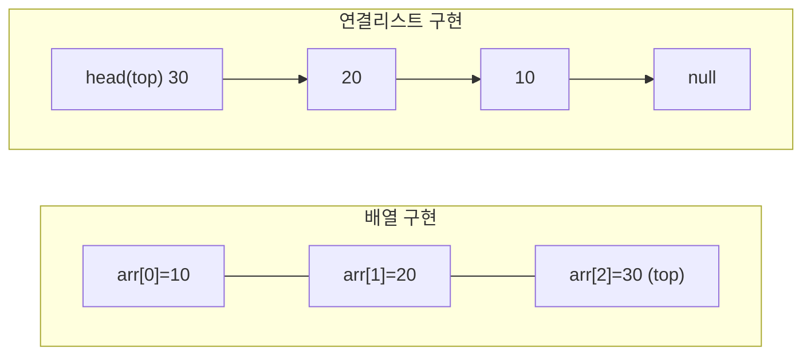
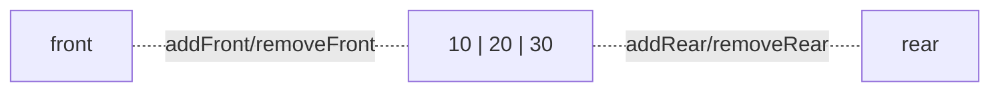

<Callout type="info">
  **이번 문서의 목표:** 이 문서를 다 읽으면 스택과 큐, 덱의 차이를 성질(LIFO·FIFO)로 정확히 설명할 수 있고, 각각을 배열과 연결리스트로 구현할 때 어떤 연산이 왜 필요한지, 그리고 배열 구현에서 왜 원형 큐(circular queue)가 필요한지 설명할 수 있다.
</Callout>

## 왜 스택과 큐를 따로 배우는가

05편에서 자료구조는 여러 데이터를 "어떤 방식으로 조직하느냐"에 대한 답이라고 정리했다. 06편의 배열과 07·08편의 연결리스트는 데이터를 넣고 뺄 때 **위치를 자유롭게 지정**할 수 있는 구조였다. 반면 스택(stack)과 큐(queue)는 위치를 자유롭게 고르지 못하게 **일부러 제한**을 건 자료구조다. "넣고 빼는 순서를 딱 하나로 고정"하면, 그 순서를 이용해야 하는 문제(되돌리기, 순서 대로 처리하기, 함수 호출 관리)를 아주 단순하고 빠르게 풀 수 있기 때문이다.

이 제한이 정확히 무엇인지가 스택과 큐를 구분하는 핵심이고, 독학사 시험에서 "다음 상황에 알맞은 자료구조는?"이라는 형태로 자주 나온다.

## 스택 — 마지막에 넣은 것부터 나온다

**스택**(stack)은 데이터를 한쪽 끝(top)으로만 넣고 뺄 수 있는 자료구조다. 이 성질을 **LIFO**(Last-In-First-Out, 후입선출)라고 부른다. 나중에 넣은 원소가 가장 먼저 나온다는 뜻이다.

> **쉽게 말하면:** 스택은 접시를 쌓아 올리는 것과 같다. 접시는 맨 위에 올리고(push), 쓸 때도 맨 위 것부터 집어서(pop) 쓴다. 맨 아래 접시를 먼저 쓰려면 위에 쌓인 접시를 전부 치워야 한다.

### 스택의 기본 연산

01편에서 스택 ADT의 네 연산(`push`, `pop`, `peek`, `isEmpty`)을 이미 명세했다. 여기서는 그 연산들이 실제로 자료를 어떻게 바꾸는지 표로 추적한다.

| 연산 | 하는 일 | 스택 상태(왼쪽이 bottom, 오른쪽이 top) |
|------|---------|----------------------------------------|
| 초기 상태 | - | (비어 있음) |
| `push(10)` | 10을 top에 넣는다 | 10 |
| `push(20)` | 20을 top에 넣는다 | 10, 20 |
| `push(30)` | 30을 top에 넣는다 | 10, 20, 30 |
| `peek()` | top 값을 확인(제거 없음), 결과 30 | 10, 20, 30 |
| `pop()` | top(30)을 꺼내 제거, 결과 30 | 10, 20 |
| `pop()` | top(20)을 꺼내 제거, 결과 20 | 10 |
| `isEmpty()` | 비었는지 확인, 결과 거짓(원소 1개 있음) | 10 |

이 추적표가 보여주듯, `push`로 넣은 순서(10, 20, 30)와 `pop`으로 나오는 순서(30, 20, 10)는 완전히 반대다. 이것이 LIFO의 실체다.

> **자주 틀리는 점:** "스택은 항상 배열로 구현한다"는 틀린 생각이다. 01편에서 배웠듯 ADT는 구현 방식을 정하지 않는다. 스택은 배열로도, 연결리스트로도 구현할 수 있다. 아래에서 두 방식을 모두 본다.

### 스택을 배열로 구현하기

배열로 스택을 구현하면, top의 위치를 가리키는 정수 변수 하나만 있으면 된다. 보통 `top`을 "가장 최근에 넣은 원소의 인덱스"로 두고, 빈 스택일 때 `top`을 -1로 초기화한다.

- `push(x)`: `top`을 1 증가시키고 `arr[top]`에 `x`를 저장한다. 시간 복잡도 O(1).
- `pop()`: `arr[top]`을 반환하고 `top`을 1 감소시킨다. 시간 복잡도 O(1).
- `isEmpty()`: `top`이 -1이면 참. O(1).
- `isFull()`: `top`이 배열의 마지막 인덱스(배열 크기 - 1)에 도달했으면 참. O(1).

배열 구현의 장점은 모든 연산이 O(1)이라는 점이지만, 단점은 배열 크기를 미리 정해야 하므로 **스택 오버플로**(stack overflow, 배열이 꽉 찬 상태에서 `push`를 시도하는 상황)가 발생할 수 있다는 점이다.

### 스택을 연결리스트로 구현하기

연결리스트로 구현하면 07편의 단순 연결리스트 노드를 그대로 쓰되, **항상 머리(head) 쪽에서만** 삽입·삭제한다. 머리 노드가 곧 top이다.

- `push(x)`: 새 노드를 만들어 머리 앞에 연결한다(07편의 머리 삽입과 동일). O(1).
- `pop()`: 머리 노드를 떼어내고 그 값을 반환한 뒤, 머리를 다음 노드로 옮긴다. O(1).

연결리스트 구현은 크기 제한이 없어(메모리가 허용하는 한) 오버플로를 걱정할 필요가 없지만, 노드마다 링크(포인터)를 저장할 추가 메모리가 든다. 이 트레이드오프는 06~08편에서 다룬 배열과 연결리스트의 비교와 정확히 같은 구도다.

## 큐 — 먼저 넣은 것부터 나온다

**큐**(queue)는 한쪽 끝(rear, 후단)으로 넣고 반대쪽 끝(front, 전단)으로 빼는 자료구조다. 이 성질을 **FIFO**(First-In-First-Out, 선입선출)라고 부른다.

> **쉽게 말하면:** 큐는 은행 창구 앞에 줄을 선 것과 같다. 줄 뒤(rear)에 서면(enqueue) 줄 앞(front)에서부터 순서대로 처리되어 빠져나간다(dequeue). 새치기가 없다.

### 큐의 기본 연산

| 연산 | 하는 일 | 큐 상태(왼쪽이 front, 오른쪽이 rear) |
|------|---------|----------------------------------------|
| 초기 상태 | - | (비어 있음) |
| `enqueue(10)` | 10을 rear에 넣는다 | 10 |
| `enqueue(20)` | 20을 rear에 넣는다 | 10, 20 |
| `enqueue(30)` | 30을 rear에 넣는다 | 10, 20, 30 |
| `dequeue()` | front(10)를 꺼내 제거, 결과 10 | 20, 30 |
| `dequeue()` | front(20)를 꺼내 제거, 결과 20 | 30 |
| `peek()`(또는 `front()`) | front 값을 확인, 결과 30 | 30 |

넣은 순서(10, 20, 30)와 나오는 순서(10, 20, 30)가 **똑같다.** 이것이 FIFO이며, 앞서 본 스택의 LIFO와 정반대다.

### 큐를 배열로 구현할 때 생기는 문제 — 그리고 원형 큐

큐를 배열로 가장 단순하게 구현하면 `front`와 `rear`라는 두 개의 인덱스 변수를 둔다. `enqueue`는 `rear`를 늘리며 값을 넣고, `dequeue`는 `front`를 늘리며 값을 뺀다. 그런데 이 방식에는 심각한 문제가 있다.

배열 크기가 5(인덱스 0~4)이고, `enqueue`를 5번 해서 배열이 가득 찼다고 하자. 이제 `dequeue`를 2번 해서 `front`가 2로 옮겨 갔다. 배열의 인덱스 0, 1 자리는 이제 비어 있는데도, `rear`는 이미 4(배열 끝)에 있어서 새로 `enqueue`할 자리가 없다고 잘못 판단하게 된다. 실제로는 빈 칸(0, 1번)이 있는데도 "가득 찼다"고 오판하는 이 현상을 **선형 큐(linear queue)의 잘못된 오버플로**라고 부른다.

이 문제를 해결하는 방법이 **원형 큐**(circular queue)다. 배열의 끝(마지막 인덱스)에 도달하면 다시 처음(인덱스 0)으로 돌아가도록, 인덱스 계산에 나머지 연산(modulo, 기호 `%`)을 쓴다.

$$
\text{rear} = (\text{rear} + 1) \bmod n
$$

- $n$: 배열의 전체 크기
- $\bmod$: 나머지 연산자. `%` 기호로 표기하며, "나눈 나머지를 취한다"는 뜻이다.

$$
\text{front} = (\text{front} + 1) \bmod n
$$

이 계산 덕분에 인덱스가 4(배열 크기 5의 마지막)에서 다시 늘어나면 `(4 + 1) mod 5 = 0`이 되어 자동으로 처음 칸으로 돌아간다. 배열을 마치 원(circle)처럼 이어 붙여 쓰는 셈이어서 "원형" 큐라고 부른다.

| 단계 | 연산 | front | rear | 배열(인덱스 0–4) | 비고 |
|------|------|-------|------|-------------------|------|
| 1 | 초기 | 0 | 0 | (모두 비어 있음) | 원형 큐는 보통 "칸 하나를 항상 비워 두는" 방식으로 가득 참과 빔을 구분한다 |
| 2 | `enqueue(A)` | 0 | 1 | [A, _, _, _, _] | rear가 다음 빈 칸을 가리킴 |
| 3 | `enqueue(B)` | 0 | 2 | [A, B, _, _, _] | - |
| 4 | `enqueue(C)` | 0 | 3 | [A, B, C, _, _] | - |
| 5 | `enqueue(D)` | 0 | 4 | [A, B, C, D, _] | - |
| 6 | `dequeue()` | 1 | 4 | [_, B, C, D, _] | A 제거, front 한 칸 이동 |
| 7 | `enqueue(E)` | 1 | 0 | [_, B, C, D, E] | rear가 `(4+1) mod 5 = 0`으로 돌아옴(원형) |

이 표의 7번째 줄이 원형 큐의 핵심 장면이다. `rear`가 배열 끝(인덱스 4)에서 다시 인덱스 0으로 돌아가, 앞에서 비워진 칸(원래 A가 있던 자리)을 재사용한다.

> **자주 틀리는 점:** "가득 참"과 "비어 있음"을 어떻게 구분하는지가 시험에서 자주 등장한다. `front`와 `rear`가 같은 위치면 "비어 있다"는 뜻일 수도 있지만, 계속 채워서 한 바퀴를 돌면 다시 `front == rear`가 되어 "가득 찼다"는 뜻이 될 수도 있다. 이 모호함을 없애기 위해 실제 구현에서는 흔히 배열 한 칸을 항상 비워 두거나(가득 찼을 때 `(rear + 1) mod n == front`), 별도의 원소 개수 카운터를 둔다.

### 큐를 연결리스트로 구현하기

연결리스트로 큐를 구현하면 원형 큐 같은 나머지 연산 트릭이 필요 없다. `front`가 가리키는 노드에서 삭제하고, `rear`가 가리키는 노드 뒤에 삽입하면 된다. 단, `rear`에서 빠르게 삽입하려면 08편에서 다룬 것처럼 rear를 가리키는 포인터를 따로 유지해야 한다(그렇지 않으면 매번 끝까지 순회해야 해서 O(n)이 된다).

## 덱 — 양쪽에서 넣고 뺄 수 있는 큐

**덱**(deque, Double-Ended Queue의 줄임말이며 "덱" 또는 "디큐"로 읽는다)은 양쪽 끝(front와 rear) 모두에서 삽입과 삭제가 가능한 자료구조다. 스택과 큐를 합친 것으로 볼 수도 있다.

- `addFront(x)` / `addRear(x)`: 앞 또는 뒤에 원소를 넣는다.
- `removeFront()` / `removeRear()`: 앞 또는 뒤에서 원소를 뺀다.

덱은 앞쪽만 쓰면 스택처럼, 한쪽으로 넣고 반대쪽으로 빼면 큐처럼 동작한다. 즉 스택과 큐는 **덱의 사용 방식을 제한한 특수한 경우**로 볼 수 있다.

> **쉽게 말하면:** 덱은 양쪽에 문이 달린 기차 칸이다. 앞문으로도 뒷문으로도 타고 내릴 수 있다. 앞문만 쓰기로 정하면 스택이 되고, 뒷문으로 타서 앞문으로 내리기로 정하면 큐가 된다.

## 스택·큐·덱 비교

| 항목 | 스택 | 큐 | 덱 |
|------|------|-----|-----|
| 삽입 위치 | 한쪽(top)만 | 한쪽(rear)만 | 양쪽 |
| 삭제 위치 | 한쪽(top)만(삽입과 동일) | 한쪽(front)만(삽입과 반대) | 양쪽 |
| 순서 성질 | LIFO(후입선출) | FIFO(선입선출) | 규칙 없음(사용 방식에 따라 결정) |
| 배열 구현 시 주의점 | 오버플로 검사(`isFull`) | 원형 큐가 아니면 잘못된 오버플로 발생 | 양쪽 인덱스 모두 원형 처리 필요 |
| 대표 응용 | 되돌리기(undo), 함수 호출 관리, 괄호 검사(10편) | 순서대로 처리해야 하는 작업 대기열, BFS(10·15편) | 양방향 슬라이딩 윈도(window) 문제 |

## 자주 틀리는 점

- **LIFO와 FIFO를 반대로 외우는 실수**: 스택은 "마지막에 넣은 것이 먼저 나온다"(Last-In-First-Out), 큐는 "먼저 넣은 것이 먼저 나온다"(First-In-First-Out)다. 두 단어의 순서(Last vs First)에 집중해서 외우면 헷갈리지 않는다.
- **큐를 배열로 구현할 때 원형 처리를 빠뜨리는 실수**: 단순히 `front`와 `rear`를 계속 증가만 시키면, 배열 앞쪽에 빈 칸이 있어도 다 찬 것으로 오판한다. 나머지 연산으로 인덱스를 순환시켜야 한다.
- **peek(top 확인)과 pop(top 제거)을 혼동하는 실수**: `peek`은 값을 보기만 하고 스택·큐 상태를 바꾸지 않지만, `pop`·`dequeue`는 원소를 실제로 제거해 상태를 바꾼다.
- **덱을 스택·큐와 완전히 다른 자료구조로 오해하는 실수**: 덱은 스택과 큐를 포함하는 더 일반적인 구조다. 스택과 큐는 덱의 삽입·삭제 위치를 한쪽으로 제한한 특수한 사용 방식으로 이해하는 것이 정확하다.

## 핵심 정리

- 스택은 LIFO(후입선출), 큐는 FIFO(선입선출) 성질을 가지며, 둘 다 삽입·삭제 위치가 제한된 자료구조다.
- 스택과 큐 모두 배열과 연결리스트로 구현할 수 있고, 배열 구현은 O(1) 연산이 가능하지만 크기 제한이 있다.
- 큐를 배열로 구현할 때는 `front`·`rear` 인덱스를 나머지 연산(mod)으로 순환시키는 원형 큐가 필요하다. 그렇지 않으면 빈 칸이 있는데도 가득 찬 것으로 오판한다.
- 덱은 양쪽 끝에서 삽입·삭제가 가능한 자료구조이며, 스택과 큐는 덱의 사용 방식을 제한한 특수한 경우로 볼 수 있다.

## 마무리 복습

<Quiz
  questionNumber={1}
  question="스택과 큐의 성질에 대한 설명으로 옳은 것은?"
  options={['스택은 FIFO, 큐는 LIFO 성질을 가진다', '스택은 LIFO, 큐는 FIFO 성질을 가진다', '스택과 큐 모두 LIFO 성질을 가진다', '스택과 큐 모두 삽입과 삭제 위치에 제한이 없다']}
  correctAnswer={2}
  explanation="스택은 후입선출(LIFO)이고 큐는 선입선출(FIFO)이다. 두 자료구조 모두 삽입과 삭제 위치가 제한되어 있다는 공통점은 있지만 순서 성질은 정반대다."
  optionExplanations={['스택과 큐의 성질이 서로 바뀌어 있는 오답이다.', '정답. 스택은 LIFO, 큐는 FIFO다.', '큐는 LIFO가 아니라 FIFO 성질을 가진다.', '두 자료구조 모두 삽입과 삭제 위치가 한쪽 또는 정해진 곳으로 제한되어 있다.']}
/>

<Quiz
  questionNumber={2}
  question="스택에 순서대로 push(1), push(2), push(3), pop()을 수행했을 때 pop()의 반환값과 남은 스택 상태로 옳은 것은?"
  options={['반환값 1, 남은 스택은 2, 3', '반환값 3, 남은 스택은 1, 2', '반환값 1, 남은 스택은 비어 있음', '반환값 3, 남은 스택은 비어 있음']}
  correctAnswer={2}
  explanation="push(1), push(2), push(3)을 거치면 top은 3이다. pop()은 가장 최근에 넣은 3을 반환하고 제거하므로 남은 스택은 아래에서부터 1, 2가 된다."
  optionExplanations={['가장 나중에 넣은 원소부터 나오므로 반환값은 1이 아니라 3이다.', '정답. LIFO 성질에 따라 마지막에 넣은 3이 먼저 나오고 1, 2가 남는다.', 'pop 한 번으로 스택 전체가 비지 않는다. 1, 2가 남아 있다.', '반환값은 맞지만 원소 하나만 제거되므로 스택이 완전히 비지 않는다.']}
/>

<Quiz
  questionNumber={3}
  question="큐를 배열로 구현할 때 원형 큐(circular queue)를 쓰는 이유로 가장 적절한 것은?"
  options={['탐색 속도를 O(log n)으로 줄이기 위해서다', 'front와 rear를 단순 증가만 시키면 빈 칸이 있어도 가득 찬 것으로 잘못 판단하는 문제를 막기 위해서다', '큐에 저장할 수 있는 원소 개수를 늘리기 위해서다', '스택과 동일한 LIFO 성질을 구현하기 위해서다']}
  correctAnswer={2}
  explanation="선형 큐는 dequeue로 앞쪽에 빈 칸이 생겨도 rear가 배열 끝에 도달하면 더 이상 넣을 수 없다고 오판한다. 원형 큐는 인덱스를 나머지 연산으로 순환시켜 이 문제를 해결한다."
  optionExplanations={['원형 큐는 탐색 알고리즘이 아니라 인덱스 관리 방식이다.', '정답. 앞쪽 빈 칸을 재사용하기 위한 인덱스 순환 기법이다.', '배열 크기 자체를 늘리는 기법이 아니다.', '원형 큐도 FIFO 성질을 그대로 유지한다. LIFO와는 무관하다.']}
/>

<Quiz
  questionNumber={4}
  question="크기 5인 원형 큐에서 rear가 현재 인덱스 4를 가리키고 있을 때, enqueue를 한 번 수행하면 rear는 어느 인덱스로 이동하는가?"
  options={['인덱스 5', '인덱스 4에 머무른다', '인덱스 0', '인덱스 1']}
  correctAnswer={3}
  explanation="원형 큐의 rear는 (rear + 1) mod n 공식으로 갱신된다. n이 5이므로 (4 + 1) mod 5 = 0이 되어 인덱스 0으로 돌아간다."
  optionExplanations={['배열 크기가 5(인덱스 0~4)이므로 인덱스 5는 존재하지 않는 자리다.', 'enqueue를 하면 rear는 반드시 다음 위치로 이동한다.', '정답. (4 + 1) mod 5 = 0이므로 인덱스 0으로 순환한다.', '나머지 연산 결과는 1이 아니라 0이다.']}
/>

<Quiz
  questionNumber={5}
  question="스택을 연결리스트로 구현할 때 push와 pop을 어느 위치에서 수행해야 두 연산 모두 O(1)을 유지할 수 있는가?"
  options={['항상 리스트의 꼬리(tail)에서 수행한다', '항상 리스트의 머리(head)에서 수행한다', 'push는 머리에서, pop은 꼬리에서 수행한다', '리스트의 가운데 위치에서 수행한다']}
  correctAnswer={2}
  explanation="단순 연결리스트는 머리에서의 삽입·삭제는 O(1)이지만 꼬리에서의 접근은 꼬리 포인터가 없으면 처음부터 순회해야 해서 O(n)이 될 수 있다. 따라서 push와 pop 모두 머리에서 수행해야 O(1)을 유지한다."
  optionExplanations={['꼬리에서 삭제하려면 그 앞 노드를 찾기 위해 순회가 필요해 O(n)이 될 수 있다.', '정답. 머리에서의 삽입·삭제는 항상 O(1)이다.', 'push와 pop의 위치를 다르게 하면 top의 위치가 흔들려 LIFO 성질이 깨진다.', '가운데 위치는 접근 자체에 순회가 필요해 O(1)이 될 수 없다.']}
/>

<Quiz
  questionNumber={6}
  question="덱(deque)에 대한 설명으로 옳지 않은 것은?"
  options={['양쪽 끝에서 모두 삽입과 삭제가 가능하다', '앞쪽으로만 삽입·삭제하면 스택처럼 사용할 수 있다', '큐와 완전히 무관한, 스택과도 무관한 독립된 자료구조다', '한쪽으로 넣고 반대쪽으로 빼면 큐처럼 사용할 수 있다']}
  correctAnswer={3}
  explanation="덱은 스택과 큐를 포함하는 더 일반적인 구조다. 사용 방식을 제한하면 스택이나 큐처럼 동작하므로 완전히 무관한 독립된 자료구조라는 설명은 옳지 않다."
  optionExplanations={['옳은 설명이다. 덱은 addFront/addRear, removeFront/removeRear를 모두 지원한다.', '옳은 설명이다. 앞쪽만 사용하면 LIFO 성질의 스택처럼 동작한다.', '정답(옳지 않은 설명). 스택과 큐는 덱의 사용 방식을 제한한 특수한 경우로 볼 수 있다.', '옳은 설명이다. 한쪽으로 넣고 반대쪽으로 빼면 FIFO 성질의 큐처럼 동작한다.']}
/>

<Quiz
  questionNumber={7}
  question="스택 오버플로(stack overflow)에 대한 설명으로 가장 적절한 것은?"
  options={['스택이 비어 있는 상태에서 pop()을 시도하는 상황이다', '배열로 구현한 스택이 꽉 찬 상태에서 push()를 시도하는 상황이다', '큐에서 원형 처리를 하지 않아 발생하는 오류다', '연결리스트로 구현한 스택에서만 발생하는 현상이다']}
  correctAnswer={2}
  explanation="스택 오버플로는 배열처럼 크기가 정해진 저장 공간이 가득 찬 상태에서 원소를 더 넣으려 할 때 발생한다. 반대로 빈 스택에서 pop을 시도하는 상황은 스택 언더플로(underflow)라고 부른다."
  optionExplanations={['이 상황은 오버플로가 아니라 스택 언더플로(underflow)라고 부른다.', '정답. 저장 공간이 가득 찬 상태에서 추가 삽입을 시도하는 상황이 오버플로다.', '이는 큐의 잘못된 오버플로 문제이며 스택 오버플로와는 다른 상황이다.', '연결리스트 구현은 메모리가 허용하는 한 크기 제한이 없어 이 형태의 오버플로가 발생하기 어렵다.']}
/>

## 참고 자료

- [국가평생교육진흥원 과목별 평가영역](https://bdes.nile.or.kr/nile/study/nStudy2_1.do) — 자료구조 과목의 평가영역과 출제 범위를 확인할 수 있는 공식 자료.
- [국가평생교육진흥원 독학학위제](https://bdes.nile.or.kr/) — 독학학위제 시험 체계 전반을 확인할 수 있는 공식 사이트.
