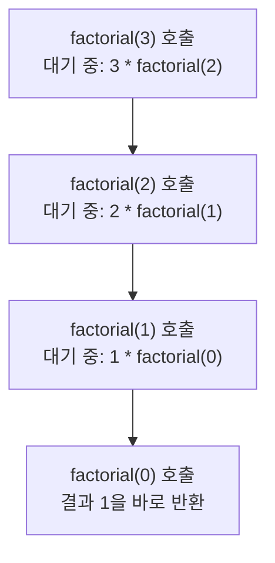

<Callout type="info">
  **이번 문서의 목표:** 이 문서를 다 읽으면 괄호 짝 검사, 중위식을 후위식으로 바꾸는 과정과 후위식 계산 과정을 스택의 상태 변화표로 직접 추적할 수 있고, 함수 호출이 왜 스택으로 관리되는지, BFS가 왜 큐를 쓰는지 설명할 수 있다.
</Callout>

09편에서 스택은 LIFO(후입선출), 큐는 FIFO(선입선출) 성질을 가진 자료구조라고 배웠다. 이 편은 그 성질이 실제로 어떤 문제를 푸는 데 쓰이는지, 독학사 시험에서 반복해서 나오는 네 가지 응용을 단계별로 완전히 추적한다.

## 괄호 검사 — 스택으로 짝을 맞추는 문제

수식이나 코드에서 괄호 `(`, `)`, `[`, `]`, `{`, `}`가 올바르게 짝지어졌는지 확인하는 문제는 스택의 가장 대표적인 응용이다.

> **쉽게 말하면:** 여는 괄호를 만나면 스택에 쌓아 두고, 닫는 괄호를 만나면 스택 맨 위(top)의 여는 괄호와 짝이 맞는지 확인한 뒤 꺼낸다. 마지막에 스택이 완전히 비어 있어야 모든 괄호가 짝을 이룬 것이다.

### 알고리즘

1. 문자열을 앞에서부터 한 글자씩 읽는다.
2. 여는 괄호(`(`, `[`, `{`)를 만나면 스택에 push한다.
3. 닫는 괄호(`)`, `]`, `}`)를 만나면 스택에서 pop한다. 이때 두 가지를 확인한다.
   - 스택이 이미 비어 있으면 짝이 없는 닫는 괄호이므로 즉시 "오류"로 판정한다.
   - pop한 여는 괄호의 종류가 지금 읽은 닫는 괄호와 짝이 맞는 종류인지 확인한다. 다르면 "오류"다(예: 여는 괄호는 `(`인데 닫는 괄호가 `]`인 경우).
4. 문자열을 끝까지 읽었을 때 스택이 비어 있으면 "정상", 무언가 남아 있으면 "오류"(짝 없는 여는 괄호가 있었다는 뜻)다.

### 단계별 추적 — 정상 사례

문자열 `( a [ b ] c )`를 검사하는 과정이다(괄호가 아닌 문자는 건너뛴다).

| 순서 | 읽은 문자 | 처리 | 스택 상태(왼쪽이 bottom) |
|------|-----------|------|----------------------------|
| 1 | `(` | 여는 괄호 push | `(` |
| 2 | `[` | 여는 괄호 push | `(`, `[` |
| 3 | `]` | top(`[`)과 짝이 맞음, pop | `(` |
| 4 | `)` | top(`(`)과 짝이 맞음, pop | (비어 있음) |
| 끝 | - | 스택이 비어 있음 → 정상 | - |

### 단계별 추적 — 오류 사례

문자열 `( a [ b ) c ]`를 검사하는 과정이다.

| 순서 | 읽은 문자 | 처리 | 스택 상태 |
|------|-----------|------|-------------|
| 1 | `(` | 여는 괄호 push | `(` |
| 2 | `[` | 여는 괄호 push | `(`, `[` |
| 3 | `)` | top은 `[`인데 닫는 괄호는 `)` → 짝이 안 맞음 → 즉시 오류 | `(`, `[` (검사 중단) |

3번째 단계에서 이미 짝이 어긋났으므로 나머지 문자는 볼 필요도 없이 "오류"로 확정된다.

> **자주 틀리는 점:** 괄호 개수만 세어서(여는 괄호 개수와 닫는 괄호 개수가 같은지만) 판정하면 안 된다. `( ] )` 같은 문자열은 여는 괄호와 닫는 괄호 개수가 같지만 순서와 종류가 어긋나 있다. 반드시 **스택으로 순서와 종류**를 함께 검사해야 한다.

## 중위식을 후위식으로 바꾸기

우리가 일상적으로 쓰는 `2 + 3 * 4` 같은 표기법을 **중위 표기법**(infix notation, 연산자가 피연산자 "사이"에 있다)이라고 부른다. 그런데 컴퓨터가 수식을 계산할 때는 괄호와 연산자 우선순위를 매번 따져야 하는 중위식보다, 연산자가 피연산자 뒤에 오는 **후위 표기법**(postfix notation, 또는 역폴란드 표기법(Reverse Polish Notation, RPN))이 계산하기 훨씬 단순하다. 그래서 컴파일러나 계산기 내부에서는 중위식을 후위식으로 바꾼 뒤 계산한다.

> **쉽게 말하면:** 중위식은 사람이 읽기 편한 표기법이고, 후위식은 컴퓨터가 괄호와 우선순위 고민 없이 앞에서부터 순서대로 계산하기 편한 표기법이다. 스택은 이 변환 과정에서 "아직 출력할 자리가 안 된 연산자"를 잠시 보관하는 대기 장소 역할을 한다.

### 변환 알고리즘

1. 입력을 왼쪽부터 한 토큰(피연산자 또는 연산자 또는 괄호)씩 읽는다.
2. **피연산자**(숫자, 변수)를 만나면 바로 출력 리스트에 추가한다.
3. **여는 괄호** `(`를 만나면 스택에 push한다.
4. **닫는 괄호** `)`를 만나면, 스택에서 `(`가 나올 때까지 계속 pop하며 출력에 추가한다. `(` 자체는 출력하지 않고 버린다.
5. **연산자**를 만나면, 스택 top에 있는 연산자의 우선순위가 지금 만난 연산자의 우선순위보다 **높거나 같은 동안** 계속 pop하여 출력에 추가한 뒤, 지금 만난 연산자를 push한다.
6. 입력을 다 읽으면, 스택에 남아 있는 연산자를 모두 pop하여 출력에 추가한다.

연산자 우선순위는 `*`, `/`가 `+`, `-`보다 높다고 본다(수학에서 곱셈·나눗셈을 덧셈·뺄셈보다 먼저 계산하는 것과 같다).

### 단계별 추적 — `A + B * C`

| 순서 | 읽은 토큰 | 처리 | 스택(왼쪽이 bottom) | 출력 |
|------|-----------|------|------------------------|------|
| 1 | `A` | 피연산자, 바로 출력 | (비어 있음) | `A` |
| 2 | `+` | 스택이 비어 있으므로 바로 push | `+` | `A` |
| 3 | `B` | 피연산자, 바로 출력 | `+` | `A B` |
| 4 | `*` | top(`+`)보다 `*`의 우선순위가 높음 → pop하지 않고 push | `+`, `*` | `A B` |
| 5 | `C` | 피연산자, 바로 출력 | `+`, `*` | `A B C` |
| 끝 | - | 남은 연산자를 모두 pop(위에서부터 `*`, `+`) | (비어 있음) | `A B C * +` |

최종 후위식은 `A B C * +`다. 이 결과는 "먼저 B와 C를 곱하고, 그 결과를 A와 더한다"는 뜻으로, 원래 중위식이 곱셈을 덧셈보다 먼저 계산해야 한다는 우선순위 규칙을 정확히 반영한다.

### 단계별 추적 — 괄호가 있는 경우 `(A + B) * C`

| 순서 | 읽은 토큰 | 처리 | 스택 | 출력 |
|------|-----------|------|------|------|
| 1 | `(` | push | `(` | (없음) |
| 2 | `A` | 바로 출력 | `(` | `A` |
| 3 | `+` | top이 `(`이므로 조건 없이 push | `(`, `+` | `A` |
| 4 | `B` | 바로 출력 | `(`, `+` | `A B` |
| 5 | `)` | `(`가 나올 때까지 pop(즉 `+`를 출력) | (비어 있음) | `A B +` |
| 6 | `*` | 스택이 비어 있으므로 바로 push | `*` | `A B +` |
| 7 | `C` | 바로 출력 | `*` | `A B + C` |
| 끝 | - | 남은 연산자 pop | (비어 있음) | `A B + C *` |

괄호 안의 `A + B`가 먼저 `A B +`로 묶여 출력되고, 그다음에 `C`, `*`가 이어져 "괄호 안을 먼저 계산하고 그 결과를 C와 곱한다"는 뜻이 정확히 유지된다.

## 후위식 계산하기

후위식을 얻었으면, 이번에는 스택을 이용해 **피연산자만 쌓았다가 연산자를 만나면 꺼내서 계산**하는 방식으로 값을 구한다.

### 알고리즘

1. 토큰을 왼쪽부터 읽는다.
2. 피연산자를 만나면 스택에 push한다.
3. 연산자를 만나면, 스택에서 값을 **두 번 pop**한다. 먼저 pop한 값이 오른쪽 피연산자, 나중에 pop한 값이 왼쪽 피연산자다(순서에 주의해야 한다 — 뺄셈·나눗셈처럼 순서가 결과에 영향을 주는 연산에서 특히 중요하다). 계산 결과를 다시 push한다.
4. 입력을 다 읽으면 스택에 남은 값 하나가 최종 결과다.

### 단계별 추적 — `A B C * +`에 A=2, B=3, C=4 대입

| 순서 | 읽은 토큰 | 처리 | 스택(왼쪽이 bottom) |
|------|-----------|------|------------------------|
| 1 | `2`(A) | push | 2 |
| 2 | `3`(B) | push | 2, 3 |
| 3 | `4`(C) | push | 2, 3, 4 |
| 4 | `*` | pop 4, pop 3 → `3 * 4 = 12` → push | 2, 12 |
| 5 | `+` | pop 12, pop 2 → `2 + 12 = 14` → push | 14 |
| 끝 | - | 스택에 하나 남음 | 14 |

$$
2 + 3 \times 4 = 14
$$

중위식으로 계산해도 곱셈을 먼저 하므로 `3 * 4 = 12`, `2 + 12 = 14`로 같은 결과가 나온다. 후위식 계산은 우선순위나 괄호를 전혀 신경 쓰지 않고 **왼쪽부터 순서대로 스택만 조작**해서 같은 답에 도달한다는 점이 핵심이다.

> **자주 틀리는 점:** 뺄셈이나 나눗셈처럼 순서가 중요한 연산에서 두 번 pop한 값의 순서를 거꾸로 쓰는 실수가 흔하다. 후위식 `A B -`를 계산할 때 먼저 pop되는 값은 B이고 나중에 pop되는 값은 A이므로, 계산식은 `(나중에 pop한 값) - (먼저 pop한 값)`, 즉 `A - B`가 되어야 한다. `B - A`로 뒤집으면 오답이다.

## 함수 호출과 스택 — 재귀가 스택을 쓰는 이유

프로그램이 함수를 호출하면, 컴퓨터는 "이 함수가 끝나면 어디로 돌아가야 하는지"(복귀 주소)와 "그 함수 안에서 쓰는 지역 변수들"을 **호출 스택**(call stack)이라는 자료구조에 쌓아 둔다. 함수 A가 함수 B를 호출하면 B에 대한 정보가 A의 정보 위에 push되고, B가 끝나면 그 정보가 pop되면서 정확히 A가 호출했던 지점으로 되돌아간다. 함수 호출도 결국 "가장 최근에 호출된 함수가 가장 먼저 끝나고 돌아간다"는 LIFO 성질을 그대로 따르기 때문에 스택으로 관리하는 것이다.

이 성질이 가장 뚜렷하게 드러나는 예가 **재귀**(recursion, 함수가 자기 자신을 다시 호출하는 것)다. `factorial(3)`을 계산하는 재귀 함수를 호출했을 때 호출 스택이 어떻게 쌓이고 풀리는지 추적해 보자(`factorial(n)`은 `n`이 0이면 1을 반환하고, 그렇지 않으면 `n * factorial(n - 1)`을 반환한다고 하자).

| 단계 | 호출 스택(왼쪽이 bottom, 오른쪽이 top) | 설명 |
|------|-----------------------------------------|------|
| 1 | `factorial(3)` | 최초 호출, push |
| 2 | `factorial(3)`, `factorial(2)` | 3의 계산 중 2를 호출, push |
| 3 | `factorial(3)`, `factorial(2)`, `factorial(1)` | 2의 계산 중 1을 호출, push |
| 4 | `factorial(3)`, `factorial(2)`, `factorial(1)`, `factorial(0)` | 1의 계산 중 0을 호출, push |
| 5 | `factorial(3)`, `factorial(2)`, `factorial(1)` | `factorial(0)`이 1을 반환하고 pop |
| 6 | `factorial(3)`, `factorial(2)` | `factorial(1)`이 `1 * 1 = 1`을 반환하고 pop |
| 7 | `factorial(3)` | `factorial(2)`가 `2 * 1 = 2`를 반환하고 pop |
| 8 | (비어 있음) | `factorial(3)`이 `3 * 2 = 6`을 반환하고 pop |

호출은 3, 2, 1, 0 순서로 쌓였다가(push), 반환은 0, 1, 2, 3 순서로 풀린다(pop). 가장 나중에 호출된 `factorial(0)`이 가장 먼저 끝나고 반환하는 이 모습이 정확히 LIFO다.

> **자주 틀리는 점:** 재귀 호출이 너무 깊어지면(예: 종료 조건이 없는 무한 재귀) 호출 스택에 정보가 계속 push되기만 하고 pop되지 않아, 결국 09편에서 본 스택 오버플로가 실제로 발생한다. "재귀의 무한 반복은 왜 위험한가"라는 질문의 정답이 바로 이것이다.

## BFS와 큐 — 왜 너비 우선 탐색은 큐를 쓰는가

15편에서 그래프 탐색을 본격적으로 다루지만, 큐의 응용을 이해하려면 **너비 우선 탐색**(Breadth-First Search, BFS)의 감각을 먼저 잡아 두는 것이 좋다. BFS는 시작 지점에서 가까운 노드부터, 즉 "한 단계씩 넓게" 방문하는 탐색 방법이다. 이 "가까운 것부터 순서대로"라는 성질이 정확히 큐의 FIFO와 맞아떨어진다.

간단한 그래프(A가 B, C와 연결되고, B가 D와 연결된 경우)에서 A부터 BFS를 수행하는 과정을 큐로 추적해 보자.

| 단계 | 방문 처리 | 큐 상태(왼쪽이 front) | 방문 순서 기록 |
|------|-----------|--------------------------|------------------|
| 1 | A를 방문하고 큐에 enqueue | A | A |
| 2 | A를 dequeue, A와 연결된 B·C를 enqueue | B, C | A |
| 3 | B를 dequeue, B와 연결된 D를 enqueue | C, D | A, B |
| 4 | C를 dequeue, C는 연결된 새 노드 없음 | D | A, B, C |
| 5 | D를 dequeue, D는 연결된 새 노드 없음 | (비어 있음) | A, B, C, D |

최종 방문 순서는 A, B, C, D다. A와 직접 연결된 B, C를 먼저 다 방문한 뒤에야 B의 다음 단계인 D로 넘어가는 것을 볼 수 있다. 만약 큐 대신 스택을 썼다면(이 경우는 **깊이 우선 탐색**, Depth-First Search, DFS가 된다) A, B, D, C처럼 한 방향으로 최대한 깊이 들어갔다가 돌아오는 순서가 되어 전혀 다른 방문 순서가 만들어진다. 이 차이는 15편에서 인접행렬·인접리스트 표현과 함께 완전한 그래프 예제로 다시 다룬다.

> **쉽게 말하면:** 스택으로 탐색하면 "한 방향으로 끝까지 파고들었다가 되돌아오는" 성향(DFS)이 되고, 큐로 탐색하면 "가까운 곳부터 사방으로 넓게 퍼지는" 성향(BFS)이 된다. 어떤 자료구조를 쓰느냐가 탐색의 모양 자체를 결정한다.

## 자주 틀리는 점

- **괄호 검사에서 개수만 세는 실수**: 여는 괄호와 닫는 괄호의 개수가 같다고 해서 올바른 짝짓기라고 단정하면 안 된다. 순서와 종류까지 스택으로 확인해야 한다.
- **중위-후위 변환에서 우선순위 비교 방향을 반대로 적용하는 실수**: 새 연산자를 push하기 전에는 "스택 top의 우선순위가 새 연산자보다 높거나 같은 동안" 계속 pop해야 한다. 이 조건을 반대로 적용하면 엉뚱한 순서로 출력된다.
- **후위식 계산에서 pop 순서를 뒤집는 실수**: 뺄셈·나눗셈처럼 순서가 중요한 연산은 "나중에 pop한 값 연산 먼저 pop한 값" 순서를 지켜야 한다.
- **재귀와 반복문을 성능 차이 없이 항상 바꿔 쓸 수 있다고 착각하는 실수**: 재귀는 호출 스택에 정보를 계속 쌓으므로, 매우 깊은 재귀는 반복문보다 메모리를 더 많이 쓰고 스택 오버플로 위험이 있다.
- **DFS와 BFS를 사용하는 자료구조로 헷갈리는 실수**: 스택(또는 재귀 호출 스택)을 쓰면 DFS, 큐를 쓰면 BFS라는 대응 관계를 정확히 기억해야 한다.

## 핵심 정리

- 괄호 검사는 여는 괄호를 push하고 닫는 괄호에서 pop하여 종류와 순서를 확인하며, 끝에 스택이 비어 있어야 정상이다.
- 중위식을 후위식으로 바꿀 때는 연산자를 스택에 임시로 쌓았다가 우선순위 비교 결과에 따라 출력하고, 후위식을 계산할 때는 피연산자를 push했다가 연산자를 만나면 두 번 pop해 계산한다.
- 함수 호출은 호출 스택에 의해 관리되며, 재귀 호출이 LIFO로 쌓였다가 풀리는 과정이 이를 잘 보여준다.
- BFS는 큐(FIFO)를 이용해 가까운 노드부터 순서대로 방문하고, DFS는 스택(또는 재귀)을 이용해 한 방향으로 깊이 들어갔다가 되돌아온다.

## 마무리 복습

<Quiz
  questionNumber={1}
  question="괄호 검사 알고리즘에서 닫는 괄호를 만났을 때 스택이 이미 비어 있는 경우 올바른 처리는?"
  options={['스택이 빈 상태이므로 그냥 무시하고 다음 문자로 넘어간다', '짝이 없는 닫는 괄호이므로 즉시 오류로 판정한다', '스택에 그 닫는 괄호를 대신 push한다', '문자열 전체를 다시 처음부터 검사한다']}
  correctAnswer={2}
  explanation="닫는 괄호는 반드시 대응하는 여는 괄호가 스택에 있어야 짝이 맞다. 스택이 비어 있다는 것은 짝지어질 여는 괄호가 없다는 뜻이므로 즉시 오류로 판정해야 한다."
  optionExplanations={['짝 없는 닫는 괄호를 무시하면 잘못된 문자열도 정상으로 판정하는 오류가 생긴다.', '정답. 짝이 없는 닫는 괄호이므로 즉시 오류다.', '닫는 괄호는 push 대상이 아니라 pop으로 짝을 확인하는 대상이다.', '처음부터 다시 검사할 필요 없이 그 시점에서 바로 오류를 판정할 수 있다.']}
/>

<Quiz
  questionNumber={2}
  question="중위식 A + B * C를 후위식으로 올바르게 변환한 것은?"
  options={['A B C * +', 'A B + C *', '+ A * B C', 'A * B C +']}
  correctAnswer={1}
  explanation="곱셈이 덧셈보다 우선순위가 높으므로 B와 C를 먼저 묶는 A B C * +가 올바른 후위식이다. 이는 B와 C를 먼저 곱하고 그 결과를 A와 더한다는 뜻이다."
  optionExplanations={['정답. B, C를 먼저 곱하고 그 결과를 A에 더하는 순서를 정확히 표현한다.', '이 변환은 A와 B를 먼저 더하는 것으로 해석되어 원래 식의 우선순위(곱셈 먼저)를 반영하지 못한다.', '연산자가 맨 앞에 오는 것은 후위식이 아니라 전위식(prefix)의 형태다.', '피연산자와 연산자의 배치 순서가 후위식 변환 규칙과 맞지 않는다.']}
/>

<Quiz
  questionNumber={3}
  question="중위식 (A + B) * C를 후위식으로 변환하는 과정에서 여는 괄호 (를 만났을 때의 처리로 옳은 것은?"
  options={['우선순위를 비교한 뒤 조건에 따라 push하거나 pop한다', '무조건 스택에 push한다', '무조건 출력 리스트에 바로 추가한다', '스택에서 매칭되는 괄호를 찾아 pop한다']}
  correctAnswer={2}
  explanation="여는 괄호는 우선순위 비교 없이 무조건 스택에 push된다. 이후 닫는 괄호를 만났을 때 여는 괄호가 나올 때까지 pop하는 방식으로 처리된다."
  optionExplanations={['여는 괄호는 우선순위 비교 대상이 아니라 조건 없이 push되는 대상이다.', '정답. 여는 괄호는 조건 없이 스택에 push한다.', '괄호는 출력 리스트에 직접 추가되지 않는다.', '이 처리는 닫는 괄호를 만났을 때 수행하는 동작이다.']}
/>

<Quiz
  questionNumber={4}
  question="후위식 5 3 - 를 계산할 때 올바른 처리 순서는?"
  options={['5를 push, 3을 push, 먼저 pop한 3에서 나중에 pop한 5를 뺀 -2를 얻는다', '5를 push, 3을 push, 나중에 pop한 5에서 먼저 pop한 3을 뺀 2를 얻는다', '3을 push, 5를 push, 먼저 pop한 5에서 나중에 pop한 3을 뺀 2를 얻는다', '5와 3을 동시에 push한 뒤 순서 없이 뺀다']}
  correctAnswer={2}
  explanation="5를 먼저 push하고 3을 나중에 push하므로, pop 순서는 3이 먼저, 5가 나중이다. 뺄셈은 나중에 pop한 값에서 먼저 pop한 값을 빼야 하므로 5 - 3 = 2가 된다."
  optionExplanations={['뺄셈의 순서를 반대로 적용한 오답이다. 나중에 pop한 값에서 먼저 pop한 값을 빼야 한다.', '정답. 나중에 pop한 5에서 먼저 pop한 3을 빼 2를 얻는다.', 'push 순서 자체가 후위식의 토큰 순서(5, 3)와 다르게 서술되어 있다.', '스택 연산은 순서대로 하나씩 처리되며 동시에 push할 수 없다.']}
/>

<Quiz
  questionNumber={5}
  question="함수 호출이 호출 스택(call stack)으로 관리되는 이유로 가장 적절한 것은?"
  options={['함수 호출은 먼저 호출된 함수가 먼저 끝나는 FIFO 성질을 가지기 때문이다', '가장 최근에 호출된 함수가 가장 먼저 종료되어 돌아가는 LIFO 성질을 가지기 때문이다', '함수 호출 순서는 무작위이므로 아무 자료구조나 사용해도 무방하기 때문이다', '호출 스택은 큐로 구현해야만 올바르게 동작하기 때문이다']}
  correctAnswer={2}
  explanation="함수 A가 B를 호출하고 B가 C를 호출하면, 가장 나중에 호출된 C가 가장 먼저 종료되어 B로 돌아가고, 그다음 B가 종료되어 A로 돌아간다. 이 후입선출 성질이 스택과 정확히 일치한다."
  optionExplanations={['함수 호출은 FIFO가 아니라 LIFO 성질을 가진다.', '정답. 가장 나중에 호출된 함수가 가장 먼저 반환되는 LIFO 성질 때문에 스택으로 관리한다.', '호출 순서와 반환 순서는 일정한 LIFO 규칙을 따르므로 무작위가 아니다.', '호출 스택은 이름 그대로 스택으로 구현되며 큐로는 이 성질을 재현할 수 없다.']}
/>

<Quiz
  questionNumber={6}
  question="깊이가 종료 조건 없이 계속 늘어나는 재귀 호출이 위험한 이유로 가장 적절한 것은?"
  options={['호출 스택에 정보가 계속 push되기만 하고 pop되지 않아 스택 오버플로가 발생할 수 있다', '재귀 호출은 항상 큐를 사용하므로 원형 큐 오류가 발생한다', '재귀 호출은 메모리를 전혀 사용하지 않으므로 안전하다', '반복문보다 항상 더 빠르게 실행되어 문제가 되지 않는다']}
  correctAnswer={1}
  explanation="종료 조건이 없는 재귀는 함수 호출 정보가 호출 스택에 계속 쌓이기만 하고 반환되며 pop되는 일이 없어, 결국 스택에 할당된 메모리를 초과하는 스택 오버플로로 이어질 수 있다."
  optionExplanations={['정답. push만 계속되고 pop이 일어나지 않아 스택 오버플로 위험이 있다.', '재귀 호출 관리는 큐가 아니라 스택(호출 스택)을 사용한다.', '재귀 호출도 각 호출마다 지역 변수와 복귀 주소를 저장하므로 메모리를 사용한다.', '재귀는 호출·반환 오버헤드 때문에 반복문보다 느릴 수 있으며, 무한 재귀는 속도 문제가 아니라 오버플로 문제를 일으킨다.']}
/>

<Quiz
  questionNumber={7}
  question="너비 우선 탐색(BFS)이 큐를 사용하는 이유로 가장 적절한 것은?"
  options={['먼저 발견한 노드를 먼저 처리해야 가까운 노드부터 순서대로 방문할 수 있기 때문이다', '나중에 발견한 노드를 먼저 처리해야 깊이 우선으로 방문할 수 있기 때문이다', 'BFS는 자료구조와 무관하게 항상 같은 방문 순서를 만들기 때문이다', '큐를 사용하면 그래프의 간선 수를 줄일 수 있기 때문이다']}
  correctAnswer={1}
  explanation="BFS는 시작점에서 가까운 노드부터 넓게 방문해야 한다. 큐의 FIFO 성질을 이용하면 먼저 발견된(가까운) 노드가 먼저 처리되어 이 순서가 자연스럽게 만들어진다."
  optionExplanations={['정답. FIFO 성질 덕분에 먼저 발견된 가까운 노드부터 처리된다.', '나중에 발견한 노드를 먼저 처리하는 것은 스택을 사용하는 DFS의 특징이다.', '스택을 쓰면 DFS, 큐를 쓰면 BFS로 방문 순서가 달라지므로 자료구조에 따라 결과가 달라진다.', '큐 사용은 방문 순서를 결정할 뿐 그래프의 간선 수 자체와는 무관하다.']}
/>

## 참고 자료

- [국가평생교육진흥원 과목별 평가영역](https://bdes.nile.or.kr/nile/study/nStudy2_1.do) — 자료구조 과목의 평가영역과 출제 범위를 확인할 수 있는 공식 자료.
- [국가평생교육진흥원 독학학위제](https://bdes.nile.or.kr/) — 독학학위제 시험 체계 전반을 확인할 수 있는 공식 사이트.
