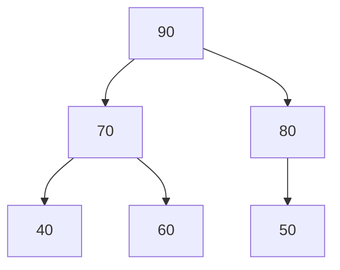

<Callout type="info">
  **이번 문서의 목표:** 이 문서를 다 읽으면 우선순위 큐가 일반 큐와 왜 다른지 설명할 수 있고, 히프가 완전이진트리 성질을 왜 필요로 하는지, 배열로 히프를 표현할 때 부모·자식 인덱스를 어떻게 계산하는지, 삽입과 삭제 시 sift-up·sift-down이 어떻게 진행되는지 단계별로 추적할 수 있다.
</Callout>

## 우선순위 큐 — 순서가 아니라 중요도로 꺼낸다

09편에서 배운 큐는 "먼저 넣은 것을 먼저 꺼내는"(FIFO) 자료구조였다. 그런데 실제 문제에는 "먼저 넣은 순서"가 아니라 "얼마나 중요한가"를 기준으로 꺼내야 하는 상황이 많다. 응급실에서 접수 순서와 무관하게 위중한 환자부터 진료하는 것, 운영체제가 우선순위가 높은 작업(프로세스)부터 CPU를 배정하는 것이 대표적인 예다.

**우선순위 큐**(priority queue)는 각 원소가 우선순위(priority) 값을 가지고, 꺼낼 때는 항상 **우선순위가 가장 높은(또는 가장 낮은) 원소**를 꺼내는 ADT다.

> **쉽게 말하면:** 일반 큐는 줄을 선 순서대로 부르는 은행 창구이고, 우선순위 큐는 접수 순서와 무관하게 가장 급한 환자부터 부르는 응급실이다.

우선순위 큐 ADT는 보통 다음 연산으로 명세된다.

| 연산 | 하는 일 |
|------|---------|
| `insert(x, priority)` | 우선순위를 가진 원소를 추가한다 |
| `extractMax()`(또는 `extractMin()`) | 우선순위가 가장 높은(또는 가장 낮은) 원소를 꺼내서 제거한다 |
| `peekMax()` | 가장 높은 우선순위의 원소를 제거 없이 확인한다 |
| `isEmpty()` | 비어 있는지 확인한다 |

이 ADT를 구현하는 방법은 여러 가지다(정렬된 배열, 정렬되지 않은 배열, 연결리스트 등). 하지만 삽입과 최댓값(또는 최솟값) 추출을 **둘 다 빠르게** 처리할 수 있는 가장 대표적인 구현이 바로 **히프**(heap)다.

| 구현 방식 | insert | extractMax | 비고 |
|-----------|--------|------------|------|
| 정렬 안 된 배열 | O(1) | O(n)(최댓값을 찾으려면 전체 탐색) | 삽입은 빠르지만 추출이 느림 |
| 정렬된 배열 | O(n)(삽입 위치를 찾아 밀어야 함) | O(1)(맨 끝 또는 맨 앞이 최댓값) | 추출은 빠르지만 삽입이 느림 |
| 히프 | O(log n) | O(log n) | 둘 다 균형 있게 빠름 |

이 표가 히프가 왜 필요한지에 대한 답이다. 정렬 여부와 무관하게 배열만 쓰면 삽입과 추출 중 하나는 반드시 O(n)이 되지만, 히프는 두 연산 모두 O(log n)으로 유지한다.

## 히프의 두 가지 조건

**히프**(heap)는 다음 두 조건을 동시에 만족하는 이진트리다.

1. **구조 조건 — 완전이진트리(complete binary tree)여야 한다.** 완전이진트리란 마지막 레벨을 제외한 모든 레벨이 노드로 꽉 차 있고, 마지막 레벨의 노드들은 **왼쪽부터 순서대로** 채워진 이진트리다(완전이진트리의 정확한 정의와 성질은 12편에서 다시 다룬다).
2. **히프 조건(heap property) — 부모와 자식 사이에 크기 순서가 일관되게 유지되어야 한다.**
   - **최대 히프**(max heap): 모든 부모 노드의 값이 자식 노드의 값보다 크거나 같다. 따라서 루트(root, 트리의 맨 위 노드)가 항상 전체에서 가장 큰 값이다.
   - **최소 히프**(min heap): 모든 부모 노드의 값이 자식 노드의 값보다 작거나 같다. 루트가 항상 전체에서 가장 작은 값이다.

> **자주 틀리는 점:** 히프를 이진탐색트리(BST, 14편에서 다룬다)와 혼동하는 경우가 많다. BST는 "왼쪽 서브트리 전체 < 부모 < 오른쪽 서브트리 전체"라는 전역적인 정렬 순서를 갖지만, 히프는 오직 "부모와 자식" 사이의 관계만 보장한다. 형제 노드끼리, 또는 서로 다른 서브트리에 있는 노드끼리는 크기 순서가 전혀 정해져 있지 않다. 예를 들어 최대 히프에서 왼쪽 자식과 오른쪽 자식 중 어느 쪽이 더 큰지는 알 수 없다 — 둘 다 부모보다 작거나 같다는 것만 보장된다.

위 트리는 최대 히프의 예다. 루트 90이 모든 노드 중 가장 크고, 70은 자식 40, 60보다 크며, 80은 자식 50보다 크다. 하지만 70과 80을 비교하면 80이 더 크지만 둘은 부모-자식 관계가 아니라 형제 관계이므로 히프 조건이 이 둘의 순서를 요구하지 않는다.

## 히프를 배열로 표현하기

히프는 완전이진트리이기 때문에 링크(포인터)를 저장하는 연결 표현 없이, **배열 하나만으로** 트리 구조 전체를 표현할 수 있다. 배열의 인덱스가 트리의 위치를 대신하기 때문이다(이 표현법의 일반적인 원리는 12편에서 트리 표현법으로 다시 정리한다).

배열 인덱스를 1부터 시작한다고 하면(관례적으로 계산이 더 깔끔해서 1부터 시작하는 경우가 많다), 인덱스 $i$에 저장된 노드에 대해 다음 관계가 성립한다.

$$
\text{parent}(i) = \left\lfloor \dfrac{i}{2} \right\rfloor
$$

- $i$: 지금 살펴보는 노드의 배열 인덱스
- $\lfloor \ \rfloor$: 바닥 함수(floor function). 소수점 이하를 버리고 정수로 내림한다는 뜻이다.

$$
\text{leftChild}(i) = 2i
$$

$$
\text{rightChild}(i) = 2i + 1
$$

앞의 최대 히프 예(루트 90, 그다음 70과 80, 그다음 40, 60, 50)를 배열로 나타내면 다음과 같다.

| 인덱스 | 1 | 2 | 3 | 4 | 5 | 6 |
|--------|---|---|---|---|---|---|
| 값 | 90 | 70 | 80 | 40 | 60 | 50 |

이 표를 위 공식으로 확인해 보자. 인덱스 2(값 70)의 부모는 `parent(2) = 2/2 = 1`이므로 인덱스 1(값 90)이고, 이는 트리 그림에서 70의 부모가 90인 것과 일치한다. 인덱스 3(값 80)의 왼쪽 자식은 `leftChild(3) = 2*3 = 6`이므로 인덱스 6(값 50)이고, 트리 그림에서 80의 왼쪽 자식이 50인 것과 일치한다.

> **쉽게 말하면:** 완전이진트리는 빈틈없이 왼쪽부터 채워지는 트리이므로, "몇 번째 칸에 무슨 값이 있는가"만 알면 부모와 자식이 어디 있는지 계산만으로 바로 알 수 있다. 그래서 링크를 저장할 필요 없이 배열 하나로 충분하다.

## 히프에 원소를 삽입하기 — sift-up(위로 올리기)

히프에 새 원소를 넣는 과정은 두 단계로 이루어진다.

1. 새 원소를 배열의 **맨 끝**(완전이진트리 구조를 유지하는 유일한 자리)에 추가한다.
2. 새 원소를 부모와 비교하며, 히프 조건을 어기는 동안 부모와 계속 자리를 맞바꾼다. 이 과정을 **sift-up**(또는 up-heap, 위로 올리기)이라고 부른다.

### 단계별 추적 — 최대 히프에 65 삽입

앞의 배열 `[90, 70, 80, 40, 60, 50]`(인덱스 1~6)에 65를 삽입해 보자.

| 단계 | 처리 | 배열 상태(인덱스 1–7) | 비교 대상 |
|------|------|--------------------------|-------------|
| 1 | 65를 맨 끝(인덱스 7)에 추가 | 90, 70, 80, 40, 60, 50, 65 | - |
| 2 | 65(인덱스 7)와 부모 `parent(7)=3`(값 80) 비교 → 65 < 80이므로 히프 조건 유지, 종료 | 90, 70, 80, 40, 60, 50, 65 | 65 vs 80 |

이번 예에서는 65가 부모 80보다 작아 한 번의 비교로 끝났다. 만약 부모보다 큰 값이 들어왔다면 어떻게 되는지, 값 95를 삽입하는 경우로 다시 추적해 보자.

| 단계 | 처리 | 배열 상태(인덱스 1–7) | 비교 대상 |
|------|------|--------------------------|-------------|
| 1 | 95를 맨 끝(인덱스 7)에 추가 | 90, 70, 80, 40, 60, 50, 95 | - |
| 2 | 95(인덱스 7)와 부모 `parent(7)=3`(값 80) 비교 → 95 > 80이므로 교환 | 90, 70, 95, 40, 60, 50, 80 | 95 vs 80 |
| 3 | 95(이제 인덱스 3)와 부모 `parent(3)=1`(값 90) 비교 → 95 > 90이므로 교환 | 95, 70, 90, 40, 60, 50, 80 | 95 vs 90 |
| 4 | 95(이제 인덱스 1)는 루트이므로 더 이상 부모가 없음, 종료 | 95, 70, 90, 40, 60, 50, 80 | - |

95가 맨 끝에서 시작해 부모와 비교하며 두 번의 교환 끝에 루트까지 올라갔다. 히프의 높이가 $\log_2 n$ 수준이므로(완전이진트리이기 때문에), 이 비교·교환 횟수도 최대 $\log_2 n$번을 넘지 않는다. 이것이 삽입이 O(log n)인 이유다.

## 히프에서 최댓값 삭제하기 — sift-down(아래로 내리기)

최대 히프에서 `extractMax()`는 항상 루트(가장 큰 값)를 꺼내는 연산이다. 하지만 루트를 그냥 없애 버리면 트리 모양이 깨지므로, 다음과 같은 절차로 처리한다.

1. 루트 값을 결과로 저장해 둔다(이 값이 반환할 최댓값이다).
2. 배열의 **맨 끝** 원소를 루트 자리로 옮긴다(완전이진트리 구조를 유지하기 위해서다).
3. 맨 끝 원소는 제거한다(배열 크기를 1 줄인다).
4. 루트로 옮겨진 값이 히프 조건을 어길 수 있으므로, 두 자식 중 **더 큰 값**과 비교해 자신이 더 작으면 그 자식과 자리를 맞바꾼다. 이 과정을 자식이 없거나 히프 조건을 만족할 때까지 반복한다. 이 과정을 **sift-down**(또는 down-heap, 아래로 내리기)이라고 부른다.

### 단계별 추적 — 배열 `[95, 70, 90, 40, 60, 50, 80]`에서 extractMax

| 단계 | 처리 | 배열 상태 | 설명 |
|------|------|-------------|------|
| 1 | 루트(인덱스 1, 값 95)를 결과로 저장 | 95, 70, 90, 40, 60, 50, 80 | 반환할 값은 95 |
| 2 | 맨 끝(인덱스 7, 값 80)을 루트 자리로 이동, 맨 끝 제거 | 80, 70, 90, 40, 60, 50 | 배열 크기가 7에서 6으로 줄어듦 |
| 3 | 80(인덱스 1)의 두 자식 비교 — `leftChild(1)=2`(값 70), `rightChild(1)=3`(값 90). 더 큰 값은 90 | 80, 70, 90, 40, 60, 50 | 80 vs 90 |
| 4 | 80 < 90이므로 히프 조건 위반, 90과 교환 | 90, 70, 80, 40, 60, 50 | 80이 인덱스 3으로 이동 |
| 5 | 80(이제 인덱스 3)의 자식 확인 — `leftChild(3)=6`(값 50)만 존재(오른쪽 자식 인덱스 7은 배열 범위 밖) | 90, 70, 80, 40, 60, 50 | 80 vs 50 |
| 6 | 80 > 50이므로 히프 조건 만족, 종료 | 90, 70, 80, 40, 60, 50 | - |

최종적으로 90, 70, 80, 40, 60, 50이 남았고, 반환된 값은 95다. 결과 배열이 처음에 살펴본 `[90, 70, 80, 40, 60, 50]`과 정확히 같아졌다는 점에 주목하자. 이는 우연이 아니라, 앞서 65 대신 95를 삽입했던 과정을 정확히 거꾸로 되돌린 것이기 때문이다.

> **자주 틀리는 점:** sift-down에서 자식과 비교할 때 **왼쪽 자식만** 보고 판단하면 안 된다. 반드시 왼쪽 자식과 오른쪽 자식 중 **더 큰 값**(최대 히프의 경우)과 비교해야 한다. 왼쪽 자식이 히프 조건을 만족하더라도 오른쪽 자식이 더 크면 그쪽과 교환해야 하기 때문이다.

## 히프 정렬로 가는 다리 — 힙을 만들고 반복해서 꺼내면

지금까지 본 삽입과 삭제를 조합하면 흥미로운 사실을 알 수 있다. 정렬되지 않은 배열이 있을 때, 그 배열의 모든 원소로 **히프를 만든 뒤**(이를 heapify, 힙 만들기라고 부르며 각 원소를 순서대로 삽입하거나, 더 효율적으로는 마지막 비단말 노드부터 sift-down을 적용해 만들 수 있다), `extractMax()`를 반복해서 호출하면 값이 **큰 순서대로** 하나씩 나온다.

이 "히프를 만들고, 최댓값을 반복해서 꺼내는" 절차가 바로 **히프 정렬**(heap sort)의 핵심 아이디어다. 이 편에서는 히프 자체의 삽입·삭제 원리까지만 다루고, 히프 정렬을 다른 정렬 알고리즘과 비교하며 완전한 정렬 과정으로 다루는 것은 16편(정렬·탐색·해싱의 비교 구조)에서 이어간다.

> **쉽게 말하면:** 히프는 "가장 급한 것을 빠르게 골라내는 상자"다. 이 상자에서 매번 가장 큰 것을 하나씩 꺼내 순서대로 늘어놓으면, 그 자체가 정렬된 결과가 된다.

## 자주 틀리는 점

- **히프와 이진탐색트리(BST)를 같은 것으로 착각하는 실수**: 히프는 부모-자식 관계만 보장하고, BST는 왼쪽 서브트리와 오른쪽 서브트리 전체에 대한 정렬 순서를 보장한다. 히프의 형제 노드 사이에는 크기 순서가 없다.
- **완전이진트리 조건을 무시하고 아무 자리에나 삽입하는 실수**: 히프의 배열 표현이 성립하려면 반드시 완전이진트리 모양(마지막 레벨은 왼쪽부터 채움)을 유지해야 한다. 그래서 삽입은 항상 배열의 맨 끝에서 시작한다.
- **sift-down에서 왼쪽 자식만 비교하는 실수**: 두 자식 중 더 큰(최대 히프) 또는 더 작은(최소 히프) 값과 비교해야 한다.
- **삭제 시 루트를 단순히 지운다고 생각하는 실수**: 루트를 지운 자리를 맨 끝 원소로 채운 뒤 sift-down으로 재조정해야 완전이진트리 모양과 히프 조건이 모두 유지된다.
- **우선순위 큐를 반드시 히프로 구현해야 한다고 오해하는 실수**: 우선순위 큐는 ADT이고 히프는 그 ADT를 효율적으로 구현하는 대표적인 자료구조 중 하나일 뿐이다. 정렬된 배열이나 연결리스트로도 구현할 수 있지만, 삽입·삭제 성능이 히프보다 떨어진다.

## 핵심 정리

- 우선순위 큐는 우선순위가 가장 높은(또는 낮은) 원소를 꺼내는 ADT이며, 히프는 이를 삽입·삭제 모두 O(log n)에 구현하는 대표적인 자료구조다.
- 히프는 완전이진트리 구조 조건과, 부모-자식 사이의 크기 순서를 보장하는 히프 조건(최대 히프 또는 최소 히프)을 동시에 만족한다.
- 완전이진트리 성질 덕분에 히프는 배열 하나로 표현할 수 있으며, `parent(i) = i/2`, `leftChild(i) = 2i`, `rightChild(i) = 2i+1` 공식으로 부모·자식을 계산한다.
- 삽입은 맨 끝에 추가한 뒤 부모와 비교하며 올라가는 sift-up, 삭제는 루트를 맨 끝 값으로 대체한 뒤 자식과 비교하며 내려가는 sift-down으로 처리하며, 둘 다 트리 높이만큼인 O(log n)이 걸린다.

## 마무리 복습

<Quiz
  questionNumber={1}
  question="우선순위 큐에 대한 설명으로 옳은 것은?"
  options={['먼저 삽입된 원소가 항상 먼저 꺼내진다', '우선순위가 가장 높은(또는 낮은) 원소가 삽입 순서와 무관하게 먼저 꺼내진다', '항상 히프로만 구현할 수 있는 ADT다', '삽입과 삭제 모두 O(1)을 보장하는 ADT다']}
  correctAnswer={2}
  explanation="우선순위 큐는 삽입 순서가 아니라 우선순위 값을 기준으로 원소를 꺼내는 ADT다. 히프는 이를 구현하는 대표적인 방법일 뿐 유일한 방법은 아니다."
  optionExplanations={['이는 우선순위 큐가 아니라 일반 큐(FIFO)의 성질이다.', '정답. 우선순위 큐는 중요도를 기준으로 꺼내는 ADT다.', 'ADT는 구현 방식을 특정하지 않으며 정렬된 배열 등으로도 구현할 수 있다.', '구현 방식에 따라 성능이 다르며 히프를 써도 O(log n)이지 O(1)이 아니다.']}
/>

<Quiz
  questionNumber={2}
  question="최대 히프(max heap)의 성질로 옳은 것은?"
  options={['모든 부모 노드의 값이 자식 노드의 값보다 크거나 같다', '왼쪽 서브트리의 모든 값이 부모보다 작고 오른쪽 서브트리의 모든 값이 부모보다 크다', '형제 노드끼리 반드시 왼쪽이 오른쪽보다 크다', '루트는 항상 트리에서 가장 작은 값이다']}
  correctAnswer={1}
  explanation="최대 히프는 모든 부모-자식 관계에서 부모가 자식보다 크거나 같다는 조건만 보장한다. 형제 사이의 크기 순서나 서브트리 전체의 정렬 순서는 보장하지 않는다."
  optionExplanations={['정답. 부모가 자식보다 크거나 같다는 것이 최대 히프의 정의다.', '이는 히프가 아니라 이진탐색트리(BST)의 성질이다.', '히프 조건은 부모-자식 관계만 규정하며 형제 사이의 순서는 정해져 있지 않다.', '최대 히프의 루트는 가장 작은 값이 아니라 가장 큰 값이다.']}
/>

<Quiz
  questionNumber={3}
  question="배열 인덱스를 1부터 시작하는 히프에서 인덱스 5에 있는 노드의 부모 인덱스는?"
  options={['2', '3', '10', '11']}
  correctAnswer={1}
  explanation="parent(i) = 바닥(i/2) 공식에 따라 parent(5) = 바닥(5/2) = 2다."
  optionExplanations={['정답. 5를 2로 나누면 2.5이고 바닥 함수로 소수점을 버리면 2다.', '3은 parent(6) 또는 parent(7)에 해당하는 값이다.', '10은 leftChild(5)에 해당하는 값이다.', '11은 rightChild(5)에 해당하는 값이다.']}
/>

<Quiz
  questionNumber={4}
  question="히프에 새 원소를 삽입하는 sift-up 과정에 대한 설명으로 옳은 것은?"
  options={['새 원소를 루트 자리에 바로 놓고 자식과 비교하며 내려간다', '새 원소를 배열 맨 끝에 추가한 뒤 부모와 비교하며 조건을 어기면 교환해 올라간다', '새 원소를 임의의 빈 자리에 놓고 트리 전체를 다시 정렬한다', '새 원소는 항상 형제 노드와 먼저 비교한다']}
  correctAnswer={2}
  explanation="sift-up은 완전이진트리 구조를 유지하기 위해 새 원소를 배열 맨 끝에 추가한 뒤, 부모와 비교하며 히프 조건을 어기는 동안 계속 교환하며 위로 올라가는 과정이다."
  optionExplanations={['루트에 놓고 내려가는 것은 sift-down의 방식이며 삽입이 아니라 삭제 시 사용된다.', '정답. 맨 끝에서 시작해 부모와 비교하며 올라가는 것이 sift-up이다.', '임의의 빈 자리에 놓으면 완전이진트리 구조가 깨질 수 있다.', '히프 조건은 부모와의 관계로 판정하며 형제와는 직접 비교하지 않는다.']}
/>

<Quiz
  questionNumber={5}
  question="최대 히프에서 extractMax()를 수행하는 절차로 옳은 것은?"
  options={['루트를 제거하고 왼쪽 자식을 무조건 새 루트로 승격시킨다', '루트 값을 반환하고, 맨 끝 원소를 루트로 옮긴 뒤 두 자식 중 더 큰 값과 비교하며 sift-down한다', '가장 작은 값을 찾아 제거하고 나머지를 재배열한다', '트리 전체를 처음부터 다시 만든다']}
  correctAnswer={2}
  explanation="extractMax는 루트 값을 결과로 저장한 뒤, 완전이진트리 구조 유지를 위해 맨 끝 원소를 루트로 옮기고, 자식과 비교하며 히프 조건을 회복하는 sift-down을 수행한다."
  optionExplanations={['왼쪽 자식을 무조건 승격시키면 오른쪽 자식이 더 큰 경우 히프 조건이 깨질 수 있다.', '정답. 맨 끝 원소를 루트로 옮긴 뒤 더 큰 자식과 비교하며 내려가는 sift-down이 올바른 절차다.', 'extractMax는 가장 큰 값을 제거하는 연산이지 가장 작은 값을 찾는 연산이 아니다.', '전체를 다시 만들 필요 없이 sift-down만으로 O(log n)에 처리할 수 있다.']}
/>

<Quiz
  questionNumber={6}
  question="히프의 삽입과 삭제 연산의 시간 복잡도로 옳은 것은?"
  options={['둘 다 O(1)이다', '삽입은 O(log n), 삭제는 O(n)이다', '삽입과 삭제 모두 O(log n)이다', '둘 다 O(n)이다']}
  correctAnswer={3}
  explanation="히프는 완전이진트리이므로 높이가 log n 수준이다. sift-up과 sift-down 모두 트리 높이만큼만 비교·교환을 반복하므로 삽입과 삭제 모두 O(log n)이다."
  optionExplanations={['히프의 삽입·삭제는 트리 높이만큼 비교가 필요해 O(1)이 아니다.', '삭제(sift-down)도 삽입과 마찬가지로 트리 높이만큼만 진행되어 O(n)이 아니라 O(log n)이다.', '정답. 완전이진트리의 높이가 log n이므로 삽입과 삭제 모두 O(log n)이다.', '히프는 정렬 안 된 배열과 달리 O(n)보다 훨씬 빠른 O(log n)을 보장한다.']}
/>

<Quiz
  questionNumber={7}
  question="히프와 이진탐색트리(BST)의 차이에 대한 설명으로 옳은 것은?"
  options={['히프는 왼쪽 서브트리 전체가 부모보다 작고 오른쪽 서브트리 전체가 부모보다 커야 한다', 'BST는 부모-자식 관계만 보장하고 서브트리 전체의 정렬 순서는 보장하지 않는다', '히프는 부모-자식 관계만 보장하고, BST는 왼쪽 서브트리 전체와 오른쪽 서브트리 전체에 대한 정렬 순서를 보장한다', '히프와 BST는 완전히 동일한 자료구조이며 이름만 다르다']}
  correctAnswer={3}
  explanation="히프는 인접한 부모-자식 사이의 크기 관계만 규정하지만, BST는 왼쪽 서브트리의 모든 값이 부모보다 작고 오른쪽 서브트리의 모든 값이 부모보다 크다는 전역적인 정렬 순서를 요구한다."
  optionExplanations={['이 설명은 히프가 아니라 BST의 성질이다.', 'BST가 아니라 히프가 부모-자식 관계만 보장하고 전역 정렬 순서는 보장하지 않는다.', '정답. 히프는 국소적인 부모-자식 관계만, BST는 서브트리 전체에 걸친 정렬 순서를 보장한다.', '두 자료구조는 구조 조건과 정렬 성질이 서로 다른 별개의 자료구조다.']}
/>

## 참고 자료

- [국가평생교육진흥원 과목별 평가영역](https://bdes.nile.or.kr/nile/study/nStudy2_1.do) — 자료구조 과목의 평가영역과 출제 범위를 확인할 수 있는 공식 자료.
- [국가평생교육진흥원 독학학위제](https://bdes.nile.or.kr/) — 독학학위제 시험 체계 전반을 확인할 수 있는 공식 사이트.
