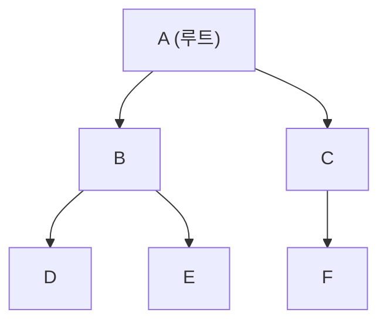
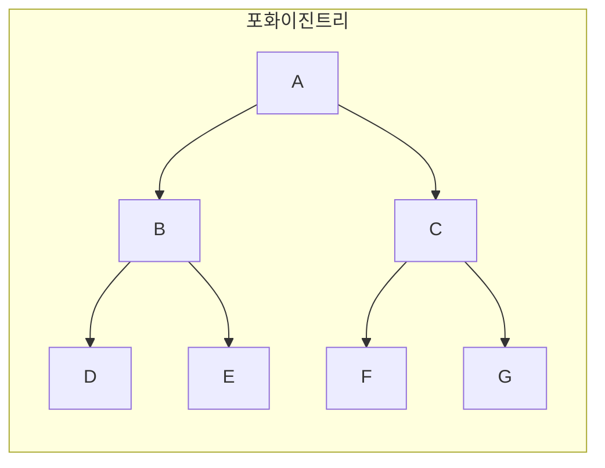
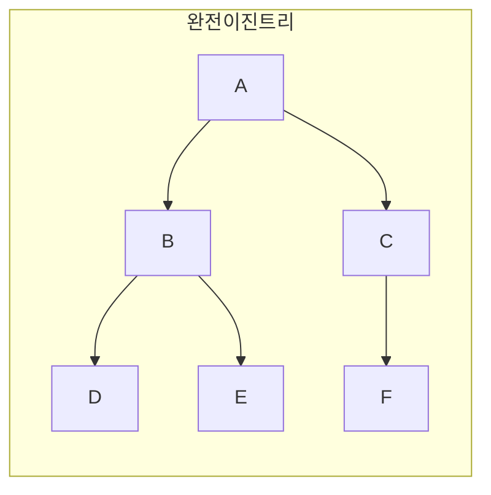
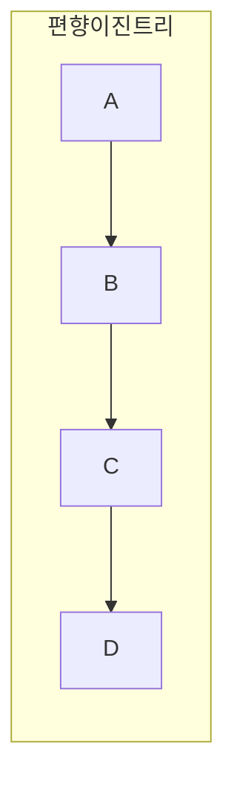
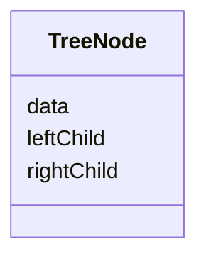

<Callout type="info">
  **이번 문서의 목표:** 이 문서를 다 읽으면 트리와 관련된 용어(루트, 부모, 자식, 형제, 리프, 차수, 깊이, 높이, 레벨)를 정확히 구분해서 쓸 수 있고, 이진트리의 종류(포화·완전·편향)를 구별하며, 이진트리를 배열과 연결리스트로 표현하는 두 방식의 장단점을 설명할 수 있다.
</Callout>

## 왜 트리가 필요한가

06~09편에서 다룬 배열, 연결리스트, 스택, 큐는 모두 데이터를 **한 줄로** 늘어놓는 **선형 자료구조**(linear data structure)였다. 원소들 사이의 관계가 "바로 앞" 또는 "바로 뒤"라는 한 방향의 관계뿐이었다.

그런데 현실의 데이터 중에는 한 줄로 표현하기 어색한 것들이 있다. 회사의 조직도(사장 아래 여러 팀장, 팀장 아래 여러 팀원), 컴퓨터의 파일 시스템(폴더 아래 여러 하위 폴더와 파일), 이 사이트의 목차(과목 아래 여러 편, 편 아래 여러 절)처럼 "하나가 여럿을 거느리고, 그 여럿이 다시 여럿을 거느리는" **계층 구조**(hierarchical structure)가 그렇다. **트리**(tree)는 이런 계층 구조를 표현하기 위해 만들어진 **비선형 자료구조**(non-linear data structure)다.

> **쉽게 말하면:** 트리는 나무를 거꾸로 세운 모양이다. 뿌리(root)가 맨 위에 있고, 가지가 아래로 뻗어 나가며 갈라진다. 조직도나 폴더 구조를 떠올리면 트리의 모양이 정확히 그것이다.

## 트리의 기본 용어

트리를 다루는 모든 개념과 알고리즘은 아래 용어 위에 세워진다. 이 용어들을 한 번에 확실히 잡아야 13편(순회)과 14편(BST)에서 헷갈리지 않는다.

- **노드**(node): 트리를 구성하는 하나하나의 항목이다. 위 그림에서 A, B, C, D, E, F가 모두 노드다.
- **루트**(root): 트리의 맨 위에 있는, 부모가 없는 유일한 노드다. 위 그림에서는 A다.
- **간선**(edge): 두 노드를 잇는 연결선이다. A와 B를 잇는 선처럼, 노드 사이의 관계를 나타낸다.
- **부모**(parent)와 **자식**(child): 간선으로 직접 연결된 두 노드 중 위에 있는 쪽이 부모, 아래에 있는 쪽이 자식이다. A는 B와 C의 부모이고, B와 C는 A의 자식이다.
- **형제**(sibling): 부모가 같은 노드들이다. B와 C는 둘 다 A를 부모로 두므로 서로 형제다.
- **조상**(ancestor)과 **자손**(descendant): 루트에서 어떤 노드까지 가는 경로 위에 있는 모든 노드가 그 노드의 조상이고, 반대로 어떤 노드 아래에 있는 모든 노드가 그 노드의 자손이다. A는 D의 조상이고, D는 A의 자손이다.
- **리프**(leaf, 잎 노드 또는 단말 노드): 자식이 하나도 없는 노드다. 위 그림에서 D, E, F가 리프다.
- **내부 노드**(internal node, 비단말 노드): 자식을 하나 이상 가진 노드다. A, B, C가 내부 노드다.
- **서브트리**(subtree): 어떤 노드와 그 노드의 모든 자손을 묶어서 보면, 그 자체로 하나의 작은 트리가 된다. B를 루트로 보면 B, D, E로 이루어진 서브트리가 만들어진다. 이 "트리 안에 트리가 있다"는 성질은 트리를 재귀적으로 정의하고 처리하는 근거가 된다(13편의 순회 알고리즘이 재귀로 짜이는 이유이기도 하다).

### 차수 — 자식이 몇 개인가

**차수**(degree)는 한 노드가 가진 자식의 개수다. 위 그림에서 A의 차수는 2(자식 B, C), B의 차수도 2(자식 D, E), C의 차수는 1(자식 F), D·E·F의 차수는 0이다. **트리의 차수**는 트리 안에 있는 노드들의 차수 중 **가장 큰 값**으로 정의한다. 위 트리는 최대 차수가 2이므로 트리의 차수가 2다.

> **쉽게 말하면:** 차수는 "그 사람이 직속 부하를 몇 명 두고 있는가"에 해당한다. 트리의 차수는 그 조직 전체에서 가장 부하가 많은 사람의 부하 수다.

### 레벨, 깊이, 높이 — 세로 위치를 재는 세 가지 방법

이 세 용어는 서로 자주 헷갈리는데, 기준점이 다르다는 점만 정확히 잡으면 구분할 수 있다.

- **레벨**(level): 루트를 레벨 0(또는 교재에 따라 레벨 1)으로 두고, 아래로 한 단계 내려갈 때마다 1씩 증가하는 값이다. 이 문서에서는 루트를 레벨 0으로 둔다.
- **깊이**(depth): 특정 노드에서 **루트까지** 거슬러 올라가는 데 필요한 간선의 개수다. 즉 그 노드의 레벨과 같은 값이다. 루트의 깊이는 0이다.
- **높이**(height): 특정 노드에서 그 아래로 뻗어 있는 **가장 먼 리프까지** 내려가는 데 필요한 간선의 개수다. **트리의 높이**는 루트의 높이, 즉 트리 전체에서 가장 깊은 리프까지의 간선 개수로 정의한다. 리프 노드 하나만 보면 그 노드의 높이는 0이다.

| 노드 | 레벨(=깊이) | 높이 |
|------|--------------|------|
| A(루트) | 0 | 2 |
| B | 1 | 1 |
| C | 1 | 1 |
| D | 2 | 0 |
| E | 2 | 0 |
| F | 2 | 0 |

A의 높이가 2인 이유는 A에서 가장 먼 리프(D, E, 또는 F)까지 간선을 2개(A→B→D처럼) 거쳐야 하기 때문이다. 반대로 A의 깊이는 0인데, A 자신이 루트이므로 거슬러 올라갈 간선이 없기 때문이다.

> **자주 틀리는 점:** "깊이"와 "높이"를 같은 말로 혼용하는 실수가 매우 흔하다. 깊이는 "루트로부터의 거리"(위를 바라보는 기준)이고, 높이는 "가장 먼 리프까지의 거리"(아래를 바라보는 기준)다. 같은 노드라도 두 값이 다를 수 있다. 위 표에서 B의 깊이는 1(루트까지 간선 1개)이지만 B의 높이도 1(리프 D 또는 E까지 간선 1개)로 우연히 같아 보일 수 있는데, 이는 이 트리가 대칭적이기 때문이지 일반적으로 항상 같은 값은 아니다.

## 이진트리 — 자식이 최대 둘뿐인 트리

**이진트리**(binary tree)는 모든 노드의 차수가 **최대 2**로 제한된 트리다. 즉 각 노드는 자식을 0개, 1개, 또는 2개까지만 가질 수 있고, 3개 이상은 가질 수 없다. 게다가 이진트리에서는 자식이 하나뿐이더라도 그것이 **왼쪽 자식**(left child)인지 **오른쪽 자식**(right child)인지가 구분된다. 이 "왼쪽·오른쪽 구분"이 일반 트리와 이진트리를 가르는 결정적인 차이다.

> **쉽게 말하면:** 일반 트리는 한 사람이 부하를 몇 명이든 둘 수 있는 조직도이지만, 이진트리는 "직속 부하는 최대 두 명, 그것도 반드시 '왼쪽 담당'과 '오른쪽 담당'으로 구분된다"는 규칙이 있는 특수한 조직도다.

이 편의 나머지 내용과 13편(순회), 14편(BST), 11편에서 이미 다룬 히프까지 모두 이 이진트리를 기반으로 한다. 독학사 시험 범위에서도 트리 관련 문제의 대부분이 일반 트리보다 이진트리에 집중된다.

### 이진트리의 종류

이진트리는 노드가 채워진 모양에 따라 다시 세 가지로 나뉜다. 이 구분은 11편의 히프 조건("완전이진트리여야 한다")을 이해하는 데도 그대로 쓰였다.

- **포화이진트리**(full binary tree, 또는 perfect binary tree라고도 부른다): 리프를 제외한 모든 노드가 자식을 정확히 2개씩 가지고, **모든 리프가 같은 레벨**에 있는 이진트리다. 위 첫 번째 그림처럼 빈틈이 전혀 없이 꽉 찬 모양이다.
- **완전이진트리**(complete binary tree): 마지막 레벨을 제외한 모든 레벨이 노드로 꽉 차 있고, 마지막 레벨의 노드들은 **왼쪽부터 순서대로** 채워진 이진트리다. 위 두 번째 그림에서 마지막 레벨(D, E, F)이 F 다음 자리(오른쪽에서 하나 더)가 비어 있는데, 이 빈자리가 항상 맨 오른쪽에만 있어야 완전이진트리다. 11편에서 히프가 배열 하나로 표현될 수 있었던 이유가 바로 이 "빈틈없이 왼쪽부터 채워짐" 성질 때문이다.
- **편향이진트리**(skewed binary tree): 모든 노드가 자식을 하나씩만 가져서 마치 연결리스트처럼 한쪽으로 치우친 이진트리다. 위 세 번째 그림처럼 오른쪽으로만(또는 왼쪽으로만) 계속 뻗어 나간다. 편향이진트리는 트리의 장점(빠른 탐색)을 전혀 살리지 못하고 연결리스트와 다를 바 없는 성능을 보인다는 점에서, 14편의 이진탐색트리가 왜 "균형"을 신경 써야 하는지를 예고하는 나쁜 예다.

> **쉽게 말하면:** 포화이진트리는 "빈자리가 하나도 없는 완벽하게 꽉 찬 트리", 완전이진트리는 "마지막 줄만 빼고는 꽉 차 있고, 마지막 줄도 왼쪽부터 순서대로만 채워진 트리", 편향이진트리는 "사실상 한 줄로 늘어선 트리"다. 포화이진트리는 항상 완전이진트리이기도 하지만, 완전이진트리라고 해서 항상 포화이진트리인 것은 아니다.

### 노드 개수 공식

포화이진트리는 각 레벨의 노드 수가 정확히 정해져 있어, 다음 공식이 성립한다.

$$
\text{레벨 } k \text{의 최대 노드 수} = 2^k
$$

- $k$: 레벨 번호(루트가 레벨 0)
- $2^k$: 2의 $k$제곱. 레벨이 하나 내려갈 때마다 자식이 2배씩 늘어난다는 뜻이다.

$$
\text{높이가 } h \text{인 포화이진트리의 전체 노드 수} = 2^{h+1} - 1
$$

- $h$: 트리의 높이(루트의 높이)

예를 들어 높이가 2인 포화이진트리(레벨 0, 1, 2가 모두 꽉 찬 트리)의 전체 노드 수는 $2^{2+1} - 1 = 2^3 - 1 = 7$이다. 실제로 레벨 0에 1개, 레벨 1에 2개, 레벨 2에 4개를 더하면 $1 + 2 + 4 = 7$로 일치한다. 이 공식은 16편에서 정렬·탐색의 복잡도를 $\log_2 n$으로 유도할 때도 다시 쓰인다 — 노드 수 $n$이 $2^{h+1} - 1$ 수준이라면, 거꾸로 높이 $h$는 $\log_2 n$ 수준이 되기 때문이다.

## 이진트리를 표현하는 두 가지 방법

트리를 실제 프로그램에서 다루려면, 이 추상적인 그림을 컴퓨터가 처리할 수 있는 형태로 표현해야 한다. 대표적인 방법이 두 가지 있다.

### 배열 표현

이진트리의 노드에 레벨 순서대로(왼쪽에서 오른쪽으로, 위에서 아래로) 번호를 매겨 배열의 인덱스로 삼는 방법이다. 11편의 히프에서 이미 이 방식을 자세히 다뤘다 — 인덱스 $i$인 노드의 부모는 인덱스 $\lfloor i/2 \rfloor$, 왼쪽 자식은 $2i$, 오른쪽 자식은 $2i+1$에 위치한다(배열을 인덱스 1부터 쓰는 경우).

배열 표현은 완전이진트리처럼 빈틈이 거의 없는 트리에서는 메모리를 낭비 없이 쓸 수 있고 부모·자식 위치를 계산만으로 바로 찾을 수 있어 효율적이다. 하지만 편향이진트리처럼 한쪽으로 치우친 트리를 배열로 표현하면, 실제로는 노드가 몇 개 없는데도 인덱스 번호는 매우 커져서 **배열에 빈 칸이 잔뜩 낭비**되는 문제가 생긴다.

| 인덱스 | 1 | 2 | 3 | 4 | 5 | 6 |
|--------|---|---|---|---|---|---|
| 노드(완전이진트리 예) | A | B | C | D | E | F |
| 노드(편향이진트리 예) | A | - | B | - | - | - |

편향이진트리에서 A의 자식이 오른쪽 B 하나뿐이라면, B는 인덱스 3(`rightChild(1) = 2*1+1 = 3`)에 위치하고 인덱스 2는 빈 칸으로 낭비된다. 트리가 한쪽으로 치우칠수록 이런 낭비가 기하급수적으로 심해진다.

### 연결 표현

각 노드를 하나의 객체(또는 구조체)로 만들고, 그 안에 **왼쪽 자식을 가리키는 링크**, **오른쪽 자식을 가리키는 링크**, 그리고 노드가 담은 값(데이터)을 함께 저장하는 방법이다. 07편에서 연결리스트 노드가 "데이터 + 다음 노드에 대한 링크"로 이루어졌던 것과 같은 발상인데, 이진트리는 링크가 하나가 아니라 왼쪽·오른쪽 두 개가 필요하다는 점이 다르다.

연결 표현은 트리 모양이 어떻든(포화든 편향이든) 실제로 존재하는 노드 수만큼만 메모리를 사용하므로 배열 표현의 낭비 문제가 없다. 하지만 각 노드마다 링크 두 개를 저장할 추가 메모리가 필요하고, 부모 노드를 찾아 올라가려면(배열 표현처럼 계산 한 번으로 되지 않고) 별도로 부모에 대한 링크를 추가로 저장해 두어야 한다.

### 두 표현법 비교

| 항목 | 배열 표현 | 연결 표현 |
|------|-----------|-----------|
| 부모·자식 접근 | 인덱스 계산만으로 O(1) | 저장해 둔 링크를 따라가야 함 |
| 메모리 효율 | 완전이진트리에 가까울수록 효율적, 편향이진트리에서는 낭비가 큼 | 트리 모양과 무관하게 실제 노드 수만큼만 사용, 단 링크 저장 비용 추가 |
| 삽입·삭제 | 배열 크기 조정이 필요할 수 있음 | 링크만 갱신하면 되어 유연함 |
| 대표 활용 | 11편의 히프(항상 완전이진트리이므로 낭비가 없음) | 13·14편의 순회, BST처럼 트리 모양이 데이터에 따라 자유롭게 변하는 경우 |

> **자주 틀리는 점:** "트리는 무조건 연결 표현으로 만들어야 한다"고 단정하는 것은 옳지 않다. 완전이진트리 성질이 보장되는 히프 같은 구조에서는 오히려 배열 표현이 더 간단하고 빠르다. 어떤 표현을 쓸지는 트리의 모양이 얼마나 빈틈없이 채워지는지에 달려 있다.

## 자주 틀리는 점

- **깊이와 높이를 뒤바꿔 쓰는 실수**: 깊이는 루트를 기준으로 내려온 거리, 높이는 리프를 기준으로 올라간(또는 리프까지 내려가는) 거리다. 기준점이 반대라는 점을 기억해야 한다.
- **트리의 차수를 노드 개수와 혼동하는 실수**: 차수는 "가장 자식이 많은 노드가 몇 개의 자식을 가지는가"이지, 트리 전체의 노드 개수가 아니다.
- **이진트리를 "자식이 두 개인 트리"로만 기억하는 실수**: 이진트리는 자식이 "최대 두 개까지"이며 0개, 1개도 가능하다. 또한 자식이 하나뿐일 때도 그것이 왼쪽인지 오른쪽인지 구분된다는 점이 일반 트리와의 핵심 차이다.
- **완전이진트리와 포화이진트리를 같은 말로 쓰는 실수**: 포화이진트리는 모든 레벨이 완전히 꽉 찬 경우이고, 완전이진트리는 마지막 레벨만 왼쪽부터 채워지면 된다. 포화이진트리는 완전이진트리의 특수한 경우다.
- **배열 표현이 항상 연결 표현보다 낫다거나 항상 못하다고 단정하는 실수**: 트리 모양(완전이진트리에 가까운지, 편향에 가까운지)에 따라 유불리가 달라진다.

## 핵심 정리

- 트리는 계층 구조를 표현하는 비선형 자료구조이며, 루트·부모·자식·형제·리프·서브트리 같은 용어로 구조를 기술한다.
- 차수는 자식 개수, 깊이는 루트로부터의 거리, 높이는 리프까지의 거리이며 이 세 값의 기준점을 정확히 구분해야 한다.
- 이진트리는 모든 노드의 자식이 최대 2개이며 왼쪽·오른쪽이 구분되는 트리로, 포화이진트리·완전이진트리·편향이진트리로 세분된다.
- 이진트리는 배열 표현(완전이진트리에 효율적)과 연결 표현(모양과 무관하게 유연) 중 트리의 모양에 맞게 선택해 표현할 수 있다.

## 마무리 복습

<Quiz
  questionNumber={1}
  question="트리의 용어에 대한 설명으로 옳은 것은?"
  options={['자식이 하나도 없는 노드를 내부 노드라고 부른다', '부모가 같은 두 노드를 형제라고 부른다', '루트에서 어떤 노드까지의 거리를 그 노드의 높이라고 부른다', '트리의 차수는 트리 안의 전체 노드 개수를 의미한다']}
  correctAnswer={2}
  explanation="부모가 같은 노드들끼리는 서로 형제(sibling)라고 부른다. 자식이 없는 노드는 내부 노드가 아니라 리프이며, 루트로부터의 거리는 높이가 아니라 깊이이고, 차수는 노드 개수가 아니라 자식 개수의 최댓값이다."
  optionExplanations={['자식이 없는 노드는 리프(단말 노드)라고 부른다. 내부 노드는 자식이 하나 이상 있는 노드다.', '정답. 부모가 같은 노드들을 형제라고 부른다.', '루트로부터의 거리는 높이가 아니라 깊이(depth)라고 부른다.', '트리의 차수는 노드 개수가 아니라 노드들의 차수(자식 수) 중 최댓값이다.']}
/>

<Quiz
  questionNumber={2}
  question="어떤 노드의 깊이와 높이에 대한 설명으로 가장 적절한 것은?"
  options={['깊이는 그 노드에서 가장 먼 리프까지의 거리이고, 높이는 루트까지의 거리다', '깊이는 루트로부터의 거리이고, 높이는 그 노드에서 가장 먼 리프까지의 거리다', '깊이와 높이는 항상 같은 값을 가진다', '루트의 깊이와 높이는 항상 0으로 같다']}
  correctAnswer={2}
  explanation="깊이는 루트를 기준으로 내려온 거리이고, 높이는 그 노드로부터 가장 먼 리프까지 내려가는 거리다. 두 값은 트리 모양에 따라 서로 다를 수 있다."
  optionExplanations={['깊이와 높이의 정의가 서로 바뀐 설명이다.', '정답. 깊이는 루트 기준, 높이는 리프 기준으로 재는 거리다.', '두 값의 기준점이 다르므로 일반적으로는 서로 다른 값을 가진다.', '루트의 깊이는 항상 0이지만, 루트의 높이는 트리 전체의 높이와 같아 0이 아닐 수 있다.']}
/>

<Quiz
  questionNumber={3}
  question="이진트리(binary tree)에 대한 설명으로 옳지 않은 것은?"
  options={['모든 노드는 자식을 최대 2개까지 가질 수 있다', '자식이 하나뿐인 경우 왼쪽 자식인지 오른쪽 자식인지가 구분된다', '이진트리는 항상 완전이진트리 모양이어야 한다', '자식이 하나도 없는 노드가 존재할 수 있다']}
  correctAnswer={3}
  explanation="이진트리는 각 노드의 자식이 최대 2개라는 조건만 요구할 뿐, 반드시 완전이진트리 모양일 필요는 없다. 편향이진트리처럼 한쪽으로 치우친 모양도 이진트리의 한 종류다."
  optionExplanations={['옳은 설명이다. 이진트리는 자식 수가 최대 2개로 제한된다.', '옳은 설명이다. 자식이 하나뿐이어도 왼쪽·오른쪽 구분이 유지된다.', '정답(옳지 않은 설명). 이진트리가 반드시 완전이진트리일 필요는 없으며 편향이진트리도 이진트리에 속한다.', '옳은 설명이다. 리프 노드는 자식이 없는 노드다.']}
/>

<Quiz
  questionNumber={4}
  question="포화이진트리와 완전이진트리의 관계에 대한 설명으로 옳은 것은?"
  options={['완전이진트리는 항상 포화이진트리이기도 하다', '포화이진트리는 항상 완전이진트리이기도 하지만 그 역은 성립하지 않는다', '두 개념은 서로 아무 관련이 없다', '편향이진트리가 곧 완전이진트리다']}
  correctAnswer={2}
  explanation="포화이진트리는 모든 레벨이 완전히 꽉 찬 트리로, 마지막 레벨만 왼쪽부터 채워지면 되는 완전이진트리 조건을 자동으로 만족한다. 하지만 완전이진트리라고 해서 마지막 레벨까지 항상 꽉 차 있는 것은 아니므로 역은 성립하지 않는다."
  optionExplanations={['완전이진트리는 마지막 레벨이 비어 있을 수 있어 항상 포화이진트리인 것은 아니다.', '정답. 포화이진트리는 완전이진트리의 특수한 경우다.', '두 개념은 완전이진트리가 포화이진트리를 포함하는 상하 관계에 있다.', '편향이진트리는 한쪽으로 치우친 모양으로 완전이진트리 조건(왼쪽부터 채움)을 만족하지 않는 경우가 대부분이다.']}
/>

<Quiz
  questionNumber={5}
  question="높이가 3인 포화이진트리의 전체 노드 수는?"
  options={['7개', '8개', '15개', '16개']}
  correctAnswer={3}
  explanation="높이가 h인 포화이진트리의 전체 노드 수는 2의 (h+1)제곱 빼기 1이다. h가 3이므로 2의 4제곱인 16에서 1을 뺀 15개가 된다."
  optionExplanations={['7개는 높이가 2인 포화이진트리의 노드 수다.', '8개는 이 공식으로 나오는 값이 아니다.', '정답. 2의 4제곱은 16이고 여기서 1을 빼면 15개다.', '16은 1을 빼기 전 중간 계산값이며 최종 답이 아니다.']}
/>

<Quiz
  questionNumber={6}
  question="이진트리를 배열로 표현하는 방식과 연결리스트로 표현하는 방식에 대한 설명으로 옳은 것은?"
  options={['배열 표현은 어떤 트리 모양이든 항상 메모리를 가장 효율적으로 사용한다', '연결 표현은 부모·자식 위치를 인덱스 계산만으로 즉시 알 수 있다', '배열 표현은 편향이진트리처럼 한쪽으로 치우친 트리에서 빈 칸 낭비가 커질 수 있다', '연결 표현은 노드마다 추가 메모리(링크)가 전혀 필요하지 않다']}
  correctAnswer={3}
  explanation="배열 표현은 노드 번호(인덱스)를 트리의 위치로 사용하는데, 편향이진트리처럼 치우친 트리는 실제 노드 수에 비해 인덱스 값이 커져 배열에 빈 칸이 많이 생긴다."
  optionExplanations={['편향이진트리처럼 치우친 트리에서는 배열 표현이 오히려 메모리를 크게 낭비한다.', '인덱스 계산으로 부모·자식 위치를 즉시 아는 것은 연결 표현이 아니라 배열 표현의 특징이다.', '정답. 편향이진트리에서는 배열 표현의 빈 칸 낭비가 커진다.', '연결 표현은 왼쪽·오른쪽 자식을 가리키는 링크를 저장해야 하므로 추가 메모리가 필요하다.']}
/>

<Quiz
  questionNumber={7}
  question="어떤 노드 X의 서브트리(subtree)에 대한 설명으로 가장 적절한 것은?"
  options={['X의 형제 노드들만 모아 놓은 집합이다', 'X와 X의 모든 자손 노드를 묶어서 보면 그 자체로 하나의 작은 트리를 이룬다', 'X의 부모부터 루트까지의 경로만을 의미한다', '트리 전체에서 리프 노드만 모아 놓은 것을 의미한다']}
  correctAnswer={2}
  explanation="서브트리는 어떤 노드를 새로운 루트로 보고 그 노드와 모든 자손을 함께 묶은 것이다. 이 구조 덕분에 트리를 다루는 알고리즘을 재귀적으로 정의할 수 있다."
  optionExplanations={['형제 노드는 서브트리와 무관한 별개의 개념이다.', '정답. 노드와 그 자손 전체가 하나의 작은 트리를 이루는 것이 서브트리다.', '이는 조상 경로에 대한 설명이며 서브트리의 정의와 다르다.', '리프 노드만 모은 집합은 서브트리가 아니다.']}
/>

## 참고 자료

- [국가평생교육진흥원 과목별 평가영역](https://bdes.nile.or.kr/nile/study/nStudy2_1.do) — 자료구조 과목의 평가영역과 출제 범위를 확인할 수 있는 공식 자료.
- [국가평생교육진흥원 독학학위제](https://bdes.nile.or.kr/) — 독학학위제 시험 체계 전반을 확인할 수 있는 공식 사이트.
