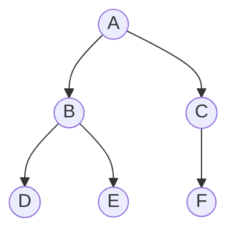

<Callout type="info">
  **이번 문서의 목표:** 이 문서를 다 읽으면 어떤 이진트리를 보고 전위·중위·후위·레벨 순회 결과를 손으로 정확히 추적할 수 있고, 반대로 순회 결과 두 개가 주어졌을 때 원래 트리를 복원할 수 있으며, 순회 관련 시험 문항에서 자주 나오는 함정을 미리 피할 수 있다.
</Callout>

## 왜 순회 순서를 따지는가

12편에서 이진트리(binary tree)가 각 노드가 자식을 최대 두 개까지만 가지는 트리라는 것과, 노드마다 왼쪽 자식(left child)·오른쪽 자식(right child)이 구분된다는 점을 정리했다. 그런데 트리는 배열이나 연결리스트와 달리 "다음 원소"가 하나로 정해져 있지 않다. 어떤 노드에 도착하면 그 노드 자체를 처리할지, 왼쪽 자식 쪽으로 먼저 갈지, 오른쪽 자식 쪽으로 먼저 갈지를 매번 선택해야 한다. **순회**(traversal)란 트리의 모든 노드를 빠짐없이, 중복 없이 방문하기 위해 이 선택을 미리 정해 놓은 규칙이다.

같은 트리라도 어떤 순회 규칙을 쓰느냐에 따라 노드를 방문하는 순서가 완전히 달라진다. 이 순서 차이가 실제로 의미를 가지는 경우가 많다. 예를 들어 수식을 트리로 표현했을 때(연산자가 부모, 피연산자가 자식) 후위 순회 결과를 그대로 읽으면 후위 표기법(postfix, 10편에서 다룬 표기법)이 나오고, 전위 순회 결과를 읽으면 전위 표기법(prefix)이 나온다. 독학사 시험에서는 "다음 트리를 전위 순회한 결과는?"처럼 직접 추적을 요구하는 문항과, "순회 결과 두 개를 보고 원래 트리를 복원하라"는 역방향 문항이 모두 자주 나온다.

> **쉽게 말하면:** 순회는 "트리의 노드를 어떤 순서로 하나씩 방문할 것인가"를 정한 규칙이고, 규칙에 따라 같은 트리에서도 완전히 다른 방문 순서가 나온다.

## 네 가지 순회 규칙

이진트리 순회는 크게 두 갈래로 나뉜다. 부모와 자식을 재귀적으로 비교하는 **깊이 우선 순회**(전위·중위·후위)와, 같은 높이(level)의 노드를 먼저 모두 방문하는 **너비 우선 순회**(레벨 순회)다.

### 전위 순회 — 루트가 가장 먼저

**전위 순회**(preorder traversal)는 "루트(root) → 왼쪽 서브트리 → 오른쪽 서브트리" 순서로 방문한다. 영어 앞글자를 따서 흔히 NLR(Node-Left-Right) 순서라고도 부른다.

```
전위 순회(노드):
  만약 노드가 없으면(빈 트리) 그냥 반환한다
  1. 노드 자신을 방문한다(출력한다)
  2. 왼쪽 서브트리를 전위 순회한다
  3. 오른쪽 서브트리를 전위 순회한다
```

### 중위 순회 — 왼쪽을 먼저 다 본 뒤 루트

**중위 순회**(inorder traversal)는 "왼쪽 서브트리 → 루트 → 오른쪽 서브트리" 순서로 방문한다(LNR). 14편에서 볼 것처럼, 이진탐색트리(BST)에 중위 순회를 적용하면 값이 오름차순으로 정렬되어 나온다는 성질이 있어 시험에 특히 자주 등장한다.

```
중위 순회(노드):
  만약 노드가 없으면 그냥 반환한다
  1. 왼쪽 서브트리를 중위 순회한다
  2. 노드 자신을 방문한다
  3. 오른쪽 서브트리를 중위 순회한다
```

### 후위 순회 — 자식을 다 본 뒤 마지막에 루트

**후위 순회**(postorder traversal)는 "왼쪽 서브트리 → 오른쪽 서브트리 → 루트" 순서로 방문한다(LRN). 노드를 삭제하거나 서브트리 전체를 정리(메모리 해제 등)할 때는 자식을 먼저 처리해야 하므로 후위 순회가 자연스럽다.

```
후위 순회(노드):
  만약 노드가 없으면 그냥 반환한다
  1. 왼쪽 서브트리를 후위 순회한다
  2. 오른쪽 서브트리를 후위 순회한다
  3. 노드 자신을 방문한다
```

### 레벨 순회 — 깊이가 아니라 높이 순서

**레벨 순회**(level-order traversal)는 루트를 0번째 레벨로 놓고, 같은 레벨(높이가 같은 노드들)을 왼쪽에서 오른쪽으로 전부 방문한 다음 다음 레벨로 내려간다. 이 방식은 재귀로 자연스럽게 표현되지 않고, **큐**(queue, 09편)를 이용한 반복 구조로 구현한다.

```
레벨 순회(루트):
  큐를 하나 만들고 루트를 큐에 넣는다
  큐가 빌 때까지 반복한다:
    1. 큐에서 노드 하나를 꺼낸다(dequeue)
    2. 꺼낸 노드를 방문한다
    3. 왼쪽 자식이 있으면 큐에 넣는다(enqueue)
    4. 오른쪽 자식이 있으면 큐에 넣는다(enqueue)
```

레벨 순회에 큐를 쓰는 이유는 큐가 "먼저 들어온 것이 먼저 나가는"(FIFO, First-In-First-Out) 성질을 가지기 때문이다. 어떤 레벨의 노드들을 먼저 큐에 넣어 두면, 그 자식들(다음 레벨)은 큐의 뒤쪽에 쌓이므로 현재 레벨을 다 처리한 뒤에야 꺼내지게 된다. 만약 큐 대신 스택을 쓰면 나중에 넣은 자식이 먼저 나와서 레벨 순서가 깨진다 — 이 차이는 15편에서 다룰 그래프의 BFS(큐 사용)와 DFS(스택 또는 재귀 사용)의 차이와 정확히 같은 원리다.

> **쉽게 말하면:** 전위·중위·후위는 "루트를 언제 방문하느냐"(먼저/중간/나중)만 다르고, 레벨 순회는 아예 다른 도구(큐)로 "위에서 아래로, 왼쪽에서 오른쪽으로" 훑는다.

## 예시 트리로 네 순회를 직접 추적하기

아래 트리를 기준으로 네 가지 순회를 전부 추적해 본다.



이 트리는 A가 루트이고, A의 왼쪽 자식은 B, 오른쪽 자식은 C다. B의 왼쪽 자식은 D, 오른쪽 자식은 E다. C는 왼쪽 자식이 없고 오른쪽 자식만 F다.

### 전위 순회(NLR) 추적표

재귀 호출이 어떤 순서로 값을 출력하는지 호출 스택 흐름을 표로 따라간다.

| 단계 | 현재 호출 | 동작 | 출력 |
|------|-----------|------|------|
| 1 | 전위(A) | A 방문 | A |
| 2 | 전위(B) | B 방문(A의 왼쪽으로 재귀) | A, B |
| 3 | 전위(D) | D 방문(B의 왼쪽으로 재귀) | A, B, D |
| 4 | 전위(D의 왼쪽=없음) | 빈 트리, 반환 | A, B, D |
| 5 | 전위(D의 오른쪽=없음) | 빈 트리, 반환 | A, B, D |
| 6 | 전위(E) | E 방문(B의 오른쪽으로 재귀) | A, B, D, E |
| 7 | 전위(E의 왼쪽·오른쪽=없음) | 빈 트리, 반환 | A, B, D, E |
| 8 | 전위(C) | C 방문(A의 오른쪽으로 재귀) | A, B, D, E, C |
| 9 | 전위(C의 왼쪽=없음) | 빈 트리, 반환 | A, B, D, E, C |
| 10 | 전위(F) | F 방문(C의 오른쪽으로 재귀) | A, B, D, E, C, F |

**전위 순회 결과: A, B, D, E, C, F**

### 중위 순회(LNR) 추적표

| 단계 | 현재 호출 | 동작 | 출력 |
|------|-----------|------|------|
| 1 | 중위(A) | A의 왼쪽(B)으로 먼저 내려감 | (없음) |
| 2 | 중위(B) | B의 왼쪽(D)으로 먼저 내려감 | (없음) |
| 3 | 중위(D) | D는 왼쪽이 없으므로 D 방문 | D |
| 4 | 중위(B) 복귀 | D를 마쳤으니 B 방문 | D, B |
| 5 | 중위(E) | B의 오른쪽(E)으로 내려가 E는 자식이 없으므로 방문 | D, B, E |
| 6 | 중위(A) 복귀 | B 서브트리를 마쳤으니 A 방문 | D, B, E, A |
| 7 | 중위(C) | A의 오른쪽(C)으로 내려감. C는 왼쪽이 없으므로 바로 C 방문 | D, B, E, A, C |
| 8 | 중위(F) | C의 오른쪽(F)으로 내려가 F는 자식이 없으므로 방문 | D, B, E, A, C, F |

**중위 순회 결과: D, B, E, A, C, F**

### 후위 순회(LRN) 추적표

| 단계 | 현재 호출 | 동작 | 출력 |
|------|-----------|------|------|
| 1 | 후위(D) | D는 자식이 없으므로 바로 방문 | D |
| 2 | 후위(E) | E도 자식이 없으므로 바로 방문 | D, E |
| 3 | 후위(B) | 왼쪽(D)·오른쪽(E)을 모두 마쳤으니 B 방문 | D, E, B |
| 4 | 후위(F) | F는 자식이 없으므로 바로 방문 | D, E, B, F |
| 5 | 후위(C) | 왼쪽은 없고 오른쪽(F)을 마쳤으니 C 방문 | D, E, B, F, C |
| 6 | 후위(A) | 왼쪽(B 서브트리)·오른쪽(C 서브트리)을 모두 마쳤으니 A 방문 | D, E, B, F, C, A |

**후위 순회 결과: D, E, B, F, C, A**

### 레벨 순회 추적표(큐 상태 포함)

| 단계 | 큐 상태(왼쪽이 앞) | 동작 | 방문 순서 |
|------|-------------------|------|-----------|
| 1 | [A] | A를 넣고 시작 | (없음) |
| 2 | [] | A를 꺼내 방문, B·C를 큐에 넣음 | A |
| 3 | [B, C] | B를 꺼내 방문, D·E를 큐에 넣음 | A, B |
| 4 | [C, D, E] | C를 꺼내 방문, C의 왼쪽 없음, F를 큐에 넣음 | A, B, C |
| 5 | [D, E, F] | D를 꺼내 방문, 자식 없음 | A, B, C, D |
| 6 | [E, F] | E를 꺼내 방문, 자식 없음 | A, B, C, D, E |
| 7 | [F] | F를 꺼내 방문, 자식 없음 | A, B, C, D, E, F |
| 8 | [] | 큐가 비어 종료 | A, B, C, D, E, F |

**레벨 순회 결과: A, B, C, D, E, F**

네 결과를 나란히 놓고 비교하면 규칙이 어떻게 순서를 바꾸는지 한눈에 보인다.

| 순회 | 순서 규칙 | 이 트리의 결과 |
|------|-----------|----------------|
| 전위 | 루트–왼쪽–오른쪽 | A, B, D, E, C, F |
| 중위 | 왼쪽–루트–오른쪽 | D, B, E, A, C, F |
| 후위 | 왼쪽–오른쪽–루트 | D, E, B, F, C, A |
| 레벨 | 위에서 아래로, 왼쪽에서 오른쪽으로 | A, B, C, D, E, F |

> **자주 틀리는 점:** 전위·중위·후위는 셋 다 "왼쪽을 오른쪽보다 먼저 본다"는 점이 같다. 세 순회의 유일한 차이는 **루트를 언제 방문하느냐**(먼저/중간/나중)뿐이다. 이 한 문장만 기억하면 순서를 헷갈릴 일이 크게 줄어든다.

## 순회 결과로 트리를 거꾸로 복원하기

시험에는 순회 결과 두 개를 주고 원래 트리 모양을 그리게 하는 문제가 자주 나온다. 이때 핵심 원리는 다음과 같다.

- **전위 순회의 첫 원소**는 항상 그 서브트리의 루트다(루트를 가장 먼저 방문하므로).
- **후위 순회의 마지막 원소**는 항상 그 서브트리의 루트다(루트를 가장 나중에 방문하므로).
- **중위 순회**에서 루트를 알면, 그 루트를 기준으로 왼쪽에 있는 원소들은 전부 왼쪽 서브트리, 오른쪽에 있는 원소들은 전부 오른쪽 서브트리에 속한다.

이 세 가지를 조합하면 "전위 + 중위" 또는 "후위 + 중위" 조합만으로 트리를 유일하게 복원할 수 있다. 위 예시 트리의 전위·중위 결과로 복원 과정을 추적해 보자.

- 전위: A, B, D, E, C, F
- 중위: D, B, E, A, C, F

<Steps>
1. **루트 찾기**: 전위 순회의 첫 원소는 A다. A가 루트다.
2. **중위 순회에서 A의 위치 찾기**: 중위 순회 `D, B, E, A, C, F`에서 A를 기준으로 왼쪽은 `D, B, E`, 오른쪽은 `C, F`다. 따라서 A의 왼쪽 서브트리에는 D, B, E가, 오른쪽 서브트리에는 C, F가 속한다.
3. **왼쪽 서브트리 복원**: 전위 순회에서 A 다음에 오는 원소들 중 왼쪽 서브트리에 속하는 것은 순서대로 B, D, E다. 이 부분 전위 `B, D, E`의 첫 원소 B가 왼쪽 서브트리의 루트다. 왼쪽 서브트리의 중위는 `D, B, E`이므로 B를 기준으로 왼쪽은 D, 오른쪽은 E다.
4. **오른쪽 서브트리 복원**: 오른쪽 서브트리에 속하는 전위 원소는 순서대로 C, F이고, 첫 원소 C가 루트다. 오른쪽 서브트리의 중위는 `C, F`이므로 C를 기준으로 왼쪽은 없고 오른쪽은 F다.
5. **결과 조립**: A를 루트로, 왼쪽에 B(왼쪽 자식 D, 오른쪽 자식 E), 오른쪽에 C(오른쪽 자식 F)를 붙이면 원래 트리와 정확히 같은 모양이 나온다.
</Steps>

> **자주 틀리는 점:** **전위와 후위만으로는** 트리를 유일하게 복원할 수 없다. 중위 순회가 없으면 "루트를 기준으로 왼쪽과 오른쪽을 나누는" 기준선을 만들 수 없어서, 같은 전위·후위 조합에 대응하는 트리 모양이 여러 개 나올 수 있다(특히 자식이 하나뿐인 노드가 많을 때). 복원 문제에서는 반드시 **중위 순회가 포함된 조합인지**부터 확인해야 한다.

## 순회의 시간 복잡도

전위·중위·후위·레벨 순회는 모두 **노드 하나당 정확히 한 번씩** 방문하고 끝난다. 노드가 $n$개인 트리라면 방문 횟수도 정확히 $n$번이므로, 네 순회 모두 시간 복잡도는 $O(n)$이다. 재귀 호출을 쓰는 전위·중위·후위는 트리의 높이(height)만큼 함수 호출 스택이 쌓이므로, 스택에 쓰는 추가 공간은 트리의 높이 $h$에 비례해 $O(h)$다(균형 잡힌 트리라면 $O(\log n)$, 한쪽으로 치우친 편향 트리라면 최악의 경우 $O(n)$). 레벨 순회는 큐에 한 레벨의 노드 수만큼 원소가 쌓이므로, 필요한 공간은 트리에서 가장 넓은 레벨의 노드 수에 비례한다.

## 자주 틀리는 점

- **"전위·중위·후위"라는 이름과 실제 동작을 거꾸로 외우는 실수**: 이름의 접두사(전/중/후)는 **루트를 방문하는 시점**을 가리킨다. 전위는 루트가 맨 앞, 중위는 루트가 중간, 후위는 루트가 맨 뒤라고 이름 그대로 외우면 헷갈리지 않는다.
- **레벨 순회에 스택을 쓴다고 착각하는 실수**: 레벨 순회는 큐(FIFO)를 쓴다. 스택(LIFO)을 쓰면 같은 레벨 안에서도 순서가 뒤집히고, 심지어 레벨 자체가 섞여 나올 수 있다.
- **전위·후위만으로 트리를 복원하려는 실수**: 앞서 설명했듯 중위 순회 없이는 트리 모양이 유일하게 정해지지 않는다.
- **중위 순회 결과가 항상 정렬되어 있다고 착각하는 실수**: 값이 오름차순으로 나오는 것은 그 트리가 **이진탐색트리(BST)일 때만** 성립하는 성질이다(14편). 일반 이진트리의 중위 순회는 정렬된 순서와 아무 관련이 없다.

## 핵심 정리

- 전위(NLR)·중위(LNR)·후위(LRN)는 왼쪽을 오른쪽보다 먼저 본다는 점은 같고, 루트를 방문하는 시점(먼저/중간/나중)만 다르다.
- 레벨 순회는 큐를 이용해 위에서 아래로, 같은 레벨에서는 왼쪽에서 오른쪽으로 방문한다.
- 전위 순회의 첫 원소와 후위 순회의 마지막 원소는 각각 그 서브트리의 루트를 가리킨다. 이 성질과 중위 순회를 조합하면 트리를 유일하게 복원할 수 있다. 중위 순회가 빠진 조합(전위+후위)으로는 복원이 유일하지 않다.
- 네 순회 모두 노드 하나당 한 번씩 방문하므로 시간 복잡도는 $O(n)$이며, 재귀 순회의 추가 공간은 트리 높이 $h$에 비례해 $O(h)$다.

## 마무리 복습

<Quiz
  questionNumber={1}
  question="전위·중위·후위 순회의 공통점과 차이점에 대한 설명으로 옳은 것은?"
  options={['세 순회 모두 오른쪽 서브트리를 왼쪽 서브트리보다 먼저 방문한다', '세 순회의 유일한 차이는 루트를 언제 방문하느냐이며 왼쪽을 오른쪽보다 먼저 보는 것은 공통이다', '중위 순회만 재귀 호출을 사용하고 나머지는 반복문만으로 구현한다', '후위 순회는 루트를 가장 먼저 방문한다']}
  correctAnswer={2}
  explanation="전위(루트-왼쪽-오른쪽), 중위(왼쪽-루트-오른쪽), 후위(왼쪽-오른쪽-루트)는 모두 왼쪽 서브트리를 오른쪽보다 먼저 방문한다는 공통점이 있고, 루트를 방문하는 시점만 다르다."
  optionExplanations={['세 순회 모두 왼쪽을 오른쪽보다 먼저 방문한다.', '정답. 왼쪽을 오른쪽보다 먼저 보는 것은 공통이고 루트 방문 시점만 다르다.', '세 순회 모두 재귀로 자연스럽게 구현되며, 반복문으로도 구현 가능하지만 이는 구현 방식의 문제이지 정의의 차이가 아니다.', '후위 순회는 루트를 가장 나중에 방문한다.']}
/>

<Quiz
  questionNumber={2}
  question="루트 A, 왼쪽 자식 B, 오른쪽 자식 C만 있는 간단한 트리(B와 C는 자식이 없음)를 후위 순회한 결과는?"
  options={['A, B, C', 'B, C, A', 'B, A, C', 'C, B, A']}
  correctAnswer={2}
  explanation="후위 순회는 왼쪽 서브트리, 오른쪽 서브트리, 루트 순서다. B(왼쪽)를 방문하고, C(오른쪽)를 방문한 뒤, 마지막에 A(루트)를 방문하므로 B, C, A가 된다."
  optionExplanations={['이는 전위 순회 결과다.', '정답. 왼쪽(B), 오른쪽(C), 루트(A) 순서다.', '이 순서는 중위 순회(B, A, C)와도 다르다.', '오른쪽을 왼쪽보다 먼저 방문하는 것은 후위 순회의 규칙이 아니다.']}
/>

<Quiz
  questionNumber={3}
  question="레벨 순회(level-order traversal)를 구현할 때 사용하는 자료구조와 그 이유로 가장 적절한 것은?"
  options={['스택을 사용한다. 나중에 넣은 노드를 먼저 꺼내야 같은 레벨을 먼저 방문할 수 있기 때문이다', '큐를 사용한다. 먼저 넣은 노드를 먼저 꺼내야 같은 레벨의 노드를 순서대로 방문할 수 있기 때문이다', '배열만 사용한다. 트리의 높이를 미리 알 수 있으므로 별도 자료구조가 필요 없다', '연결리스트를 사용한다. 삽입과 삭제가 양쪽 끝에서 모두 필요하기 때문이다']}
  correctAnswer={2}
  explanation="레벨 순회는 현재 레벨의 노드를 먼저 큐에 넣어 두고, 그 노드들의 자식(다음 레벨)은 큐의 뒤쪽에 쌓이게 해서 현재 레벨을 다 처리한 뒤에야 다음 레벨을 꺼내는 FIFO 성질을 이용한다."
  optionExplanations={['스택을 쓰면 나중에 넣은 자식이 먼저 나와 레벨 순서가 깨진다.', '정답. 큐의 FIFO 성질이 레벨 순서를 보장한다.', '트리 높이를 안다고 해도 노드 방문 순서를 관리할 자료구조가 필요하다.', '레벨 순회는 한쪽 끝에서만 넣고 다른 쪽 끝에서만 꺼내는 큐로 충분하며, 양쪽 끝 삽입·삭제가 필요한 것은 아니다.']}
/>

<Quiz
  questionNumber={4}
  question="전위 순회 결과와 후위 순회 결과만 주어졌을 때 트리 복원에 대한 설명으로 옳은 것은?"
  options={['전위와 후위만으로 항상 트리를 유일하게 복원할 수 있다', '전위의 첫 원소와 후위의 마지막 원소가 각각 루트를 가리키지만, 중위 순회가 없으면 트리 모양이 유일하게 정해지지 않을 수 있다', '전위와 후위 조합으로는 루트조차 알아낼 수 없다', '후위 순회의 첫 원소가 루트를 가리킨다']}
  correctAnswer={2}
  explanation="전위의 첫 원소와 후위의 마지막 원소는 각각 루트를 알려주지만, 왼쪽·오른쪽 서브트리를 나누는 기준선을 제공하는 것은 중위 순회다. 중위 순회가 없으면 특히 자식이 하나뿐인 노드가 많을 때 트리 모양이 유일하게 정해지지 않을 수 있다."
  optionExplanations={['자식이 하나뿐인 노드가 있으면 전위+후위만으로는 유일하게 복원되지 않을 수 있다.', '정답. 루트는 알 수 있지만 서브트리를 나누는 기준선이 없어 복원이 유일하지 않을 수 있다.', '전위의 첫 원소가 루트를 알려주므로 루트는 알아낼 수 있다.', '후위 순회는 루트를 가장 나중에 방문하므로 마지막 원소가 루트다.']}
/>

<Quiz
  questionNumber={5}
  question="어떤 이진트리의 중위 순회 결과가 오름차순으로 정렬된 값이었다. 이 트리에 대한 설명으로 가장 적절한 것은?"
  options={['모든 이진트리는 중위 순회를 하면 항상 오름차순으로 정렬된다', '이 성질은 이진탐색트리(BST)일 때 성립하는 성질이며, 일반 이진트리에는 해당하지 않는다', '중위 순회가 정렬된 것은 우연이며 트리 구조와는 무관하다', '전위 순회 결과도 항상 오름차순으로 정렬되어야 한다']}
  correctAnswer={2}
  explanation="중위 순회 결과가 오름차순으로 정렬되는 것은 왼쪽 서브트리의 모든 값이 루트보다 작고 오른쪽 서브트리의 모든 값이 루트보다 큰 이진탐색트리(BST)의 성질 때문이다. 일반 이진트리에는 이런 값의 대소 관계 규칙이 없으므로 성립하지 않는다."
  optionExplanations={['일반 이진트리는 노드 배치에 값의 대소 규칙이 없어 중위 순회 결과가 정렬된다는 보장이 없다.', '정답. 이는 BST의 성질이며 14편에서 자세히 다룬다.', '트리가 BST 성질을 만족한다면 이는 구조에서 비롯된 필연적 결과이지 우연이 아니다.', '전위 순회는 루트를 먼저 방문하므로 값의 정렬 순서와는 무관하다.']}
/>

<Quiz
  questionNumber={6}
  question="노드 수가 n개인 이진트리에서 전위·중위·후위·레벨 순회의 시간 복잡도에 대한 설명으로 옳은 것은?"
  options={['전위 순회만 O(n)이고 나머지는 O(n log n)이다', '네 순회 모두 노드마다 한 번씩 방문하므로 O(n)이다', '레벨 순회는 큐를 쓰므로 O(n^2)이 된다', '트리가 균형 잡혀 있을 때만 O(n)이고 편향 트리는 O(n^2)이다']}
  correctAnswer={2}
  explanation="네 순회 방식 모두 각 노드를 정확히 한 번씩 방문하고 끝나므로, 노드 수 n에 비례하는 O(n) 시간이 걸린다. 이는 트리 모양(균형 여부)과 무관하게 성립한다."
  optionExplanations={['네 순회 모두 각 노드를 한 번씩 방문하므로 O(n)으로 동일하다.', '정답. 노드마다 한 번씩 방문하는 것이 순회의 정의이므로 O(n)이다.', '큐에 넣고 빼는 연산 자체는 각각 O(1)이므로 전체는 여전히 O(n)이다.', '방문 횟수는 트리 모양과 무관하게 노드 수만큼이므로 편향 트리에서도 시간 복잡도는 O(n)이다(다만 재귀 호출의 추가 공간은 편향 트리에서 O(n)까지 커질 수 있다).']}
/>

## 참고 자료

- [MDN JavaScript reference](https://developer.mozilla.org/en-US/docs/Web/JavaScript) — 재귀 함수와 자료구조를 다루는 기본 참고 자료.
- [국가평생교육진흥원 과목별 평가영역](https://bdes.nile.or.kr/nile/study/nStudy2_1.do) — 자료구조 과목의 트리 관련 출제 범위 확인용 공식 안내.
