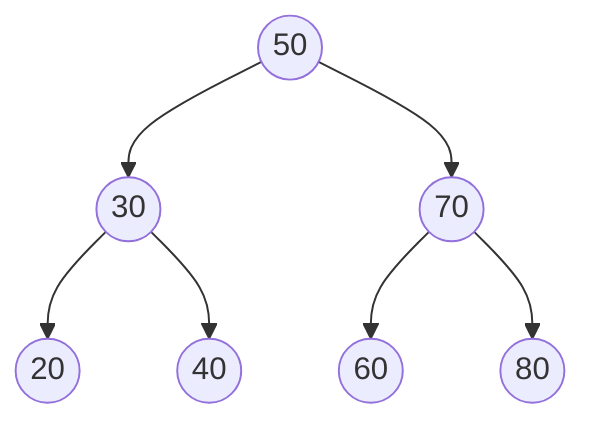
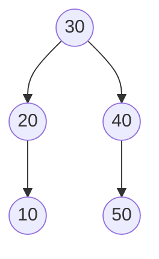
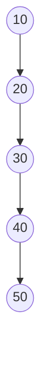

<Callout type="info">
  **이번 문서의 목표:** 이 문서를 다 읽으면 이진탐색트리(BST)에 값을 삽입·탐색·삭제하는 과정을 단계별로 손으로 추적할 수 있고, 특히 자식이 둘인 노드를 삭제할 때 후계자(successor)를 찾는 방법을 설명할 수 있으며, 트리 모양(균형/편향)에 따라 복잡도가 왜 달라지는지 논리적으로 설명할 수 있다.
</Callout>

## 왜 "정렬된 트리"가 필요한가

06편에서 정렬된 배열은 이진 탐색(binary search)으로 $O(\log n)$에 값을 찾을 수 있다는 것을 다뤘다. 그런데 정렬된 배열은 중간에 값을 삽입·삭제하려면 뒤 원소를 통째로 밀어야 해서 $O(n)$이 걸린다. 반대로 07편의 연결리스트는 삽입·삭제는 빠르지만(위치를 알고 있다면 $O(1)$), 중간 값을 찾으려면 앞에서부터 순서대로 훑는 것 말고는 방법이 없어 탐색이 $O(n)$이다. **이진탐색트리**(Binary Search Tree, BST)는 "탐색도 빠르고 삽입·삭제도 상대적으로 빠른" 자료구조를 만들기 위해, 12편에서 본 이진트리 모양에 값의 크기 순서 규칙을 추가로 얹은 자료구조다.

> **쉽게 말하면:** BST는 "왼쪽에는 더 작은 값, 오른쪽에는 더 큰 값"이라는 규칙을 지키는 이진트리이고, 이 규칙 덕분에 정렬된 배열처럼 빠르게 찾으면서도 배열보다 유연하게 삽입·삭제할 수 있다.

## BST의 정의 — 정렬 성질

이진탐색트리는 다음 성질을 모든 노드에서 만족하는 이진트리다.

- 어떤 노드를 기준으로, **왼쪽 서브트리에 속한 모든 값은 그 노드의 값보다 작다.**
- 어떤 노드를 기준으로, **오른쪽 서브트리에 속한 모든 값은 그 노드의 값보다 크다.**
- 왼쪽 서브트리와 오른쪽 서브트리도 각각 재귀적으로 이 규칙을 만족하는 BST여야 한다.

이 규칙이 "노드 하나만" 만족하면 안 되고 **서브트리 전체**가 만족해야 한다는 점이 함정이다. 예를 들어 루트가 50이고 오른쪽 자식이 70이라고 해서, 70의 왼쪽 서브트리에 있는 어떤 값이든 50보다만 크면 된다고 착각하면 안 된다. 70의 왼쪽 자식이 60이라면 60은 70보다는 작지만(70의 왼쪽 자식이니 당연) 동시에 **루트 50보다도 커야 한다.** 즉 60은 두 조건을 동시에 만족해야 한다: 70보다 작아야 하고, 50보다는 커야 한다.

13편에서 다룬 중위 순회(왼쪽–루트–오른쪽)를 BST에 적용하면, "더 작은 값(왼쪽) → 지금 값(루트) → 더 큰 값(오른쪽)" 순서로 방문하게 되므로 **결과가 항상 오름차순으로 정렬되어 나온다.** 이것이 이진트리 일반이 아니라 BST만 가지는 성질이라는 점을 13편에서 예고했었다.

> **자주 틀리는 점:** "왼쪽 자식이 부모보다 작다"는 조건만 확인하고 "그 서브트리 전체가 조상들의 조건도 만족하는가"를 확인하지 않으면, BST가 아닌 트리를 BST로 착각하는 오답을 고르게 된다.

## BST 삽입 — 탐색하듯 내려가서 빈자리에 붙인다

새 값을 삽입할 때는 루트에서 시작해 "이 값이 현재 노드보다 작으면 왼쪽으로, 크면 오른쪽으로" 내려가다가, 더 내려갈 자리가 없으면(자식이 없는 방향이면) 그 자리에 새 노드를 붙인다.

```
삽입(루트, 새값):
  현재 = 루트
  반복:
    만약 새값 < 현재.값이면:
      현재.왼쪽이 없으면 → 그 자리에 새 노드를 붙이고 종료
      아니면 현재 = 현재.왼쪽으로 이동
    만약 새값 > 현재.값이면:
      현재.오른쪽이 없으면 → 그 자리에 새 노드를 붙이고 종료
      아니면 현재 = 현재.오른쪽으로 이동
```

빈 트리에서 시작해 `50, 30, 70, 20, 40, 60, 80`을 순서대로 삽입하는 과정을 추적해 본다.

| 삽입값 | 비교 경로 | 붙는 위치 |
|--------|-----------|-----------|
| 50 | 트리가 비어 있음 | 루트로 삽입 |
| 30 | 50과 비교: `30 < 50`이므로 왼쪽으로. 50의 왼쪽 자식 없음 | 50의 왼쪽 자식 |
| 70 | 50과 비교: `70 > 50`이므로 오른쪽으로. 50의 오른쪽 자식 없음 | 50의 오른쪽 자식 |
| 20 | 50과 비교(`20 < 50`, 왼쪽) → 30과 비교(`20 < 30`, 왼쪽) → 30의 왼쪽 자식 없음 | 30의 왼쪽 자식 |
| 40 | 50과 비교(`40 < 50`, 왼쪽) → 30과 비교(`40 > 30`, 오른쪽) → 30의 오른쪽 자식 없음 | 30의 오른쪽 자식 |
| 60 | 50과 비교(`60 > 50`, 오른쪽) → 70과 비교(`60 < 70`, 왼쪽) → 70의 왼쪽 자식 없음 | 70의 왼쪽 자식 |
| 80 | 50과 비교(`80 > 50`, 오른쪽) → 70과 비교(`80 > 70`, 오른쪽) → 70의 오른쪽 자식 없음 | 70의 오른쪽 자식 |

완성된 트리는 다음과 같다.



이 트리를 중위 순회하면 `20, 30, 40, 50, 60, 70, 80`으로 정확히 오름차순이 나온다. 앞서 말한 BST의 정렬 성질이 실제로 성립함을 확인할 수 있다.

## BST 탐색 — 세 갈래 중 하나로만 진행

탐색은 삽입과 같은 경로를 따라가되, 목표값과 같은 노드를 찾으면 성공, 더 내려갈 자리가 없는데 못 찾았으면 실패로 끝난다. 위 트리에서 `60`을 찾는 과정을 추적한다.

<Steps>
1. **루트 50과 비교**: `60 > 50`이므로 오른쪽으로 이동한다.
2. **70과 비교**: `60 < 70`이므로 왼쪽으로 이동한다.
3. **60과 비교**: 목표값과 같으므로 탐색 성공, 이 노드를 반환한다.
</Steps>

세 번 비교 만에 찾았다. 만약 배열에 정렬 없이 나열했다면 순차 탐색으로 최악의 경우 7번(원소 수만큼) 비교해야 했을 것이다. 이번에는 트리에 없는 `65`를 찾는 과정을 추적해 실패가 어떻게 확인되는지 본다.

<Steps>
1. **루트 50과 비교**: `65 > 50`이므로 오른쪽으로 이동한다.
2. **70과 비교**: `65 < 70`이므로 왼쪽으로 이동한다.
3. **60과 비교**: `65 > 60`이므로 오른쪽으로 이동해야 하는데, 60의 오른쪽 자식이 없다.
4. **자식이 없으므로 탐색 실패**로 종료한다. 65는 트리에 없다.
</Steps>

## BST 삭제 — 세 가지 경우로 나뉜다

삭제는 BST 연산 중 가장 까다롭다. 지워야 할 노드가 자식을 몇 개 갖고 있는지에 따라 처리 방법이 완전히 달라지기 때문이다.

### 경우 1 — 삭제할 노드가 리프(자식이 없음)

가장 간단한 경우다. 그 노드를 가리키는 부모의 링크를 끊고 노드를 그냥 제거하면 된다. 위 트리에서 `20`(리프)을 삭제하면, 30의 왼쪽 자식 링크를 없애기만 하면 된다.

### 경우 2 — 삭제할 노드의 자식이 하나

삭제할 노드를 그 자식으로 대체한다. 즉 부모가 삭제할 노드를 가리키던 링크를, 삭제할 노드가 갖고 있던 하나뿐인 자식으로 바로 연결한다. 예를 들어 위 트리에서 `70`을 지운다고 가정하되 이번에는 70에게 자식이 `80` 하나만 있는 상황(60이 없는 상황)이라면, 50의 오른쪽 링크를 70 대신 80으로 바로 연결하면 된다.

### 경우 3 — 삭제할 노드의 자식이 둘

가장 까다로운 경우로, 자식이 둘인 노드를 그냥 지우면 그 자리에 두 서브트리를 모두 붙일 방법이 없다. 이 문제를 해결하는 표준 방법은 삭제할 노드의 값을 "그 노드 대신 넣어도 BST 성질이 깨지지 않는 값"으로 바꿔치기한 뒤, 그 값을 원래 갖고 있던 노드를 지우는 것이다. 그 값의 후보는 두 가지다.

- **중위 후계자**(inorder successor): 삭제할 노드보다 큰 값 중 가장 작은 값. 오른쪽 서브트리로 한 번 이동한 뒤, 그 서브트리에서 왼쪽 자식을 계속 따라가 더 이상 왼쪽이 없을 때 도달하는 노드다.
- **중위 선행자**(inorder predecessor): 삭제할 노드보다 작은 값 중 가장 큰 값. 왼쪽 서브트리로 한 번 이동한 뒤, 오른쪽 자식을 계속 따라가 도달하는 노드다.

둘 중 무엇을 써도 BST 성질은 유지된다. 관례적으로 중위 후계자를 많이 쓴다. 위에서 만든 트리에서 `50`(루트, 자식이 둘)을 삭제하는 과정을 중위 후계자 방식으로 추적한다.

<Steps>
1. **삭제 대상 확인**: 50은 왼쪽 자식 30, 오른쪽 자식 70을 모두 갖고 있으므로 경우 3에 해당한다.
2. **중위 후계자 찾기**: 50의 오른쪽 서브트리(루트 70)로 이동한 뒤, 왼쪽 자식을 계속 따라간다. 70의 왼쪽 자식은 60이고, 60은 왼쪽 자식이 없다. 따라서 중위 후계자는 60이다.
3. **값 바꿔치기**: 50이 있던 자리의 값을 60으로 바꾼다. 트리 모양(링크)은 아직 그대로다.
4. **원래 후계자 노드 삭제**: 이제 원래 60이 있던 자리(70의 왼쪽 자식)에서 60을 지워야 한다. 60은 자식이 없는 리프이므로 경우 1로 처리한다 — 70의 왼쪽 링크를 없앤다.
5. **결과 확인**: 루트가 60이 되고, 60의 왼쪽 서브트리는 그대로 30(20, 40을 자식으로 가짐)이며, 오른쪽 서브트리는 70(왼쪽 자식 없음, 오른쪽 자식 80)이 된다. 중위 순회를 해 보면 `20, 30, 40, 60, 70, 80`으로 여전히 오름차순이 유지된다.
</Steps>

**왜 중위 후계자를 넣어도 BST 성질이 깨지지 않는가**: 중위 후계자는 정의상 "삭제할 노드보다 큰 값 중 가장 작은 값"이다. 즉 삭제할 노드의 왼쪽 서브트리에 있는 모든 값보다는 크고(원래 삭제할 노드보다 컸던 오른쪽 서브트리에서 온 값이므로), 오른쪽 서브트리에 남은 모든 값보다는 작거나 같다(가장 작은 값을 뽑아 왔으므로). 그래서 그 자리에 넣어도 왼쪽은 여전히 다 작고 오른쪽은 여전히 다 크다는 규칙이 유지된다.

> **자주 틀리는 점:** 자식이 둘인 노드를 삭제할 때 후계자(또는 선행자)를 찾지 않고 아무 자식이나 끌어올리면 BST 성질이 깨진다. 반드시 "삭제할 값의 바로 다음 순서(또는 바로 이전 순서)"에 해당하는 값을 찾아야 한다.

## BST의 성능은 트리 모양에 달려 있다 — 편향 트리 문제

BST의 탐색·삽입·삭제는 모두 "루트에서 리프까지 한 경로를 따라 내려가는" 방식이므로, 시간 복잡도는 **트리의 높이 $h$**에 비례해 $O(h)$다. 문제는 이 높이가 어떤 값을 어떤 순서로 넣었는지에 따라 크게 달라진다는 점이다.

같은 값 `{10, 20, 30, 40, 50}`을 서로 다른 순서로 삽입한 두 경우를 비교해 보자.

**균형 잡힌 경우**(예: 30, 20, 40, 10, 50 순서로 삽입)



이 트리의 높이는 2다(루트를 0으로 셀 때). 노드가 5개인데 높이는 $\log_2 5 \approx 2.3$에 가까운 값이 나와, 값을 하나 찾는 데 최악의 경우 비교 3번이면 충분하다.

**편향된 경우**(오름차순 10, 20, 30, 40, 50 순서로 삽입)



이 트리는 모든 노드가 오른쪽 자식만 갖는 모양이 되어, 사실상 연결리스트와 똑같아진다. 이런 트리를 **편향 트리**(skewed tree)라고 부른다. 높이가 4(노드 수 $n$에 대해 $n-1$)이므로, `50`을 찾으려면 최악의 경우 5번(모든 노드)을 다 비교해야 한다.

| 트리 모양 | 높이 $h$ | 탐색 최악 복잡도 |
|-----------|----------|------------------|
| 균형 잡힌 BST | $\log_2 n$에 가까움 | $O(\log n)$ |
| 완전히 편향된 BST | $n - 1$ | $O(n)$ |

즉 **BST는 "정렬된 순서로 값을 계속 넣으면" 최악의 경우 배열 순차 탐색과 똑같이 느려질 수 있다.** 이 문제를 근본적으로 해결하려면 삽입·삭제 때마다 트리 높이를 스스로 재조정하는 균형 이진탐색트리(AVL 트리, 레드-블랙 트리 등)가 필요하지만, 이는 독학사 2단계 자료구조 출제기준의 범위를 넘어서므로 이 편에서는 "왜 편향이 문제인지"와 "삽입 순서가 트리 모양에 영향을 준다"는 사실까지만 확실히 잡아 둔다.

> **쉽게 말하면:** BST의 성능은 트리가 옆으로 넓게 퍼져 있는지(균형), 한쪽으로 길게 늘어져 있는지(편향)에 달려 있고, 편향된 BST는 사실상 연결리스트와 다를 바 없어진다.

## 자주 틀리는 점

- **BST 조건을 "부모–자식"만 확인하고 "조상 전체"를 확인하지 않는 실수**: 왼쪽 서브트리의 모든 값이 루트보다 작아야 한다는 조건은 직계 자식뿐 아니라 그 서브트리 전체에 적용된다.
- **삭제할 노드의 자식 수를 잘못 세는 실수**: 삭제 전에 반드시 그 노드의 자식이 0개(리프), 1개, 2개 중 어디에 해당하는지 먼저 확인해야 처리 방법을 올바르게 고를 수 있다.
- **후계자와 선행자를 혼동하는 실수**: 중위 후계자는 "오른쪽으로 한 번, 그다음 왼쪽 끝까지"이고, 중위 선행자는 "왼쪽으로 한 번, 그다음 오른쪽 끝까지"다. 방향이 반대다.
- **BST의 모든 연산이 항상 $O(\log n)$이라고 단정하는 실수**: 이는 트리가 균형 잡혀 있을 때의 이야기다. 편향 트리에서는 $O(n)$까지 나빠질 수 있다.

## 핵심 정리

- BST는 모든 노드에서 "왼쪽 서브트리 전체는 자신보다 작고, 오른쪽 서브트리 전체는 자신보다 크다"는 조건을 만족하는 이진트리이며, 이 성질 덕분에 중위 순회 결과가 항상 오름차순으로 나온다.
- 삽입·탐색은 루트에서 시작해 목표값과 비교하며 왼쪽 또는 오른쪽으로 내려가는 방식으로 동작한다.
- 삭제는 자식 수(0, 1, 2개)에 따라 처리 방법이 다르며, 자식이 둘인 경우는 중위 후계자(또는 선행자)로 값을 바꿔치기한 뒤 그 후계자 노드를 다시 삭제하는 방식으로 처리한다.
- BST의 시간 복잡도는 트리 높이 $h$에 비례한 $O(h)$이며, 균형 잡힌 트리는 $O(\log n)$, 완전히 편향된 트리는 $O(n)$까지 나빠질 수 있다.

## 마무리 복습

<Quiz
  questionNumber={1}
  question="이진탐색트리(BST)의 정의로 가장 정확한 것은?"
  options={['모든 노드의 왼쪽 자식이 그 노드보다 작기만 하면 BST다', '모든 노드에서 왼쪽 서브트리 전체의 값이 그 노드보다 작고 오른쪽 서브트리 전체의 값이 그 노드보다 커야 한다', '완전이진트리 모양이면 자동으로 BST가 된다', '노드의 값이 삽입된 순서대로 왼쪽에서 오른쪽으로 나열되면 BST다']}
  correctAnswer={2}
  explanation="BST는 직계 자식뿐 아니라 왼쪽 서브트리 전체, 오른쪽 서브트리 전체가 각각 해당 노드보다 작거나 큰 값이어야 하는 재귀적 조건을 만족해야 한다."
  optionExplanations={['직계 자식만 확인하면 서브트리 깊은 곳의 값이 조건을 어길 수 있어 불충분하다.', '정답. 서브트리 전체에 대한 재귀적 대소 관계가 BST의 정의다.', '완전이진트리는 모양(형태) 조건이고 BST는 값의 대소 관계 조건이므로 서로 독립적이다.', '삽입 순서와 트리 안에서의 위치는 직접적인 관련이 없다.']}
/>

<Quiz
  questionNumber={2}
  question="빈 BST에 10, 5, 15, 3, 7 순서로 삽입했을 때, 7이 삽입되는 위치는?"
  options={['10의 왼쪽 자식', '5의 오른쪽 자식', '15의 왼쪽 자식', '3의 오른쪽 자식']}
  correctAnswer={2}
  explanation="7을 삽입할 때 루트 10과 비교하면 7이 10보다 작으므로 왼쪽(5)으로 이동하고, 5와 비교하면 7이 5보다 크므로 오른쪽으로 이동한다. 5의 오른쪽 자식이 비어 있으므로 그 자리에 7이 붙는다."
  optionExplanations={['10의 왼쪽 자식 자리는 이미 5가 차지하고 있다.', '정답. 10보다 작아 왼쪽으로, 5보다 커서 오른쪽으로 내려가 5의 오른쪽 자식이 된다.', '7은 10보다 작으므로 15 쪽으로는 가지 않는다.', '7은 3보다 크므로 3의 오른쪽으로 가는 것이 아니라 5의 오른쪽으로 간다(7과 3은 아예 비교되지 않는다).']}
/>

<Quiz
  questionNumber={3}
  question="자식이 둘인 BST 노드를 삭제할 때의 표준적인 처리 방법으로 옳은 것은?"
  options={['그 노드를 단순히 제거하고 두 자식 중 아무 쪽이나 부모에 직접 연결한다', '중위 후계자(또는 선행자)를 찾아 그 값으로 바꿔치기한 뒤, 후계자가 있던 자리의 노드를 다시 삭제한다', '자식이 둘인 노드는 BST에서 삭제할 수 없다', '왼쪽 서브트리와 오른쪽 서브트리를 통째로 맞바꾼다']}
  correctAnswer={2}
  explanation="자식이 둘인 노드는 그 값을 삭제할 노드보다 크면서 가장 작은 값(중위 후계자)이나 작으면서 가장 큰 값(중위 선행자)으로 바꿔치기해야 BST 성질이 유지된다. 그 후 원래 후계자(또는 선행자) 노드는 자식이 0개나 1개이므로 더 간단한 경우로 처리해 삭제한다."
  optionExplanations={['아무 자식이나 직접 연결하면 나머지 서브트리를 붙일 자리가 없어지고 BST 성질도 깨질 수 있다.', '정답. 후계자(또는 선행자)로 바꿔치기한 뒤 그 자리를 다시 삭제하는 것이 표준 절차다.', '자식이 둘인 노드도 후계자 방식으로 정상적으로 삭제할 수 있다.', '서브트리를 통째로 맞바꾸는 것은 BST의 대소 관계를 보장하지 않는다.']}
/>

<Quiz
  questionNumber={4}
  question="다음 중 중위 후계자(inorder successor)를 찾는 방법으로 옳은 것은?"
  options={['왼쪽 자식으로 한 번 이동한 뒤 오른쪽 자식을 계속 따라간다', '오른쪽 자식으로 한 번 이동한 뒤 왼쪽 자식을 계속 따라간다', '부모 노드로 한 번 이동한 뒤 형제 노드를 확인한다', '루트로 돌아가서 처음부터 다시 탐색한다']}
  correctAnswer={2}
  explanation="중위 후계자는 삭제할 노드보다 큰 값 중 가장 작은 값이므로, 오른쪽 서브트리로 이동한 뒤 그 서브트리 안에서 가장 작은 값을 찾기 위해 왼쪽 자식을 계속 따라간다."
  optionExplanations={['이는 중위 선행자를 찾는 방법이다.', '정답. 오른쪽으로 한 번, 그다음 왼쪽 끝까지 가는 것이 중위 후계자를 찾는 방법이다.', '중위 후계자는 부모나 형제가 아니라 오른쪽 서브트리 안에서 찾는다.', '루트부터 다시 탐색할 필요 없이 삭제할 노드에서 바로 오른쪽 서브트리로 이동하면 된다.']}
/>

<Quiz
  questionNumber={5}
  question="빈 BST에 값을 오름차순(예: 1, 2, 3, 4, 5)으로 계속 삽입했을 때 나타나는 결과로 가장 적절한 것은?"
  options={['균형 잡힌 트리가 만들어져 탐색이 항상 O(log n)이 된다', '모든 노드가 오른쪽 자식만 갖는 편향 트리가 되어 탐색이 최악의 경우 O(n)이 된다', '삽입 순서와 트리 모양은 아무 관련이 없다', 'BST 규칙 위반으로 삽입이 실패한다']}
  correctAnswer={2}
  explanation="오름차순으로 값을 넣으면 매번 새 값이 지금까지 넣은 값 중 가장 크므로 항상 가장 오른쪽 리프의 오른쪽 자식으로만 붙는다. 그 결과 모든 노드가 오른쪽 자식만 갖는 편향 트리가 되어 연결리스트와 다를 바 없어지고, 탐색은 최악의 경우 O(n)이 된다."
  optionExplanations={['오름차순 삽입은 오히려 최악의 편향 트리를 만든다.', '정답. 편향 트리가 되어 탐색 성능이 배열 순차 탐색 수준으로 나빠진다.', '삽입 순서는 트리의 높이와 모양을 직접 결정하는 핵심 요인이다.', 'BST 규칙(왼쪽은 자신보다 작고 오른쪽은 자신보다 크다는 조건)은 오름차순 삽입에서도 정상적으로 지켜지며 삽입은 성공한다.']}
/>

<Quiz
  questionNumber={6}
  question="어떤 BST를 중위 순회했더니 결과가 정렬되어 있지 않았다. 이 상황에 대한 설명으로 가장 타당한 것은?"
  options={['정상적인 결과이며 BST는 원래 중위 순회 결과가 정렬되지 않을 수 있다', '이 트리는 BST의 정의(왼쪽 서브트리는 자신보다 작고 오른쪽 서브트리는 자신보다 크다는 규칙)를 어딘가에서 위반하고 있을 가능성이 높다', '중위 순회 구현이 잘못된 것이 아니라면 있을 수 없는 일이므로 원인을 찾을 필요가 없다', '레벨 순회로 다시 확인하면 항상 정렬된 결과가 나온다']}
  correctAnswer={2}
  explanation="BST라면 중위 순회 결과가 항상 오름차순으로 나오는 것이 정의로부터 도출되는 성질이다. 결과가 정렬되어 있지 않다면 트리 어딘가에서 왼쪽 서브트리는 자신보다 작고 오른쪽 서브트리는 자신보다 크다는 조건이 깨져 있어 그 트리가 사실은 BST 조건을 만족하지 않는다고 봐야 한다."
  optionExplanations={['BST라면 중위 순회 결과는 반드시 정렬되어 나온다.', '정답. BST 조건 위반이 원인일 가능성이 가장 높다.', '순회 구현 오류일 수도 있지만 트리 자체가 BST 조건을 어겼을 가능성을 먼저 점검해야 한다.', '레벨 순회는 값의 대소 순서가 아니라 높이 순서로 방문하므로 정렬 여부와는 무관하다.']}
/>

## 참고 자료

- [MDN JavaScript reference](https://developer.mozilla.org/en-US/docs/Web/JavaScript) — 트리 구조와 재귀 탐색을 이해하는 데 도움이 되는 참고 자료.
- [국가평생교육진흥원 과목별 평가영역](https://bdes.nile.or.kr/nile/study/nStudy2_1.do) — 이진탐색트리 관련 출제 범위 확인용 공식 안내.
