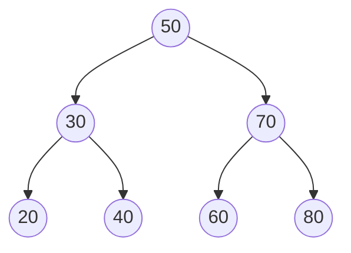
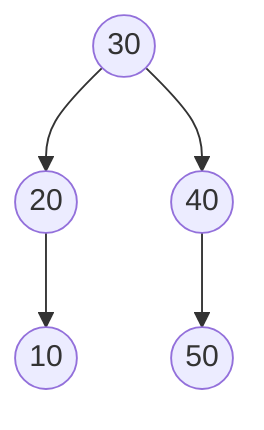
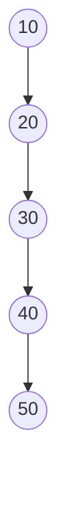

## 왜 "정렬된 트리"가 필요한가

06편에서 정렬된 배열은 이진 탐색(binary search)으로 $O(\log n)$에 값을 찾을 수 있다는 것을 다뤘다. 그런데 정렬된 배열은 중간에 값을 삽입·삭제하려면 뒤 원소를 통째로 밀어야 해서 $O(n)$이 걸린다.

## BST의 정의 — 정렬 성질

이진탐색트리는 다음 성질을 모든 노드에서 만족하는 이진트리다.

- 어떤 노드를 기준으로, **왼쪽 서브트리에 속한 모든 값은 그 노드의 값보다 작다.**
- 어떤 노드를 기준으로, **오른쪽 서브트리에 속한 모든 값은 그 노드의 값보다 크다.**
- 왼쪽 서브트리와 오른쪽 서브트리도 각각 재귀적으로 이 규칙을 만족하는 BST여야 한다.

이 규칙이 "노드 하나만" 만족하면 안 되고 **서브트리 전체**가 만족해야 한다는 점이 함정이다. 예를 들어 루트가 50이고 오른쪽 자식이 70이라고 해서, 70의 왼쪽 서브트리에 있는 어떤 값이든 50보다만 크면 된다고 착각하면 안 된다.

13편에서 다룬 중위 순회(왼쪽–루트–오른쪽)를 BST에 적용하면, "더 작은 값(왼쪽) → 지금 값(루트) → 더 큰 값(오른쪽)" 순서로 방문하게 되므로 **결과가 항상 오름차순으로 정렬되어 나온다.** 이것이 이진트리 일반이 아니라 BST만 가지는 성질이라는 점을 13편에서 예고했었다.

> **자주 틀리는 점:** "왼쪽 자식이 부모보다 작다"는 조건만 확인하고 "그 서브트리 전체가 조상들의 조건도 만족하는가"를 확인하지 않으면, BST가 아닌 트리를 BST로 착각하는 오답을 고르게 된다.

## BST 삽입 — 탐색하듯 내려가서 빈자리에 붙인다

새 값을 삽입할 때는 루트에서 시작해 "이 값이 현재 노드보다 작으면 왼쪽으로, 크면 오른쪽으로" 내려가다가, 더 내려갈 자리가 없으면(자식이 없는 방향이면) 그 자리에 새 노드를 붙인다.

```
삽입(루트, 새값):
  현재 = 루트
  반복:
    만약 새값 < 현재.값이면:
      현재.왼쪽이 없으면 → 그 자리에 새 노드를 붙이고 종료
      아니면 현재 = 현재.왼쪽으로 이동
    만약 새값 > 현재.값이면:
      현재.오른쪽이 없으면 → 그 자리에 새 노드를 붙이고 종료
      아니면 현재 = 현재.오른쪽으로 이동
```

빈 트리에서 시작해 `50, 30, 70, 20, 40, 60, 80`을 순서대로 삽입하는 과정을 추적해 본다.

| 삽입값 | 비교 경로 | 붙는 위치 |
|--------|-----------|-----------|
| 50 | 트리가 비어 있음 | 루트로 삽입 |
| 30 | 50과 비교: `30 < 50`이므로 왼쪽으로. 50의 왼쪽 자식 없음 | 50의 왼쪽 자식 |
| 70 | 50과 비교: `70 > 50`이므로 오른쪽으로. 50의 오른쪽 자식 없음 | 50의 오른쪽 자식 |
| 20 | 50과 비교(`20 < 50`, 왼쪽) → 30과 비교(`20 < 30`, 왼쪽) → 30의 왼쪽 자식 없음 | 30의 왼쪽 자식 |
| 40 | 50과 비교(`40 < 50`, 왼쪽) → 30과 비교(`40 > 30`, 오른쪽) → 30의 오른쪽 자식 없음 | 30의 오른쪽 자식 |
| 60 | 50과 비교(`60 > 50`, 오른쪽) → 70과 비교(`60 < 70`, 왼쪽) → 70의 왼쪽 자식 없음 | 70의 왼쪽 자식 |
| 80 | 50과 비교(`80 > 50`, 오른쪽) → 70과 비교(`80 > 70`, 오른쪽) → 70의 오른쪽 자식 없음 | 70의 오른쪽 자식 |

완성된 트리는 다음과 같다.


```mermaid
graph TD
    N50((50)) --> N30((30))
    N50 --> N70((70))
    N30 --> N20((20))
    N30 --> N40((40))
    N70 --> N60((60))
    N70 --> N80((80))
```

이 트리를 중위 순회하면 `20, 30, 40, 50, 60, 70, 80`으로 정확히 오름차순이 나온다. 앞서 말한 BST의 정렬 성질이 실제로 성립함을 확인할 수 있다.

## BST 탐색 — 세 갈래 중 하나로만 진행

탐색은 삽입과 같은 경로를 따라가되, 목표값과 같은 노드를 찾으면 성공, 더 내려갈 자리가 없는데 못 찾았으면 실패로 끝난다. 위 트리에서 `60`을 찾는 과정을 추적한다.

세 번 비교 만에 찾았다. 만약 배열에 정렬 없이 나열했다면 순차 탐색으로 최악의 경우 7번(원소 수만큼) 비교해야 했을 것이다. 이번에는 트리에 없는 `65`를 찾는 과정을 추적해 실패가 어떻게 확인되는지 본다.

## BST 삭제 — 세 가지 경우로 나뉜다

삭제는 BST 연산 중 가장 까다롭다. 지워야 할 노드가 자식을 몇 개 갖고 있는지에 따라 처리 방법이 완전히 달라지기 때문이다.

### 경우 1 — 삭제할 노드가 리프(자식이 없음)

가장 간단한 경우다. 그 노드를 가리키는 부모의 링크를 끊고 노드를 그냥 제거하면 된다. 위 트리에서 `20`(리프)을 삭제하면, 30의 왼쪽 자식 링크를 없애기만 하면 된다.

### 경우 2 — 삭제할 노드의 자식이 하나

삭제할 노드를 그 자식으로 대체한다. 예를 들어 위 트리에서 `70`을 지운다고 가정하되 이번에는 70에게 자식이 `80` 하나만 있는 상황(60이 없는 상황)이라면, 50의 오른쪽 링크를 70 대신 80으로 바로 연결하면 된다.

### 경우 3 — 삭제할 노드의 자식이 둘

가장 까다로운 경우로, 자식이 둘인 노드를 그냥 지우면 그 자리에 두 서브트리를 모두 붙일 방법이 없다. 이 문제를 해결하는 표준 방법은 삭제할 노드의 값을 "그 노드 대신 넣어도 BST 성질이 깨지지 않는 값"으로 바꿔치기한 뒤, 그 값을 원래 갖고 있던 노드를 지우는 것이다. 그 값의 후보는 두 가지다.

- **중위 후계자**(inorder successor): 삭제할 노드보다 큰 값 중 가장 작은 값. 오른쪽 서브트리로 한 번 이동한 뒤, 그 서브트리에서 왼쪽 자식을 계속 따라가 더 이상 왼쪽이 없을 때 도달하는 노드다.
- **중위 선행자**(inorder predecessor): 삭제할 노드보다 작은 값 중 가장 큰 값. 왼쪽 서브트리로 한 번 이동한 뒤, 오른쪽 자식을 계속 따라가 도달하는 노드다.

둘 중 무엇을 써도 BST 성질은 유지된다. 관례적으로 중위 후계자를 많이 쓴다. 위에서 만든 트리에서 `50`(루트, 자식이 둘)을 삭제하는 과정을 중위 후계자 방식으로 추적한다.

**왜 중위 후계자를 넣어도 BST 성질이 깨지지 않는가**: 중위 후계자는 정의상 "삭제할 노드보다 큰 값 중 가장 작은 값"이다. 그래서 그 자리에 넣어도 왼쪽은 여전히 다 작고 오른쪽은 여전히 다 크다는 규칙이 유지된다.

> **자주 틀리는 점:** 자식이 둘인 노드를 삭제할 때 후계자(또는 선행자)를 찾지 않고 아무 자식이나 끌어올리면 BST 성질이 깨진다. 반드시 "삭제할 값의 바로 다음 순서(또는 바로 이전 순서)"에 해당하는 값을 찾아야 한다.

## BST의 성능은 트리 모양에 달려 있다 — 편향 트리 문제

BST의 탐색·삽입·삭제는 모두 "루트에서 리프까지 한 경로를 따라 내려가는" 방식이므로, 시간 복잡도는 **트리의 높이 $h$**에 비례해 $O(h)$다. 문제는 이 높이가 어떤 값을 어떤 순서로 넣었는지에 따라 크게 달라진다는 점이다.

같은 값 `{10, 20, 30, 40, 50}`을 서로 다른 순서로 삽입한 두 경우를 비교해 보자.

**균형 잡힌 경우**(예: 30, 20, 40, 10, 50 순서로 삽입)


```mermaid
graph TD
    B30((30)) --> B20((20))
    B30 --> B40((40))
    B20 --> B10((10))
    B40 --> B50((50))
```

이 트리의 높이는 2다(루트를 0으로 셀 때). 노드가 5개인데 높이는 $\log_2 5 \approx 2.3$에 가까운 값이 나와, 값을 하나 찾는 데 최악의 경우 비교 3번이면 충분하다.

**편향된 경우**(오름차순 10, 20, 30, 40, 50 순서로 삽입)


```mermaid
graph TD
    S10((10)) --> S20((20))
    S20 --> S30((30))
    S30 --> S40((40))
    S40 --> S50((50))
```

이 트리는 모든 노드가 오른쪽 자식만 갖는 모양이 되어, 사실상 연결리스트와 똑같아진다. 이런 트리를 **편향 트리**(skewed tree)라고 부른다. 높이가 4(노드 수 $n$에 대해 $n-1$)이므로, `50`을 찾으려면 최악의 경우 5번(모든 노드)을 다 비교해야 한다.

| 트리 모양 | 높이 $h$ | 탐색 최악 복잡도 |
|-----------|----------|------------------|
| 균형 잡힌 BST | $\log_2 n$에 가까움 | $O(\log n)$ |
| 완전히 편향된 BST | $n - 1$ | $O(n)$ |

즉 **BST는 "정렬된 순서로 값을 계속 넣으면" 최악의 경우 배열 순차 탐색과 똑같이 느려질 수 있다.** 이 문제를 근본적으로 해결하려면 삽입·삭제 때마다 트리 높이를 스스로 재조정하는 균형 이진탐색트리(AVL 트리, 레드-블랙 트리 등)가 필요하지만, 이는 독학사 2단계 자료구조 출제기준의 범위를 넘어서므로 이 편에서는 "왜 편향이 문제인지"와 "삽입 순서가 트리 모양에 영향을 준다"는 사실까지만 확실히 잡아 둔다.

## 자주 틀리는 점

- **BST 조건을 "부모–자식"만 확인하고 "조상 전체"를 확인하지 않는 실수**: 왼쪽 서브트리의 모든 값이 루트보다 작아야 한다는 조건은 직계 자식뿐 아니라 그 서브트리 전체에 적용된다.
- **삭제할 노드의 자식 수를 잘못 세는 실수**: 삭제 전에 반드시 그 노드의 자식이 0개(리프), 1개, 2개 중 어디에 해당하는지 먼저 확인해야 처리 방법을 올바르게 고를 수 있다.
- **후계자와 선행자를 혼동하는 실수**: 중위 후계자는 "오른쪽으로 한 번, 그다음 왼쪽 끝까지"이고, 중위 선행자는 "왼쪽으로 한 번, 그다음 오른쪽 끝까지"다. 방향이 반대다.
- **BST의 모든 연산이 항상 $O(\log n)$이라고 단정하는 실수**: 이는 트리가 균형 잡혀 있을 때의 이야기다. 편향 트리에서는 $O(n)$까지 나빠질 수 있다.

## 핵심 정리

- BST는 모든 노드에서 "왼쪽 서브트리 전체는 자신보다 작고, 오른쪽 서브트리 전체는 자신보다 크다"는 조건을 만족하는 이진트리이며, 이 성질 덕분에 중위 순회 결과가 항상 오름차순으로 나온다.
- 삽입·탐색은 루트에서 시작해 목표값과 비교하며 왼쪽 또는 오른쪽으로 내려가는 방식으로 동작한다.
- 삭제는 자식 수(0, 1, 2개)에 따라 처리 방법이 다르며, 자식이 둘인 경우는 중위 후계자(또는 선행자)로 값을 바꿔치기한 뒤 그 후계자 노드를 다시 삭제하는 방식으로 처리한다.
- BST의 시간 복잡도는 트리 높이 $h$에 비례한 $O(h)$이며, 균형 잡힌 트리는 $O(\log n)$, 완전히 편향된 트리는 $O(n)$까지 나빠질 수 있다.

## 마무리 복습

<Quiz
  questionNumber={1}
  question={"이진탐색트리(BST)의 정의로 가장 정확한 것은?"}
  options={["모든 노드의 왼쪽 자식이 그 노드보다 작기만 하면 BST다","모든 노드에서 왼쪽 서브트리 전체의 값이 그 노드보다 작고 오른쪽 서브트리 전체의 값이 그 노드보다 커야 한다","완전이진트리 모양이면 자동으로 BST가 된다","노드의 값이 삽입된 순서대로 왼쪽에서 오른쪽으로 나열되면 BST다"]}
  correctAnswer={2}
  explanation={"BST는 직계 자식뿐 아니라 왼쪽 서브트리 전체, 오른쪽 서브트리 전체가 각각 해당 노드보다 작거나 큰 값이어야 하는 재귀적 조건을 만족해야 한다."}
/>

<Quiz
  questionNumber={2}
  question={"빈 BST에 10, 5, 15, 3, 7 순서로 삽입했을 때, 7이 삽입되는 위치는?"}
  options={["10의 왼쪽 자식","5의 오른쪽 자식","15의 왼쪽 자식","3의 오른쪽 자식"]}
  correctAnswer={2}
  explanation={"7을 삽입할 때 루트 10과 비교하면 7이 10보다 작으므로 왼쪽(5)으로 이동하고, 5와 비교하면 7이 5보다 크므로 오른쪽으로 이동한다. 5의 오른쪽 자식이 비어 있으므로 그 자리에 7이 붙는다."}
/>

<Quiz
  questionNumber={3}
  question={"자식이 둘인 BST 노드를 삭제할 때의 표준적인 처리 방법으로 옳은 것은?"}
  options={["그 노드를 단순히 제거하고 두 자식 중 아무 쪽이나 부모에 직접 연결한다","중위 후계자(또는 선행자)를 찾아 그 값으로 바꿔치기한 뒤, 후계자가 있던 자리의 노드를 다시 삭제한다","자식이 둘인 노드는 BST에서 삭제할 수 없다","왼쪽 서브트리와 오른쪽 서브트리를 통째로 맞바꾼다"]}
  correctAnswer={2}
  explanation={"자식이 둘인 노드는 그 값을 삭제할 노드보다 크면서 가장 작은 값(중위 후계자)이나 작으면서 가장 큰 값(중위 선행자)으로 바꿔치기해야 BST 성질이 유지된다. 그 후 원래 후계자(또는 선행자) 노드는 자식이 0개나 1개이므로 더 간단한 경우로 처리해 삭제한다."}
/>

## 참고 자료

- [MDN JavaScript reference](https://developer.mozilla.org/en-US/docs/Web/JavaScript) — 트리 구조와 재귀 탐색을 이해하는 데 도움이 되는 참고 자료.
- [국가평생교육진흥원 과목별 평가영역](https://bdes.nile.or.kr/nile/study/nStudy2_1.do) — 이진탐색트리 관련 출제 범위 확인용 공식 안내.
