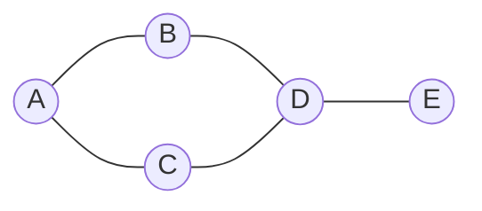

<Callout type="info">
  **이번 문서의 목표:** 이 문서를 다 읽으면 그래프를 인접행렬과 인접리스트로 각각 표현할 수 있고, 같은 그래프에서 DFS와 BFS가 왜 서로 다른 방문 순서를 만드는지 스택·큐의 동작으로 설명할 수 있으며, 두 표현 방식과 두 탐색 방식의 복잡도를 비교할 수 있다.
</Callout>

## 왜 그래프가 필요한가

지금까지 다룬 트리(12~14편)는 노드 사이의 관계가 "부모 하나, 자식 여러 개"로 제한된 특수한 구조였다. 그런데 현실의 관계는 이렇게 계층적으로만 이루어지지 않는다. 사람과 사람의 친구 관계, 도시와 도시를 잇는 도로, 웹페이지 사이의 링크는 모두 "누가 누구와 연결되어 있는가"만 있을 뿐 위아래 계층이 없다. **그래프**(graph)는 이렇게 임의의 두 대상 사이에 관계(연결)가 있을 수 있는 상황을 표현하는 자료구조다. 트리는 사실 그래프의 특수한 경우(사이클이 없고 루트에서 모든 노드로 가는 경로가 유일한 그래프)라고 볼 수 있다.

> **쉽게 말하면:** 그래프는 트리보다 더 자유로운 구조로, 어떤 노드든 다른 어떤 노드와도 연결될 수 있고 계층이나 방향의 제약이 없다.

## 그래프의 기본 용어

그래프는 **정점**(vertex, 노드라고도 부른다)의 집합과 정점 사이를 잇는 **간선**(edge)의 집합으로 이루어진다. 그래프를 다룰 때 자주 나오는 용어를 정리한다.

- **무방향 그래프**(undirected graph): 간선에 방향이 없어, A와 B를 잇는 간선이 있으면 A에서 B로도, B에서 A로도 갈 수 있다고 본다(도로처럼 양방향 통행).
- **방향 그래프**(directed graph, digraph): 간선에 방향이 있어, A에서 B로 가는 간선이 있어도 B에서 A로 가는 간선은 따로 없을 수 있다(일방통행 도로, 팔로우 관계처럼).
- **가중치 그래프**(weighted graph): 각 간선에 비용·거리 같은 숫자(가중치, weight)가 붙어 있는 그래프. 가중치가 없으면 모든 간선을 "연결되어 있다/없다"로만 본다.
- **인접**(adjacent): 두 정점 사이에 간선이 직접 있으면 두 정점이 인접하다고 한다.
- **경로**(path): 간선을 따라 한 정점에서 다른 정점까지 이어지는 정점들의 나열.
- **차수**(degree): 한 정점에 연결된 간선의 개수. 방향 그래프에서는 나가는 간선 수(진출차수, out-degree)와 들어오는 간선 수(진입차수, in-degree)를 구분한다.

이 편에서는 가장 기본이 되는 **가중치 없는 무방향 그래프**를 기준으로 표현과 탐색을 다루고, 필요한 곳에서 방향 그래프의 차이를 짚는다.

## 그래프를 컴퓨터에 표현하는 두 가지 방법

아래 그래프를 예시로 두 가지 표현 방법을 비교한다. 정점은 A, B, C, D, E 다섯 개이고, 간선은 A–B, A–C, B–D, C–D, D–E 다섯 개다.



### 인접행렬 — 정점 x 정점 표

**인접행렬**(adjacency matrix)은 정점이 $n$개일 때 $n \times n$ 크기의 표를 만들어, 행 $i$와 열 $j$가 만나는 칸에 "정점 $i$와 정점 $j$ 사이에 간선이 있으면 1(또는 참), 없으면 0(또는 거짓)"을 적는 방식이다.

|   | A | B | C | D | E |
|---|---|---|---|---|---|
| A | 0 | 1 | 1 | 0 | 0 |
| B | 1 | 0 | 0 | 1 | 0 |
| C | 1 | 0 | 0 | 1 | 0 |
| D | 0 | 1 | 1 | 0 | 1 |
| E | 0 | 0 | 0 | 1 | 0 |

무방향 그래프의 인접행렬은 대각선을 기준으로 좌우가 대칭이다(A행 B열이 1이면 B행 A열도 반드시 1). 이 표에서 "A와 D가 인접한가?"를 확인하려면 A행 D열(또는 D행 A열)만 한 번 보면 되므로 $O(1)$이다. 반면 "A와 인접한 정점을 모두 찾으라"고 하면 A행 전체(길이 $n$)를 다 훑어야 하므로 $O(n)$이 걸린다.

### 인접리스트 — 정점마다 이웃 목록

**인접리스트**(adjacency list)는 정점마다 "이 정점과 직접 연결된 이웃들의 목록"을 연결리스트나 배열로 저장하는 방식이다.

| 정점 | 인접한 정점 목록 |
|------|-------------------|
| A | B, C |
| B | A, D |
| C | A, D |
| D | B, C, E |
| E | D |

"A와 인접한 정점을 모두 찾으라"고 하면 A의 목록(B, C)만 바로 읽으면 되므로, A의 차수가 $d$일 때 $O(d)$면 충분하다. 반면 "A와 D가 인접한가?"를 확인하려면 A의 목록을 처음부터 끝까지 뒤져야 할 수 있어 최악의 경우 $O(d)$가 걸린다(인접행렬의 $O(1)$보다 느릴 수 있다).

### 두 표현의 복잡도·공간 비교

정점 수를 $V$, 간선 수를 $E$라 할 때 두 표현을 비교하면 다음과 같다.

| 비교 항목 | 인접행렬 | 인접리스트 |
|-----------|----------|------------|
| 저장 공간 | $O(V^2)$ (정점 수의 제곱, 간선이 적어도 고정) | $O(V + E)$ (실제 존재하는 간선 수에 비례) |
| 두 정점의 인접 여부 확인 | $O(1)$ | 최악 $O(V)$ (그 정점의 이웃 수만큼) |
| 한 정점의 모든 이웃 찾기 | $O(V)$ (행 전체를 훑음) | $O(d)$ (그 정점의 차수만큼만) |
| 적합한 상황 | 정점 수가 적고 간선이 많은(조밀한, dense) 그래프 | 정점 수가 많고 간선이 상대적으로 적은(성긴, sparse) 그래프 |

> **자주 틀리는 점:** "인접리스트가 항상 인접행렬보다 좋다"고 단정하면 안 된다. 간선이 아주 많아서 거의 모든 정점 쌍이 연결된 조밀한 그래프라면 인접행렬의 $O(1)$ 인접 확인이 유리할 수 있고, 정점 수 자체가 매우 클 때는 $O(V^2)$ 공간이 감당하기 어려워 인접리스트가 유리하다. 항상 "이 그래프가 조밀한가 성긴가"를 먼저 따져야 한다.

## 깊이 우선 탐색(DFS) — 갈 수 있는 만큼 깊이 들어간다

**깊이 우선 탐색**(Depth-First Search, DFS)은 한 정점에서 시작해 방문하지 않은 이웃 하나를 골라 그 방향으로 최대한 깊이 들어가고, 더 갈 곳이 없으면 되돌아와서(백트래킹, backtracking) 다른 방향을 시도하는 탐색 방법이다. 13편의 전위 순회가 재귀로 "일단 한쪽 자식으로 끝까지 내려가는" 것과 원리가 같다. DFS는 재귀 호출로 구현하거나, 명시적인 **스택**(stack, 09편)을 이용해 반복문으로 구현한다.

```
DFS(시작정점):
  방문표시(시작정점)을 참으로 바꾸고 시작정점을 방문한다
  시작정점의 이웃을 순서대로 하나씩 확인한다:
    그 이웃이 아직 방문되지 않았다면:
      그 이웃에 대해 DFS를 재귀 호출한다
```

위 그래프에서 A를 시작으로, 인접리스트 표에 적힌 순서(알파벳 순)대로 이웃을 확인하며 DFS를 추적한다.

| 단계 | 현재 호출 | 동작 | 방문 순서 |
|------|-----------|------|-----------|
| 1 | DFS(A) | A 방문 | A |
| 2 | DFS(B) | A의 이웃 중 B가 미방문 → B로 재귀 | A, B |
| 3 | DFS(D) | B의 이웃 A(방문됨)·D(미방문) → D로 재귀 | A, B, D |
| 4 | DFS(C) | D의 이웃 B(방문됨)·C(미방문)·E → C를 먼저 확인해 C로 재귀 | A, B, D, C |
| 5 | C에서 되돌아감 | C의 이웃 A(방문됨)·D(방문됨) → 더 갈 곳 없어 되돌아감 | A, B, D, C |
| 6 | DFS(E) | D로 돌아와 남은 이웃 E(미방문) → E로 재귀 | A, B, D, C, E |
| 7 | 전체 종료 | E의 이웃 D(방문됨)뿐 → 모든 정점 방문 완료 | A, B, D, C, E |

**DFS 방문 순서: A, B, D, C, E**

## 너비 우선 탐색(BFS) — 가까운 곳부터 순서대로

**너비 우선 탐색**(Breadth-First Search, BFS)은 시작 정점에서 거리(간선 수)가 가까운 정점부터 순서대로 방문하는 방법이다. 13편의 레벨 순회와 원리가 같으며, 실제로 **큐**(queue)를 이용해 구현한다.

```
BFS(시작정점):
  큐를 만들고 시작정점을 큐에 넣는다. 방문표시(시작정점)을 참으로 바꾼다
  큐가 빌 때까지 반복한다:
    1. 큐에서 정점 하나를 꺼낸다(dequeue)
    2. 꺼낸 정점을 방문한다
    3. 그 정점의 이웃을 순서대로 확인해, 아직 방문하지 않은 이웃이면
       방문표시를 참으로 바꾸고 큐에 넣는다(enqueue)
```

같은 그래프, 같은 시작 정점 A로 BFS를 추적하면 큐 상태가 다음과 같이 바뀐다.

| 단계 | 큐 상태(왼쪽이 앞) | 동작 | 방문 순서 |
|------|-------------------|------|-----------|
| 1 | [A] | A를 큐에 넣고 방문 표시 | (없음) |
| 2 | [] | A를 꺼내 방문. 이웃 B, C를 방문 표시하고 큐에 넣음 | A |
| 3 | [B, C] | B를 꺼내 방문. 이웃 A(방문됨)·D(미방문) → D를 큐에 넣음 | A, B |
| 4 | [C, D] | C를 꺼내 방문. 이웃 A(방문됨)·D(이미 큐에 있음, 방문 표시됨) → 추가 없음 | A, B, C |
| 5 | [D] | D를 꺼내 방문. 이웃 B(방문됨)·C(방문됨)·E(미방문) → E를 큐에 넣음 | A, B, C, D |
| 6 | [E] | E를 꺼내 방문. 이웃 D(방문됨)뿐 | A, B, C, D, E |
| 7 | [] | 큐가 비어 종료 | A, B, C, D, E |

**BFS 방문 순서: A, B, C, D, E**

두 결과를 나란히 놓으면 같은 그래프, 같은 시작점인데도 순서가 다르다는 것이 분명히 보인다.

| 탐색 | 사용 자료구조 | 이 그래프의 방문 순서 |
|------|---------------|------------------------|
| DFS | 스택(또는 재귀 호출 스택) | A, B, D, C, E |
| BFS | 큐 | A, B, C, D, E |

> **자주 틀리는 점:** DFS와 BFS 중 어느 쪽을 쓰든 "모든 정점을 방문한다"는 결과는 같을 수 있지만(연결된 그래프라면), **방문 순서는 다르다.** "최단 경로(간선 수 기준)를 찾고 싶다"는 목적에는 가까운 정점부터 순서대로 확인하는 BFS가 적합하고, DFS는 그 경로가 최단이라는 보장을 해 주지 않는다.

## 방문 표시가 왜 반드시 필요한가

DFS와 BFS 모두 "이미 방문한 정점인지"를 확인하는 절차가 코드 어디에나 들어 있다는 점을 눈여겨봐야 한다. 트리와 달리 그래프는 **사이클**(cycle, 한 정점에서 출발해 간선을 따라가다 다시 자기 자신으로 돌아오는 경로)이 있을 수 있다. 예를 들어 위 그래프에서 A → B → D → C → A로 되돌아오는 사이클이 존재한다. 방문 표시 없이 탐색하면 A에서 시작해 B, D, C를 거쳐 다시 A로 돌아왔을 때 "A를 또 방문해야 하나"를 판단할 수 없어 무한히 순환하게 된다. 방문 표시(방문 여부를 저장하는 배열이나 집합)는 이 무한 순환을 막는 필수 장치다.

> **쉽게 말하면:** 트리는 원래 사이클이 없어서 순회가 끝나는 것이 보장되지만, 그래프는 사이클이 있을 수 있어서 "이미 가 본 곳"을 기록해 두지 않으면 탐색이 영영 끝나지 않을 수 있다.

## DFS·BFS의 시간 복잡도

DFS와 BFS는 모두 **모든 정점을 한 번씩 방문하고, 모든 간선을 (양방향이면 최대 두 번) 확인한다.** 인접리스트로 표현했을 때 두 탐색의 시간 복잡도는 $O(V + E)$다($V$는 정점 수, $E$는 간선 수). 인접행렬로 표현하면 한 정점의 이웃을 찾을 때마다 그 정점의 행 전체($O(V)$)를 훑어야 하므로, 전체 시간 복잡도가 $O(V^2)$로 늘어난다.

$$
\text{인접리스트 기반: } O(V + E)
$$

$$
\text{인접행렬 기반: } O(V^2)
$$

간선이 적은 성긴 그래프($E$가 $V^2$보다 훨씬 작을 때)에서는 이 차이가 크다. 예를 들어 정점 1,000개에 간선이 2,000개뿐인 그래프라면, 인접리스트 기반 탐색은 대략 3,000번의 작업이면 끝나지만 인접행렬 기반은 100만 번에 가까운 작업이 필요할 수 있다.

## 기본 응용 — 연결 여부 확인과 사이클 탐지

- **연결 여부 확인(connectivity check)**: 어떤 정점에서 DFS나 BFS를 한 번 실행했을 때 모든 정점이 방문되면, 그 그래프는 하나로 연결되어 있는 그래프다. 방문되지 않은 정점이 남아 있다면 그래프가 여러 개의 조각(연결 요소, connected component)으로 나뉘어 있다는 뜻이다.
- **사이클 탐지(cycle detection)**: 무방향 그래프를 DFS로 탐색하다가, "지금 확인하는 이웃이 이미 방문되어 있고 동시에 내가 방금 온 부모 정점이 아니라면" 사이클이 존재한다고 판단할 수 있다. 예를 들어 위 그래프에서 D를 방문할 때 이웃 B는 이미 방문되어 있지만 B는 D의 부모(D를 방문하게 만든 정점)이므로 사이클로 세지 않는다. 반면 D의 이웃 C를 확인할 때 C가 이미 방문되어 있고 C가 D의 부모가 아니라면, A–B–D–C–A로 이어지는 사이클이 있다고 판단한다.

## 자주 틀리는 점

- **인접행렬과 인접리스트의 저장 공간을 반대로 외우는 실수**: 인접행렬은 정점 수의 제곱 $O(V^2)$, 인접리스트는 정점 수와 간선 수의 합 $O(V+E)$다. 간선이 적을수록 인접리스트가 공간을 훨씬 아낀다.
- **DFS는 스택, BFS는 큐라는 대응을 거꾸로 외우는 실수**: "깊이"부터 들어가려면 방금 발견한 것을 먼저 처리해야 하므로 후입선출(LIFO)인 스택이 맞고, "너비"를 순서대로 넓히려면 먼저 발견한 것을 먼저 처리해야 하므로 선입선출(FIFO)인 큐가 맞다.
- **방문 표시를 생략해도 된다고 착각하는 실수**: 사이클이 있는 그래프에서 방문 표시 없이 탐색하면 무한 루프에 빠질 수 있다.
- **DFS로 찾은 경로가 항상 최단 경로라고 착각하는 실수**: 가중치가 없는 그래프에서 최단 경로(간선 수 기준)를 보장하는 것은 BFS다. DFS는 어쩌다 최단 경로를 찾을 수는 있지만 그것을 보장하지 않는다.

## 핵심 정리

- 그래프는 정점과 간선으로 이루어지며, 트리와 달리 계층·방향의 제약 없이 임의의 정점 쌍이 연결될 수 있고 사이클이 존재할 수 있다.
- 인접행렬은 인접 여부를 $O(1)$에 확인할 수 있지만 $O(V^2)$ 공간이 필요하고, 인접리스트는 $O(V+E)$ 공간만 쓰지만 인접 여부 확인에 이웃 수만큼 시간이 걸릴 수 있다.
- DFS는 스택(또는 재귀)으로 한 방향을 끝까지 파고든 뒤 되돌아가며 탐색하고, BFS는 큐로 가까운 정점부터 순서대로 탐색한다. 같은 그래프에서도 두 탐색의 방문 순서는 서로 다르다.
- 방문 표시는 사이클로 인한 무한 루프를 막는 필수 장치이며, DFS·BFS 모두 인접리스트 기준 $O(V+E)$, 인접행렬 기준 $O(V^2)$의 시간 복잡도를 가진다.

## 마무리 복습

<Quiz
  questionNumber={1}
  question="인접행렬과 인접리스트를 비교한 설명으로 옳지 않은 것은?"
  options={['인접행렬은 두 정점의 인접 여부를 O(1)에 확인할 수 있다', '인접리스트는 정점 수와 간선 수의 합에 비례하는 공간을 사용한다', '인접행렬은 항상 인접리스트보다 적은 공간을 사용한다', '정점 수가 많고 간선이 상대적으로 적은 그래프에는 인접리스트가 유리하다']}
  correctAnswer={3}
  explanation="인접행렬은 간선 수와 무관하게 정점 수의 제곱(O(V^2))에 비례하는 공간을 항상 사용하므로, 간선이 적은 성긴 그래프에서는 오히려 인접리스트보다 훨씬 많은 공간을 낭비한다."
  optionExplanations={['옳은 설명이다. 행렬의 해당 칸만 확인하면 되므로 O(1)이다.', '옳은 설명이다. 인접리스트의 공간은 O(V+E)다.', '정답(옳지 않은 설명). 간선이 적은 그래프에서는 인접행렬이 인접리스트보다 훨씬 많은 공간을 쓴다.', '옳은 설명이다. 성긴 그래프에서는 O(V+E) 공간만 쓰는 인접리스트가 유리하다.']}
/>

<Quiz
  questionNumber={2}
  question="깊이 우선 탐색(DFS)을 구현할 때 일반적으로 사용하는 자료구조와 그 근거로 가장 적절한 것은?"
  options={['큐. 먼저 발견한 정점을 먼저 방문해야 깊이 들어갈 수 있기 때문이다', '스택(또는 재귀 호출 스택). 가장 최근에 발견한 정점부터 먼저 파고들어야 하기 때문이다', '배열. 정점 번호 순서대로만 방문하면 되기 때문이다', '해시테이블. 방문 여부를 빠르게 확인하기 위해서만 사용하고 순서와는 무관하다']}
  correctAnswer={2}
  explanation="DFS는 방금 발견한 정점 방향으로 최대한 깊이 들어간 뒤 되돌아오는 방식이므로, 가장 최근에 넣은 것을 먼저 꺼내는 후입선출(LIFO) 성질의 스택(또는 재귀 호출 스택)이 자연스럽게 맞는다."
  optionExplanations={['먼저 발견한 것을 먼저 처리하는 것은 BFS(큐)의 방식이다.', '정답. LIFO 성질이 깊이 우선 탐색의 동작과 일치한다.', '정점 번호 순서가 아니라 인접 관계와 방문 순서에 따라 탐색 경로가 정해진다.', '해시테이블은 방문 표시 확인에는 쓸 수 있지만 탐색 순서 자체를 결정하는 자료구조는 아니다.']}
/>

<Quiz
  questionNumber={3}
  question="정점 A, B, C가 있고 간선이 A-B, B-C, A-C로 삼각형을 이루는 무방향 그래프에서, A를 시작으로 이웃을 알파벳 순서로 확인하며 BFS를 수행할 때 방문 순서는?"
  options={['A, B, C', 'A, C, B', 'B, A, C', 'C, B, A']}
  correctAnswer={1}
  explanation="A를 방문한 뒤 이웃 B, C를 알파벳 순서로 큐에 넣으므로 큐는 [B, C]가 된다. 이후 B를 꺼내 방문하고(이웃 A는 방문됨, C는 이미 큐에 있음), C를 꺼내 방문하면 방문 순서는 A, B, C가 된다."
  optionExplanations={['정답. A를 방문한 뒤 큐에 넣은 순서(B, C) 그대로 꺼내 방문한다.', 'B보다 C를 먼저 방문하려면 이웃을 확인하는 순서가 C, B여야 하는데 문제에서는 알파벳 순서(B가 먼저)로 확인한다고 했다.', 'A는 시작 정점이므로 반드시 가장 먼저 방문된다.', 'BFS는 가까운 정점부터 방문하므로 시작 정점 A가 가장 나중에 방문될 수 없다.']}
/>

<Quiz
  questionNumber={4}
  question="그래프 탐색에서 방문 표시(visited)를 하지 않고 DFS나 BFS를 수행했을 때 벌어질 수 있는 문제로 가장 적절한 것은?"
  options={['탐색 속도가 약간 느려질 뿐 결과에는 문제가 없다', '트리와 달리 그래프에는 사이클이 있을 수 있어 같은 정점을 반복 방문하며 무한 루프에 빠질 수 있다', '인접행렬로 표현한 그래프에서만 발생하는 문제다', '방향 그래프에서만 발생하고 무방향 그래프에서는 발생하지 않는다']}
  correctAnswer={2}
  explanation="그래프는 사이클을 가질 수 있으므로, 이미 방문한 정점을 표시해 두지 않으면 사이클을 따라 같은 정점들을 계속 재방문하며 탐색이 끝나지 않을 수 있다."
  optionExplanations={['속도 문제가 아니라 탐색이 아예 끝나지 않는 무한 루프에 빠질 수 있는 심각한 문제다.', '정답. 사이클로 인한 무한 재방문이 핵심 문제다.', '표현 방식(인접행렬/인접리스트)과 무관하게 사이클이 있으면 발생할 수 있는 문제다.', '무방향 그래프에도 사이클이 존재할 수 있으므로 두 경우 모두 발생할 수 있다.']}
/>

<Quiz
  questionNumber={5}
  question="정점 수 V, 간선 수 E인 그래프를 인접리스트로 표현했을 때 DFS와 BFS의 시간 복잡도로 옳은 것은?"
  options={['O(V^2), 항상 인접행렬보다 느리다', 'O(V + E)', 'O(E^2)', 'O(V log V), 정렬이 필요하기 때문이다']}
  correctAnswer={2}
  explanation="인접리스트 기반 DFS·BFS는 모든 정점을 한 번씩 방문하고 모든 간선을 최대 두 번(무방향 기준) 확인하므로 O(V + E)다."
  optionExplanations={['O(V^2)은 인접행렬 기반 탐색의 복잡도이며, 성긴 그래프에서는 인접리스트가 더 빠르다.', '정답. 정점과 간선의 합에 비례하는 O(V+E)가 인접리스트 기반 탐색의 복잡도다.', 'E^2에 비례하지 않으며, 이는 실제 탐색 동작과 맞지 않는다.', 'DFS·BFS는 정렬을 수행하지 않으므로 O(V log V)와는 관련이 없다.']}
/>

<Quiz
  questionNumber={6}
  question="어떤 무방향 그래프에서 정점 A를 시작으로 DFS를 실행했더니 그래프의 정점 7개 중 5개만 방문되고 탐색이 끝났다. 이 결과에 대한 해석으로 가장 타당한 것은?"
  options={['DFS 구현에 오류가 있는 것이 확실하다', '이 그래프는 하나로 연결되어 있지 않고 여러 개의 연결 요소로 나뉘어 있을 가능성이 높다', 'A에서 시작했기 때문에 항상 모든 정점을 방문하지 못하는 것이 정상이다', '무방향 그래프는 원래 모든 정점을 방문할 수 없다']}
  correctAnswer={2}
  explanation="어떤 정점에서 DFS(또는 BFS)를 실행했을 때 도달하지 못하는 정점이 있다면, 그 정점은 시작 정점과 간선으로 이어진 경로가 없다는 뜻이다. 즉 그래프가 하나로 연결되어 있지 않고 여러 연결 요소로 나뉘어 있을 가능성이 높다."
  optionExplanations={['구현 오류일 수도 있지만, 그래프가 원래 여러 연결 요소로 나뉘어 있는 정상적인 상황일 가능성이 먼저 검토되어야 한다.', '정답. 연결되지 않은 그래프의 특징적인 결과다.', '그래프가 하나로 연결되어 있다면 어느 정점에서 시작해도 모든 정점을 방문할 수 있다.', '연결된 무방향 그래프라면 DFS나 BFS로 모든 정점을 방문할 수 있다.']}
/>

## 참고 자료

- [MDN JavaScript reference](https://developer.mozilla.org/en-US/docs/Web/JavaScript) — 그래프를 배열·객체로 표현할 때 참고할 수 있는 기본 자료.
- [국가평생교육진흥원 과목별 평가영역](https://bdes.nile.or.kr/nile/study/nStudy2_1.do) — 그래프 표현과 탐색 관련 출제 범위 확인용 공식 안내.
