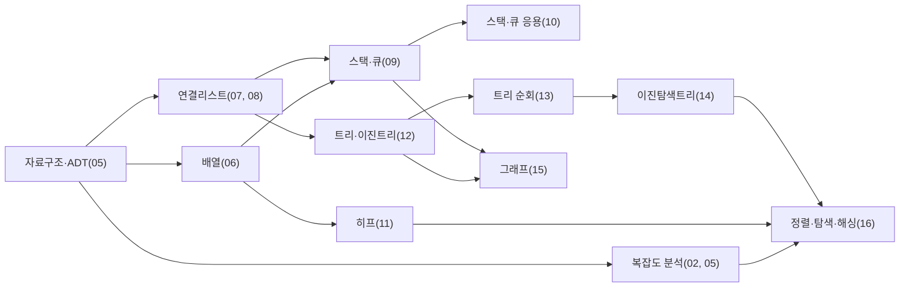

<Callout type="info">
  **이번 문서의 목표:** 지금까지 배운 05편부터 16편까지의 개념이 독학사 2단계 자료구조 출제기준의 어느 영역에 해당하는지 스스로 대응시키고, 순회·정렬·히프·해싱·복잡도 같은 계산·추적형 문제를 시험장에서 막힘없이 풀 수 있다.
</Callout>

<Callout type="warning">
  **재구성 고지:** 이 편의 문제는 국가평생교육진흥원이 공개한 특정 회차의 기출문제를 그대로 옮긴 것이 아니다. 국가평생교육진흥원 홈페이지에 공시된 전공분야별 평가영역과 출제방향(참고 자료 2, 4)을 근거로, 자료구조 과목에서 반복적으로 강조되는 개념과 문제 유형을 재구성해 만든 학습용 문제다. 실제 회차별 문항 수·배점·시험 시간은 매년 공고가 다르므로, 응시 전 국가평생교육진흥원 홈페이지에서 최신 공고를 반드시 확인해야 한다(공고 확인 필요).
</Callout>

## 출제기준과 편 대응표

독학사 2단계 자료구조는 국가평생교육진흥원이 정한 평가영역을 기준으로 출제된다. 평가영역 자체는 큰 범주(예: 선형 구조, 비선형 구조, 정렬과 탐색)로만 공시되므로, 그 범주 안에서 실제로 무엇을 공부해야 하는지는 표준 자료구조 교재의 목차와 대응시켜야 한다. 아래 표는 이 과목의 05편부터 16편까지를 그런 관점에서 재배열한 것이다.

| 평가영역(추정 범주) | 세부 개념 | 해당 편 |
|---|---|---|
| 자료구조의 기초와 분석 | 자료구조·ADT 정의, 시간·공간 복잡도, Big-O·Big-Theta | 01, 02, 05 |
| 선형 구조 | 배열, 단순·이중·원형 연결리스트 | 03, 04, 06, 07, 08 |
| 선형 구조의 응용 | 스택, 큐, 덱, 괄호 검사, 수식 변환 | 09, 10 |
| 비선형 구조 (트리) | 트리 용어, 이진트리, 순회, BST, 히프 | 11, 12, 13, 14 |
| 비선형 구조 (그래프) | 그래프 표현, DFS, BFS | 15 |
| 정렬·탐색·해싱 | 각종 정렬 알고리즘 비교, 순차·이진 탐색, 해싱 충돌 처리 | 16 |

이 표에서 눈여겨볼 점은 "선형 구조의 응용"과 "비선형 구조(트리)"에 편 수가 가장 많이 배정되어 있다는 것이다. 이는 우연이 아니라, 스택·큐의 실제 활용(수식 변환, 괄호 검사)과 트리의 순회·탐색 성질이 단순 암기가 아니라 **손으로 직접 연산 과정을 추적해야 풀리는 문제**로 자주 출제되기 때문이다.

## 빈출 개념과 시험에서 나타나는 형태

아래 다섯 가지는 자료구조 시험에서 매 회차 형태를 바꿔가며 반복 등장하는 핵심 축이다. 정확한 출제 빈도(퍼센트)는 회차마다 다르고 공식적으로 통계가 공개되지 않으므로 숫자로 단정하지 않으며, 대신 "어떤 형태의 문제로 변형되어 나오는가"를 정리한다.

| 핵심 개념 | 시험에서 흔히 묻는 형태 |
|---|---|
| 트리 순회(전위·중위·후위·레벨) | 트리 그림 또는 순회 결과 두 개를 주고 나머지 하나를 구하게 한다 |
| 정렬 알고리즘 비교 | 배열과 정렬 이름을 주고 특정 패스(pass) 후의 배열 상태를 추적하게 한다 |
| 스택·큐 응용 | 중위식을 후위식으로 바꾸거나, 후위식을 스택으로 계산하게 한다 |
| 히프(heap) | 배열을 히프로 만드는 과정, 또는 삽입·삭제 후 배열 상태를 묻는다 |
| 해싱 충돌 처리 | 키 목록과 해시함수를 주고 선형 조사법·체이닝 결과 슬롯을 추적하게 한다 |

공통적으로 "정의를 아는가"보다 "직접 계산해서 결과를 맞히는가"를 확인하려는 의도가 뚜렷하다. 그래서 이 편의 확인 문제도 대부분 값을 직접 대입해 추적하는 형태로 구성했다.

## 문항 유형별 접근법

독학사 자료구조 문항은 크게 네 가지 유형으로 나뉜다. 유형을 먼저 판별하면 풀이 전략을 바로 정할 수 있다.

| 유형 | 특징 | 풀이 전략 |
|---|---|---|
| 정의형 | 용어의 정확한 정의나 성질을 묻는다 | 비슷한 용어(깊이 vs 높이, 안정 정렬 vs 제자리 정렬)와 헷갈리지 않는지 먼저 확인한다 |
| 비교형 | 두 개 이상의 자료구조·알고리즘의 차이를 묻는다 | 표로 정리한 비교 기준(시간복잡도, 공간, 안정성)을 하나씩 대조한다 |
| 계산형 | 복잡도 유도, 주소 계산, 해시 슬롯 계산처럼 공식에 값을 대입해야 한다 | 공식을 먼저 적고 대입 순서를 절대 건너뛰지 않는다 |
| 추적형 | 정렬 패스, 트리 순회, 그래프 탐색처럼 알고리즘을 한 단계씩 손으로 진행해야 한다 | 표나 배열 상태를 단계별로 적으며 진행한다. 암산으로 건너뛰면 오답이 나온다 |

## 개념 맵으로 보는 편 사이의 연결

아래 개념 맵은 이 과목의 핵심 개념이 어떻게 서로 의존하는지를 보여준다. 화살표는 "이 개념을 알아야 다음 개념을 이해할 수 있다"는 방향이다.

이 그림에서 확인해야 할 것은, 정렬·탐색·해싱(16편)이 사실상 이 과목 전체의 종착점이라는 사실이다. 복잡도 분석 없이는 정렬 알고리즘의 효율을 비교할 수 없고, 히프를 모르면 히프 정렬을 이해할 수 없으며, BST의 탐색 성질을 모르면 이진 탐색과의 차이를 설명할 수 없다. 그래서 기출·모의 문제에서도 16편 관련 내용이 다른 개념과 함께 묶여 출제되는 경우가 많다.

## 기출 분석형 확인 문제

아래 문제들은 위에서 정리한 네 가지 유형(정의형·비교형·계산형·추적형)을 고르게 포함한다. 계산·추적형 문제는 explanation에 대입 과정을 전부 적어 두었으니, 답만 확인하지 말고 직접 손으로 같은 과정을 다시 밟아 보길 권한다.

<Quiz
  questionNumber={1}
  question="추상자료형(ADT, Abstract Data Type)에 대한 설명으로 가장 옳은 것은?"
  options={['데이터를 저장하는 물리적 메모리 구조 자체를 의미한다', '데이터와 그에 대한 연산을 구현 방법과 분리해 명세한 것이다', '특정 프로그래밍 언어에서만 정의할 수 있는 자료형이다', '배열과 연결리스트를 통칭하는 다른 이름이다']}
  correctAnswer={2}
  explanation="ADT는 무엇을 저장하고 어떤 연산을 지원하는지를 구현과 독립적으로 정의한 명세다. 예를 들어 스택 ADT는 push, pop, peek 연산과 후입선출 성질만 정의할 뿐, 배열로 구현하는지 연결리스트로 구현하는지는 명시하지 않는다."
  optionExplanations={['ADT는 논리적 명세이지 메모리 배치 방식이 아니다. 메모리 구조는 구현 단계에서 결정된다', '정답이다. 연산의 의미만 정의하고 내부 구현은 감춘다는 것이 ADT의 핵심이다', 'ADT는 개념적 명세이므로 어떤 언어로도 구현할 수 있다. 언어에 종속되지 않는다', '배열과 연결리스트는 ADT를 구현하는 구체적인 자료구조이지, ADT 자체와 동일시할 수 없다']}
/>

<Quiz
  questionNumber={2}
  question="입력 크기 n이 커질 때 성장 속도가 느린 것부터 빠른 것 순서로 옳게 나열한 것은?"
  options={['O(n^2), O(n log n), O(n), O(log n)', 'O(log n), O(n), O(n log n), O(n^2)', 'O(n), O(log n), O(n^2), O(n log n)', 'O(2^n), O(n^2), O(n log n), O(n)']}
  correctAnswer={2}
  explanation="복잡도의 성장 속도는 O(1)이 가장 느리고, O(log n), O(n), O(n log n), O(n^2), O(2^n) 순으로 빨라진다. 예를 들어 n이 1000일 때 log n은 약 10, n은 1000, n log n은 약 10000, n^2은 1000000으로 격차가 급격히 벌어진다. 두 번째 보기가 이 순서를 정확히 따른다."
  optionExplanations={['가장 빠르게 증가하는 것부터 나열해 순서가 거꾸로 되어 있다', '정답이다. 로그, 선형, 선형로그, 이차 순으로 정확히 느린 것에서 빠른 것 순이다', 'n과 log n의 순서가 뒤바뀌었다. n이 log n보다 항상 빠르게 증가한다', 'O(2^n)을 가장 느린 자리에 두어 지수 시간과 다항 시간의 관계를 반대로 서술했다']}
/>

<Quiz
  questionNumber={3}
  question="크기 n인 배열의 맨 앞에 새 원소를 삽입할 때 최악의 경우 시간복잡도가 O(n)이 되는 이유로 옳은 것은?"
  options={['배열은 포인터로 연결되어 있어 탐색에 시간이 걸리기 때문이다', '삽입 위치 뒤의 기존 원소들을 한 칸씩 뒤로 이동시켜야 하기 때문이다', '배열의 크기가 삽입할 때마다 매번 두 배로 늘어나기 때문이다', '배열은 항상 정렬 상태를 유지해야 하기 때문이다']}
  correctAnswer={2}
  explanation="배열은 연속된 메모리 공간에 원소를 저장하므로, 맨 앞에 새 원소를 넣으려면 기존 원소 n개를 전부 한 칸씩 뒤로 밀어야 빈자리가 생긴다. 이 이동 작업이 n에 비례하므로 O(n)이다. 반면 연결리스트는 포인터만 바꾸면 되므로 위치를 이미 알고 있다면 O(1)이다."
  optionExplanations={['배열은 포인터로 연결된 구조가 아니라 인덱스로 직접 접근하는 구조다. 포인터 탐색은 연결리스트의 특성이다', '정답이다. 이동해야 하는 원소 수가 배열 크기에 비례하기 때문에 O(n)이 된다', '동적 배열의 크기 확장은 별개의 현상이며, 항상 두 배로 늘어난다고 일반화할 수 없다', '배열 자체는 정렬 상태를 강제하지 않는다. 정렬 유지가 필요한 것은 문제의 조건이지 배열의 본질이 아니다']}
/>

<Quiz
  questionNumber={4}
  question="단순 연결리스트(singly linked list)와 비교했을 때 이중 연결리스트(doubly linked list)의 특징으로 옳은 것은?"
  options={['각 노드가 다음 노드에 대한 포인터만 가진다', '역방향 순회가 불가능하다', '각 노드가 이전 노드와 다음 노드에 대한 포인터를 모두 가져 양방향 순회가 가능하다', '항상 원형 구조를 가져야 한다']}
  correctAnswer={3}
  explanation="이중 연결리스트는 각 노드가 prev(이전)와 next(다음) 두 개의 포인터를 가진다. 그래서 정방향뿐 아니라 역방향으로도 순회할 수 있다. 다만 포인터가 두 배로 늘어난 만큼 노드당 메모리 사용량과 삽입·삭제 시 갱신해야 하는 포인터 수도 늘어난다는 대가가 있다."
  optionExplanations={['다음 노드 포인터만 갖는 것은 단순 연결리스트의 특징이다', '이중 연결리스트는 prev 포인터 덕분에 오히려 역방향 순회가 가능해진다', '정답이다. prev와 next 두 포인터로 양방향 순회를 지원하는 것이 이중 연결리스트의 정의다', '원형 구조 여부는 이중 연결리스트와 독립적인 별개의 설계 선택이다. 이중 연결리스트도 원형이 아닐 수 있다']}
/>

<Quiz
  questionNumber={5}
  question="원형 큐(circular queue)를 배열로 구현할 때 rear를 (rear+1) mod n 위치로 옮기며 한 칸을 항상 비워두는 이유로 가장 옳은 것은?"
  options={['배열의 첫 번째 자리를 인덱스 계산에서 제외하기 위해서다', 'front와 rear가 같은 위치일 때 가득 찬 상태와 빈 상태를 구분할 수 없기 때문이다', '히프의 완전이진트리 조건을 만족시키기 위해서다', '원형 큐는 짝수 크기의 배열에서만 동작하기 때문이다']}
  correctAnswer={2}
  explanation="원형 큐에서 front와 rear가 같아지는 경우는 두 가지다. 큐가 완전히 비어 있을 때와, 큐가 가득 찼을 때 모두 front와 rear가 같은 위치가 될 수 있다. 이 둘을 구분하기 위해 관례적으로 한 칸을 비워 두고, rear의 다음 칸이 front와 같아지면 가득 찬 것으로 판정한다."
  optionExplanations={['인덱스 계산과는 관련이 없다. 한 칸을 비우는 목적은 상태 구분이다', '정답이다. 빈 상태와 가득 찬 상태를 인덱스만으로 구별하기 위한 관례적 설계다', '히프는 배열 기반 완전이진트리 조건과 관련이 있을 뿐, 원형 큐의 설계와는 무관하다', '원형 큐는 짝수·홀수 크기 모두에서 동작한다. 크기 제약이 있는 것이 아니다']}
/>

<Quiz
  questionNumber={6}
  question="중위식 A + B * C - D / E를 후위식(postfix)으로 올바르게 변환한 것은?"
  options={['A B C * + D E / -', 'A + B C * - D E /', 'A B + C * D - E /', 'A B C D E * + - /']}
  correctAnswer={1}
  explanation="스택을 이용한 변환 순서를 따라가면 다음과 같다. A는 바로 출력한다. +는 스택이 비어 있으므로 push한다. B를 출력한다. *는 스택 최상단 +보다 우선순위가 높으므로 push한다. C를 출력한다. 이 시점에 -가 들어오면, 스택 최상단 *가 우선순위가 높으므로 먼저 pop해 출력하고(A B C *), 이어서 +와 -가 같은 우선순위이고 왼쪽부터 계산해야 하므로 +도 pop해 출력한다(A B C * +). 그 다음 -를 push한다. D를 출력한다. /는 -보다 우선순위가 높으므로 push한다. E를 출력한다. 수식이 끝나면 스택에 남은 연산자를 위에서부터 pop해 출력한다(/, -). 최종 결과는 A B C * + D E / -이다."
  optionExplanations={['정답이다. 곱셈을 먼저 계산해 A에 더하고, 나눗셈을 계산해 뺀다는 순서가 그대로 반영되어 있다', '연산자 순서가 원래 중위식의 순서를 그대로 옮긴 것에 불과해 후위 표기 규칙을 따르지 않았다', '괄호 없이 우선순위를 뒤섞어 잘못 배치했다. 이 순서로는 원래 식과 다른 계산이 된다', '피연산자를 모두 앞에 몰아 쓰고 연산자를 뒤에 몰아 쓴 것은 후위식이 아니라 잘못된 나열이다']}
/>

<Quiz
  questionNumber={7}
  question="빈 큐에 다음 연산을 순서대로 수행했을 때 마지막에 큐에 남아 있는 원소를 front부터 순서대로 나열한 것은? enqueue(1), enqueue(2), dequeue(), enqueue(3), enqueue(4), dequeue(), enqueue(5)"
  options={['1, 2, 3', '2, 3, 4', '3, 4, 5', '4, 5']}
  correctAnswer={3}
  explanation="큐는 선입선출(FIFO)이므로 먼저 들어온 원소가 먼저 나간다. enqueue(1)로 [1], enqueue(2)로 [1, 2]가 된다. dequeue()는 front인 1을 꺼내 [2]가 남는다. enqueue(3)으로 [2, 3], enqueue(4)로 [2, 3, 4]가 된다. 다시 dequeue()는 front인 2를 꺼내 [3, 4]가 남는다. 마지막 enqueue(5)로 [3, 4, 5]가 되어, front부터 3, 4, 5 순서로 남는다."
  optionExplanations={['두 번째 dequeue 이후 상태를 반영하지 않고 중간 상태를 답으로 골랐다', '첫 번째 dequeue만 반영하고 두 번째 dequeue를 빠뜨렸다', '정답이다. 두 번의 dequeue로 1과 2가 각각 제거되고 3, 4, 5만 남는다', '5를 넣기 전 3을 빠뜨렸다. 마지막 enqueue(5) 이전에 큐에는 3과 4가 남아 있었다']}
/>

<Quiz
  questionNumber={8}
  question="괄호 짝 검사 알고리즘(스택 이용)에서 다음 중 짝이 맞지 않는 식은? ( { [ ] } ) / [ ( ) ] / ( [ ) ] / { [ ( ) ] }"
  options={['( { [ ] } )', '[ ( ) ]', '( [ ) ]', '{ [ ( ) ] }']}
  correctAnswer={3}
  explanation="괄호 검사는 여는 괄호를 스택에 push하고, 닫는 괄호가 나오면 스택 최상단과 짝이 맞는지 확인하며 pop한다. 세 번째 식 ( [ ) ]을 추적하면, (를 push하고 [를 push한 상태에서 )가 등장한다. 이때 스택 최상단은 [인데 )와 짝이 맞지 않으므로 즉시 불일치로 판정된다. 이런 경우를 괄호가 서로 교차했다고 부른다. 나머지 세 식은 여는 순서와 닫는 순서가 서로 교차하지 않아 모두 정상적으로 짝이 맞는다."
  optionExplanations={['여는 순서의 역순으로 정확히 닫혀 스택이 끝까지 비므로 정상이다', '괄호가 중첩만 되어 있고 교차하지 않으므로 정상이다', '정답이다. 여는 괄호 (와 [의 순서가 닫는 괄호 )와 ]의 순서와 교차해 스택 최상단과 맞지 않는다', '세 겹으로 중첩되어 있지만 순서가 교차하지 않아 정상적으로 짝이 맞는다']}
/>

<Quiz
  questionNumber={9}
  question="빈 최소 히프(min-heap)에 5, 3, 8, 1, 9, 2를 이 순서로 하나씩 삽입했을 때 완성되는 배열은?"
  options={['1, 3, 2, 5, 9, 8', '1, 2, 3, 5, 8, 9', '2, 3, 1, 5, 9, 8', '5, 3, 8, 1, 9, 2']}
  correctAnswer={1}
  explanation="삽입할 때마다 배열 맨 끝에 붙인 뒤 부모(인덱스는 (i-1)/2)보다 작으면 교환하며 위로 올라간다. 5를 넣으면 [5]. 3을 넣으면 [5, 3]에서 3이 부모 5보다 작아 교환해 [3, 5]. 8을 넣으면 [3, 5, 8]에서 부모 3보다 크므로 그대로 둔다. 1을 넣으면 [3, 5, 8, 1]에서 부모(인덱스1의 5)보다 작아 교환해 [3, 1, 8, 5], 다시 부모(인덱스0의 3)보다 작아 교환해 [1, 3, 8, 5]. 9를 넣으면 [1, 3, 8, 5, 9]에서 부모(인덱스1의 3)보다 크므로 그대로 둔다. 마지막 2를 넣으면 [1, 3, 8, 5, 9, 2]에서 부모(인덱스2의 8)보다 작아 교환해 [1, 3, 2, 5, 9, 8], 다시 부모(인덱스0의 1)와 비교하면 2가 더 크므로 멈춘다. 최종 배열은 1, 3, 2, 5, 9, 8이다."
  optionExplanations={['정답이다. 삽입 6번 모두를 부모 비교와 교환 규칙대로 추적한 결과다', '오름차순으로 정렬된 배열을 답으로 골랐다. 히프는 완전 정렬 상태가 아니라 부모-자식 순서 성질만 만족한다', '마지막 두 삽입에서 교환 방향을 반대로 계산했다', '삽입 과정을 전혀 진행하지 않고 입력 순서를 그대로 답으로 골랐다']}
/>

<Quiz
  questionNumber={10}
  question="트리에서 어떤 노드가 가지는 자식 노드의 개수를 가리키는 용어는?"
  options={['깊이(depth)', '차수(degree)', '높이(height)', '레벨(level)']}
  correctAnswer={2}
  explanation="차수(degree)는 한 노드가 가진 자식의 수를 의미한다. 깊이는 루트에서 그 노드까지의 경로 길이(간선 수)이고, 높이는 그 노드에서 가장 먼 리프까지의 경로 길이이며, 레벨은 흔히 루트를 1로 두고 셀 때 그 노드가 위치한 층을 가리킨다. 네 용어가 서로 다른 축을 측정하므로 혼동하면 오답으로 이어지기 쉽다."
  optionExplanations={['깊이는 루트로부터의 거리를 나타내는 값이지 자식 수가 아니다', '정답이다. 자식 노드의 개수를 세는 용어가 차수다', '높이는 해당 노드에서 리프까지의 최장 거리를 나타내는 값이지 자식 수가 아니다', '레벨은 트리에서의 층(위치)을 나타내는 값이지 자식 수가 아니다']}
/>

<Quiz
  questionNumber={11}
  question="어떤 이진트리의 전위 순회 결과가 A, B, D, E, C, F이고 중위 순회 결과가 D, B, E, A, C, F일 때, 후위 순회 결과는?"
  options={['D, E, B, F, C, A', 'A, B, C, D, E, F', 'F, C, E, D, B, A', 'D, B, E, F, C, A']}
  correctAnswer={1}
  explanation="전위 순회의 첫 원소는 항상 루트다. 전위 결과에서 루트는 A이다. 중위 결과 D, B, E, A, C, F에서 A를 기준으로 왼쪽(D, B, E)이 왼쪽 서브트리, 오른쪽(C, F)이 오른쪽 서브트리다. 전위 결과에서 A 다음의 B, D, E가 왼쪽 서브트리의 전위 순회이고, 그 안에서 B가 루트다. 중위 결과 D, B, E에서 B를 기준으로 왼쪽은 D, 오른쪽은 E이므로 B의 왼쪽 자식은 D, 오른쪽 자식은 E다. 오른쪽 서브트리는 전위 C, F, 중위 C, F이므로 C가 루트이고 F는 C의 오른쪽 자식이다(중위에서 C 왼쪽에 아무 것도 없으므로). 이렇게 복원된 트리를 후위 순회(왼쪽-오른쪽-루트 순)로 읽으면 D, E, B, F, C, A가 된다."
  optionExplanations={['정답이다. 왼쪽 서브트리(D, E, B)를 먼저 방문하고 오른쪽 서브트리(F, C)를 방문한 뒤 루트 A로 끝난다', '전위 순회 결과를 그대로 옮겨 적은 것으로, 후위 순회의 방문 순서(왼쪽-오른쪽-루트)를 반영하지 않았다', '트리를 거꾸로 복원해 루트를 맨 앞에 놓아, 후위 순회가 루트로 끝난다는 규칙을 어겼다', '왼쪽 서브트리 안에서 B와 D, E의 방문 순서를 뒤바꿔, D 다음에 B가 아니라 D, B, E 순으로 잘못 나열했다']}
/>

<Quiz
  questionNumber={12}
  question="빈 이진탐색트리(BST)에 50, 30, 70, 20, 40, 60, 80을 이 순서로 삽입했을 때, 값 40이 저장된 노드의 부모는?"
  options={['20', '30', '50', '70']}
  correctAnswer={2}
  explanation="BST는 삽입할 때 루트부터 시작해 삽입할 값이 현재 노드보다 작으면 왼쪽, 크면 오른쪽으로 내려가며 빈 자리를 찾는다. 50이 루트가 된다. 30은 50보다 작아 왼쪽 자식이 된다. 70은 50보다 커서 오른쪽 자식이 된다. 20은 50보다 작아 왼쪽으로, 30보다도 작아 30의 왼쪽 자식이 된다. 40은 50보다 작아 왼쪽으로, 30보다는 커서 30의 오른쪽 자식이 된다. 60은 50보다 커서 오른쪽으로, 70보다는 작아 70의 왼쪽 자식이 된다. 80은 50보다 크고 70보다도 커서 70의 오른쪽 자식이 된다. 따라서 40의 부모는 30이다."
  optionExplanations={['20은 40과 형제 관계(둘 다 30의 자식)이지 부모가 아니다', '정답이다. 40은 50보다 작아 왼쪽으로 내려가고, 30보다는 커서 30의 오른쪽 자식이 된다', '50은 40의 부모가 아니라 조부모에 해당한다. 40의 직속 부모는 그 사이에 있는 30이다', '70은 40과 전혀 다른 서브트리(50의 오른쪽)에 속해 있어 관련이 없다']}
/>

<Quiz
  questionNumber={13}
  question="이진탐색트리(BST)에서 자식이 둘인 노드를 삭제할 때 일반적으로 그 자리를 대체하는 방법으로 옳은 것은?"
  options={['그 노드와 두 자식을 모두 삭제하고 서브트리 전체를 버린다', '왼쪽 서브트리의 최댓값(중위 선행자) 또는 오른쪽 서브트리의 최솟값(중위 후속자)으로 대체한다', '항상 루트 노드의 값으로 그 자리를 채운다', '자식이 둘인 노드는 삭제할 수 없으므로 삭제 요청을 무시한다']}
  correctAnswer={2}
  explanation="자식이 둘인 노드를 삭제하면 그 자리를 비워둔 채로 둘 수 없다. BST의 정렬 성질을 깨지 않으려면, 삭제할 노드의 왼쪽 서브트리에서 가장 큰 값(중위 선행자)이나 오른쪽 서브트리에서 가장 작은 값(중위 후속자) 중 하나를 그 자리로 옮기고, 옮겨진 원래 자리는 다시 그 값을 삭제하는 방식(이 경우 옮겨진 노드는 자식이 최대 하나이므로 간단히 처리된다)으로 해결한다. 이렇게 하면 왼쪽은 모두 그 값보다 작고 오른쪽은 모두 그 값보다 크다는 BST 성질이 그대로 유지된다."
  optionExplanations={['서브트리를 통째로 버리면 유효한 값들까지 함께 사라져 트리가 손상된다', '정답이다. 선행자나 후속자로 대체하는 것이 BST 성질을 유지하는 표준적인 삭제 방법이다', '루트 값으로 임의로 채우면 왼쪽은 작고 오른쪽은 크다는 BST 성질이 깨질 수 있다', '자식이 둘인 노드도 정상적으로 삭제할 수 있다. 다만 대체 규칙이 필요할 뿐이다']}
/>

<Quiz
  questionNumber={14}
  question="이미 오름차순으로 정렬된 데이터 1, 2, 3, 4, 5를 이 순서 그대로 이진탐색트리에 삽입하면 어떤 모양이 되며, 이때 탐색의 시간복잡도는?"
  options={['균형 잡힌 완전이진트리 형태가 되어 탐색이 O(log n)이다', '한쪽으로 완전히 치우친(편향) 트리가 되어 최악의 경우 탐색이 O(n)이다', '항상 균형 트리가 되어 탐색이 O(1)이다', '노드 수와 관계없이 탐색이 O(n log n)으로 고정된다']}
  correctAnswer={2}
  explanation="정렬된 데이터를 순서 그대로 삽입하면 매번 새 값이 이전 루트보다 크므로 계속 오른쪽 자식으로만 내려간다. 1이 루트가 되고, 2는 1의 오른쪽, 3은 2의 오른쪽, 이런 식으로 마치 연결리스트처럼 한 방향으로 늘어선 편향 트리가 만들어진다. 이 경우 트리의 높이가 노드 수만큼(n) 커지므로, 탐색할 때 최악의 경우 루트에서부터 모든 노드를 거쳐야 해 O(n)이 된다. 이는 BST가 항상 O(log n)을 보장하지 않는다는 것을 보여주는 대표적인 함정이다."
  optionExplanations={['정렬된 데이터를 순서대로 삽입하면 오히려 균형이 완전히 깨진 편향 트리가 만들어진다', '정답이다. 삽입 순서가 정렬 순서와 같으면 한쪽으로만 자라는 편향 트리가 되어 O(n)이 된다', 'BST는 삽입 순서에 따라 얼마든지 비효율적인 모양이 될 수 있어 O(1)을 보장하지 않는다', 'BST 탐색은 트리의 높이에 비례하며, 정렬된 입력에서는 O(n)이지 O(n log n)으로 고정되지 않는다']}
/>

<Quiz
  questionNumber={15}
  question="정점 수 V, 간선 수 E인 그래프에서 간선이 매우 적은 성긴(sparse) 그래프를 표현할 때 공간 효율이 더 좋은 방식은?"
  options={['인접행렬, 공간복잡도는 O(V^2)이다', '인접리스트, 공간복잡도는 O(V + E)이다', '인접행렬, 공간복잡도는 O(V + E)이다', '인접리스트, 공간복잡도는 O(V^2)이다']}
  correctAnswer={2}
  explanation="인접행렬은 정점 쌍마다 연결 여부를 저장하므로 간선 수와 관계없이 항상 V 곱하기 V 크기의 표가 필요해 공간복잡도가 O(V^2)이다. 인접리스트는 실제로 존재하는 간선만큼만 저장하므로 O(V + E)이다. 간선이 정점 수에 비해 훨씬 적은 성긴 그래프에서는 E가 V^2보다 훨씬 작으므로 인접리스트가 메모리를 훨씬 절약한다. 반대로 간선이 매우 많은 밀집(dense) 그래프에서는 두 방식의 공간 차이가 크지 않다."
  optionExplanations={['공간복잡도 O(V^2)는 인접행렬의 특징이 맞지만, 성긴 그래프에서 더 효율적인 쪽은 인접리스트다', '정답이다. 존재하는 간선만 저장하는 인접리스트가 성긴 그래프에서 공간을 절약한다', '인접행렬의 공간복잡도는 간선 수와 무관하게 항상 O(V^2)이며 O(V + E)가 아니다', '인접리스트의 공간복잡도는 O(V + E)이지 O(V^2)가 아니다']}
/>

<Quiz
  questionNumber={16}
  question="정점 A, B, C, D, E와 간선 A-B, A-C, B-D, C-D, D-E로 이루어진 무방향 그래프에서 A부터 시작해 알파벳 순서가 앞선 인접 정점을 먼저 방문하는 깊이우선탐색(DFS)의 방문 순서는?"
  options={['A, B, C, D, E', 'A, B, D, C, E', 'A, C, D, B, E', 'A, B, D, E, C']}
  correctAnswer={2}
  explanation="A를 방문하고 인접 정점 B, C 중 알파벳 순서가 앞선 B로 이동한다. B를 방문하고 인접 정점 A(이미 방문), D 중 D로 이동한다. D를 방문하면 인접 정점은 B(방문), C, E인데 알파벳 순서가 앞선 C로 먼저 이동한다. C를 방문하면 인접 정점 A(방문), D(방문)뿐이라 더 갈 곳이 없어 되돌아간다(백트래킹). D로 돌아와 남은 인접 정점 E로 이동해 E를 방문한다. 전체 방문 순서는 A, B, D, C, E이다."
  optionExplanations={['너비우선탐색(BFS)의 방문 순서에 해당한다. DFS는 한 방향으로 끝까지 파고든 뒤 되돌아온다', '정답이다. A에서 B로, B에서 D로 깊이 파고든 뒤 D의 인접 정점 중 C를 먼저 방문하고 마지막에 E로 이동한다', 'A에서 B보다 먼저 C로 이동해, 알파벳 순서가 앞선 인접 정점을 먼저 방문한다는 규칙을 어겼다', 'D에서 C보다 E를 먼저 방문해, 알파벳 순서가 앞선 인접 정점을 먼저 방문한다는 규칙을 어겼다']}
/>

<Quiz
  questionNumber={17}
  question="정점 A, B, C, D, E와 간선 A-B, A-C, B-D, C-D, D-E로 이루어진 무방향 그래프에서 A부터 시작해 큐를 이용한 너비우선탐색(BFS)의 방문 순서는?"
  options={['A, B, D, C, E', 'A, B, C, D, E', 'A, C, B, E, D', 'A, B, C, E, D']}
  correctAnswer={2}
  explanation="BFS는 큐를 이용해 같은 레벨의 정점을 모두 방문한 뒤 다음 레벨로 넘어간다. A를 방문하고 인접 정점 B, C를 큐에 넣는다. 큐에서 B를 꺼내 방문하고, B의 인접 정점 중 아직 방문하지 않은 D를 큐에 넣는다(A는 이미 방문). 큐에서 C를 꺼내 방문하는데, C의 인접 정점 D는 이미 큐에 들어 있으므로 다시 넣지 않는다. 큐에서 D를 꺼내 방문하고, D의 인접 정점 중 아직 방문하지 않은 E를 큐에 넣는다. 마지막으로 E를 꺼내 방문한다. 전체 순서는 A, B, C, D, E이다."
  optionExplanations={['깊이우선탐색(DFS)의 방문 순서에 해당한다. BFS는 같은 레벨을 모두 방문한 뒤 다음 레벨로 넘어간다', '정답이다. A의 인접 정점 B, C를 먼저 모두 방문한 뒤, 그 다음 레벨인 D, 마지막으로 E를 방문한다', 'A에서 C를 B보다 먼저 방문했는데, 두 정점 모두 A와 직접 연결되어 있어 나중에 넣은 순서상 B가 먼저 방문된다', 'D보다 E를 먼저 방문했는데, E는 D를 거쳐야 도달하는 다음 레벨의 정점이라 D보다 늦게 방문된다']}
/>

<Quiz
  questionNumber={18}
  question="배열 [64, 25, 12, 22, 11]에 선택 정렬(selection sort)을 적용할 때, 첫 번째 패스가 끝난 직후의 배열 상태는?"
  options={['11, 25, 12, 22, 64', '11, 12, 22, 25, 64', '25, 64, 12, 22, 11', '12, 25, 64, 22, 11']}
  correctAnswer={1}
  explanation="선택 정렬은 매 패스마다 아직 정렬되지 않은 구간에서 최솟값을 찾아 그 구간의 맨 앞과 교환한다. [64, 25, 12, 22, 11] 전체에서 최솟값은 11(인덱스4)이다. 이 11을 맨 앞의 64와 교환하면 [11, 25, 12, 22, 64]가 된다. 나머지 원소들은 아직 정렬 과정을 거치지 않았으므로 25, 12, 22, 64는 원래 순서 그대로(64만 11과 자리를 바꿔 맨 뒤로 이동) 남아 있다."
  optionExplanations={['정답이다. 전체에서 최솟값 11을 찾아 첫 자리의 64와 교환한 상태다', '전체를 완전히 정렬한 최종 결과를 답으로 골랐다. 문제는 한 번째 패스만 물었다', '11이 아니라 25와 64를 교환한 것으로 계산해, 최솟값을 잘못 찾았다', '11 대신 12를 최솟값으로 착각해 교환한 결과다']}
/>

<Quiz
  questionNumber={19}
  question="배열 [5, 2, 4, 6, 1, 3]에 삽입 정렬(insertion sort)을 적용할 때, 인덱스 1, 2, 3의 원소를 차례로 삽입한 직후(세 번의 패스 이후)의 배열 상태는?"
  options={['2, 4, 5, 6, 1, 3', '1, 2, 3, 4, 5, 6', '2, 5, 4, 6, 1, 3', '5, 2, 4, 6, 1, 3']}
  correctAnswer={1}
  explanation="삽입 정렬은 매 패스마다 현재 원소(키)를 이미 정렬된 왼쪽 구간의 알맞은 위치에 끼워 넣는다. 초기 [5, 2, 4, 6, 1, 3]에서 인덱스1의 2를 키로 잡으면, 왼쪽의 5가 2보다 크므로 한 칸 밀고 2를 맨 앞에 넣어 [2, 5, 4, 6, 1, 3]이 된다. 인덱스2의 4를 키로 잡으면, 왼쪽의 5가 4보다 커서 밀고, 그 다음 2는 4보다 작으므로 멈춰 4를 그 사이에 넣어 [2, 4, 5, 6, 1, 3]이 된다. 인덱스3의 6을 키로 잡으면, 왼쪽의 5가 6보다 작으므로 이동 없이 그대로 [2, 4, 5, 6, 1, 3]이 유지된다. 세 패스가 끝난 상태는 2, 4, 5, 6, 1, 3이다."
  optionExplanations={['정답이다. 2와 4는 각각 알맞은 자리로 이동했고, 6은 이미 왼쪽 구간보다 크므로 이동이 없었다', '전체를 끝까지 정렬한 최종 결과를 답으로 골랐다. 문제는 인덱스3까지의 중간 상태를 물었다', '인덱스2의 4를 삽입하는 과정을 생략해, 4가 제자리로 이동하지 않은 상태를 답으로 골랐다', '아무 패스도 진행하지 않은 초기 배열을 그대로 답으로 골랐다']}
/>

<Quiz
  questionNumber={20}
  question="배열 [5, 1, 4, 2, 8]에 버블 정렬(bubble sort)을 적용할 때, 첫 번째 패스(인접 원소를 처음부터 끝까지 한 번씩 비교·교환)가 끝난 직후의 배열 상태는?"
  options={['1, 2, 4, 5, 8', '1, 4, 2, 5, 8', '1, 5, 4, 2, 8', '5, 1, 4, 2, 8']}
  correctAnswer={2}
  explanation="버블 정렬의 한 패스는 인접한 두 원소를 처음부터 끝까지 순서대로 비교하며, 왼쪽이 오른쪽보다 크면 교환한다. [5, 1, 4, 2, 8]에서 5와 1을 비교하면 5가 커서 교환해 [1, 5, 4, 2, 8]이 된다. 다음으로 5와 4를 비교하면 5가 커서 교환해 [1, 4, 5, 2, 8]이 된다. 다음으로 5와 2를 비교하면 5가 커서 교환해 [1, 4, 2, 5, 8]이 된다. 마지막으로 5와 8을 비교하면 5가 작아 교환하지 않는다. 첫 패스가 끝난 결과는 1, 4, 2, 5, 8이며, 가장 큰 값 8이 맨 뒤로 이동했다."
  optionExplanations={['전체가 완전히 정렬된 최종 결과를 답으로 골랐다. 문제는 첫 번째 패스만 물었다', '정답이다. 인접 비교와 교환을 순서대로 진행하면 가장 큰 값이 8이 맨 뒤로 이동한 상태가 된다', '두 번째 비교(5와 4) 이후 교환을 반영하지 않아 5가 여전히 중간에 남아 있는 잘못된 상태다', '아무 비교·교환도 진행하지 않은 초기 배열을 그대로 답으로 골랐다']}
/>

<Quiz
  questionNumber={21}
  question="선택 정렬, 퀵 정렬, 병합 정렬, 히프 정렬 중 안정 정렬(stable sort)에 해당하는 것은?"
  options={['선택 정렬', '퀵 정렬', '병합 정렬', '히프 정렬']}
  correctAnswer={3}
  explanation="안정 정렬이란 값이 같은 원소들의 상대적인 순서가 정렬 후에도 그대로 유지되는 정렬을 말한다. 병합 정렬은 두 정렬된 부분을 합칠 때 값이 같으면 항상 앞쪽 부분의 원소를 먼저 내보내도록 구현할 수 있어 안정 정렬로 분류된다. 반면 선택 정렬은 최솟값을 찾아 먼 위치와 교환하는 과정에서, 퀵 정렬은 피벗을 기준으로 원소를 재배치하는 과정에서, 히프 정렬은 힙 구조를 재정렬하는 과정에서 각각 같은 값의 상대 순서가 뒤바뀔 수 있어 불안정 정렬로 분류된다."
  optionExplanations={['선택 정렬은 최솟값을 먼 위치와 교환하는 과정에서 같은 값의 상대 순서가 바뀔 수 있는 불안정 정렬이다', '퀵 정렬은 피벗 기준 분할 과정에서 같은 값의 상대 순서가 바뀔 수 있는 불안정 정렬이다', '정답이다. 병합 정렬은 병합 시 앞쪽 원소를 우선시하도록 구현하면 상대 순서를 그대로 보존할 수 있다', '히프 정렬은 힙 재구성 과정에서 같은 값의 상대 순서가 바뀔 수 있는 불안정 정렬이다']}
/>

<Quiz
  questionNumber={22}
  question="해시함수 h(k) = k mod 7을 사용하고 선형 조사법(linear probing)으로 충돌을 처리하는 크기 7의 해시테이블에 10, 22, 31, 4, 15, 28, 17을 이 순서로 삽입할 때, 17이 최종적으로 저장되는 슬롯 번호는?"
  options={['3번 슬롯', '4번 슬롯', '5번 슬롯', '6번 슬롯']}
  correctAnswer={4}
  explanation="각 키의 해시값(k mod 7)을 구하고 충돌 시 다음 빈 슬롯을 순서대로 찾는다. 10은 h(10)=3이라 3번 슬롯에 들어간다. 22는 h(22)=1이라 1번 슬롯에 들어간다. 31은 h(31)=3인데 이미 10이 있어 충돌하므로 다음 슬롯인 4번을 확인하고 비어 있으므로 4번에 들어간다. 4는 h(4)=4인데 이미 31이 있어 충돌하므로 다음 슬롯인 5번에 들어간다. 15는 h(15)=1인데 이미 22가 있어 충돌하므로 다음 슬롯인 2번에 들어간다. 28은 h(28)=0이라 0번 슬롯에 들어간다. 마지막으로 17은 h(17)=3인데 3번(10), 4번(31), 5번(4)이 모두 차 있어 순서대로 확인하다가 6번 슬롯이 비어 있어 6번에 들어간다."
  optionExplanations={['3번 슬롯은 이미 10이 차지하고 있어 17이 들어갈 수 없다', '4번 슬롯은 이미 31이 차지하고 있어 17이 들어갈 수 없다', '5번 슬롯은 이미 4가 차지하고 있어 17이 들어갈 수 없다', '정답이다. 3, 4, 5번 슬롯이 모두 차 있어 선형 조사법에 따라 다음 빈 슬롯인 6번까지 밀려난다']}
/>

## 정답 대조표

작성 직후 모든 문항의 정답 번호가 실제로 옳은 진술의 위치와 일치하는지 아래 표로 다시 대조했다.

| 문항 | 정답 | 근거 요약 |
|---|---|---|
| 1 | 2 | ADT는 구현과 분리된 논리적 명세 |
| 2 | 2 | 로그, 선형, 선형로그, 이차 순 |
| 3 | 2 | 뒤 원소를 한 칸씩 이동해야 함 |
| 4 | 3 | prev, next 양방향 포인터 |
| 5 | 2 | 빈 상태와 가득 찬 상태 구분 |
| 6 | 1 | 곱셈 먼저, 나눗셈 먼저 계산 반영 |
| 7 | 3 | 두 번 dequeue 후 3, 4, 5 잔존 |
| 8 | 3 | 여는·닫는 순서가 교차 |
| 9 | 1 | 삽입 6회 부모 비교 추적 결과 |
| 10 | 2 | 자식 수를 세는 용어가 차수 |
| 11 | 1 | 왼쪽-오른쪽-루트 순 복원 |
| 12 | 2 | 40은 30의 오른쪽 자식 |
| 13 | 2 | 중위 선행자·후속자로 대체 |
| 14 | 2 | 정렬된 입력은 편향 트리 유발 |
| 15 | 2 | 성긴 그래프는 인접리스트가 유리 |
| 16 | 2 | A, B, D, C, E 순 깊이 우선 |
| 17 | 2 | A, B, C, D, E 순 너비 우선 |
| 18 | 1 | 최솟값 11을 맨 앞과 교환 |
| 19 | 1 | 2, 4가 각자 자리로 이동 |
| 20 | 2 | 최댓값 8이 맨 뒤로 이동 |
| 21 | 3 | 병합 정렬만 안정 정렬 |
| 22 | 4 | 3, 4, 5번 슬롯 충돌 후 6번 |

## 핵심 정리

- 독학사 자료구조는 정의를 아는 것만으로는 부족하고, 정렬 패스·트리 순회·해싱 슬롯·복잡도 유도 같은 계산·추적 과정을 손으로 직접 진행할 수 있어야 한다.
- 문항을 정의형·비교형·계산형·추적형으로 먼저 분류하면 풀이 전략을 빠르게 정할 수 있다.
- 05편부터 16편까지의 개념은 서로 독립적이지 않고, 복잡도·히프·BST가 최종적으로 16편의 정렬·탐색·해싱 비교로 수렴한다.
- 정답을 맞히는 것만큼 중요한 것은 왜 나머지 세 보기가 틀렸는지 설명할 수 있는 것이다. "옳지 않은 것을 고르시오" 유형에 대비하려면 오답의 근거까지 정확히 알아야 한다.

## 참고 자료

- [국가평생교육진흥원 독학학위제 홈페이지](https://bdes.nile.or.kr/)
- [국가평생교육진흥원 출제방향/수준](https://bdes.nile.or.kr/nile/study/nStudy1_1.do)
- [국가평생교육진흥원 과목별 평가영역](https://bdes.nile.or.kr/nile/study/nStudy2_1.do)
- [2026년도 독학학위 취득시험 응시요강(시험안내)](https://bdes.nile.or.kr/nile/newAdv/nNewAdv2_1.do)
