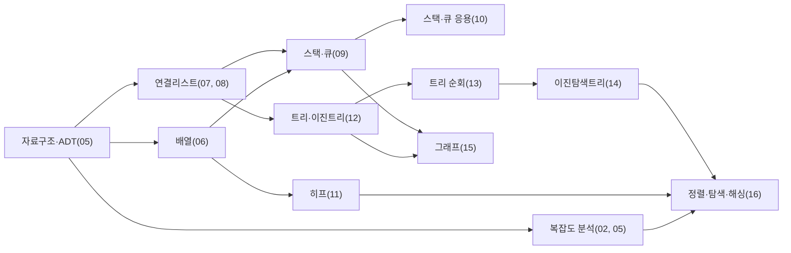

<Callout type="warning">
  **재구성 고지:** 이 편의 문제는 국가평생교육진흥원이 공개한 특정 회차의 기출문제를 그대로 옮긴 것이 아니다. 국가평생교육진흥원 홈페이지에 공시된 전공분야별 평가영역과 출제방향(참고 자료 2, 4)을 근거로, 자료구조 과목에서 반복적으로 강조되는 개념과 문제 유형을 재구성해 만든 학습용 문제다. 실제 회차별 문항 수·배점·시험 시간은 매년 공고가 다르므로, 응시 전 국가평생교육진흥원 홈페이지에서 최신 공고를 반드시 확인해야 한다(공고 확인 필요).
</Callout>

## 출제기준과 편 대응표

독학사 2단계 자료구조는 국가평생교육진흥원이 정한 평가영역을 기준으로 출제된다. 아래 표는 이 과목의 05편부터 16편까지를 그런 관점에서 재배열한 것이다.

| 평가영역(추정 범주) | 세부 개념 | 해당 편 |
|---|---|---|
| 자료구조의 기초와 분석 | 자료구조·ADT 정의, 시간·공간 복잡도, Big-O·Big-Theta | 01, 02, 05 |
| 선형 구조 | 배열, 단순·이중·원형 연결리스트 | 03, 04, 06, 07, 08 |
| 선형 구조의 응용 | 스택, 큐, 덱, 괄호 검사, 수식 변환 | 09, 10 |
| 비선형 구조 (트리) | 트리 용어, 이진트리, 순회, BST, 히프 | 11, 12, 13, 14 |
| 비선형 구조 (그래프) | 그래프 표현, DFS, BFS | 15 |
| 정렬·탐색·해싱 | 각종 정렬 알고리즘 비교, 순차·이진 탐색, 해싱 충돌 처리 | 16 |

이 표에서 눈여겨볼 점은 "선형 구조의 응용"과 "비선형 구조(트리)"에 편 수가 가장 많이 배정되어 있다는 것이다. 이는 우연이 아니라, 스택·큐의 실제 활용(수식 변환, 괄호 검사)과 트리의 순회·탐색 성질이 단순 암기가 아니라 **손으로 직접 연산 과정을 추적해야 풀리는 문제**로 자주 출제되기 때문이다.

## 빈출 개념과 시험에서 나타나는 형태

아래 다섯 가지는 자료구조 시험에서 매 회차 형태를 바꿔가며 반복 등장하는 핵심 축이다. 정확한 출제 빈도(퍼센트)는 회차마다 다르고 공식적으로 통계가 공개되지 않으므로 숫자로 단정하지 않으며, 대신 "어떤 형태의 문제로 변형되어 나오는가"를 정리한다.

| 핵심 개념 | 시험에서 흔히 묻는 형태 |
|---|---|
| 트리 순회(전위·중위·후위·레벨) | 트리 그림 또는 순회 결과 두 개를 주고 나머지 하나를 구하게 한다 |
| 정렬 알고리즘 비교 | 배열과 정렬 이름을 주고 특정 패스(pass) 후의 배열 상태를 추적하게 한다 |
| 스택·큐 응용 | 중위식을 후위식으로 바꾸거나, 후위식을 스택으로 계산하게 한다 |
| 히프(heap) | 배열을 히프로 만드는 과정, 또는 삽입·삭제 후 배열 상태를 묻는다 |
| 해싱 충돌 처리 | 키 목록과 해시함수를 주고 선형 조사법·체이닝 결과 슬롯을 추적하게 한다 |

공통적으로 "정의를 아는가"보다 "직접 계산해서 결과를 맞히는가"를 확인하려는 의도가 뚜렷하다. 그래서 이 편의 확인 문제도 대부분 값을 직접 대입해 추적하는 형태로 구성했다.

## 문항 유형별 접근법

독학사 자료구조 문항은 크게 네 가지 유형으로 나뉜다. 유형을 먼저 판별하면 풀이 전략을 바로 정할 수 있다.

| 유형 | 특징 | 풀이 전략 |
|---|---|---|
| 정의형 | 용어의 정확한 정의나 성질을 묻는다 | 비슷한 용어(깊이 vs 높이, 안정 정렬 vs 제자리 정렬)와 헷갈리지 않는지 먼저 확인한다 |
| 비교형 | 두 개 이상의 자료구조·알고리즘의 차이를 묻는다 | 표로 정리한 비교 기준(시간복잡도, 공간, 안정성)을 하나씩 대조한다 |
| 계산형 | 복잡도 유도, 주소 계산, 해시 슬롯 계산처럼 공식에 값을 대입해야 한다 | 공식을 먼저 적고 대입 순서를 절대 건너뛰지 않는다 |
| 추적형 | 정렬 패스, 트리 순회, 그래프 탐색처럼 알고리즘을 한 단계씩 손으로 진행해야 한다 | 표나 배열 상태를 단계별로 적으며 진행한다. 암산으로 건너뛰면 오답이 나온다 |

## 개념 맵으로 보는 편 사이의 연결

아래 개념 맵은 이 과목의 핵심 개념이 어떻게 서로 의존하는지를 보여준다. 화살표는 "이 개념을 알아야 다음 개념을 이해할 수 있다"는 방향이다.

```mermaid
graph LR
    A["자료구조·ADT(05)"] --> B["복잡도 분석(02, 05)"]
    A --> C["배열(06)"]
    A --> D["연결리스트(07, 08)"]
    C --> E["스택·큐(09)"]
    D --> E
    E --> F["스택·큐 응용(10)"]
    C --> G["히프(11)"]
    D --> H["트리·이진트리(12)"]
    H --> I["트리 순회(13)"]
    I --> J["이진탐색트리(14)"]
    H --> K["그래프(15)"]
    E --> K
    B --> L["정렬·탐색·해싱(16)"]
    G --> L
    J --> L
```

이 그림에서 확인해야 할 것은, 정렬·탐색·해싱(16편)이 사실상 이 과목 전체의 종착점이라는 사실이다. 복잡도 분석 없이는 정렬 알고리즘의 효율을 비교할 수 없고, 히프를 모르면 히프 정렬을 이해할 수 없으며, BST의 탐색 성질을 모르면 이진 탐색과의 차이를 설명할 수 없다.

## 기출 분석형 확인 문제

아래 문제들은 위에서 정리한 네 가지 유형(정의형·비교형·계산형·추적형)을 고르게 포함한다. 계산·추적형 문제는 explanation에 대입 과정을 전부 적어 두었으니, 답만 확인하지 말고 직접 손으로 같은 과정을 다시 밟아 보길 권한다.

## 정답 대조표

작성 직후 모든 문항의 정답 번호가 실제로 옳은 진술의 위치와 일치하는지 아래 표로 다시 대조했다.

| 문항 | 정답 | 근거 요약 |
|---|---|---|
| 1 | 2 | ADT는 구현과 분리된 논리적 명세 |
| 2 | 2 | 로그, 선형, 선형로그, 이차 순 |
| 3 | 2 | 뒤 원소를 한 칸씩 이동해야 함 |
| 4 | 3 | prev, next 양방향 포인터 |
| 5 | 2 | 빈 상태와 가득 찬 상태 구분 |
| 6 | 1 | 곱셈 먼저, 나눗셈 먼저 계산 반영 |
| 7 | 3 | 두 번 dequeue 후 3, 4, 5 잔존 |
| 8 | 3 | 여는·닫는 순서가 교차 |
| 9 | 1 | 삽입 6회 부모 비교 추적 결과 |
| 10 | 2 | 자식 수를 세는 용어가 차수 |
| 11 | 1 | 왼쪽-오른쪽-루트 순 복원 |
| 12 | 2 | 40은 30의 오른쪽 자식 |
| 13 | 2 | 중위 선행자·후속자로 대체 |
| 14 | 2 | 정렬된 입력은 편향 트리 유발 |
| 15 | 2 | 성긴 그래프는 인접리스트가 유리 |
| 16 | 2 | A, B, D, C, E 순 깊이 우선 |
| 17 | 2 | A, B, C, D, E 순 너비 우선 |
| 18 | 1 | 최솟값 11을 맨 앞과 교환 |
| 19 | 1 | 2, 4가 각자 자리로 이동 |
| 20 | 2 | 최댓값 8이 맨 뒤로 이동 |
| 21 | 3 | 병합 정렬만 안정 정렬 |
| 22 | 4 | 3, 4, 5번 슬롯 충돌 후 6번 |

## 핵심 정리

- 독학사 자료구조는 정의를 아는 것만으로는 부족하고, 정렬 패스·트리 순회·해싱 슬롯·복잡도 유도 같은 계산·추적 과정을 손으로 직접 진행할 수 있어야 한다.
- 문항을 정의형·비교형·계산형·추적형으로 먼저 분류하면 풀이 전략을 빠르게 정할 수 있다.
- 05편부터 16편까지의 개념은 서로 독립적이지 않고, 복잡도·히프·BST가 최종적으로 16편의 정렬·탐색·해싱 비교로 수렴한다.
- 정답을 맞히는 것만큼 중요한 것은 왜 나머지 세 보기가 틀렸는지 설명할 수 있는 것이다. "옳지 않은 것을 고르시오" 유형에 대비하려면 오답의 근거까지 정확히 알아야 한다.

## 확인 문제

<Quiz
  questionNumber={1}
  question={"추상자료형(ADT, Abstract Data Type)에 대한 설명으로 가장 옳은 것은?"}
  options={["데이터를 저장하는 물리적 메모리 구조 자체를 의미한다","데이터와 그에 대한 연산을 구현 방법과 분리해 명세한 것이다","특정 프로그래밍 언어에서만 정의할 수 있는 자료형이다","배열과 연결리스트를 통칭하는 다른 이름이다"]}
  correctAnswer={2}
  explanation={"ADT는 무엇을 저장하고 어떤 연산을 지원하는지를 구현과 독립적으로 정의한 명세다. 예를 들어 스택 ADT는 push, pop, peek 연산과 후입선출 성질만 정의할 뿐, 배열로 구현하는지 연결리스트로 구현하는지는 명시하지 않는다."}
/>

<Quiz
  questionNumber={2}
  question={"입력 크기 n이 커질 때 성장 속도가 느린 것부터 빠른 것 순서로 옳게 나열한 것은?"}
  options={["O(n^2), O(n log n), O(n), O(log n)","O(log n), O(n), O(n log n), O(n^2)","O(n), O(log n), O(n^2), O(n log n)","O(2^n), O(n^2), O(n log n), O(n)"]}
  correctAnswer={2}
  explanation={"복잡도의 성장 속도는 O(1)이 가장 느리고, O(log n), O(n), O(n log n), O(n^2), O(2^n) 순으로 빨라진다. 예를 들어 n이 1000일 때 log n은 약 10, n은 1000, n log n은 약 10000, n^2은 1000000으로 격차가 급격히 벌어진다. 두 번째 보기가 이 순서를 정확히 따른다."}
/>

<Quiz
  questionNumber={3}
  question={"크기 n인 배열의 맨 앞에 새 원소를 삽입할 때 최악의 경우 시간복잡도가 O(n)이 되는 이유로 옳은 것은?"}
  options={["배열은 포인터로 연결되어 있어 탐색에 시간이 걸리기 때문이다","삽입 위치 뒤의 기존 원소들을 한 칸씩 뒤로 이동시켜야 하기 때문이다","배열의 크기가 삽입할 때마다 매번 두 배로 늘어나기 때문이다","배열은 항상 정렬 상태를 유지해야 하기 때문이다"]}
  correctAnswer={2}
  explanation={"배열은 연속된 메모리 공간에 원소를 저장하므로, 맨 앞에 새 원소를 넣으려면 기존 원소 n개를 전부 한 칸씩 뒤로 밀어야 빈자리가 생긴다. 이 이동 작업이 n에 비례하므로 O(n)이다. 반면 연결리스트는 포인터만 바꾸면 되므로 위치를 이미 알고 있다면 O(1)이다."}
/>

## 참고 자료

- [국가평생교육진흥원 독학학위제 홈페이지](https://bdes.nile.or.kr/)
- [국가평생교육진흥원 출제방향/수준](https://bdes.nile.or.kr/nile/study/nStudy1_1.do)
- [국가평생교육진흥원 과목별 평가영역](https://bdes.nile.or.kr/nile/study/nStudy2_1.do)
- [2026년도 독학학위 취득시험 응시요강(시험안내)](https://bdes.nile.or.kr/nile/newAdv/nNewAdv2_1.do)
