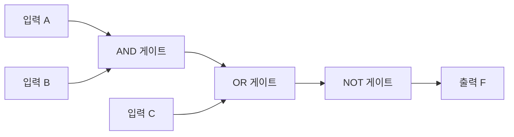

<Callout type="info">
  **이번 문서의 목표:** 이 문서를 다 읽으면 AND·OR·NOT·NAND·NOR·XOR의 진리표를 직접 채우고, 드모르간 법칙을 실제 값으로 검증하고, 회로도에 그려진 게이트 기호가 어떤 연산인지 읽어낼 수 있다.
</Callout>

## 왜 참·거짓 연산이 컴퓨터구조의 기초인가

01편에서 컴퓨터가 0과 1 두 가지 상태만으로 정보를 표현한다는 것을 배웠다. 그런데 컴퓨터가 실제로 "계산"을 하려면, 이 0과 1을 조합해서 새로운 0과 1을 만들어내는 규칙이 필요하다. 이 규칙을 수학적으로 정리한 것이 **불대수**(Boolean algebra, 부울대수)다. 불대수는 영국 수학자 조지 불(George Boole)이 만든 논리 체계로, 숫자 대신 "참"과 "거짓"이라는 두 값만 다룬다. 컴퓨터에서는 참을 1로, 거짓을 0으로 대응시켜, 결국 불대수가 곧 2진수 계산의 언어가 된다.

이 불대수를 물리적인 전자 회로로 구현한 최소 단위가 **논리게이트**(logic gate)다. 논리게이트 하나하나는 트랜지스터 몇 개로 만들어진 아주 작은 회로 조각이지만, 이 게이트들을 조합하면 덧셈기, 메모리, 그리고 궁극적으로는 CPU 전체를 만들 수 있다. 즉 이 문서에서 배우는 AND·OR·NOT은 컴퓨터구조 전체를 떠받치는 가장 작은 벽돌이다.

> **쉽게 말하면:** 불대수는 "참·거짓만 있는 수학"이고, 논리게이트는 그 수학 연산 하나하나를 전기 회로로 만든 부품이다.

## 진리표란 무엇인가

**진리표**(truth table)는 입력값의 모든 가능한 조합에 대해 출력값이 무엇인지 나열한 표다. 입력이 2개면 각 입력이 0 또는 1 두 가지 경우를 가지므로 $2 \times 2 = 4$가지 조합이 나오고, 입력이 3개면 $2^3=8$가지 조합이 나온다. 진리표는 어떤 논리 연산을 눈으로 검증하는 가장 확실한 도구이며, 독학사 시험에서도 "진리표를 보고 어떤 게이트인지 맞히기", "식이 진리표와 일치하는지 확인하기" 유형으로 자주 출제된다.

## 기본 연산 1: AND (논리곱)

**AND**(논리곱, 곱셈 기호 $\cdot$ 또는 표기 없이 붙여 쓰거나 프로그래밍에서는 `&&`로 표현)는 "두 입력이 모두 1일 때만 1"인 연산이다. 생활 속 비유로는 "우산을 챙긴다(A) AND 신발을 신는다(B)"가 모두 참이어야 "외출 준비가 끝났다"가 참이 되는 상황과 같다. 둘 중 하나라도 빠지면 준비가 끝난 것이 아니다.

<table>
<thead><tr><th>A</th><th>B</th><th>A AND B</th></tr></thead>
<tbody>
<tr><td>0</td><td>0</td><td>0</td></tr>
<tr><td>0</td><td>1</td><td>0</td></tr>
<tr><td>1</td><td>0</td><td>0</td></tr>
<tr><td>1</td><td>1</td><td>1</td></tr>
</tbody>
</table>

수식으로는 $F = A \cdot B$ 또는 $F = AB$로 쓴다. AND 게이트의 회로 기호는 평평한 왼쪽 변에 둥근 오른쪽 끝을 가진 모양(문자 D를 닮은 모양)으로 그려지며, 입력선 두 개가 왼쪽에서 들어와 출력선 하나가 오른쪽으로 나간다.

## 기본 연산 2: OR (논리합)

**OR**(논리합, 덧셈 기호 $+$ 또는 프로그래밍에서 `||`)는 "둘 중 하나라도 1이면 1"인 연산이다. "주말이다(A) OR 공휴일이다(B)"라면 둘 중 하나만 참이어도 "오늘은 쉬는 날이다"가 참이 되는 것과 같은 원리다.

<table>
<thead><tr><th>A</th><th>B</th><th>A OR B</th></tr></thead>
<tbody>
<tr><td>0</td><td>0</td><td>0</td></tr>
<tr><td>0</td><td>1</td><td>1</td></tr>
<tr><td>1</td><td>0</td><td>1</td></tr>
<tr><td>1</td><td>1</td><td>1</td></tr>
</tbody>
</table>

수식으로는 $F = A + B$로 쓰지만, 이 $+$는 일반 산술 덧셈이 아니라 논리합이라는 점에 유의해야 한다. $1+1=1$(둘 다 참이면 결과도 참)이지 산술처럼 2가 되지 않는다. OR 게이트 기호는 왼쪽이 오목하게 파인 곡선 방패 모양으로 그려진다.

> **자주 틀리는 점:** OR의 $1+1$을 산술 덧셈처럼 2로 착각하는 실수가 잦다. 논리합에서는 결과가 항상 0 또는 1뿐이며, 두 입력이 모두 참이면 결과도 그냥 참(1)이다.

## 기본 연산 3: NOT (부정)

**NOT**(부정, 반전)은 입력이 단 하나뿐인 유일한 기본 연산으로, 입력값을 뒤집는다. 0이면 1로, 1이면 0으로 바꾼다. 표기는 변수 위에 막대를 긋거나($\bar{A}$), 작은따옴표를 붙이거나($A'$), 프로그래밍에서는 `!A`로 쓴다.

<table>
<thead><tr><th>A</th><th>NOT A</th></tr></thead>
<tbody>
<tr><td>0</td><td>1</td></tr>
<tr><td>1</td><td>0</td></tr>
</tbody>
</table>

NOT 게이트는 회로도에서 삼각형에 작은 동그라미(버블, bubble이라고 부른다)가 출력 쪽에 붙은 모양으로 그려진다. 이 작은 동그라미는 뒤에서 배울 NAND·NOR에서도 "그 앞의 연산 결과를 반전한다"는 뜻으로 계속 등장하므로 기억해 두면 좋다.

## 파생 연산: NAND, NOR, XOR

기본 세 연산(AND, OR, NOT)을 조합하면 실무와 시험에서 자주 나오는 세 가지 연산을 더 만들 수 있다.

**NAND**(Not AND)는 AND 결과를 반전한 것이다. AND 게이트 기호 출력 쪽에 NOT의 버블(작은 동그라미)이 붙은 모양으로 그린다.

<table>
<thead><tr><th>A</th><th>B</th><th>A NAND B</th></tr></thead>
<tbody>
<tr><td>0</td><td>0</td><td>1</td></tr>
<tr><td>0</td><td>1</td><td>1</td></tr>
<tr><td>1</td><td>0</td><td>1</td></tr>
<tr><td>1</td><td>1</td><td>0</td></tr>
</tbody>
</table>

**NOR**(Not OR)은 OR 결과를 반전한 것으로, OR 게이트 기호 출력 쪽에 버블이 붙는다.

<table>
<thead><tr><th>A</th><th>B</th><th>A NOR B</th></tr></thead>
<tbody>
<tr><td>0</td><td>0</td><td>1</td></tr>
<tr><td>0</td><td>1</td><td>0</td></tr>
<tr><td>1</td><td>0</td><td>0</td></tr>
<tr><td>1</td><td>1</td><td>0</td></tr>
</tbody>
</table>

**XOR**(eXclusive OR, 배타적 논리합)은 "두 입력이 서로 다를 때만 1"인 연산이다. 표기는 $\oplus$(플러스 기호에 동그라미를 두른 모양)를 쓴다. "둘 중 정확히 하나만 선택한다"는 상황, 예를 들어 스위치 두 개로 하나의 전등을 켜고 끄는 회로(계단 양쪽 끝 스위치)가 XOR의 대표적인 생활 속 예시다.

<table>
<thead><tr><th>A</th><th>B</th><th>A XOR B</th></tr></thead>
<tbody>
<tr><td>0</td><td>0</td><td>0</td></tr>
<tr><td>0</td><td>1</td><td>1</td></tr>
<tr><td>1</td><td>0</td><td>1</td></tr>
<tr><td>1</td><td>1</td><td>0</td></tr>
</tbody>
</table>

XOR은 뒤에서 배울 이진수 덧셈 회로(반가산기·전가산기)의 핵심 부품이며, 07편의 보수 계산과도 연결된다. NAND와 NOR은 "**논리적으로 완전한**(functionally complete) 게이트"라고 불리는데, 이는 NAND 하나만으로(또는 NOR 하나만으로) AND·OR·NOT을 포함한 모든 논리 연산을 만들어낼 수 있다는 뜻이다. 그래서 실제 반도체 칩 설계에서는 NAND나 NOR 게이트를 표준 부품으로 대량 사용한다.

## 드모르간 법칙 — 실제 값으로 검증하기

**드모르간 법칙**(De Morgan's laws)은 AND·OR·NOT 사이의 관계를 정리한 불대수의 핵심 법칙이다. 두 가지 식으로 이루어져 있다.

$$
\overline{A \cdot B} = \bar{A} + \bar{B}
$$

$$
\overline{A + B} = \bar{A} \cdot \bar{B}
$$

말로 풀면 "AND를 먼저 하고 전체를 부정한 것"은 "각각을 먼저 부정하고 OR한 것"과 같고, "OR를 먼저 하고 전체를 부정한 것"은 "각각을 먼저 부정하고 AND한 것"과 같다는 뜻이다. NAND는 첫 번째 식의 왼쪽과, NOR은 두 번째 식의 왼쪽과 형태가 같으므로, 드모르간 법칙은 결국 "NAND는 입력을 반전한 뒤 OR한 것과 같고, NOR은 입력을 반전한 뒤 AND한 것과 같다"는 뜻이기도 하다.

이 법칙을 말로만 외우면 시험에서 변형된 식이 나왔을 때 헷갈리기 쉽다. 실제 값을 하나씩 대입해 양쪽이 정말 같은지 검증해 보자. $A=1$, $B=0$인 경우를 첫 번째 식에 대입한다.

**왼쪽**: $\overline{A \cdot B} = \overline{1 \cdot 0} = \overline{0} = 1$

**오른쪽**: $\bar{A} + \bar{B} = \overline{1} + \overline{0} = 0 + 1 = 1$

양쪽 모두 1이 나와 일치한다. 이번엔 $A=1$, $B=1$을 대입해 본다.

**왼쪽**: $\overline{A \cdot B} = \overline{1 \cdot 1} = \overline{1} = 0$

**오른쪽**: $\bar{A} + \bar{B} = \overline{1} + \overline{1} = 0 + 0 = 0$

역시 양쪽 모두 0으로 일치한다. 나머지 두 조합($A=0,B=0$과 $A=0,B=1$)도 같은 방식으로 대입하면 항상 일치하는 것을 확인할 수 있으며, 이렇게 **입력 조합 전체(4가지)에서 양쪽 값이 모두 일치할 때** 두 식이 논리적으로 같다고(진리표가 동일하다고) 증명된다. 두 번째 식도 같은 방법으로 검증할 수 있다. $A=0$, $B=1$을 대입해 보면 왼쪽은 $\overline{A+B} = \overline{0+1} = \overline{1} = 0$, 오른쪽은 $\bar{A} \cdot \bar{B} = 1 \cdot 0 = 0$으로 일치한다.

> **쉽게 말하면:** 드모르간 법칙은 "부정을 안으로 밀어 넣으면 AND와 OR가 서로 뒤바뀐다"는 규칙이다. 괄호 밖의 막대(NOT)를 괄호 안으로 들여보내면서 $\cdot$는 $+$로, $+$는 $\cdot$로 바뀐다고 기억하면 쉽다.

이 법칙은 09편(불대수와 조합논리회로)에서 회로를 단순화할 때, 그리고 회로 설계에서 NAND 게이트만으로 원하는 논리를 구현할 때 실제로 활용된다.

## 게이트 기호 읽는 법

회로도 문제에서는 기호만 보고 어떤 연산인지 즉시 알아봐야 한다. 아래 표로 정리한다.

<table>
<thead><tr><th>게이트</th><th>기호 형태</th><th>버블(반전 동그라미) 유무</th></tr></thead>
<tbody>
<tr><td>AND</td><td>평평한 왼쪽 변, 둥근 오른쪽 끝(D자 모양)</td><td>없음</td></tr>
<tr><td>OR</td><td>왼쪽이 오목한 곡선, 뾰족한 오른쪽 끝(방패 모양)</td><td>없음</td></tr>
<tr><td>NOT</td><td>삼각형</td><td>출력에 있음</td></tr>
<tr><td>NAND</td><td>AND와 동일한 몸통</td><td>출력에 있음</td></tr>
<tr><td>NOR</td><td>OR와 동일한 몸통</td><td>출력에 있음</td></tr>
<tr><td>XOR</td><td>OR 몸통 앞에 곡선 하나 추가</td><td>없음</td></tr>
</tbody>
</table>

핵심 요령은 **몸통 모양이 어떤 연산 계열인지(AND 계열인지 OR 계열인지)를 정하고, 출력 쪽 버블 유무가 반전 여부를 정한다**는 것이다. 이 방식으로 어떤 조합이 나와도 몸통과 버블만 분리해서 읽으면 헷갈리지 않는다.

여러 게이트가 연결된 복합 회로는 mermaid 흐름도로도 표현할 수 있다. 아래는 $F = \overline{(A \cdot B) + C}$를 계산하는 회로의 신호 흐름이다.

이 흐름도를 보면 A와 B가 먼저 AND로 합쳐지고, 그 결과가 C와 OR로 합쳐진 뒤, 마지막에 NOT으로 반전되어 F가 나온다는 계산 순서를 한눈에 알 수 있다. 회로도 문제를 풀 때도 이렇게 "가장 왼쪽 입력에서 출력까지 신호가 어떤 순서로 게이트를 거치는지" 순서대로 따라가면 실수를 줄일 수 있다.

## 자주 틀리는 점

- **OR의 결과를 산술 덧셈처럼 계산하는 실수**: $1+1$은 논리합에서 1이지 2가 아니다.
- **드모르간 법칙에서 부정을 절반만 적용하는 실수**: $\overline{A \cdot B}$를 $\bar{A} \cdot \bar{B}$로 잘못 옮기기 쉽다. 부정이 안으로 들어가면 연산자(AND↔OR)도 함께 바뀐다는 것을 놓치면 안 된다.
- **NAND·NOR을 AND·OR과 헷갈리는 실수**: 버블(반전 동그라미)의 유무를 놓치면 정반대의 값을 답으로 고르게 된다.
- **XOR을 OR과 혼동하는 실수**: $A=1, B=1$일 때 OR은 1이지만 XOR은 0이다. "둘 다 참이면 다르다는 조건을 만족하지 못하므로 거짓"이라는 점을 기억해야 한다.

## 핵심 정리

- 불대수는 참·거짓 두 값만 다루는 수학이고, 논리게이트는 그 연산을 구현한 전자 회로 부품이다.
- AND는 모두 1일 때만 1, OR는 하나라도 1이면 1, NOT은 값을 반전한다.
- NAND·NOR은 각각 AND·OR의 결과를 반전한 것이고, XOR은 두 입력이 다를 때만 1이다.
- 드모르간 법칙은 부정을 괄호 안으로 밀어 넣으면서 AND와 OR이 서로 뒤바뀌는 규칙이며, 실제 값을 대입해 양쪽이 일치함을 검증할 수 있다.
- 게이트 기호는 몸통 모양(연산 계열)과 출력 쪽 버블(반전 여부)로 구분해서 읽는다.

## 마무리 복습

<Quiz
  questionNumber={1}
  question="A=1, B=0일 때 A AND B의 값은?"
  options={['1', '0', '알 수 없음', 'A와 B를 더한 값인 1']}
  correctAnswer={2}
  explanation="AND는 두 입력이 모두 1일 때만 1이다. A=1, B=0이므로 하나라도 0이 있어 결과는 0이다."
  optionExplanations={['AND는 하나라도 0이면 결과가 0이므로 오답이다.', '정답. 두 입력 중 B가 0이므로 AND 결과는 0이다.', 'AND는 진리표로 명확히 정해지는 연산이므로 값을 알 수 없다는 것은 틀렸다.', 'AND를 산술 덧셈으로 착각한 오답이다.']}
/>

<Quiz
  questionNumber={2}
  question="A=0, B=1일 때 A NOR B의 값은?"
  options={['1', '0', '알 수 없음', 'A와 B가 같은 값이므로 1']}
  correctAnswer={2}
  explanation="NOR은 OR의 결과를 반전한 것이다. A OR B는 0+1=1이고, 이를 반전하면 0이다."
  optionExplanations={['OR 결과인 1을 그대로 답으로 고른 오답으로, NOR은 이를 반전해야 한다.', '정답. OR 결과 1을 반전하면 0이 된다.', 'NOR도 진리표로 명확히 정해지는 연산이므로 알 수 없다는 것은 틀렸다.', 'A와 B는 서로 다른 값(0과 1)이므로 전제 자체가 잘못되었다.']}
/>

<Quiz
  questionNumber={3}
  question="드모르간 법칙에 따라 다음 식과 항상 같은 값을 갖는 식은? 원래 식: NOT(A OR B)"
  options={['(NOT A) AND (NOT B)', '(NOT A) OR (NOT B)', 'A AND B', 'NOT A OR B']}
  correctAnswer={1}
  explanation="드모르간 법칙에 따르면 NOT(A OR B)는 (NOT A) AND (NOT B)와 같다. 부정을 안으로 넣으면서 OR가 AND로 바뀐다."
  optionExplanations={['정답. 드모르간 법칙의 두 번째 식과 정확히 일치한다.', 'OR로 남겨둔 것은 부정이 안으로 들어가면서 연산자가 바뀐다는 규칙을 놓친 오답이다.', '부정 자체를 빠뜨린 오답이다.', '두 번째 항의 부정을 빠뜨린 오답이다.']}
/>

<Quiz
  questionNumber={4}
  question="A=1, B=1일 때 A XOR B의 값은?"
  options={['1', '0', '알 수 없음', 'AND와 같은 값인 1']}
  correctAnswer={2}
  explanation="XOR은 두 입력이 서로 다를 때만 1이다. A와 B가 모두 1로 같으므로 결과는 0이다."
  optionExplanations={['XOR을 OR과 혼동한 오답이다. 두 입력이 같으면 XOR은 0이다.', '정답. 두 입력이 같은 값이므로 XOR 결과는 0이다.', 'XOR도 진리표로 명확히 정해지므로 알 수 없다는 것은 틀렸다.', 'A=1, B=1일 때 AND는 1이지만 XOR은 0으로 서로 다르다.']}
/>

<Quiz
  questionNumber={5}
  question="NAND 게이트 하나만으로 만들 수 없는 연산은?"
  options={['NOT', 'AND', 'OR', '없다. NAND만으로 AND·OR·NOT을 모두 만들 수 있다']}
  correctAnswer={4}
  explanation="NAND는 논리적으로 완전한 게이트로, NAND 게이트만 여러 개 조합하면 NOT·AND·OR을 포함한 모든 기본 논리 연산을 구현할 수 있다. 예를 들어 두 입력을 똑같이 연결한 NAND는 NOT과 같아진다."
  optionExplanations={['NAND 두 입력을 하나로 묶으면 NOT이 되므로, NOT을 만들 수 없다는 것은 틀렸다.', 'NAND 뒤에 NOT(NAND로 구현한)을 붙이면 AND가 되므로 만들 수 없다는 것은 틀렸다.', '입력을 각각 NOT(NAND로 구현)한 뒤 NAND하면 OR이 되므로(드모르간 법칙 활용) 만들 수 없다는 것은 틀렸다.', '정답. NAND는 기능적으로 완전한 게이트라 모든 기본 논리 연산을 구현할 수 있다.']}
/>

<Quiz
  questionNumber={6}
  question="회로도에서 AND 게이트와 몸통 모양이 같고 출력 쪽에 버블(반전 동그라미)이 붙어 있는 게이트는?"
  options={['OR', 'NOR', 'NAND', 'XOR']}
  correctAnswer={3}
  explanation="NAND는 AND 게이트와 동일한 몸통 모양에 출력 쪽 버블만 추가된 형태로 그려진다. 버블은 그 앞 연산 결과를 반전한다는 뜻이다."
  optionExplanations={['OR은 몸통 모양 자체가 AND와 다른 방패 모양이므로 오답이다.', 'NOR은 OR과 몸통 모양이 같고 버블이 붙은 것이므로 오답이다.', '정답. NAND는 AND 몸통에 버블이 붙은 형태다.', 'XOR은 OR 몸통 앞에 곡선이 하나 더 있는 형태이며 버블은 없다.']}
/>

## 참고 자료

- [MDN Web Docs](https://developer.mozilla.org/) — 2진수·논리 연산의 기초 개념을 확인할 수 있는 공신력 있는 문서.
- [국가평생교육진흥원 독학학위제](https://bdes.nile.or.kr) — 독학사 시험 안내 및 평가영역 공식 자료.
