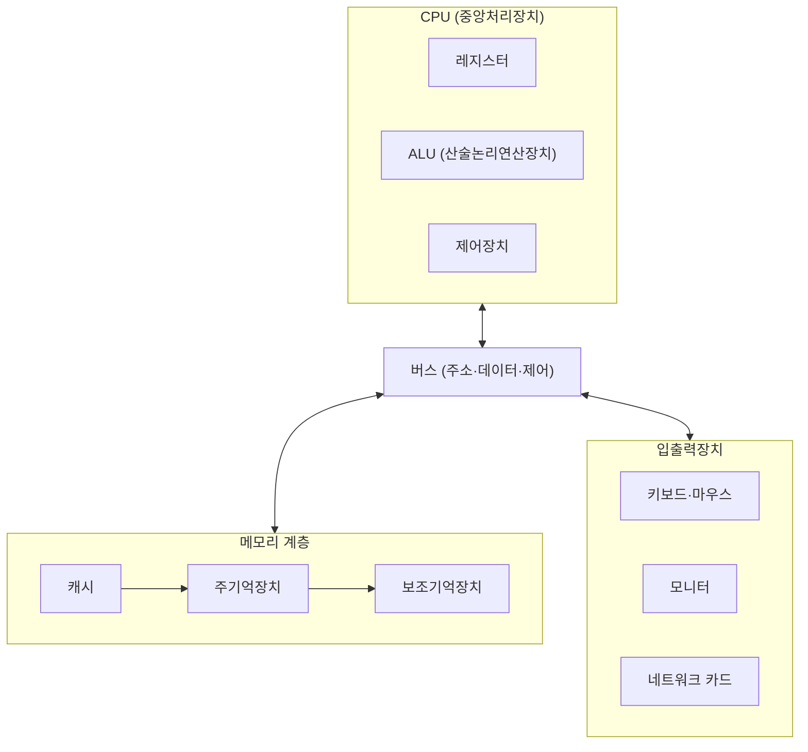
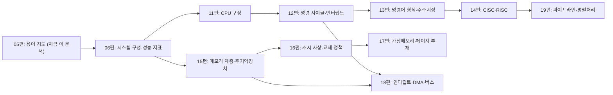

<Callout type="info">
  **이번 문서의 목표:** 이 문서를 다 읽으면 CPU·메모리·버스·I/O 각각의 역할을 설명하고, 이들이 연결된 시스템 블록도를 읽고 그릴 수 있으며, 앞으로 나올 본론 편들이 이 지도의 어느 부분을 다루는지 파악할 수 있다.
</Callout>

## 왜 전체 지도를 먼저 그려야 하는가

지금까지 01~04편에서는 진법, 논리게이트, 문자코드·오류검출, 부동소수점이라는 **표현 방법**을 배웠다. 이제부터는 이 표현된 데이터를 실제로 처리하는 **컴퓨터 시스템의 구조**로 넘어갈 차례다. 그런데 06편부터는 CPU 내부 구성, 명령 사이클, 캐시 사상, 가상메모리, 인터럽트와 DMA처럼 각 주제가 상당히 깊게 파고드는 개별 편으로 나뉘어 있다. 각 나무를 보기 전에 숲 전체를 먼저 봐야, 지금 배우는 개념이 전체 시스템에서 어떤 위치에 있는지 헷갈리지 않는다.

> **쉽게 말하면:** 이 문서는 앞으로 나올 본론 10개 편을 위한 지도(map)다. 세부 내용을 깊게 다루지 않고, "이 부품은 무슨 역할을 하고 다른 부품과 어떻게 연결되는가"라는 큰 그림만 먼저 그린다.

## 컴퓨터 시스템의 네 가지 큰 구성 요소

컴퓨터 시스템은 크게 네 가지 요소로 나눠 이해할 수 있다. **CPU**(중앙처리장치), **메모리**(기억장치), **버스**(연결 통로), **입출력장치**(I/O, Input/Output)다.

### CPU — 계산과 판단을 담당하는 두뇌

**CPU**(Central Processing Unit, 중앙처리장치)는 프로그램의 명령어를 하나씩 읽어(인출), 그 명령이 무슨 뜻인지 해석하고(해독), 실제로 계산이나 데이터 이동을 수행하는(실행) 부품이다. 사람으로 비유하면 요리 레시피(프로그램)를 한 줄씩 읽고, 그 줄이 "썰어라"인지 "끓여라"인지 이해한 뒤, 실제로 손을 움직여 그 동작을 하는 요리사에 해당한다.

CPU 내부는 다시 여러 부품으로 나뉜다. 계산을 실제로 수행하는 **ALU**(Arithmetic Logic Unit, 산술논리연산장치), 데이터를 임시로 담아 두는 아주 빠른 저장 공간인 **레지스터**(register), 그리고 명령어의 흐름과 각 부품의 동작 순서를 지휘하는 **제어장치**(control unit)로 구성된다. 이 CPU 내부 구성은 11편(CPU 구성: 레지스터·ALU·제어장치)에서, CPU가 명령어를 처리하는 반복 흐름은 12편(명령 사이클과 인터럽트)에서 깊게 다룬다.

### 메모리 — 데이터와 명령어를 저장하는 공간

**메모리**(memory, 기억장치)는 프로그램의 명령어와 데이터를 저장해 두는 공간이다. 메모리는 하나의 종류로만 이루어져 있지 않고, 속도와 용량, 가격이 서로 다른 여러 종류가 계층을 이루고 있다. CPU에 가장 가까운 **레지스터**가 가장 빠르지만 용량이 극히 작고, 그다음으로 **캐시**(cache)가 빠르고 작으며, **주기억장치**(main memory, 흔히 RAM으로 부르는 영역)가 그보다 느리지만 훨씬 크고, 마지막으로 하드디스크·SSD 같은 **보조기억장치**(secondary storage)가 가장 느리지만 가장 큰 용량을 갖는다.

이렇게 계층을 나누는 이유는 "빠르면서도 큰 메모리"를 만드는 비용이 지나치게 비싸기 때문이다. 대신 자주 쓰는 데이터를 빠른 계층에 올려두는 전략으로 두 마리 토끼(속도와 용량)를 절충한다. 이 메모리 계층 전체는 15편(기억장치 계층과 주기억장치)에서, 그중 캐시는 16편(캐시 사상과 교체 정책)에서, 물리적인 메모리 용량의 한계를 극복하는 가상메모리는 17편(가상메모리와 페이지 부재)에서 각각 다룬다.

### 버스 — 부품들을 잇는 공용 통로

**버스**(bus)는 CPU, 메모리, 입출력장치 사이에서 데이터를 주고받는 통로다. 여러 대의 버스(회사 버스가 아니라 교통수단 버스)가 하나의 정해진 노선을 오가며 승객을 실어 나르는 것처럼, 컴퓨터의 버스도 정해진 규칙에 따라 여러 부품 사이에서 신호를 실어 나른다. 버스는 역할에 따라 세 가지로 나뉜다.

- **주소 버스**(address bus): "어디에 있는 데이터를 다룰 것인가"라는 위치 정보(메모리 주소)를 전달한다.
- **데이터 버스**(data bus): 실제로 주고받을 값(데이터) 자체를 전달한다.
- **제어 버스**(control bus): "지금 읽는 중인지 쓰는 중인지" 같은 동작 신호와 타이밍 정보를 전달한다.

이 세 버스는 항상 함께 움직인다. 예를 들어 CPU가 메모리에서 값을 읽어올 때는, 주소 버스로 "몇 번지를 읽을 것인가"를 보내고, 제어 버스로 "지금은 읽기 동작이다"라는 신호를 보내면, 메모리가 그 주소의 값을 데이터 버스에 실어 CPU로 돌려보낸다. 버스의 세부 구조와 전송 방식 계산은 18편(입출력 구조: 인터럽트·DMA·버스)에서 다룬다.

### 입출력장치 — 컴퓨터와 외부 세계를 잇는 창구

**입출력장치**(I/O device)는 키보드·마우스·모니터·프린터·네트워크 카드처럼 컴퓨터와 외부 세계 사이에서 정보를 주고받는 장치다. CPU나 메모리에 비해 속도가 훨씬 느린 경우가 많아서, "느린 장치를 어떻게 효율적으로 다룰 것인가"가 컴퓨터구조의 중요한 설계 문제가 된다. 이를 해결하는 대표적인 두 가지 방법이 **인터럽트**(interrupt, CPU가 장치의 요청이 있을 때만 반응하는 방식)와 **DMA**(Direct Memory Access, 직접기억장치접근, CPU를 거치지 않고 장치와 메모리가 직접 데이터를 주고받는 방식)다. 이 두 방식의 비교와 계산 문제는 18편에서 자세히 다룬다.

## 시스템 블록도로 전체 구조 읽기

지금까지 설명한 네 요소가 서로 어떻게 연결되는지 **블록도**(block diagram)로 그려 보면 다음과 같다.

이 블록도에서 눈여겨볼 점은 세 가지다. 첫째, **CPU와 메모리, CPU와 입출력장치가 직접 연결되지 않고 반드시 버스를 거친다**는 것이다. 이는 부품이 늘어나도 배선을 각각 따로 연결할 필요 없이 하나의 공용 통로만 있으면 된다는 뜻이다. 둘째, **메모리 내부도 캐시-주기억장치-보조기억장치 순서로 계층을 이룬다**는 것이다. 셋째, **입출력장치는 종류가 다양하지만 모두 같은 버스를 통해 CPU·메모리와 통신한다**는 것이다.

> **쉽게 말하면:** CPU는 생각하고, 메모리는 기억하고, 버스는 그 사이를 오가는 도로이며, 입출력장치는 바깥 세상과 만나는 창구다.

## 폰노이만 구조 — 이 지도의 이론적 뿌리

지금 그린 블록도는 우연히 이런 모양이 된 것이 아니라, **폰노이만 구조**(von Neumann architecture)라는 컴퓨터 설계 원칙을 따른 것이다. 폰노이만 구조의 핵심은 "**프로그램(명령어)과 데이터를 같은 메모리에 함께 저장하고, CPU가 이 메모리에서 명령어를 하나씩 순서대로 꺼내 처리한다**"는 것이다. 이 원칙 덕분에 프로그램을 하드웨어 배선을 바꾸지 않고도 메모리에 새로 적어 넣는 것만으로 교체할 수 있다는, 오늘날 당연하게 여겨지는 "소프트웨어"라는 개념 자체가 가능해졌다. 폰노이만 구조의 성능 지표와 구체적인 동작 원리는 06편(컴퓨터 시스템 구성과 성능 지표)에서 이어서 다룬다.

## 구조 용어 관계도 — 이 과목의 전체 흐름

앞으로 나올 본론 편들이 이 지도의 어느 부분을 다루는지 관계도로 정리하면 다음과 같다.

이 관계도를 보면, CPU 계열(11~14편)과 메모리 계열(15~17편)이 각각 06편에서 갈라져 나가고, 18편(입출력)은 12편의 인터럽트 개념과 15편의 메모리 개념을 모두 필요로 하며, 19편(파이프라인)은 12편과 14편의 개념을 종합한다는 것을 알 수 있다. 이렇게 앞 편의 개념이 뒤 편에서 재사용되는 구조이므로, 각 편을 순서대로 읽어 나가면 자연스럽게 지식이 쌓인다.

## 자주 틀리는 점

- **CPU와 메모리가 직접 통신한다고 오해하는 실수**: 실제로는 반드시 버스를 거쳐 통신하며, 이 버스의 대역폭과 속도가 시스템 전체 성능의 병목이 될 수 있다.
- **메모리를 하나의 균일한 저장 공간으로 오해하는 실수**: 메모리는 레지스터·캐시·주기억장치·보조기억장치로 이어지는 계층 구조이며, 각 계층은 속도·용량·가격이 서로 다르다.
- **인터럽트와 DMA를 같은 개념으로 혼동하는 실수**: 인터럽트는 CPU가 장치의 요청에 반응하는 방식이고, DMA는 CPU를 거치지 않고 장치와 메모리가 직접 데이터를 주고받는 방식이다. 이 둘은 18편에서 정면으로 비교한다.
- **폰노이만 구조를 단순히 "옛날 컴퓨터 이름" 정도로 여기는 실수**: 폰노이만 구조는 지금도 대부분의 범용 컴퓨터가 따르는 설계 원칙으로, 프로그램과 데이터를 같은 메모리에 저장한다는 개념 자체가 핵심이다.

## 핵심 정리

- 컴퓨터 시스템은 CPU(계산·판단), 메모리(저장), 버스(연결 통로), 입출력장치(외부와의 창구)라는 네 가지 큰 요소로 이해할 수 있다.
- 버스는 주소 버스·데이터 버스·제어 버스로 나뉘며, CPU와 메모리·입출력장치 사이의 모든 통신은 버스를 거친다.
- 메모리는 레지스터-캐시-주기억장치-보조기억장치로 이어지는 속도·용량 계층 구조를 이룬다.
- 폰노이만 구조는 프로그램과 데이터를 같은 메모리에 저장하고 CPU가 순서대로 처리한다는 원칙으로, 이 과목 전체 구조의 이론적 뿌리다.
- 06편부터는 이 지도의 각 부분(CPU 계열, 메모리 계열, 입출력 계열)을 순서대로 깊게 파고든다.

## 마무리 복습

<Quiz
  questionNumber={1}
  question="컴퓨터 시스템에서 CPU와 메모리, CPU와 입출력장치 사이의 통신에 대한 설명으로 옳은 것은?"
  options={['CPU와 각 장치는 전용 배선으로 직접 연결된다', 'CPU와 장치 사이의 모든 통신은 버스라는 공용 통로를 거친다', 'CPU는 메모리와만 통신하고 입출력장치와는 통신하지 않는다', '버스는 데이터 전송에만 쓰이고 주소나 제어 신호는 별도 경로로 전달된다']}
  correctAnswer={2}
  explanation="버스는 CPU, 메모리, 입출력장치 사이의 공용 통로로, 주소 버스·데이터 버스·제어 버스가 함께 동작하며 모든 통신이 이 버스를 거쳐 이뤄진다."
  optionExplanations={['부품마다 전용 배선을 두면 부품 수가 늘어날수록 배선이 기하급수적으로 늘어나므로, 실제로는 공용 버스를 사용한다.', '정답. CPU와 메모리·입출력장치 사이의 통신은 버스를 거쳐 이뤄진다.', 'CPU는 입출력장치와도 버스를 통해 통신하며, 인터럽트나 DMA 같은 방식으로 데이터를 주고받는다.', '버스는 주소 버스·데이터 버스·제어 버스 세 가지가 함께 동작하는 구조이므로 데이터 전송만 담당한다는 것은 틀렸다.']}
/>

<Quiz
  questionNumber={2}
  question="메모리 계층에서 속도가 가장 빠르지만 용량이 가장 작은 계층은?"
  options={['보조기억장치', '주기억장치', '캐시', '레지스터']}
  correctAnswer={4}
  explanation="메모리 계층은 CPU에 가까울수록 빠르고 작아진다. 레지스터는 CPU 내부에 있어 가장 빠르지만 용량이 극히 작고, 그다음이 캐시, 주기억장치, 보조기억장치 순으로 느려지면서 용량은 커진다."
  optionExplanations={['보조기억장치는 계층 중 가장 느리지만 가장 큰 용량을 갖는다.', '주기억장치는 캐시보다 느리고 레지스터보다 훨씬 느리다.', '캐시는 레지스터보다는 느리지만 주기억장치보다는 빠른 중간 계층이다.', '정답. 레지스터는 CPU 내부에 있어 계층 중 가장 빠르지만 용량이 가장 작다.']}
/>

<Quiz
  questionNumber={3}
  question="주소 버스, 데이터 버스, 제어 버스의 역할을 옳게 짝지은 것은?"
  options={['주소 버스는 데이터 값 자체를 전달하고, 데이터 버스는 위치 정보를 전달한다', '주소 버스는 위치 정보를, 데이터 버스는 실제 값을, 제어 버스는 동작 신호를 전달한다', '제어 버스는 데이터 값을 전달하고 데이터 버스는 타이밍 신호를 전달한다', '세 버스는 모두 같은 정보를 중복해서 전달한다']}
  correctAnswer={2}
  explanation="주소 버스는 어디에 있는 데이터를 다룰지에 대한 위치 정보를, 데이터 버스는 실제 값 자체를, 제어 버스는 읽기·쓰기 같은 동작 신호와 타이밍 정보를 전달한다."
  optionExplanations={['주소 버스와 데이터 버스의 역할이 서로 뒤바뀐 오답이다.', '정답. 각 버스의 역할이 위치·값·동작 신호로 정확히 구분된다.', '제어 버스와 데이터 버스의 역할이 서로 뒤바뀐 오답이다.', '세 버스는 서로 다른 종류의 정보를 각각 담당하며 중복 전달하지 않는다.']}
/>

<Quiz
  questionNumber={4}
  question="폰노이만 구조의 핵심 원칙으로 옳은 것은?"
  options={['프로그램과 데이터를 서로 다른 메모리에 분리해 저장한다', '프로그램(명령어)과 데이터를 같은 메모리에 저장하고 CPU가 순서대로 처리한다', 'CPU 없이 메모리와 입출력장치만으로 시스템을 구성한다', '모든 연산을 병렬로 동시에 처리한다']}
  correctAnswer={2}
  explanation="폰노이만 구조는 프로그램(명령어)과 데이터를 같은 메모리 공간에 저장하고, CPU가 이 메모리에서 명령어를 하나씩 순서대로 꺼내 처리한다는 원칙을 핵심으로 한다."
  optionExplanations={['프로그램과 데이터를 물리적으로 분리하는 방식은 하버드 구조에 가까운 설명으로, 폰노이만 구조의 핵심과는 다르다.', '정답. 프로그램과 데이터를 같은 메모리에 저장한다는 것이 폰노이만 구조의 핵심 원칙이다.', 'CPU는 폰노이만 구조에서도 명령어를 처리하는 필수 구성 요소다.', '폰노이만 구조는 기본적으로 명령어를 순서대로 하나씩 처리하는 순차 처리를 전제로 한다.']}
/>

<Quiz
  questionNumber={5}
  question="느린 입출력장치를 효율적으로 다루기 위해 고안된 두 가지 대표적인 방식으로 옳은 것은?"
  options={['캐시와 가상메모리', '인터럽트와 DMA', '레지스터와 버스', '패리티와 해밍 코드']}
  correctAnswer={2}
  explanation="느린 입출력장치를 효율적으로 다루기 위한 대표적인 방식은 CPU가 장치의 요청이 있을 때만 반응하는 인터럽트와, CPU를 거치지 않고 장치와 메모리가 직접 데이터를 주고받는 DMA다."
  optionExplanations={['캐시와 가상메모리는 메모리 계층과 관련된 개념으로 입출력장치 처리 방식과는 다른 주제다.', '정답. 인터럽트와 DMA는 느린 입출력장치를 효율적으로 처리하기 위한 대표적인 두 방식이다.', '레지스터와 버스는 CPU 내부 구성 요소와 연결 통로이지 입출력 처리 방식이 아니다.', '패리티와 해밍 코드는 오류검출·정정 기법으로 입출력장치 처리 방식과는 다른 주제다.']}
/>

<Quiz
  questionNumber={6}
  question="이 과목의 본론 구성에 대한 설명으로 옳지 않은 것은?"
  options={['CPU 계열(구성·명령 사이클·명령어 형식·CISC와 RISC)은 06편의 개념을 기반으로 이어진다', '메모리 계열(계층·캐시·가상메모리)은 주기억 개념을 시작으로 캐시, 가상메모리 순서로 깊어진다', '입출력(인터럽트·DMA·버스)은 CPU 계열이나 메모리 계열과 전혀 무관하게 독립적으로 설계된다', '파이프라인·병렬처리는 명령 사이클과 CISC·RISC 개념을 종합해 다룬다']}
  correctAnswer={3}
  explanation="18편(입출력 구조)은 12편의 인터럽트 개념과 15편의 메모리 개념을 모두 필요로 하도록 설계되어 있어, CPU 계열·메모리 계열과 무관하지 않고 오히려 두 흐름을 함께 참조한다."
  optionExplanations={['CPU 계열은 실제로 06편의 시스템 구성·성능 지표 개념을 기반으로 11~14편까지 이어진다.', '메모리 계열은 실제로 주기억장치(15편) 다음 캐시(16편), 그다음 가상메모리(17편) 순서로 구성된다.', '옳지 않은 설명을 고르는 문제의 정답이다. 실제로 입출력 편은 인터럽트(12편)와 메모리(15편) 개념을 모두 참조하도록 설계되어 있어 무관하지 않다.', '파이프라인·병렬처리(19편)는 실제로 명령 사이클(12편)과 CISC·RISC(14편) 개념을 종합해서 다루도록 설계되어 있다.']}
/>

## 참고 자료

- [국가평생교육진흥원 독학학위제 - 과목별 평가영역](https://bdes.nile.or.kr/nile/study/nStudy2_1.do) — 독학사 과목별 평가영역을 확인하는 공식 페이지로, 이 지도 편의 범위 설계 기준이 되었다.
- [국가평생교육진흥원 독학학위제 - 출제방향/수준](https://bdes.nile.or.kr/nile/study/nStudy1_1.do) — 독학사 시험의 평가수준과 출제방향을 설명하는 공식 자료.
