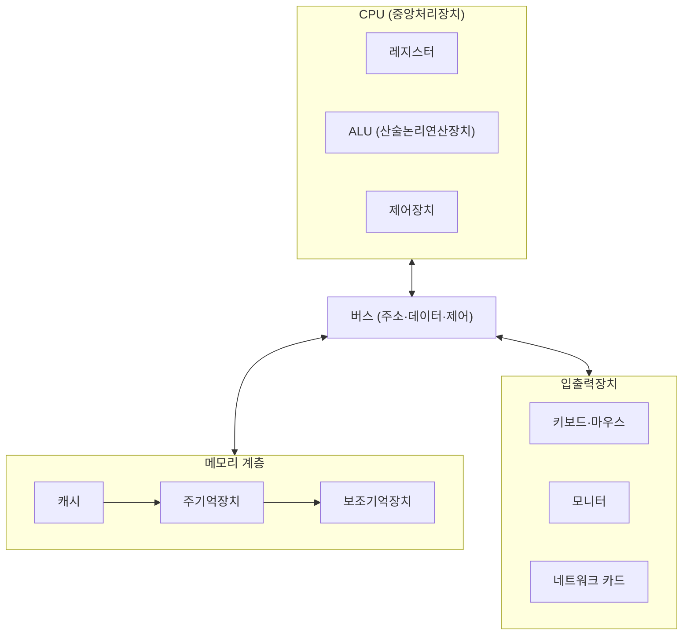
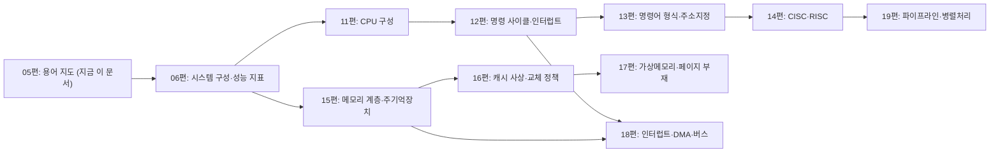

## 왜 전체 지도를 먼저 그려야 하는가

지금까지 01~04편에서는 진법, 논리게이트, 문자코드·오류검출, 부동소수점이라는 **표현 방법**을 배웠다. 이제부터는 이 표현된 데이터를 실제로 처리하는 **컴퓨터 시스템의 구조**로 넘어갈 차례다.

## 컴퓨터 시스템의 네 가지 큰 구성 요소

컴퓨터 시스템은 크게 네 가지 요소로 나눠 이해할 수 있다. **CPU**(중앙처리장치), **메모리**(기억장치), **버스**(연결 통로), **입출력장치**(I/O, Input/Output)다.

### CPU — 계산과 판단을 담당하는 두뇌

**CPU**(Central Processing Unit, 중앙처리장치)는 프로그램의 명령어를 하나씩 읽어(인출), 그 명령이 무슨 뜻인지 해석하고(해독), 실제로 계산이나 데이터 이동을 수행하는(실행) 부품이다. 사람으로 비유하면 요리 레시피(프로그램)를 한 줄씩 읽고, 그 줄이 "썰어라"인지 "끓여라"인지 이해한 뒤, 실제로 손을 움직여 그 동작을 하는 요리사에 해당한다.

CPU 내부는 다시 여러 부품으로 나뉜다. 계산을 실제로 수행하는 **ALU**(Arithmetic Logic Unit, 산술논리연산장치), 데이터를 임시로 담아 두는 아주 빠른 저장 공간인 **레지스터**(register), 그리고 명령어의 흐름과 각 부품의 동작 순서를 지휘하는 **제어장치**(control unit)로 구성된다.

### 메모리 — 데이터와 명령어를 저장하는 공간

**메모리**(memory, 기억장치)는 프로그램의 명령어와 데이터를 저장해 두는 공간이다. CPU에 가장 가까운 **레지스터**가 가장 빠르지만 용량이 극히 작고, 그다음으로 **캐시**(cache)가 빠르고 작으며, **주기억장치**(main memory, 흔히 RAM으로 부르는 영역)가 그보다 느리지만 훨씬 크고, 마지막으로 하드디스크·SSD 같은 **보조기억장치**(secondary storage)가 가장 느리지만 가장 큰 용량을 갖는다.

이렇게 계층을 나누는 이유는 "빠르면서도 큰 메모리"를 만드는 비용이 지나치게 비싸기 때문이다. 이 메모리 계층 전체는 15편(기억장치 계층과 주기억장치)에서, 그중 캐시는 16편(캐시 사상과 교체 정책)에서, 물리적인 메모리 용량의 한계를 극복하는 가상메모리는 17편(가상메모리와 페이지 부재)에서 각각 다룬다.

### 버스 — 부품들을 잇는 공용 통로

**버스**(bus)는 CPU, 메모리, 입출력장치 사이에서 데이터를 주고받는 통로다. 여러 대의 버스(회사 버스가 아니라 교통수단 버스)가 하나의 정해진 노선을 오가며 승객을 실어 나르는 것처럼, 컴퓨터의 버스도 정해진 규칙에 따라 여러 부품 사이에서 신호를 실어 나른다. 버스는 역할에 따라 세 가지로 나뉜다.

- **주소 버스**(address bus): "어디에 있는 데이터를 다룰 것인가"라는 위치 정보(메모리 주소)를 전달한다.
- **데이터 버스**(data bus): 실제로 주고받을 값(데이터) 자체를 전달한다.
- **제어 버스**(control bus): "지금 읽는 중인지 쓰는 중인지" 같은 동작 신호와 타이밍 정보를 전달한다.

이 세 버스는 항상 함께 움직인다. 버스의 세부 구조와 전송 방식 계산은 18편(입출력 구조: 인터럽트·DMA·버스)에서 다룬다.

### 입출력장치 — 컴퓨터와 외부 세계를 잇는 창구

**입출력장치**(I/O device)는 키보드·마우스·모니터·프린터·네트워크 카드처럼 컴퓨터와 외부 세계 사이에서 정보를 주고받는 장치다. 이를 해결하는 대표적인 두 가지 방법이 **인터럽트**(interrupt, CPU가 장치의 요청이 있을 때만 반응하는 방식)와 **DMA**(Direct Memory Access, 직접기억장치접근, CPU를 거치지 않고 장치와 메모리가 직접 데이터를 주고받는 방식)다.

## 시스템 블록도로 전체 구조 읽기

지금까지 설명한 네 요소가 서로 어떻게 연결되는지 **블록도**(block diagram)로 그려 보면 다음과 같다.

```mermaid
flowchart TB
    subgraph CPU["CPU (중앙처리장치)"]
        REG["레지스터"]
        ALU["ALU (산술논리연산장치)"]
        CU["제어장치"]
    end

    subgraph MEM["메모리 계층"]
        CACHE["캐시"]
        RAM["주기억장치"]
        DISK["보조기억장치"]
    end

    subgraph IO["입출력장치"]
        KB["키보드·마우스"]
        DISP["모니터"]
        NET["네트워크 카드"]
    end

    BUS["버스 (주소·데이터·제어)"]

    CPU <--> BUS
    BUS <--> MEM
    BUS <--> IO
    CACHE --> RAM
    RAM --> DISK
```

이 블록도에서 눈여겨볼 점은 세 가지다. 첫째, **CPU와 메모리, CPU와 입출력장치가 직접 연결되지 않고 반드시 버스를 거친다**는 것이다.

## 폰노이만 구조 — 이 지도의 이론적 뿌리

지금 그린 블록도는 우연히 이런 모양이 된 것이 아니라, **폰노이만 구조**(von Neumann architecture)라는 컴퓨터 설계 원칙을 따른 것이다. 폰노이만 구조의 핵심은 "**프로그램(명령어)과 데이터를 같은 메모리에 함께 저장하고, CPU가 이 메모리에서 명령어를 하나씩 순서대로 꺼내 처리한다**"는 것이다.

## 구조 용어 관계도 — 이 과목의 전체 흐름

앞으로 나올 본론 편들이 이 지도의 어느 부분을 다루는지 관계도로 정리하면 다음과 같다.

```mermaid
flowchart LR
    T05["05편: 용어 지도 (지금 이 문서)"] --> T06["06편: 시스템 구성·성능 지표"]
    T06 --> T11["11편: CPU 구성"]
    T11 --> T12["12편: 명령 사이클·인터럽트"]
    T12 --> T13["13편: 명령어 형식·주소지정"]
    T13 --> T14["14편: CISC·RISC"]
    T06 --> T15["15편: 메모리 계층·주기억장치"]
    T15 --> T16["16편: 캐시 사상·교체 정책"]
    T16 --> T17["17편: 가상메모리·페이지 부재"]
    T12 --> T18["18편: 인터럽트·DMA·버스"]
    T15 --> T18
    T14 --> T19["19편: 파이프라인·병렬처리"]
```

이 관계도를 보면, CPU 계열(11~14편)과 메모리 계열(15~17편)이 각각 06편에서 갈라져 나가고, 18편(입출력)은 12편의 인터럽트 개념과 15편의 메모리 개념을 모두 필요로 하며, 19편(파이프라인)은 12편과 14편의 개념을 종합한다는 것을 알 수 있다. 이렇게 앞 편의 개념이 뒤 편에서 재사용되는 구조이므로, 각 편을 순서대로 읽어 나가면 자연스럽게 지식이 쌓인다.

## 자주 틀리는 점

- **CPU와 메모리가 직접 통신한다고 오해하는 실수**: 실제로는 반드시 버스를 거쳐 통신하며, 이 버스의 대역폭과 속도가 시스템 전체 성능의 병목이 될 수 있다.
- **메모리를 하나의 균일한 저장 공간으로 오해하는 실수**: 메모리는 레지스터·캐시·주기억장치·보조기억장치로 이어지는 계층 구조이며, 각 계층은 속도·용량·가격이 서로 다르다.
- **인터럽트와 DMA를 같은 개념으로 혼동하는 실수**: 인터럽트는 CPU가 장치의 요청에 반응하는 방식이고, DMA는 CPU를 거치지 않고 장치와 메모리가 직접 데이터를 주고받는 방식이다. 이 둘은 18편에서 정면으로 비교한다.
- **폰노이만 구조를 단순히 "옛날 컴퓨터 이름" 정도로 여기는 실수**: 폰노이만 구조는 지금도 대부분의 범용 컴퓨터가 따르는 설계 원칙으로, 프로그램과 데이터를 같은 메모리에 저장한다는 개념 자체가 핵심이다.

## 핵심 정리

- 컴퓨터 시스템은 CPU(계산·판단), 메모리(저장), 버스(연결 통로), 입출력장치(외부와의 창구)라는 네 가지 큰 요소로 이해할 수 있다.
- 버스는 주소 버스·데이터 버스·제어 버스로 나뉘며, CPU와 메모리·입출력장치 사이의 모든 통신은 버스를 거친다.
- 메모리는 레지스터-캐시-주기억장치-보조기억장치로 이어지는 속도·용량 계층 구조를 이룬다.
- 폰노이만 구조는 프로그램과 데이터를 같은 메모리에 저장하고 CPU가 순서대로 처리한다는 원칙으로, 이 과목 전체 구조의 이론적 뿌리다.
- 06편부터는 이 지도의 각 부분(CPU 계열, 메모리 계열, 입출력 계열)을 순서대로 깊게 파고든다.

## 마무리 복습

<Quiz
  questionNumber={1}
  question={"컴퓨터 시스템에서 CPU와 메모리, CPU와 입출력장치 사이의 통신에 대한 설명으로 옳은 것은?"}
  options={["CPU와 각 장치는 전용 배선으로 직접 연결된다","CPU와 장치 사이의 모든 통신은 버스라는 공용 통로를 거친다","CPU는 메모리와만 통신하고 입출력장치와는 통신하지 않는다","버스는 데이터 전송에만 쓰이고 주소나 제어 신호는 별도 경로로 전달된다"]}
  correctAnswer={2}
  explanation={"버스는 CPU, 메모리, 입출력장치 사이의 공용 통로로, 주소 버스·데이터 버스·제어 버스가 함께 동작하며 모든 통신이 이 버스를 거쳐 이뤄진다."}
/>

<Quiz
  questionNumber={2}
  question={"메모리 계층에서 속도가 가장 빠르지만 용량이 가장 작은 계층은?"}
  options={["보조기억장치","주기억장치","캐시","레지스터"]}
  correctAnswer={4}
  explanation={"메모리 계층은 CPU에 가까울수록 빠르고 작아진다. 레지스터는 CPU 내부에 있어 가장 빠르지만 용량이 극히 작고, 그다음이 캐시, 주기억장치, 보조기억장치 순으로 느려지면서 용량은 커진다."}
/>

<Quiz
  questionNumber={3}
  question={"주소 버스, 데이터 버스, 제어 버스의 역할을 옳게 짝지은 것은?"}
  options={["주소 버스는 데이터 값 자체를 전달하고, 데이터 버스는 위치 정보를 전달한다","주소 버스는 위치 정보를, 데이터 버스는 실제 값을, 제어 버스는 동작 신호를 전달한다","제어 버스는 데이터 값을 전달하고 데이터 버스는 타이밍 신호를 전달한다","세 버스는 모두 같은 정보를 중복해서 전달한다"]}
  correctAnswer={2}
  explanation={"주소 버스는 어디에 있는 데이터를 다룰지에 대한 위치 정보를, 데이터 버스는 실제 값 자체를, 제어 버스는 읽기·쓰기 같은 동작 신호와 타이밍 정보를 전달한다."}
/>

## 참고 자료

- [국가평생교육진흥원 독학학위제 - 과목별 평가영역](https://bdes.nile.or.kr/nile/study/nStudy2_1.do) — 독학사 과목별 평가영역을 확인하는 공식 페이지로, 이 지도 편의 범위 설계 기준이 되었다.
- [국가평생교육진흥원 독학학위제 - 출제방향/수준](https://bdes.nile.or.kr/nile/study/nStudy1_1.do) — 독학사 시험의 평가수준과 출제방향을 설명하는 공식 자료.
