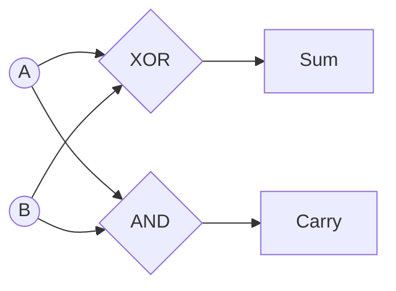

<Callout type="info">
  **이번 문서의 목표:** 이 파일을 다 읽으면 논리식을 카르노맵으로 실제 간소화하고, 반가산기·전가산기의 진리표를 직접 만들며, 디코더·멀티플렉서의 동작 원리를 설명할 수 있다.
</Callout>

## 왜 논리식을 간소화해야 할까

02편에서 AND·OR·NOT 게이트와 진리표(truth table), 드모르간 법칙(De Morgan's law)을 다뤘다. 논리식을 그대로 회로로 옮기면 동작은 하지만, 게이트 수가 많아져 회로가 커지고 느려지고 전력을 더 먹는다. **간소화**(minimization)는 같은 동작을 하면서 게이트 수를 최소로 줄이는 작업이다.

불 대수(Boolean algebra) 공식을 이용한 대수적 간소화는 식이 복잡해지면 사람이 실수하기 쉽다. 이 문제를 그림으로 풀어내는 방법이 **카르노맵**(Karnaugh map, K-map)이다.

## 카르노맵: 진리표를 격자에 옮겨 눈으로 묶는다

> **쉽게 말하면:** 진리표의 결과 값(0과 1)을 특수한 순서로 배열된 격자에 옮겨 적고, 인접한 1들을 사각형으로 묶으면 그 묶음이 곧 간소화된 항이 된다.

### 정의: 그레이 코드 순서가 핵심이다

카르노맵의 가로축과 세로축은 **그레이 코드(Gray code)** 순서로 배열한다. 그레이 코드란 인접한 두 값 사이에 딱 1비트만 달라지도록 만든 이진수 배열이다. 2변수라면 `00, 01, 11, 10` 순서다(일반적인 이진수 순서인 `00, 01, 10, 11`이 아니라는 점이 핵심이다). 이렇게 배열하면 격자에서 물리적으로 이웃한 칸은 항상 논리적으로도 1비트 차이만 나므로, 이웃한 1들을 묶었을 때 겹치는 변수만 남기고 달라지는 변수를 소거할 수 있다.

### 실제 예제: 3변수 함수 간소화하기

다음 진리표로 표현되는 함수 $F(A, B, C)$를 간소화해보자.

| A | B | C | F |
|---|---|---|---|
| 0 | 0 | 0 | 0 |
| 0 | 0 | 1 | 1 |
| 0 | 1 | 0 | 0 |
| 0 | 1 | 1 | 1 |
| 1 | 0 | 0 | 0 |
| 1 | 0 | 1 | 1 |
| 1 | 1 | 0 | 1 |
| 1 | 1 | 1 | 1 |

**1단계: 최소항(minterm)을 표시한다.** $F=1$인 행을 모으면 $A,B,C$ 조합이 $(0,0,1), (0,1,1), (1,0,1), (1,1,0), (1,1,1)$인 다섯 경우다.

**2단계: 3변수 카르노맵을 그린다.** 세로축은 $A$(0 또는 1), 가로축은 $BC$를 그레이 코드 순서(`00, 01, 11, 10`)로 배열한다.

| A＼BC | 00 | 01 | 11 | 10 |
|---|---|---|---|---|
| 0 | 0 | 1 | 1 | 0 |
| 1 | 0 | 1 | 1 | 1 |

각 칸의 값은 해당 $(A,B,C)$ 조합에서 $F$의 값이다. 예를 들어 $A=0$행, $BC=01$열은 $(A,B,C)=(0,0,1)$이므로 진리표에서 $F=1$이다.

**3단계: 인접한 1들을 가장 큰 사각형으로 묶는다.** 묶는 칸의 개수는 항상 2의 거듭제곱(1, 2, 4, 8, ...)이어야 하고, 클수록 더 많은 변수가 소거되어 더 간단한 항이 된다. 카르노맵은 좌우·상하로 **원통처럼 이어진다**는 점도 잊지 말아야 한다(맨 왼쪽 열과 맨 오른쪽 열도 인접한 것으로 취급).

- **묶음 1**: $BC=01$열과 $BC=11$열(각 열의 A=0, A=1 모두 1)이 함께 4칸 사각형(A=0,1 두 행 × BC=01,11 두 열)을 이룬다. 이 네 칸에서 $A$는 0과 1이 섞여 있으므로 소거되고, $C$는 두 열 모두 1이므로 소거되지 않고 남으며, $B$는 01열에서 0, 11열에서 1로 섞여 있어 소거된다. 남는 것은 $C$뿐이다. → 이 묶음은 $C$ 항이 된다.
- **묶음 2**: $A=1$행에서 $BC=11$과 $BC=10$이 인접한 2칸을 이룬다. 이 두 칸에서 $A$는 둘 다 1이므로 남고, $B$는 둘 다 1이므로 남고, $C$는 1과 0으로 섞여 소거된다. 남는 것은 $A$와 $B$다. → 이 묶음은 $AB$ 항이 된다.

**4단계: 묶음들을 OR로 연결한다.** 두 묶음을 합치면 모든 1칸이 적어도 한 번씩 포함되므로 간소화가 끝난다.

$$
F = C + AB
$$

**결과 해석**: 원래 진리표대로 회로를 짜면 최소항 5개를 각각 AND-OR로 구현해야 하지만(3입력 AND 게이트 5개 + 5입력 OR 게이트 1개), 간소화한 결과는 **OR 게이트 1개와 2입력 AND 게이트 1개**만으로 구현된다. 게이트 수가 극적으로 줄어드는 것이 카르노맵의 실질적인 효과다.

### 자주 틀리는 점

- 그레이 코드 순서를 무시하고 `00, 01, 10, 11`로 배열하면, 물리적으로 이웃한 칸이 논리적으로는 2비트 차이가 나서 잘못된 묶음을 만들게 된다.
- 카르노맵이 **원통 구조**라는 것을 잊고 맨 끝 열끼리는 인접하지 않다고 착각하는 경우가 흔하다. 4변수 맵에서는 상하좌우 모두 원통으로 이어진다.
- 묶음은 반드시 2의 거듭제곱 크기(1, 2, 4, 8)여야 하며, 3칸이나 5칸처럼 애매한 크기로 묶을 수 없다.

## 조합논리회로: 출력이 오직 현재 입력에만 의존한다

> **쉽게 말하면:** 조합논리회로는 이전 상태를 기억하지 않고, 지금 입력이 무엇이냐에 따라 즉시 출력이 정해지는 회로다.

**조합논리회로**(combinational logic circuit)는 AND·OR·NOT 같은 게이트의 조합으로 만들어지며, 출력이 오직 **현재 입력값**에 의해서만 결정된다. 이전에 어떤 입력이 들어왔는지는 전혀 영향을 주지 않는다(이 점이 10편에서 다룰, 이전 상태를 기억하는 순서논리회로와 결정적으로 다른 부분이다).

## 반가산기: 두 비트를 더하는 가장 단순한 회로

> **쉽게 말하면:** 반가산기는 자리올림 입력을 고려하지 않고, 두 비트를 더해 합과 자리올림을 출력하는 가장 기본적인 덧셈 회로다.

**반가산기**(Half Adder, HA)는 입력 두 개($A$, $B$)를 받아 합(Sum)과 자리올림(Carry)을 출력한다. "반(half)"이라는 이름은 이전 자리에서 넘어오는 자리올림 입력을 받지 않는다는 뜻에서 붙었다.

### 반가산기 진리표

| A | B | Sum(합) | Carry(자리올림) |
|---|---|---|---|
| 0 | 0 | 0 | 0 |
| 0 | 1 | 1 | 0 |
| 1 | 0 | 1 | 0 |
| 1 | 1 | 0 | 1 |

이 진리표를 보면 **Sum은 XOR(배타적 논리합) 연산과 정확히 일치**하고, **Carry는 AND 연산과 정확히 일치**한다는 것을 알 수 있다.

$$
Sum = A \oplus B
$$

$$
Carry = A \cdot B
$$

- $\oplus$: XOR(배타적 논리합), 두 입력이 다르면 1, 같으면 0
- $\cdot$: AND(논리곱), 두 입력이 모두 1일 때만 1

## 전가산기: 이전 자리의 자리올림까지 받는다

> **쉽게 말하면:** 전가산기는 두 비트에 더해 이전 자리에서 넘어온 자리올림까지 세 개의 입력을 받아 합과 자리올림을 계산하는, 실제 다중 비트 덧셈에 쓰이는 회로다.

**전가산기**(Full Adder, FA)는 입력 세 개($A$, $B$, $C_{in}$)를 받는다. $C_{in}$은 이전 자리에서 넘어온 자리올림(carry in)이다. 07편의 비트열 뺄셈·덧셈 표에서 이미 손으로 계산해 본 "자리올림을 반영한 덧셈"이 바로 전가산기가 실제로 하는 일이다.

### 전가산기 진리표

| A | B | $C_{in}$ | Sum | $C_{out}$ |
|---|---|---|---|---|
| 0 | 0 | 0 | 0 | 0 |
| 0 | 0 | 1 | 1 | 0 |
| 0 | 1 | 0 | 1 | 0 |
| 0 | 1 | 1 | 0 | 1 |
| 1 | 0 | 0 | 1 | 0 |
| 1 | 0 | 1 | 0 | 1 |
| 1 | 1 | 0 | 0 | 1 |
| 1 | 1 | 1 | 1 | 1 |

이 진리표를 카르노맵으로 간소화하면 다음 식이 나온다(전가산기는 반가산기 2개와 OR 게이트 1개로도 구현할 수 있다는 것이 시험에서 자주 나오는 포인트다).

$$
Sum = A \oplus B \oplus C_{in}
$$

$$
C_{out} = AB + BC_{in} + AC_{in}
$$

**결과 해석**: $C_{out}$ 식은 "세 입력 중 적어도 두 개가 1이면 자리올림이 발생한다"는 뜻이다(다수결 회로, majority circuit와 같은 형태). 8비트, 16비트, 32비트 덧셈기는 이 전가산기를 여러 개 사슬처럼 연결해서(리플 캐리 가산기, ripple carry adder) 만든다. $n$비트를 더하려면 전가산기 $n$개를 연결하고, 최하위 비트만 반가산기(자리올림 입력이 없으므로)로 대체할 수도 있다.

## 디코더: 이진 코드를 하나의 활성 출력선으로 바꾼다

> **쉽게 말하면:** 디코더는 n개의 입력 조합 중 정확히 하나에 해당하는 출력선 하나만 켜는 회로다.

**디코더**(decoder)는 $n$개의 입력으로 $2^n$개의 출력 중 정확히 하나만 활성화(1)시키는 회로다. 예를 들어 **2대4 디코더**는 입력 2비트로 4개의 출력선 중 하나만 켠다.

| 입력 A | 입력 B | $Y_0$ | $Y_1$ | $Y_2$ | $Y_3$ |
|---|---|---|---|---|---|
| 0 | 0 | 1 | 0 | 0 | 0 |
| 0 | 1 | 0 | 1 | 0 | 0 |
| 1 | 0 | 0 | 0 | 1 | 0 |
| 1 | 1 | 0 | 0 | 0 | 1 |

디코더는 메모리 주소 해독(어느 메모리 칩을 선택할지), 명령어 해독(어느 연산인지 구분) 등에 널리 쓰인다. 실제로 CPU의 제어장치(control unit)가 명령어의 오퍼코드(operation code)를 해석해 알맞은 제어신호를 켜는 과정이 디코더의 확장된 형태다.

## 멀티플렉서: 여러 입력 중 하나를 선택해 내보낸다

> **쉽게 말하면:** 멀티플렉서는 여러 개의 입력 신호 중 선택 신호가 지정한 하나만 골라 출력으로 내보내는 회로로, 디코더와 정반대 역할을 한다.

**멀티플렉서**(Multiplexer, MUX)는 $2^n$개의 데이터 입력과 $n$개의 선택선(select line)을 받아, 선택선이 지정하는 데이터 입력 하나만 출력으로 내보낸다. 예를 들어 **4대1 멀티플렉서**는 데이터 입력 4개($D_0, D_1, D_2, D_3$)와 선택선 2개($S_1, S_0$)를 가진다.

| $S_1$ | $S_0$ | 출력 |
|---|---|---|
| 0 | 0 | $D_0$ |
| 0 | 1 | $D_1$ |
| 1 | 0 | $D_2$ |
| 1 | 1 | $D_3$ |

멀티플렉서는 여러 개의 레지스터 값 중 하나를 골라 ALU에 보내는 등, CPU 내부에서 데이터의 경로를 선택하는 데 핵심적으로 쓰인다. 생활 속 비유로는 여러 개의 TV 채널(입력) 중 리모컨의 채널 버튼(선택선)으로 하나만 화면(출력)에 띄우는 것과 같다.

### 비교: 디코더 vs 멀티플렉서

| 구분 | 디코더 | 멀티플렉서 |
|---|---|---|
| 입력 | $n$개(작은 수) | $2^n$개의 데이터 + $n$개의 선택선 |
| 출력 | $2^n$개(그중 하나만 활성화) | 1개 |
| 역할 | 하나의 코드를 여러 선 중 하나로 "펼친다" | 여러 입력 중 하나를 "골라 모은다" |
| 관계 | 서로 정반대(역함수 같은) 역할 | 서로 정반대(역함수 같은) 역할 |

## 핵심 정리

- 카르노맵은 그레이 코드 순서로 배열한 격자에서 인접한 1들을 2의 거듭제곱 크기로 묶어 논리식을 간소화하는 방법이며, 좌우·상하가 원통처럼 이어진다는 점에 주의해야 한다.
- 반가산기는 $Sum = A \oplus B$, $Carry = AB$로 자리올림 입력 없이 두 비트를 더하고, 전가산기는 $C_{in}$까지 받아 $Sum = A \oplus B \oplus C_{in}$, $C_{out} = AB + BC_{in} + AC_{in}$로 계산한다.
- 디코더는 $n$비트 입력으로 $2^n$개 출력선 중 하나만 활성화시키고, 멀티플렉서는 정반대로 여러 데이터 입력 중 선택선이 지정한 하나만 출력한다.

## 마무리 복습

<Quiz
  questionNumber={1}
  question="카르노맵(K-map)의 가로축·세로축을 그레이 코드 순서로 배열하는 이유로 가장 적절한 것은?"
  options={['계산 속도를 빠르게 하기 위해서다', '물리적으로 인접한 칸이 항상 1비트만 차이 나게 만들어 인접한 1들을 올바르게 묶을 수 있게 하기 위해서다', '입력 변수의 개수를 줄이기 위해서다', '진리표의 행 순서를 그대로 유지하기 위해서다']}
  correctAnswer={2}
  explanation="그레이 코드 순서(00, 01, 11, 10)로 배열하면 인접한 칸이 항상 1비트 차이만 나므로, 이웃한 1을 묶었을 때 정확히 소거되는 변수와 남는 변수를 구분할 수 있다."
  optionExplanations={['그레이 코드 배열은 계산 속도가 아니라 논리적으로 올바른 묶음을 만들기 위한 것이다', '정답이다. 1비트 차이만 나는 인접성이 카르노맵 묶음의 핵심 원리다', '카르노맵의 축은 입력 변수의 개수를 그대로 반영하며 줄이지 않는다', '일반 이진수 순서(00,01,10,11)가 아니라 그레이 코드 순서로 바뀐다는 것이 핵심이다']}
/>

<Quiz
  questionNumber={2}
  question="반가산기(Half Adder)의 출력 Sum과 Carry를 논리식으로 바르게 나타낸 것은?"
  options={['Sum = A AND B, Carry = A XOR B', 'Sum = A XOR B, Carry = A AND B', 'Sum = A OR B, Carry = A XOR B', 'Sum = A XOR B, Carry = A OR B']}
  correctAnswer={2}
  explanation="반가산기의 진리표를 보면 Sum은 XOR과, Carry는 AND와 정확히 일치한다. Sum = A xor B, Carry = A and B다."
  optionExplanations={['Sum과 Carry의 논리 연산이 서로 뒤바뀌었다', '정답이다. 반가산기의 Sum은 XOR, Carry는 AND에 해당한다', 'Sum은 OR가 아니라 XOR이다. A=1, B=1일 때 OR는 1이지만 실제 Sum은 0이어야 한다', 'Carry는 OR가 아니라 AND다. A=1, B=0일 때 OR는 1이지만 실제 Carry는 0이어야 한다']}
/>

<Quiz
  questionNumber={3}
  question="전가산기(Full Adder)가 반가산기와 다른 점으로 옳은 것은?"
  options={['출력이 Sum 하나뿐이다', '입력으로 이전 자리의 자리올림(Carry in)까지 받아 세 개의 입력을 처리한다', '오직 뺄셈 연산에만 사용된다', 'AND 게이트만으로 구현된다']}
  correctAnswer={2}
  explanation="전가산기는 A, B에 더해 이전 자리에서 넘어온 Carry in까지 세 개의 입력을 받아 Sum과 Carry out을 계산하며, 이 덕분에 여러 비트를 사슬처럼 연결한 다중 비트 덧셈기를 만들 수 있다."
  optionExplanations={['전가산기와 반가산기 모두 Sum과 Carry 두 개의 출력을 갖는다', '정답이다. Carry in을 받는 것이 전가산기와 반가산기의 핵심 차이다', '전가산기는 2의 보수 덧셈 방식을 통해 뺄셈에도 활용되지만 덧셈 회로 자체는 범용적으로 쓰인다', 'AND, OR, XOR 게이트가 조합되어 구현되며 AND만으로는 만들 수 없다']}
/>

<Quiz
  questionNumber={4}
  question="2대4 디코더(2-to-4 decoder)에 대한 설명으로 옳은 것은?"
  options={['2개의 입력으로 4개의 출력 중 정확히 하나만 활성화시킨다', '4개의 입력 중 하나를 선택해 2개의 출력으로 내보낸다', '입력과 출력의 개수가 항상 같다', '자리올림을 계산하는 회로다']}
  correctAnswer={1}
  explanation="디코더는 n비트 입력으로 2^n개의 출력 중 정확히 하나만 활성화시키는 회로다. 2대4 디코더는 2비트 입력으로 4개의 출력선 중 하나만 켠다."
  optionExplanations={['정답이다. 2비트 입력 조합마다 4개의 출력 중 하나만 1이 된다', '이는 멀티플렉서(4대1 MUX)에 대한 설명이며 디코더와는 역할이 반대다', '디코더는 입력 개수보다 출력 개수가 지수적으로($2^n$) 많다', '자리올림 계산은 가산기(adder)의 역할이며 디코더와는 무관하다']}
/>

<Quiz
  questionNumber={5}
  question="4대1 멀티플렉서(4-to-1 MUX)에서 선택선 S1S0 = 10일 때 출력으로 나오는 데이터는?"
  options={['D0', 'D1', 'D2', 'D3']}
  correctAnswer={3}
  explanation="4대1 멀티플렉서의 선택선-출력 대응표에서 S1S0 = 10(십진수 2)일 때 D2가 출력으로 선택된다."
  optionExplanations={['S1S0 = 00일 때 선택되는 것은 D0이다', 'S1S0 = 01일 때 선택되는 것은 D1이다', '정답이다. S1S0 = 10일 때 D2가 선택된다', 'S1S0 = 11일 때 선택되는 것은 D3이다']}
/>

<Quiz
  questionNumber={6}
  question="다음 카르노맵 간소화 결과 중, 3변수 함수에서 4칸(2x2)을 하나로 묶었을 때 일어나는 일로 옳은 것은?"
  options={['3개의 변수가 모두 그대로 남는다', '변하지 않고 공통으로 유지되는 변수 1개만 남고 나머지 2개 변수는 소거된다', '변수가 모두 소거되어 상수 1만 남는다', '묶은 칸의 개수만큼 변수가 추가된다']}
  correctAnswer={2}
  explanation="카르노맵에서 2^k칸을 묶으면 k개의 변수가 소거되고 나머지 변수만 남는다. 4칸(2^2)을 묶으면 2개의 변수가 소거되어 남은 변수 1개만 항으로 남는다."
  optionExplanations={['4칸을 묶으면 그 안에서 값이 바뀌는 변수들은 소거되고 일부만 남는다', '정답이다. 2^2=4칸 묶음은 2개 변수를 소거하고 1개 변수만 남긴다', '8칸(2^3)을 전부 묶어 모든 변수가 소거될 때만 상수 1이 남는다', '카르노맵 간소화는 변수를 소거하는 과정이며 추가하지 않는다']}
/>

## 참고 자료

- [국가평생교육진흥원 독학학위제 - 출제방향/수준](https://bdes.nile.or.kr/nile/study/nStudy1_1.do)
- [MDN Web Docs](https://developer.mozilla.org/)
