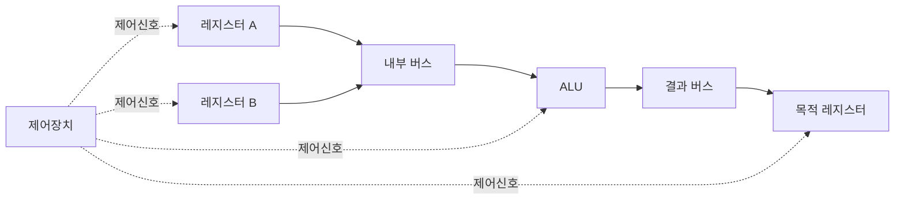

<Callout type="info">
  **이번 문서의 목표:** 이 파일을 다 읽으면 CPU(Central Processing Unit, 중앙처리장치) 내부를 레지스터·ALU·제어장치·버스로 구성된 데이터패스로 그려낼 수 있고, 하나의 명령어가 마이크로오퍼레이션(micro-operation) 단위로 어떻게 쪼개져 실행되는지 설명할 수 있다.
</Callout>

## 왜 CPU 내부를 다시 뜯어봐야 할까

05편 "컴퓨터구조 용어 지도"에서 CPU를 시스템 블록도의 한 상자로만 다뤘다. 06편에서는 폰노이만 구조와 성능 지표를 다루면서 CPU를 "명령어를 실행하는 장치"로만 취급했다. 하지만 독학사 시험은 **CPU 내부가 어떤 부품으로 이뤄져 있고, 그 부품들이 신호를 주고받아 명령 하나를 어떻게 처리하는지**를 구체적으로 묻는다. 09편·10편에서 배운 조합논리회로(가산기·멀티플렉서)와 순서논리회로(레지스터·플립플롭)가 실제로 CPU 안 어디에 들어가는지 확인하는 것이 이 편의 목표다.

## CPU의 3대 구성요소: 레지스터·ALU·제어장치

> **쉽게 말하면:** CPU는 값을 잠깐 저장하는 레지스터, 계산을 하는 ALU, 그리고 이 둘에게 "언제 무엇을 하라"고 지시하는 제어장치, 이 세 부품이 합쳐진 것이다.

CPU는 크게 세 부분으로 나뉜다.

1. **레지스터**(register): 10편에서 다룬 플립플롭(flip-flop)을 여러 개 묶어 만든, CPU 내부의 초고속 임시 저장 공간이다. 주기억장치(main memory)보다 훨씬 빠르지만 용량은 훨씬 작다.
2. **ALU**(Arithmetic Logic Unit, 산술논리연산장치): 09편에서 배운 가산기(adder) 같은 조합논리회로를 조합해 만든 계산 부품이다. 덧셈·뺄셈 같은 산술 연산과 AND·OR·NOT 같은 논리 연산을 수행한다.
3. **제어장치**(Control Unit, CU): 어떤 레지스터에서 어떤 레지스터로 값을 옮길지, ALU에 어떤 연산을 시킬지를 정하는 "지휘자" 역할이다. 제어장치가 내보내는 신호를 **제어신호**(control signal)라 한다.

<Callout type="warning">
  **CPU와 프로세서(processor)는 같은 뜻으로 쓰이지만, ALU와 CPU를 혼동하는 것이 흔한 실수다.** ALU는 CPU를 구성하는 부품 중 하나일 뿐이고, CPU 전체는 레지스터·ALU·제어장치·내부 버스를 모두 포함한다.
</Callout>

## 레지스터의 종류와 역할

> **쉽게 말하면:** 레지스터는 저마다 정해진 역할이 있고, 그 역할에 따라 이름이 다르다.

시험에 자주 나오는 주요 레지스터를 정리하면 다음과 같다.

| 레지스터 | 영문 표기 | 역할 |
|---|---|---|
| 프로그램 카운터 | PC(Program Counter) | 다음에 실행할 명령어의 주소를 저장 |
| 명령어 레지스터 | IR(Instruction Register) | 방금 인출한 명령어를 저장 |
| 메모리 주소 레지스터 | MAR(Memory Address Register) | 메모리에 접근할 주소를 저장 |
| 메모리 버퍼 레지스터 | MBR(Memory Buffer Register, 또는 MDR) | 메모리와 주고받는 데이터를 임시 저장 |
| 누산기 | AC(Accumulator) | ALU 연산의 결과를 임시로 저장하는 범용 레지스터 |
| 상태 레지스터 | SR(Status Register) 또는 PSW(Program Status Word) | 연산 결과의 부호·자리올림·오버플로 등 플래그(flag)를 저장 |

PC(프로그램 카운터)는 07편에서 배운 2진 카운터(counter)의 실제 응용 사례다. 명령어를 하나 실행할 때마다 PC 값이 자동으로 증가(increment)해서 다음 명령어를 가리킨다. MAR과 MBR은 CPU와 주기억장치 사이의 "문지기" 역할을 하는데, CPU가 메모리에 접근하려면 반드시 이 두 레지스터를 거쳐야 한다.

<Callout type="warning">
  시험 함정: **MAR은 주소만 담고, MBR은 데이터만 담는다.** 이 둘의 역할을 바꿔 서술하는 오답 보기가 자주 나온다.
</Callout>

## 데이터패스: 레지스터와 ALU를 잇는 길

> **쉽게 말하면:** 데이터패스는 레지스터·ALU·버스가 서로 데이터를 주고받을 수 있도록 연결된 통로 전체를 말한다.

**데이터패스**(datapath)란 CPU 내부에서 데이터가 이동하는 경로, 즉 레지스터와 ALU를 연결하는 내부 버스(bus)와 그 사이에 놓인 멀티플렉서(multiplexer)·래치(latch) 등을 통틀어 부르는 말이다. 멀티플렉서는 09편에서 다룬 "여러 입력 중 하나를 선택해 출력하는" 조합논리회로인데, 데이터패스에서는 "이번 클록에는 어느 레지스터의 값을 ALU에 넣을지"를 선택하는 데 쓰인다.

데이터패스를 간단히 그리면 다음과 같은 흐름이 된다.

이 그림에서 화살표는 데이터가 흐르는 방향, 점선 화살표는 제어장치가 "언제 열고 닫을지"를 지시하는 제어신호다. 데이터 자체는 스스로 움직이지 않는다 — **제어신호가 허락해야만** 레지스터에서 버스로, 버스에서 ALU로 데이터가 이동한다.

## 마이크로오퍼레이션: 명령어를 쪼갠 최소 동작 단위

> **쉽게 말하면:** 마이크로오퍼레이션은 "레지스터 하나에서 다른 레지스터로 값을 옮긴다"처럼, 클록 한 번에 끝나는 가장 작은 동작이다.

**마이크로오퍼레이션**(micro-operation)이란 CPU가 한 클록 주기(clock cycle) 안에 수행할 수 있는 가장 작은 단위의 동작이다. 하나의 명령어(instruction)는 겉보기에 "더하라", "저장하라" 같은 한 문장이지만, 실제 하드웨어 수준에서는 여러 개의 마이크로오퍼레이션이 순서대로 실행되어야 완성된다.

마이크로오퍼레이션은 흔히 **레지스터 전송 표기법**(Register Transfer Notation, RTN)으로 표현한다. 화살표 `←`는 "오른쪽 값을 왼쪽 레지스터에 저장한다"는 뜻이다.

예를 들어 "메모리에서 데이터를 읽어 누산기(AC)에 더한다"는 동작 하나는 다음과 같은 마이크로오퍼레이션들로 쪼개진다.

<Steps>

### 1단계: 주소를 MAR에 싣는다

`MAR ← IR(주소부)` — 명령어 레지스터(IR)에 들어 있는 주소 필드를 MAR로 옮긴다. 이 순간 "메모리의 어느 칸을 읽을지"가 정해진다.

### 2단계: 메모리에서 데이터를 읽어 MBR에 담는다

`MBR ← M[MAR]` — 여기서 `M[MAR]`은 "MAR이 가리키는 메모리 주소의 내용물"이라는 뜻이다. 이 값이 MBR(메모리 버퍼 레지스터)에 실린다.

### 3단계: ALU가 AC와 MBR을 더한다

`AC ← AC + MBR` — ALU가 기존 누산기 값과 방금 읽어온 MBR 값을 더해, 그 결과를 다시 AC에 저장한다.

</Steps>

이 세 줄이 바로 마이크로오퍼레이션의 실제 표기 예시다. 겉으로는 "메모리 값을 누산기에 더하라"는 명령어 한 줄이지만, 하드웨어는 클록 세 번에 걸쳐 이 세 단계를 순서대로 밟는다. 12편에서 이 마이크로오퍼레이션들이 인출·간접·실행·인터럽트라는 네 가지 사이클로 확장되는 과정을 자세히 다룬다.

<Callout type="warning">
  시험 함정: **마이크로오퍼레이션 하나는 클록 한 번에 끝나야 한다.** `AC ← AC + MBR`처럼 레지스터 전송과 ALU 연산이 동시에 한 줄로 표현되어도, 실제로는 "값을 버스에 실어 ALU로 보내고, ALU가 계산하고, 결과를 레지스터에 되쓰는" 여러 하드웨어 동작이 한 클록 안에 병렬로 일어나는 것이지, 여러 클록에 걸치는 것이 아니다. 반면 1단계·2단계·3단계처럼 서로 다른 줄로 나뉜 마이크로오퍼레이션은 원칙적으로 서로 다른 클록에서 실행된다.
</Callout>

## 제어장치가 마이크로오퍼레이션을 지휘하는 방법

> **쉽게 말하면:** 제어장치는 "지금이 몇 번째 단계인지"를 알고 있다가, 그 단계에 맞는 제어신호를 내보내 정확한 순서로 마이크로오퍼레이션이 실행되게 만든다.

제어장치는 내부에 **제어단계 계수기**(control step counter)를 두고, 이 계수기 값에 따라 서로 다른 제어신호 조합을 내보낸다. 예를 들어 계수기가 $T_0$이면 "MAR ← IR(주소부)"에 필요한 신호를, $T_1$이면 "MBR ← M[MAR]"에 필요한 신호를 내보내는 식이다. 이 계수기는 10편에서 배운 카운터 회로 그 자체이며, 매 클록마다 값이 하나씩 증가하다가 한 명령어의 마이크로오퍼레이션이 모두 끝나면 다시 $T_0$으로 리셋된다.

제어장치가 신호를 만들어내는 방식은 크게 두 가지인데, 이는 14편 "CISC와 RISC, 제어 방식의 차이"에서 하드와이어드(hardwired) 제어와 마이크로프로그램(microprogrammed) 제어로 자세히 비교한다. 여기서는 "제어장치가 클록 단계별로 서로 다른 제어신호를 만들어 데이터패스를 움직인다"는 원리만 기억하면 된다.

### 자주 틀리는 점

- ALU가 스스로 "언제 계산할지" 판단한다고 착각하는 경우가 많다. ALU는 순수한 조합논리회로일 뿐이고, **언제 계산을 시작할지는 전적으로 제어장치의 제어신호가 결정**한다.
- MAR과 MBR을 하나의 레지스터로 착각하거나 역할을 뒤바꿔 기억하는 실수가 잦다. MAR은 "어디를", MBR은 "무엇을"에 해당한다.
- 마이크로오퍼레이션과 명령어(instruction)를 같은 크기의 단위로 착각하면 안 된다. 명령어 하나는 보통 여러 개의 마이크로오퍼레이션으로 이뤄진다.

## 핵심 정리

- CPU는 레지스터(임시 저장)·ALU(계산)·제어장치(지휘)로 구성되며, 이들을 잇는 통로 전체를 데이터패스라 한다.
- PC·IR·MAR·MBR·AC·SR은 각각 정해진 역할이 있으며, 특히 MAR(주소)과 MBR(데이터)의 역할을 구분하는 문제가 자주 나온다.
- 마이크로오퍼레이션은 클록 한 번에 끝나는 최소 동작 단위이며, `MAR ← IR`처럼 레지스터 전송 표기법(RTN)으로 표현한다.
- 제어장치는 제어단계 계수기 값에 따라 서로 다른 제어신호를 내보내, 마이크로오퍼레이션이 정확한 순서로 실행되게 만든다.
- 명령어 하나는 여러 마이크로오퍼레이션의 순차 실행으로 완성되며, 이 흐름은 12편의 명령 사이클에서 인출·간접·실행·인터럽트 단계로 구체화된다.

## 마무리 복습

<Quiz
  questionNumber={1}
  question="CPU를 구성하는 3대 요소로 옳은 것은?"
  options={['레지스터, ALU, 제어장치', '캐시, 주기억장치, 보조기억장치', 'PC, IR, MAR', '버스, 인터럽트, DMA']}
  correctAnswer={1}
  explanation="CPU는 크게 레지스터(임시 저장), ALU(연산), 제어장치(지휘)의 세 부분으로 구성된다."
  optionExplanations={['정답이다. 레지스터·ALU·제어장치가 CPU의 3대 구성요소다', '이는 기억장치 계층의 구성요소이지 CPU 내부 구성요소가 아니다', '이들은 모두 레지스터의 한 종류일 뿐, CPU 전체 구성요소를 나타내지 않는다', '이들은 입출력 및 CPU-메모리 통신과 관련된 개념으로 CPU의 3대 구성요소가 아니다']}
/>

<Quiz
  questionNumber={2}
  question="다음 중 레지스터와 역할의 연결이 옳은 것은?"
  options={['MAR - 메모리와 주고받을 데이터를 저장한다', 'MBR - 메모리에 접근할 주소를 저장한다', 'PC - 다음에 실행할 명령어의 주소를 저장한다', 'IR - 연산 결과의 부호와 오버플로 플래그를 저장한다']}
  correctAnswer={3}
  explanation="PC(프로그램 카운터)는 다음에 실행할 명령어의 주소를 저장하며, 명령어 실행이 끝날 때마다 자동으로 증가한다."
  optionExplanations={['이는 MBR의 역할이다. MAR은 주소를 저장한다', '이는 MAR의 역할이다. MBR은 데이터를 저장한다', '정답이다. PC는 다음 실행할 명령어의 주소를 담는다', '이는 상태 레지스터(SR/PSW)의 역할이다. IR은 인출한 명령어 자체를 저장한다']}
/>

<Quiz
  questionNumber={3}
  question="데이터패스에 대한 설명으로 옳지 않은 것은?"
  options={['레지스터와 ALU를 연결하는 내부 버스와 멀티플렉서 등을 통틀어 부르는 말이다', '데이터는 제어신호의 허락 없이도 스스로 레지스터 사이를 이동할 수 있다', '멀티플렉서는 여러 입력 중 하나를 선택해 ALU로 보내는 역할을 할 수 있다', '제어장치가 내보내는 제어신호에 따라 데이터의 이동 경로가 결정된다']}
  correctAnswer={2}
  explanation="데이터패스에서 데이터는 제어신호가 허락해야만 이동한다. 제어신호 없이 데이터가 스스로 이동한다는 설명은 옳지 않다."
  optionExplanations={['옳은 설명이다. 데이터패스는 내부 버스와 멀티플렉서 등을 포괄하는 개념이다', '정답이다(옳지 않은 설명). 데이터 이동은 반드시 제어신호에 의해 통제된다', '옳은 설명이다. 멀티플렉서는 여러 레지스터 값 중 하나를 골라 ALU로 전달하는 데 쓰인다', '옳은 설명이다. 제어신호가 데이터패스 내 이동 경로를 결정한다']}
/>

<Quiz
  questionNumber={4}
  question="마이크로오퍼레이션에 대한 설명으로 가장 적절한 것은?"
  options={['하나의 프로그램 전체가 완료되는 데 필요한 모든 명령어의 집합이다', 'CPU가 한 클록 주기 안에 수행할 수 있는 가장 작은 단위의 동작이다', '보조기억장치에서 주기억장치로 파일을 옮기는 대규모 작업 단위다', '컴파일러가 고급 언어 코드를 기계어로 변환하는 과정 전체를 말한다']}
  correctAnswer={2}
  explanation="마이크로오퍼레이션은 CPU가 한 클록 주기 안에 수행하는 최소 단위의 동작으로, MAR ← IR과 같은 레지스터 전송으로 표현된다."
  optionExplanations={['이는 프로그램 전체의 개념이지 클록 단위의 최소 동작이 아니다', '정답이다. 마이크로오퍼레이션은 클록 한 번에 끝나는 최소 동작 단위다', '이는 입출력이나 파일 전송과 관련된 개념으로 마이크로오퍼레이션과 무관하다', '이는 컴파일 과정에 대한 설명으로 CPU 내부 동작 단위와 관련이 없다']}
/>

<Quiz
  questionNumber={5}
  question="레지스터 전송 표기법(RTN)으로 'MBR ← M[MAR]'이 의미하는 것은?"
  options={['MBR에 저장된 주소를 MAR에 복사한다', 'MAR이 가리키는 메모리 주소의 내용을 MBR에 저장한다', 'MAR과 MBR의 값을 더해 메모리에 저장한다', 'MBR의 값을 초기화(clear)한다']}
  correctAnswer={2}
  explanation="M[MAR]은 MAR이 가리키는 메모리 주소의 내용물을 뜻하며, 화살표는 오른쪽 값을 왼쪽 레지스터에 저장한다는 의미이므로 이 표기는 메모리 내용을 MBR로 읽어오는 동작이다."
  optionExplanations={['방향이 반대다. 이 표기는 MAR이 아니라 MBR에 값을 저장하는 동작이다', '정답이다. MAR이 가리키는 메모리 위치의 값을 읽어 MBR에 담는 동작이다', '이 표기에는 덧셈 연산이 포함되어 있지 않다', 'M[MAR] 값을 가져오는 동작이지 초기화 동작이 아니다']}
/>

<Quiz
  questionNumber={6}
  question="제어장치가 명령어 실행 단계를 관리하는 방식에 대한 설명으로 옳은 것은?"
  options={['ALU가 스스로 판단해 다음 마이크로오퍼레이션을 실행한다', '제어단계 계수기 값에 따라 서로 다른 제어신호 조합을 내보내 데이터패스를 움직인다', '레지스터가 서로 직접 통신해 제어장치 없이 데이터를 주고받는다', '컴파일러가 실행 시점에 제어신호를 생성해 CPU에 전달한다']}
  correctAnswer={2}
  explanation="제어장치는 내부의 제어단계 계수기 값에 따라 각 단계에 필요한 제어신호를 순서대로 내보내 마이크로오퍼레이션이 올바른 순서로 실행되게 한다."
  optionExplanations={['ALU는 조합논리회로일 뿐 스스로 실행 시점을 판단하지 않는다. 이는 제어장치의 역할이다', '정답이다. 제어단계 계수기가 현재 단계를 추적하고, 그에 맞는 제어신호를 생성한다', '레지스터 간 데이터 이동은 반드시 제어장치의 제어신호를 통해 이뤄진다', '제어신호는 실행 시점에 하드웨어인 제어장치가 생성하며, 컴파일러와는 관련이 없다']}
/>

## 참고 자료

- [국가평생교육진흥원 독학학위제 - 출제방향/수준](https://bdes.nile.or.kr/nile/study/nStudy1_1.do)
- [국가평생교육진흥원 독학학위제 - 과목별 평가영역](https://bdes.nile.or.kr/nile/study/nStudy2_1.do)
