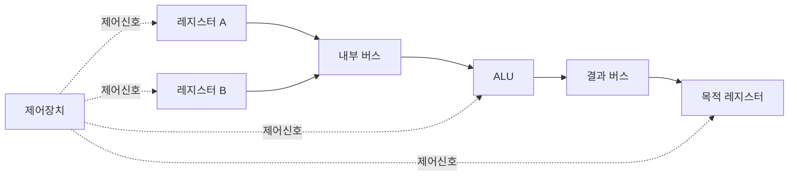

## 왜 CPU 내부를 다시 뜯어봐야 할까

05편 "컴퓨터구조 용어 지도"에서 CPU를 시스템 블록도의 한 상자로만 다뤘다. 06편에서는 폰노이만 구조와 성능 지표를 다루면서 CPU를 "명령어를 실행하는 장치"로만 취급했다.

## CPU의 3대 구성요소: 레지스터·ALU·제어장치

CPU는 크게 세 부분으로 나뉜다.

1. **레지스터**(register): 10편에서 다룬 플립플롭(flip-flop)을 여러 개 묶어 만든, CPU 내부의 초고속 임시 저장 공간이다. 주기억장치(main memory)보다 훨씬 빠르지만 용량은 훨씬 작다.
2. **ALU**(Arithmetic Logic Unit, 산술논리연산장치): 09편에서 배운 가산기(adder) 같은 조합논리회로를 조합해 만든 계산 부품이다. 덧셈·뺄셈 같은 산술 연산과 AND·OR·NOT 같은 논리 연산을 수행한다.
3. **제어장치**(Control Unit, CU): 어떤 레지스터에서 어떤 레지스터로 값을 옮길지, ALU에 어떤 연산을 시킬지를 정하는 "지휘자" 역할이다. 제어장치가 내보내는 신호를 **제어신호**(control signal)라 한다.

<Callout type="warning">
  **CPU와 프로세서(processor)는 같은 뜻으로 쓰이지만, ALU와 CPU를 혼동하는 것이 흔한 실수다.** ALU는 CPU를 구성하는 부품 중 하나일 뿐이고, CPU 전체는 레지스터·ALU·제어장치·내부 버스를 모두 포함한다.
</Callout>

## 레지스터의 종류와 역할

시험에 자주 나오는 주요 레지스터를 정리하면 다음과 같다.

| 레지스터 | 영문 표기 | 역할 |
|---|---|---|
| 프로그램 카운터 | PC(Program Counter) | 다음에 실행할 명령어의 주소를 저장 |
| 명령어 레지스터 | IR(Instruction Register) | 방금 인출한 명령어를 저장 |
| 메모리 주소 레지스터 | MAR(Memory Address Register) | 메모리에 접근할 주소를 저장 |
| 메모리 버퍼 레지스터 | MBR(Memory Buffer Register, 또는 MDR) | 메모리와 주고받는 데이터를 임시 저장 |
| 누산기 | AC(Accumulator) | ALU 연산의 결과를 임시로 저장하는 범용 레지스터 |
| 상태 레지스터 | SR(Status Register) 또는 PSW(Program Status Word) | 연산 결과의 부호·자리올림·오버플로 등 플래그(flag)를 저장 |

PC(프로그램 카운터)는 07편에서 배운 2진 카운터(counter)의 실제 응용 사례다. 명령어를 하나 실행할 때마다 PC 값이 자동으로 증가(increment)해서 다음 명령어를 가리킨다.

<Callout type="warning">
  시험 함정: **MAR은 주소만 담고, MBR은 데이터만 담는다.** 이 둘의 역할을 바꿔 서술하는 오답 보기가 자주 나온다.
</Callout>

## 데이터패스: 레지스터와 ALU를 잇는 길

**데이터패스**(datapath)란 CPU 내부에서 데이터가 이동하는 경로, 즉 레지스터와 ALU를 연결하는 내부 버스(bus)와 그 사이에 놓인 멀티플렉서(multiplexer)·래치(latch) 등을 통틀어 부르는 말이다. 멀티플렉서는 09편에서 다룬 "여러 입력 중 하나를 선택해 출력하는" 조합논리회로인데, 데이터패스에서는 "이번 클록에는 어느 레지스터의 값을 ALU에 넣을지"를 선택하는 데 쓰인다.

데이터패스를 간단히 그리면 다음과 같은 흐름이 된다.

```mermaid
flowchart LR
    REG1[레지스터 A] --> BUS[내부 버스]
    REG2[레지스터 B] --> BUS
    BUS --> ALU[ALU]
    ALU --> BUS2[결과 버스]
    BUS2 --> REG3[목적 레지스터]
    CU[제어장치] -.제어신호.-> REG1
    CU -.제어신호.-> REG2
    CU -.제어신호.-> ALU
    CU -.제어신호.-> REG3
```

이 그림에서 화살표는 데이터가 흐르는 방향, 점선 화살표는 제어장치가 "언제 열고 닫을지"를 지시하는 제어신호다. 데이터 자체는 스스로 움직이지 않는다 — **제어신호가 허락해야만** 레지스터에서 버스로, 버스에서 ALU로 데이터가 이동한다.

## 마이크로오퍼레이션: 명령어를 쪼갠 최소 동작 단위

**마이크로오퍼레이션**(micro-operation)이란 CPU가 한 클록 주기(clock cycle) 안에 수행할 수 있는 가장 작은 단위의 동작이다. 하나의 명령어(instruction)는 겉보기에 "더하라", "저장하라" 같은 한 문장이지만, 실제 하드웨어 수준에서는 여러 개의 마이크로오퍼레이션이 순서대로 실행되어야 완성된다.

마이크로오퍼레이션은 흔히 **레지스터 전송 표기법**(Register Transfer Notation, RTN)으로 표현한다. 화살표 `←`는 "오른쪽 값을 왼쪽 레지스터에 저장한다"는 뜻이다.

예를 들어 "메모리에서 데이터를 읽어 누산기(AC)에 더한다"는 동작 하나는 다음과 같은 마이크로오퍼레이션들로 쪼개진다.

이 세 줄이 바로 마이크로오퍼레이션의 실제 표기 예시다. 겉으로는 "메모리 값을 누산기에 더하라"는 명령어 한 줄이지만, 하드웨어는 클록 세 번에 걸쳐 이 세 단계를 순서대로 밟는다. 12편에서 이 마이크로오퍼레이션들이 인출·간접·실행·인터럽트라는 네 가지 사이클로 확장되는 과정을 자세히 다룬다.

<Callout type="warning">
  시험 함정: **마이크로오퍼레이션 하나는 클록 한 번에 끝나야 한다.** `AC ← AC + MBR`처럼 레지스터 전송과 ALU 연산이 동시에 한 줄로 표현되어도, 실제로는 "값을 버스에 실어 ALU로 보내고, ALU가 계산하고, 결과를 레지스터에 되쓰는" 여러 하드웨어 동작이 한 클록 안에 병렬로 일어나는 것이지, 여러 클록에 걸치는 것이 아니다. 반면 1단계·2단계·3단계처럼 서로 다른 줄로 나뉜 마이크로오퍼레이션은 원칙적으로 서로 다른 클록에서 실행된다.
</Callout>

## 제어장치가 마이크로오퍼레이션을 지휘하는 방법

제어장치는 내부에 **제어단계 계수기**(control step counter)를 두고, 이 계수기 값에 따라 서로 다른 제어신호 조합을 내보낸다. 예를 들어 계수기가 $T_0$이면 "MAR ← IR(주소부)"에 필요한 신호를, $T_1$이면 "MBR ← M[MAR]"에 필요한 신호를 내보내는 식이다.

제어장치가 신호를 만들어내는 방식은 크게 두 가지인데, 이는 14편 "CISC와 RISC, 제어 방식의 차이"에서 하드와이어드(hardwired) 제어와 마이크로프로그램(microprogrammed) 제어로 자세히 비교한다. 여기서는 "제어장치가 클록 단계별로 서로 다른 제어신호를 만들어 데이터패스를 움직인다"는 원리만 기억하면 된다.

### 자주 틀리는 점

- ALU가 스스로 "언제 계산할지" 판단한다고 착각하는 경우가 많다. ALU는 순수한 조합논리회로일 뿐이고, **언제 계산을 시작할지는 전적으로 제어장치의 제어신호가 결정**한다.
- MAR과 MBR을 하나의 레지스터로 착각하거나 역할을 뒤바꿔 기억하는 실수가 잦다. MAR은 "어디를", MBR은 "무엇을"에 해당한다.
- 마이크로오퍼레이션과 명령어(instruction)를 같은 크기의 단위로 착각하면 안 된다. 명령어 하나는 보통 여러 개의 마이크로오퍼레이션으로 이뤄진다.

## 핵심 정리

- CPU는 레지스터(임시 저장)·ALU(계산)·제어장치(지휘)로 구성되며, 이들을 잇는 통로 전체를 데이터패스라 한다.
- PC·IR·MAR·MBR·AC·SR은 각각 정해진 역할이 있으며, 특히 MAR(주소)과 MBR(데이터)의 역할을 구분하는 문제가 자주 나온다.
- 마이크로오퍼레이션은 클록 한 번에 끝나는 최소 동작 단위이며, `MAR ← IR`처럼 레지스터 전송 표기법(RTN)으로 표현한다.
- 제어장치는 제어단계 계수기 값에 따라 서로 다른 제어신호를 내보내, 마이크로오퍼레이션이 정확한 순서로 실행되게 만든다.
- 명령어 하나는 여러 마이크로오퍼레이션의 순차 실행으로 완성되며, 이 흐름은 12편의 명령 사이클에서 인출·간접·실행·인터럽트 단계로 구체화된다.

## 마무리 복습

<Quiz
  questionNumber={1}
  question={"CPU를 구성하는 3대 요소로 옳은 것은?"}
  options={["레지스터, ALU, 제어장치","캐시, 주기억장치, 보조기억장치","PC, IR, MAR","버스, 인터럽트, DMA"]}
  correctAnswer={1}
  explanation={"CPU는 크게 레지스터(임시 저장), ALU(연산), 제어장치(지휘)의 세 부분으로 구성된다."}
/>

<Quiz
  questionNumber={2}
  question={"다음 중 레지스터와 역할의 연결이 옳은 것은?"}
  options={["MAR - 메모리와 주고받을 데이터를 저장한다","MBR - 메모리에 접근할 주소를 저장한다","PC - 다음에 실행할 명령어의 주소를 저장한다","IR - 연산 결과의 부호와 오버플로 플래그를 저장한다"]}
  correctAnswer={3}
  explanation={"PC(프로그램 카운터)는 다음에 실행할 명령어의 주소를 저장하며, 명령어 실행이 끝날 때마다 자동으로 증가한다."}
/>

<Quiz
  questionNumber={3}
  question={"데이터패스에 대한 설명으로 옳지 않은 것은?"}
  options={["레지스터와 ALU를 연결하는 내부 버스와 멀티플렉서 등을 통틀어 부르는 말이다","데이터는 제어신호의 허락 없이도 스스로 레지스터 사이를 이동할 수 있다","멀티플렉서는 여러 입력 중 하나를 선택해 ALU로 보내는 역할을 할 수 있다","제어장치가 내보내는 제어신호에 따라 데이터의 이동 경로가 결정된다"]}
  correctAnswer={2}
  explanation={"데이터패스에서 데이터는 제어신호가 허락해야만 이동한다. 제어신호 없이 데이터가 스스로 이동한다는 설명은 옳지 않다."}
/>

## 참고 자료

- [국가평생교육진흥원 독학학위제 - 출제방향/수준](https://bdes.nile.or.kr/nile/study/nStudy1_1.do)
- [국가평생교육진흥원 독학학위제 - 과목별 평가영역](https://bdes.nile.or.kr/nile/study/nStudy2_1.do)
