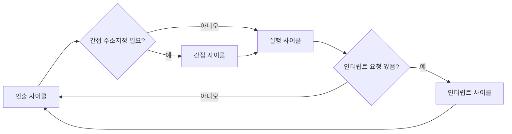

<Callout type="info">
  **이번 문서의 목표:** 이 파일을 다 읽으면 명령어 하나가 인출(fetch)→간접(indirect)→실행(execute)→인터럽트(interrupt) 사이클을 거치는 과정을 마이크로오퍼레이션 단위로 직접 적을 수 있고, 인터럽트가 언제·어떻게 처리되며 우선순위는 어떻게 정해지는지 설명할 수 있다.
</Callout>

## 왜 명령어 실행을 여러 사이클로 나눌까

11편에서 CPU 내부가 레지스터·ALU·제어장치로 이뤄져 있고, 명령어 하나가 여러 마이크로오퍼레이션(micro-operation)의 순차 실행으로 완성된다는 것을 배웠다. 그런데 모든 명령어가 똑같은 마이크로오퍼레이션 묶음을 쓰는 것은 아니다. 어떤 명령어는 메모리에서 값을 딱 한 번만 읽으면 되지만, 어떤 명령어는 "주소가 적힌 곳에 또 다른 주소가 있는" 간접 참조를 거쳐야 한다. 이런 차이를 체계적으로 다루기 위해 명령어 실행 전체를 **인출(Fetch) → 간접(Indirect) → 실행(Execute) → 인터럽트**(Interrupt)라는 네 개의 사이클로 나눈다.

## 명령 사이클의 전체 흐름

> **쉽게 말하면:** CPU는 "명령어를 가져오고 → 필요하면 주소를 한 번 더 찾아가고 → 실제로 계산하고 → 인터럽트가 있으면 처리하고" 이 네 단계를 계속 반복한다.

**명령 사이클**(instruction cycle)이란 CPU가 명령어 하나를 인출해서 실행을 완료하기까지 거치는 전체 과정이다. 매 사이클마다 아래 순서를 따른다.

이 그림에서 볼 수 있듯, 간접 사이클과 인터럽트 사이클은 **매번 실행되는 것이 아니라 조건에 따라 선택적으로 실행**된다. 간접 사이클은 해당 명령어가 간접 주소지정 방식(13편에서 자세히 다룬다)을 쓸 때만, 인터럽트 사이클은 실행 사이클이 끝난 시점에 인터럽트 요청이 대기 중일 때만 실행된다.

## 인출 사이클: 명령어를 가져온다

> **쉽게 말하면:** 인출 사이클은 PC가 가리키는 메모리 위치에서 명령어를 읽어 IR에 담고, 다음 명령어를 위해 PC를 하나 증가시키는 단계다.

**인출 사이클**(fetch cycle)은 모든 명령어가 예외 없이 거치는 첫 단계다. 마이크로오퍼레이션으로 펼치면 다음과 같다.

| 단계 | 마이크로오퍼레이션 | 의미 |
|---|---|---|
| $T_0$ | `MAR ← PC` | PC에 저장된 "다음 명령어 주소"를 MAR로 옮긴다 |
| $T_1$ | `MBR ← M[MAR]`, `PC ← PC + 1` | MAR이 가리키는 메모리 내용을 MBR로 읽어오는 동시에, PC를 다음 명령어 위치로 미리 증가시킨다 |
| $T_2$ | `IR ← MBR` | MBR에 담긴 명령어를 IR(명령어 레지스터)로 옮긴다 |

<Callout type="warning">
  시험 함정: **$T_1$ 단계에서 `PC ← PC + 1`이 `MBR ← M[MAR]`과 동시에 일어난다.** PC 증가를 실행 사이클이 다 끝난 뒤에 하는 것으로 착각하기 쉬운데, PC는 "지금 읽는 명령어"가 아니라 "다음에 읽을 명령어"를 가리켜야 하므로 인출 단계에서 미리 증가시켜 둔다.
</Callout>

## 간접 사이클: 주소 속의 주소를 다시 찾아간다

> **쉽게 말하면:** 명령어의 주소 필드가 "진짜 데이터의 위치"가 아니라 "진짜 주소가 적힌 또 다른 메모리 칸"을 가리킬 때, 그 칸까지 한 번 더 찾아가는 단계다.

명령어를 해독한 결과 **간접 주소지정 방식**(indirect addressing mode)이라는 것을 알게 되면, 간접 사이클을 거쳐야 한다. IR에 담긴 주소 필드는 "실제 데이터의 주소"가 아니라 "실제 데이터의 주소가 저장된 위치"를 가리키기 때문이다.

| 단계 | 마이크로오퍼레이션 | 의미 |
|---|---|---|
| $T_0$ | `MAR ← IR(주소부)` | IR에 담긴 주소 필드를 MAR로 옮긴다 |
| $T_1$ | `MBR ← M[MAR]` | 그 주소가 가리키는 메모리 내용(= 진짜 유효주소)을 읽어온다 |
| $T_2$ | `IR(주소부) ← MBR` | 읽어온 진짜 유효주소로 IR의 주소 필드를 갱신한다 |

이 세 단계를 거치고 나면 IR의 주소 필드는 이제 "한 번 더 찾아가지 않아도 되는" 최종 유효주소를 담게 된다. 13편에서 이 유효주소 계산 과정을 다른 주소지정 방식들과 나란히 비교한다.

## 실행 사이클: 명령어가 실제로 수행된다

> **쉽게 말하면:** 실행 사이클은 명령어의 오퍼레이션 코드(연산 종류)에 따라 실제 덧셈·이동·저장 등의 동작이 일어나는 단계로, 명령어마다 내용이 다르다.

**실행 사이클**(execute cycle)은 명령어 종류(더하기, 빼기, 저장, 분기 등)에 따라 완전히 다른 마이크로오퍼레이션을 수행하므로 정형화된 표 하나로 나타낼 수 없다. 예를 들어 "메모리 값을 누산기에 더하라(ADD)"는 명령어의 실행 사이클은 11편에서 이미 살펴본 다음 단계와 같다.

| 단계 | 마이크로오퍼레이션 | 의미 |
|---|---|---|
| $T_0$ | `MAR ← IR(주소부)` | 유효주소를 MAR로 옮긴다 |
| $T_1$ | `MBR ← M[MAR]` | 그 주소의 데이터를 읽어온다 |
| $T_2$ | `AC ← AC + MBR` | ALU가 AC와 MBR을 더해 AC에 저장한다 |

반면 "분기하라(BRANCH)"는 명령어라면 `PC ← IR(주소부)`처럼 훨씬 단순한 마이크로오퍼레이션 한 줄로 끝날 수도 있다. **실행 사이클의 길이와 내용은 오퍼레이션 코드(opcode)에 따라 달라진다**는 점이 인출·간접·인터럽트 사이클과의 결정적 차이다.

## 인터럽트 사이클: 하던 일을 잠시 멈추고 급한 일을 처리한다

> **쉽게 말하면:** 인터럽트는 "지금 하던 작업을 잠깐 멈추고, 더 급한 요청을 처리한 뒤, 원래 하던 자리로 돌아오는" CPU의 대응 방식이다.

**인터럽트**(interrupt)란 CPU가 현재 실행 중인 프로그램 흐름과 무관하게, 입출력 장치나 예외 상황이 "지금 나를 처리해 달라"고 보내는 신호다. CPU는 매 명령 사이클의 실행 사이클이 끝날 때마다 인터럽트 요청이 있는지 확인한다.

인터럽트가 발생하면 CPU는 다음 순서로 대응한다.

<Steps>

### 1단계: 현재 상태를 저장한다

`MBR ← PC` 이어서 `M[스택 또는 지정 주소] ← MBR` — 인터럽트를 처리한 뒤 원래 자리로 돌아오려면, 지금 실행하던 위치(PC 값)를 어딘가에 저장해 둬야 한다. 이 저장 위치는 보통 스택(stack)이나 정해진 메모리 주소다.

### 2단계: 인터럽트 처리 루틴의 주소로 PC를 바꾼다

`PC ← 인터럽트 서비스 루틴의 시작 주소` — 인터럽트 서비스 루틴(Interrupt Service Routine, ISR)이란 "이 인터럽트가 발생했을 때 실행할 프로그램"을 말한다. PC가 이 루틴의 시작 주소를 가리키도록 바꾼다.

### 3단계: 인터럽트 서비스 루틴을 실행한다

이제 CPU는 처음부터 다시 인출 사이클을 돌리는데, 이번에는 PC가 ISR을 가리키고 있으므로 ISR의 명령어들이 인출·실행된다.

### 4단계: 원래 자리로 복귀한다

ISR의 마지막에는 보통 `PC ← M[저장해 둔 위치]`에 해당하는 복귀 명령이 있어, 저장해 뒀던 원래 PC 값을 다시 불러와 중단했던 지점부터 실행을 이어간다.

</Steps>

### 인터럽트의 종류

| 종류 | 발생 원인 | 예시 |
|---|---|---|
| 외부 인터럽트 | CPU 바깥의 입출력 장치가 요청 | 키보드 입력 완료, 프린터 출력 완료 |
| 내부 인터럽트(트랩) | CPU 자신의 실행 중 예외 상황 | 0으로 나누기, 오버플로 |
| 소프트웨어 인터럽트 | 프로그램이 의도적으로 발생시킴 | 시스템 호출(system call) |

## 인터럽트 우선순위: 동시에 여러 요청이 오면

> **쉽게 말하면:** 인터럽트가 동시에 여러 개 들어오면, 미리 정해진 우선순위가 높은 것부터 처리한다.

여러 장치가 동시에 인터럽트를 요청하면 CPU는 **우선순위**(priority)가 가장 높은 것부터 처리해야 한다. 우선순위를 정하는 대표적인 두 가지 방식이 있다.

1. **폴링(polling) 방식**: 소프트웨어가 정해진 순서대로 각 장치의 상태 레지스터를 하나씩 검사해, 어느 장치가 인터럽트를 요청했는지 찾아낸다. 회로가 단순하지만 검사 순서가 곧 우선순위이므로 앞쪽 장치일수록 응답이 빠르다.
2. **데이지 체인(daisy chain) 방식**: 여러 장치를 우선순위 순서로 직렬 연결해, 인터럽트 확인 신호가 우선순위가 높은 장치부터 순서대로 통과하게 만든 하드웨어 방식이다. 신호가 먼저 도달하는 장치가 먼저 처리된다.

또한 인터럽트 처리 중에 **더 높은 우선순위의 인터럽트가 새로 발생하면 현재 처리 중인 인터럽트 서비스 루틴을 다시 중단하고 그 인터럽트를 먼저 처리**할 수 있는데, 이를 다중 인터럽트(nested interrupt, 중첩 인터럽트) 처리라 한다. 반대로 낮은 우선순위의 인터럽트는 현재 처리가 끝날 때까지 대기해야 한다.

<Callout type="warning">
  시험 함정: **인터럽트 사이클은 실행 사이클이 끝난 직후에만 검사한다.** 인출 사이클이나 실행 사이클 "도중에" 인터럽트가 끼어든다고 서술하면 틀린 설명이다. CPU는 한 명령어의 실행을 반드시 마친 뒤에야 인터럽트 요청 여부를 확인한다.
</Callout>

### 자주 틀리는 점

- 간접 사이클을 모든 명령어가 항상 거친다고 착각하는 경우가 많다. 간접 사이클은 **간접 주소지정 방식을 쓰는 명령어에서만** 발생한다.
- 인터럽트와 DMA(Direct Memory Access)를 같은 개념으로 혼동하는 경우가 있다. 인터럽트는 "CPU의 개입이 필요한 요청"이고, DMA는 오히려 "CPU 개입 없이 메모리에 직접 접근하는 방식"이다. 이 둘의 비교는 18편에서 자세히 다룬다.
- 인터럽트 처리 시 PC 값을 저장하지 않으면 ISR 실행 후 원래 프로그램으로 복귀할 수 없다는 점, 즉 상태 저장이 인터럽트 사이클의 필수 단계라는 점을 놓치기 쉽다.

## 핵심 정리

- 명령 사이클은 인출→(간접)→실행→(인터럽트)의 순서로 진행되며, 간접·인터럽트 사이클은 조건부로만 실행된다.
- 인출 사이클은 `MAR ← PC`, `MBR ← M[MAR]`(+`PC ← PC+1`), `IR ← MBR`의 세 단계로 모든 명령어에 동일하게 적용된다.
- 간접 사이클은 IR의 주소부가 가리키는 곳을 한 번 더 읽어 진짜 유효주소로 갱신하는 단계다.
- 실행 사이클은 오퍼레이션 코드에 따라 마이크로오퍼레이션의 내용과 길이가 달라진다.
- 인터럽트 사이클은 실행 사이클 종료 직후에만 검사하며, 현재 PC를 저장하고 ISR로 이동했다가 처리 후 원래 위치로 복귀한다. 우선순위는 폴링 또는 데이지 체인 방식으로 결정한다.

## 마무리 복습

<Quiz
  questionNumber={1}
  question="명령 사이클에서 모든 명령어가 예외 없이 거치는 단계로 옳은 것은?"
  options={['간접 사이클', '인출 사이클', '인터럽트 사이클', '실행 사이클과 인터럽트 사이클 둘 다']}
  correctAnswer={2}
  explanation="인출 사이클은 명령어의 종류나 주소지정 방식과 무관하게 모든 명령어가 반드시 거치는 첫 단계다. 간접 사이클은 간접 주소지정일 때만, 인터럽트 사이클은 인터럽트 요청이 있을 때만 실행된다."
  optionExplanations={['간접 사이클은 간접 주소지정 방식을 쓰는 명령어에서만 조건부로 실행된다', '정답이다. 인출 사이클은 모든 명령어가 예외 없이 거치는 단계다', '인터럽트 사이클은 인터럽트 요청이 대기 중일 때만 실행된다', '실행 사이클은 매 명령어마다 실행되지만 인터럽트 사이클은 조건부이므로 둘 다라는 설명은 옳지 않다']}
/>

<Quiz
  questionNumber={2}
  question="인출 사이클의 마이크로오퍼레이션 'MBR ← M[MAR], PC ← PC + 1'에 대한 설명으로 옳은 것은?"
  options={['PC 증가는 실행 사이클이 완전히 끝난 뒤에만 일어난다', '메모리에서 명령어를 읽어오는 동작과 PC를 다음 명령어 위치로 증가시키는 동작이 같은 단계에서 함께 일어난다', 'MBR은 이 단계에서 주소만 저장하고 데이터는 저장하지 않는다', '이 단계는 간접 사이클에서만 나타난다']}
  correctAnswer={2}
  explanation="인출 사이클의 T1 단계에서는 메모리 내용을 MBR로 읽어오는 동작과 PC를 미리 증가시키는 동작이 함께 이뤄진다. PC를 미리 증가시켜야 PC가 다음 인출할 명령어를 정확히 가리킨다."
  optionExplanations={['PC 증가는 인출 사이클 도중(T1 단계)에 이미 이뤄진다', '정답이다. 데이터 인출과 PC 증가가 같은 단계에서 동시에 일어난다', 'MBR은 주소가 아니라 데이터를 담는 레지스터다. 주소는 MAR이 담당한다', '이 마이크로오퍼레이션은 간접 사이클이 아니라 인출 사이클에서 나타난다']}
/>

<Quiz
  questionNumber={3}
  question="간접 사이클이 필요한 경우로 옳은 것은?"
  options={['모든 명령어가 실행되기 전에 항상 거쳐야 하는 단계다', '명령어의 주소 필드가 실제 데이터가 아니라 실제 유효주소가 저장된 또 다른 메모리 위치를 가리킬 때 필요하다', 'CPU에 인터럽트 요청이 들어왔을 때만 필요하다', '오퍼레이션 코드가 산술 연산일 때만 필요하다']}
  correctAnswer={2}
  explanation="간접 사이클은 간접 주소지정 방식을 쓰는 명령어, 즉 주소 필드가 진짜 데이터 주소가 아니라 그 주소가 저장된 위치를 가리킬 때만 실행되어 진짜 유효주소를 찾아낸다."
  optionExplanations={['간접 사이클은 모든 명령어가 아니라 간접 주소지정 방식을 쓰는 명령어에서만 실행된다', '정답이다. 주소 필드가 유효주소 자체가 아니라 유효주소의 위치를 가리킬 때 간접 사이클이 필요하다', '인터럽트 요청과 간접 사이클은 서로 다른 독립적인 조건이다', '오퍼레이션 코드의 종류가 아니라 주소지정 방식이 간접 사이클 필요 여부를 결정한다']}
/>

<Quiz
  questionNumber={4}
  question="CPU가 인터럽트 요청 여부를 확인하는 시점으로 옳은 것은?"
  options={['인출 사이클이 시작되기 전', '실행 사이클이 끝난 직후', '간접 사이클 도중 아무 때나', '프로그램이 시작될 때 한 번만']}
  correctAnswer={2}
  explanation="CPU는 한 명령어의 실행 사이클을 완전히 마친 직후에 인터럽트 요청이 있는지 확인한다. 실행 도중에 임의로 끼어드는 것이 아니다."
  optionExplanations={['인터럽트 확인은 인출 사이클 이전이 아니라 실행 사이클이 끝난 뒤 이뤄진다', '정답이다. 실행 사이클이 끝난 직후가 인터럽트 요청을 확인하는 시점이다', '간접 사이클 도중에 인터럽트를 확인하지 않는다. 한 명령어의 실행이 끝난 뒤에만 확인한다', '인터럽트 확인은 매 명령 사이클마다 반복적으로 이뤄지며, 프로그램 시작 시 한 번만 확인하는 것이 아니다']}
/>

<Quiz
  questionNumber={5}
  question="인터럽트 발생 시 CPU가 가장 먼저 저장해야 하는 것으로 옳은 것은?"
  options={['ALU의 연산 결과', '인터럽트 서비스 루틴의 코드 전체', '현재 실행 위치를 나타내는 PC 값', '인터럽트를 요청한 장치의 이름']}
  correctAnswer={3}
  explanation="인터럽트 처리 후 원래 실행하던 지점으로 복귀하려면, 인터럽트가 발생한 시점의 PC 값을 스택이나 지정된 메모리 위치에 저장해 둬야 한다."
  optionExplanations={['ALU의 연산 결과 저장은 인터럽트 복귀와 직접적인 관련이 없다', '인터럽트 서비스 루틴 코드는 이미 메모리에 존재하며 새로 저장할 필요가 없다', '정답이다. PC 값을 저장해야 인터럽트 처리 후 원래 위치로 복귀할 수 있다', '장치 이름 저장은 표준적인 인터럽트 처리 절차에 포함되지 않는다']}
/>

<Quiz
  questionNumber={6}
  question="여러 장치가 동시에 인터럽트를 요청할 때 우선순위를 정하는 하드웨어 방식으로, 장치들을 우선순위 순서로 직렬 연결해 확인 신호가 순서대로 통과하게 하는 방식은?"
  options={['폴링(polling) 방식', '데이지 체인(daisy chain) 방식', 'DMA(Direct Memory Access) 방식', '캐시 사상 방식']}
  correctAnswer={2}
  explanation="데이지 체인 방식은 여러 장치를 우선순위 순서로 직렬 연결해, 인터럽트 확인 신호가 우선순위가 높은 장치부터 순서대로 통과하도록 만드는 하드웨어적 우선순위 결정 방식이다."
  optionExplanations={['폴링은 소프트웨어가 순서대로 각 장치의 상태를 검사하는 방식으로, 하드웨어 직렬 연결 방식과는 다르다', '정답이다. 데이지 체인은 하드웨어를 직렬로 연결해 우선순위를 구현하는 방식이다', 'DMA는 인터럽트 우선순위 결정 방식이 아니라 CPU 개입 없이 메모리에 접근하는 입출력 방식이다', '캐시 사상은 캐시 메모리의 저장 방식이며 인터럽트 우선순위와는 무관하다']}
/>

## 참고 자료

- [국가평생교육진흥원 독학학위제 - 출제방향/수준](https://bdes.nile.or.kr/nile/study/nStudy1_1.do)
- [국가평생교육진흥원 독학학위제 - 과목별 평가영역](https://bdes.nile.or.kr/nile/study/nStudy2_1.do)
