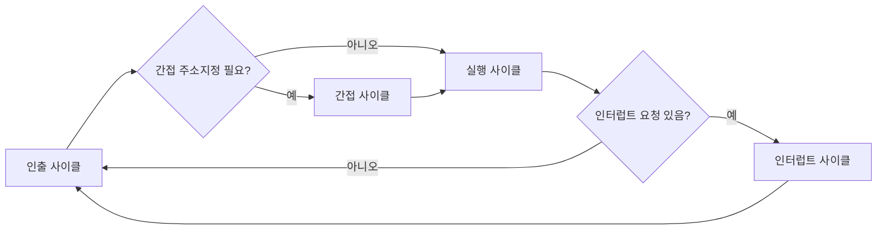

## 왜 명령어 실행을 여러 사이클로 나눌까

11편에서 CPU 내부가 레지스터·ALU·제어장치로 이뤄져 있고, 명령어 하나가 여러 마이크로오퍼레이션(micro-operation)의 순차 실행으로 완성된다는 것을 배웠다. 이런 차이를 체계적으로 다루기 위해 명령어 실행 전체를 **인출(Fetch) → 간접(Indirect) → 실행(Execute) → 인터럽트**(Interrupt)라는 네 개의 사이클로 나눈다.

## 명령 사이클의 전체 흐름

**명령 사이클**(instruction cycle)이란 CPU가 명령어 하나를 인출해서 실행을 완료하기까지 거치는 전체 과정이다. 매 사이클마다 아래 순서를 따른다.

```mermaid
flowchart LR
    A[인출 사이클] --> B{간접 주소지정 필요?}
    B -- 예 --> C[간접 사이클]
    B -- 아니오 --> D[실행 사이클]
    C --> D
    D --> E{인터럽트 요청 있음?}
    E -- 예 --> F[인터럽트 사이클]
    E -- 아니오 --> A
    F --> A
```

이 그림에서 볼 수 있듯, 간접 사이클과 인터럽트 사이클은 **매번 실행되는 것이 아니라 조건에 따라 선택적으로 실행**된다. 간접 사이클은 해당 명령어가 간접 주소지정 방식(13편에서 자세히 다룬다)을 쓸 때만, 인터럽트 사이클은 실행 사이클이 끝난 시점에 인터럽트 요청이 대기 중일 때만 실행된다.

## 인출 사이클: 명령어를 가져온다

**인출 사이클**(fetch cycle)은 모든 명령어가 예외 없이 거치는 첫 단계다. 마이크로오퍼레이션으로 펼치면 다음과 같다.

| 단계 | 마이크로오퍼레이션 | 의미 |
|---|---|---|
| $T_0$ | `MAR ← PC` | PC에 저장된 "다음 명령어 주소"를 MAR로 옮긴다 |
| $T_1$ | `MBR ← M[MAR]`, `PC ← PC + 1` | MAR이 가리키는 메모리 내용을 MBR로 읽어오는 동시에, PC를 다음 명령어 위치로 미리 증가시킨다 |
| $T_2$ | `IR ← MBR` | MBR에 담긴 명령어를 IR(명령어 레지스터)로 옮긴다 |

<Callout type="warning">
  시험 함정: **$T_1$ 단계에서 `PC ← PC + 1`이 `MBR ← M[MAR]`과 동시에 일어난다.** PC 증가를 실행 사이클이 다 끝난 뒤에 하는 것으로 착각하기 쉬운데, PC는 "지금 읽는 명령어"가 아니라 "다음에 읽을 명령어"를 가리켜야 하므로 인출 단계에서 미리 증가시켜 둔다.
</Callout>

## 간접 사이클: 주소 속의 주소를 다시 찾아간다

명령어를 해독한 결과 **간접 주소지정 방식**(indirect addressing mode)이라는 것을 알게 되면, 간접 사이클을 거쳐야 한다. IR에 담긴 주소 필드는 "실제 데이터의 주소"가 아니라 "실제 데이터의 주소가 저장된 위치"를 가리키기 때문이다.

| 단계 | 마이크로오퍼레이션 | 의미 |
|---|---|---|
| $T_0$ | `MAR ← IR(주소부)` | IR에 담긴 주소 필드를 MAR로 옮긴다 |
| $T_1$ | `MBR ← M[MAR]` | 그 주소가 가리키는 메모리 내용(= 진짜 유효주소)을 읽어온다 |
| $T_2$ | `IR(주소부) ← MBR` | 읽어온 진짜 유효주소로 IR의 주소 필드를 갱신한다 |

이 세 단계를 거치고 나면 IR의 주소 필드는 이제 "한 번 더 찾아가지 않아도 되는" 최종 유효주소를 담게 된다. 13편에서 이 유효주소 계산 과정을 다른 주소지정 방식들과 나란히 비교한다.

## 실행 사이클: 명령어가 실제로 수행된다

**실행 사이클**(execute cycle)은 명령어 종류(더하기, 빼기, 저장, 분기 등)에 따라 완전히 다른 마이크로오퍼레이션을 수행하므로 정형화된 표 하나로 나타낼 수 없다. 예를 들어 "메모리 값을 누산기에 더하라(ADD)"는 명령어의 실행 사이클은 11편에서 이미 살펴본 다음 단계와 같다.

| 단계 | 마이크로오퍼레이션 | 의미 |
|---|---|---|
| $T_0$ | `MAR ← IR(주소부)` | 유효주소를 MAR로 옮긴다 |
| $T_1$ | `MBR ← M[MAR]` | 그 주소의 데이터를 읽어온다 |
| $T_2$ | `AC ← AC + MBR` | ALU가 AC와 MBR을 더해 AC에 저장한다 |

반면 "분기하라(BRANCH)"는 명령어라면 `PC ← IR(주소부)`처럼 훨씬 단순한 마이크로오퍼레이션 한 줄로 끝날 수도 있다. **실행 사이클의 길이와 내용은 오퍼레이션 코드(opcode)에 따라 달라진다**는 점이 인출·간접·인터럽트 사이클과의 결정적 차이다.

## 인터럽트 사이클: 하던 일을 잠시 멈추고 급한 일을 처리한다

**인터럽트**(interrupt)란 CPU가 현재 실행 중인 프로그램 흐름과 무관하게, 입출력 장치나 예외 상황이 "지금 나를 처리해 달라"고 보내는 신호다. CPU는 매 명령 사이클의 실행 사이클이 끝날 때마다 인터럽트 요청이 있는지 확인한다.

인터럽트가 발생하면 CPU는 다음 순서로 대응한다.

### 인터럽트의 종류

| 종류 | 발생 원인 | 예시 |
|---|---|---|
| 외부 인터럽트 | CPU 바깥의 입출력 장치가 요청 | 키보드 입력 완료, 프린터 출력 완료 |
| 내부 인터럽트(트랩) | CPU 자신의 실행 중 예외 상황 | 0으로 나누기, 오버플로 |
| 소프트웨어 인터럽트 | 프로그램이 의도적으로 발생시킴 | 시스템 호출(system call) |

## 인터럽트 우선순위: 동시에 여러 요청이 오면

여러 장치가 동시에 인터럽트를 요청하면 CPU는 **우선순위**(priority)가 가장 높은 것부터 처리해야 한다. 우선순위를 정하는 대표적인 두 가지 방식이 있다.

1. **폴링(polling) 방식**: 소프트웨어가 정해진 순서대로 각 장치의 상태 레지스터를 하나씩 검사해, 어느 장치가 인터럽트를 요청했는지 찾아낸다. 회로가 단순하지만 검사 순서가 곧 우선순위이므로 앞쪽 장치일수록 응답이 빠르다.
2. **데이지 체인(daisy chain) 방식**: 여러 장치를 우선순위 순서로 직렬 연결해, 인터럽트 확인 신호가 우선순위가 높은 장치부터 순서대로 통과하게 만든 하드웨어 방식이다. 신호가 먼저 도달하는 장치가 먼저 처리된다.

또한 인터럽트 처리 중에 **더 높은 우선순위의 인터럽트가 새로 발생하면 현재 처리 중인 인터럽트 서비스 루틴을 다시 중단하고 그 인터럽트를 먼저 처리**할 수 있는데, 이를 다중 인터럽트(nested interrupt, 중첩 인터럽트) 처리라 한다. 반대로 낮은 우선순위의 인터럽트는 현재 처리가 끝날 때까지 대기해야 한다.

<Callout type="warning">
  시험 함정: **인터럽트 사이클은 실행 사이클이 끝난 직후에만 검사한다.** 인출 사이클이나 실행 사이클 "도중에" 인터럽트가 끼어든다고 서술하면 틀린 설명이다. CPU는 한 명령어의 실행을 반드시 마친 뒤에야 인터럽트 요청 여부를 확인한다.
</Callout>

### 자주 틀리는 점

- 간접 사이클을 모든 명령어가 항상 거친다고 착각하는 경우가 많다. 간접 사이클은 **간접 주소지정 방식을 쓰는 명령어에서만** 발생한다.
- 인터럽트와 DMA(Direct Memory Access)를 같은 개념으로 혼동하는 경우가 있다. 인터럽트는 "CPU의 개입이 필요한 요청"이고, DMA는 오히려 "CPU 개입 없이 메모리에 직접 접근하는 방식"이다. 이 둘의 비교는 18편에서 자세히 다룬다.
- 인터럽트 처리 시 PC 값을 저장하지 않으면 ISR 실행 후 원래 프로그램으로 복귀할 수 없다는 점, 즉 상태 저장이 인터럽트 사이클의 필수 단계라는 점을 놓치기 쉽다.

## 핵심 정리

- 명령 사이클은 인출→(간접)→실행→(인터럽트)의 순서로 진행되며, 간접·인터럽트 사이클은 조건부로만 실행된다.
- 인출 사이클은 `MAR ← PC`, `MBR ← M[MAR]`(+`PC ← PC+1`), `IR ← MBR`의 세 단계로 모든 명령어에 동일하게 적용된다.
- 간접 사이클은 IR의 주소부가 가리키는 곳을 한 번 더 읽어 진짜 유효주소로 갱신하는 단계다.
- 실행 사이클은 오퍼레이션 코드에 따라 마이크로오퍼레이션의 내용과 길이가 달라진다.
- 인터럽트 사이클은 실행 사이클 종료 직후에만 검사하며, 현재 PC를 저장하고 ISR로 이동했다가 처리 후 원래 위치로 복귀한다. 우선순위는 폴링 또는 데이지 체인 방식으로 결정한다.

## 마무리 복습

<Quiz
  questionNumber={1}
  question={"명령 사이클에서 모든 명령어가 예외 없이 거치는 단계로 옳은 것은?"}
  options={["간접 사이클","인출 사이클","인터럽트 사이클","실행 사이클과 인터럽트 사이클 둘 다"]}
  correctAnswer={2}
  explanation={"인출 사이클은 명령어의 종류나 주소지정 방식과 무관하게 모든 명령어가 반드시 거치는 첫 단계다. 간접 사이클은 간접 주소지정일 때만, 인터럽트 사이클은 인터럽트 요청이 있을 때만 실행된다."}
/>

<Quiz
  questionNumber={2}
  question={"인출 사이클의 마이크로오퍼레이션 'MBR ← M[MAR], PC ← PC + 1'에 대한 설명으로 옳은 것은?"}
  options={["PC 증가는 실행 사이클이 완전히 끝난 뒤에만 일어난다","메모리에서 명령어를 읽어오는 동작과 PC를 다음 명령어 위치로 증가시키는 동작이 같은 단계에서 함께 일어난다","MBR은 이 단계에서 주소만 저장하고 데이터는 저장하지 않는다","이 단계는 간접 사이클에서만 나타난다"]}
  correctAnswer={2}
  explanation={"인출 사이클의 T1 단계에서는 메모리 내용을 MBR로 읽어오는 동작과 PC를 미리 증가시키는 동작이 함께 이뤄진다. PC를 미리 증가시켜야 PC가 다음 인출할 명령어를 정확히 가리킨다."}
/>

<Quiz
  questionNumber={3}
  question={"간접 사이클이 필요한 경우로 옳은 것은?"}
  options={["모든 명령어가 실행되기 전에 항상 거쳐야 하는 단계다","명령어의 주소 필드가 실제 데이터가 아니라 실제 유효주소가 저장된 또 다른 메모리 위치를 가리킬 때 필요하다","CPU에 인터럽트 요청이 들어왔을 때만 필요하다","오퍼레이션 코드가 산술 연산일 때만 필요하다"]}
  correctAnswer={2}
  explanation={"간접 사이클은 간접 주소지정 방식을 쓰는 명령어, 즉 주소 필드가 진짜 데이터 주소가 아니라 그 주소가 저장된 위치를 가리킬 때만 실행되어 진짜 유효주소를 찾아낸다."}
/>

## 참고 자료

- [국가평생교육진흥원 독학학위제 - 출제방향/수준](https://bdes.nile.or.kr/nile/study/nStudy1_1.do)
- [국가평생교육진흥원 독학학위제 - 과목별 평가영역](https://bdes.nile.or.kr/nile/study/nStudy2_1.do)
