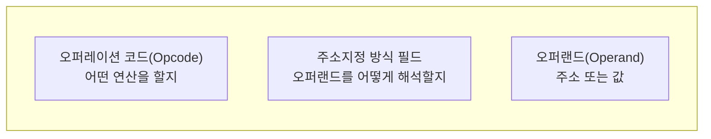

<Callout type="info">
  **이번 문서의 목표:** 이 파일을 다 읽으면 명령어를 오퍼코드와 오퍼랜드로 분해할 수 있고, 즉시·직접·간접·레지스터·레지스터 간접·변위·상대 주소지정 방식 각각에서 유효주소(Effective Address, EA)와 최종 값을 손으로 계산할 수 있다.
</Callout>

## 왜 주소지정 방식이 여러 가지 필요할까

12편에서 명령 사이클을 다루며 "간접 사이클은 간접 주소지정 방식을 쓸 때만 실행된다"고 언급했다. 그런데 왜 간접 방식 하나로 통일하지 않고 여러 방식을 두는 걸까? 이유는 **명령어의 길이는 짧게 유지하면서도, 다양한 방식으로 넓은 메모리 공간에 접근**해야 하기 때문이다. 오퍼랜드(피연산자) 필드에 쓸 수 있는 비트 수는 한정되어 있는데, 그 한정된 비트로 "값 자체", "가까운 주소", "먼 주소", "계산이 필요한 주소" 등 다양한 상황에 대응하려면 해석 규칙 자체를 여러 가지로 만들어야 한다.

## 명령어 형식: 오퍼코드와 오퍼랜드

> **쉽게 말하면:** 명령어는 "무엇을 할지"를 나타내는 오퍼코드와 "어떤 데이터에 대해 할지"를 나타내는 오퍼랜드로 나뉜다.

**명령어 형식**(instruction format)은 명령어를 이루는 비트열을 몇 개의 필드로 나눈 구조다. 가장 기본적인 구성은 다음과 같다.

- **오퍼레이션 코드**(Operation Code, Opcode): 덧셈·이동·분기 같은 "무엇을 할지"를 나타내는 필드다.
- **주소지정 방식(addressing mode) 필드**: 뒤따르는 오퍼랜드 필드를 "값 그대로"로 읽을지, "주소로" 읽을지, "주소의 주소로" 읽을지를 지정하는 필드다.
- **오퍼랜드**(operand): 실제 값이나 주소를 담는 필드로, 주소지정 방식에 따라 해석이 완전히 달라진다.

## 공통 예제 환경: 하나의 메모리 그림으로 전부 계산한다

> **쉽게 말하면:** 아래의 같은 메모리·레지스터 상태를 기준으로, 주소지정 방식마다 유효주소와 최종 값이 어떻게 달라지는지 비교한다.

이후 모든 주소지정 방식은 다음과 같은 공통 상태를 기준으로 계산한다.

| 레지스터 | 값 |
|---|---|
| PC(다음 실행할 명령어 주소) | 500 |
| R1(범용 레지스터) | 700 |

| 메모리 주소 | 저장된 값 |
|---|---|
| 500 | (현재 실행 중인 명령어, 오퍼랜드 필드 = 200) |
| 200 | 900 |
| 700 | 50 |
| 900 | 300 |
| 505 | (오퍼랜드 필드가 상대 주소지정에 쓰일 때의 변위 값 = 5) |

명령어의 오퍼랜드 필드에 적힌 숫자를 **200**이라고 가정하고, 이 하나의 숫자가 주소지정 방식에 따라 어떻게 다르게 해석되는지 살펴본다.

## 즉시 주소지정: 오퍼랜드가 곧 값이다

> **쉽게 말하면:** 즉시 주소지정은 오퍼랜드 필드 자체가 사용할 값이므로, 메모리를 한 번도 더 찾아가지 않는다.

**즉시 주소지정**(immediate addressing mode)은 오퍼랜드 필드에 적힌 숫자를 그대로 데이터 값으로 쓴다. 메모리 접근이 전혀 필요 없어 가장 빠르다.

$$
\text{사용할 값} = 200
$$

- 오퍼랜드 필드에 적힌 숫자 200이 그 자체로 데이터다. 메모리 900번지나 다른 어떤 주소도 참조하지 않는다.

<Callout type="warning">
  즉시 주소지정은 빠르지만, 표현할 수 있는 값의 범위가 오퍼랜드 필드의 비트 수로 제한된다는 단점이 있다. 큰 수를 표현하려면 필드가 커져야 하고, 그러면 명령어 전체 길이도 길어진다.
</Callout>

## 직접 주소지정: 오퍼랜드가 유효주소다

> **쉽게 말하면:** 직접 주소지정은 오퍼랜드 필드에 적힌 숫자를 메모리 주소로 보고, 그 주소의 내용을 값으로 쓴다.

**직접 주소지정**(direct addressing mode)은 오퍼랜드 필드 값을 그대로 유효주소로 삼는다.

$$
EA = 200
$$

$$
\text{사용할 값} = M[200] = 900
$$

- $EA$(Effective Address, 유효주소): 실제로 값을 가져올 메모리 주소.
- $M[200]$: 메모리 200번지에 저장된 값. 위 표에서 200번지에는 900이 저장돼 있으므로 최종 값은 900이다.

메모리를 **한 번** 참조한다.

## 간접 주소지정: 오퍼랜드가 유효주소의 주소다

> **쉽게 말하면:** 간접 주소지정은 오퍼랜드가 가리키는 곳에 진짜 주소가 또 적혀 있어서, 메모리를 두 번 찾아가야 한다.

**간접 주소지정**(indirect addressing mode)은 12편의 간접 사이클에서 이미 다룬 방식으로, 오퍼랜드 필드가 가리키는 메모리 위치에 "진짜 유효주소"가 저장돼 있다.

$$
EA = M[200] = 900
$$

$$
\text{사용할 값} = M[EA] = M[900] = 300
$$

- 먼저 200번지를 읽으면 900이라는 값이 나오는데, 이것이 바로 진짜 유효주소다.
- 그 유효주소 900번지를 다시 읽으면 최종 값 300을 얻는다.

메모리를 **두 번** 참조하므로 직접 주소지정보다 느리지만, 유효주소 자체를 프로그램 실행 중에 바꿀 수 있어(예: 900번지의 내용을 다른 주소로 바꾸면 같은 명령어가 다른 데이터를 가리키게 된다) 배열이나 포인터 같은 유연한 자료구조를 다루는 데 유리하다.

## 레지스터 주소지정: 오퍼랜드가 레지스터 번호다

> **쉽게 말하면:** 레지스터 주소지정은 메모리를 아예 거치지 않고, 레지스터 안의 값을 바로 쓴다.

**레지스터 주소지정**(register addressing mode)은 오퍼랜드 필드가 메모리 주소가 아니라 **레지스터 번호**를 가리킨다. 오퍼랜드 필드가 "R1을 쓰라"는 뜻이라고 하면 다음과 같다.

$$
\text{사용할 값} = R1 = 700
$$

- 메모리 접근이 전혀 없다. 레지스터는 CPU 내부에 있으므로 메모리보다 훨씬 빠르게 접근할 수 있다.

## 레지스터 간접 주소지정: 레지스터가 유효주소를 담는다

> **쉽게 말하면:** 레지스터 간접 주소지정은 레지스터 안의 값을 유효주소로 보고, 그 주소의 메모리 내용을 가져온다.

**레지스터 간접 주소지정**(register indirect addressing mode)은 오퍼랜드가 가리키는 레지스터(R1)의 값을 유효주소로 사용한다.

$$
EA = R1 = 700
$$

$$
\text{사용할 값} = M[EA] = M[700] = 50
$$

- R1에 저장된 값 700이 유효주소가 되고, 700번지의 내용 50이 최종 값이다.
- 간접 주소지정과 비슷하지만, 유효주소를 메모리가 아니라 **레지스터**에서 가져온다는 점이 다르다. 메모리 접근은 한 번만 일어난다.

## 변위 주소지정: 레지스터 값과 오퍼랜드를 더한다

> **쉽게 말하면:** 변위 주소지정은 레지스터 값에 오퍼랜드 필드의 숫자(변위)를 더해 유효주소를 만든다.

**변위 주소지정**(displacement addressing mode)은 레지스터 값과 오퍼랜드 필드에 적힌 **변위**(displacement)를 더해 유효주소를 계산한다. 오퍼랜드 필드가 "R1 + 변위 5"를 뜻한다고 하면 다음과 같다.

$$
EA = R1 + 5 = 700 + 5 = 705
$$

- $R1 = 700$(기준이 되는 레지스터 값), $5$(오퍼랜드 필드에 담긴 변위 값)
- $M[705]$가 실제 최종 값이 되는데, 이 편의 공통 예제 표에는 705번지 값을 별도로 정의하지 않았으므로 "$EA = 705$를 계산해 그 번지의 내용을 읽는다"는 절차 자체가 핵심이다.

변위 주소지정은 배열의 특정 원소에 접근할 때 유용하다. R1을 배열의 시작 주소로 두고 변위를 "몇 번째 원소인지"로 삼으면, 반복문을 돌 때마다 변위만 바꿔가며 배열 전체를 순회할 수 있다.

## 상대 주소지정: PC를 기준으로 삼는다

> **쉽게 말하면:** 상대 주소지정은 변위 주소지정과 계산 방식은 같지만, 기준이 되는 레지스터가 PC라는 점이 다르다.

**상대 주소지정**(relative addressing mode)은 변위 주소지정의 특수한 경우로, 기준 레지스터가 항상 **PC**(프로그램 카운터)다. 공통 예제 표에서 505번지의 오퍼랜드 필드 값(변위) 5를 사용한다고 하면 다음과 같다.

$$
EA = PC + 5 = 500 + 5 = 505
$$

- $PC = 500$(현재 인출 시점 기준의 PC 값), $5$(오퍼랜드 필드에 담긴 변위 값)

상대 주소지정은 **분기(branch) 명령어**에서 특히 많이 쓰인다. "지금 위치에서 몇 칸 앞으로 뛰어라"는 식으로 목적지를 표현하면, 프로그램이 메모리의 어느 위치에 적재되든 상대적인 거리만 맞으면 항상 정확하게 동작하기 때문이다. 이런 특성을 **재배치 가능**(relocatable)하다고 표현한다.

<Callout type="warning">
  시험 함정: **변위 주소지정과 상대 주소지정은 계산식이 똑같이 "기준값 + 변위"이지만, 기준이 되는 것이 범용 레지스터(R1 등)인지 PC인지로 구분한다.** 이 둘을 같은 개념으로 뭉뚱그리면 "상대 주소지정의 기준 레지스터는?"과 같은 문제에서 틀리기 쉽다.
</Callout>

## 주소지정 방식 전체 비교표

| 방식 | 유효주소 계산식 | 이 편의 예시로 구한 EA | 메모리 참조 횟수 |
|---|---|---|---|
| 즉시 | 해당 없음(오퍼랜드가 값 자체) | 해당 없음 | 0회 |
| 직접 | $EA = A$ | $EA = 200$ | 1회 |
| 간접 | $EA = M[A]$ | $EA = M[200] = 900$ | 2회 |
| 레지스터 | 해당 없음(레지스터가 값 자체) | 해당 없음 | 0회 |
| 레지스터 간접 | $EA = R$ | $EA = R1 = 700$ | 1회 |
| 변위 | $EA = R + A$ | $EA = 700 + 5 = 705$ | 1회 |
| 상대 | $EA = PC + A$ | $EA = 500 + 5 = 505$ | 1회 |

- $A$: 오퍼랜드 필드에 담긴 주소 또는 변위 값
- $R$: 지정된 범용 레지스터의 값
- $PC$: 현재 인출 시점의 프로그램 카운터 값

### 자주 틀리는 점

- **직접 주소지정과 간접 주소지정의 메모리 참조 횟수**(1회 대 2회)를 혼동하는 경우가 매우 많다. "오퍼랜드가 곧 유효주소"면 직접, "오퍼랜드가 가리키는 곳에 유효주소가 또 있다"면 간접이다.
- **레지스터 주소지정(메모리 참조 0회)과 레지스터 간접 주소지정**(메모리 참조 1회)을 같은 것으로 착각하기 쉽다. "레지스터의 값 자체를 쓰는지" 아니면 "레지스터의 값을 주소로 보고 메모리를 한 번 더 찾아가는지"의 차이다.
- 변위 주소지정과 상대 주소지정을 계산식만 보고 같은 것으로 여기는 실수가 잦다. 기준 레지스터가 범용 레지스터인지 PC인지가 핵심 구분점이다.

## 핵심 정리

- 명령어는 오퍼레이션 코드(연산 종류)와 오퍼랜드(값 또는 주소)로 구성되며, 오퍼랜드의 해석 규칙이 곧 주소지정 방식이다.
- 즉시(EA 없음, 참조 0회) → 직접($EA=A$, 참조 1회) → 간접($EA=M[A]$, 참조 2회) 순으로 메모리 참조 횟수가 늘어난다.
- 레지스터 주소지정(참조 0회)과 레지스터 간접 주소지정($EA=R$, 참조 1회)은 메모리 접근 여부로 구분된다.
- 변위 주소지정($EA=R+A$)과 상대 주소지정($EA=PC+A$)은 계산식은 같지만 기준이 범용 레지스터인지 PC인지로 구분되며, 상대 주소지정은 분기 명령어의 재배치 가능성에 활용된다.
- 같은 오퍼랜드 필드 값이라도 주소지정 방식에 따라 최종적으로 쓰이는 값이 완전히 달라진다.

## 마무리 복습

<Quiz
  questionNumber={1}
  question="오퍼랜드 필드에 적힌 값이 200이고 직접 주소지정 방식을 쓸 때, 200번지에 저장된 값이 900이라면 최종적으로 사용되는 값은?"
  options={['200', '900', 'M[900]의 값', 'PC + 200']}
  correctAnswer={2}
  explanation="직접 주소지정은 오퍼랜드 필드 값을 그대로 유효주소로 삼는다. EA = 200이고, M[200] = 900이므로 최종 값은 900이다."
  optionExplanations={['200은 유효주소일 뿐 최종 값이 아니다. 직접 주소지정은 메모리 참조가 1회 필요하다', '정답이다. EA = 200이고 M[200] = 900이므로 최종 값은 900이다', '직접 주소지정은 메모리를 한 번만 참조하므로 M[900]까지 갈 필요가 없다. 이는 간접 주소지정의 계산이다', '상대 주소지정과 혼동한 계산이다. 직접 주소지정에는 PC가 사용되지 않는다']}
/>

<Quiz
  questionNumber={2}
  question="간접 주소지정 방식에서 오퍼랜드 필드 값이 200이고 M[200] = 900, M[900] = 300일 때 최종 값은?"
  options={['200', '900', '300', 'M[300]의 값']}
  correctAnswer={3}
  explanation="간접 주소지정은 EA = M[200] = 900을 먼저 구하고, 다시 M[EA] = M[900] = 300을 읽어 최종 값을 얻는다. 메모리를 두 번 참조한다."
  optionExplanations={['200은 오퍼랜드 필드 값일 뿐이며 최종 값이 아니다', '900은 유효주소(EA)이지 최종 값이 아니다. 이는 직접 주소지정과 혼동한 값이다', '정답이다. EA = M[200] = 900이고, 다시 M[900] = 300이 최종 값이다', '간접 주소지정은 메모리를 두 번만 참조하므로 M[300]까지 갈 필요가 없다']}
/>

<Quiz
  questionNumber={3}
  question="레지스터 주소지정과 레지스터 간접 주소지정의 차이로 옳은 것은?"
  options={['레지스터 주소지정은 메모리를 참조하지 않지만, 레지스터 간접 주소지정은 레지스터 값을 유효주소로 삼아 메모리를 한 번 참조한다', '레지스터 주소지정은 항상 PC를 기준으로 계산한다', '레지스터 간접 주소지정은 메모리를 두 번 참조한다', '둘은 완전히 동일한 방식이며 이름만 다르다']}
  correctAnswer={1}
  explanation="레지스터 주소지정은 레지스터의 값 자체를 데이터로 쓰므로 메모리 참조가 없다. 레지스터 간접 주소지정은 레지스터 값을 유효주소로 보고 메모리를 한 번 참조한다."
  optionExplanations={['정답이다. 메모리 참조 여부(0회 대 1회)가 두 방식의 핵심 차이다', 'PC를 기준으로 삼는 것은 상대 주소지정이다. 레지스터 주소지정과는 관련이 없다', '레지스터 간접 주소지정은 메모리를 한 번만 참조한다. 두 번 참조하는 것은 간접 주소지정이다', '두 방식은 메모리 참조 여부가 다른 별개의 방식이다']}
/>

<Quiz
  questionNumber={4}
  question="R1 = 700이고 오퍼랜드 필드의 변위 값이 5일 때, 변위 주소지정 방식의 유효주소(EA)는?"
  options={['5', '700', '705', 'M[705]의 값']}
  correctAnswer={3}
  explanation="변위 주소지정의 유효주소는 EA = R + A이므로, EA = 700 + 5 = 705이다. M[705]의 값은 유효주소가 아니라 그 이후에 읽어올 데이터다."
  optionExplanations={['5는 변위 값 자체이지 유효주소가 아니다', '700은 R1의 값일 뿐이며 변위를 더하지 않은 상태다', '정답이다. EA = R1 + 5 = 700 + 5 = 705이다', 'M[705]는 유효주소가 아니라 유효주소가 가리키는 메모리 내용이다. 질문은 EA 자체를 묻고 있다']}
/>

<Quiz
  questionNumber={5}
  question="상대 주소지정 방식에 대한 설명으로 옳은 것은?"
  options={['유효주소를 계산할 때 항상 특정 범용 레지스터를 기준으로 삼는다', '유효주소를 계산할 때 PC(프로그램 카운터)를 기준으로 삼으며, 분기 명령어에서 재배치 가능성을 확보하는 데 유리하다', '오퍼랜드 필드 값을 그대로 데이터로 사용해 메모리 참조가 없다', '메모리를 항상 두 번 참조해야 한다']}
  correctAnswer={2}
  explanation="상대 주소지정은 EA = PC + A로 계산하며, PC를 기준으로 삼기 때문에 프로그램이 메모리 어디에 적재되든 상대적 거리만 맞으면 정확히 동작해 분기 명령어에 적합하다."
  optionExplanations={['범용 레지스터를 기준으로 삼는 것은 변위 주소지정이다. 상대 주소지정은 PC를 기준으로 한다', '정답이다. PC를 기준으로 EA를 계산하며 분기 명령어의 재배치 가능성에 유리하다', '오퍼랜드를 그대로 값으로 쓰는 것은 즉시 주소지정이다', '상대 주소지정은 메모리를 한 번만 참조한다(EA 계산 후 그 위치의 내용을 한 번 읽음)']}
/>

<Quiz
  questionNumber={6}
  question="PC = 500이고 오퍼랜드 필드의 변위 값이 5일 때, 상대 주소지정 방식의 유효주소(EA)는?"
  options={['5', '495', '500', '505']}
  correctAnswer={4}
  explanation="상대 주소지정의 유효주소는 EA = PC + A이므로, EA = 500 + 5 = 505이다."
  optionExplanations={['5는 변위 값 자체이지 유효주소가 아니다', '이는 PC에서 변위를 뺀 값으로, 상대 주소지정은 덧셈을 사용한다', '500은 PC 값일 뿐이며 변위를 더하지 않은 상태다', '정답이다. EA = PC + A = 500 + 5 = 505이다']}
/>

## 참고 자료

- [국가평생교육진흥원 독학학위제 - 출제방향/수준](https://bdes.nile.or.kr/nile/study/nStudy1_1.do)
- [국가평생교육진흥원 독학학위제 - 과목별 평가영역](https://bdes.nile.or.kr/nile/study/nStudy2_1.do)
