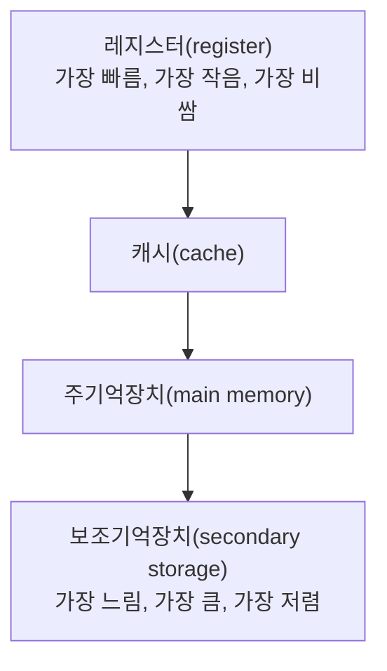

<Callout type="info">
  **이번 문서의 목표:** 이 파일을 다 읽으면 기억장치 계층을 접근 속도·비용·용량 순서로 설명할 수 있고, RAM과 ROM의 세부 종류를 구분하며, 캐시·가상메모리의 이론적 기반이 되는 지역성(locality) 원리를 설명할 수 있다.
</Callout>

## 왜 기억장치를 한 종류로 통일하지 않을까

06편에서 폰노이만 구조를 배우며 CPU와 메모리가 분리되어 있고, 메모리가 프로그램과 데이터를 저장한다고 배웠다. 그런데 "빠른 메모리"와 "값싸고 용량이 큰 메모리"는 기술적으로 동시에 만들기 어렵다. 빠른 소자는 비싸고 집적도가 낮아 용량을 늘리기 어렵고, 값싸고 용량이 큰 소자는 대개 느리다. 이 딜레마를 해결하려고 컴퓨터는 **여러 종류의 기억장치를 계층(hierarchy)으로 쌓아, 빠르지만 작은 것을 CPU 가까이, 느리지만 큰 것을 멀리 배치**한다.

## 기억장치 계층: 피라미드 구조

> **쉽게 말하면:** CPU에 가까울수록 빠르고 비싸고 용량이 작으며, 멀어질수록 느리고 싸고 용량이 크다.

**기억장치 계층**(memory hierarchy)은 레지스터부터 보조기억장치까지를 접근 속도 순서로 배열한 구조다.

이 계층에서 위로 갈수록(레지스터 쪽) **접근 시간(access time)은 짧고, 비트당 비용(cost per bit)은 높고, 용량(capacity)은 작다.** 아래로 갈수록(보조기억장치 쪽) 정반대다.

| 계층 | 예시 | 접근 시간 | 비트당 비용 | 용량 |
|---|---|---|---|---|
| 레지스터 | CPU 내부 레지스터(11편의 AC, PC 등) | 가장 짧음(수백 피코초 수준) | 가장 높음 | 가장 작음(수백 바이트 수준) |
| 캐시 | L1/L2/L3 캐시 | 짧음(나노초 수준) | 높음 | 작음(수백 킬로바이트–수십 메가바이트) |
| 주기억장치 | DRAM(주기억장치, 16편·17편에서 다룰 캐시·가상메모리의 대상) | 중간(수십 나노초 수준) | 중간 | 중간(기가바이트 수준) |
| 보조기억장치 | SSD, 하드디스크(HDD) | 김(마이크로초–밀리초 수준) | 가장 낮음 | 가장 큼(테라바이트 수준) |

<Callout type="warning">
  시험 함정: **"용량이 큰 기억장치일수록 접근 속도도 빠르다"는 설명은 정반대다.** 기억장치 계층의 핵심 원리는 **접근 속도와 용량이 서로 반비례 관계**에 있다는 것이며, 이 때문에 계층 구조 자체가 필요해진다.
</Callout>

## 접근 시간·비용·용량의 삼각관계

> **쉽게 말하면:** 빠르면서 크고 싼 기억장치는 존재하지 않는다. 이 세 가지 중 무엇을 우선할지가 계층별로 다르게 정해져 있다.

기억장치 계층이 존재하는 근본적인 이유는 **속도·용량·비용을 동시에 만족하는 단일 기억장치를 만들 수 없기 때문**이다. 레지스터에 쓰이는 소자(플립플롭)는 매우 빠르지만 트랜지스터를 많이 써서 회로가 복잡해지므로 비트당 가격이 비싸고, 그래서 용량을 늘리기 어렵다. 반대로 하드디스크는 자기 디스크를 회전시켜 데이터를 읽으므로 느리지만, 같은 비용으로 훨씬 많은 데이터를 저장할 수 있다.

컴퓨터 시스템은 이 세 요소의 절충을 계층으로 해결한다. **자주 쓰는 데이터는 빠른 계층(레지스터·캐시)에, 가끔 쓰는 데이터는 느린 계층(보조기억장치)에** 두면, 전체 시스템은 "레지스터만큼 빠르면서 보조기억장치만큼 크고 저렴한 것처럼" 동작하는 것에 가까워진다. 이 아이디어가 실제로 성립하는 이유가 바로 다음 절의 지역성 원리다.

## 지역성의 원리: 계층 구조가 성립하는 이유

> **쉽게 말하면:** 프로그램은 아무 데이터나 무작위로 접근하지 않고, 최근에 쓴 것과 가까운 것을 다시 쓰는 경향이 있다. 이 경향 덕분에 계층 구조가 실제로 효과를 낸다.

**지역성**(locality)이란 프로그램이 실행되는 동안 메모리 접근이 특정 영역에 집중되는 경향을 말한다. 지역성이 없다면, 즉 프로그램이 메모리 전체를 완전히 무작위로 접근한다면, 캐시나 가상메모리 같은 "일부만 빠른 곳에 올려두는" 전략이 아무 효과가 없을 것이다. 지역성은 크게 두 가지로 나뉜다.

1. **시간적 지역성**(temporal locality): 한 번 접근한 데이터는 가까운 미래에 **다시** 접근될 가능성이 높다는 경향이다. 예를 들어 반복문(loop) 안의 변수는 매 반복마다 계속 다시 참조된다.
2. **공간적 지역성**(spatial locality): 한 번 접근한 데이터 근처의 주소도 가까운 미래에 접근될 가능성이 높다는 경향이다. 예를 들어 배열(array)을 처음부터 끝까지 순회하는 코드는, 한 원소를 읽은 직후 바로 다음 번지의 원소를 읽는다.

<Callout type="warning">
  일상 속 비유: 자주 읽는 책을 책상 위(레지스터·캐시에 해당)에 두고, 가끔 보는 책은 책장(주기억장치)에, 거의 안 보는 책은 창고(보조기억장치)에 두는 것과 같다. 방금 읽은 페이지를 다시 펼칠 가능성이 높은 것이 시간적 지역성, 그 페이지 앞뒤 페이지도 곧 볼 가능성이 높은 것이 공간적 지역성이다.
</Callout>

지역성은 16편의 캐시 사상(적중률이 왜 높게 유지되는지)과 17편의 가상메모리(왜 최근 사용한 페이지만 주기억장치에 남겨둬도 되는지)를 이해하는 데 필요한 핵심 전제가 된다.

## 주기억장치: RAM과 ROM

> **쉽게 말하면:** RAM은 전원이 꺼지면 내용이 사라지는 대신 자유롭게 읽고 쓸 수 있고, ROM은 전원이 꺼져도 내용이 남지만 쓰기가 제한적이다.

**주기억장치**(main memory)는 CPU가 직접 접근할 수 있는 기억장치로, 크게 RAM과 ROM으로 나뉜다.

### RAM: 읽고 쓰기가 자유로운 휘발성 메모리

**RAM**(Random Access Memory, 임의접근기억장치)은 어느 주소든 거의 동일한 시간에 읽고 쓸 수 있는 메모리다. 전원이 꺼지면 저장된 내용이 사라지는 **휘발성**(volatile) 메모리다.

| RAM의 종류 | 특징 | 주요 용도 |
|---|---|---|
| DRAM(Dynamic RAM, 동적 RAM) | 축전기(capacitor)에 전하를 저장하며, 시간이 지나면 전하가 새어나가 주기적으로 재충전(refresh)해야 한다. 구조가 단순해 집적도가 높고 저렴하다. | 주기억장치(메인 메모리) |
| SRAM(Static RAM, 정적 RAM) | 플립플롭 구조로 저장하며, 전원이 유지되는 동안 재충전이 필요 없다. 속도가 빠르지만 회로가 복잡해 집적도가 낮고 비싸다. | 캐시 메모리 |

<Callout type="warning">
  시험 함정: **DRAM은 재충전이 필요하고, SRAM은 필요 없다는 관계를 반대로 외우는 실수가 흔하다.** "D"(Dynamic, 동적)는 전하가 계속 흘러나가 "동적으로" 재충전해야 한다는 뜻으로 연결해 기억하면 헷갈리지 않는다.
</Callout>

### ROM: 내용이 보존되는 비휘발성 메모리

**ROM**(Read Only Memory, 읽기전용기억장치)은 전원이 꺼져도 저장된 내용이 유지되는 **비휘발성**(non-volatile) 메모리다. 이름처럼 "읽기 전용"이지만, 실제로는 아래와 같이 쓰기 가능 여부와 방식이 다른 여러 종류가 있다.

| ROM의 종류 | 쓰기(재기록) 방식 |
|---|---|
| Mask ROM | 제조 단계에서 내용이 고정되어, 이후 전혀 수정할 수 없다 |
| PROM(Programmable ROM) | 사용자가 전용 장비로 **딱 한 번** 기록할 수 있다 |
| EPROM(Erasable PROM) | 자외선(UV)을 이용해 내용을 지우고 다시 기록할 수 있다 |
| EEPROM(Electrically Erasable PROM) | 전기 신호로 내용을 지우고 다시 기록할 수 있다 |
| 플래시 메모리(flash memory) | EEPROM의 발전 형태로, 블록 단위로 빠르게 지우고 다시 쓸 수 있어 SSD나 USB 메모리에 널리 쓰인다 |

<Callout type="warning">
  시험 함정: **ROM이 "절대 쓸 수 없는 메모리"라고 단정하면 틀린다.** PROM·EPROM·EEPROM·플래시 메모리는 모두 재기록이 가능하며, 차이는 "몇 번 쓸 수 있는지"와 "어떤 방법으로 지우는지"에 있다. 완전히 쓰기가 불가능한 것은 Mask ROM뿐이다.
</Callout>

## RAM vs ROM 비교표

| 비교 항목 | RAM | ROM |
|---|---|---|
| 휘발성 여부 | 휘발성(전원 차단 시 내용 소실) | 비휘발성(전원 차단 후에도 내용 유지) |
| 주 용도 | 실행 중인 프로그램·데이터 저장 | 부팅 코드(BIOS/펌웨어) 등 고정 정보 저장 |
| 쓰기 가능 여부 | 자유롭게 읽고 씀 | 종류에 따라 제한적으로 씀(Mask ROM은 불가) |
| 대표 세부 종류 | DRAM, SRAM | Mask ROM, PROM, EPROM, EEPROM, 플래시 메모리 |

### 자주 틀리는 점

- 기억장치 계층에서 "빠를수록 용량도 크다"고 반대로 기억하는 실수가 잦다. 접근 속도와 용량은 반비례한다.
- 시간적 지역성과 공간적 지역성을 반대로 설명하는 경우가 많다. "같은 데이터를 다시" 쓰면 시간적, "근처 데이터를 새로" 쓰면 공간적이다.
- DRAM과 SRAM의 재충전 필요 여부, 속도·집적도 차이를 반대로 외우는 실수가 흔하다.
- ROM 전체를 "쓰기가 불가능하다"고 일반화하는 것은 오답의 대표적인 패턴이다.

## 핵심 정리

- 기억장치 계층은 레지스터→캐시→주기억장치→보조기억장치 순으로, CPU에 가까울수록 빠르고 비싸고 작으며 멀수록 느리고 싸고 크다.
- 계층 구조가 효과를 내는 근거는 지역성(locality)이며, 시간적 지역성(같은 데이터 재참조)과 공간적 지역성(인접 데이터 참조)으로 나뉜다.
- RAM은 휘발성 메모리로 DRAM(재충전 필요, 주기억장치용)과 SRAM(재충전 불필요, 캐시용)으로 나뉜다.
- ROM은 비휘발성 메모리이며, Mask ROM만 완전히 쓰기 불가능하고 PROM·EPROM·EEPROM·플래시 메모리는 각기 다른 방식으로 재기록이 가능하다.
- 지역성 원리는 16편의 캐시 사상, 17편의 가상메모리를 이해하는 데 필요한 이론적 기반이 된다.

## 마무리 복습

<Quiz
  questionNumber={1}
  question="기억장치 계층에서 레지스터에 가까울수록 나타나는 특징으로 옳은 것은?"
  options={['접근 시간이 길어지고 용량이 커진다', '접근 시간이 짧아지고 비트당 비용이 높아지며 용량은 작아진다', '비휘발성이 강해지고 가격이 저렴해진다', '접근 시간과 용량이 모두 커진다']}
  correctAnswer={2}
  explanation="기억장치 계층에서 레지스터에 가까울수록 접근 시간은 짧아지고, 비트당 비용은 높아지며, 용량은 작아진다. 이는 보조기억장치 방향으로 갈수록 정반대가 된다."
  optionExplanations={['레지스터에 가까울수록 접근 시간은 짧아지고 용량은 오히려 작아진다', '정답이다. 레지스터에 가까울수록 접근 시간은 짧고 비용은 높고 용량은 작다', '레지스터를 포함한 계층 상단부(레지스터, 캐시, 주기억장치의 DRAM)는 대부분 휘발성이다', '레지스터에 가까울수록 접근 시간은 짧아지고 용량은 작아진다']}
/>

<Quiz
  questionNumber={2}
  question="시간적 지역성(temporal locality)에 대한 설명으로 옳은 것은?"
  options={['한 번 접근한 데이터 근처의 주소가 곧 접근될 가능성이 높다는 경향이다', '한 번 접근한 데이터가 가까운 미래에 다시 접근될 가능성이 높다는 경향이다', '메모리 접근이 시간이 지날수록 완전히 무작위로 흩어지는 경향이다', 'CPU 클록 속도가 빠를수록 나타나는 현상이다']}
  correctAnswer={2}
  explanation="시간적 지역성은 한 번 접근한 데이터가 가까운 미래에 다시 접근될 가능성이 높다는 경향으로, 반복문 안에서 반복적으로 참조되는 변수가 대표적인 예다."
  optionExplanations={['이는 공간적 지역성에 대한 설명이다', '정답이다. 같은 데이터를 다시 참조하는 경향이 시간적 지역성이다', '지역성은 접근이 특정 영역에 집중되는 경향이며, 무작위로 흩어지는 것과는 반대되는 개념이다', '지역성은 클록 속도가 아니라 프로그램의 데이터 접근 패턴에서 비롯되는 경향이다']}
/>

<Quiz
  questionNumber={3}
  question="배열(array)을 처음부터 끝까지 순서대로 순회하며 각 원소를 한 번씩 읽는 코드가 주로 활용하는 지역성은?"
  options={['시간적 지역성', '공간적 지역성', '지역성과 무관한 코드다', '휘발성 지역성']}
  correctAnswer={2}
  explanation="배열을 순서대로 순회하면 한 원소를 읽은 직후 바로 인접한 다음 번지의 원소를 읽으므로, 이는 인접한 주소를 곧 참조하는 공간적 지역성의 대표적인 예다."
  optionExplanations={['같은 데이터를 반복해서 다시 읽는 것이 아니라 인접한 새로운 데이터를 읽는 것이므로 시간적 지역성이 아니다', '정답이다. 인접한 주소를 연속해서 참조하는 것은 공간적 지역성의 대표 사례다', '배열 순회는 지역성의 대표적인 활용 사례이며, 지역성과 무관하다는 설명은 틀렸다', '휘발성 지역성이라는 용어는 존재하지 않는다']}
/>

<Quiz
  questionNumber={4}
  question="DRAM과 SRAM에 대한 설명으로 옳은 것은?"
  options={['DRAM은 플립플롭 구조로 재충전이 필요 없고, SRAM은 축전기 구조로 재충전이 필요하다', 'DRAM은 축전기에 전하를 저장해 주기적인 재충전이 필요하며, SRAM은 플립플롭 구조로 재충전이 필요 없다', 'DRAM과 SRAM 모두 비휘발성 메모리다', 'SRAM은 주로 주기억장치에, DRAM은 주로 캐시에 사용된다']}
  correctAnswer={2}
  explanation="DRAM은 축전기에 전하를 저장하는 방식이라 전하가 새어나가 주기적으로 재충전해야 하고, SRAM은 플립플롭 구조라 전원이 유지되는 동안 재충전이 필요 없다."
  optionExplanations={['설명이 반대로 되어 있다. DRAM이 축전기 구조, SRAM이 플립플롭 구조다', '정답이다. DRAM은 재충전이 필요하고 SRAM은 필요 없다', 'DRAM과 SRAM 모두 전원이 꺼지면 내용이 사라지는 휘발성 메모리다', '용도가 반대로 되어 있다. SRAM은 캐시에, DRAM은 주기억장치에 주로 사용된다']}
/>

<Quiz
  questionNumber={5}
  question="ROM의 종류 중, 자외선(UV)을 이용해 내용을 지우고 다시 기록할 수 있는 것은?"
  options={['Mask ROM', 'PROM', 'EPROM', 'SRAM']}
  correctAnswer={3}
  explanation="EPROM(Erasable PROM)은 자외선을 이용해 저장된 내용을 지우고 다시 기록할 수 있는 ROM의 한 종류다."
  optionExplanations={['Mask ROM은 제조 단계에서 내용이 고정되어 전혀 수정할 수 없다', 'PROM은 전용 장비로 딱 한 번만 기록할 수 있고 자외선으로 지우는 방식이 아니다', '정답이다. EPROM은 자외선으로 내용을 지우고 재기록할 수 있다', 'SRAM은 ROM이 아니라 RAM의 한 종류다']}
/>

<Quiz
  questionNumber={6}
  question="ROM에 대한 설명으로 옳지 않은 것은?"
  options={['ROM은 전원이 꺼져도 저장된 내용이 유지되는 비휘발성 메모리다', 'ROM에 속하는 모든 종류는 예외 없이 한 번 제조되면 절대 다시 쓸 수 없다', 'EEPROM은 전기 신호로 내용을 지우고 다시 기록할 수 있다', '플래시 메모리는 EEPROM의 발전 형태로 SSD 등에 널리 쓰인다']}
  correctAnswer={2}
  explanation="ROM의 모든 종류가 재기록 불가능한 것은 아니다. PROM, EPROM, EEPROM, 플래시 메모리는 각기 다른 방식으로 재기록이 가능하며, 완전히 재기록이 불가능한 것은 Mask ROM뿐이다."
  optionExplanations={['옳은 설명이다. ROM은 비휘발성 메모리로 전원 차단 후에도 내용이 유지된다', '정답이다(옳지 않은 설명). PROM·EPROM·EEPROM·플래시 메모리는 재기록이 가능하다', '옳은 설명이다. EEPROM은 전기 신호로 지우고 다시 쓸 수 있다', '옳은 설명이다. 플래시 메모리는 EEPROM에서 발전한 형태로 SSD 등에 쓰인다']}
/>

## 참고 자료

- [국가평생교육진흥원 독학학위제 - 출제방향/수준](https://bdes.nile.or.kr/nile/study/nStudy1_1.do)
- [국가평생교육진흥원 독학학위제 - 과목별 평가영역](https://bdes.nile.or.kr/nile/study/nStudy2_1.do)
