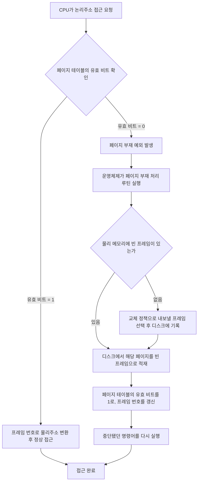

<Callout type="info">
  **이번 문서의 목표:** 이 파일을 다 읽으면 논리주소를 페이지 번호와 페이지 내 오프셋으로 비트 단위로 쪼개 물리주소로 변환하고, 페이지 부재가 발생했을 때의 처리 흐름을 설명하며, TLB 적중률이 주어졌을 때 유효 접근시간을 계산할 수 있다.
</Callout>

## 왜 가상메모리가 필요한가

16편에서 캐시는 "CPU와 주기억장치 사이의 속도 차이"를 메우는 장치였다. 가상메모리(virtual memory)는 조금 다른 문제를 푼다: **프로그램이 실제 물리적인 주기억장치보다 더 큰 주소 공간을 쓸 수 있게 하고, 여러 프로그램이 서로의 메모리를 침범하지 않게 격리**하는 것이다.

프로그램이 직접 다루는 주소를 **논리주소**(logical address, 가상주소 virtual address)라 하고, 실제 주기억장치(RAM)의 물리적인 위치를 가리키는 주소를 **물리주소**(physical address)라 한다. CPU가 논리주소를 내놓으면, 하드웨어(주로 MMU, Memory Management Unit, 기억장치 관리 장치)가 이를 물리주소로 바꿔준다. 이 변환 덕분에 프로그램은 "내 메모리가 실제로 어디에 있는지" 전혀 몰라도 되고, 운영체제는 물리적인 메모리를 자유롭게 재배치할 수 있다.

> **쉽게 말하면:** 가상메모리는 프로그램에게 "네 전용 메모리 공간이 아주 크게 있다"고 착각하게 만들고, 실제로는 뒤에서 운영체제가 그 착각을 물리적인 메모리 조각으로 몰래 연결해 주는 방식이다.

## 페이징: 주소 공간을 같은 크기 조각으로 나누기

> **쉽게 말하면:** 페이징(paging)은 논리주소 공간과 물리주소 공간을 모두 같은 크기의 작은 조각으로 잘라서, 조각 단위로만 대응시키는 방식이다.

**페이지**(page)는 논리주소 공간을 자른 조각, **프레임**(frame, 페이지 프레임)은 물리주소 공간을 같은 크기로 자른 조각이다. 페이지 크기와 프레임 크기는 항상 같다(그래야 하나가 다른 하나에 통째로 들어맞는다). 페이징의 핵심 아이디어는 "각 페이지가 물리 메모리의 어느 프레임에 들어 있는지"만 기록해 두면, 프로그램의 논리주소 공간이 연속돼 있지 않은 여러 물리 프레임에 흩어져 있어도 문제가 없다는 것이다.

## 논리주소를 비트로 쪼개기: 페이지 번호와 오프셋

논리주소는 캐시 주소와 비슷하게, **페이지 번호**(page number)와 **페이지 내 오프셋**(page offset) 두 부분으로 잘린다.

$$
\text{페이지 번호 비트 수} = \log_2\left(\frac{\text{논리주소 공간 크기}}{\text{페이지 크기}}\right)
$$

$$
\text{오프셋 비트 수} = \log_2(\text{페이지 크기})
$$

### 예제 조건

- 논리주소 공간: $2^{16}$바이트($64\text{KB}$, 즉 논리주소는 16비트)
- 페이지 크기: $2^{12}$바이트($4\text{KB}$)
- 물리주소 공간(주기억장치 전체): $2^{20}$바이트($1\text{MB}$, 즉 물리주소는 20비트)

**1단계: 오프셋 비트 수를 구한다.** 페이지 크기가 $2^{12}$바이트이므로 오프셋은 12비트다.

$$
\text{오프셋} = \log_2(4096) = 12\text{비트}
$$

**2단계: 논리주소의 페이지 번호 비트 수를 구한다.** 논리주소 전체가 16비트인데 오프셋이 12비트를 차지하므로, 남은 4비트가 페이지 번호다.

$$
\text{페이지 번호 비트} = 16 - 12 = 4\text{비트}
$$

4비트로 표현 가능한 페이지는 $2^4 = 16$개다. 즉 이 프로그램의 논리주소 공간은 16개의 페이지로 나뉜다.

**3단계: 물리주소의 프레임 번호 비트 수를 구한다.** 물리주소 전체가 20비트이고 오프셋(페이지 크기와 동일)이 12비트이므로, 남은 8비트가 프레임 번호다.

$$
\text{프레임 번호 비트} = 20 - 12 = 8\text{비트}
$$

8비트로 표현 가능한 프레임은 $2^8 = 256$개다. 즉 물리 메모리는 256개의 프레임으로 나뉘고, 이 프로그램의 16개 페이지 중 실제로 쓰는 페이지들만 이 256개 프레임 중 일부에 들어간다.

| 구분 | 전체 비트 | 오프셋 비트 | 번호 비트 | 개수 |
|---|---|---|---|---|
| 논리주소(페이지) | 16 | 12 | 4 | 16개 페이지 |
| 물리주소(프레임) | 20 | 12 | 8 | 256개 프레임 |

<Callout type="warning">
  시험 함정: 페이지 번호 비트 수와 프레임 번호 비트 수는 **같을 필요가 없다.** 논리주소 공간과 물리주소 공간의 전체 크기가 다르면(이 예제처럼 64KB 논리주소, 1MB 물리주소) 번호 비트 수도 다르게 나온다. 반면 **오프셋 비트 수는 항상 같다** — 페이지와 프레임의 크기가 동일하기 때문이다.
</Callout>

## 페이지 테이블: 페이지 번호로 프레임 번호를 찾는 표

> **쉽게 말하면:** 페이지 테이블(page table)은 "몇 번 페이지가 몇 번 프레임에 있는지"를 적어 둔 표이며, 프로세스마다 하나씩 따로 가진다.

페이지 테이블의 각 행을 **페이지 테이블 엔트리**(Page Table Entry, PTE)라 한다. 각 엔트리는 최소한 다음 정보를 담는다.

- **프레임 번호(frame number)**: 이 페이지가 실제로 들어 있는 물리 프레임의 번호
- **유효 비트(valid bit, present bit)**: 이 페이지가 지금 물리 메모리에 실제로 올라와 있는지(1) 아닌지(0)를 나타내는 비트

### 논리주소 → 물리주소 변환 예제

앞의 조건(페이지 4비트, 오프셋 12비트)에서 논리주소 $0011\ 0000\ 0010\ 1010_2$를 물리주소로 바꿔보자.

**1단계: 논리주소를 페이지 번호와 오프셋으로 자른다.** 앞 4비트가 페이지 번호, 뒤 12비트가 오프셋이다.

$$
\underbrace{0011}_{\text{페이지 번호}}\ \underbrace{0000\ 0010\ 1010}_{\text{오프셋}}
$$

페이지 번호 $0011_2 = 3$, 오프셋 $0000\,0010\,1010_2 = 42$.

**2단계: 페이지 테이블에서 3번 페이지의 엔트리를 찾는다.** 예를 들어 페이지 테이블의 3번 엔트리가 "유효 비트 = 1, 프레임 번호 = $10000101_2 = 133$"이라고 하자.

**3단계: 유효 비트를 확인한다.** 유효 비트가 1이므로 이 페이지는 물리 메모리에 올라와 있다. 그대로 다음 단계로 진행한다(유효 비트가 0이면 다음 절의 페이지 부재 처리로 넘어간다).

**4단계: 프레임 번호와 오프셋을 이어 붙여 물리주소를 만든다.** 오프셋 12비트는 그대로 가져가고, 페이지 번호 자리를 프레임 번호(8비트)로 바꿔치기한다.

$$
\underbrace{10000101}_{\text{프레임 번호(133)}}\ \underbrace{0000\ 0010\ 1010}_{\text{오프셋(42, 그대로)}}
$$

물리주소는 $10000101\,0000\,0010\,1010_2$이며, 십진수로는 $133 \times 4096 + 42 = 544\,810$이다.

**결과 해석**: 논리주소의 "페이지 번호" 부분만 프레임 번호로 치환되고, 오프셋은 손대지 않는다. 이것이 페이징 주소 변환의 핵심이다 — 페이지 안에서의 상대적 위치(오프셋)는 페이지가 물리 메모리 어디로 옮겨져도 변하지 않는다.

## 페이지 부재: 필요한 페이지가 메모리에 없을 때

> **쉽게 말하면:** 페이지 부재(page fault)는 프로그램이 찾는 페이지가 지금 물리 메모리에 없어서(유효 비트가 0), 디스크에서 가져와야 하는 상황이다.

물리 메모리는 유한하므로, 프로그램이 쓸 수 있는 모든 페이지를 항상 다 올려 둘 수는 없다. 당장 쓰지 않는 페이지는 디스크의 스왑 영역(swap area)에 내려가 있다가, 필요할 때 다시 올라온다. 유효 비트가 0인 페이지에 접근하면 **페이지 부재**(page fault)라는 예외(exception)가 발생한다.

이 흐름에서 중요한 점은 **명령어가 처음부터 다시 실행된다**는 것이다(재실행, restart). 페이지 부재는 명령어 도중에 발생하지만, 운영체제가 필요한 페이지를 올린 뒤에는 그 명령어를 처음부터 다시 실행해서 정상적으로 끝마친다.

<Callout type="warning">
  시험 함정: 페이지 부재는 "오류(error)"가 아니라 정상적인 처리 과정의 일부인 **예외**(exception)다. 프로그램이 잘못돼서 나는 것이 아니라, 가상메모리 시스템이 원래 그렇게 설계되어 있기 때문에 발생한다. "페이지 부재가 나면 프로그램이 비정상 종료된다"는 진술은 틀린 설명이다.
</Callout>

## TLB: 페이지 테이블 조회를 건너뛰는 캐시

> **쉽게 말하면:** TLB(Translation Lookaside Buffer, 변환 버퍼)는 최근에 쓴 "페이지 번호 → 프레임 번호" 대응을 기억해 두는 작은 고속 캐시로, 매번 메모리에 있는 페이지 테이블까지 갈 필요를 없애 준다.

페이지 테이블은 보통 주기억장치(메모리)에 있다. 즉 페이지 번호를 프레임 번호로 바꾸려면 원래 메모리 접근이 한 번 필요한데, 이후 실제 데이터를 가져오는 데 또 한 번의 메모리 접근이 필요하다 — **메모리 접근이 사실상 두 번**이 되는 셈이다. TLB는 CPU 안(또는 아주 가까운 곳)에 있는 작고 빠른 캐시로, 자주 쓰는 페이지 번호-프레임 번호 대응을 기억해 두어 이 문제를 줄인다.

- **TLB 적중(TLB hit)**: 찾는 페이지 번호가 TLB에 있다 → 페이지 테이블(메모리)을 거치지 않고 바로 프레임 번호를 얻는다.
- **TLB 실패(TLB miss)**: TLB에 없다 → 페이지 테이블(메모리)에서 찾아야 한다.

### 유효 접근시간(Effective Access Time, EAT) 계산

**조건**: TLB 탐색 시간 $5\text{ns}$, 주기억장치 접근시간 $80\text{ns}$, TLB 적중률 $98\%(0.98)$. TLB 적중 시에는 TLB 탐색 후 곧바로 메모리에서 데이터를 가져오고, TLB 실패 시에는 TLB 탐색 → 페이지 테이블(메모리) 조회 → 실제 데이터(메모리) 조회까지 필요하다고 하자.

**1단계: TLB 적중 시 걸리는 시간을 구한다.** TLB 탐색(5ns) + 데이터 접근(80ns).

$$
T_{\text{hit}} = 5 + 80 = 85\text{ns}
$$

**2단계: TLB 실패 시 걸리는 시간을 구한다.** TLB 탐색(5ns) + 페이지 테이블 조회(80ns) + 데이터 접근(80ns).

$$
T_{\text{miss}} = 5 + 80 + 80 = 165\text{ns}
$$

**3단계: 유효 접근시간(EAT) 공식에 대입한다.** 적중률 $H = 0.98$, 실패율은 $1 - 0.98 = 0.02$다.

$$
\text{EAT} = H \times T_{\text{hit}} + (1 - H) \times T_{\text{miss}}
$$

**4단계: 각 항을 계산한다.**

$$
0.98 \times 85 = 83.3\text{ns}
$$

$$
0.02 \times 165 = 3.3\text{ns}
$$

**5단계: 두 항을 더한다.**

$$
\text{EAT} = 83.3 + 3.3 = 86.6\text{ns}
$$

**결과 해석**: TLB가 없었다면 매번 페이지 테이블 조회(80ns) + 데이터 접근(80ns) = 160ns가 필요했을 것이다. TLB 덕분에 98%의 경우 85ns 만에 끝나므로, 평균 접근시간이 86.6ns까지 내려간다. TLB 적중률이 시험 문제에서 조금만 달라져도(예: 0.9로 낮추면) 평균 접근시간이 크게 늘어나는 것을 계산으로 확인할 수 있다 — $0.9 \times 85 + 0.1 \times 165 = 76.5+16.5=93\text{ns}$로 늘어난다.

### 자주 틀리는 점

- TLB 실패 시 "페이지 테이블 조회"와 "실제 데이터 접근"을 합쳐 메모리 접근이 두 번 필요하다는 것을 빠뜨리고 한 번만 계산하는 실수가 잦다.
- 페이지 부재와 TLB 실패를 같은 개념으로 혼동하기 쉽다. TLB 실패는 "TLB에 없어서 페이지 테이블을 봐야 하는 것"이고, 페이지 부재는 "페이지 테이블을 봐도(또는 TLB를 봐도) 그 페이지 자체가 물리 메모리에 없는 것"이다. TLB 실패가 나도 페이지 테이블의 유효 비트가 1이면 페이지 부재는 발생하지 않는다.
- 물리주소의 오프셋과 논리주소의 오프셋을 다른 값으로 착각하는 경우가 있다. 페이징에서 오프셋은 변환 전후로 **항상 그대로 유지**된다.

## 핵심 정리

- 페이징은 논리주소 공간과 물리주소 공간을 같은 크기의 페이지·프레임으로 나눠 대응시키며, 오프셋 비트 수는 페이지 크기로 정해지고 변환 전후 그대로 유지된다.
- 논리주소는 페이지 번호(전체 논리주소 비트 − 오프셋)와 오프셋으로, 물리주소는 프레임 번호(전체 물리주소 비트 − 오프셋)와 오프셋으로 나뉜다.
- 페이지 테이블 엔트리는 프레임 번호와 유효 비트를 담으며, 유효 비트가 0이면 페이지 부재 예외가 발생해 디스크에서 페이지를 적재한 뒤 명령어를 재실행한다.
- TLB는 페이지 번호-프레임 번호 대응을 캐싱해 매번 메모리의 페이지 테이블을 조회하는 비용을 줄인다.
- 유효 접근시간(EAT) $= H \times T_{\text{hit}} + (1-H) \times T_{\text{miss}}$이며, TLB 적중률이 조금만 낮아져도 평균 접근시간이 크게 늘어난다.

## 마무리 복습

<Quiz
  questionNumber={1}
  question="논리주소 공간이 64KB(2의 16승 바이트), 페이지 크기가 4KB(2의 12승 바이트)일 때 논리주소의 페이지 번호 비트 수는?"
  options={['2비트', '4비트', '8비트', '12비트']}
  correctAnswer={2}
  explanation="전체 논리주소 비트(16) - 오프셋 비트(12) = 4비트가 페이지 번호에 쓰인다."
  optionExplanations={['이는 잘못된 계산으로 실제 값과 다르다', '정답이다. 16-12=4비트이며, 이는 2^4=16개의 페이지를 가리킬 수 있다', '이는 오프셋 비트 수와 페이지 번호 비트 수를 뒤바꿔 계산한 값에 가깝다', '이는 오프셋 비트 수 그 자체이며 페이지 번호 비트 수가 아니다']}
/>

<Quiz
  questionNumber={2}
  question="물리주소 공간이 1MB(2의 20승 바이트)이고 프레임 크기가 4KB일 때 프레임 번호 비트 수는?"
  options={['4비트', '8비트', '12비트', '20비트']}
  correctAnswer={2}
  explanation="전체 물리주소 비트(20) - 오프셋 비트(12) = 8비트가 프레임 번호에 쓰인다."
  optionExplanations={['이는 논리주소의 페이지 번호 비트 수(다른 조건)와 혼동한 값이다', '정답이다. 20-12=8비트이며, 2^8=256개의 프레임을 가리킬 수 있다', '이는 오프셋 비트 수 그 자체다', '이는 물리주소 전체 비트 수이며 프레임 번호만의 비트 수가 아니다']}
/>

<Quiz
  questionNumber={3}
  question="페이징에서 논리주소를 물리주소로 변환할 때 절대 바뀌지 않고 그대로 유지되는 부분은?"
  options={['페이지 번호', '프레임 번호', '오프셋', '유효 비트']}
  correctAnswer={3}
  explanation="변환 과정에서 페이지 번호가 프레임 번호로 치환될 뿐, 오프셋은 페이지 안에서의 상대적 위치이므로 그대로 유지된다."
  optionExplanations={['페이지 번호는 변환 과정에서 프레임 번호로 치환되는 부분이다', '프레임 번호는 변환의 결과로 새로 채워지는 부분이다', '정답이다. 오프셋은 페이지가 어느 프레임으로 옮겨져도 그 안에서의 상대 위치가 변하지 않으므로 그대로 유지된다', '유효 비트는 페이지 테이블 엔트리에 있는 값으로, 물리주소를 구성하는 비트가 아니다']}
/>

<Quiz
  questionNumber={4}
  question="페이지 부재(page fault)에 대한 설명으로 옳은 것은?"
  options={['프로그램의 논리적 오류로 인해 발생하며 비정상 종료로 이어진다', '찾는 페이지의 유효 비트가 0이어서 물리 메모리에 없을 때 발생하는 정상적인 예외 처리 과정이다', 'TLB에 항목이 있으면 절대 발생하지 않는다', '캐시 적중률이 낮을 때 발생하는 현상이다']}
  correctAnswer={2}
  explanation="페이지 부재는 요청한 페이지의 유효 비트가 0이라 물리 메모리에 올라와 있지 않을 때 발생하는 정상적인 예외이며, 운영체제가 디스크에서 페이지를 적재한 뒤 명령어를 재실행한다."
  optionExplanations={['페이지 부재는 프로그램 오류가 아니라 가상메모리 시스템이 설계상 예정한 정상적인 예외 처리 과정이다', '정답이다. 유효 비트 0은 그 페이지가 지금 물리 메모리에 없다는 뜻이며, 이때 페이지 부재 처리 루틴이 실행된다', 'TLB 적중은 페이지 번호-프레임 번호 대응을 빨리 찾아줄 뿐, 그 페이지가 실제로 메모리에 있는지 여부와는 별개다', '이는 캐시 미스에 대한 설명이며 페이지 부재와는 다른 계층의 현상이다']}
/>

<Quiz
  questionNumber={5}
  question="TLB 탐색 5ns, 메모리 접근 80ns, TLB 적중률 98%일 때 유효 접근시간(EAT)은 얼마인가? (TLB 실패 시 TLB 탐색+페이지 테이블 조회+데이터 접근이 모두 필요하다고 가정)"
  options={['85ns', '86.6ns', '160ns', '165ns']}
  correctAnswer={2}
  explanation="TLB 적중 시 85ns, 실패 시 165ns이며, EAT = 0.98*85 + 0.02*165 = 83.3+3.3 = 86.6ns이다."
  optionExplanations={['이는 TLB 적중 시에만 걸리는 시간이며 실패 확률을 반영하지 않았다', '정답이다. 적중률과 실패율을 각각의 소요 시간에 곱해 더한 가중평균이다', '이는 TLB 실패 시 페이지 테이블 조회와 데이터 접근만 더한 값이며 TLB 탐색 시간이 빠졌다', '이는 TLB 실패 시에만 걸리는 시간이며 적중 확률을 반영하지 않았다']}
/>

<Quiz
  questionNumber={6}
  question="TLB 실패(TLB miss)와 페이지 부재(page fault)의 관계에 대한 설명으로 옳은 것은?"
  options={['TLB 실패는 항상 페이지 부재를 동반한다', 'TLB 실패가 나도 페이지 테이블의 유효 비트가 1이면 페이지 부재는 발생하지 않는다', '페이지 부재는 TLB와 무관하게 절대 발생하지 않는다', 'TLB 실패와 페이지 부재는 완전히 같은 현상을 가리키는 다른 이름이다']}
  correctAnswer={2}
  explanation="TLB 실패는 단지 TLB에 해당 대응이 없어 페이지 테이블을 조회해야 한다는 뜻이다. 페이지 테이블에서 유효 비트가 1이면 그 페이지는 이미 물리 메모리에 있으므로 페이지 부재 없이 프레임 번호만 얻어 오면 된다."
  optionExplanations={['TLB 실패는 페이지 테이블 조회가 필요하다는 뜻일 뿐, 그 페이지가 메모리에 없다는 뜻은 아니다', '정답이다. TLB 실패와 페이지 부재는 서로 독립적으로 판단되는 별개의 상황이다', '페이지 부재는 TLB 적중 여부와 무관하게, 페이지가 물리 메모리에 없을 때 발생할 수 있다', 'TLB 실패는 캐시(TLB)에 항목이 없다는 뜻이고 페이지 부재는 실제 페이지가 메모리에 없다는 뜻으로, 서로 다른 계층의 현상이다']}
/>

## 참고 자료

- [유럽/미국 대학 공개 강의자료 - Computer Architecture: Cache, Virtual Memory, DMA](https://www.nist.gov/)
- [국가평생교육진흥원 독학학위제 - 과목별 평가영역](https://bdes.nile.or.kr/nile/study/nStudy2_1.do)
