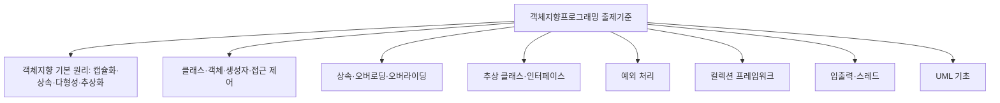

<Callout type="info">
  **이번 문서의 목표:** 이 파일을 다 읽으면 독학사 학위제도 안에서 3단계 객체지향프로그래밍이 어떤 시험인지 한 문장으로 설명할 수 있고, 뒤에 이어질 24개 편이 어떤 순서로 이 시험을 대비하는지 스스로 지도를 그릴 수 있다.
</Callout>

## 왜 시험 구조부터 알아야 하는가

객체지향프로그래밍(Object-Oriented Programming, 줄여서 OOP)을 처음 시험 과목으로 접하는 학습자가 흔히 저지르는 실수는 "일단 자바(Java) 문법책을 처음부터 끝까지 정독하자"는 접근입니다. 그런데 독학사(獨學士)는 정해진 출제기준에 맞춰 채점되는 국가 시험이므로, 출제기준에 없는 영역에 시간을 쏟으면 비효율적이고, 반대로 출제기준에 있는 영역을 얕게 알면 합격선을 넘기 어렵습니다. 이 편은 코드를 한 줄이라도 보기 전에 "이 시험이 정확히 무엇을 묻는가"부터 확정하는 단계입니다.

> **쉽게 말하면:** 낯선 도시를 무작정 걷기 전에 지도를 펴서 "지금 몇 층에 있고, 무엇을 챙겨야 다음 층으로 갈 수 있는지"를 확인하는 단계입니다.

## 1. 독학사 학위제도와 3단계의 위치

**독학사**는 국가평생교육진흥원(National Institute for Lifelong Education, 줄여서 NILE, 국평원)이 주관하는 시험으로, 정규 대학에 다니지 않아도 정해진 단계를 순서대로 통과하면 학사 학위를 받을 수 있는 제도입니다.

| 단계 | 이름 | 내용 |
|------|------|------|
| 1단계 | 교양과정 인정시험 | 전공과 무관한 공통 교양 과목(국어, 영어, 일반수학 등) |
| 2단계 | 전공기초과정 인정시험 | 전공의 기초가 되는 과목(컴퓨터과학이면 C프로그래밍, 자료구조, 컴퓨터구조 등) |
| 3단계 | 전공심화과정 인정시험 | 전공기초 위에 쌓는 심화 과목(객체지향프로그래밍, 운영체제, 프로그래밍언어론 등) |
| 4단계 | 학위취득 종합시험 | 학위 수여 직전 마지막 종합 시험 |

이 표에서 알 수 있듯 **객체지향프로그래밍은 3단계, 즉 전공심화과정에 속합니다.** 전공심화라는 위치는 두 가지를 뜻합니다. 첫째, 2단계에서 이미 변수·제어문·함수·배열 같은 절차형(procedural) 프로그래밍의 기본기를 갖췄다고 전제합니다. 둘째, 단순히 문법을 아는 수준을 넘어 **왜 객체지향이라는 패러다임(paradigm, 문제를 바라보고 푸는 틀)이 필요한지, 코드 구조를 설계 관점에서 이해했는지**를 확인하는 문제가 나옵니다.

> **쉽게 말하면:** 독학사는 4층짜리 건물입니다. 객체지향프로그래밍은 3층(전공심화)에 있고, 2층(전공기초)에서 배운 기본 문법이라는 사다리를 타고 올라와야 이 층의 문제를 풀 수 있습니다.

**자주 틀리는 점**: "3단계니까 문법은 안 나오겠지"라고 생각하면 안 됩니다. 오히려 클래스 선언, 생성자 문법, 접근 제어자 표기처럼 세밀한 문법 지식이 개념 이해와 함께 계속 요구됩니다. 3단계가 요구하는 것은 문법을 몰라도 된다는 뜻이 아니라, 문법 위에 **설계 원리에 대한 이해**가 추가로 얹힌다는 뜻입니다.

## 2. 시험 방식과 문항 형태

독학사 각 단계의 세부 회차 정보는 공고마다 달라질 수 있으므로, 정확한 문항 수·시험 시간·합격 기준은 항상 **국가평생교육진흥원 공고 확인이 필요**합니다. 다만 여러 회차에서 공통적으로 유지되어 온 큰 틀은 다음과 같습니다.

- 문제 형식은 **4지선다형 객관식**이 중심입니다. 이 사이트의 `Quiz` 구성 요소가 보기 4개, 정답 1개 형태를 취하는 이유도 이 실제 시험 형식에 맞춘 것입니다.
- 문항은 크게 세 유형으로 나눌 수 있습니다. **정의형**(용어나 개념의 정의를 정확히 아는지), **비교·판별형**("옳지 않은 것을 고르시오"처럼 개념 간 경계를 구분하는 문제), **코드 추적형**(클래스 여러 개로 구성된 코드를 보고 실행 결과나 출력 순서를 예측하는 문제)입니다. 객체지향프로그래밍은 특히 코드 추적형과 비교·판별형의 비중이 높습니다. 상속·오버라이딩·다형성처럼 "겉보기엔 비슷하지만 동작은 다른" 개념이 많기 때문입니다.
- 시험은 **지필**(紙筆) 시험입니다. 컴퓨터 앞에서 코드를 직접 컴파일하고 실행해 보며 푸는 것이 아니라, 종이에 인쇄된 여러 클래스의 코드를 눈으로 읽고 객체 생성 순서·메서드 호출 순서·출력값을 머릿속으로 추적해서 답해야 합니다. 이 점이 이 시리즈 전체의 학습 방향을 결정짓습니다. 09편에서 배울 "실행 결과 추적" 습관, 12편의 종합 정리, 21~24편의 모의문제는 전부 이 지필 환경을 겨냥한 훈련입니다.

> **쉽게 말하면:** 이 시험은 "IDE(통합 개발 환경)가 있으면 풀 수 있는 문제"가 아니라 "컴파일러 없이도 사람이 손으로 객체를 추적하며 풀 수 있는 문제"를 목표로 훈련해야 하는 시험입니다.

## 3. 3단계 평가 수준이 요구하는 이해의 깊이

국가평생교육진흥원은 단계별로 요구하는 평가 수준을 다르게 정의합니다. 전공심화과정(3단계)은 "전공기초(2단계) 위에서 실제 설계·구현 원리를 이해하고 적용할 줄 아는가"를 확인하는 단계이며, 다음 네 가지 능력을 함께 요구한다고 볼 수 있습니다.

| 요구 능력 | 구체적으로 묻는 것 | 객체지향프로그래밍에서의 예 |
|-----------|---------------------|----------------------|
| 개념 이해 | 용어의 정의와 개념 간 차이를 정확히 아는가 | 오버로딩과 오버라이딩의 차이, 추상 클래스와 인터페이스의 차이 |
| 코드 해석 | 여러 클래스로 구성된 코드를 읽고 실행 결과를 예측할 수 있는가 | 부모·자식 클래스가 섞인 코드에서 어떤 메서드가 호출되는지 |
| 설계 관점 | 왜 이런 문법·구조가 필요한지 원리를 설명할 수 있는가 | 캡슐화가 유지보수성을 높이는 이유, 다형성이 확장성을 주는 이유 |
| 오류 판별 | 잘못된 코드나 잘못된 개념 설명을 골라낼 수 있는가 | 접근 제어자를 잘못 써서 컴파일 오류가 나는 코드, 잘못된 오버라이딩 시그니처 |

이 네 능력은 뒤에 나올 편들의 구성과 그대로 대응됩니다. 04~07편은 "개념 이해"와 "코드 해석"의 기초를 다지고, 08~11편은 상속·다형성·추상화의 "설계 관점"을 집중적으로 파며, 12편에서 이를 종합합니다. 13편 이후 예외·컬렉션·스레드·UML까지 범위를 넓히면서 "오류 판별" 능력도 함께 훈련합니다.

> **쉽게 말하면:** 이 시험은 "정의를 아는가"에서 멈추지 않고 "그 정의가 왜 필요하고, 실제 코드에 적용하면 무슨 일이 벌어지는지 맞힐 수 있는가"까지 확인합니다. 그래서 이 문서 시리즈도 정의를 말하고 끝내지 않고 반드시 코드와 실행 결과, 그리고 "왜"를 함께 설명합니다.

**자주 틀리는 점**: 용어의 사전적 정의만 암기하고 "이건 안다"고 착각하는 경우가 많습니다. 예를 들어 "다형성은 하나의 이름으로 여러 형태의 동작을 하는 것"이라는 문장을 외워도, 실제 코드에서 부모 타입 참조 변수가 자식 객체를 가리킬 때 어떤 메서드가 실행되는지 추적하지 못하면 문제를 풀 수 없습니다. 정의는 출발점일 뿐, 코드에 적용해 보는 연습이 반드시 뒤따라야 합니다.

## 4. 출제 영역 개관

객체지향프로그래밍 3단계는 국가평생교육진흥원이 공개하는 과목별 평가영역을 기준으로 다음과 같은 큰 영역으로 나눌 수 있습니다(정확한 최신 세부 항목·배점은 공고 확인 필요).

<Steps>

### 대영역 목록을 먼저 훑는다

세부 설명을 읽기 전에 대영역 이름만 쭉 나열해 보고, "내가 지금 무엇을 모르는지" 스스로 점검합니다. 이 시리즈의 04~20편이 위 그림의 영역을 순서대로 다룹니다.

### 각 대영역의 요구 깊이를 확인한다

같은 대영역 안에서도 "개념만 알면 되는 항목"과 "코드로 직접 추적해야 하는 항목"이 섞여 있습니다. 예를 들어 상속·다형성 영역은 정의를 아는 것만으로는 부족하고, 동적 바인딩(dynamic binding, 실행 시점에 실제로 호출될 메서드가 정해지는 것)에 따라 실행 결과가 달라지는 코드를 직접 손으로 추적할 수 있어야 합니다.

### 기출 경향과 대조한다

출제기준은 "낼 수 있는 범위"를 정해 둔 것이고, 실제로 어떤 항목이 자주 나오는지는 기출 경향과 함께 봐야 감이 잡힙니다. 21~24편에서 이 감각을 모의문제와 기출 패턴 분석으로 직접 훈련합니다.

</Steps>

## 5. 이 시리즈 24개 편의 전체 지도

앞으로 이어질 편들은 크게 세 구간으로 나뉩니다.

| 구간 | 편 번호 | 목적 |
|------|---------|------|
| 선행 | 01–05 | 시험 구조, Java 기초 문법 리마인드, 객체지향 언어로서 Java 개관 |
| 본론 | 04–20 | 클래스·객체 → 캡슐화·접근 제어·패키지 → 상속·오버로딩·오버라이딩·다형성 → 추상 클래스·인터페이스 → 예외·컬렉션·I/O·스레드·UML 순서로 심화 |
| 기출·모의 | 21–24 | 주제별 종합 모의(21–22편), 기출 패턴 분석(23편), 최종 모의시험(24편)으로 실전 감각 훈련 |

이 지도에서 지금 읽고 있는 01편이 하는 역할은 "본론에 들어가기 전에 왜 이 순서로 배우는지 납득시키는 것"입니다. 02편은 Java 기초 문법을 코드 읽기 관점에서 리마인드하고, 03편은 객체지향 4대 특성을 Java 언어 맥락에서 정리한 뒤, 04편부터 본격적인 클래스·객체 학습이 시작됩니다.

## 핵심 정리

- 독학사는 1~4단계로 구성된 학위 취득 제도이며, 객체지향프로그래밍은 3단계(전공심화과정)에 속한다.
- 시험은 지필 4지선다형 객관식이 중심이며, 특히 코드 추적형과 비교·판별형 문항의 비중이 높다.
- 3단계 평가 수준은 개념 이해, 코드 해석, 설계 관점, 오류 판별 네 가지를 함께 요구하며, 이 시리즈의 구성도 이 네 능력에 맞춰 짜여 있다.
- 출제 영역은 객체지향 기본 원리, 클래스·객체·접근 제어, 상속·다형성, 추상 클래스·인터페이스, 예외·컬렉션·I/O·스레드, UML까지 폭넓게 걸쳐 있다.
- 회차별 문항 수·시험 시간·합격 기준은 공고마다 달라질 수 있으므로 항상 최신 공고 확인이 필요하다.

## 마무리 복습

<Quiz
  questionNumber={1}
  question="독학사 학위제도의 단계 구성과 객체지향프로그래밍의 위치에 대한 설명으로 가장 적절한 것은?"
  options={['객체지향프로그래밍은 2단계 전공기초과정에 속한다.', '객체지향프로그래밍은 3단계 전공심화과정에 속한다.', '객체지향프로그래밍은 1단계 교양과정에 속한다.', '독학사는 전공 구분 없이 모든 과목이 동일한 단계에서 출제된다.']}
  correctAnswer={2}
  explanation="독학사는 1단계 교양과정, 2단계 전공기초과정, 3단계 전공심화과정, 4단계 학위취득 종합시험으로 구성되며, 객체지향프로그래밍은 3단계 전공심화과정 과목이다."
  optionExplanations={['2단계 전공기초과정은 C프로그래밍·자료구조 등 기초 과목이 속하는 단계다.', '정답. 객체지향프로그래밍은 전공심화과정인 3단계에 속한다.', '1단계는 국어·영어 등 공통 교양 과목이 속하는 단계다.', '독학사는 단계별로 교양·전공기초·전공심화·종합시험 성격이 다르게 구분되어 있다.']}
/>

<Quiz
  questionNumber={2}
  question="3단계 전공심화과정이 2단계 전공기초과정과 구분되는 점으로 가장 적절한 것은?"
  options={['3단계는 문법 지식이 전혀 필요 없고 개념만 알면 충분하다.', '3단계는 2단계의 기본기 위에서 설계 원리에 대한 이해까지 함께 요구한다.', '3단계는 지필 시험이 아니라 컴퓨터 실습 시험으로 진행된다.', '3단계는 객관식이 아니라 전부 서술형으로만 출제된다.']}
  correctAnswer={2}
  explanation="3단계는 절차형 프로그래밍 기본기를 갖춘 상태를 전제하고, 그 위에서 왜 이런 문법·구조가 필요한지 설계 원리까지 이해했는지를 함께 평가한다."
  optionExplanations={['문법 지식(클래스 선언, 접근 제어자 표기 등)은 3단계에서도 여전히 세밀하게 요구된다.', '정답. 3단계는 기본 문법 위에 설계 원리에 대한 이해가 추가로 얹히는 단계다.', '독학사 시험은 3단계도 지필 시험이 중심이며 컴퓨터 앞에서 코드를 실행하며 푸는 방식이 아니다.', '독학사는 4지선다형 객관식이 중심이며 전부 서술형으로만 출제된다고 단정할 수 없다.']}
/>

<Quiz
  questionNumber={3}
  question="독학사 객체지향프로그래밍 시험 방식에 대한 설명으로 옳지 않은 것은?"
  options={['시험은 지필 방식으로 진행되며 컴퓨터로 코드를 직접 실행하며 풀지 않는다.', '문제 형식은 4지선다형 객관식이 중심이다.', '코드 추적형과 비교·판별형 문항의 비중이 높은 편이다.', '회차별 문항 수와 시험 시간은 모든 회차에서 항상 동일하게 고정되어 있다.']}
  correctAnswer={4}
  explanation="회차별 문항 수, 시험 시간, 합격 기준 등은 공고마다 달라질 수 있으므로 항상 최신 공고를 확인해야 하며, 모든 회차에서 항상 동일하게 고정되어 있다고 단정할 수 없다."
  optionExplanations={['옳은 설명이다. 독학사는 지필 시험이며 컴파일러 실행 없이 코드를 눈으로 읽고 풀어야 한다.', '옳은 설명이다. 독학사 시험은 4지선다형 객관식이 중심이다.', '옳은 설명이다. 상속·오버라이딩·다형성처럼 겉보기엔 비슷하지만 동작이 다른 개념이 많아 코드 추적형·비교형 비중이 높다.', '옳지 않은 설명이므로 정답이다. 세부 사항은 공고마다 달라질 수 있어 확인이 필요하다.']}
/>

<Quiz
  questionNumber={4}
  question="독학사 3단계(전공심화과정)의 평가 수준이 요구하는 능력으로 가장 거리가 먼 것은?"
  options={['용어의 정의와 개념 간 차이를 정확히 아는 것', '여러 클래스로 구성된 코드를 읽고 실행 결과를 예측하는 것', '왜 이런 문법·구조가 필요한지 설계 원리를 설명하는 것', '실제 기업의 대규모 분산 시스템을 설계하고 배포하는 것']}
  correctAnswer={4}
  explanation="전공심화과정은 개념 이해, 코드 해석, 설계 관점, 오류 판별 능력을 요구하는 단계이며, 대규모 분산 시스템 설계·배포는 전공심화 단계에서 요구하는 능력의 범위를 벗어난다."
  optionExplanations={['전공심화과정이 요구하는 개념 이해 능력에 해당한다.', '전공심화과정이 요구하는 코드 해석 능력에 해당한다.', '전공심화과정이 요구하는 설계 관점 능력에 해당한다.', '정답. 이는 전공심화 이후 실무 영역에 가까운 능력으로, 전공심화과정의 평가 범위를 벗어난다.']}
/>

<Quiz
  questionNumber={5}
  question="이 시리즈에서 21~24편(기출·모의 구간)과 04~20편(본론 구간)의 관계를 가장 바르게 설명한 것은?"
  options={['21~24편은 04~20편과 전혀 무관한 새로운 범위를 다룬다.', '21~24편은 04~20편에서 다룬 영역을 바탕으로 모의문제와 기출 패턴 분석으로 실전 감각을 훈련한다.', '04~20편을 읽지 않아도 21~24편만으로 전체 출제기준을 대체할 수 있다.', '21~24편은 선행 편(01~03편)의 내용만 반복해서 다룬다.']}
  correctAnswer={2}
  explanation="21~22편은 본론에서 다룬 주제별 종합 모의문제, 23편은 기출 패턴 분석, 24편은 전 범위 최종 모의시험으로, 모두 본론에서 학습한 내용을 실전 감각으로 훈련하는 구간이다."
  optionExplanations={['21~24편은 본론에서 다룬 영역을 근거로 구성된 모의·기출 문제 묶음이다.', '정답. 기출·모의 구간은 본론에서 다룬 내용을 실전 형태로 훈련하는 역할을 한다.', '모의·기출 문제만으로는 개념 설명이 충분하지 않으므로 본론 학습이 선행되어야 한다.', '21~24편은 선행 편이 아니라 본론에서 다룬 영역별 모의·기출 문제로 구성된다.']}
/>

<Quiz
  questionNumber={6}
  question="출제 영역에 대한 설명으로 옳지 않은 것은?"
  options={['객체지향 기본 원리(캡슐화·상속·다형성·추상화)는 출제 영역에 포함된다.', '예외 처리, 컬렉션 프레임워크, 스레드, UML 기초도 출제 영역에 포함된다.', '정확한 최신 항목과 배점은 공고 확인이 필요하다.', '출제 영역은 절차형 프로그래밍의 배열·포인터 문법으로 한정된다.']}
  correctAnswer={4}
  explanation="객체지향프로그래밍 3단계의 출제 영역은 객체지향 기본 원리, 클래스·접근 제어, 상속·다형성, 추상 클래스·인터페이스, 예외·컬렉션·I/O·스레드, UML까지 폭넓게 걸쳐 있으며, 절차형 문법인 배열·포인터로 한정되지 않는다."
  optionExplanations={['옳은 설명이다. 객체지향 기본 원리는 핵심 출제 영역이다.', '옳은 설명이다. 예외·컬렉션·스레드·UML도 출제기준에 포함된 영역이다.', '옳은 설명이다. 회차 공고마다 세부 사항이 달라질 수 있어 최신 공고 확인이 필요하다.', '정답. 포인터는 Java의 문법 요소가 아니며, 출제 영역은 절차형 문법이 아니라 객체지향 개념·구조 중심이다.']}
/>

<Quiz
  questionNumber={7}
  question="이 시리즈 24개 편의 구간 구분에 대한 설명으로 가장 적절한 것은?"
  options={['선행 구간(01–03편)은 시험 구조, Java 기초 문법 리마인드, 객체지향 언어 개관을 다룬다.', '본론 구간(04–20편)은 출제기준과 무관한 내용을 다룬다.', '기출·모의 구간(21–24편)은 선행 구간(01–03편) 내용만 반복한다.', '이 시리즈는 구간 구분 없이 무작위 순서로 편성되어 있다.']}
  correctAnswer={1}
  explanation="선행 구간(01–03편)은 시험 구조, Java 기초 문법 리마인드, 객체지향 언어로서 Java 개관을 정리하는 구간이다."
  optionExplanations={['정답. 선행 구간은 본론에 들어가기 전 시험 구조와 문법 리마인드, 언어 개관을 정리한다.', '본론 구간(04–20편)은 출제기준의 핵심 대영역을 순서대로 다루는 구간이다.', '기출·모의 구간(21–24편)은 본론에서 다룬 영역별 모의·기출 문제로 구성된다.', '이 시리즈는 선행·본론·기출·모의 세 구간으로 목적에 맞게 순서대로 편성되어 있다.']}
/>

## 참고 자료

- [국가평생교육진흥원 독학학위제 - 시험안내](https://bdes.nile.or.kr/nile/exam/nExam2_1.do)
- [국가평생교육진흥원 독학학위제 - 과목별 평가영역](https://bdes.nile.or.kr/nile/study/nStudy2_1.do)
