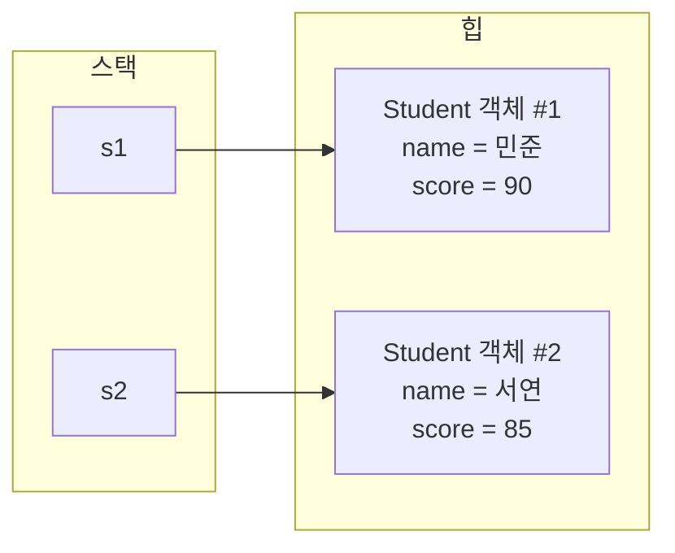
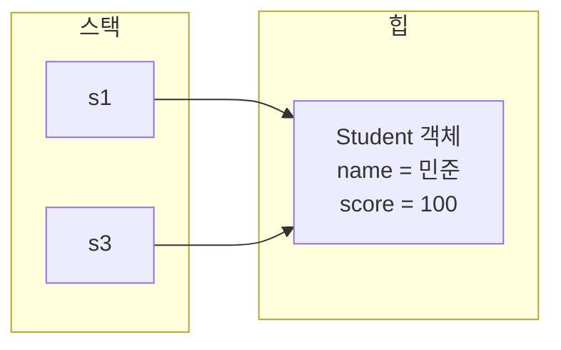

<Callout type="info">
  **이번 문서의 목표:** 이 파일을 다 읽으면 클래스 선언문을 필드·생성자·메서드로 쪼개 읽을 수 있고, `new` 연산자가 실행될 때 메모리에서 실제로 무슨 일이 벌어지는지 그림으로 그릴 수 있으며, 정보은닉이 왜 필요한지 코드로 설명할 수 있다.
</Callout>

## 왜 클래스·객체 구조부터 깊게 파는가

03편에서 클래스는 설계도, 객체는 그 설계도로 만든 실체라고 정리했습니다. 이 편은 그 설계도를 이루는 세 요소(필드, 생성자, 메서드)를 하나씩 뜯어보고, `new` 연산자가 실행될 때 컴퓨터 메모리 안에서 실제로 무슨 일이 일어나는지까지 확인합니다. 독학사 시험은 이 구조를 "정의를 아는가"로 그치지 않고, **여러 객체를 만들었을 때 각 객체의 필드 값이 서로 독립적인지, 아니면 같은 값을 공유하는지**를 코드 추적으로 묻는 경우가 많습니다. 이 구분이 헷갈리면 이후 05편의 생성자·this·super, 08~09편의 상속·다형성까지 전부 흔들리므로, 이 편에서 메모리 관점의 그림을 확실히 잡아야 합니다.

> **쉽게 말하면:** 03편이 "왜 객체지향이 필요한가"라는 철학을 세운 편이라면, 이 편은 "그 철학을 실제 코드로 쓰면 컴퓨터 안에서 정확히 무슨 일이 일어나는가"를 확인하는 편입니다.

## 1. 클래스 선언의 구조 — 필드·생성자·메서드

클래스는 크게 세 가지 구성 요소로 이루어집니다.

```java
class Student {
    // 1. 필드(field) — 객체가 가지는 데이터
    String name;
    int score;

    // 2. 생성자(constructor) — 객체를 초기화하는 특수 메서드
    Student(String name, int score) {
        this.name = name;
        this.score = score;
    }

    // 3. 메서드(method) — 객체가 할 수 있는 동작
    void printInfo() {
        System.out.println(name + " : " + score + "점");
    }
}
```

| 구성 요소 | 뜻 | 이 예제에서 |
|-----------|-----|--------------|
| 필드(field) | 클래스가 정의하는 데이터. 객체마다 독립적으로 가지는 값(인스턴스 변수) | `name`, `score` |
| 생성자(constructor) | 객체가 `new`로 생성되는 순간 자동으로 호출되어 필드를 초기화하는 특수한 메서드. 클래스 이름과 똑같은 이름을 쓰고 반환 타입을 적지 않는다 | `Student(String name, int score)` |
| 메서드(method) | 객체가 수행할 수 있는 동작을 정의한 코드 블록 | `printInfo()` |

**자주 틀리는 점**: 생성자를 "반환 타입이 없는 메서드"로 착각하는 경우가 있는데, 정확히는 생성자에는 **반환 타입 자체를 적지 않습니다**(`void`도 적지 않습니다). `void Student(...)`처럼 `void`를 붙이면 그것은 생성자가 아니라 우연히 클래스와 이름이 같은 일반 메서드가 되어버립니다.

## 2. 객체 생성과 new 연산자 — 메모리 그림으로 보기

객체는 `new` 연산자로 생성합니다. `new Student("민준", 90)`이 실행되면 다음 순서로 일이 진행됩니다.

<Steps>

### 힙 영역에 새 객체 공간이 만들어진다

Java는 객체를 **힙**(heap)이라는 메모리 영역에 저장합니다. `new Student(...)`가 실행되면 힙에 `Student` 한 개 분량의 공간(필드 `name`, `score`를 담을 공간)이 새로 만들어집니다.

### 생성자가 실행되어 필드가 채워진다

방금 만들어진 공간에 생성자 `Student(String name, int score)`가 실행되며 `name`에 "민준", `score`에 90이 채워집니다.

### 힙 주소가 참조 변수에 대입된다

`Student s1 = new Student("민준", 90);`에서 `s1`은 **스택**(stack)이라는 별도의 메모리 영역에 있는 참조형 변수입니다. `new`가 만든 힙 객체의 위치(주소)가 `s1`에 저장됩니다.

</Steps>

```java
public class ObjectDemo {
    public static void main(String[] args) {
        Student s1 = new Student("민준", 90);
        Student s2 = new Student("서연", 85);
        s1.printInfo();
        s2.printInfo();
    }
}
```

```text
민준 : 90점
서연 : 85점
```

이 상황을 메모리 그림으로 그리면 다음과 같습니다.



`s1`과 `s2`는 서로 다른 힙 공간을 가리키므로, 두 객체의 `name`, `score`는 완전히 독립적입니다. 이것이 "같은 클래스로 여러 객체를 만들면 각자 독립된 데이터를 가진다"는 원리의 실체입니다.

> **쉽게 말하면:** 스택에 있는 변수 `s1`, `s2`는 "주소가 적힌 명함"이고, 힙에 있는 실제 객체는 "그 주소에 있는 집"입니다. 명함(변수)은 스택에 작게 있지만, 실제 살림(필드 값)은 힙에 있는 집 안에 있습니다.

## 3. 참조 대입의 함정 — 객체를 공유할 때

02편에서 참조형 변수는 "값 자체가 아니라 참조값(주소 개념)을 저장한다"고 했습니다. 이 원리가 객체에도 그대로 적용되며, 시험에서 자주 나오는 함정 지점입니다.

```java
public class ReferenceDemo {
    public static void main(String[] args) {
        Student s1 = new Student("민준", 90);
        Student s3 = s1;
        s3.score = 100;
        System.out.println(s1.score);
    }
}
```

```text
100
```

`Student s3 = s1;`은 새로운 객체를 만드는 것이 아니라, `s1`이 가리키는 **같은 힙 객체의 주소를 s3에도 복사**하는 것입니다. 그 결과 `s1`과 `s3`는 서로 다른 변수이지만 힙 안의 같은 객체를 가리키므로, `s3.score`를 바꾸면 `s1.score`도 함께 바뀐 것처럼 보입니다.



**자주 틀리는 점**: `Student s3 = s1;`을 보고 "s1의 내용을 복사한 새 객체가 하나 더 생긴다"고 착각하는 경우가 매우 많습니다. 정확히는 **객체가 복사되는 것이 아니라 객체를 가리키는 참조(주소)만 복사**됩니다. 실제로 값이 똑같은 새 객체를 만들려면 `new Student(s1.name, s1.score)`처럼 필드 값을 읽어 새 생성자를 호출해야 합니다.

## 4. 정보은닉과 캡슐화의 기초

**정보은닉**(information hiding)은 캡슐화의 핵심 목적으로, 객체 내부의 데이터를 외부에서 직접 조작하지 못하게 막고 정해진 메서드를 통해서만 접근하게 하는 것입니다. 06편에서 `public`, `private` 등 접근 제어자별 세부 규칙을 다루기 전에, 이 편에서는 "필드를 그대로 공개했을 때 어떤 문제가 생기는가"부터 확인합니다.

```java
class Student {
    String name;
    int score;
}

public class NoHidingDemo {
    public static void main(String[] args) {
        Student s = new Student();
        s.score = -50;
        System.out.println(s.score);
    }
}
```

```text
-50
```

필드 `score`가 아무런 보호 장치 없이 공개되어 있으면, 외부 코드가 `s.score = -50;`처럼 시험 점수로 말이 되지 않는 값을 아무 제약 없이 넣을 수 있습니다. 이를 막으려면 필드를 숨기고, 값이 유효한지 검사하는 메서드를 통해서만 값을 바꾸게 해야 합니다.

```java
class SafeStudent {
    private int score;

    void setScore(int score) {
        if (score >= 0 && score <= 100) {
            this.score = score;
        } else {
            System.out.println("유효하지 않은 점수입니다.");
        }
    }

    int getScore() {
        return score;
    }
}

public class HidingDemo {
    public static void main(String[] args) {
        SafeStudent s = new SafeStudent();
        s.setScore(-50);
        s.setScore(95);
        System.out.println(s.getScore());
    }
}
```

```text
유효하지 않은 점수입니다.
95
```

| 단계 | 호출 | score 값 | 출력 |
|------|------|----------|------|
| 1 | `s.setScore(-50)` | 변경 안 됨(기본값 0 유지) | "유효하지 않은 점수입니다." |
| 2 | `s.setScore(95)` | 95로 변경 | (출력 없음) |
| 3 | `s.getScore()` | 95 | 95 |

이렇게 필드를 `private`으로 숨기고, `set`으로 시작하는 **setter**와 `get`으로 시작하는 **getter** 메서드를 통해서만 접근하게 하는 패턴이 캡슐화의 가장 대표적인 구현입니다. `setScore`처럼 값을 검증하는 로직을 setter 안에 넣으면, 객체가 항상 "유효한 상태"만 유지하도록 강제할 수 있습니다.

> **쉽게 말하면:** 정보은닉은 "계좌 잔액을 아무나 직접 고칠 수 없게 하고, 반드시 입금·출금 창구(메서드)를 거치게 하는 것"과 같습니다. 창구에서는 "출금액이 잔액보다 크면 거절한다"처럼 규칙을 검사할 수 있지만, 잔액 숫자를 직접 만지게 허용하면 그 규칙을 지킬 방법이 없습니다.

**자주 틀리는 점**: getter·setter를 "무조건 모든 필드에 기계적으로 붙여야 하는 관례"로만 이해하는 경우가 있습니다. 실제 출제 포인트는 "왜 이 패턴이 데이터의 유효성을 보장하는가"입니다. setter 안에 검증 로직이 전혀 없다면(단순히 `this.score = score;`만 있다면) 필드를 그냥 `public`으로 여는 것과 실질적인 차이가 크지 않다는 점도 함께 알아 두어야 합니다.

## 5. 필드의 기본값 — 초기화하지 않으면 어떻게 되는가

지역 변수(메서드 안에서 선언한 변수)와 달리, 클래스의 필드는 명시적으로 초기화하지 않아도 자료형에 따른 **기본값**으로 자동 초기화됩니다.

| 필드 타입 | 기본값 |
|-----------|--------|
| `int`, `long`, `short`, `byte` | 0 |
| `double`, `float` | 0.0 |
| `boolean` | `false` |
| `char` | `''`(빈 문자) |
| 참조형(`String`, 배열, 객체 등) | `null` |

```java
class Box {
    int count;
    String label;
}

public class DefaultValueDemo {
    public static void main(String[] args) {
        Box b = new Box();
        System.out.println(b.count);
        System.out.println(b.label);
    }
}
```

```text
0
null
```

**자주 틀리는 점**: 이 기본값 초기화는 **필드에만** 적용됩니다. 메서드 안에서 선언한 지역 변수는 기본값이 자동으로 채워지지 않으며, 초기화하지 않고 사용하려 하면 컴파일 오류가 발생합니다. 시험 지문에서 "필드인지 지역 변수인지"를 먼저 구분하지 않으면 이 함정에 걸리기 쉽습니다.

## 핵심 정리

- 클래스는 필드(데이터), 생성자(초기화), 메서드(동작) 세 요소로 구성되며, 생성자는 클래스 이름과 같고 반환 타입을 적지 않는다.
- `new` 연산자는 힙 메모리에 객체 공간을 만들고 생성자를 실행하며, 참조형 변수는 스택에서 그 힙 주소를 저장한다.
- 같은 클래스로 만든 객체는 서로 독립된 필드 값을 가지지만, `Student s3 = s1;`처럼 참조를 대입하면 두 변수가 같은 객체를 공유하게 된다.
- 정보은닉은 필드를 숨기고 검증 로직이 담긴 getter·setter로만 접근하게 해 객체가 항상 유효한 상태를 유지하도록 강제하는 것이다.
- 클래스의 필드는 초기화하지 않아도 자료형에 따른 기본값(0, false, null 등)으로 자동 초기화되지만, 지역 변수는 그렇지 않다.

## 마무리 복습

<Quiz
  questionNumber={1}
  question="생성자에 대한 설명으로 옳은 것은?"
  options={['생성자는 반드시 void 반환 타입을 명시해야 한다.', '생성자의 이름은 클래스 이름과 같아야 하며 반환 타입을 적지 않는다.', '생성자는 객체가 이미 생성된 후 수동으로 호출해야 한다.', '한 클래스에는 생성자를 하나만 정의할 수 있다.']}
  correctAnswer={2}
  explanation="생성자는 클래스 이름과 동일한 이름을 가지며 반환 타입 자체를 적지 않는다. void를 붙이면 생성자가 아니라 일반 메서드가 된다."
  optionExplanations={['생성자는 void를 포함해 어떤 반환 타입도 적지 않는다.', '정답. 생성자 이름은 클래스 이름과 같고 반환 타입을 적지 않는다.', '생성자는 new 연산자로 객체를 생성하는 순간 자동으로 호출된다.', '한 클래스에 매개변수 목록이 다른 생성자를 여러 개 정의할 수 있다(생성자 오버로딩, 05편에서 다룬다).']}
/>

<Quiz
  questionNumber={2}
  question={"다음 코드에서 s1과 s2가 생성된 후의 관계에 대한 설명으로 옳은 것은?\n\n```java\nStudent s1 = new Student('민준', 90);\nStudent s2 = new Student('서연', 85);\n```"}
  options={['s1과 s2는 힙에서 같은 객체를 공유한다.', 's1과 s2는 힙에 각각 독립된 객체를 가지므로 서로의 필드 값에 영향을 주지 않는다.', 's1과 s2는 스택에 저장된 객체이므로 값이 그대로 복사된다.', 's2를 생성하는 순간 s1이 가리키던 객체는 사라진다.']}
  correctAnswer={2}
  explanation="new를 두 번 호출했으므로 힙에 서로 다른 두 개의 Student 객체가 만들어지고, s1과 s2는 각각 다른 객체를 가리킨다."
  optionExplanations={['new를 각각 호출했으므로 서로 다른 객체를 가리키며 공유하지 않는다.', '정답. new를 두 번 호출했으므로 독립된 두 객체가 만들어진다.', '객체 자체는 힙에 저장되고, 스택에는 그 객체를 가리키는 참조값만 저장된다.', 's1이 가리키는 객체는 s2 생성과 무관하게 계속 존재한다.']}
/>

<Quiz
  questionNumber={3}
  question={"다음 코드의 실행 결과로 옳은 것은?\n\n```java\nStudent s1 = new Student('민준', 90);\nStudent s3 = s1;\ns3.score = 100;\nSystem.out.println(s1.score);\n```"}
  options={['90', '100', '0', '컴파일 오류가 발생한다.']}
  correctAnswer={2}
  explanation="Student s3 = s1;은 새 객체를 만드는 것이 아니라 s1이 가리키는 같은 힙 객체의 주소를 s3에도 복사하는 것이므로, s3를 통해 값을 바꾸면 s1을 통해서도 바뀐 값이 보인다."
  optionExplanations={['s1과 s3는 같은 객체를 가리키므로 s3.score 변경이 s1.score에도 반영된다.', '정답. 참조 대입이므로 같은 객체를 공유해 100이 출력된다.', 'score 필드는 생성자에서 90으로 초기화된 후 100으로 변경되었으므로 0이 아니다.', '참조형 변수 대입은 정상적인 문법이므로 컴파일 오류가 아니다.']}
/>

<Quiz
  questionNumber={4}
  question="정보은닉(information hiding)에 대한 설명으로 옳지 않은 것은?"
  options={['객체 내부의 데이터를 외부에서 직접 조작하지 못하게 막는 것이다.', 'setter 메서드 안에 검증 로직을 넣으면 객체가 항상 유효한 상태를 유지하도록 강제할 수 있다.', '필드를 private으로 선언하면 그 즉시 정보은닉의 목적이 완전히 달성되며 setter 로직의 내용은 중요하지 않다.', '검증 로직 없이 단순히 값만 대입하는 setter라면 필드를 public으로 여는 것과 실질적인 차이가 거의 없다.']}
  correctAnswer={3}
  explanation="필드를 private으로 선언하는 것은 정보은닉의 출발점일 뿐이며, setter 안에 유효성 검증 로직이 없다면 필드를 public으로 여는 것과 실질적으로 큰 차이가 없다. 따라서 setter 로직의 내용이 중요하지 않다는 설명은 옳지 않다."
  optionExplanations={['옳은 설명이다. 정보은닉은 외부의 직접적인 데이터 조작을 막는 것이다.', '옳은 설명이다. 검증 로직이 있어야 객체가 유효한 상태를 유지한다.', '정답. private 선언만으로는 부족하며 setter 안의 검증 로직이 실제 정보은닉의 효과를 결정한다.', '옳은 설명이다. 검증 없는 setter는 public 필드와 실질적 차이가 거의 없다.']}
/>

<Quiz
  questionNumber={5}
  question={"다음 코드의 실행 결과로 옳은 것은?\n\n```java\nBox b = new Box();\nSystem.out.println(b.count);\nSystem.out.println(b.label);\n```\n\n(Box는 int count, String label 필드만 선언하고 초기화하지 않았다)"}
  options={['0과 null이 순서대로 출력된다.', '컴파일 오류가 발생한다.', '실행 시 예외가 발생하며 프로그램이 종료된다.', 'count와 label 모두 빈 문자열로 출력된다.']}
  correctAnswer={1}
  explanation="클래스의 필드는 초기화하지 않아도 자료형에 따른 기본값으로 자동 초기화된다. int는 0, 참조형인 String은 null이 기본값이므로 순서대로 0과 null이 출력된다."
  optionExplanations={['정답. int 필드의 기본값은 0, 참조형 필드의 기본값은 null이다.', '필드를 초기화하지 않아도 기본값이 자동으로 채워지므로 컴파일 오류가 아니다.', '기본값 출력은 정상 동작이며 예외가 발생하지 않는다.', 'int의 기본값은 빈 문자열이 아니라 0이고, String의 기본값은 빈 문자열이 아니라 null이다.']}
/>

<Quiz
  questionNumber={6}
  question="new Student('민준', 90) 실행 시 일어나는 일의 순서로 가장 적절한 것은?"
  options={['참조 변수에 값이 먼저 저장된 뒤 힙에 객체 공간이 만들어진다.', '힙에 객체 공간이 만들어지고 생성자가 실행되어 필드가 채워진 뒤, 그 힙 주소가 참조 변수에 저장된다.', '스택에만 객체가 만들어지고 힙은 사용되지 않는다.', '생성자는 실행되지 않고 필드는 항상 기본값으로만 남는다.']}
  correctAnswer={2}
  explanation="new 연산자가 실행되면 힙에 객체 공간이 만들어지고 생성자가 실행되어 필드 값이 채워진 뒤, 그 힙 객체의 주소가 스택의 참조 변수에 저장된다."
  optionExplanations={['참조 변수에 값이 저장되려면 먼저 힙에 객체가 만들어지고 그 주소가 있어야 한다.', '정답. 힙 공간 생성과 생성자 실행이 먼저이고, 그 결과 주소가 참조 변수에 저장된다.', '객체 자체는 힙에 저장되고, 스택에는 그 객체를 가리키는 참조값만 저장된다.', '생성자가 실행되어 인자로 전달된 값으로 필드가 채워진다.']}
/>

## 참고 자료

- [Oracle Java Tutorials - Classes and Objects](https://docs.oracle.com/javase/tutorial/java/javaOO/index.html)
