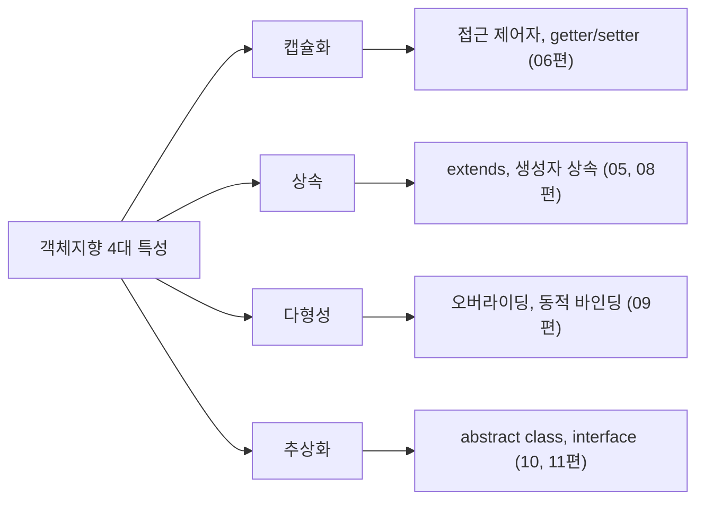

<Callout type="info">
  **이번 문서의 목표:** 이 파일을 다 읽으면 캡슐화·상속·다형성·추상화 네 가지를 각각 정의로 설명할 수 있고, Java 코드에서 이 네 특성이 각각 어떤 문법 요소에 대응하는지 짚어낼 수 있다.
</Callout>

## 왜 4대 특성부터 언어 관점으로 정리하는가

**객체지향 프로그래밍**(Object-Oriented Programming, OOP)은 프로그램을 "데이터를 처리하는 절차의 나열"이 아니라 "데이터와 그 데이터를 다루는 동작을 하나로 묶은 객체(object)들의 상호작용"으로 바라보는 프로그래밍 패러다임(paradigm, 문제를 바라보고 풀어내는 틀)입니다. 02편까지는 변수·제어문·메서드·배열처럼 절차형 프로그래밍에서도 쓰는 문법을 리마인드했다면, 이 편부터는 "왜 객체지향이 필요한가"라는 관점 자체를 새로 세워야 합니다.

독학사 시험은 이 4대 특성을 일반론으로 묻기도 하지만, 훨씬 더 자주 "Java 코드의 어느 부분이 이 특성을 구현한 것인가"를 묻습니다. 그래서 이 편은 각 특성을 추상적으로 설명하는 데서 그치지 않고, 뒤에 이어질 04~12편에서 각각 어느 문법으로 구체화되는지 미리 지도를 그려 둡니다.

> **쉽게 말하면:** 이 편은 "객체지향이라는 네 개의 방"이 있는 집의 평면도를 먼저 그리는 단계입니다. 각 방(캡슐화, 상속, 다형성, 추상화)에 실제로 어떤 가구(Java 문법)가 놓이는지는 04편부터 하나씩 들어가서 확인합니다.

## 1. 객체와 클래스 — 가장 먼저 구분할 두 단어

4대 특성을 설명하기 전에 **객체**(object)와 **클래스**(class)를 구분해야 합니다. 이 둘을 혼동하면 이후 모든 설명이 헷갈리게 됩니다.

- **클래스**는 객체를 만들기 위한 **설계도**입니다. 어떤 필드(데이터)와 어떤 메서드(동작)를 가질지 미리 정의해 둔 틀입니다.
- **객체**는 그 설계도를 바탕으로 실제로 만들어진(인스턴스화, instantiation) **실체**입니다. 하나의 클래스로 여러 개의 객체를 만들 수 있습니다.

```java
class Dog {
    String name;
    void bark() {
        System.out.println(name + "이(가) 짖습니다.");
    }
}

public class ObjectDemo {
    public static void main(String[] args) {
        Dog d1 = new Dog();
        d1.name = "초코";
        Dog d2 = new Dog();
        d2.name = "보리";
        d1.bark();
        d2.bark();
    }
}
```

```text
초코이(가) 짖습니다.
보리이(가) 짖습니다.
```

`Dog`는 클래스(설계도)이고, `d1`과 `d2`는 그 설계도로 만들어진 서로 다른 객체(실체)입니다. 같은 설계도에서 나왔지만 `name` 값이 각각 다르므로 독립된 데이터를 가집니다. 이 구조는 04편에서 필드·생성자와 함께 훨씬 깊게 다룹니다.

> **쉽게 말하면:** 클래스는 붕어빵 틀이고, 객체는 그 틀로 찍어낸 붕어빵입니다. 틀은 하나지만 붕어빵은 여러 개를 만들 수 있고, 각 붕어빵 속에 든 팥의 양(필드 값)은 서로 다를 수 있습니다.

## 2. 캡슐화 — 데이터와 동작을 하나로 묶고 숨기기

**캡슐화**(encapsulation)는 관련된 데이터(필드)와 그 데이터를 다루는 동작(메서드)을 하나의 클래스 안에 묶고, 외부에서 데이터에 함부로 접근하지 못하게 숨기는 것을 말합니다. "캡슐(capsule)"이라는 이름 그대로, 약을 캡슐 안에 넣어 겉에서는 내용물을 직접 만질 수 없게 하는 것과 같은 발상입니다.

> **쉽게 말하면:** 캡슐화는 "이 데이터는 이 클래스만 직접 만질 수 있고, 바깥에서는 정해진 통로(메서드)로만 접근하게 한다"는 원칙입니다.

캡슐화는 Java에서 주로 **접근 제어자**(`private`, `public` 등)와 **getter·setter 메서드**로 구현됩니다. 이 부분은 06편에서 접근 제어자별 규칙과 함께 깊게 다루므로, 여기서는 캡슐화가 "왜 필요한가"에 집중합니다.

```java
class BankAccount {
    private int balance;

    void deposit(int amount) {
        if (amount > 0) {
            balance += amount;
        }
    }

    int getBalance() {
        return balance;
    }
}
```

`balance` 필드가 `private`이 아니라면, 외부 코드가 `account.balance = -1000;`처럼 잔액을 음수로 직접 바꿔버릴 수 있습니다. 캡슐화는 `balance`를 숨기고 `deposit` 메서드를 통해서만 값을 바꾸게 강제해, "0 이하 금액은 입금되지 않는다"는 규칙을 항상 지키게 만듭니다.

**자주 틀리는 점**: 캡슐화를 "필드를 private으로 선언하는 것"만으로 좁게 이해하는 경우가 많습니다. 정확히는 **데이터와 동작을 하나로 묶는 것**(정보를 은닉할 대상과 그 정보를 다루는 규칙을 같은 클래스 안에 두는 것) 전체가 캡슐화이며, `private` 접근 제어자는 그 은닉을 강제하는 도구 중 하나입니다.

## 3. 상속 — 있는 것을 물려받아 확장하기

**상속**(inheritance)은 기존 클래스(부모 클래스, superclass)의 필드와 메서드를 새 클래스(자식 클래스, subclass)가 물려받아 재사용하고, 필요하면 새 기능을 추가하는 것을 말합니다. Java에서는 `extends` 키워드로 상속 관계를 선언합니다.

```java
class Animal {
    void eat() {
        System.out.println("먹이를 먹습니다.");
    }
}

class Cat extends Animal {
    void meow() {
        System.out.println("야옹");
    }
}

public class InheritDemo {
    public static void main(String[] args) {
        Cat c = new Cat();
        c.eat();
        c.meow();
    }
}
```

```text
먹이를 먹습니다.
야옹
```

`Cat`은 `eat()`을 직접 선언하지 않았지만, `Animal`을 상속받았기 때문에 `eat()`을 그대로 사용할 수 있습니다. 이런 관계를 **is-a 관계**(Cat is a Animal, 고양이는 동물이다)라고 부릅니다. 상속의 세부 문법·규칙(생성자 상속 관련 기본, 오버로딩과의 관계)은 08편에서 본격적으로 다룹니다.

> **쉽게 말하면:** 상속은 "부모가 이미 가진 재산(필드·메서드)을 자식이 그대로 물려받고, 자식은 자기만의 것을 추가로 가질 수 있다"는 관계입니다.

## 4. 다형성 — 같은 이름, 다른 동작

**다형성**(polymorphism, "많을 다"와 "형태 형"을 합친 한자어로, 그리스어 어원상 "여러(poly) 형태(morph)"라는 뜻)은 같은 이름의 메서드 호출이 실제로 어떤 객체에서 실행되느냐에 따라 다른 동작을 하는 성질입니다.

```java
class Animal {
    void sound() {
        System.out.println("동물이 소리를 냅니다.");
    }
}

class Dog extends Animal {
    void sound() {
        System.out.println("멍멍");
    }
}

class Cat extends Animal {
    void sound() {
        System.out.println("야옹");
    }
}

public class PolyDemo {
    public static void main(String[] args) {
        Animal a1 = new Dog();
        Animal a2 = new Cat();
        a1.sound();
        a2.sound();
    }
}
```

```text
멍멍
야옹
```

`a1`과 `a2`는 둘 다 `Animal` 타입의 참조 변수이지만, 실제로 가리키는 객체가 각각 `Dog`와 `Cat`이기 때문에 `sound()`를 호출했을 때 서로 다른 결과가 나옵니다. 이렇게 **부모 타입 참조 변수가 실제로 가리키는 자식 객체의 메서드가 실행되는 것**을 다형성이라 부르며, 이 현상이 성립하는 원리(동적 바인딩)는 09편에서 실행 결과 추적 문제와 함께 깊게 다룹니다.

> **쉽게 말하면:** 다형성은 "같은 리모컨 버튼(sound라는 이름)을 눌러도, 리모컨이 실제로 연결된 기기(Dog인지 Cat인지)에 따라 다른 소리가 나는 것"입니다.

**자주 틀리는 점**: 다형성을 오버로딩(같은 이름의 메서드를 매개변수 목록만 다르게 여러 개 정의하는 것)과 혼동하는 경우가 많습니다. 이 편에서 보여준 다형성은 정확히는 **오버라이딩에 의한 다형성**이며, 오버로딩과 오버라이딩의 차이는 08~09편에서 명확히 구분합니다.

## 5. 추상화 — 핵심만 남기고 나머지는 감추기

**추상화**(abstraction)는 복잡한 대상에서 문제 해결에 꼭 필요한 특징만 뽑아내고, 세부 구현은 감추는 것을 말합니다. 앞서 본 `Animal` 클래스가 사실 추상화의 한 예입니다. 현실의 동물은 매우 복잡하지만, 프로그램에서는 "먹는다", "소리를 낸다"처럼 우리 문제에 필요한 동작만 뽑아 클래스로 표현했습니다.

Java에서 추상화는 **추상 클래스**(`abstract class`)와 **인터페이스**(`interface`)로 명시적으로 구현됩니다. 이 두 문법은 "구현은 나중에 하되, 어떤 동작을 해야 하는지 그 틀만 먼저 정의한다"는 점에서 추상화를 코드로 강제하는 도구입니다. 이 부분은 10~11편에서 각각 깊게 다룹니다. 여기서는 개념만 짧게 짚습니다.

```java
abstract class Shape {
    abstract double area();
}

class Circle extends Shape {
    double radius;
    Circle(double radius) {
        this.radius = radius;
    }
    double area() {
        return 3.14 * radius * radius;
    }
}
```

`Shape`는 "도형은 넓이를 구할 수 있어야 한다"는 규칙(추상화)만 정의하고, 실제로 넓이를 어떻게 계산하는지는 `Circle` 같은 구체 클래스가 채워 넣습니다.

> **쉽게 말하면:** 추상화는 "자동차 운전대와 페달의 사용법만 알면 되고, 엔진 내부 구조까지 알 필요는 없다"는 원칙을 코드에 적용한 것입니다.

## 6. 4대 특성이 Java 문법과 맺는 관계 — 전체 지도

지금까지 본 네 특성이 뒤에 나올 편에서 각각 어떤 Java 문법으로 구체화되는지 한눈에 정리하면 다음과 같습니다.



| 특성 | 한 줄 정의 | 대응하는 Java 문법 | 자세히 다루는 편 |
|------|------------|----------------------|-------------------|
| 캡슐화 | 데이터와 동작을 묶고 외부 접근을 제한한다 | `private` 등 접근 제어자, getter/setter | 04, 06 |
| 상속 | 기존 클래스의 필드·메서드를 물려받아 확장한다 | `extends` | 05, 08 |
| 다형성 | 같은 메서드 호출이 실제 객체에 따라 다르게 동작한다 | 메서드 오버라이딩, 동적 바인딩 | 09 |
| 추상화 | 핵심 동작의 틀만 정의하고 구현은 미룬다 | `abstract class`, `interface` | 10, 11 |

이 표는 이 시리즈 전체를 관통하는 지도입니다. 04~12편을 읽어 나가면서 막히는 부분이 있으면 이 표로 돌아와 "지금 배우는 문법이 4대 특성 중 무엇을 구현하는 도구인지" 확인하면 큰 그림을 잃지 않을 수 있습니다.

**자주 틀리는 점**: 네 특성을 서로 독립된 것으로 암기하면 실제 코드에서 함께 나올 때 헷갈립니다. 예를 들어 앞서 본 `Animal`–`Dog`–`Cat` 예제는 상속(`extends`)과 다형성(오버라이딩)이 **함께** 작동한 결과입니다. 상속 없이는 `Animal a1 = new Dog();`라는 참조 자체가 불가능하고, 오버라이딩 없이는 `sound()`가 항상 같은 결과만 냅니다. 시험 문제도 이렇게 여러 특성이 한 코드 안에 섞여 나오는 경우가 많으므로, 각 특성을 따로 외우기보다 "이 코드에서 어느 부분이 어느 특성 때문에 이런 결과가 나오는가"를 함께 짚는 습관이 중요합니다.

## 핵심 정리

- 클래스는 객체를 만드는 설계도이고, 객체는 클래스로부터 실제로 만들어진 실체(인스턴스)다.
- 캡슐화는 데이터와 동작을 묶고 외부 접근을 제한하는 것으로, Java에서는 접근 제어자와 getter/setter로 구현된다.
- 상속은 `extends`로 기존 클래스를 물려받아 확장하는 것이며 is-a 관계로 표현된다.
- 다형성은 같은 메서드 호출이 실제 객체(부모 타입 참조가 가리키는 자식 객체)에 따라 다르게 동작하는 성질이며, Java에서는 주로 오버라이딩으로 구현된다.
- 추상화는 핵심 동작의 틀만 정의하고 구현은 미루는 것이며, Java에서는 abstract class와 interface로 구현된다.

## 마무리 복습

<Quiz
  questionNumber={1}
  question="클래스와 객체의 관계에 대한 설명으로 가장 적절한 것은?"
  options={['클래스는 객체를 실제로 실행한 결과물이다.', '클래스는 객체를 만들기 위한 설계도이고, 객체는 그 설계도로 만들어진 실체다.', '하나의 클래스로는 오직 하나의 객체만 만들 수 있다.', '객체와 클래스는 완전히 같은 개념이라 구분할 필요가 없다.']}
  correctAnswer={2}
  explanation="클래스는 필드와 메서드를 정의한 설계도이며, 객체는 new 연산자 등으로 그 설계도를 바탕으로 실제로 만들어진 실체(인스턴스)다."
  optionExplanations={['클래스는 설계도이고, 그 설계도를 바탕으로 만들어진 것이 객체다.', '정답. 클래스는 설계도, 객체는 그 설계도로 만들어진 실체다.', '하나의 클래스로 여러 개의 서로 다른 객체를 만들 수 있다.', '클래스는 틀이고 객체는 그 틀로 찍어낸 실체이므로 개념적으로 명확히 구분된다.']}
/>

<Quiz
  questionNumber={2}
  question="캡슐화에 대한 설명으로 옳지 않은 것은?"
  options={['데이터와 그 데이터를 다루는 동작을 하나의 클래스 안에 묶는 것이다.', '외부에서 데이터에 함부로 접근하지 못하게 숨기는 목적을 갖는다.', 'private 접근 제어자는 캡슐화를 강제하는 도구 중 하나로 쓰인다.', '캡슐화는 부모 클래스의 기능을 자식 클래스가 물려받는 것을 의미한다.']}
  correctAnswer={4}
  explanation="부모 클래스의 기능을 자식 클래스가 물려받는 것은 상속에 대한 설명이며, 캡슐화는 데이터와 동작을 묶고 외부 접근을 제한하는 것을 의미한다."
  optionExplanations={['옳은 설명이다. 캡슐화는 데이터와 동작을 하나로 묶는 것이다.', '옳은 설명이다. 외부의 무분별한 접근을 막는 것이 캡슐화의 목적이다.', '옳은 설명이다. private은 정보 은닉을 강제하는 대표적인 도구다.', '정답. 이는 캡슐화가 아니라 상속에 대한 설명이다.']}
/>

<Quiz
  questionNumber={3}
  question="다음 코드에서 상속 관계를 나타내는 키워드는 무엇인가? class Cat extends Animal { }"
  options={['class', 'extends', 'new', 'abstract']}
  correctAnswer={2}
  explanation="Java에서 상속 관계는 extends 키워드로 선언하며, Cat이 Animal을 상속받는다는 뜻이다."
  optionExplanations={['class는 클래스를 선언하는 키워드일 뿐 상속 관계를 나타내지 않는다.', '정답. extends가 상속 관계를 선언하는 키워드다.', 'new는 객체를 생성할 때 사용하는 연산자다.', 'abstract는 추상 클래스나 추상 메서드를 선언할 때 사용하는 키워드다.']}
/>

<Quiz
  questionNumber={4}
  question={"다음 코드의 실행 결과로 옳은 것은?\n\n```java\nAnimal a1 = new Dog();\na1.sound();\n```\n\n(Dog는 Animal을 상속받아 sound()를 재정의해 '멍멍'을 출력한다)"}
  options={['멍멍', '동물이 소리를 냅니다.', '컴파일 오류가 발생한다.', 'a1.sound()는 아무것도 출력하지 않는다.']}
  correctAnswer={1}
  explanation="a1은 Animal 타입 참조 변수이지만 실제로 가리키는 객체는 Dog이므로, 오버라이딩된 Dog의 sound()가 실행되어 '멍멍'이 출력된다. 이것이 다형성의 대표적인 예다."
  optionExplanations={['정답. 실제 객체가 Dog이므로 재정의된 메서드가 실행된다.', '이는 부모 클래스 Animal의 sound()가 실행될 때의 결과이며, 이 경우에는 재정의된 Dog의 메서드가 실행된다.', 'Dog가 Animal을 상속받고 sound()를 올바르게 재정의했다면 컴파일 오류가 아니다.', 'sound() 메서드가 호출되면 재정의된 내용이 정상적으로 출력된다.']}
/>

<Quiz
  questionNumber={5}
  question="추상화(abstraction)에 대한 설명으로 가장 적절한 것은?"
  options={['같은 이름의 메서드가 실제 객체에 따라 다르게 동작하는 성질이다.', '기존 클래스의 필드와 메서드를 물려받아 재사용하는 것이다.', '복잡한 대상에서 핵심 동작의 틀만 정의하고 세부 구현은 감추거나 미루는 것이다.', '데이터를 private으로 숨기고 getter/setter로만 접근하게 하는 것이다.']}
  correctAnswer={3}
  explanation="추상화는 복잡한 대상에서 문제 해결에 필요한 핵심 특징만 뽑아내고 세부 구현은 감추는 것으로, Java에서는 abstract class와 interface로 구현된다."
  optionExplanations={['이는 다형성에 대한 설명이다.', '이는 상속에 대한 설명이다.', '정답. 추상화는 핵심 동작의 틀만 정의하고 구현은 미루는 것이다.', '이는 캡슐화에 대한 설명이다.']}
/>

<Quiz
  questionNumber={6}
  question="객체지향 4대 특성과 그 특성을 구현하는 Java 문법의 연결로 옳지 않은 것은?"
  options={['캡슐화 - private 접근 제어자와 getter/setter', '상속 - extends 키워드', '다형성 - 메서드 오버라이딩과 동적 바인딩', '추상화 - for문과 while문 같은 반복 제어문']}
  correctAnswer={4}
  explanation="추상화는 abstract class와 interface로 구현되며, for문과 while문 같은 반복 제어문은 추상화가 아니라 절차형 프로그래밍에서도 쓰이는 제어 흐름 문법이다."
  optionExplanations={['옳은 연결이다. 캡슐화는 접근 제어자와 getter/setter로 구현된다.', '옳은 연결이다. 상속은 extends로 구현된다.', '옳은 연결이다. 다형성은 오버라이딩과 동적 바인딩으로 구현된다.', '정답. 반복 제어문은 추상화를 구현하는 객체지향 문법이 아니라 절차형 제어 흐름 문법이다.']}
/>

## 참고 자료

- [Oracle Java Tutorials - Object-Oriented Programming Concepts](https://docs.oracle.com/javase/tutorial/java/concepts/index.html)
- [Oracle - Lesson: Object-Oriented Programming](https://www.oracle.com/java/technologies/oop.html)
