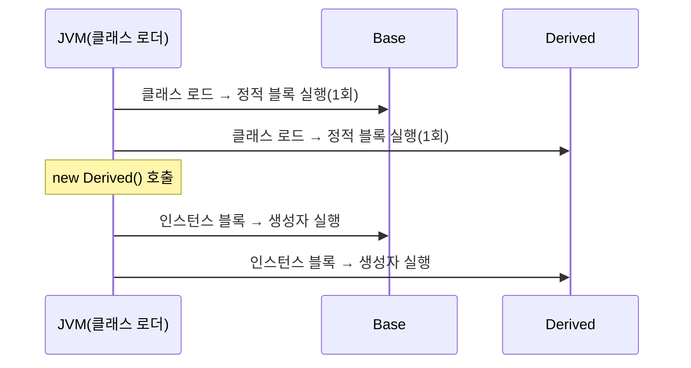

<Callout type="info">
  **이번 문서의 목표:** 생성자를 여러 개 오버로딩하는 이유와 `this()`로 생성자끼리 연결하는 방법, 상위 클래스의 생성자를 호출하는 `super()`의 동작을 정확히 구분하고, 객체가 생성될 때 정적 블록·인스턴스 블록·생성자가 어떤 순서로 실행되는지 실행 결과로 직접 증명할 수 있게 된다.
</Callout>

## 왜 생성자를 여러 개 만드는가

04편에서 클래스에는 객체가 생성되는 순간 자동으로 호출되는 특수한 메서드인 **생성자**(constructor, 생성자)가 있고, 필드를 초기화하는 역할을 한다는 것을 배웠습니다(자세한 내용은 04편). 그런데 실제로 객체를 만드는 상황은 다양합니다. 이름만 알고 나이는 모르는 학생 객체를 만들 수도 있고, 이름과 나이를 둘 다 아는 상태로 만들 수도 있습니다. 생성자가 딱 하나뿐이라면, 정보가 부족한 상황마다 임시값(0, `null` 등)을 억지로 채워 넣어야 합니다.

> **쉽게 말하면:** 생성자는 "이 재료들로 객체를 조립하는 조립법"입니다. 재료가 상황마다 다르게 주어질 수 있으니, 조립법도 여러 벌 준비해 두는 것입니다.

Java는 한 클래스 안에 **매개변수 목록이 다른** 생성자를 여러 개 정의할 수 있게 허용합니다. 이를 **생성자 오버로딩**(constructor overloading, 생성자 중복 정의)이라고 부릅니다. 이번 편에서는 생성자 오버로딩, 생성자끼리 서로를 호출하는 `this()`, 상위 클래스의 생성자를 호출하는 `super()`, 그리고 이 모든 것이 실제로 어떤 순서로 실행되는지를 다룹니다.

## 1. 생성자 오버로딩 — 매개변수 목록으로 구분한다

생성자 오버로딩은 08편에서 다룰 **메서드 오버로딩**과 원리가 같습니다. 이름(생성자는 항상 클래스 이름과 같음)이 같아도 **매개변수의 개수 또는 타입**이 다르면 컴파일러가 서로 다른 생성자로 구분해 컴파일 시점에 올바른 생성자를 골라 호출합니다(정적 바인딩, 09편에서 동적 바인딩과 대조해 다시 다룸).

```java
public class Student {
    String name;
    int age;
    String major;

    // 생성자 1: 매개변수 없음(기본 생성자를 직접 정의)
    public Student() {
        name = "이름없음";
        age = 0;
        major = "미정";
        System.out.println("[생성자1] 매개변수 없음 호출");
    }

    // 생성자 2: 이름만 받음
    public Student(String name) {
        this.name = name;
        age = 0;
        major = "미정";
        System.out.println("[생성자2] 이름만 받음 호출: " + name);
    }

    // 생성자 3: 이름, 나이, 전공을 모두 받음
    public Student(String name, int age, String major) {
        this.name = name;
        this.age = age;
        this.major = major;
        System.out.println("[생성자3] 이름·나이·전공 모두 받음 호출: " + name);
    }

    void printInfo() {
        System.out.println(name + ", " + age + "세, " + major);
    }

    public static void main(String[] args) {
        Student s1 = new Student();
        Student s2 = new Student("민준");
        Student s3 = new Student("서연", 22, "컴퓨터공학");

        s1.printInfo();
        s2.printInfo();
        s3.printInfo();
    }
}
```

```text
[생성자1] 매개변수 없음 호출
[생성자2] 이름만 받음 호출: 민준
[생성자3] 이름·나이·전공 모두 받음 호출: 서연
이름없음, 0세, 미정
민준, 0세, 미정
서연, 22세, 컴퓨터공학
```

**해석:** `new Student()`, `new Student("민준")`, `new Student("서연", 22, "컴퓨터공학")`는 모두 `Student` 클래스의 생성자를 호출하지만, **괄호 안 인자의 개수와 타입**에 따라 컴파일러가 세 생성자 중 정확히 하나를 골라 연결합니다. 이 선택은 컴파일 시점에 이미 확정되므로, 실행 중에 "어느 생성자를 부를지 헷갈리는" 일은 일어나지 않습니다.

**자주 틀리는 점:** 생성자를 하나라도 직접 정의하면, Java가 자동으로 만들어 주던 **매개변수 없는 기본 생성자**(default constructor, 기본 생성자)는 더 이상 자동 생성되지 않습니다. 위 예제에서 `Student()`를 쓰고 싶다면 반드시 **직접** 정의해야 합니다. 만약 `Student(String name, int age, String major)`만 정의하고 `new Student()`를 호출하면 컴파일 오류가 발생합니다.

## 2. this 키워드 — 두 가지 쓰임

`this`는 "지금 이 메서드(또는 생성자)를 실행 중인 바로 이 객체 자신"을 가리키는 참조입니다. `this`는 두 가지로 쓰입니다.

### 2-1. 필드와 매개변수 이름이 겹칠 때 — this.필드

위 예제의 `this.name = name;`처럼, 생성자의 **매개변수 이름과 필드 이름이 같을** 때 `this.name`은 "이 객체의 필드 name", 그냥 `name`은 "매개변수 name"을 가리킵니다. `this`가 없으면 컴파일러는 더 가까운 범위(scope, 스코프)인 매개변수 `name`을 먼저 찾으므로, 필드에는 값이 전혀 대입되지 않는 실수가 생깁니다.

```java
public class Wrong {
    String name;

    public Wrong(String name) {
        name = name;   // this 없음: 매개변수에 매개변수 자기 자신을 대입할 뿐, 필드는 그대로 null
    }

    public static void main(String[] args) {
        Wrong w = new Wrong("오류");
        System.out.println(w.name);
    }
}
```

```text
null
```

**해석:** `name = name;`은 왼쪽도 오른쪽도 모두 **매개변수 `name`**을 가리킵니다(더 가까운 범위가 우선). 필드 `name`에는 아무 값도 들어가지 않아 객체 생성 시 필드의 기본값인 `null`(참조 타입의 기본값)이 그대로 남습니다. `this.name = name;`으로 고쳐야 왼쪽이 필드를 가리켜 올바르게 대입됩니다.

### 2-2. 생성자에서 다른 생성자를 호출할 때 — this(...)

`this(...)`는 **같은 클래스의 다른 생성자**를 호출합니다. 여러 생성자에서 반복되는 초기화 코드를 한 곳(주로 매개변수가 가장 많은 생성자)에 모아두고, 나머지 생성자는 `this(...)`로 그 생성자에 일부 값을 채워 위임하는 패턴에 자주 쓰입니다.

```java
public class Rectangle {
    int width;
    int height;
    String label;

    public Rectangle() {
        this(1, 1, "이름없음");   // 생성자3 호출로 위임
        System.out.println("[생성자1] 매개변수 없음");
    }

    public Rectangle(int width, int height) {
        this(width, height, "이름없음");   // 생성자3 호출로 위임
        System.out.println("[생성자2] 너비·높이만");
    }

    public Rectangle(int width, int height, String label) {
        this.width = width;
        this.height = height;
        this.label = label;
        System.out.println("[생성자3] 전체 초기화: " + width + "x" + height + " " + label);
    }

    public static void main(String[] args) {
        System.out.println("--- r1 생성 ---");
        Rectangle r1 = new Rectangle();
        System.out.println("--- r2 생성 ---");
        Rectangle r2 = new Rectangle(3, 4);
    }
}
```

```text
--- r1 생성 ---
[생성자3] 전체 초기화: 1x1 이름없음
[생성자1] 매개변수 없음
--- r2 생성 ---
[생성자3] 전체 초기화: 3x4 이름없음
[생성자2] 너비·높이만
```

**해석:** `new Rectangle()`을 호출하면 생성자1의 몸통이 시작되기 **전에** `this(1, 1, "이름없음")`이 먼저 완전히 실행되어 생성자3의 출력이 먼저 찍히고, 그 다음에야 생성자1 자신의 나머지 코드(`System.out.println("[생성자1]...")`)가 실행됩니다. 즉 `this(...)`는 **반드시 그 생성자의 첫 줄에** 와야 하며, 호출된 생성자가 끝난 뒤 이어서 나머지 코드가 실행되는 것이지, 대신 실행되는 것이 아닙니다.

**자주 틀리는 점:** `this(...)`는 생성자 코드의 **첫 문장**이어야 한다는 규칙이 있습니다. 다른 문장 뒤에 `this(...)`를 쓰면 컴파일 오류입니다. 또한 한 생성자 안에서 `this(...)`는 한 번만 쓸 수 있고, 서로 다른 생성자가 순환하며 `this(...)`로 서로를 부르면(예: 생성자 A가 B를, B가 다시 A를) 컴파일 오류가 발생합니다.

## 3. super 키워드 — 상위 클래스와 연결

`super`는 상속 관계에서 **바로 위 상위 클래스**(superclass, 부모 클래스)를 가리킵니다. 상속 자체는 08편에서 본격적으로 다루지만, 생성자 초기화 순서를 이해하려면 `super`를 먼저 알아야 합니다.

### 3-1. super() — 상위 클래스 생성자 호출

자식 클래스의 생성자가 실행되기 전에는 **반드시** 상위 클래스의 생성자가 먼저 실행되어야 합니다. Java는 자식 생성자의 첫 줄에 `super(...)`를 직접 쓰지 않으면, **컴파일러가 자동으로 `super()`(매개변수 없는 버전)를 그 자리에 넣어 줍니다.**

```java
class Animal {
    String name;

    public Animal(String name) {
        this.name = name;
        System.out.println("[Animal 생성자] name=" + name);
    }
}

class Dog extends Animal {
    String breed;

    public Dog(String name, String breed) {
        super(name);   // Animal(String)을 명시적으로 호출
        this.breed = breed;
        System.out.println("[Dog 생성자] breed=" + breed);
    }

    public static void main(String[] args) {
        Dog d = new Dog("초코", "poodle");
    }
}
```

```text
[Animal 생성자] name=초코
[Dog 생성자] breed=poodle
```

**해석:** `Dog` 생성자의 첫 줄 `super(name)`이 `Animal(String)` 생성자를 먼저 완전히 실행시킵니다. `Animal` 생성자가 끝난 뒤에야 `Dog` 생성자의 나머지 코드(`this.breed = breed;`와 출력문)가 실행됩니다.

만약 `Animal`에 **매개변수 없는 생성자가 없고** `Animal(String)`만 있는 상태에서 `Dog` 생성자에 `super(name)`을 쓰지 않으면 어떻게 될까요?

```text
컴파일 오류: Animal에 기본 생성자(매개변수 없음)가 없으므로,
Dog 생성자가 자동으로 넣으려는 super()가 존재하지 않는 생성자를 호출하게 됨
```

**자주 틀리는 점:** "상위 클래스에 생성자가 있으면 자식 클래스가 자동으로 물려받는다"는 것은 틀린 생각입니다. 생성자는 상속되지 않습니다. 상위 클래스에 매개변수 있는 생성자만 있다면, 자식 클래스는 **반드시** `super(...)`로 그 생성자를 명시적으로 호출해야 하며, 그러지 않으면 컴파일 오류가 됩니다.

### 3-2. super.메서드() — 상위 클래스의 메서드 호출

`super`는 생성자뿐 아니라 상위 클래스에서 정의된 메서드를 자식 클래스 안에서 다시 부를 때도 씁니다. 이는 09편의 오버라이딩에서 "자식이 재정의한 메서드 안에서 부모의 원래 동작도 함께 쓰고 싶을 때" 핵심적으로 쓰이므로, 자세한 예제는 09편에서 다룹니다. 여기서는 문법만 짚고 넘어갑니다: `super.메서드이름(인자)` 형태로 호출하면 자식 클래스가 같은 이름으로 재정의했더라도 **상위 클래스에 정의된 원래 버전**이 실행됩니다.

## 4. 객체 초기화 순서 — 정적 블록, 인스턴스 블록, 생성자

Java에서 객체 하나가 만들어질 때 실행되는 초기화 코드는 생성자만이 아닙니다. 클래스 안에는 **정적 초기화 블록**(static initializer block, 정적 블록)과 **인스턴스 초기화 블록**(instance initializer block, 인스턴스 블록)도 있을 수 있고, 상속 관계라면 상위 클래스의 초기화도 얽힙니다. 독학사 시험에서는 이 순서를 정확히 추적하는 문제가 자주 출제되므로, 규칙을 코드로 직접 증명해 봅니다.

**정적 블록**은 `static { ... }` 형태로, 그 **클래스가 메모리에 처음 로드될 때 단 한 번만** 실행됩니다(그 클래스로 객체를 몇 개를 만들든 상관없이 딱 한 번). **인스턴스 블록**은 `{ ... }` 형태로(static 없이), **객체가 생성될 때마다** 실행되며, 생성자보다 먼저 실행됩니다.

```java
class Base {
    static {
        System.out.println("1. Base 정적 블록");
    }
    {
        System.out.println("3. Base 인스턴스 블록");
    }
    public Base() {
        System.out.println("4. Base 생성자");
    }
}

class Derived extends Base {
    static {
        System.out.println("2. Derived 정적 블록");
    }
    {
        System.out.println("5. Derived 인스턴스 블록");
    }
    public Derived() {
        System.out.println("6. Derived 생성자");
    }

    public static void main(String[] args) {
        System.out.println("--- 첫 번째 객체 생성 ---");
        new Derived();
        System.out.println("--- 두 번째 객체 생성 ---");
        new Derived();
    }
}
```

```text
1. Base 정적 블록
2. Derived 정적 블록
--- 첫 번째 객체 생성 ---
3. Base 인스턴스 블록
4. Base 생성자
5. Derived 인스턴스 블록
6. Derived 생성자
--- 두 번째 객체 생성 ---
3. Base 인스턴스 블록
4. Base 생성자
5. Derived 인스턴스 블록
6. Derived 생성자
```

| 단계 | 실행되는 것 | 몇 번 실행되는가 |
|------|-------------|-------------------|
| 1 | Base 정적 블록 | 클래스 로드 시 단 1회(Base가 먼저 로드됨) |
| 2 | Derived 정적 블록 | 클래스 로드 시 단 1회(Derived가 이어서 로드됨) |
| 3 | Base 인스턴스 블록 | new Derived()를 호출할 때마다 매번 |
| 4 | Base 생성자 | new Derived()를 호출할 때마다 매번 |
| 5 | Derived 인스턴스 블록 | new Derived()를 호출할 때마다 매번 |
| 6 | Derived 생성자 | new Derived()를 호출할 때마다 매번 |

**해석:** 실행 결과가 이 순서를 그대로 증명합니다. 정적 블록(1, 2)은 프로그램 전체에서 **딱 한 번씩만** 나타나고, 두 번째 `new Derived()`를 호출했을 때는 다시 나타나지 않습니다. 반면 인스턴스 블록과 생성자(3~6)는 객체를 만들 때마다 **매번 반복**됩니다. 또한 상위 클래스(`Base`)의 정적 블록·인스턴스 블록·생성자가 항상 자식 클래스(`Derived`)의 대응 요소보다 **먼저** 실행된다는 규칙도 확인할 수 있습니다.



**전체 초기화 순서를 한 문장으로 정리하면:** "상위 클래스 정적 블록 → 자식 클래스 정적 블록(클래스 로드 시, 딱 한 번) → (객체 생성마다) 상위 클래스 인스턴스 블록 → 상위 클래스 생성자 → 자식 클래스 인스턴스 블록 → 자식 클래스 생성자" 순서입니다. 여기서 상위 클래스의 인스턴스 블록·생성자가 먼저 실행되는 이유는 앞서 배운 `super(...)`가 자식 생성자의 첫 줄에서 반드시 먼저 호출되기 때문입니다 — 그 호출이 끝나야 자식 클래스 자신의 초기화가 이어집니다.

**자주 틀리는 점:** "생성자가 필드 초기화보다 먼저 실행된다"고 착각하기 쉽지만, 실제로는 **필드 선언 시 대입식과 인스턴스 블록이 생성자 몸통보다 먼저** 실행됩니다(단, `super(...)` 호출 자체는 그보다도 먼저). 또한 "정적 블록은 객체를 만들 때마다 실행된다"는 것도 흔한 착각입니다. 정적 블록은 **클래스** 단위로 딱 한 번만 실행되고, **인스턴스** 블록이 **객체** 단위로 매번 실행된다는 차이를 정확히 구분해야 합니다.

## 핵심 정리

- 생성자 오버로딩은 매개변수 목록으로 구분되며, 생성자를 하나라도 직접 정의하면 기본 생성자는 자동 생성되지 않는다.
- `this.필드`는 매개변수와 이름이 겹치는 필드를 가리키고, `this(...)`는 같은 클래스의 다른 생성자를 호출하며 반드시 첫 줄에 와야 한다.
- `super(...)`는 상위 클래스 생성자를 호출하며, 명시하지 않으면 컴파일러가 매개변수 없는 `super()`를 자동으로 넣는다. 상위 클래스에 매개변수 없는 생성자가 없으면 반드시 명시적으로 `super(...)`를 써야 한다.
- 생성자는 상속되지 않는다.
- 객체 초기화 순서: (클래스 로드 시 1회) 상위 정적 블록 → 자식 정적 블록 → (객체 생성마다) 상위 인스턴스 블록 → 상위 생성자 → 자식 인스턴스 블록 → 자식 생성자.
- 정적 블록은 클래스당 한 번, 인스턴스 블록과 생성자는 객체를 만들 때마다 실행된다.

## 마무리 복습

<Quiz
  questionNumber={1}
  question="한 클래스에 생성자를 하나 이상 직접 정의했을 때, Java가 자동으로 제공하던 매개변수 없는 기본 생성자는 어떻게 되는가?"
  options={['항상 자동으로 유지된다', '직접 정의한 생성자와 함께 자동으로도 계속 제공된다', '더 이상 자동으로 제공되지 않으므로 필요하면 직접 정의해야 한다', '클래스 이름을 바꾸면 다시 제공된다']}
  correctAnswer={3}
  explanation="생성자를 하나라도 직접 작성하면 컴파일러가 자동으로 만들어 주던 기본 생성자는 더 이상 제공되지 않는다. 매개변수 없는 생성자가 필요하면 명시적으로 작성해야 한다."
  optionExplanations={['생성자를 직접 정의하는 순간 자동 제공은 멈춘다', '자동 제공과 직접 정의가 동시에 유지되지 않는다', '정답. 직접 정의한 생성자가 하나라도 있으면 자동 기본 생성자는 사라진다', '클래스 이름과 기본 생성자 자동 제공 여부는 관련이 없다']}
/>

<Quiz
  questionNumber={2}
  question="생성자 매개변수 이름이 필드 이름과 같을 때, this를 쓰지 않고 `name = name;`이라고만 쓰면 어떤 일이 벌어지는가?"
  options={['필드 name에 매개변수 값이 정상적으로 대입된다', '매개변수가 자기 자신에게 대입될 뿐 필드는 값이 대입되지 않는다', '컴파일 오류가 발생한다', '필드와 매개변수가 자동으로 합쳐진다']}
  correctAnswer={2}
  explanation="this가 없으면 더 가까운 범위인 매개변수가 우선 적용되어 매개변수가 자기 자신에게 대입될 뿐이다. 필드에는 값이 들어가지 않아 참조 타입 필드는 null로 남는다."
  optionExplanations={['this 없이는 필드가 아니라 매개변수끼리 대입된다', '정답. 스코프 우선순위 때문에 필드는 초기화되지 않는다', '문법적으로는 유효한 대입식이라 컴파일은 정상적으로 된다', '이름이 같다고 자동으로 합쳐지는 문법은 없다']}
/>

<Quiz
  questionNumber={3}
  question="생성자 안에서 this(...)를 사용할 때의 규칙으로 옳은 것은?"
  options={['생성자의 어느 위치에나 자유롭게 쓸 수 있다', '반드시 생성자 코드의 첫 문장이어야 한다', '한 생성자 안에서 여러 번 사용할 수 있다', 'super(...)와 함께 같은 생성자 안에 동시에 써야 한다']}
  correctAnswer={2}
  explanation="this(...)는 같은 클래스의 다른 생성자를 호출하는 문법으로, 반드시 그 생성자 코드의 첫 줄에 위치해야 한다는 규칙이 있다."
  optionExplanations={['첫 줄이 아니면 컴파일 오류가 발생한다', '정답. this(...)는 항상 생성자의 첫 문장이어야 한다', '한 생성자 안에서 this(...)는 한 번만 쓸 수 있다', 'this(...)와 super(...)는 같은 생성자 안에서 동시에 쓸 수 없다(둘 다 첫 줄이어야 하므로 양립 불가)']}
/>

<Quiz
  questionNumber={4}
  question="상위 클래스 Animal에 매개변수 있는 생성자 Animal(String name)만 있고 매개변수 없는 생성자가 없을 때, 자식 클래스 Dog의 생성자에서 super(...)를 전혀 쓰지 않으면 어떻게 되는가?"
  options={['컴파일러가 자동으로 Animal(String)을 알맞은 값으로 호출해 준다', '컴파일 오류가 발생한다(자동으로 삽입되는 super()가 존재하지 않는 생성자를 호출하게 됨)', 'Animal의 필드가 모두 기본값으로 초기화되고 정상 실행된다', 'Dog 객체 생성 시 Animal 생성자는 아예 호출되지 않고 넘어간다']}
  correctAnswer={2}
  explanation="자식 생성자에 super(...)를 명시하지 않으면 컴파일러는 매개변수 없는 super()를 자동으로 삽입하려 한다. 그런데 Animal에는 매개변수 없는 생성자가 없으므로 존재하지 않는 생성자를 호출하는 셈이 되어 컴파일 오류가 발생한다."
  optionExplanations={['컴파일러는 인자를 추측해서 채워주지 않는다', '정답. 자동 삽입되는 super()가 존재하지 않아 컴파일 오류다', '컴파일 자체가 실패하므로 실행까지 가지 못한다', '자식 생성자는 상위 클래스 생성자를 반드시 거쳐야 하며 생략될 수 없다']}
/>

<Quiz
  questionNumber={5}
  question="정적 초기화 블록(static { })과 인스턴스 초기화 블록({ })의 실행 횟수 차이로 옳은 것은?"
  options={['둘 다 객체를 생성할 때마다 매번 실행된다', '정적 블록은 클래스가 로드될 때 단 한 번, 인스턴스 블록은 객체를 생성할 때마다 실행된다', '정적 블록은 객체마다, 인스턴스 블록은 클래스당 한 번 실행된다', '둘 다 클래스가 로드될 때 단 한 번만 실행된다']}
  correctAnswer={2}
  explanation="정적 블록은 그 클래스가 메모리에 처음 로드될 때 딱 한 번만 실행되고, 인스턴스 블록은 그 클래스의 객체가 생성될 때마다(생성자보다 먼저) 매번 실행된다."
  optionExplanations={['정적 블록은 객체 개수와 무관하게 한 번만 실행된다', '정답. 클래스당 1회 vs 객체마다 매번이라는 차이가 핵심이다', '설명이 정반대로 뒤바뀌었다', '인스턴스 블록은 객체 생성마다 반복 실행된다']}
/>

<Quiz
  questionNumber={6}
  question="Base를 상속한 Derived 클래스의 객체를 new Derived()로 생성할 때, 다음 중 가장 먼저 실행되는 것은?"
  options={['Derived의 생성자 몸통', 'Derived의 인스턴스 초기화 블록', 'Base의 인스턴스 초기화 블록과 생성자(super() 호출 결과)', 'Derived의 정적 초기화 블록(이미 클래스 로드 시 끝난 경우 제외)']}
  correctAnswer={3}
  explanation="Derived 생성자의 첫 줄에서 (명시하지 않아도 자동으로) super()가 먼저 실행되어 Base의 인스턴스 블록과 생성자가 완료된 뒤에야 Derived 자신의 인스턴스 블록과 생성자가 실행된다. 정적 블록은 이미 클래스 로드 시점에 끝나 있으므로 객체 생성 시점에는 실행되지 않는다."
  optionExplanations={['Derived 생성자 몸통은 super() 이후, 자신의 인스턴스 블록 다음에 실행된다', 'Derived 인스턴스 블록도 Base 쪽 초기화가 끝난 뒤 실행된다', '정답. super() 호출로 Base 쪽 초기화가 항상 먼저 끝난다', '정적 블록은 클래스 로드 시 이미 끝나 객체 생성 시점의 순서에는 포함되지 않는다']}
/>

## 참고 자료

- Oracle Java Tutorials - Classes and Objects: https://docs.oracle.com/javase/tutorial/java/javaOO/index.html
- 국가평생교육진흥원 독학학위제: https://bdes.nile.or.kr
