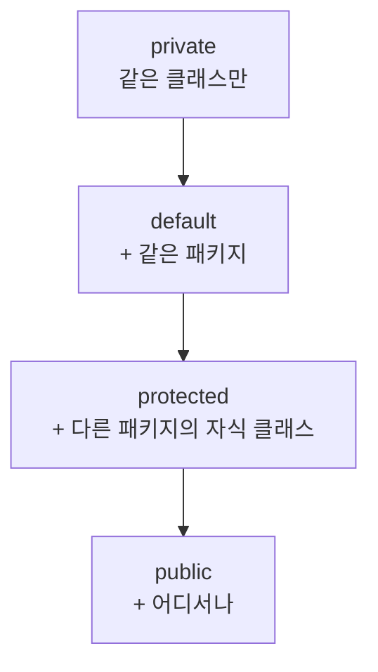

<Callout type="info">
  **이번 문서의 목표:** 캡슐화가 "왜" 필요한지 설계 관점에서 설명하고, 네 가지 접근 제어자(public, protected, default, private)가 클래스·패키지·상속 관계에서 각각 어디까지 접근을 허용하는지 표와 코드로 정확히 구분할 수 있게 된다.
</Callout>

## 왜 필드를 숨기는가

클래스를 설계할 때 모든 필드를 `public`으로 열어 두면 어떤 일이 생길까요? 예를 들어 은행 계좌 클래스의 잔액(balance) 필드가 `public`이라면, 클래스 바깥의 어떤 코드든 `account.balance = -1000000;`처럼 검증 없이 직접 값을 바꿀 수 있습니다. 잔액이 음수가 되어서는 안 된다는 규칙을 클래스가 강제할 방법이 없어지는 것입니다.

**캡슐화**(encapsulation, 캡슐화)는 객체의 내부 데이터(필드)를 직접 건드리지 못하게 감추고(정보 은닉, information hiding), 오직 그 클래스가 제공하는 **메서드를 통해서만** 데이터에 접근하거나 바꾸도록 강제하는 설계 원칙입니다. 03편에서 이미 객체지향 4대 특성 중 하나로 소개했는데(자세한 내용은 03편), 이번 편에서는 이를 실제로 구현하는 문법인 **접근 제어자**(access modifier, 접근 제어자)를 깊게 다룹니다.

> **쉽게 말하면:** 캡슐화는 "약 상자에 뚜껑을 덮고 정해진 창구로만 약을 내주는 것"입니다. 아무나 상자를 열어 마음대로 약을 꺼내 가게 두지 않고, 정해진 절차(메서드)를 거치게 합니다.

## 1. 접근 제어자 네 가지

Java는 클래스, 필드, 메서드, 생성자 앞에 붙일 수 있는 접근 제어자 네 가지를 제공합니다. 이 중 `public`, `protected`, `private`은 키워드를 직접 쓰고, 아무것도 쓰지 않으면 네 번째인 **default**(package-private, 디폴트)가 적용됩니다.

| 접근 제어자 | 같은 클래스 | 같은 패키지 | 다른 패키지의 자식 클래스 | 다른 패키지의 무관한 클래스 |
|-------------|-------------|-------------|----------------------------|-------------------------------|
| `private` | 허용 | 불가 | 불가 | 불가 |
| default(생략) | 허용 | 허용 | 불가 | 불가 |
| `protected` | 허용 | 허용 | 허용 | 불가 |
| `public` | 허용 | 허용 | 허용 | 허용 |

**해석:** 표를 왼쪽에서 오른쪽으로 읽으면 허용 범위가 점점 넓어집니다. `private`이 가장 좁고 `public`이 가장 넓습니다. 시험에서 자주 헷갈리는 지점은 **default와 protected의 차이**인데, 두 접근 제어자는 "같은 패키지"까지는 동일하게 허용하지만, **다른 패키지에 있는 자식 클래스**까지 허용하느냐가 갈림길입니다. default는 패키지 경계를 절대 넘지 못하고, protected는 상속 관계라면 패키지를 넘어서도 접근을 허용합니다.



## 2. private 필드 + public getter/setter — 표준 캡슐화 패턴

가장 흔한 캡슐화 패턴은 필드를 `private`으로 감추고, 값을 읽는 **getter**(게터, 접근자 메서드)와 값을 바꾸는 **setter**(세터, 설정자 메서드)를 `public`으로 제공하는 것입니다. 이렇게 하면 값을 바꾸는 유일한 통로가 setter가 되므로, setter 안에 검증 로직을 넣어 잘못된 값이 들어오는 것을 막을 수 있습니다.

```java
public class BankAccount {
    private String owner;
    private long balance;   // private: 클래스 바깥에서 직접 접근 불가

    public BankAccount(String owner, long balance) {
        this.owner = owner;
        this.balance = balance;
    }

    // getter: 값을 읽기만 허용
    public long getBalance() {
        return balance;
    }

    // setter: 값을 바꾸되, 검증을 거쳐야만 허용
    public void deposit(long amount) {
        if (amount <= 0) {
            System.out.println("입금액은 0보다 커야 합니다. 요청 거부: " + amount);
            return;
        }
        balance += amount;
        System.out.println(owner + "님 입금 완료. 현재 잔액: " + balance);
    }

    public void withdraw(long amount) {
        if (amount > balance) {
            System.out.println("잔액 부족으로 출금 거부. 요청액: " + amount + ", 잔액: " + balance);
            return;
        }
        balance -= amount;
        System.out.println(owner + "님 출금 완료. 현재 잔액: " + balance);
    }

    public static void main(String[] args) {
        BankAccount acc = new BankAccount("지훈", 10000);
        acc.deposit(5000);
        acc.withdraw(50000);   // 잔액 초과 시도
        acc.deposit(-100);     // 음수 입금 시도
        // acc.balance = -999999;   // private이라 컴파일 오류(주석 처리)
        System.out.println("최종 잔액: " + acc.getBalance());
    }
}
```

```text
지훈님 입금 완료. 현재 잔액: 15000
잔액 부족으로 출금 거부. 요청액: 50000, 잔액: 15000
입금액은 0보다 커야 합니다. 요청 거부: -100
최종 잔액: 15000
```

**해석:** `balance` 필드는 `private`이므로 `acc.balance = -999999;`처럼 클래스 바깥에서 직접 접근하면 **컴파일 오류**가 발생합니다(예제에서는 주석 처리해 컴파일이 되게 함). 잔액을 바꾸는 유일한 방법은 `deposit`, `withdraw` 메서드를 거치는 것뿐이고, 이 메서드들이 "0보다 큰 금액만 입금 가능", "잔액을 초과해 출금 불가" 같은 규칙을 강제합니다. 만약 `balance`가 `public`이었다면 이런 규칙을 우회해 값을 마음대로 바꿀 수 있었을 것입니다.

> **쉽게 말하면:** getter는 "창구 직원에게 물어보고 답을 듣는 것", setter는 "창구 직원에게 요청서를 내고 심사를 거쳐 처리되는 것"입니다. 손님(외부 코드)이 금고(필드)에 직접 손을 넣을 수는 없습니다.

**자주 틀리는 점:** "모든 필드에 getter/setter를 기계적으로 다 만들면 캡슐화가 잘 된 것이다"는 흔한 오해입니다. 검증 로직 없이 `public void setBalance(long balance) { this.balance = balance; }`처럼 필드 값을 그대로 통과시키는 setter는 사실상 `public` 필드와 다를 것이 없어, 캡슐화의 목적(불변식 보호)을 달성하지 못합니다. 캡슐화의 핵심은 "숨기고 메서드로만 열어준다"는 형식이 아니라, **그 메서드 안에서 규칙을 강제한다**는 내용에 있습니다.

## 3. default(package-private) — 패키지 경계가 곧 접근 범위

접근 제어자를 아무것도 쓰지 않으면 default가 적용되며, 이는 **같은 패키지 안에서만** 접근을 허용합니다(패키지 개념은 07편에서 자세히 다룸). 아래는 두 클래스가 **같은 패키지**(`app`)에 있는 경우와 **다른 패키지**에 있는 경우를 비교한 표입니다.

```java
// 파일: app/Counter.java
package app;

class Counter {              // 클래스 자체도 default(공개하지 않음)
    int count;                // 필드도 default

    void increase() {         // 메서드도 default
        count++;
    }
}
```

| 접근하는 코드의 위치 | Counter 클래스 접근 | count 필드·increase() 접근 |
|------------------------|----------------------|-------------------------------|
| 같은 패키지(`app`) 안의 다른 클래스 | 가능 | 가능 |
| 다른 패키지(`other`)의 클래스 | 불가(컴파일 오류) | 애초에 클래스에 접근이 안 되므로 논의 자체가 불가 |

**해석:** `class Counter`처럼 클래스 선언 자체에도 접근 제어자를 생략하면(default), 그 클래스는 **같은 패키지 밖에서는 아예 존재를 알 수 없는 것처럼** 취급됩니다. `other` 패키지의 코드가 `import app.Counter;`를 쓰더라도 `Counter` 클래스 자체가 default이므로 사용할 수 없습니다.

## 4. protected — 상속을 위해 패키지 경계를 넘는 예외

`protected`는 "같은 패키지"까지는 default와 같지만, 여기에 더해 **다른 패키지에 있더라도 그 클래스를 상속한 자식 클래스**에서는 접근을 허용합니다. 이는 부모 클래스를 설계할 때 "이 필드·메서드는 남에게는 안 보여주고 싶지만, 내 자식 클래스에게는 물려주고 싶다"는 의도를 표현하는 문법입니다.

```java
// 파일: shapes/Shape.java
package shapes;

public class Shape {
    protected String color;

    protected void printColor() {
        System.out.println("색상: " + color);
    }
}
```

```java
// 파일: app/Circle.java
package app;

import shapes.Shape;

public class Circle extends Shape {   // 다른 패키지지만 상속 관계
    public Circle(String color) {
        this.color = color;   // protected 필드: 자식 클래스이므로 접근 가능
    }

    public static void main(String[] args) {
        Circle c = new Circle("빨강");
        c.printColor();   // protected 메서드: 자식 클래스이므로 접근 가능
    }
}
```

```text
색상: 빨강
```

**해석:** `Circle`은 `shapes` 패키지가 아닌 `app` 패키지에 있지만, `Shape`를 **상속**했기 때문에 `protected`인 `color` 필드와 `printColor()` 메서드에 접근할 수 있습니다. 만약 `Circle`이 `Shape`를 상속하지 않고 그냥 별도의 클래스로 `Shape` 객체를 참조만 하는 관계였다면, 다른 패키지이므로 `protected` 멤버에 접근할 수 없습니다.

**자주 틀리는 점(시험 핵심 함정):** "protected는 상속 관계라면 무조건 다른 패키지에서도 인스턴스를 통해 자유롭게 접근할 수 있다"는 것은 정확하지 않습니다. 다른 패키지의 자식 클래스가 `protected` 멤버에 접근할 수 있는 경우는 **자기 자신이나 자신의 자식 타입의 객체를 통해 접근할 때**로 제한됩니다. 즉 `Circle` 안에서 `this.color`나 상속받은 필드로 접근하는 것은 되지만, `Circle` 클래스 안에서 **부모 타입인 `Shape`의 임의의 다른 객체**(자신이 상속받은 인스턴스가 아닌 별도의 `Shape` 객체)의 `protected` 멤버에 접근하는 것은 다른 패키지에서는 허용되지 않습니다. 이 세부 규칙은 실제 시험에서 "옳지 않은 것 고르기" 유형으로 자주 등장하므로, protected를 "상속하면 무조건 다 열린다"로 단순화해 외우지 않도록 주의해야 합니다.

## 5. 접근 제어와 캡슐화의 관계 정리

| 목적 | 흔히 쓰는 접근 제어자 |
|------|--------------------------|
| 필드를 완전히 숨기고 클래스 내부에서만 사용 | `private` |
| getter/setter처럼 외부에 공개할 통로 | `public` |
| 같은 패키지 안 협력 클래스끼리만 공유 | default(생략) |
| 상속받은 자식 클래스에게는 물려주되 남에게는 숨김 | `protected` |

**해석:** 클래스를 설계할 때는 "이 멤버를 누가 써야 하는가"를 먼저 묻고, 그 답에 맞는 **가장 좁은** 접근 제어자를 선택하는 것이 원칙입니다. 이를 **최소 권한 원칙**(principle of least privilege, 최소 권한 원칙)이라 부르며, 필요 이상으로 넓은 접근 범위(예: 굳이 `private`이어도 될 필드를 `public`으로 여는 것)를 주지 않는 것이 캡슐화가 잘 된 설계입니다.

## 핵심 정리

- 캡슐화는 필드를 숨기고 메서드를 통해서만 접근하게 해, 클래스가 정한 규칙(불변식)을 강제하는 설계 원칙이다.
- 접근 범위는 `private` < default(생략) < `protected` < `public` 순으로 넓어진다.
- default는 같은 패키지까지만, protected는 같은 패키지에 더해 다른 패키지의 자식 클래스까지 허용한다.
- getter/setter는 형식이 아니라 그 안에 담는 검증 로직이 캡슐화의 실질적 효과를 만든다.
- protected의 다른 패키지 접근은 상속받은 자기 자신(또는 그 하위 타입)을 통한 접근으로 제한된다.
- 최소 권한 원칙: 필요한 만큼만 열고, 나머지는 최대한 좁게 감춘다.

## 마무리 복습

<Quiz
  questionNumber={1}
  question="다음 중 접근 허용 범위가 가장 넓은 접근 제어자는?"
  options={['private', 'default(생략)', 'protected', 'public']}
  correctAnswer={4}
  explanation="접근 허용 범위는 private, default, protected, public 순으로 넓어지며, public이 가장 넓어 어디서든 접근할 수 있다."
  optionExplanations={['private은 같은 클래스 안으로 한정되어 가장 좁다', 'default는 같은 패키지까지만 허용된다', 'protected는 default보다 넓지만 public보다는 좁다', '정답. public은 패키지·상속 관계와 무관하게 어디서나 접근 가능하다']}
/>

<Quiz
  questionNumber={2}
  question="필드를 private으로 감추고 public 메서드로만 값을 바꾸게 하는 설계의 가장 핵심적인 목적은?"
  options={['코드 줄 수를 줄이기 위해서', '메서드 안에서 검증 로직을 강제해 잘못된 값이 들어오는 것을 막기 위해서', '컴파일 속도를 높이기 위해서', '클래스 이름을 짧게 만들기 위해서']}
  correctAnswer={2}
  explanation="캡슐화의 핵심은 필드를 숨기는 형식 자체가 아니라, 유일한 접근 통로인 메서드 안에서 검증·규칙을 강제해 객체의 불변식을 보호하는 데 있다."
  optionExplanations={['getter/setter를 추가하면 오히려 코드가 늘어난다', '정답. 검증 로직을 통해 잘못된 상태를 방지하는 것이 목적이다', '접근 제어자는 컴파일 속도와 관련이 없다', '클래스 이름과 캡슐화는 무관하다']}
/>

<Quiz
  questionNumber={3}
  question="접근 제어자를 아무것도 쓰지 않았을 때(default) 적용되는 접근 범위는?"
  options={['같은 클래스 안에서만 접근 가능', '같은 패키지 안에서만 접근 가능', '어디서나 접근 가능', '같은 패키지의 자식 클래스에 한해 다른 패키지에서도 접근 가능']}
  correctAnswer={2}
  explanation="default(package-private)는 접근 제어자를 생략했을 때 적용되며, 같은 패키지 안에서만 접근을 허용하고 패키지 경계를 넘지 못한다."
  optionExplanations={['같은 클래스로 한정되는 것은 private이다', '정답. default는 패키지 경계까지만 허용한다', '어디서나 접근 가능한 것은 public이다', '패키지를 넘어 자식 클래스까지 허용하는 것은 protected다']}
/>

<Quiz
  questionNumber={4}
  question="protected 멤버가 default와 다른 점으로 옳은 것은?"
  options={['protected는 같은 클래스에서도 접근할 수 없다', 'protected는 다른 패키지의 자식 클래스에서도(제한된 조건 아래) 접근을 허용한다', 'protected는 default보다 접근 범위가 좁다', 'protected는 static 멤버에만 적용할 수 있다']}
  correctAnswer={2}
  explanation="protected는 default가 허용하는 같은 패키지 접근에 더해, 다른 패키지에 있는 자식 클래스에서도(상속받은 자기 자신을 통한 접근에 한해) 멤버 접근을 허용한다."
  optionExplanations={['protected 멤버도 같은 클래스 안에서는 당연히 접근 가능하다', '정답. 상속 관계라면 패키지 경계를 넘어 접근을 허용하는 것이 protected의 특징이다', 'protected는 default보다 접근 범위가 더 넓다', 'protected는 static 여부와 관계없이 필드·메서드·생성자 등에 사용할 수 있다']}
/>

<Quiz
  questionNumber={5}
  question="Shape 클래스(shapes 패키지)의 protected 필드 color를, 다른 패키지(app)에서 Shape를 상속하지 않고 단순히 Shape 객체를 참조만 하는 별도 클래스에서 접근하려 하면 어떻게 되는가?"
  options={['상속 여부와 무관하게 항상 접근 가능하다', '접근할 수 없다(컴파일 오류)', 'public으로 자동 승격되어 접근 가능해진다', '같은 패키지로 자동 이동되어 접근 가능해진다']}
  correctAnswer={2}
  explanation="protected가 다른 패키지에서 허용되는 경우는 그 클래스를 상속한 자식 클래스일 때로 제한된다. 상속 관계 없이 단순 참조만 하는 다른 패키지의 클래스는 protected 멤버에 접근할 수 없다."
  optionExplanations={['상속하지 않았다면 다른 패키지에서는 접근이 막힌다', '정답. 상속 관계가 없으므로 protected의 예외가 적용되지 않는다', '접근 제어자는 실행 중에 자동으로 바뀌지 않는다', '패키지는 파일 시스템 구조로 고정되며 자동으로 옮겨지지 않는다']}
/>

<Quiz
  questionNumber={6}
  question="최소 권한 원칙(principle of least privilege)을 접근 제어자 선택에 적용한 예로 가장 적절한 것은?"
  options={['모든 필드와 메서드를 항상 public으로 선언한다', '외부에 공개할 필요가 없는 내부 계산용 메서드는 private으로 좁게 선언한다', '패키지 구조와 무관하게 항상 protected를 사용한다', '접근 제어자는 성능에 영향을 주므로 항상 default를 사용한다']}
  correctAnswer={2}
  explanation="최소 권한 원칙은 필요한 만큼만 접근을 허용하고 나머지는 가장 좁은 범위로 감추는 것이다. 외부에서 쓸 일이 없는 내부 계산용 메서드는 private으로 선언하는 것이 이 원칙에 맞다."
  optionExplanations={['불필요하게 넓은 public 선언은 최소 권한 원칙에 위배된다', '정답. 필요 없는 공개를 막는 것이 최소 권한 원칙이다', '무조건 protected를 쓰는 것은 목적에 맞는 선택이 아니다', '접근 제어자는 런타임 성능이 아니라 접근 범위를 결정하는 문법이다']}
/>

## 참고 자료

- Oracle Java Tutorials - Object-Oriented Programming Concepts: https://docs.oracle.com/javase/tutorial/java/concepts/index.html
- 국가평생교육진흥원 독학학위제: https://bdes.nile.or.kr
