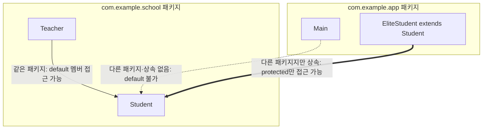

<Callout type="info">
  **이번 문서의 목표:** 패키지 선언과 실제 디렉터리 구조의 대응 관계를 이해하고, import 문과 완전한 이름(fully qualified name)으로 같은 이름의 클래스를 구분하는 방법을 알고, 06편에서 배운 접근 제어자가 패키지 경계와 정확히 어떻게 맞물리는지 설명할 수 있게 된다.
</Callout>

## 왜 패키지가 필요한가

작은 프로그램 하나에는 클래스가 몇 개 안 되지만, 실제 프로젝트에는 수백~수천 개의 클래스가 있습니다. 모든 클래스를 한 폴더에 쭉 늘어놓으면 이름이 겹치기 쉽고(예: 여러 라이브러리가 각자 `List`, `Date`라는 이름의 클래스를 가지고 있을 수 있음), 관련된 클래스들을 묶어서 관리하기도 어렵습니다.

**패키지**(package, 패키지)는 관련된 클래스와 인터페이스를 하나의 이름 아래 묶는 Java의 디렉터리 겸 이름공간(namespace, 네임스페이스) 단위입니다. 패키지는 (1) 이름 충돌을 방지하고, (2) 관련 클래스를 논리적으로 묶어 정리하며, (3) 06편에서 다룬 default·protected 접근 제어의 **경계 기준**이 됩니다.

> **쉽게 말하면:** 패키지는 "성(姓)"과 비슷합니다. "민준"이라는 이름은 여러 사람이 가질 수 있어도, "김민준"과 "이민준"은 성이 다르므로 서로 다른 사람임을 확실히 구분할 수 있습니다.

## 1. 패키지 선언과 디렉터리 구조의 대응

Java에서 패키지는 단순한 이름표가 아니라, **실제 파일 시스템의 디렉터리 구조와 정확히 일치**해야 합니다. 소스 파일 맨 위에 `package 패키지이름;`을 선언하면, 그 파일은 반드시 그 이름에 대응하는 디렉터리 경로 안에 있어야 컴파일러가 올바르게 인식합니다.

```text
프로젝트 루트/
└── src/
    └── com/
        └── example/
            └── school/
                ├── Student.java     (package com.example.school;)
                └── Teacher.java     (package com.example.school;)
```

```java
// 파일 경로: src/com/example/school/Student.java
package com.example.school;

public class Student {
    String name;

    public Student(String name) {
        this.name = name;
    }

    public void introduce() {
        System.out.println("저는 " + name + "입니다.");
    }
}
```

**해석:** `package com.example.school;`이라는 선언은 이 파일이 `com` 아래 `example` 아래 `school`이라는 **점(.)으로 이어지는 계층 구조**에 속한다는 뜻이고, 이는 실제로 `com/example/school/` 디렉터리 경로와 대응합니다. 컴파일 시 클래스 파일(`.class`)도 이 디렉터리 구조를 그대로 따라 생성됩니다. 패키지 이름은 관례적으로 **회사·조직의 도메인을 거꾸로 쓴 형태**(예: `com.example`)로 짓는데, 이는 전 세계적으로 겹치지 않는 고유한 이름공간을 확보하기 위한 관례입니다.

**자주 틀리는 점:** "패키지 이름은 단지 문서화를 위한 주석 같은 것이다"라고 생각하기 쉽지만, 실제로는 **디렉터리 구조와 정확히 일치해야 컴파일이 성립**하는 필수 요소입니다. `package com.example.school;`이라고 선언한 파일이 `com/example/` 디렉터리(한 단계 부족)에 있으면 컴파일 오류가 발생합니다.

## 2. import 문 — 다른 패키지의 클래스를 짧은 이름으로 쓰기

다른 패키지에 있는 클래스를 쓰려면, 매번 **전체 경로가 담긴 완전한 이름**(fully qualified name, FQN)을 써야 합니다. 이는 번거로우므로, 파일 맨 위에 `import`문을 쓰면 그 뒤부터는 클래스 이름만으로 짧게 쓸 수 있습니다.

```java
// 파일 경로: src/com/example/app/Main.java
package com.example.app;

import com.example.school.Student;   // Student를 짧은 이름으로 쓰겠다는 선언

public class Main {
    public static void main(String[] args) {
        Student s1 = new Student("하은");         // import 덕분에 짧게 사용
        s1.introduce();

        com.example.school.Student s2               // import 없이 완전한 이름으로도 사용 가능
            = new com.example.school.Student("도윤");
        s2.introduce();
    }
}
```

```text
저는 하은입니다.
저는 도윤입니다.
```

**해석:** `import com.example.school.Student;`는 "이 파일 안에서 `Student`라고만 쓰면 `com.example.school.Student`를 뜻하는 것으로 컴파일러에게 알려주는" 선언입니다. import를 아예 쓰지 않아도, 클래스를 쓸 때마다 완전한 이름(`com.example.school.Student`)을 통째로 적으면 똑같이 동작합니다 — import는 **필수가 아니라 편의 문법**입니다.

**참고:** `java.lang` 패키지(예: `String`, `System`, `Integer`)는 너무 자주 쓰이기 때문에 **import 없이도 자동으로** 사용할 수 있는 유일한 예외입니다. 그 외의 모든 패키지(같은 패키지 안의 클래스는 예외)는 import하거나 완전한 이름을 써야 합니다. 같은 패키지 안의 클래스끼리는 import 없이 바로 사용할 수 있습니다.

## 3. 클래스 이름 충돌과 해결

서로 다른 패키지에 **같은 이름의 클래스**가 있을 수 있습니다. 대표적으로 `java.util.Date`와 `java.sql.Date`가 있습니다. 두 클래스를 한 파일에서 동시에 써야 한다면 어떻게 구분할까요?

```java
import java.util.Date;   // java.util.Date를 짧은 이름 Date로 쓰겠다는 선언

public class DateDemo {
    public static void main(String[] args) {
        Date utilDate = new Date();                          // 짧은 이름: import된 java.util.Date
        java.sql.Date sqlDate = new java.sql.Date(0L);        // 완전한 이름으로 구분해서 사용

        System.out.println("util.Date 클래스: " + utilDate.getClass().getName());
        System.out.println("sql.Date 클래스: " + sqlDate.getClass().getName());
    }
}
```

```text
util.Date 클래스: java.util.Date
sql.Date 클래스: java.sql.Date
```

**해석:** 한 파일에서 같은 이름의 클래스 두 개를 **둘 다 import할 수는 없습니다**(어느 것을 가리키는지 컴파일러가 판단할 수 없기 때문). 이럴 때는 둘 중 하나만 import해 짧은 이름으로 쓰고, 나머지 하나는 **완전한 이름**을 매번 명시해서 구분합니다. 예제에서는 `Date`가 `java.util.Date`를 가리키도록 import했고, `java.sql.Date`는 쓸 때마다 전체 경로를 적어 구분했습니다.

**자주 틀리는 점:** "패키지가 다르면 클래스 이름이 겹쳐도 상관없다"는 절반만 맞는 말입니다. **저장되고 실행되는 데는** 문제가 없지만(완전한 이름으로는 서로 다른 별개의 클래스이므로), **한 파일 안에서 짧은 이름만으로 동시에 쓰려고 하면** 컴파일러가 어느 쪽을 가리키는지 판단할 수 없어 반드시 하나 이상을 완전한 이름으로 구분해 써야 합니다.

## 4. import 대상 — 클래스 하나 vs 패키지 전체(`*`)

```java
import com.example.school.Student;    // 클래스 하나만 import
import com.example.school.*;          // school 패키지의 모든 public 클래스를 import
```

`*`를 쓰는 방식은 그 패키지 안의 클래스를 여러 개 쓸 때 코드를 줄여 주지만, **하위 패키지까지 포함하지는 않습니다**. 즉 `com.example.school.*`은 `com.example.school` 바로 아래의 클래스만 포함하고, `com.example.school.admin` 같은 하위 패키지의 클래스는 별도로 import해야 합니다.

**자주 틀리는 점:** `import com.example.*;`처럼 상위 패키지에 `*`를 쓰면 하위 패키지(`com.example.school`, `com.example.app` 등)의 클래스까지 모두 가져올 것이라 착각하기 쉽지만, Java의 `*` import는 **정확히 그 레벨의 패키지에 속한 클래스만** 대상으로 하며 하위 패키지로 전파되지 않습니다.

## 5. 패키지와 접근 제어의 관계 — 06편 복습과 확장

06편에서 default(package-private)는 같은 패키지 안에서만 접근을 허용하고, protected는 다른 패키지의 자식 클래스까지 허용한다고 배웠습니다(자세한 규칙은 06편). 이제 패키지가 실제로는 **디렉터리 구조와 대응하는 물리적 경계**라는 것을 알았으니, 두 개념을 하나로 합쳐 정리할 수 있습니다.

| 상황 | 같은 패키지 여부 | default 멤버 접근 | protected 멤버 접근 |
|------|---------------------|----------------------|--------------------------|
| `com.example.school.Student`를 같은 디렉터리의 `com.example.school.Teacher`에서 사용 | 같은 패키지 | 가능 | 가능 |
| `com.example.school.Student`를 `com.example.app.Main`(다른 디렉터리)에서 사용, 상속 없음 | 다른 패키지 | 불가 | 불가 |
| `com.example.app.EliteStudent extends com.example.school.Student`(다른 디렉터리, 상속 관계) | 다른 패키지지만 상속 | 여전히 불가(default는 상속과 무관하게 패키지 경계만 봄) | 가능(상속받은 자기 자신을 통한 접근) |

**해석:** 이 표는 "패키지"라는 개념이 추상적인 것이 아니라 **디렉터리 구조 자체**임을 보여줍니다. `Student`와 `Teacher`가 같은 `school` 디렉터리(패키지)에 있으면 default 멤버를 자유롭게 공유할 수 있지만, `Main`이 다른 디렉터리(`app` 패키지)에 있으면 상속 여부와 무관하게 default 멤버에는 접근할 수 없습니다. 반면 protected는 상속이라는 조건이 성립하면 패키지 경계(디렉터리가 다름)를 넘어서도 예외적으로 접근을 허용합니다.



## 핵심 정리

- 패키지 선언(`package 이름;`)은 실제 디렉터리 구조와 정확히 일치해야 하며, 점(.)은 디렉터리 계층을 나타낸다.
- import는 완전한 이름을 매번 쓰는 대신 짧은 이름을 쓰기 위한 편의 문법으로, 없어도 완전한 이름으로 대체할 수 있다. `java.lang` 패키지만 예외적으로 import 없이 자동 사용된다.
- 서로 다른 패키지에 이름이 같은 클래스가 있으면, 한 파일에서 둘 다 짧은 이름으로 동시에 쓸 수 없다. 하나는 import하고 다른 하나는 완전한 이름을 써야 한다.
- `import 패키지.*;`는 그 패키지 바로 아래 클래스만 포함하며, 하위 패키지로는 전파되지 않는다.
- default는 패키지 경계(디렉터리)만 보고, 상속 여부와 무관하게 다른 패키지에서는 접근할 수 없다. protected는 상속 관계라면 패키지 경계를 넘어 접근을 허용한다.

## 마무리 복습

<Quiz
  questionNumber={1}
  question="package com.example.school; 이라고 선언된 소스 파일이 반드시 만족해야 하는 조건은?"
  options={['파일 이름이 반드시 school.java여야 한다', '파일이 com/example/school 디렉터리 경로 안에 있어야 한다', '같은 프로젝트 안에 다른 패키지가 존재하면 안 된다', 'import 문을 반드시 하나 이상 포함해야 한다']}
  correctAnswer={2}
  explanation="패키지 선언은 실제 디렉터리 구조와 정확히 대응해야 하므로, package com.example.school; 로 선언한 파일은 com/example/school 경로 안에 위치해야 컴파일이 성립한다."
  optionExplanations={['파일 이름은 그 안에 정의된 public 클래스 이름과 같아야 하며 패키지 마지막 요소와는 무관하다', '정답. 패키지 이름의 각 요소는 디렉터리 계층에 정확히 대응한다', '한 프로젝트 안에는 여러 패키지가 공존할 수 있다', 'import 여부와 패키지 선언 자체는 관련이 없다']}
/>

<Quiz
  questionNumber={2}
  question="import 문에 대한 설명으로 옳은 것은?"
  options={['import 없이는 다른 패키지의 클래스를 절대 사용할 수 없다', 'import는 완전한 이름을 매번 쓰지 않게 해주는 편의 문법이며, 완전한 이름을 쓰면 import 없이도 사용할 수 있다', 'java.lang 패키지도 반드시 import해야 사용할 수 있다', 'import는 클래스의 접근 제어자를 자동으로 public으로 바꿔준다']}
  correctAnswer={2}
  explanation="import는 완전한 이름(fully qualified name) 대신 짧은 이름을 쓸 수 있게 해주는 편의 문법일 뿐이며, import 없이도 완전한 이름을 매번 쓰면 동일하게 사용할 수 있다."
  optionExplanations={['완전한 이름을 쓰면 import 없이도 사용할 수 있다', '정답. import는 필수가 아니라 편의를 위한 문법이다', 'java.lang 패키지는 예외적으로 import 없이 자동 사용된다', 'import는 접근 제어자를 바꾸지 않는다']}
/>

<Quiz
  questionNumber={3}
  question="java.util.Date와 java.sql.Date를 한 파일에서 동시에 사용하려 할 때 올바른 방법은?"
  options={['둘 다 import문으로 가져오면 자동으로 구분된다', '하나만 import하고 나머지 하나는 완전한 이름으로 명시해서 구분한다', '두 클래스는 이름이 같으므로 동시에 사용할 수 없다', '패키지 이름을 지우고 사용하면 구분된다']}
  correctAnswer={2}
  explanation="이름이 같은 두 클래스를 한 파일에서 동시에 짧은 이름으로 import할 수는 없다. 하나는 import해 짧은 이름으로 쓰고, 다른 하나는 완전한 이름(패키지 포함)을 매번 명시해 구분해야 한다."
  optionExplanations={['둘 다 import하면 컴파일러가 어느 쪽인지 판단할 수 없어 오류가 난다', '정답. 완전한 이름으로 나머지 하나를 구분해 쓰는 것이 표준적인 해결법이다', '완전한 이름을 다르게 명시하면 동시에 사용할 수 있다', '패키지 이름은 클래스를 구분하는 핵심 정보이므로 지울 수 없다']}
/>

<Quiz
  questionNumber={4}
  question="import com.example.school.*; 문에 대한 설명으로 옳은 것은?"
  options={['com.example.school 패키지의 모든 하위 패키지 클래스까지 포함한다', 'com.example.school 바로 아래의 클래스만 포함하고 하위 패키지로는 전파되지 않는다', 'com.example 패키지 전체를 포함한다', '컴파일 오류를 유발하는 잘못된 문법이다']}
  correctAnswer={2}
  explanation="Java의 * import는 그 레벨의 패키지에 직접 속한 클래스만 대상으로 하며, com.example.school.admin 같은 하위 패키지의 클래스는 포함하지 않는다."
  optionExplanations={['하위 패키지까지 자동 포함되지 않는 것이 Java import의 특징이다', '정답. 정확히 그 패키지 수준의 클래스만 포함한다', '상위 패키지(com.example)까지 포함하는 것이 아니라 지정한 패키지 수준만 포함한다', '와일드카드 import는 유효한 문법이다']}
/>

<Quiz
  questionNumber={5}
  question="같은 패키지에 있는 Student 클래스의 default 필드를, 다른 패키지에서 Student를 상속한 EliteStudent 클래스가 접근하려 하면 어떻게 되는가?"
  options={['상속 관계이므로 항상 접근 가능하다', 'default는 패키지 경계만 보므로 다른 패키지에서는 상속 여부와 무관하게 접근할 수 없다', 'protected로 자동 승격되어 접근 가능해진다', '컴파일러가 경고만 내고 접근을 허용한다']}
  correctAnswer={2}
  explanation="default(package-private)는 오직 패키지가 같은지만 기준으로 삼는다. 상속 관계가 있어도 패키지가 다르면 default 멤버에는 접근할 수 없다. 이 점이 protected와 default의 핵심적인 차이다."
  optionExplanations={['default는 상속 여부를 고려하지 않고 패키지 경계만 판단 기준으로 삼는다', '정답. 패키지가 다르면 상속 관계가 있어도 default 멤버는 접근 불가다', '접근 제어자는 상황에 따라 자동으로 바뀌지 않는다', '패키지가 다르면 컴파일 오류로 접근이 막힌다']}
/>

<Quiz
  questionNumber={6}
  question="패키지가 존재하는 이유로 가장 거리가 먼 것은?"
  options={['서로 다른 라이브러리의 클래스 이름 충돌을 방지한다', '관련된 클래스를 논리적인 단위로 묶어 정리한다', 'default·protected 접근 제어의 경계 기준이 된다', '프로그램의 실행 속도를 자동으로 높여준다']}
  correctAnswer={4}
  explanation="패키지는 이름 충돌 방지, 논리적 구조화, 접근 제어 경계라는 세 가지 실질적 목적을 가진다. 실행 속도 향상과는 직접적인 관련이 없다."
  optionExplanations={['이름 충돌 방지는 패키지의 핵심 목적 중 하나다', '관련 클래스를 묶어 정리하는 것도 패키지의 목적이다', 'default·protected의 경계 기준이 되는 것도 패키지의 역할이다', '정답. 패키지 구조 자체가 실행 속도를 자동으로 높여주지는 않는다']}
/>

## 참고 자료

- Oracle Java Tutorials - Packages: https://docs.oracle.com/javase/tutorial/java/package/index.html
- 국가평생교육진흥원 독학학위제: https://bdes.nile.or.kr
