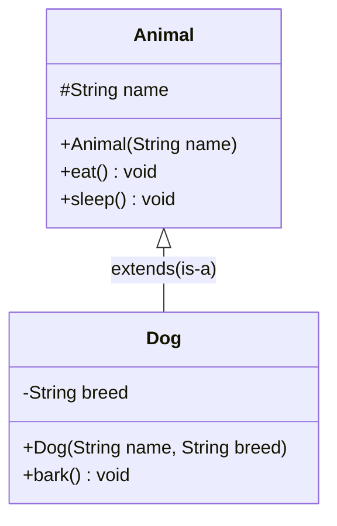

<Callout type="info">
  **이번 문서의 목표:** 상속을 is-a 관계로 정확히 이해하고 `extends` 문법과 UML 클래스 다이어그램을 연결해서 읽을 수 있게 되며, 메서드 오버로딩이 시그니처의 어떤 부분으로 구분되는지, 상속 계층에서 필드·메서드가 어떻게 이어지는지를 실행 결과 추적으로 설명할 수 있게 된다.
</Callout>

## 왜 상속이 필요한가

`Dog`, `Cat`, `Bird` 클래스를 각각 만든다고 가정해 봅시다. 세 클래스 모두 이름(name), 나이(age) 필드와 `eat()`, `sleep()` 메서드를 거의 똑같이 가질 것입니다. 이런 공통 부분을 클래스마다 매번 복사해서 쓰면, 나중에 `eat()`의 동작을 하나 고칠 때 모든 클래스를 일일이 찾아 고쳐야 합니다.

**상속**(inheritance, 상속)은 공통된 필드·메서드를 하나의 **상위 클래스**(superclass, 부모 클래스)에 모아 두고, 그 특성을 물려받는 **하위 클래스**(subclass, 자식 클래스)를 만드는 문법입니다. 03편에서 객체지향 4대 특성 중 하나로 상속을 소개했는데(자세한 정의는 03편), 이번 편에서는 `extends` 문법과 상속 구조를 코드·UML로 깊게 다룹니다.

> **쉽게 말하면:** 상속은 "부모의 유전자를 자식이 물려받는 것"과 비슷합니다. 자식은 부모가 가진 특성을 기본으로 가지면서, 자신만의 새로운 특성을 추가할 수 있습니다.

## 1. is-a 관계 — 상속을 쓸지 말지 판단하는 기준

상속은 두 클래스 사이에 **"A는 B의 한 종류다"(A is a B)** 관계가 성립할 때 사용합니다. "개(Dog)는 동물(Animal)이다"는 자연스러운 문장이므로 `Dog extends Animal`이 적절합니다. 반면 "자동차는 엔진이다"는 어색한 문장입니다 — 자동차는 엔진을 "가지고 있는"(has-a) 것이지 엔진의 한 종류가 아닙니다. 이런 has-a 관계는 상속이 아니라 **필드로 다른 객체를 참조하는 구성**(composition, 구성)으로 표현해야 하며, 이는 05편에서 다룬 객체 참조 개념과 연결됩니다.

**자주 틀리는 점:** "코드를 재사용하고 싶으니 일단 상속으로 연결한다"는 접근은 잘못된 상속 남용으로 이어집니다. is-a 관계가 성립하지 않는데 상속을 쓰면, 자식 클래스가 부모의 불필요한 필드·메서드까지 억지로 물려받아 의미상 어색해지고 유지보수가 어려워집니다.

## 2. extends 문법과 UML 클래스 다이어그램

```java
class Animal {
    protected String name;

    public Animal(String name) {
        this.name = name;
    }

    public void eat() {
        System.out.println(name + "가 먹이를 먹습니다.");
    }

    public void sleep() {
        System.out.println(name + "가 잠을 잡니다.");
    }
}

class Dog extends Animal {
    private String breed;

    public Dog(String name, String breed) {
        super(name);
        this.breed = breed;
    }

    public void bark() {   // Dog만 가지는 새로운 메서드
        System.out.println(name + "(" + breed + ")가 짖습니다: 멍멍!");
    }
}

public class InheritanceDemo {
    public static void main(String[] args) {
        Dog d = new Dog("초코", "poodle");
        d.eat();     // Animal에게서 물려받은 메서드
        d.sleep();   // Animal에게서 물려받은 메서드
        d.bark();    // Dog 자신만의 메서드
    }
}
```

```text
초코가 먹이를 먹습니다.
초코가 잠을 잡니다.
초코(poodle)가 짖습니다: 멍멍!
```

**해석:** `Dog extends Animal`이라고 선언하면, `Dog`는 `Animal`의 `name` 필드(protected이므로 접근 가능, 06편 참고)와 `eat()`, `sleep()` 메서드를 **자동으로 물려받습니다**. `Dog` 객체에서 `eat()`을 호출해도 `Dog` 클래스 안에 `eat()`을 다시 작성할 필요가 없습니다. `Dog`는 여기에 자신만의 새로운 메서드 `bark()`를 추가로 가질 수 있습니다.

같은 구조를 UML **클래스 다이어그램**(class diagram, 클래스 다이어그램)으로 그리면 다음과 같습니다.



**해석:** UML에서 속이 빈 삼각형 화살표(`<|--`)는 **상속**(일반화, generalization)을 나타내며, 화살표는 항상 **자식에서 부모 방향**(그림에서는 `Dog`에서 `Animal` 쪽)을 가리킵니다. 클래스 이름 앞의 `+`는 `public`, `-`는 `private`, `#`는 `protected` 접근 제어자를 뜻하는 UML 표기법으로, 06편에서 배운 접근 제어자와 그대로 대응합니다. `Dog` 상자에는 `Dog`가 새로 추가한 `breed` 필드와 `bark()` 메서드만 표시하고, `Animal`에게서 물려받은 `eat()`, `sleep()`은 다이어그램에 중복해서 적지 않는 것이 관례입니다(상속 화살표가 이미 그 사실을 나타내기 때문).

## 3. 메서드 오버로딩 — 시그니처로 구분한다

**메서드 오버로딩**(method overloading, 메서드 중복 정의)은 같은 이름의 메서드를 **매개변수 목록**(개수 또는 타입)을 다르게 해서 한 클래스 안에 여러 개 정의하는 것입니다. 이는 05편에서 다룬 생성자 오버로딩과 원리가 완전히 같습니다.

컴파일러가 오버로딩된 메서드를 구분하는 기준을 **시그니처**(signature, 시그니처)라고 하며, 시그니처는 **메서드 이름과 매개변수 목록**(개수·타입·순서)으로 구성됩니다. **반환 타입은 시그니처에 포함되지 않는다**는 점이 시험에서 자주 나오는 함정입니다.

```java
public class Calculator {
    public int add(int a, int b) {
        System.out.println("[int, int] 버전 호출");
        return a + b;
    }

    public double add(double a, double b) {
        System.out.println("[double, double] 버전 호출");
        return a + b;
    }

    public int add(int a, int b, int c) {
        System.out.println("[int, int, int] 버전 호출");
        return a + b + c;
    }

    public static void main(String[] args) {
        Calculator calc = new Calculator();
        System.out.println("결과: " + calc.add(1, 2));
        System.out.println("결과: " + calc.add(1.5, 2.5));
        System.out.println("결과: " + calc.add(1, 2, 3));
    }
}
```

```text
[int, int] 버전 호출
결과: 3
[double, double] 버전 호출
결과: 4.0
[int, int, int] 버전 호출
결과: 6
```

**해석:** 세 `add` 메서드는 이름이 같지만 매개변수의 **개수**(2개 vs 3개) 또는 **타입**(`int` vs `double`)이 달라 서로 다른 시그니처를 가지므로 오버로딩이 성립합니다. `calc.add(1, 2)`처럼 호출하면 컴파일러가 인자의 타입과 개수를 보고 컴파일 시점에 정확히 어느 버전을 호출할지 결정합니다(정적 바인딩, 09편에서 동적 바인딩과 비교).

```java
// 다음은 컴파일 오류가 나는 예시입니다(반환 타입만 다름)
public int add(int a, int b) { return a + b; }
public double add(int a, int b) { return a + b; }   // 오류: 시그니처가 완전히 동일함
```

```text
컴파일 오류: add(int, int)가 이미 정의되어 있음
```

**자주 틀리는 점:** "반환 타입만 다르면 오버로딩이 성립한다"는 것은 명백한 오답입니다. 두 `add(int, int)` 메서드는 매개변수 목록이 완전히 같으므로 **시그니처가 동일**하다고 판단되어, 반환 타입이 다르더라도 컴파일러는 "중복 정의"로 보고 컴파일 오류를 냅니다. 매개변수 **이름**만 다르고 타입과 개수가 같은 경우도 마찬가지로 오버로딩이 성립하지 않습니다(예: `add(int a, int b)`와 `add(int x, int y)`는 시그니처가 같음).

## 4. 오버로딩 호출 시 타입 승격(우선순위)

여러 오버로딩 버전이 있을 때, 인자의 타입과 **정확히 일치**하는 버전이 없으면 Java는 **더 넓은 타입으로 자동 변환**(타입 승격, promotion)해 가장 가까운 버전을 찾습니다.

```java
public class OverloadPriority {
    static void show(int x) {
        System.out.println("int 버전: " + x);
    }
    static void show(long x) {
        System.out.println("long 버전: " + x);
    }
    static void show(double x) {
        System.out.println("double 버전: " + x);
    }

    public static void main(String[] args) {
        byte b = 10;
        show(b);      // byte에 딱 맞는 버전이 없음 → 더 넓은 타입으로 승격
        show(5);      // int에 정확히 일치하는 버전이 있음
        show(5.0f);   // float에 딱 맞는 버전이 없음 → 더 넓은 타입으로 승격
    }
}
```

```text
int 버전: 10
int 버전: 5
double 버전: 5.0
```

**해석:** `byte`형 인자는 정확히 일치하는 `show(byte)`가 없으므로, `byte`보다 넓은 타입 중 **가장 가까운** `int`로 자동 승격되어 `show(int)`가 호출됩니다. `float`형 인자도 마찬가지로 `show(float)`가 없어 더 넓은 `double`로 승격됩니다. 반면 `show(5)`처럼 `int` 리터럴을 넘기면 `show(int)`가 정확히 일치하므로 승격 없이 바로 그 버전이 호출됩니다. 타입이 좁은 것에서 넓은 것 순서는 대략 `byte → short → int → long → float → double`입니다.

## 5. 상속과 생성자의 기본 관계 (05편 요약 연결)

05편에서 자세히 다뤘듯, 생성자는 상속되지 않으며 자식 클래스의 생성자는 반드시 `super(...)`(명시하지 않으면 자동으로 매개변수 없는 `super()`)를 통해 상위 클래스의 생성자를 먼저 실행합니다(자세한 초기화 순서와 정적/인스턴스 블록의 관계는 05편). 이번 편에서는 상속 계층이 **3단**으로 깊어졌을 때도 같은 규칙이 그대로 적용된다는 것을 정적 블록과 실행 결과로 확인합니다.

```java
class A {
    static { System.out.println("A 정적 블록"); }
    A() { System.out.println("A 생성자"); }
}
class B extends A {
    static { System.out.println("B 정적 블록"); }
    B() { System.out.println("B 생성자"); }
}
class C extends B {
    static { System.out.println("C 정적 블록"); }
    C() { System.out.println("C 생성자"); }

    public static void main(String[] args) {
        System.out.println("--- new C() 시작 ---");
        new C();
    }
}
```

```text
A 정적 블록
B 정적 블록
C 정적 블록
--- new C() 시작 ---
A 생성자
B 생성자
C 생성자
```

**해석:** 정적 블록은 클래스가 로드되는 순간 **상속 계층의 맨 위(A)부터 아래(C) 순서로**, 각 클래스당 딱 한 번씩 실행됩니다(`main`이 `C` 안에 있으므로 `C`가 로드되면서 그 조상인 `A`, `B`도 함께 로드됨). `new C()`를 호출하면 `C` 생성자의 첫 줄에서 자동으로 `super()`가 실행되어 `B` 생성자가 먼저 시작되고, `B` 생성자의 첫 줄에서 또 자동으로 `super()`가 실행되어 `A` 생성자가 가장 먼저 완료됩니다. 이 연쇄 호출 때문에 생성자는 항상 **상속 계층의 최상위(A)부터 순서대로** 실행되고, 그 다음 아래로 내려오며 완료됩니다.

## 6. 상속 계층 코드 추적 문제 유형

독학사 시험에서는 상속 계층의 필드·메서드 호출을 코드로 주고 **각 줄이 어떤 값을 만드는지** 추적하게 하는 문제가 자주 나옵니다.

```java
class Vehicle {
    int wheels = 4;

    void describe() {
        System.out.println("바퀴 수: " + wheels);
    }
}

class Motorcycle extends Vehicle {
    Motorcycle() {
        wheels = 2;   // 상속받은 필드를 자식 생성자에서 재설정
    }
}

public class TraceDemo {
    public static void main(String[] args) {
        Vehicle v = new Vehicle();
        Motorcycle m = new Motorcycle();
        v.describe();
        m.describe();
    }
}
```

| 실행 줄 | 어떤 객체의 어떤 필드가 바뀌는가 | wheels 값 |
|---------|----------------------------------|-------------|
| `new Vehicle()` | `v`의 wheels: 필드 선언 시 기본값 4로 초기화 | v.wheels = 4 |
| `new Motorcycle()` | `Motorcycle()` 생성자 실행 전 상위 Vehicle 생성자(자동 super())가 wheels를 4로 초기화 → 이후 자식 생성자 몸통에서 2로 재설정 | m.wheels = 2 |
| `v.describe()` | Vehicle에 정의된 describe() 실행, v의 wheels 사용 | 출력: 4 |
| `m.describe()` | Motorcycle이 describe()를 재정의하지 않았으므로 Vehicle의 describe()를 그대로 물려받아 실행, m의 wheels 사용 | 출력: 2 |

```text
바퀴 수: 4
바퀴 수: 2
```

**해석:** `Motorcycle`은 `describe()` 메서드를 따로 정의하지 않았으므로 `Vehicle`의 `describe()`를 그대로 물려받아 사용합니다. 하지만 `wheels` **필드 값**은 각 객체(`v`, `m`)마다 독립적으로 저장되므로, `m`의 `wheels`가 생성자에서 2로 바뀌어도 `v`의 `wheels`는 영향을 받지 않습니다. 이는 필드는 **객체마다 별도로 존재**하지만, 메서드(재정의하지 않은 경우)는 상위 클래스에 정의된 **하나의 코드를 공유**해서 실행한다는 원칙을 보여줍니다.

## 핵심 정리

- 상속은 is-a 관계일 때만 사용한다. has-a 관계는 상속이 아니라 구성(다른 객체를 필드로 참조)으로 표현한다.
- UML 클래스 다이어그램에서 상속은 속이 빈 삼각형 화살표로 표시하며, 화살표는 자식에서 부모 방향을 가리킨다. `+`/`-`/`#`는 각각 public/private/protected를 뜻한다.
- 메서드 오버로딩은 시그니처(이름 + 매개변수 목록)로 구분되며, 반환 타입이나 매개변수 이름만 다른 것은 오버로딩으로 인정되지 않는다.
- 정확히 일치하는 오버로딩 버전이 없으면 더 넓은 타입으로 자동 승격되어 가장 가까운 버전이 호출된다.
- 상속 계층이 여러 단계여도 정적 블록은 최상위부터 클래스 로드 시 한 번씩, 생성자는 super() 연쇄 호출로 최상위부터 순서대로 실행된다.
- 필드는 객체마다 독립적으로 존재하지만, 재정의되지 않은 메서드는 상위 클래스에 정의된 코드를 공유해서 실행한다.

## 마무리 복습

<Quiz
  questionNumber={1}
  question="상속(extends)을 사용하기에 적절한 관계로 옳은 것은?"
  options={['자동차 has-a 엔진', '개 is-a 동물', '학생 has-a 학번', '자동차 has-a 바퀴']}
  correctAnswer={2}
  explanation="상속은 A is a B(A는 B의 한 종류다) 관계가 성립할 때 사용한다. 개는 동물의 한 종류이므로 Dog extends Animal이 적절하다. 나머지는 모두 has-a(가지고 있다) 관계로, 구성으로 표현해야 한다."
  optionExplanations={['엔진을 가지고 있는 것은 has-a 관계로 구성이 적절하다', '정답. 개는 동물의 한 종류이므로 is-a 관계가 성립한다', '학번을 가지고 있는 것은 has-a 관계다', '바퀴를 가지고 있는 것도 has-a 관계다']}
/>

<Quiz
  questionNumber={2}
  question="UML 클래스 다이어그램에서 상속 관계를 나타내는 화살표와 방향으로 옳은 것은?"
  options={['속이 빈 삼각형 화살표, 부모에서 자식 방향', '속이 빈 삼각형 화살표, 자식에서 부모 방향', '속이 찬 다이아몬드 화살표, 자식에서 부모 방향', '점선 화살표, 부모에서 자식 방향']}
  correctAnswer={2}
  explanation="UML에서 상속(일반화)은 속이 빈 삼각형 화살표로 표시하며, 화살표는 항상 자식 클래스에서 부모 클래스 방향을 가리킨다."
  optionExplanations={['화살표 모양은 맞지만 방향이 반대다', '정답. 속이 빈 삼각형이 자식에서 부모를 향한다', '속이 찬 다이아몬드는 합성(composition) 관계를 나타낸다', '점선 화살표는 의존(dependency) 관계 등에 쓰이며 상속과 다르다']}
/>

<Quiz
  questionNumber={3}
  question="다음 두 메서드가 한 클래스 안에 함께 있을 때 성립하는 것은? public int add(int a, int b) { ... } / public double add(int a, int b) { ... }"
  options={['정상적으로 오버로딩이 성립한다', '매개변수 목록(시그니처)이 완전히 같아 반환 타입만 다르므로 컴파일 오류가 발생한다', '실행 시점에 반환 타입을 보고 자동으로 구분된다', '두 메서드 중 나중에 정의된 것만 유효하게 남는다']}
  correctAnswer={2}
  explanation="메서드 시그니처는 이름과 매개변수 목록(개수·타입·순서)으로 결정되며 반환 타입은 포함되지 않는다. 두 메서드는 매개변수 목록이 완전히 같아 시그니처가 동일하므로 반환 타입이 달라도 중복 정의로 판단되어 컴파일 오류가 난다."
  optionExplanations={['시그니처가 같으므로 오버로딩이 성립하지 않는다', '정답. 반환 타입은 시그니처에 포함되지 않아 중복 정의로 처리된다', 'Java는 반환 타입만으로 메서드를 구분해 호출하지 않는다', '컴파일 자체가 실패하므로 실행까지 가지 않는다']}
/>

<Quiz
  questionNumber={4}
  question="show(int), show(long), show(double)이 오버로딩되어 있을 때, byte 타입 인자로 호출하면 어느 버전이 실행되는가?"
  options={['byte 전용 버전이 자동 생성되어 실행된다', 'byte보다 넓은 타입 중 가장 가까운 int 버전으로 자동 승격되어 실행된다', '컴파일 오류가 발생한다', '항상 double 버전이 실행된다']}
  correctAnswer={2}
  explanation="정확히 일치하는 byte 버전이 없으므로 더 넓은 타입으로 자동 승격되며, byte보다 넓은 타입 중 가장 가까운 int 버전이 선택되어 실행된다."
  optionExplanations={['Java는 인자 타입에 맞춰 메서드를 자동 생성하지 않는다', '정답. 가장 가까운 넓은 타입인 int로 승격되어 그 버전이 호출된다', '적절한 승격 대상이 있으므로 컴파일 오류가 아니다', '가장 가까운 타입인 int가 우선되며 double까지 건너뛰지 않는다']}
/>

<Quiz
  questionNumber={5}
  question="세 클래스 A → B → C가 상속 관계(B extends A, C extends B)일 때, new C()를 호출하면 생성자가 실행되는 순서는?"
  options={['C 생성자 → B 생성자 → A 생성자', 'A 생성자 → B 생성자 → C 생성자', '세 생성자가 동시에 실행된다', 'C 생성자만 실행되고 A, B 생성자는 생략된다']}
  correctAnswer={2}
  explanation="자식 생성자의 첫 줄에서 자동으로(또는 명시적으로) super()가 실행되어 상위 클래스 생성자를 먼저 완료시키는 연쇄가 최상위까지 이어진다. 따라서 상속 계층의 최상위인 A부터 순서대로 실행되고 마지막에 C가 실행된다."
  optionExplanations={['실행 순서가 반대로 뒤바뀌었다', '정답. super() 연쇄 호출로 최상위부터 순서대로 실행된다', '생성자는 순차적으로 하나씩 실행되며 동시 실행되지 않는다', '자식 생성자가 실행되려면 반드시 상위 생성자들이 먼저 완료되어야 한다']}
/>

<Quiz
  questionNumber={6}
  question="Vehicle 클래스의 필드 wheels=4를 상속한 Motorcycle이 생성자에서 wheels를 2로 재설정했을 때, 이미 존재하던 Vehicle 객체 v의 wheels 값은 어떻게 되는가?"
  options={['v의 wheels도 함께 2로 바뀐다', 'v의 wheels는 영향을 받지 않고 그대로 4로 남는다', 'v와 Motorcycle 객체가 같은 wheels를 공유하므로 값이 합쳐진다', '컴파일 오류가 발생한다']}
  correctAnswer={2}
  explanation="필드는 객체마다 독립적인 메모리 공간에 저장된다. Motorcycle 객체의 생성자에서 wheels를 2로 바꾸는 것은 그 Motorcycle 객체 자신의 필드에만 영향을 주며, 이미 따로 존재하는 Vehicle 객체 v의 wheels와는 무관하다."
  optionExplanations={['서로 다른 객체의 필드는 독립적이므로 v에는 영향이 없다', '정답. 객체마다 별도의 메모리에 필드가 저장되기 때문이다', '필드는 공유되지 않고 객체마다 독립적으로 존재한다', '유효한 문법이므로 오류 없이 정상 실행된다']}
/>

## 참고 자료

- Oracle Java Tutorials - Object-Oriented Programming Concepts: https://docs.oracle.com/javase/tutorial/java/concepts/index.html
- Oracle Java Tutorials - Learning the Java Language: https://docs.oracle.com/javase/tutorial/java/index.html
- 국가평생교육진흥원 독학학위제: https://bdes.nile.or.kr
