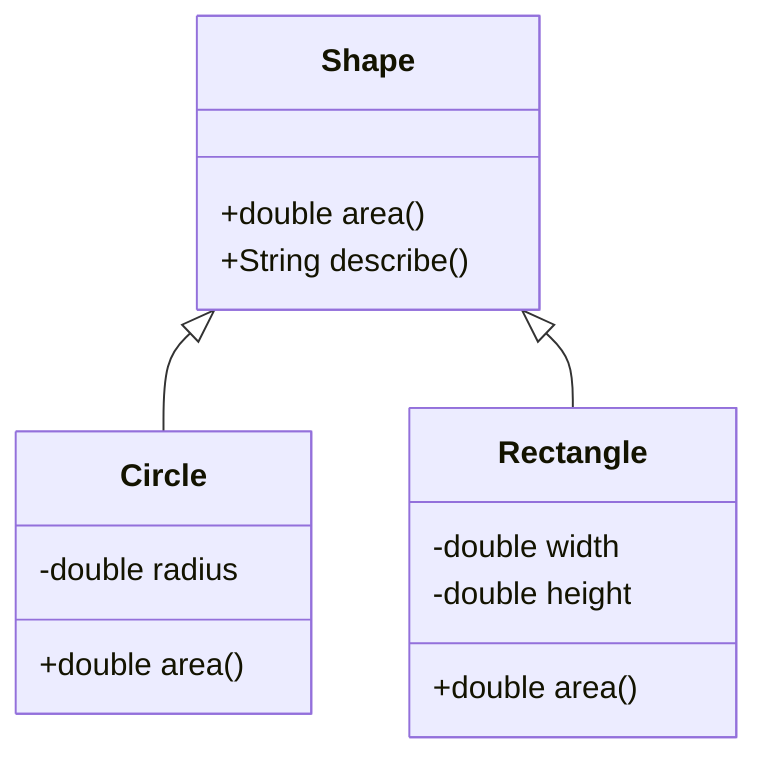

<Callout type="info">
  **이번 문서의 목표:** 이 문서를 다 읽으면 오버라이딩 규칙을 위반한 코드를 한눈에 찾아낼 수 있고, 업캐스팅된 참조 변수로 호출한 메서드가 실제로 어떤 메서드인지 동적 바인딩 원리로 설명하며, 시험에 나오는 상속·다형성 코드의 실행 결과를 변수 값 표로 추적할 수 있다.
</Callout>

## 왜 이 편이 필요한가

08편에서 상속(inheritance)을 "부모 클래스의 필드와 메서드를 자식 클래스가 물려받는 것"으로 정의하고, 오버로딩(overloading, 이름은 같지만 매개변수 목록이 다른 메서드를 여러 개 정의하는 것)의 규칙을 다뤘다. 이 편에서는 상속 관계에서만 나타나는 또 다른 현상인 **오버라이딩**(overriding)을 다룬다. 오버라이딩은 오버로딩과 이름이 비슷해서 시험에서 가장 자주 헷갈리게 만드는 지점이지만, 둘은 원리부터 완전히 다르다. 오버로딩은 **한 클래스 안에서 컴파일 시점에** 어떤 메서드를 호출할지 정해지는 반면, 오버라이딩은 **부모-자식 관계에서 실행 시점에** 어떤 메서드가 실행될지 정해진다. 이 "실행 시점에 정해진다"는 성질이 바로 **동적 바인딩**(dynamic binding, 프로그램이 실제로 돌아가는 중에 호출할 메서드를 결정하는 방식)이고, 동적 바인딩이 가능하게 해 주는 언어 차원의 성질이 **다형성**(polymorphism, 그리스어로 "여러 가지poly 모양morph"이라는 뜻으로, 같은 코드가 실제 객체 종류에 따라 다르게 동작하는 성질)이다.

> **쉽게 말하면:** 오버로딩은 "같은 이름, 다른 매개변수"를 컴파일러가 미리 골라주는 것이고, 오버라이딩은 "같은 이름, 같은 매개변수"를 실행 중에 실제 객체가 무엇인지 보고 골라주는 것이다.

독학사 3단계 시험에서 이 주제는 단순 정의 문제보다 **코드를 주고 출력 결과를 맞히는 문제**로 훨씬 많이 나온다. 그래서 이 편은 정의를 짧게 정리한 뒤 대부분의 분량을 코드 추적 연습에 쓴다.

## 오버라이딩의 규칙

오버라이딩은 부모 클래스가 정의한 메서드를 자식 클래스가 **자신의 상황에 맞게 다시 정의**하는 것이다. 정의만으로는 감이 잘 안 오므로 바로 코드로 보자.

```java
class Animal {
    String name;

    Animal(String name) {
        this.name = name;
    }

    String makeSound() {
        return name + "은(는) 소리를 낸다.";
    }
}

class Dog extends Animal {
    Dog(String name) {
        super(name);
    }

    @Override
    String makeSound() {
        return name + "은(는) 멍멍 짖는다.";
    }
}
```

`Dog`의 `makeSound`가 `Animal`의 `makeSound`를 **오버라이딩**했다고 말하려면 다음 조건을 모두 만족해야 한다.

1. **메서드 이름이 같아야 한다.** (`makeSound`)
2. **매개변수 목록(개수·타입·순서)이 완전히 같아야 한다.** 하나라도 다르면 오버라이딩이 아니라 새로운 메서드를 하나 더 만든 것(우연히 오버로딩이 된 것)이다.
3. **반환 타입이 같거나, 공변 반환 타입(covariant return type, 부모 메서드의 반환 타입의 하위 클래스로 좁혀서 반환하는 것)이어야 한다.** 예를 들어 부모가 `Animal`을 반환하면 자식은 `Dog`를 반환해도 된다. 하지만 전혀 관계없는 타입으로 바꾸면 오류다.
4. **접근 제어자를 부모보다 좁게 줄일 수 없다.** 부모가 `protected`면 자식은 `protected` 이상(더 넓게, 즉 `public`)으로만 재정의할 수 있다. `private`로 좁히면 컴파일 오류다.
5. **부모 메서드가 던지는 checked 예외(컴파일러가 처리를 강제하는 예외, 13편에서 자세히)보다 더 넓은 범위의 checked 예외를 새로 던질 수 없다.** 더 좁히거나 아예 던지지 않는 것은 허용된다.
6. `static` 메서드, `private` 메서드, `final` 메서드는 오버라이딩할 수 없다. `static` 메서드를 자식 클래스에서 같은 시그니처로 다시 선언하면 그것은 오버라이딩이 아니라 **메서드 숨김**(method hiding)이라는 별개의 현상이다.

`@Override` 애너테이션(annotation, 컴파일러에게 추가 정보를 알려주는 표시자)은 필수는 아니지만, 위 조건 중 하나라도 어기면 컴파일러가 바로 오류를 내 주므로 실수를 예방하는 안전장치 역할을 한다.

> **자주 틀리는 점:** "오버라이딩한 메서드는 부모보다 접근 범위를 넓힐 수만 있고 좁힐 수는 없다"를 반대로 외워서, `protected`를 `private`로 좁혀도 된다고 착각하는 보기가 자주 나온다. 방향을 반드시 "좁히기는 금지, 넓히기는 허용"으로 정확히 기억해야 한다.

## 오버로딩과 오버라이딩 비교

시험에서 가장 많이 나오는 비교표다. 08편에서 다룬 오버로딩 규칙과 나란히 놓고 차이를 확실히 굳힌다.

| 구분 | 오버로딩(overloading) | 오버라이딩(overriding) |
|------|------------------------|--------------------------|
| 관계 | 같은 클래스 안(또는 상속 관계에서도 가능) | 부모-자식 상속 관계 |
| 매개변수 목록 | 반드시 달라야 함(개수·타입·순서 중 하나 이상) | 반드시 같아야 함 |
| 반환 타입 | 자유롭게 다를 수 있음(매개변수가 다르면) | 같거나 공변 반환 타입만 허용 |
| 바인딩 시점 | 컴파일 시점(정적 바인딩) | 실행 시점(동적 바인딩) |
| 결정 기준 | 참조 변수의 선언 타입과 인자 타입 | 실제로 생성된 객체의 타입 |
| 접근 제어자 | 제약 없음 | 부모보다 좁힐 수 없음 |

이 표에서 가장 중요한 줄은 "바인딩 시점"과 "결정 기준"이다. 이 두 줄이 다음 절에서 다룰 동적 바인딩의 핵심이다.

## 업캐스팅과 다운캐스팅

상속 관계에서는 자식 클래스의 객체를 부모 타입의 참조 변수에 담을 수 있다. 이를 **업캐스팅**(upcasting, 상속 계층에서 위쪽인 부모 타입으로 참조를 바꾸는 것)이라 한다.

```java
Animal a = new Dog("바둑이");
```

여기서 `a`의 **선언 타입**(참조 변수의 타입)은 `Animal`이지만, `a`가 실제로 가리키는 **객체의 실제 타입**(런타임 타입)은 `Dog`다. 이 둘이 다를 수 있다는 것이 다형성의 출발점이다. 업캐스팅은 자동으로 일어나며 명시적인 형변환 코드가 없어도 된다. "Dog는 Animal이다"라는 is-a 관계가 성립하기 때문에 안전하기 때문이다.

반대로 부모 타입 참조를 다시 자식 타입으로 되돌리는 것을 **다운캐스팅**(downcasting)이라 하며, 이때는 반드시 명시적으로 타입을 적어야 한다.

```java
Animal a = new Dog("바둑이");
Dog d = (Dog) a;
```

다운캐스팅은 위험할 수 있다. `a`가 실제로 `Dog` 객체를 가리키고 있어야만 성공하고, 실제로는 다른 자식 클래스(예를 들어 `Cat`)의 객체였다면 `ClassCastException`(클래스 형변환 예외)이 실행 중에 발생한다. 그래서 다운캐스팅 전에는 `instanceof` 연산자로 실제 타입을 확인하는 것이 안전한 관례다.

```java
if (a instanceof Dog) {
    Dog d = (Dog) a;
    System.out.println("다운캐스팅 성공");
}
```

## 동적 바인딩의 동작 원리

이제 오버라이딩과 업캐스팅을 합쳐서, 시험에 가장 많이 나오는 형태의 코드를 추적해 본다.

```java
class Animal {
    String makeSound() {
        return "동물이 소리를 낸다.";
    }
}

class Dog extends Animal {
    @Override
    String makeSound() {
        return "멍멍!";
    }
}

class Cat extends Animal {
    @Override
    String makeSound() {
        return "야옹!";
    }
}

public class Main {
    public static void main(String[] args) {
        Animal a1 = new Dog();
        Animal a2 = new Cat();
        System.out.println(a1.makeSound());
        System.out.println(a2.makeSound());
    }
}
```

```text
멍멍!
야옹!
```

`a1`과 `a2`는 둘 다 **선언 타입이 Animal**이다. `a1.makeSound()`, `a2.makeSound()`라는 호출 코드만 보면 똑같이 `Animal`의 메서드를 부르는 것처럼 보인다. 그런데 출력은 `Dog`와 `Cat`의 메서드가 각각 실행된 결과다. 이것이 동적 바인딩이다. 정리하면 다음과 같다.

<Steps>
1. **컴파일 시점**: 컴파일러는 `a1`의 선언 타입인 `Animal`을 보고 "`Animal` 클래스(또는 그 자손)에 `makeSound()`라는 메서드가 있는가"만 확인한다. 있으면 컴파일이 통과한다. 어떤 메서드 몸체가 실행될지는 이 시점에 정하지 않는다.
2. **실행 시점**: 프로그램이 실제로 `a1.makeSound()`라는 줄에 도달하면, JVM(자바 가상 머신, Java Virtual Machine)은 `a1`이 **실제로 가리키는 객체의 타입**(런타임 타입, 여기서는 `Dog`)을 확인한다.
3. **메서드 탐색**: JVM은 `Dog` 클래스에 `makeSound()`가 오버라이딩되어 있는지 찾는다. 있으면 그것을 실행하고, 없으면 부모 클래스로 거슬러 올라가며 찾는다(08편의 상속 탐색과 같은 방향).
4. **실행**: 찾은 메서드의 몸체가 실행되고 결과가 반환된다.
</Steps>

이 표(선언 타입 vs 실제 타입)를 변수 값 추적표로 만들면 다음과 같다.

| 변수 | 선언 타입 | 실제 타입(런타임) | `makeSound()` 호출 시 실행되는 메서드 |
|------|-----------|--------------------|------------------------------------------|
| `a1` | `Animal` | `Dog` | `Dog.makeSound()` |
| `a2` | `Animal` | `Cat` | `Cat.makeSound()` |

> **쉽게 말하면:** 컴파일러는 "이 메서드를 부를 자격이 있는가"만 확인하고, 실제로 "누구의 메서드를 부를지"는 프로그램이 돌아가는 그 순간에 실제 객체를 보고 정한다.

## 필드는 동적 바인딩되지 않는다

시험에서 가장 잘 노리는 함정이 바로 이것이다. **메서드는 동적 바인딩되지만, 필드(인스턴스 변수)는 정적 바인딩**된다. 즉 필드 접근은 참조 변수의 **선언 타입**을 기준으로 결정된다.

```java
class Animal {
    String kind = "동물";

    String makeSound() {
        return "동물이 소리를 낸다.";
    }
}

class Dog extends Animal {
    String kind = "개";

    @Override
    String makeSound() {
        return "멍멍!";
    }
}

public class Main {
    public static void main(String[] args) {
        Animal a = new Dog();
        System.out.println(a.kind);
        System.out.println(a.makeSound());
    }
}
```

```text
동물
멍멍!
```

`a.kind`는 `a`의 선언 타입인 `Animal`의 `kind` 필드를 그대로 읽어서 "동물"이 출력된다. 하지만 `a.makeSound()`는 실제 타입인 `Dog`의 메서드가 실행되어 "멍멍!"이 출력된다. 이렇게 **같은 참조 변수인데도 필드는 정적으로, 메서드는 동적으로** 결정된다는 사실이 오버라이딩·다형성 문제에서 가장 많이 틀리는 지점이다.

> **자주 틀리는 점:** 필드도 메서드처럼 자식 클래스의 값을 따라간다고 착각해 "개"가 출력될 것이라 예상하는 경우가 많다. **필드는 오버라이딩되지 않는다.** 자식 클래스가 부모와 같은 이름의 필드를 선언하면 그것은 오버라이딩이 아니라 부모 필드를 **가리는(shadowing) 것**이며, 어느 필드가 보이는지는 참조 변수의 선언 타입이 결정한다.

## 실행 결과 추적 문제 — this 참조와 다형성

다음은 생성자 안에서 오버라이딩된 메서드를 호출할 때 나타나는, 시험 난이도가 높은 유형이다.

```java
class Parent {
    Parent() {
        print();
    }

    void print() {
        System.out.println("Parent.print");
    }
}

class Child extends Parent {
    int value = 10;

    @Override
    void print() {
        System.out.println("Child.print, value = " + value);
    }
}

public class Main {
    public static void main(String[] args) {
        new Child();
    }
}
```

```text
Child.print, value = 0
```

이 결과는 처음 보면 반드시 헷갈린다. 한 줄씩 실행을 추적해 보자.

| 단계 | 실행 위치 | 설명 |
|------|-----------|------|
| 1 | `new Child()` | `Child` 객체 생성 시작. 05편에서 배운 대로 부모 생성자가 먼저 호출된다. |
| 2 | `Parent()` 생성자 실행 | 05편에서 다룬 초기화 순서상, `Child`의 필드 `value`는 아직 기본값 `0`으로만 초기화된 상태이고 `value = 10`이라는 명시적 초기화 코드는 아직 실행되지 않았다. |
| 3 | `print()` 호출 | `Parent` 생성자 안에서 `this.print()`가 암묵적으로 호출된다. `this`의 실제 타입은 이미 `Child`이므로 동적 바인딩에 따라 `Child.print()`가 실행된다. |
| 4 | `Child.print()` 실행 | `value`를 출력하는데, 이 시점에는 아직 `10`으로 초기화되지 않았으므로 기본값인 `0`이 출력된다. |
| 5 | `Child` 생성자의 나머지 부분 실행 | (여기서는 명시적 생성자가 없으므로 필드 초기화 `value = 10`이 이 단계에서 적용된다.) |

> **자주 틀리는 점:** "생성자 안에서 오버라이딩 가능한 메서드를 호출하면 아직 자식 클래스의 필드 초기화가 끝나지 않은 상태에서 실행될 수 있다"는 것이 이 문제의 핵심 함정이다. 이 때문에 실무에서도 생성자 안에서 오버라이딩 가능한 메서드를 호출하는 것은 위험한 습관으로 취급되지만, 독학사 시험에서는 오히려 **이 위험성 자체를 이해했는지** 확인하려고 즐겨 출제한다.

## 다형적 배열과 메서드 목록 순회

여러 자식 클래스의 객체를 부모 타입 배열에 모아 순회하는 코드도 자주 나온다.

```java
class Shape {
    double area() {
        return 0.0;
    }

    String describe() {
        return "도형의 넓이는 " + area() + "이다.";
    }
}

class Circle extends Shape {
    double radius;

    Circle(double radius) {
        this.radius = radius;
    }

    @Override
    double area() {
        return Math.PI * radius * radius;
    }
}

class Rectangle extends Shape {
    double width, height;

    Rectangle(double width, double height) {
        this.width = width;
        this.height = height;
    }

    @Override
    double area() {
        return width * height;
    }
}

public class Main {
    public static void main(String[] args) {
        Shape[] shapes = { new Circle(2.0), new Rectangle(3.0, 4.0) };
        for (Shape s : shapes) {
            System.out.println(s.describe());
        }
    }
}
```

```text
도형의 넓이는 12.566370614359172이다.
도형의 넓이는 12.0이다.
```

여기서 눈여겨볼 부분은 `describe()`는 `Shape` 클래스에만 정의되어 있고 오버라이딩되지 않았는데도, 그 안에서 부르는 `area()`는 동적 바인딩되어 실제 객체(`Circle` 또는 `Rectangle`)의 `area()`가 실행된다는 점이다. 이것이 다형성이 실제로 쓸모 있는 이유다. `Shape` 타입 배열 하나로 서로 다른 도형을 **같은 코드로** 다룰 수 있으며, `describe()`를 자식 클래스마다 새로 작성할 필요가 없다.



이 클래스 다이어그램에서 `Shape <|-- Circle`과 `Shape <|-- Rectangle`은 UML(Unified Modeling Language, 통합 모델링 언어, 20편에서 자세히)에서 상속 관계를 나타내는 표기이며, 화살표는 자식에서 부모 쪽으로 속이 빈 삼각형을 향한다. `area()`가 `Shape`, `Circle`, `Rectangle` 세 클래스 모두에 나타나는 것은 오버라이딩 관계를 보여준다.

## 자주 틀리는 점 정리

- **오버로딩과 오버라이딩을 반대로 설명하는 보기.** "오버로딩은 실행 시점에 결정된다"거나 "오버라이딩은 매개변수가 달라야 한다"는 식으로 서로의 특징을 뒤바꿔 놓은 보기가 정답처럼 보이도록 나온다.
- **static 메서드를 오버라이딩할 수 있다고 착각하는 것.** static 메서드는 인스턴스가 아니라 클래스에 속하므로 동적 바인딩 대상이 아니다. 자식 클래스에서 같은 시그니처로 다시 선언하면 메서드 숨김이며, 참조 변수의 **선언 타입**을 기준으로 어떤 클래스의 static 메서드가 호출될지 정해진다(필드와 같은 원리).
- **필드도 메서드처럼 동적 바인딩된다고 착각하는 것.** 위에서 다룬 대로 필드는 항상 선언 타입 기준이다.
- **생성자에서 호출한 오버라이딩 메서드가 부모 클래스의 것이 실행된다고 착각하는 것.** 실제로는 항상 실제 객체 타입(가장 자식 쪽) 기준으로 실행된다.
- **다운캐스팅이 항상 안전하다고 가정하는 것.** 실제 타입과 다른 타입으로 다운캐스팅하면 `ClassCastException`이 발생한다.

## 핵심 정리

- 오버라이딩은 부모-자식 관계에서 같은 시그니처(이름·매개변수·반환 타입 또는 공변 반환 타입)의 메서드를 자식이 다시 정의하는 것이고, 접근 제어자는 좁힐 수 없다.
- 오버로딩은 컴파일 시점의 정적 바인딩, 오버라이딩은 실행 시점의 동적 바인딩이라는 점이 두 개념을 가르는 핵심 기준이다.
- 업캐스팅은 자동으로, 다운캐스팅은 명시적 형변환과 `instanceof` 확인을 거쳐 안전하게 수행해야 한다.
- 메서드 호출은 실제 객체 타입(런타임 타입)을 따르는 동적 바인딩이지만, 필드 접근과 static 메서드 호출은 참조 변수의 선언 타입을 따르는 정적 바인딩이다.
- 다형성은 부모 타입 하나로 여러 자식 타입의 객체를 같은 코드로 다룰 수 있게 해 주며, 이 원리는 배열·컬렉션 순회 코드에서 실용적으로 나타난다.

## 마무리 복습

<Quiz
  questionNumber={1}
  question="메서드 오버라이딩이 성립하기 위한 조건으로 옳지 않은 것은?"
  options={['메서드 이름과 매개변수 목록이 부모 메서드와 완전히 같아야 한다', '반환 타입은 부모와 같거나 공변 반환 타입이어야 한다', '접근 제어자는 부모보다 넓히는 것만 허용된다', '접근 제어자는 부모보다 자유롭게 좁힐 수 있다']}
  correctAnswer={4}
  explanation="오버라이딩 시 접근 제어자는 부모보다 넓히는 것은 허용되지만 좁히는 것은 컴파일 오류다. 예를 들어 부모가 protected면 자식은 protected 이상으로만 재정의할 수 있다."
  optionExplanations={['이름과 매개변수 목록이 완전히 같아야 한다는 것은 오버라이딩의 기본 조건이다.', '반환 타입이 같거나 공변 반환 타입이어야 한다는 것은 옳은 규칙이다.', '접근 제어자를 넓히는 것만 허용된다는 설명은 옳다.', '정답. 접근 제어자를 좁히는 것은 금지되어 있으므로 이 설명이 옳지 않다.']}
/>

<Quiz
  questionNumber={2}
  question="다음 중 오버로딩과 오버라이딩의 차이에 대한 설명으로 옳은 것은?"
  options={['오버로딩은 실행 시점에, 오버라이딩은 컴파일 시점에 결정된다', '오버로딩은 매개변수 목록이 달라야 하고, 오버라이딩은 매개변수 목록이 같아야 한다', '오버로딩은 상속 관계에서만 가능하고, 오버라이딩은 한 클래스 안에서만 가능하다', '오버라이딩은 static 메서드에도 자유롭게 적용된다']}
  correctAnswer={2}
  explanation="오버로딩은 매개변수의 개수·타입·순서 중 하나 이상이 달라야 성립하고, 오버라이딩은 매개변수 목록이 완전히 같아야 성립한다. 바인딩 시점은 반대로 설명된 보기가 함정이다."
  optionExplanations={['바인딩 시점이 반대로 서술되어 있다. 오버로딩이 컴파일 시점(정적), 오버라이딩이 실행 시점(동적)이다.', '정답. 매개변수 목록이 달라야 하는지 같아야 하는지가 두 개념을 가르는 핵심 차이다.', '오버로딩은 한 클래스 안에서도 가능하고, 오버라이딩은 상속 관계에서만 가능하다는 점이 반대로 서술되어 있다.', 'static 메서드는 동적 바인딩 대상이 아니므로 오버라이딩할 수 없다.']}
/>

<Quiz
  questionNumber={3}
  question="다음 코드의 실행 결과로 옳은 것은? (Animal, Dog는 makeSound를 오버라이딩하며, Animal a = new Dog()로 선언하고 a.makeSound()를 호출한다)"
  options={['Animal의 makeSound가 실행된다', 'Dog의 makeSound가 실행된다', '컴파일 오류가 발생한다', 'Animal과 Dog의 makeSound가 모두 실행된다']}
  correctAnswer={2}
  explanation="메서드 호출은 동적 바인딩을 따르므로, 참조 변수의 선언 타입이 Animal이어도 실제 객체의 타입인 Dog의 makeSound가 실행된다."
  optionExplanations={['동적 바인딩에 의해 선언 타입이 아니라 실제 타입의 메서드가 실행되므로 옳지 않다.', '정답. 실제 객체 타입인 Dog를 기준으로 동적 바인딩이 일어난다.', '오버라이딩 조건을 만족한 정상 코드이므로 컴파일 오류가 아니다.', '오버라이딩된 메서드는 실제 타입의 메서드 하나만 실행된다.']}
/>

<Quiz
  questionNumber={4}
  question="참조 변수를 통한 필드 접근과 메서드 호출에 대한 설명으로 옳은 것은?"
  options={['필드와 메서드 모두 실제 객체 타입을 기준으로 결정된다', '필드와 메서드 모두 참조 변수의 선언 타입을 기준으로 결정된다', '메서드 호출은 실제 객체 타입을, 필드 접근은 참조 변수의 선언 타입을 기준으로 결정된다', '필드 접근은 실제 객체 타입을, 메서드 호출은 참조 변수의 선언 타입을 기준으로 결정된다']}
  correctAnswer={3}
  explanation="메서드는 오버라이딩되어 동적 바인딩되므로 실제 객체 타입(런타임 타입)을 따르지만, 필드는 오버라이딩되지 않고 가려질 뿐이므로 참조 변수의 선언 타입을 따른다."
  optionExplanations={['필드는 동적 바인딩 대상이 아니므로 이 설명은 옳지 않다.', '메서드는 동적 바인딩 대상이므로 이 설명은 옳지 않다.', '정답. 메서드는 동적(실제 타입), 필드는 정적(선언 타입) 바인딩이라는 설명이 정확하다.', '메서드와 필드의 기준이 반대로 서술되어 있다.']}
/>

<Quiz
  questionNumber={5}
  question="Animal a = new Dog(); 로 선언된 상태에서 (Cat) a로 다운캐스팅을 시도하면 어떤 일이 일어나는가? (단 Cat도 Animal의 자식 클래스다)"
  options={['정상적으로 성공하고 Cat 타입 참조 변수가 만들어진다', '컴파일 오류가 발생한다', '실행 중에 ClassCastException이 발생한다', '아무 일도 일어나지 않고 a는 그대로 Dog 객체를 가리킨다']}
  correctAnswer={3}
  explanation="a가 실제로 가리키는 객체는 Dog이므로 Cat으로 다운캐스팅하면 컴파일은 통과하지만 실행 중에 ClassCastException이 발생한다. 다운캐스팅의 성공 여부는 실제 객체 타입에 달려 있다."
  optionExplanations={['실제 타입이 Dog이므로 Cat으로의 다운캐스팅은 실패한다.', 'Cat이 Animal의 자식이므로 문법적으로는 컴파일이 통과한다.', '정답. 실제 객체 타입과 다운캐스팅 대상 타입이 맞지 않아 실행 중 예외가 발생한다.', '다운캐스팅 시도 자체가 실행되므로 아무 일도 일어나지 않는다는 설명은 옳지 않다.']}
/>

<Quiz
  questionNumber={6}
  question="생성자 안에서 오버라이딩 가능한 메서드를 호출하는 코드에 대한 설명으로 옳은 것은?"
  options={['항상 부모 클래스에 정의된 메서드가 실행된다', '자식 클래스의 필드 초기화가 아직 끝나지 않은 상태에서 자식 클래스의 오버라이딩된 메서드가 실행될 수 있다', '컴파일 시점에 오류가 발생하므로 이런 코드는 작성할 수 없다', '이런 코드는 항상 무한 재귀를 일으킨다']}
  correctAnswer={2}
  explanation="부모 생성자가 실행되는 시점에 this의 실제 타입은 이미 자식 클래스이므로 동적 바인딩에 의해 자식의 오버라이딩된 메서드가 실행된다. 그런데 이 시점에는 자식 클래스의 명시적 필드 초기화가 아직 적용되지 않아 기본값이 출력되는 등 예상과 다른 결과가 나올 수 있다."
  optionExplanations={['동적 바인딩에 의해 실제 타입인 자식 클래스의 메서드가 실행되므로 이 설명은 옳지 않다.', '정답. 필드 초기화 순서와 동적 바인딩이 겹치면서 나타나는 현상을 정확히 설명한다.', '문법적으로 오류가 없으므로 컴파일은 정상적으로 통과한다.', '재귀 호출 구조가 아니라면 무한 재귀가 발생하지 않는다.']}
/>

<Quiz
  questionNumber={7}
  question="static 메서드를 자식 클래스에서 부모와 같은 시그니처로 다시 선언했을 때 나타나는 현상을 가장 정확히 설명한 것은?"
  options={['오버라이딩이며 동적 바인딩이 적용된다', '메서드 숨김이며 참조 변수의 선언 타입을 기준으로 호출된다', '컴파일 오류가 발생한다', '두 메서드가 동시에 실행된다']}
  correctAnswer={2}
  explanation="static 메서드는 인스턴스가 아니라 클래스에 속하므로 동적 바인딩 대상이 아니다. 같은 시그니처로 다시 선언하면 메서드 숨김이 일어나며, 어떤 클래스의 static 메서드가 호출되는지는 참조 변수의 선언 타입이 결정한다."
  optionExplanations={['static 메서드는 동적 바인딩 대상이 아니므로 오버라이딩이라는 설명은 옳지 않다.', '정답. 메서드 숨김은 필드 접근과 마찬가지로 선언 타입을 기준으로 결정된다.', '문법적으로 허용되는 코드이므로 컴파일 오류가 아니다.', '호출 시점에는 하나의 메서드만 실행된다.']}
/>

## 참고 자료

- [Oracle Java Tutorials - Classes and Objects](https://docs.oracle.com/javase/tutorial/java/javaOO/index.html) — 오버라이딩·다형성과 관련된 클래스·객체 문법의 공식 설명.
- [Oracle Java Tutorials - Object-Oriented Programming Concepts](https://docs.oracle.com/javase/tutorial/java/concepts/index.html) — 상속과 다형성 개념을 정리한 공식 자료.
