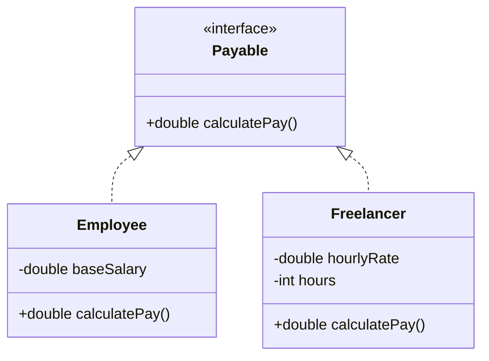

<Callout type="info">
  **이번 문서의 목표:** 이 문서를 다 읽으면 인터페이스를 선언하고 구현하는 코드를 정확히 작성할 수 있고, 한 클래스가 여러 인터페이스를 구현할 때 생기는 문법 규칙을 설명할 수 있으며, 추상 클래스와 인터페이스 중 어느 것을 써야 하는지 근거를 들어 판단할 수 있다.
</Callout>

## 왜 이 편이 필요한가

10편에서 추상 클래스는 "공통 코드는 물려주고, 자식마다 달라야 하는 부분은 구현을 강제한다"는 역할을 한다고 배웠다. 그런데 Java는 **한 클래스가 부모 클래스를 하나만 가질 수 있다**(단일 상속, single inheritance)는 제약이 있다. 만약 "날 수 있음"과 "헤엄칠 수 있음"이라는, 서로 관계없는 두 가지 능력을 동시에 갖는 클래스를 만들고 싶다면 어떻게 해야 할까. 클래스 상속만으로는 두 부모를 동시에 둘 수 없다. 이 문제를 해결하는 Java의 도구가 이 편의 주제인 **인터페이스**(interface)다.

> **쉽게 말하면:** 인터페이스는 "이 기능을 하려면 반드시 이런 메서드를 갖고 있어야 한다"는 **약속**(계약)만 정의하고, 그 약속을 지키겠다고 나선 클래스는 몇 개든 자유롭게 구현할 수 있게 해 주는 문법이다.

## 인터페이스 선언과 구현

인터페이스는 `interface` 키워드로 선언하며, 기본적으로 그 안의 메서드는 **몸체 없는 추상 메서드**다.

```java
interface Flyable {
    void fly();
}

interface Swimmable {
    void swim();
}
```

인터페이스가 규정한 메서드를 실제로 채워 넣는 클래스는 `implements` 키워드로 그 인터페이스를 **구현**(implement)한다고 말한다.

```java
class Duck implements Flyable, Swimmable {
    @Override
    public void fly() {
        System.out.println("오리가 날아오른다.");
    }

    @Override
    public void swim() {
        System.out.println("오리가 헤엄친다.");
    }
}

public class Main {
    public static void main(String[] args) {
        Duck duck = new Duck();
        duck.fly();
        duck.swim();
    }
}
```

```text
오리가 날아오른다.
오리가 헤엄친다.
```

`Duck`은 `extends`로 부모 클래스를 하나만 가질 수 있지만, `implements`로는 `Flyable`과 `Swimmable`을 **쉼표로 나열해 여러 개** 구현할 수 있다. 이것이 "인터페이스는 다중 구현이 가능하다"는 말의 실제 의미이며, 09~10편에서 다룬 클래스 상속의 "단일 상속" 제약과 대비되는 인터페이스의 가장 큰 특징이다.

인터페이스 안 메서드에는 규칙이 있다.

1. **인터페이스의 추상 메서드는 암묵적으로 `public abstract`다.** 접근 제어자를 아예 쓰지 않아도 컴파일러가 자동으로 `public abstract`를 붙인 것으로 처리한다.
2. **인터페이스를 구현하는 클래스는 그 메서드를 반드시 `public`으로 오버라이딩해야 한다.** 09편에서 배운 "접근 제어자를 좁힐 수 없다"는 규칙이 여기서도 그대로 적용된다. 인터페이스 메서드는 이미 `public`이므로, 구현할 때 더 좁은 `protected`나 `default`, `private`으로는 쓸 수 없다.
3. **인터페이스는 인스턴스 필드를 가질 수 없다.** 인터페이스에 선언한 필드는 자동으로 `public static final`(상수)이 된다. 즉 객체마다 다른 값을 가지는 필드는 인터페이스에 둘 수 없다.
4. **인터페이스는 생성자를 가질 수 없다.** 인터페이스 자체는 객체가 아니라 계약이므로 초기화할 상태가 없기 때문이다.
5. **인터페이스도 인터페이스를 상속할 수 있으며, 이때는 `extends`를 쓰고 여러 인터페이스를 동시에 상속받을 수도 있다**(인터페이스끼리는 다중 상속이 허용된다).

> **자주 틀리는 점:** "인터페이스의 필드는 자유롭게 값을 바꿀 수 있다"고 착각하는 경우가 많다. 실제로는 `public static final`이 자동으로 붙어 상수가 되므로, 선언과 동시에 초기화해야 하고 이후 값을 바꿀 수 없다.

## default 메서드와 static 메서드

Java 8부터 인터페이스는 몸체가 있는 메서드도 가질 수 있게 되었다. 독학사 시험 범위에서는 이 두 가지를 **정의와 용도 수준**으로만 알아 두면 충분하다.

```java
interface Greetable {
    String getName();

    // default 메서드: 몸체가 있고, 구현 클래스가 오버라이딩하지 않아도 그대로 쓸 수 있다
    default void greet() {
        System.out.println(getName() + "님, 안녕하세요.");
    }

    // static 메서드: 인터페이스 이름으로 직접 호출한다
    static Greetable anonymous() {
        return () -> "익명";
    }
}
```

- **default 메서드**는 인터페이스에 새 메서드를 추가하면서도, 이미 그 인터페이스를 구현하고 있는 기존 클래스들이 컴파일 오류 없이 계속 동작하게 해 주는 용도로 도입되었다. 구현 클래스는 default 메서드를 그대로 물려받아 쓸 수도 있고, 필요하면 오버라이딩해서 자신만의 동작으로 바꿀 수도 있다.
- **static 메서드**는 특정 객체와 상관없이 인터페이스 자체에 속하는 유틸리티성 동작을 담을 때 쓰며, `인터페이스이름.메서드이름()` 형태로 호출한다.

| 구분 | 추상 메서드 | default 메서드 | static 메서드 |
|------|--------------|------------------|------------------|
| 몸체 | 없음 | 있음 | 있음 |
| 구현 클래스의 의무 | 반드시 오버라이딩해야 함 | 오버라이딩은 선택 | 오버라이딩 대상 아님 |
| 호출 방식 | 구현 객체를 통해 호출 | 구현 객체를 통해 호출 | 인터페이스 이름으로 직접 호출 |

> **쉽게 말하면:** 추상 메서드는 "반드시 채워야 하는 빈칸", default 메서드는 "미리 채워 둔 기본값(원하면 바꿔도 됨)", static 메서드는 "인터페이스에 딸린 독립적인 도구 함수"다.

## 인터페이스를 구현하는 클래스와 다형성

인터페이스도 09편에서 다룬 업캐스팅·동적 바인딩의 대상이 된다. 인터페이스 타입의 참조 변수에 구현 클래스의 객체를 담을 수 있다.

```java
interface Payable {
    double calculatePay();
}

class Employee implements Payable {
    double baseSalary;

    Employee(double baseSalary) {
        this.baseSalary = baseSalary;
    }

    @Override
    public double calculatePay() {
        return baseSalary;
    }
}

class Freelancer implements Payable {
    double hourlyRate;
    int hours;

    Freelancer(double hourlyRate, int hours) {
        this.hourlyRate = hourlyRate;
        this.hours = hours;
    }

    @Override
    public double calculatePay() {
        return hourlyRate * hours;
    }
}

public class Main {
    public static void main(String[] args) {
        Payable[] payables = { new Employee(3000000), new Freelancer(20000, 80) };
        for (Payable p : payables) {
            System.out.println("지급액: " + p.calculatePay());
        }
    }
}
```

```text
지급액: 3000000.0
지급액: 1600000.0
```

`Employee`와 `Freelancer`는 서로 상속 관계가 전혀 없는 클래스이지만, 둘 다 `Payable` 인터페이스를 구현했기 때문에 `Payable[]` 배열 하나로 함께 다룰 수 있다. 이것이 인터페이스가 제공하는 다형성이며, 클래스 상속에 기반한 다형성(09편)과 원리는 같지만 **상속 관계가 없는 클래스들도 하나의 타입으로 묶을 수 있다는 점**이 다르다.



UML(20편에서 자세히)에서 인터페이스는 `<<interface>>`라는 스테레오타입(stereotype, 요소의 종류를 표시하는 꺾쇠 두 개짜리 표기)으로 나타내고, 구현 관계는 `Payable <|.. Employee`처럼 **점선 화살표**로 그린다. 이는 실선 화살표로 그리는 클래스 상속(09편의 `Shape <|-- Circle`)과 구분되는 표기이며, "상속(is-a, 실선)"과 "구현(구현한다, 점선)"을 UML에서 시각적으로 구별하는 방법이다.

## 다중 구현에서 default 메서드가 충돌할 때

한 클래스가 두 인터페이스를 동시에 구현했는데, 두 인터페이스가 **같은 시그니처의 default 메서드**를 가지고 있으면 어떻게 될까.

```java
interface A {
    default void hello() {
        System.out.println("A의 hello");
    }
}

interface B {
    default void hello() {
        System.out.println("B의 hello");
    }
}

class C implements A, B {
    @Override
    public void hello() {
        A.super.hello();
    }
}
```

이 경우 Java 컴파일러는 어느 쪽 default 메서드를 써야 할지 스스로 판단하지 않고, **구현 클래스가 반드시 직접 오버라이딩해서 명시하도록 강제**한다. 오버라이딩하지 않으면 컴파일 오류가 발생한다. 위 코드처럼 `인터페이스이름.super.메서드이름()` 형태로 특정 인터페이스의 default 메서드를 명시적으로 골라 호출할 수도 있다.

> **자주 틀리는 점:** "두 인터페이스의 default 메서드가 충돌하면 나중에 나열한 인터페이스의 메서드가 자동으로 선택된다"고 착각하는 보기가 나온다. 실제로는 자동 선택이 전혀 일어나지 않고, 구현 클래스가 명시적으로 오버라이딩하지 않으면 **컴파일 오류**가 발생한다.

## 추상 클래스 vs 인터페이스 비교

10편의 추상 클래스와 이 편의 인터페이스는 둘 다 "구현을 강제하는 틀"이라는 점에서 비슷해 보이지만, 시험에서는 차이점을 정확히 구분하는 문제가 자주 나온다.

| 구분 | 추상 클래스(abstract class) | 인터페이스(interface) |
|------|-------------------------------|---------------------------|
| 상속·구현 개수 | 하나만 상속(`extends`, 단일 상속) | 여러 개 구현 가능(`implements`, 다중 구현) |
| 인스턴스 필드 | 가질 수 있음 | 가질 수 없음(모두 `public static final` 상수) |
| 생성자 | 가질 수 있음 | 가질 수 없음 |
| 메서드 몸체 | 구체 메서드·추상 메서드 자유롭게 혼합 | 추상 메서드 기본, default·static 메서드는 몸체 보유 |
| 접근 제어자 | 다양하게 지정 가능(`public`, `protected` 등) | 메서드는 기본적으로 `public`(암묵적) |
| 관계의 성격 | "이것은 이런 것이다"(is-a)에 가까움 | "이것은 이런 능력이 있다"(can-do)에 가까움 |
| 적합한 상황 | 공통 상태(필드)와 공통 동작을 함께 물려줘야 할 때 | 서로 관계없는 클래스들에 같은 능력만 강제하고 싶을 때 |

`Shape`(10편)를 추상 클래스로 설계한 이유는 "모든 도형이 공통으로 가지는 필드나 초기화 로직"을 함께 물려줄 여지가 있기 때문이고, `Payable`을 인터페이스로 설계한 이유는 "급여를 계산할 수 있다"는 능력만 강제하면 되고 `Employee`와 `Freelancer`처럼 서로 전혀 다른 클래스 계층에도 적용해야 하기 때문이다. **필드·생성자를 공유해야 하면 추상 클래스, 서로 무관한 클래스에 공통 능력만 강제하고 싶으면 인터페이스**라는 기준으로 정리하면 된다.

> **쉽게 말하면:** 추상 클래스는 "같은 가족(상속 계층)끼리 공통 유산을 물려주는 것"에 가깝고, 인터페이스는 "가족이 달라도 같은 자격증(능력)을 요구하는 것"에 가깝다.

## 자주 틀리는 점 정리

- **인터페이스도 다중 상속이 가능하다고 해서 클래스도 여러 부모를 가질 수 있다고 착각하는 것.** 클래스의 `extends`는 여전히 하나만 가능하다. 다중 구현이 가능한 것은 `implements`뿐이다.
- **인터페이스의 필드에 값을 나중에 다시 대입할 수 있다고 착각하는 것.** 인터페이스 필드는 암묵적으로 `public static final`이므로 재대입이 불가능하다.
- **구현 클래스에서 인터페이스 메서드의 접근 제어자를 `public`보다 좁게 쓰는 것.** 인터페이스 메서드는 암묵적으로 `public`이므로 구현할 때도 반드시 `public`이어야 한다.
- **default 메서드 충돌 시 컴파일러가 알아서 하나를 고른다고 착각하는 것.** 실제로는 구현 클래스가 명시적으로 오버라이딩해야 하며, 그렇지 않으면 컴파일 오류다.
- **인터페이스를 구현하기만 하면 무조건 상속처럼 필드도 물려받는다고 착각하는 것.** 인터페이스에는 인스턴스 필드가 없으므로 물려줄 상태 자체가 없다.

## 핵심 정리

- 인터페이스는 `interface`로 선언하고, 클래스는 `implements`로 여러 인터페이스를 동시에 구현할 수 있다(다중 구현).
- 인터페이스의 추상 메서드는 암묵적으로 `public abstract`이며, 필드는 암묵적으로 `public static final`(상수)이다.
- default 메서드는 몸체가 있어 오버라이딩이 선택 사항이고, static 메서드는 인터페이스 이름으로 직접 호출하는 유틸리티 메서드다.
- 두 인터페이스의 default 메서드가 충돌하면 구현 클래스가 반드시 명시적으로 오버라이딩해야 하며, 자동 선택은 일어나지 않는다.
- 추상 클래스는 필드·생성자·구체 메서드를 함께 물려주는 "공통 상속"에 적합하고, 인터페이스는 상속 관계가 없는 클래스들에 공통 능력만 강제하는 "공통 계약"에 적합하다.

## 마무리 복습

<Quiz
  questionNumber={1}
  question="인터페이스에 대한 설명으로 옳지 않은 것은?"
  options={['클래스는 implements로 여러 인터페이스를 동시에 구현할 수 있다', '인터페이스의 추상 메서드는 암묵적으로 public abstract다', '인터페이스는 인스턴스마다 다른 값을 가지는 필드를 선언할 수 있다', '인터페이스는 생성자를 가질 수 없다']}
  correctAnswer={3}
  explanation="인터페이스에 선언한 필드는 자동으로 public static final이 붙어 상수가 되므로, 인스턴스마다 다른 값을 가지는 필드는 인터페이스에 둘 수 없다."
  optionExplanations={['한 클래스가 여러 인터페이스를 동시에 구현할 수 있다는 것은 다중 구현의 정의로 옳다.', '인터페이스의 추상 메서드가 암묵적으로 public abstract라는 것은 옳은 규칙이다.', '정답. 인터페이스 필드는 public static final 상수로 고정되므로 이 설명이 옳지 않다.', '인터페이스는 초기화할 인스턴스 상태가 없으므로 생성자를 가질 수 없다는 것은 옳다.']}
/>

<Quiz
  questionNumber={2}
  question="클래스가 인터페이스의 추상 메서드를 구현할 때 접근 제어자로 옳은 것은?"
  options={['protected로 구현해도 된다', 'public으로 구현해야 한다', 'private으로 구현해도 된다', '접근 제어자를 아예 생략해야 한다']}
  correctAnswer={2}
  explanation="인터페이스의 추상 메서드는 암묵적으로 public이므로, 구현 클래스는 오버라이딩 규칙(접근 제어자를 좁힐 수 없다)에 따라 반드시 public으로 구현해야 한다."
  optionExplanations={['protected는 public보다 좁으므로 접근 제어자를 좁히는 것이 되어 허용되지 않는다.', '정답. 인터페이스 메서드는 이미 public이므로 구현할 때도 public이어야 한다.', 'private은 public보다 훨씬 좁으므로 허용되지 않는다.', '접근 제어자를 생략하면 default(패키지 전용)로 처리되어 public보다 좁아지므로 허용되지 않는다.']}
/>

<Quiz
  questionNumber={3}
  question="인터페이스의 default 메서드에 대한 설명으로 옳은 것은?"
  options={['default 메서드는 몸체를 가질 수 없다', 'default 메서드는 구현 클래스가 반드시 오버라이딩해야 한다', 'default 메서드는 몸체가 있으며 구현 클래스가 오버라이딩하지 않아도 그대로 사용할 수 있다', 'default 메서드는 static 메서드처럼 인터페이스 이름으로만 호출한다']}
  correctAnswer={3}
  explanation="default 메서드는 인터페이스 안에 몸체가 있는 메서드로, 구현 클래스가 오버라이딩하지 않으면 인터페이스에 정의된 기본 동작을 그대로 물려받아 사용한다."
  optionExplanations={['default 메서드는 몸체를 가지는 것이 정의상 특징이다.', 'default 메서드의 오버라이딩은 선택 사항이며 필수가 아니다.', '정답. 몸체가 있고 오버라이딩이 선택이라는 설명이 default 메서드의 정의와 일치한다.', 'default 메서드는 구현 객체를 통해 호출하며, 인터페이스 이름으로 직접 호출하는 것은 static 메서드다.']}
/>

<Quiz
  questionNumber={4}
  question="한 클래스가 두 인터페이스 A, B를 구현하는데 둘 다 같은 시그니처의 default 메서드 hello를 가지고 있을 때 일어나는 일로 옳은 것은?"
  options={['컴파일러가 자동으로 A의 hello를 선택한다', '컴파일러가 자동으로 나중에 나열한 인터페이스의 hello를 선택한다', '구현 클래스가 hello를 명시적으로 오버라이딩하지 않으면 컴파일 오류가 발생한다', '두 hello가 모두 실행된다']}
  correctAnswer={3}
  explanation="두 인터페이스의 default 메서드가 충돌하면 자바 컴파일러는 어느 쪽을 쓸지 자동으로 결정하지 않는다. 구현 클래스가 반드시 명시적으로 오버라이딩해야 하며, 그렇지 않으면 컴파일 오류가 발생한다."
  optionExplanations={['자동으로 A를 선택하는 규칙은 존재하지 않는다.', '나열 순서에 따라 자동 선택되는 규칙도 존재하지 않는다.', '정답. 명시적 오버라이딩이 없으면 컴파일 오류가 발생한다는 설명이 정확하다.', '충돌 상태에서는 컴파일 자체가 되지 않으므로 실행 단계에 도달하지 않는다.']}
/>

<Quiz
  questionNumber={5}
  question="추상 클래스와 인터페이스의 차이에 대한 설명으로 옳지 않은 것은?"
  options={['추상 클래스는 인스턴스 필드를 가질 수 있지만 인터페이스는 가질 수 없다', '클래스는 추상 클래스를 하나만 상속할 수 있지만 인터페이스는 여러 개 구현할 수 있다', '추상 클래스는 생성자를 가질 수 있지만 인터페이스는 가질 수 없다', '인터페이스는 서로 관계없는 클래스들에는 절대 적용할 수 없다']}
  correctAnswer={4}
  explanation="인터페이스는 오히려 상속 관계가 없는 클래스들에도 공통 능력을 강제할 수 있다는 점이 핵심 장점이다. Employee와 Freelancer처럼 서로 무관한 클래스가 같은 Payable 인터페이스를 구현할 수 있는 것이 그 예다."
  optionExplanations={['추상 클래스는 인스턴스 필드를, 인터페이스는 상수만 가질 수 있다는 설명은 옳다.', '클래스 상속은 단일, 인터페이스 구현은 다중이 가능하다는 설명은 옳다.', '추상 클래스는 생성자를 가질 수 있고 인터페이스는 가질 수 없다는 설명은 옳다.', '정답. 인터페이스는 상속 관계가 없는 클래스들에도 적용할 수 있으므로 이 설명이 옳지 않다.']}
/>

<Quiz
  questionNumber={6}
  question="다음 중 인터페이스에 선언한 필드에 대한 설명으로 옳은 것은?"
  options={['암묵적으로 private이며 값을 자유롭게 바꿀 수 있다', '암묵적으로 public static final이며 선언과 동시에 초기화해야 한다', '필드를 선언하려면 반드시 static 키워드를 직접 붙여야 한다', '인터페이스에는 필드를 아예 선언할 수 없다']}
  correctAnswer={2}
  explanation="인터페이스에 선언한 필드는 명시적으로 키워드를 쓰지 않아도 자동으로 public static final이 적용되는 상수이며, 상수이므로 선언과 동시에 값을 초기화해야 한다."
  optionExplanations={['인터페이스 필드는 private이 아니라 public static final이 자동으로 적용된다.', '정답. 암묵적 public static final과 선언 시 초기화 필수라는 설명이 정확하다.', 'static 키워드를 명시적으로 쓰지 않아도 컴파일러가 자동으로 적용한다.', '인터페이스에도 상수 형태로 필드를 선언할 수 있다.']}
/>

## 참고 자료

- [Oracle Java Tutorials - Object-Oriented Programming Concepts](https://docs.oracle.com/javase/tutorial/java/concepts/index.html) — 인터페이스와 다형성의 개념적 위치를 정리한 공식 자료.
- [Oracle Java Tutorials - Classes and Objects](https://docs.oracle.com/javase/tutorial/java/javaOO/index.html) — 인터페이스 선언·구현 문법과 default·static 메서드의 공식 설명.
