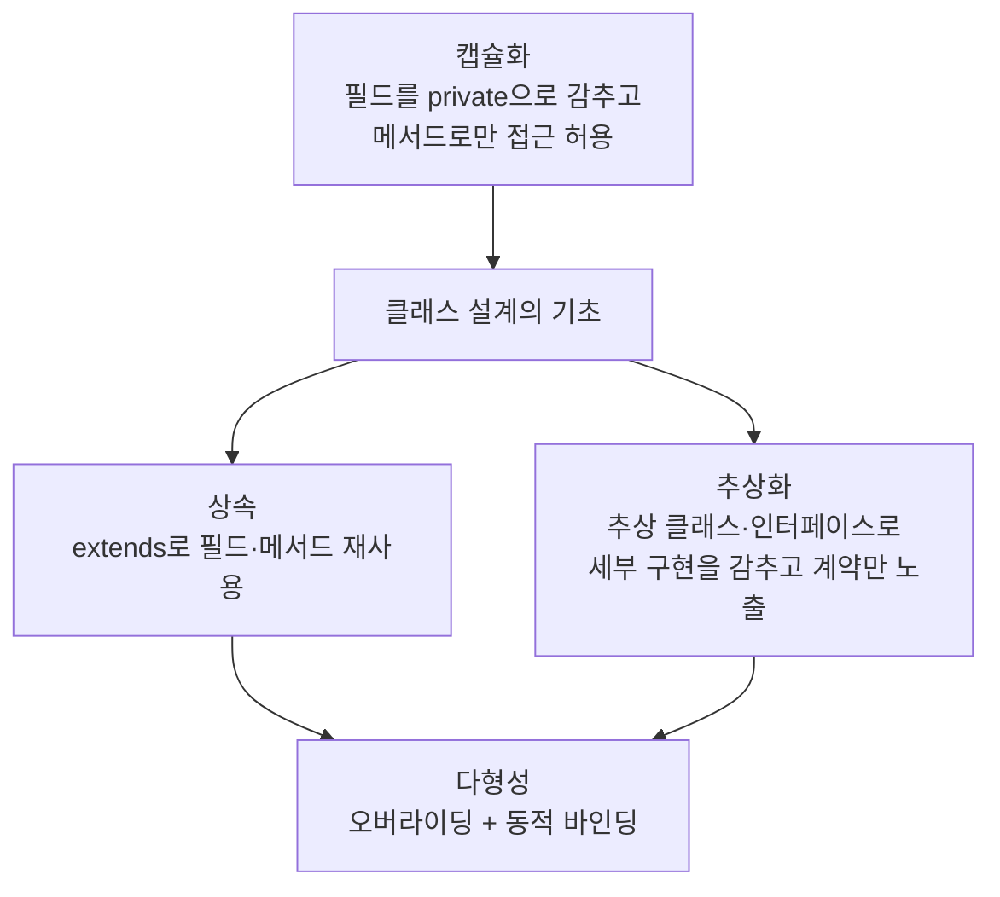

<Callout type="info">
  **이번 문서의 목표:** 이 문서를 다 읽으면 캡슐화·상속·다형성·추상화 네 가지 특성을 서로 구분해서 정의할 수 있고, 하나의 코드 예제 안에서 네 특성이 각각 어디에 나타나는지 짚어낼 수 있으며, "이 특성의 장점과 한계를 설명하라" 유형의 서술형 문제에 근거를 들어 답할 수 있다.
</Callout>

## 왜 이 편이 필요한가

03편에서 객체지향 4대 특성(캡슐화, 상속, 다형성, 추상화)을 처음 소개하고 각각을 Java의 어느 문법 요소가 담당하는지 큰 그림으로 잡았다. 이후 04~11편에서 클래스와 객체(04), 생성자와 this·super(05), 접근 제어(06), 패키지(07), 상속과 오버로딩(08), 오버라이딩과 다형성(09), 추상 클래스(10), 인터페이스(11)를 하나씩 깊게 팠다. 이 편은 그 여덟 편을 다시 모아, **네 가지 특성이 서로 어떻게 다르고 왜 함께 필요한지**를 하나의 예제로 종합한다. 독학사 시험에서는 "다음 코드에서 캡슐화가 나타난 부분을 고르라"거나 "상속과 다형성의 관계를 설명하라"처럼, 낱개 문법이 아니라 **네 특성을 서로 구분하고 연결하는 능력**을 묻는 문제가 자주 나온다. 이런 문제는 개별 편만 따로 공부해서는 대비하기 어렵고, 반드시 이렇게 한 번은 전체를 겹쳐서 봐야 한다.

> **쉽게 말하면:** 04~11편이 "각 부품을 따로 뜯어본 것"이라면, 이 편은 그 부품들을 다시 조립해서 "완성된 기계가 어떻게 굴러가는가"를 보는 편이다.

## 4대 특성 한눈에 정리

| 특성 | 한 줄 정의 | Java의 담당 문법 | 관련 편 |
|------|------------|---------------------|---------|
| 캡슐화(encapsulation) | 데이터(필드)와 그 데이터를 다루는 동작(메서드)을 하나로 묶고, 내부 상태를 숨겨 외부에서 함부로 건드리지 못하게 하는 것 | 클래스, 접근 제어자(`private`, `protected`, `public`), getter/setter | 04, 06 |
| 상속(inheritance) | 기존 클래스(부모)의 필드와 메서드를 새 클래스(자식)가 물려받아 재사용하는 것 | `extends`, `super` | 05, 08 |
| 다형성(polymorphism) | 같은 이름의 메서드 호출이 실제 객체의 종류에 따라 다르게 동작하는 것 | 오버라이딩, 오버로딩, 동적 바인딩, 업캐스팅 | 08, 09 |
| 추상화(abstraction) | 복잡한 세부 구현은 감추고, 사용자에게 꼭 필요한 부분(무엇을 할 수 있는가)만 드러내는 것 | 추상 클래스, 인터페이스 | 10, 11 |

이 네 가지는 서로 독립된 기능이 아니라 **서로를 딛고 성립하는 관계**다. 상속이 없으면 오버라이딩이 성립할 수 없으므로 다형성도 불가능하고, 추상화(추상 클래스·인터페이스)는 상속·구현 관계 위에서만 의미가 있다. 캡슐화만 유일하게 상속 없이도 단독으로 성립할 수 있는 특성이다.

> **자주 틀리는 점:** 네 특성을 완전히 독립된 병렬 항목으로 암기해서, "상속과 다형성은 무관하다"거나 "추상화는 캡슐화와 같은 것이다"처럼 관계를 잘못 설정하는 경우가 많다. 다형성은 상속(또는 인터페이스 구현) 관계를 전제로 해야 성립하고, 추상화는 정보를 숨긴다는 점에서 캡슐화와 목적이 비슷해 보이지만 **숨기는 대상이 다르다**(아래에서 자세히 비교).

## 하나의 예제로 보는 4대 특성

은행 계좌를 예로, 04~11편의 문법을 모두 모아 하나의 예제로 조립해 본다.

```java
// 추상화: 계좌라면 반드시 잔액 조회가 가능해야 한다는 "계약"만 정의
interface Accountable {
    double getBalance();
}

// 추상화 + 상속: 공통 필드·공통 동작은 구현하고, 세부 동작은 자식에게 맡긴다
abstract class BankAccount implements Accountable {
    // 캡슐화: 필드를 private으로 감춰 외부에서 직접 건드릴 수 없게 한다
    private double balance;
    private String owner;

    BankAccount(String owner, double balance) {
        this.owner = owner;
        this.balance = balance;
    }

    // 캡슐화: getter를 통해서만 잔액을 조회할 수 있게 한다
    @Override
    public double getBalance() {
        return balance;
    }

    // 캡슐화: setter 대신 검증 로직을 포함한 메서드로 상태 변경을 통제한다
    void deposit(double amount) {
        if (amount > 0) {
            balance += amount;
        }
    }

    // 추상화: 인출 수수료 계산 방식은 계좌 종류마다 다르므로 자식에게 구현을 강제한다
    abstract double withdrawFee(double amount);

    void withdraw(double amount) {
        double fee = withdrawFee(amount);
        balance -= (amount + fee);
    }
}

// 상속: BankAccount의 필드·메서드를 물려받는다
class SavingsAccount extends BankAccount {
    SavingsAccount(String owner, double balance) {
        super(owner, balance);
    }

    // 다형성: 부모의 추상 메서드를 자식마다 다르게 오버라이딩한다
    @Override
    double withdrawFee(double amount) {
        return amount * 0.01;
    }
}

class CheckingAccount extends BankAccount {
    CheckingAccount(String owner, double balance) {
        super(owner, balance);
    }

    @Override
    double withdrawFee(double amount) {
        return 500;
    }
}

public class Main {
    public static void main(String[] args) {
        // 다형성: BankAccount 타입 배열 하나로 서로 다른 자식 객체를 함께 다룬다
        BankAccount[] accounts = {
            new SavingsAccount("민수", 100000),
            new CheckingAccount("지연", 200000)
        };

        for (BankAccount acc : accounts) {
            acc.withdraw(10000);
            System.out.println("잔액: " + acc.getBalance());
        }
    }
}
```

```text
잔액: 89900.0
잔액: 189500.0
```

이 하나의 예제 안에서 네 특성이 각각 어디에 있는지 짚어 보자.

<Steps>
1. **캡슐화**: `balance`와 `owner` 필드가 `private`으로 선언되어 외부에서 직접 접근할 수 없다. 잔액을 바꾸려면 반드시 `deposit()`, `withdraw()`라는 **검증을 거친 메서드**를 통해야 한다. 06편에서 다룬 대로, 이렇게 하면 "잔액을 음수로 만드는" 같은 잘못된 상태를 원천적으로 막을 수 있다.
2. **상속**: `SavingsAccount`와 `CheckingAccount`가 `extends BankAccount`로 부모의 필드(`balance`, `owner`)와 메서드(`deposit()`, `withdraw()`, `getBalance()`)를 그대로 물려받는다. 08편에서 다룬 대로, 각 자식 클래스가 이 코드를 중복해서 작성할 필요가 없다.
3. **다형성**: `withdrawFee()`가 자식마다 다르게 오버라이딩되어 있고, `for` 루프 안의 `acc.withdraw(10000)`은 `acc`의 선언 타입(`BankAccount`)이 아니라 실제 객체 타입(`SavingsAccount` 또는 `CheckingAccount`)에 따라 다른 `withdrawFee()`가 실행된다. 09편에서 다룬 동적 바인딩이 그대로 적용된 것이다.
4. **추상화**: `Accountable` 인터페이스는 "잔액을 조회할 수 있다"는 능력만 계약으로 규정하고, `BankAccount`는 `withdrawFee()`를 추상 메서드로 남겨 "인출 수수료를 계산하는 구체적인 방법"이라는 세부 구현은 자식에게 미룬다. 10~11편에서 다룬 대로, 사용하는 쪽(`Main`)은 계좌가 내부적으로 수수료를 어떻게 계산하는지 몰라도 `withdraw()`만 호출하면 된다.
</Steps>

## 실행 결과를 변수 값 표로 추적하기

위 코드의 `main()` 실행을 한 줄씩 추적하면 다음과 같다.

| 단계 | 코드 | `민수`(SavingsAccount)의 balance | `지연`(CheckingAccount)의 balance |
|------|------|------------------------------------|--------------------------------------|
| 1 | 객체 생성 | 100000.0 | 200000.0 |
| 2 | `acc.withdraw(10000)` 호출(민수) | `withdrawFee(10000)` → `10000 * 0.01 = 100.0`, `balance -= (10000 + 100)` → 89900.0 | (변화 없음) |
| 3 | `acc.withdraw(10000)` 호출(지연) | (변화 없음) | `withdrawFee(10000)` → 정액 500, `balance -= (10000 + 500)` → 189500.0 |
| 4 | `getBalance()` 출력 | 89900.0 | 189500.0 |

이 표에서 확인할 수 있듯, 같은 `withdraw(10000)` 호출이 계좌 종류에 따라 서로 다른 수수료 계산 방식을 거치는 것이 바로 다형성이 실제로 만들어 내는 차이다.

## 캡슐화 vs 추상화 — 가장 헷갈리는 구분

시험에서 가장 자주 묻는 개념 구분이다. 둘 다 "무언가를 숨긴다"는 공통점이 있어 혼동하기 쉽지만, **숨기는 목적과 대상**이 다르다.

| 구분 | 캡슐화 | 추상화 |
|------|--------|--------|
| 숨기는 대상 | 객체의 **내부 상태**(데이터)와 그 데이터를 다루는 구현 세부사항 | 사용자에게 **불필요한 세부 구현**, 드러내는 것은 "무엇을 할 수 있는가" |
| 목적 | 잘못된 상태 변경을 막고, 내부 구현을 바꿔도 외부 코드에 영향이 없게 함 | 복잡한 시스템을 다루기 쉬운 단위(인터페이스·추상 클래스)로 단순화함 |
| Java 문법 | 접근 제어자(`private` 등), getter/setter | 추상 클래스, 인터페이스 |
| 질문으로 구분하기 | "이 값을 마음대로 바꾸지 못하게 막았는가?" | "복잡한 절차를 '무엇을 하는지'만 보이게 감췄는가?" |

위 예제로 다시 설명하면, `balance`를 `private`으로 감춘 것은 캡슐화(값을 함부로 바꾸지 못하게)이고, `Accountable` 인터페이스로 "잔액 조회가 가능하다"는 능력만 노출한 것은 추상화(복잡한 계좌 종류 차이를 감추고 공통 능력만 보이게)다. 실제로는 한 클래스 설계 안에서 두 특성이 함께 쓰이는 경우가 많으므로, "이 코드가 캡슐화다/추상화다" 하나로만 답하지 말고 **어느 부분이 어떤 목적으로 숨기는지**를 짚어서 설명해야 서술형 만점 답안이 된다.

> **쉽게 말하면:** 캡슐화는 "남이 내 물건을 함부로 만지지 못하게 자물쇠를 채우는 것"이고, 추상화는 "복잡한 기계의 내부는 안 보여주고 버튼 몇 개만 내미는 것"이다.

## 4대 특성의 장점과 한계 — 서술형 대비

독학사 서술형 문제는 "이 특성을 쓰면 무엇이 좋아지는가"뿐 아니라 "이 특성의 한계나 대가는 무엇인가"까지 묻는 경우가 있다. 균형 잡힌 답안을 위해 정리한다.

| 특성 | 장점 | 한계·대가 |
|------|------|-----------|
| 캡슐화 | 내부 구현을 바꿔도 외부 코드가 영향받지 않는다(유지보수 용이). 잘못된 상태를 막는다. | getter/setter가 늘어나면 코드량이 많아지고, 과도한 캡슐화는 오히려 필요한 정보 접근을 번거롭게 만들 수 있다. |
| 상속 | 코드 재사용, 계층적 분류로 설계가 명확해진다. | 부모 클래스를 수정하면 모든 자식 클래스에 영향이 퍼진다(취약한 기반 클래스 문제). 상속 계층이 깊어지면 코드 추적이 어려워진다. |
| 다형성 | 같은 코드로 여러 타입을 처리할 수 있어 확장에 유연하다(새 자식 클래스를 추가해도 기존 코드 수정이 최소화됨). | 실제로 어떤 메서드가 실행되는지 코드만 보고는 바로 알기 어려워, 디버깅 난이도가 올라갈 수 있다. |
| 추상화 | 복잡한 세부사항을 몰라도 공통 인터페이스만으로 사용할 수 있어 협업이 쉬워진다. | 추상화 수준을 잘못 설계하면(너무 세분화하거나 너무 뭉뚱그리면) 오히려 이해와 확장이 어려워진다. |

## 4대 특성의 관계를 그림으로

네 특성이 서로 어떤 관계로 얽혀 있는지 04~11편의 내용을 종합해 그리면 다음과 같다.



이 그림에서 확인할 것은, 캡슐화가 클래스 설계의 가장 기초적인 층에 있고, 그 위에서 상속과 추상화가 각각 "재사용"과 "계약"이라는 다른 목적으로 뻗어 나가며, 다형성은 상속과 추상화(인터페이스 구현) **양쪽 모두를 기반으로** 성립한다는 점이다.

## 자주 틀리는 점

- **다형성을 오버로딩만으로 설명하는 것.** 09편에서 다룬 대로 오버로딩은 정적 바인딩이라 "실제 객체에 따라 다르게 동작"하는 다형성의 핵심 사례가 아니다. 시험에서 다형성의 예를 들라고 하면 오버라이딩·동적 바인딩 기반 사례를 들어야 한다.
- **캡슐화를 "private을 쓰는 것"으로만 좁게 이해하는 것.** 캡슐화의 본질은 "데이터와 동작을 하나로 묶고 내부 상태를 보호하는 것"이며, `private` 필드는 그 목적을 이루는 수단 중 하나일 뿐이다.
- **추상화가 상속 없이는 절대 성립하지 않는다고 착각하는 것.** 인터페이스를 통한 추상화는 상속 관계가 없는 클래스에도 적용할 수 있다(11편).
- **네 특성 중 하나만 갖추면 "객체지향적"이라고 판단하는 것.** 예를 들어 캡슐화만 잘 되어 있고 상속·다형성·추상화가 전혀 없는 코드도 "부분적으로만 객체지향적"이라고 평가해야 한다. 독학사 서술형에서는 이런 균형 잡힌 평가가 좋은 답안으로 인정된다.

## 핵심 정리

- 캡슐화는 데이터 은닉과 접근 통제, 상속은 코드 재사용과 계층 구조, 다형성은 실행 시점의 동적 바인딩, 추상화는 세부 구현을 감추고 계약만 노출하는 것이다.
- 네 특성은 독립된 병렬 항목이 아니라 서로를 기반으로 하는 관계다. 다형성은 상속·구현 관계 위에서만 성립하고, 추상화는 상속·인터페이스 구현을 통해 실현된다.
- 캡슐화와 추상화는 둘 다 "숨긴다"는 공통점이 있지만, 캡슐화는 상태 변경 통제, 추상화는 불필요한 구현 은닉이라는 서로 다른 목적을 가진다.
- 각 특성은 장점만 있는 것이 아니라 취약한 기반 클래스 문제, 디버깅 난이도 증가 같은 대가도 함께 따른다는 점을 서술형 답안에 균형 있게 반영해야 한다.

## 마무리 복습

<Quiz
  questionNumber={1}
  question="객체지향 4대 특성에 대한 설명으로 옳지 않은 것은?"
  options={['캡슐화는 데이터와 동작을 하나로 묶고 내부 상태를 보호하는 것이다', '상속은 기존 클래스의 필드와 메서드를 재사용하는 것이다', '다형성은 클래스 상속이나 인터페이스 구현과 무관하게 독립적으로 성립하는 특성이다', '추상화는 세부 구현을 감추고 필요한 부분만 노출하는 것이다']}
  correctAnswer={3}
  explanation="다형성은 오버라이딩을 전제로 하며, 오버라이딩은 상속 또는 인터페이스 구현 관계가 있어야만 성립한다. 따라서 다형성은 상속·구현 관계와 무관하게 독립적으로 성립하지 않는다."
  optionExplanations={['캡슐화에 대한 설명은 옳다.', '상속에 대한 설명은 옳다.', '정답. 다형성은 상속 또는 인터페이스 구현 관계를 전제로 하므로 이 설명이 옳지 않다.', '추상화에 대한 설명은 옳다.']}
/>

<Quiz
  questionNumber={2}
  question="캡슐화와 추상화의 차이에 대한 설명으로 가장 적절한 것은?"
  options={['캡슐화와 추상화는 완전히 같은 개념이며 용어만 다르다', '캡슐화는 내부 상태를 보호하는 것이고, 추상화는 불필요한 세부 구현을 감추고 공통 능력만 노출하는 것이다', '캡슐화는 상속에서만, 추상화는 인터페이스에서만 나타난다', '캡슐화는 접근 제어자를 쓰지 않아도 성립하는 개념이다']}
  correctAnswer={2}
  explanation="캡슐화는 필드를 private으로 감추고 메서드로만 접근하게 하여 상태 변경을 통제하는 데 목적이 있고, 추상화는 복잡한 세부 구현을 감추고 사용자에게 필요한 공통 능력(계약)만 노출하는 데 목적이 있다."
  optionExplanations={['캡슐화와 추상화는 숨긴다는 공통점은 있지만 목적과 대상이 다른 별개의 개념이다.', '정답. 두 특성의 목적과 대상 차이를 정확히 설명한다.', '캡슐화는 상속 여부와 무관하게 단독 클래스에서도 성립할 수 있다.', '캡슐화는 보통 private 등 접근 제어자를 통해 구현된다.']}
/>

<Quiz
  questionNumber={3}
  question="BankAccount 예제에서 SavingsAccount와 CheckingAccount가 각각 withdrawFee를 다르게 오버라이딩하고, BankAccount 배열로 순회하며 withdraw를 호출했을 때 계좌마다 다른 수수료 계산이 적용되는 현상을 설명하는 특성은?"
  options={['캡슐화', '상속', '다형성', '패키지']}
  correctAnswer={3}
  explanation="같은 withdraw 호출이 실제 객체 타입에 따라 다른 withdrawFee 구현을 실행하는 것은 동적 바인딩에 기반한 다형성의 대표적인 예다."
  optionExplanations={['필드 보호와 관련된 캡슐화만으로는 이 현상을 설명할 수 없다.', '상속은 필드·메서드 재사용을 설명하지만, 실행 시점에 다르게 동작하는 이유까지는 설명하지 못한다.', '정답. 동적 바인딩에 기반해 실제 객체 타입에 따라 다르게 동작하는 것이 다형성이다.', '패키지는 클래스를 묶는 단위로 이 현상과 관련이 없다.']}
/>

<Quiz
  questionNumber={4}
  question="다음 중 다형성의 예로 가장 적절하지 않은 것은?"
  options={['부모 타입 참조 변수로 자식 객체의 오버라이딩된 메서드를 호출했을 때 자식의 동작이 실행되는 것', '인터페이스 타입 배열로 서로 다른 구현 클래스의 객체를 함께 순회하는 것', '같은 클래스 안에서 매개변수 개수가 다른 메서드를 여러 개 정의하는 것', '추상 클래스의 추상 메서드를 자식마다 다르게 구현해 실행 결과가 달라지는 것']}
  correctAnswer={3}
  explanation="매개변수 개수가 다른 메서드를 여러 개 정의하는 것은 오버로딩이며, 오버로딩은 컴파일 시점에 정적으로 결정되므로 실행 시점에 실제 객체에 따라 달라지는 다형성의 핵심 사례로 보기 어렵다."
  optionExplanations={['동적 바인딩에 의한 오버라이딩 실행은 다형성의 대표적인 예다.', '인터페이스 기반 다형성의 대표적인 예다.', '정답. 오버로딩은 정적 바인딩이므로 다형성의 핵심 사례로 적절하지 않다.', '추상 메서드의 오버라이딩에 의한 실행 결과 차이도 다형성의 예다.']}
/>

<Quiz
  questionNumber={5}
  question="상속의 한계(대가)로 서술형 답안에 쓸 수 있는 내용으로 가장 적절한 것은?"
  options={['상속은 코드 재사용을 전혀 제공하지 않는다', '부모 클래스를 수정하면 모든 자식 클래스에 영향이 퍼질 수 있다', '상속을 쓰면 다형성이 성립할 수 없다', '상속은 접근 제어자를 전혀 사용할 수 없게 만든다']}
  correctAnswer={2}
  explanation="상속 계층에서 부모 클래스를 수정하면 그 변경이 모든 자식 클래스에 전파되므로, 의도치 않은 부작용이 생길 수 있다는 점이 상속의 대표적인 한계다."
  optionExplanations={['상속의 핵심 장점이 코드 재사용이므로 이 설명은 사실과 반대다.', '정답. 부모 수정이 자식 전체에 영향을 미치는 것은 상속의 대표적인 한계로 서술형 답안에 적합하다.', '오히려 상속은 오버라이딩을 통해 다형성이 성립하는 기반이 된다.', '상속과 접근 제어자 사용 가능 여부는 무관하다.']}
/>

<Quiz
  questionNumber={6}
  question="다음 중 4대 특성의 관계에 대한 설명으로 옳은 것은?"
  options={['다형성은 캡슐화 없이는 절대 성립할 수 없다', '추상화는 상속 관계에서만 성립하고 인터페이스 구현에서는 성립하지 않는다', '캡슐화는 상속 없이도 단독 클래스에서 성립할 수 있는 특성이다', '상속이 있으면 반드시 다형성도 함께 나타난다']}
  correctAnswer={3}
  explanation="캡슐화는 필드를 private으로 감추고 메서드로 접근을 통제하는 것으로, 상속 관계가 전혀 없는 단독 클래스에서도 성립할 수 있는 특성이다."
  optionExplanations={['다형성과 캡슐화는 직접적인 전제 관계가 아니다.', '추상화는 인터페이스 구현을 통해서도 성립하므로 이 설명은 옳지 않다.', '정답. 캡슐화는 상속 여부와 무관하게 단독 클래스에서도 성립할 수 있다.', '상속 관계가 있어도 오버라이딩이 실제로 일어나지 않으면 다형성이 반드시 나타나는 것은 아니다.']}
/>

<Quiz
  questionNumber={7}
  question="다음 코드에서 캡슐화가 적용된 부분으로 가장 적절한 것은? (BankAccount 클래스는 private double balance 필드와 deposit, getBalance 메서드를 가진다)"
  options={['BankAccount가 Accountable 인터페이스를 구현한 부분', 'balance 필드를 private으로 선언하고 deposit, getBalance로만 접근을 허용한 부분', 'SavingsAccount가 BankAccount를 extends한 부분', 'withdrawFee를 자식 클래스마다 다르게 오버라이딩한 부분']}
  correctAnswer={2}
  explanation="필드를 private으로 감추고 정해진 메서드를 통해서만 상태를 읽고 쓰게 하는 것이 캡슐화의 핵심이다. 나머지 보기는 각각 추상화, 상속, 다형성에 해당한다."
  optionExplanations={['인터페이스 구현은 추상화에 해당한다.', '정답. private 필드와 접근 메서드를 통한 상태 보호가 캡슐화의 핵심이다.', '클래스 상속은 상속 특성에 해당한다.', '메서드를 자식마다 다르게 오버라이딩하는 것은 다형성에 해당한다.']}
/>

## 참고 자료

- [Oracle Java Tutorials - Object-Oriented Programming Concepts](https://docs.oracle.com/javase/tutorial/java/concepts/index.html) — 캡슐화·상속·다형성·추상화 4대 특성을 종합적으로 정리한 공식 자료.
- [Oracle - Lesson: Object-Oriented Programming](https://www.oracle.com/java/technologies/oop.html) — Java에서 4대 특성이 코드로 어떻게 구현되는지 개관한 자료.
