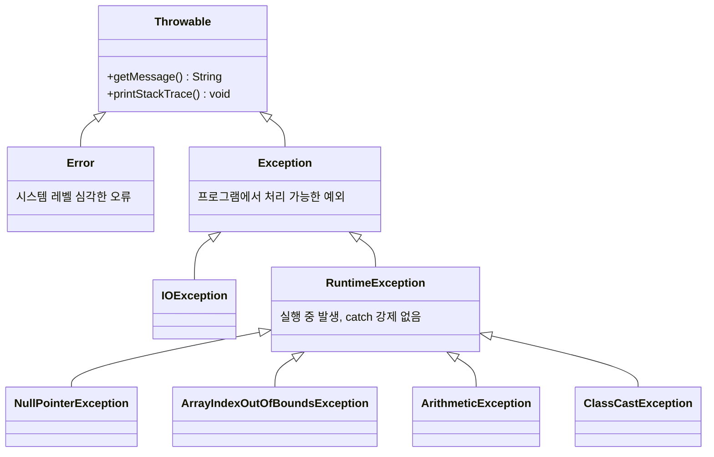

<Callout type="info">
  **이번 문서의 목표:** 이 파일을 다 읽으면 Java 예외 클래스 계층에서 어떤 예외가 checked이고 어떤 예외가 unchecked인지 그 이유까지 설명할 수 있고, try-catch-finally가 섞인 코드의 실행 순서를 한 줄씩 추적해 정확히 예측할 수 있다.
</Callout>

## 왜 이 주제가 중요한가

09편에서 다형성을 배울 때 "실행 중 문제가 생기면 프로그램이 곧바로 죽어버릴 수도 있다"는 점을 잠깐 언급했다. 배열의 범위를 넘어선 인덱스에 접근하거나, `null`인 참조 변수의 메서드를 호출하거나, 정수를 0으로 나누면 프로그램이 비정상 종료된다. 예외 처리(exception handling)는 이런 **실행 중 오류 상황을 프로그램이 직접 붙잡아, 죽지 않고 적절히 대응**하도록 만드는 문법이다.

독학사 3단계 시험에서 예외 처리는 단순 암기가 아니라 **실행 순서 추적형** 문제로 자주 나온다. try 블록 중간에서 예외가 터졌을 때 그 뒤 코드가 실행되는지, catch에서 잡은 뒤 finally가 언제 실행되는지, 여러 catch 중 어떤 것이 먼저 매칭되는지를 코드로 묻는다. 이 편에서는 예외 클래스 계층 구조부터 시작해 checked·unchecked 구분, `throws` 선언, `try-catch-finally`의 정확한 실행 순서까지 빈틈없이 다진다.

## 예외란 무엇인가: 오류 상황의 객체화

> **쉽게 말하면:** 예외(exception)는 "지금 프로그램에 문제가 생겼다"는 사실을 하나의 객체로 만들어, 코드 사이로 던지고 받을 수 있게 한 것이다.

프로그램을 실행하다 보면 컴파일러가 걸러내지 못하는 오류가 실행 중(runtime, 런타임)에 발생할 수 있다. 배열 인덱스가 범위를 벗어나거나, 파일이 존재하지 않거나, 사용자가 숫자 대신 문자를 입력했을 때가 그렇다. Java는 이런 상황을 **예외 객체**(exception object)로 표현한다. 오류가 발생한 지점에서 예외 객체를 만들어 "던지고"(throw, 스로우), 이를 처리할 수 있는 코드 블록이 "잡아서"(catch, 캐치) 대응한다.

이 방식의 장점은 오류 발생 지점과 오류 처리 지점을 **분리**할 수 있다는 점이다. 오류가 발생한 메서드가 스스로 처리 방법을 몰라도, 그 메서드를 호출한 상위 코드가 예외 객체를 넘겨받아 대신 처리할 수 있다. 이것이 뒤에서 다룰 **예외 전파**(exception propagation)의 핵심 아이디어다.

## 예외 클래스 계층: Throwable부터 시작한다

> **쉽게 말하면:** Java의 모든 예외는 결국 하나의 조상 클래스 `Throwable`에서 뻗어 나온 자손 클래스이며, 이 계층에서 어느 가지에 속하는지가 곧 그 예외의 성격을 결정한다.

08편에서 배운 상속 개념이 예외 클래스에도 그대로 적용된다. Java의 모든 예외와 오류는 `java.lang.Throwable`(스로어블, "던질 수 있는 것"이라는 뜻)이라는 최상위 클래스를 상속한다. `Throwable`은 크게 두 갈래로 나뉜다.



- **`Error`**(에러): `OutOfMemoryError`(메모리 부족), `StackOverflowError`(스택 오버플로, 재귀 호출이 너무 깊어져 호출 스택이 넘침)처럼 애플리케이션 코드가 손쓸 수 없는 심각한 시스템 레벨 문제다. 일반적으로 잡아서 처리하지 않는다.
- **`Exception`**(예외): 프로그램 로직에서 발생하며, **적절히 처리하면 프로그램을 계속 실행할 수 있는** 문제다. 시험에서 다루는 예외 처리는 사실상 이 `Exception` 계열에 집중된다.

`Exception`은 다시 **checked 예외**와 **unchecked 예외**(정확히는 `RuntimeException`과 그 자손)로 나뉘는데, 이 구분이 시험에서 가장 자주 출제되는 지점이다.

## checked 예외 vs unchecked 예외: 컴파일러가 강제하는가

> **쉽게 말하면:** checked 예외는 "너 이거 처리 안 하면 컴파일 자체를 안 시켜줄게"라고 컴파일러가 강제하는 예외이고, unchecked 예외는 처리하지 않아도 컴파일은 되지만 실행 중 문제가 될 수 있는 예외다.

이 구분은 클래스 계층상의 위치로 정해진다. `RuntimeException`(런타임익셉션)과 그 자손 클래스는 **unchecked 예외**이고, `Exception`을 상속하되 `RuntimeException`을 거치지 않는 나머지는 모두 **checked 예외**다. `Error` 계열은 checked·unchecked 구분 대상이 아니며 애초에 처리를 강제하지 않는다.

| 구분 | checked 예외 | unchecked 예외 |
|---|---|---|
| 계층상 위치 | `Exception` 직계 자손(단, `RuntimeException` 제외) | `RuntimeException`과 그 자손 |
| 컴파일러 검사 | 처리(`try-catch`)하거나 `throws`로 선언하지 않으면 **컴파일 오류** | 처리하지 않아도 **컴파일은 정상** |
| 발생 시점 성격 | 파일 없음, 네트워크 끊김처럼 **외부 환경**에 원인이 있는 경우가 많음 | 배열 범위 초과, `null` 참조처럼 **코드 논리 실수**인 경우가 많음 |
| 대표 예 | `IOException`, `ClassNotFoundException`, `SQLException` | `NullPointerException`, `ArrayIndexOutOfBoundsException`, `ArithmeticException`, `ClassCastException` |
| 설계 의도 | 호출자가 반드시 실패 가능성을 인지하고 대비하게 강제 | 애초에 코드를 고쳐서 발생하지 않도록 예방하는 것이 정석 |

```java
import java.io.FileReader;
import java.io.IOException;

public class CheckedExample {
    public static void main(String[] args) {
        try {
            FileReader reader = new FileReader("없는파일.txt");
        } catch (IOException e) {
            System.out.println("파일을 열 수 없습니다: " + e.getMessage());
        }
    }
}
```

```text
파일을 열 수 없습니다: 없는파일.txt (지정된 파일을 찾을 수 없습니다)
```

`FileReader`의 생성자는 파일이 없을 수도 있다는 사실을 `IOException`(checked 예외)으로 알린다. 이 코드에서 `try-catch`를 빼고 컴파일하면, "예외가 처리되지 않았다"는 **컴파일 오류**가 발생한다. 반면 다음 코드는 `try-catch` 없이도 컴파일이 된다.

```java
public class UncheckedExample {
    public static void main(String[] args) {
        int[] 배열 = {1, 2, 3};
        System.out.println(배열[5]);
    }
}
```

```text
Exception in thread "main" java.lang.ArrayIndexOutOfBoundsException: Index 5 out of bounds for length 3
	at UncheckedExample.main(UncheckedExample.java:4)
```

`ArrayIndexOutOfBoundsException`(배열인덱스아웃오브바운즈익셉션, 배열 인덱스가 범위를 벗어남)은 `RuntimeException`의 자손이므로 unchecked 예외다. 컴파일은 정상적으로 통과하지만, 실행하면 프로그램이 이 지점에서 즉시 종료되며 **스택 트레이스**(stack trace, 예외가 발생하기까지 호출된 메서드 목록을 역순으로 보여주는 정보)를 출력한다.

<Callout type="warning">
  시험 함정: "unchecked 예외는 발생하지 않는 예외다"라고 착각하면 안 된다. unchecked는 **컴파일러가 처리를 강제하지 않는다**는 뜻이지, 실행 중 절대 발생하지 않는다는 뜻이 아니다. 오히려 unchecked 예외는 실전에서 가장 흔하게 프로그램을 죽이는 원인이다. "옳지 않은 것 고르기" 문제에서 이 둘을 혼동시키는 선택지가 자주 나온다.
</Callout>

## throws 선언: 메서드가 예외를 넘기겠다고 미리 알리기

> **쉽게 말하면:** `throws`는 "이 메서드를 실행하다가 이런 예외가 생길 수 있으니, 나를 부르는 쪽에서 대비하라"고 메서드 선언부에 미리 적어두는 표시다.

checked 예외를 발생시킬 수 있는 코드를 작성할 때, 그 메서드 안에서 직접 `try-catch`로 처리하지 않고 **호출한 쪽에 처리 책임을 넘기고 싶다면** 메서드 선언부에 `throws 예외타입`을 적는다. 이는 04편에서 배운 메서드 시그니처의 일부로, 이 메서드를 호출하는 모든 코드는 이제 그 예외를 처리하거나 자신도 `throws`로 다시 미뤄야 한다.

```java
import java.io.IOException;
import java.io.FileReader;

public class ThrowsExample {

    static void 파일읽기(String 경로) throws IOException {
        FileReader reader = new FileReader(경로);
        System.out.println("파일을 열었습니다.");
    }

    public static void main(String[] args) {
        try {
            파일읽기("없는파일.txt");
        } catch (IOException e) {
            System.out.println("main에서 처리: " + e.getClass().getSimpleName());
        }
    }
}
```

```text
main에서 처리: FileNotFoundException
```

`파일읽기` 메서드는 `IOException`을 직접 처리하지 않고 `throws IOException`으로 호출자인 `main`에게 책임을 넘겼다. `main`은 이를 `try-catch`로 받아 처리했다. `e.getClass().getSimpleName()`은 04편에서 다룬 객체의 실제 클래스 이름을 문자열로 반환하는데, 실제로 던져진 예외는 `IOException`의 자손인 `FileNotFoundException`(파일을찾을수없음예외)이었음을 확인할 수 있다 — 이는 09편에서 배운 **동적 바인딩**과 같은 원리로, `catch (IOException e)`는 `IOException`과 그 모든 자손 타입의 예외를 함께 잡는다.

<Callout type="warning">
  시험 함정: `throws`(메서드 선언부에 붙여 "예외를 던질 수 있다"고 알리는 키워드)와 `throw`(실제로 예외 객체를 생성해 던지는 실행문, 예: `throw new Exception();`)는 철자 하나 차이지만 역할이 완전히 다르다. 단답형·빈칸 문제에서 자주 바꿔치기된다.
</Callout>

unchecked 예외에도 `throws`를 적을 수는 있지만, 컴파일러가 강제하지 않으므로 대개 생략한다. checked 예외에서만 `throws` 선언 또는 `try-catch` 처리 둘 중 하나가 **필수**라는 점이 핵심이다.

## try-catch-finally: 정확한 실행 순서

> **쉽게 말하면:** try는 "일단 해보고", catch는 "문제가 생기면 이렇게 대응하고", finally는 "성공하든 실패하든 무조건 마지막에 실행한다"는 세 단계다.

```java
public class TryCatchFinally {
    public static void main(String[] args) {
        try {
            System.out.println("1. try 시작");
            int 결과 = 10 / 0;
            System.out.println("2. 이 줄은 실행되지 않는다");
        } catch (ArithmeticException e) {
            System.out.println("3. catch: " + e.getMessage());
        } finally {
            System.out.println("4. finally: 항상 실행");
        }
        System.out.println("5. try-catch-finally 이후");
    }
}
```

```text
1. try 시작
3. catch: / by zero
4. finally: 항상 실행
5. try-catch-finally 이후
```

**한 줄씩 실행 추적**:

| 단계 | 실행 위치 | 상태 |
|---|---|---|
| 1 | `System.out.println("1. try 시작");` | 정상 출력 |
| 2 | `int 결과 = 10 / 0;` | `ArithmeticException`(산술연산예외) 발생. 정수를 0으로 나누면 이 예외가 던져진다 |
| 3 | `System.out.println("2. ...")` | **건너뜀** — 예외가 발생한 순간 try 블록의 나머지 코드는 실행되지 않고 즉시 catch로 이동 |
| 4 | `catch (ArithmeticException e)` | 예외 타입이 일치하므로 이 블록이 실행됨. `e.getMessage()`는 예외 메시지 `"/ by zero"` 반환 |
| 5 | `finally` 블록 | try 또는 catch 실행이 끝난 뒤 **예외 발생 여부와 무관하게 항상** 실행 |
| 6 | `System.out.println("5. ...")` | try-catch-finally 전체가 끝난 뒤 정상적으로 이어서 실행 |

정수 나눗셈에서 분모가 0이면 `ArithmeticException`이 발생한다는 점에 주의한다(실수 나눗셈 `10.0 / 0`은 예외 없이 `Infinity`를 반환한다 — 02편에서 다룬 자료형의 차이가 여기서도 드러난다).

### finally가 실행되지 않는다고 착각하기 쉬운 경우

`finally` 블록은 try나 catch 안에서 `return`이 있어도, JVM이 즉시 종료되는 `System.exit()`을 만나지 않는 한 **반드시 실행**된다. 이는 시험에서 실행 순서를 헷갈리게 만드는 대표적인 함정이다.

```java
public class FinallyWithReturn {

    static int 값구하기() {
        try {
            System.out.println("try 실행");
            return 1;
        } finally {
            System.out.println("finally 실행 (return 이후에도)");
        }
    }

    public static void main(String[] args) {
        int 결과 = 값구하기();
        System.out.println("결과 = " + 결과);
    }
}
```

```text
try 실행
finally 실행 (return 이후에도)
결과 = 1
```

**한 줄씩 실행 추적**: `return 1;`이 실행되면 "1을 반환하겠다"는 값이 일단 확정되지만, 메서드가 실제로 호출자에게 돌아가기 전에 **`finally` 블록이 먼저 실행**된다. `finally` 실행이 끝난 뒤에야 미리 확정해둔 값 1이 `값구하기()`의 최종 반환값으로 `main`에 전달된다.

<Callout type="warning">
  시험 함정: `finally` 블록 안에서도 `return`을 쓰면, try·catch의 `return` 값을 **무시하고 finally의 return 값으로 덮어써 버린다.** 이는 의도치 않은 버그의 흔한 원인이며, "출력 예측" 문제에서 정답을 가르는 핵심 포인트로 자주 나온다. 실무에서는 `finally`에 `return`을 넣는 것을 나쁜 관례로 본다.
</Callout>

## 예외 전파: catch가 없으면 어디까지 올라가는가

> **쉽게 말하면:** 예외를 처리할 catch를 만나지 못하면, 예외는 현재 메서드를 호출한 메서드, 그 메서드를 호출한 메서드로 계속 거슬러 올라가다가 아무도 못 잡으면 프로그램이 죽는다.

```java
public class PropagationExample {

    static void 메서드C() {
        System.out.println("메서드C 시작");
        int[] arr = new int[2];
        System.out.println(arr[5]);
        System.out.println("메서드C 끝 (실행 안 됨)");
    }

    static void 메서드B() {
        System.out.println("메서드B 시작");
        메서드C();
        System.out.println("메서드B 끝 (실행 안 됨)");
    }

    static void 메서드A() {
        System.out.println("메서드A 시작");
        try {
            메서드B();
        } catch (ArrayIndexOutOfBoundsException e) {
            System.out.println("메서드A에서 잡음: " + e.getMessage());
        }
        System.out.println("메서드A 끝");
    }

    public static void main(String[] args) {
        메서드A();
    }
}
```

```text
메서드A 시작
메서드B 시작
메서드C 시작
메서드A에서 잡음: Index 5 out of bounds for length 2
메서드A 끝
```

**한 줄씩 실행 추적**: `메서드C`에서 예외가 발생하면, `메서드C`는 그 자리에서 즉시 중단되고("메서드C 끝"은 출력되지 않음) 예외 객체가 호출자인 `메서드B`로 전달된다. `메서드B`에도 이를 처리할 `try-catch`가 없으므로 `메서드B` 역시 그 자리에서 중단되고("메서드B 끝"도 출력되지 않음) 예외는 다시 `메서드A`로 전달된다. `메서드A`에는 마침 `try-catch`가 있으므로 여기서 예외가 잡히고, 그 이후 `메서드A`의 나머지 코드("메서드A 끝")는 정상적으로 이어서 실행된다.

이 과정을 **예외 전파**(exception propagation)라 하며, 실행 중이던 메서드 호출들이 스택처럼 거슬러 올라가는 모습이 10편에서 다룬 스택 프레임의 되감기와 닮아 있다. 만약 `메서드A`에도 catch가 없었다면 예외는 `main`까지 올라가고, `main`에도 없으면 JVM이 예외를 잡아 스택 트레이스를 출력하고 프로그램을 비정상 종료시킨다.

## 자주 틀리는 점

- checked·unchecked 구분을 "심각한 정도"로 착각한다. 실제 구분 기준은 **`RuntimeException`을 상속했는가**라는 계층 구조상의 위치일 뿐, 심각성과는 무관하다.
- `throws`(선언)와 `throw`(실행)를 혼동한다. `throws`는 메서드 시그니처에, `throw`는 실행문 안에 쓴다.
- `finally`가 예외 발생 여부와 무관하게 항상 실행된다는 점을 놓치고, try에서 예외가 나면 finally를 건너뛴다고 착각한다.
- try 블록에서 예외가 발생한 줄 **이후의 코드는 실행되지 않고 즉시 catch로 넘어간다**는 사실을 놓쳐, try 블록 뒷부분의 출력문도 실행된다고 잘못 예측한다.
- 정수 나눗셈의 0 나누기(`ArithmeticException` 발생)와 실수 나눗셈의 0 나누기(예외 없이 `Infinity`)를 구분하지 못한다.

## 핵심 정리

- Java의 모든 예외는 `Throwable`을 상속하며, 크게 `Error`(시스템 레벨, 처리 대상 아님)와 `Exception`(프로그램에서 처리 가능)으로 나뉜다.
- `RuntimeException`과 그 자손은 **unchecked 예외**(컴파일러가 처리를 강제하지 않음), 그 외 `Exception` 계열은 **checked 예외**(반드시 `try-catch` 또는 `throws`로 처리해야 컴파일됨)다.
- `throws`는 메서드가 예외 처리 책임을 호출자에게 넘긴다는 선언이고, `throw`는 실제로 예외 객체를 던지는 실행문이다.
- try 블록에서 예외가 발생하면 그 지점 이후의 try 코드는 건너뛰고 곧바로 일치하는 catch로 이동하며, `finally`는 예외 발생 여부·`return` 유무와 무관하게 항상 마지막에 실행된다.
- catch를 만나지 못한 예외는 호출 스택을 거슬러 올라가며 전파되고, 아무도 잡지 못하면 JVM이 프로그램을 비정상 종료시킨다.

## 마무리 복습

<Quiz
  questionNumber={1}
  question="Java 예외 클래스 계층에 대한 설명으로 옳은 것은?"
  options={['모든 예외와 오류는 Throwable을 상속한다', 'Exception과 Error는 서로 상속 관계가 없는 별개의 최상위 클래스다', 'RuntimeException은 Exception을 상속하지 않는 독립된 계열이다', 'Error 계열도 checked 예외로 분류되어 반드시 처리해야 한다']}
  correctAnswer={1}
  explanation="Java의 모든 예외와 오류(Exception, Error 포함)는 최상위 클래스 Throwable을 상속한다. Exception과 Error는 둘 다 Throwable의 직계 자손이며, RuntimeException은 Exception의 자손이다."
  optionExplanations={['정답. Throwable이 모든 예외·오류의 뿌리다', 'Exception과 Error 모두 Throwable의 자손으로 상속 관계 안에 있다', 'RuntimeException은 Exception을 상속하는 자손 클래스다', 'Error는 checked·unchecked 구분 대상이 아니며 처리를 강제하지 않는다']}
/>

<Quiz
  questionNumber={2}
  question="checked 예외와 unchecked 예외를 구분하는 기준으로 옳은 것은?"
  options={['예외 메시지의 길이', 'RuntimeException을 상속했는지 여부', '예외가 발생하는 빈도', '예외 클래스 이름에 Exception이 포함되는지 여부']}
  correctAnswer={2}
  explanation="RuntimeException과 그 자손 클래스는 unchecked 예외이고, Exception을 상속하되 RuntimeException을 거치지 않는 나머지는 checked 예외다. 이는 순전히 클래스 계층상의 위치로 결정된다."
  optionExplanations={['메시지 길이는 구분 기준과 무관하다', '정답. RuntimeException 상속 여부가 유일한 판별 기준이다', '발생 빈도는 구분 기준이 아니다', 'RuntimeException도 이름에 Exception이 포함되지만 unchecked다']}
/>

```java
public class Q3 {
    static void m() {
        int[] a = new int[3];
        System.out.println(a[10]);
    }
    public static void main(String[] args) {
        m();
    }
}
```

<Quiz
  questionNumber={3}
  question="위 코드를 컴파일하고 실행하면 어떻게 되는가?"
  options={['컴파일 오류가 발생한다', '컴파일은 되지만 실행 중 ArrayIndexOutOfBoundsException으로 비정상 종료된다', '컴파일도 실행도 정상이며 0이 출력된다', 'm()에 throws 선언이 없어 실행 자체가 되지 않는다']}
  correctAnswer={2}
  explanation="ArrayIndexOutOfBoundsException은 RuntimeException의 자손인 unchecked 예외이므로 컴파일러가 처리를 강제하지 않는다. 따라서 컴파일은 정상적으로 통과하지만, 실행 시 배열 범위를 벗어난 접근이 일어나 예외가 발생하며 프로그램이 종료된다."
  optionExplanations={['unchecked 예외는 처리하지 않아도 컴파일 오류가 나지 않는다', '정답. 컴파일은 통과하고 실행 중 예외로 종료된다', '인덱스 10은 길이 3인 배열의 범위를 벗어나 예외가 발생한다', 'unchecked 예외에는 throws 선언이 강제되지 않는다']}
/>

<Quiz
  questionNumber={4}
  question="throws와 throw의 차이에 대한 설명으로 옳은 것은?"
  options={['throws는 실행문이고 throw는 선언부에 쓴다', 'throws는 메서드가 특정 예외를 던질 수 있음을 선언부에 알리고, throw는 실제로 예외 객체를 생성해 던지는 실행문이다', '둘 다 완전히 같은 의미이며 어느 쪽을 써도 무방하다', 'throw는 checked 예외에만, throws는 unchecked 예외에만 사용한다']}
  correctAnswer={2}
  explanation="throws는 메서드 시그니처에 붙어 이 메서드를 호출하면 특정 예외가 발생할 수 있음을 미리 알리는 선언이고, throw는 실제로 new 예외타입()으로 만든 예외 객체를 코드 실행 중에 던지는 문장이다."
  optionExplanations={['반대로 설명된 선택지다', '정답. throws는 선언, throw는 실행문이라는 역할 차이가 핵심이다', '역할이 명확히 다르므로 서로 바꿔 쓸 수 없다', '용도가 checked·unchecked로 나뉘지 않는다']}
/>

```java
public class Q5 {
    static int calc() {
        try {
            return 10;
        } finally {
            System.out.println("finally 실행");
        }
    }
    public static void main(String[] args) {
        System.out.println(calc());
    }
}
```

<Quiz
  questionNumber={5}
  question="위 코드를 실행했을 때 출력 순서로 옳은 것은?"
  options={['10이 먼저 출력되고 finally 실행이 그다음 출력된다', 'finally 실행이 먼저 출력되고 그다음 10이 출력된다', 'finally 블록은 실행되지 않고 10만 출력된다', '컴파일 오류가 발생한다']}
  correctAnswer={2}
  explanation="try 블록의 return 10;은 반환값 10을 확정하지만 메서드가 실제로 호출자에게 돌아가기 전에 finally 블록이 먼저 실행된다. finally 실행이 끝난 뒤에야 확정된 10이 반환되어 출력된다."
  optionExplanations={['finally가 return보다 먼저 실행되므로 순서가 반대다', '정답. finally는 return으로 확정된 값이 실제로 반환되기 전에 실행된다', 'finally는 return 유무와 무관하게 항상 실행된다', '문법적으로 정상적인 코드다']}
/>

```java
public class Q6 {
    public static void main(String[] args) {
        try {
            System.out.println("A");
            Object o = null;
            o.toString();
            System.out.println("B");
        } catch (NullPointerException e) {
            System.out.println("C");
        }
        System.out.println("D");
    }
}
```

<Quiz
  questionNumber={6}
  question="위 코드의 출력 결과로 옳은 것은?"
  options={['A, B, C, D', 'A, C, D', 'A, B, D', 'A, C']}
  correctAnswer={2}
  explanation="o.toString() 호출 시 o가 null이므로 NullPointerException이 발생한다. 예외 발생 즉시 try 블록 이후 코드(B 출력)는 건너뛰고 곧바로 catch로 이동해 C를 출력한 뒤, try-catch 블록을 빠져나와 D를 출력한다."
  optionExplanations={['예외 발생 지점 이후의 B는 실행되지 않는다', '정답. B는 건너뛰고 catch에서 C를 출력한 뒤 D로 이어진다', 'catch에서 C가 출력되어야 한다', 'catch 이후에도 D가 정상적으로 이어서 실행된다']}
/>

```java
public class Q7 {
    static void deep(int n) {
        if (n == 3) {
            int x = 1 / 0;
        }
        deep(n + 1);
    }
    public static void main(String[] args) {
        try {
            deep(0);
        } catch (ArithmeticException e) {
            System.out.println("잡음: " + e.getMessage());
        }
    }
}
```

<Quiz
  questionNumber={7}
  question="위 코드를 실행했을 때 일어나는 일로 옳은 것은?"
  options={['deep(3) 호출 내부에서 예외가 발생해 그 지점부터 즉시 중단되고, 예외가 호출 스택을 거슬러 올라가 main의 catch에서 잡힌다', 'deep 메서드가 재귀적으로 무한히 호출된다', 'n == 3 조건이 거짓이므로 예외가 발생하지 않는다', '예외가 deep 내부에서 자동으로 무시되고 재귀가 계속된다']}
  correctAnswer={1}
  explanation="n이 3이 되는 순간 1 / 0 연산으로 ArithmeticException이 발생한다. deep 메서드 안에는 이를 처리할 try-catch가 없으므로, 예외는 deep(3)을 호출한 deep(2), deep(1), deep(0)을 차례로 거슬러 올라가 마지막으로 main의 try-catch에서 잡힌다."
  optionExplanations={['정답. 이것이 예외 전파의 전형적인 동작이다', 'n == 3에서 예외가 발생해 그 지점에서 재귀가 중단된다', 'n이 3에 도달하면 실제로 나눗셈 예외가 발생한다', 'catch가 없는 메서드에서 예외는 자동으로 상위 호출자에게 전파된다']}
/>

## 참고 자료

- [Oracle Java Tutorials - Exceptions](https://docs.oracle.com/javase/tutorial/essential/exceptions/index.html)
- 국가평생교육진흥원 독학학위제: https://bdes.nile.or.kr
