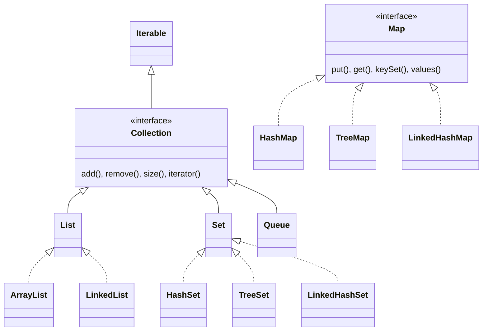

<Callout type="info">
  **이번 문서의 목표:** 이 파일을 다 읽으면 Java 컬렉션 프레임워크에서 Collection과 Map이 왜 별개의 계층으로 나뉘는지, List·Set·Map 인터페이스가 각각 어떤 계약(규칙)을 강제하는지, 그리고 주요 구현체들이 인터페이스 위에서 어떻게 자리 잡는지 전체 지도를 그릴 수 있다.
</Callout>

## 왜 이 주제가 중요한가

02편에서 배운 배열은 크기가 고정되어 있고, 저장할 수 있는 것도 값 목록뿐이었다. 실전 프로그램은 "몇 개가 들어올지 미리 알 수 없는 데이터", "중복을 자동으로 걸러야 하는 데이터", "이름표를 붙여 값을 찾는 데이터" 같은 다양한 요구를 다뤄야 한다. **컬렉션 프레임워크**(Collections Framework)는 이런 요구에 맞는 자료구조를 인터페이스와 구현체로 체계화해 제공한다.

독학사 3단계 시험에서 컬렉션은 "이 인터페이스는 어떤 특성을 강제하는가", "이 상황에는 어떤 구현체를 써야 하는가"를 묻는 문제로 자주 나온다. 이 편에서는 먼저 인터페이스 계층의 큰 그림 — `Collection`과 `Map`이 왜 별개인지, `List`·`Set`·`Map` 각각이 무엇을 보장하는지 — 을 확실히 잡고, 16편에서 각 구현체의 성능·특성 비교로 넘어간다.

## 컬렉션 프레임워크 전체 지도

> **쉽게 말하면:** 컬렉션 프레임워크는 "여러 개의 데이터를 어떻게 묶어 담을 것인가"에 대한 표준 설계도이며, 크게 순서 있는 목록(List), 중복 없는 집합(Set), 짝지어 저장하는 지도(Map) 세 갈래로 나뉜다.

컬렉션 프레임워크는 09편, 10편, 11편에서 배운 **인터페이스와 다형성**을 실전에서 가장 크게 활용하는 예다. 자료구조의 "무엇을 할 수 있는가"(계약)를 인터페이스로 정의하고, "어떻게 구현하는가"(내부 동작)는 여러 구현 클래스가 각자 다른 방식으로 채운다. 프로그래머는 대부분 인터페이스 타입으로 변수를 선언해, 나중에 구현체를 바꿔도 나머지 코드에 영향을 주지 않게 만든다.



이 지도에서 가장 먼저 확인할 것은 **`Map`이 `Collection`을 상속하지 않는다**는 점이다. `Collection`(컬렉션 인터페이스, 소문자로 시작하는 일반 명사 "collection"과 구분하기 위해 대문자로 표기)은 `List`·`Set`·`Queue`의 공통 조상이지만, `Map`은 이들과 별개의 최상위 인터페이스다.

## Collection 계열 vs Map: 왜 근본적으로 다른가

> **쉽게 말하면:** Collection 계열은 "값 하나하나를 낱개로 모아 담는 바구니"이고, Map은 "열쇠 하나에 값 하나씩 짝지어 보관하는 서랍장"이다.

이 구분이 시험에서 특히 자주 묻는 지점이다. `Collection`을 상속하는 `List`·`Set`·`Queue`는 모두 **원소(element) 하나하나**를 저장 단위로 다룬다. 반면 `Map`은 **키(key)와 값(value)의 쌍**을 저장 단위로 다룬다. 이 근본적인 차이 때문에 `Map`은 `Collection` 인터페이스의 `add(원소)` 같은 메서드를 그대로 상속받지 않고, 대신 `put(키, 값)`이라는 독자적인 메서드 체계를 가진다.

| 구분 | Collection 계열 (List, Set, Queue) | Map |
|---|---|---|
| 저장 단위 | 원소(element) 하나 | 키(key)–값(value) 쌍 |
| 대표 추가 메서드 | `add(원소)` | `put(키, 값)` |
| 대표 조회 메서드 | `get(인덱스)`(List만 해당) 또는 순회 | `get(키)` |
| 반복(순회) 방법 | `for-each`로 원소를 직접 순회 | `keySet()`, `values()`, `entrySet()`을 거쳐 순회 |
| 상속 계층 | `Iterable` → `Collection` → `List`/`Set`/`Queue` | 독립된 최상위 인터페이스 |

```java
import java.util.*;

public class CollectionVsMap {
    public static void main(String[] args) {
        List<String> 목록 = new ArrayList<>();
        목록.add("사과");
        목록.add("바나나");
        System.out.println("목록: " + 목록);

        Map<String, Integer> 재고 = new HashMap<>();
        재고.put("사과", 30);
        재고.put("바나나", 15);
        System.out.println("재고: " + 재고);
    }
}
```

```text
목록: [사과, 바나나]
재고: {사과=30, 바나나=15}
```

`목록`은 `add`로 원소만 넣고, `재고`는 `put`으로 "사과"라는 키에 30이라는 값을 짝지어 넣는다. 출력 형식도 `List`는 대괄호로 원소를 나열하고, `Map`은 중괄호 안에 `키=값` 쌍을 나열한다는 점에서 이 구조적 차이가 그대로 드러난다.

<Callout type="warning">
  시험 함정: "Map은 Collection 인터페이스를 상속한다"는 설명은 자주 나오는 오답이다. `Map`은 키–값 쌍이라는 서로 다른 저장 단위 때문에 `Collection` 계층과 **별개**로 설계되었다.
</Callout>

## List 인터페이스: 순서를 지키고 중복을 허용한다

> **쉽게 말하면:** List(리스트)는 넣은 순서를 그대로 기억하고, 같은 값을 여러 번 넣어도 다 받아준다.

`List`(리스트)는 원소에 **인덱스**(index, 배열처럼 0부터 시작하는 위치 번호)를 부여해, 넣은 순서를 그대로 유지한다. 같은 값을 중복해서 넣는 것도 허용한다. `get(인덱스)`로 특정 위치의 값을 바로 꺼낼 수 있다는 점에서 02편에서 다룬 배열과 사용 감각이 비슷하지만, **크기가 자동으로 늘어난다**는 점이 배열과 근본적으로 다르다.

```java
import java.util.*;

public class ListBasics {
    public static void main(String[] args) {
        List<String> 장바구니 = new ArrayList<>();
        장바구니.add("우유");
        장바구니.add("빵");
        장바구니.add("우유");
        System.out.println("전체: " + 장바구니);
        System.out.println("인덱스 0: " + 장바구니.get(0));
        System.out.println("크기: " + 장바구니.size());
        System.out.println("우유 개수: " + Collections.frequency(장바구니, "우유"));
    }
}
```

```text
전체: [우유, 빵, 우유]
인덱스 0: 우유
크기: 3
우유 개수: 2
```

"우유"를 두 번 넣었지만 `List`는 이를 걸러내지 않고 모두 저장했고, 넣은 순서(우유, 빵, 우유)를 그대로 유지했다. `List<String>`처럼 꺾쇠 안에 담을 타입을 지정하는 문법을 **제네릭**(generic, 컬렉션이 어떤 타입의 원소만 다룰지 컴파일 시점에 고정해 타입 안전성을 보장하는 문법)이라 하며, 이 방식 덕분에 `장바구니.get(0)`의 반환 타입이 `Object`가 아니라 `String`으로 정확히 결정되어 형변환 없이 바로 쓸 수 있다.

## Set 인터페이스: 중복을 허용하지 않는다

> **쉽게 말하면:** Set(집합)은 수학 시간에 배운 집합처럼, 같은 원소가 두 번 들어가는 것을 스스로 막아준다.

`Set`(집합)은 `List`와 반대로 **중복을 절대 허용하지 않는다**. 이미 들어 있는 값과 같은 값을 다시 `add`해도 조용히 무시되며(예외가 발생하지 않는다), 컬렉션의 크기는 늘지 않는다. 또한 `Set`은 인덱스 개념이 없으므로 `get(인덱스)` 같은 메서드를 제공하지 않는다.

```java
import java.util.*;

public class SetBasics {
    public static void main(String[] args) {
        Set<String> 참가자 = new HashSet<>();
        boolean 결과1 = 참가자.add("민수");
        boolean 결과2 = 참가자.add("영희");
        boolean 결과3 = 참가자.add("민수");
        System.out.println("민수 첫 추가: " + 결과1);
        System.out.println("영희 첫 추가: " + 결과2);
        System.out.println("민수 중복 추가: " + 결과3);
        System.out.println("최종 참가자 수: " + 참가자.size());
    }
}
```

```text
민수 첫 추가: true
영희 첫 추가: true
민수 중복 추가: false
최종 참가자 수: 2
```

**한 줄씩 실행 추적**: `add` 메서드는 `boolean`을 반환하는데, 실제로 값이 추가되면 `true`, 이미 존재해서 추가되지 않으면 `false`를 돌려준다. "민수"를 두 번째로 추가하려는 시도는 이미 집합 안에 "민수"가 있으므로 `false`를 반환하고 무시되어, 최종 크기는 2(민수, 영희)로 유지된다.

<Callout type="warning">
  시험 함정: `Set`의 `add`가 중복 시 **예외를 던진다**고 착각하기 쉽다. 실제로는 예외 없이 조용히 `false`를 반환할 뿐이며, 프로그램 흐름은 계속 이어진다.
</Callout>

`Set`의 중복 판단은 객체의 `equals()`(에퀄스, 두 객체가 논리적으로 같은지 비교하는 메서드)를 기준으로 한다는 점도 함께 기억해야 한다. `String`이나 `Integer` 같은 표준 클래스는 `equals()`가 값 비교로 이미 잘 구현되어 있어 위 예제처럼 자연스럽게 동작하지만, 사용자 정의 클래스를 `Set`에 넣을 때는 `equals()`와 `hashCode()`를 직접 재정의(오버라이딩)하지 않으면 논리적으로 같은 객체도 서로 다른 것으로 취급되어 중복이 걸러지지 않는다.

## Map 인터페이스: 키로 값을 찾는다

> **쉽게 말하면:** Map(맵)은 국어사전과 비슷하다 — 표제어(키)를 찾으면 그 뜻(값)이 바로 나온다.

`Map`(맵)은 **키의 중복은 허용하지 않지만 값의 중복은 허용**한다. 같은 키로 `put`을 다시 호출하면 기존 값을 새 값으로 **덮어쓴다**(추가되는 것이 아니다).

```java
import java.util.*;

public class MapBasics {
    public static void main(String[] args) {
        Map<String, Integer> 점수 = new HashMap<>();
        점수.put("국어", 90);
        점수.put("수학", 85);
        점수.put("국어", 95);
        System.out.println("전체: " + 점수);
        System.out.println("국어 점수: " + 점수.get("국어"));
        System.out.println("영어 점수(없는 키): " + 점수.get("영어"));
        System.out.println("키 목록: " + 점수.keySet());
    }
}
```

```text
전체: {국어=95, 수학=85}
국어 점수: 95
영어 점수(없는 키): null
키 목록: [국어, 수학]
```

**한 줄씩 실행 추적**: "국어"라는 같은 키로 `put`을 두 번 호출하면, 두 번째 호출(95)이 첫 번째 값(90)을 덮어써 최종적으로 "국어"는 95 하나만 남는다. 없는 키 "영어"를 `get`하면 예외가 발생하지 않고 `null`을 반환한다는 점도 시험에서 자주 묻는 포인트다. `keySet()`은 저장된 모든 키를 `Set` 형태로 반환하는데, **키는 절대 중복되지 않으므로** 반환 타입이 `List`가 아니라 `Set`이라는 점도 인터페이스 설계의 논리적 귀결이다.

## 주요 구현체 한눈에 보기

각 인터페이스(`List`, `Set`, `Map`)에는 서로 다른 내부 구현 방식을 가진 여러 클래스가 있다. 상세한 성능 비교와 "언제 어떤 것을 쓸까"는 16편에서 깊게 다루고, 여기서는 이름과 큰 특징만 지도로 그려둔다.

| 인터페이스 | 대표 구현체 | 핵심 특징 한 줄 요약 |
|---|---|---|
| `List` | `ArrayList` | 배열 기반. 인덱스 접근이 빠름 |
| `List` | `LinkedList` | 노드 연결 기반. 중간 삽입·삭제가 상대적으로 유리 |
| `Set` | `HashSet` | 해시 기반. 순서 보장 안 됨, 검색이 빠름 |
| `Set` | `LinkedHashSet` | 해시 기반이면서 입력 순서를 함께 기억함 |
| `Set` | `TreeSet` | 이진 탐색 트리 기반. 항상 정렬된 순서 유지 |
| `Map` | `HashMap` | 해시 기반. 순서 보장 안 됨, 검색이 빠름 |
| `Map` | `LinkedHashMap` | 해시 기반이면서 입력 순서를 함께 기억함 |
| `Map` | `TreeMap` | 이진 탐색 트리 기반. 키 기준으로 항상 정렬됨 |

```java
import java.util.*;

public class OrderComparison {
    public static void main(String[] args) {
        Set<String> 해시셋 = new HashSet<>();
        Set<String> 트리셋 = new TreeSet<>();
        for (String s : new String[]{"바나나", "사과", "체리"}) {
            해시셋.add(s);
            트리셋.add(s);
        }
        System.out.println("HashSet 순서: " + 해시셋);
        System.out.println("TreeSet 순서: " + 트리셋);
    }
}
```

```text
HashSet 순서: [바나나, 사과, 체리]
TreeSet 순서: [바나나, 사과, 체리]
```

주의할 점은 `HashSet`의 출력 순서는 **내부 해시값 계산에 따라 결정될 뿐, 입력 순서와도 정렬 순서와도 무관**하다는 사실이다(위 실행 결과는 특정 JVM 환경의 한 예시일 뿐이며 항상 같은 순서를 보장하지 않는다). 반면 `TreeSet`은 원소를 오름차순으로 항상 정렬해 유지하므로 실행할 때마다 예측 가능한 순서가 나온다. 이 차이는 16편에서 각 구현체를 언제 선택해야 하는지 판단하는 핵심 근거가 된다.

<Callout type="warning">
  시험 함정: "HashSet도 넣은 순서를 그대로 보장한다"는 설명은 틀렸다. 입력 순서를 보장하는 것은 `LinkedHashSet`이고, 정렬 순서를 보장하는 것은 `TreeSet`이다. `HashSet`과 `HashMap`은 **순서를 전혀 보장하지 않는다**.
</Callout>

## 자주 틀리는 점

- `Map`이 `Collection` 인터페이스를 상속한다고 착각한다. `Map`은 키–값 쌍을 다루는 독립된 최상위 인터페이스다.
- `Set`에 중복 값을 추가하면 예외가 발생한다고 착각한다. 실제로는 `add`가 조용히 `false`를 반환할 뿐이다.
- `Map.put()`을 이미 존재하는 키로 호출하면 값이 하나 더 추가된다고 착각한다. 실제로는 기존 값을 덮어쓴다.
- `Map.get()`에 없는 키를 넘기면 예외가 발생한다고 착각한다. 실제로는 `null`을 반환한다.
- `HashSet`·`HashMap`이 입력 순서나 정렬 순서를 보장한다고 착각한다. 순서 보장이 필요하면 `LinkedHashSet`/`LinkedHashMap`(입력 순서) 또는 `TreeSet`/`TreeMap`(정렬 순서)을 써야 한다.

## 핵심 정리

- 컬렉션 프레임워크는 `Collection`(원소 하나씩 다루는 `List`·`Set`·`Queue`의 조상)과 `Map`(키–값 쌍을 다루는 독립된 인터페이스)이라는 두 갈래로 크게 나뉜다.
- `List`는 순서를 유지하고 중복을 허용하며 인덱스로 접근한다. `Set`은 중복을 허용하지 않고 인덱스가 없다. `Map`은 키의 중복은 막지만 값의 중복은 허용하며, 같은 키로 `put`하면 값을 덮어쓴다.
- 표준 인터페이스의 대표 구현체는 `List`의 `ArrayList`/`LinkedList`, `Set`의 `HashSet`/`LinkedHashSet`/`TreeSet`, `Map`의 `HashMap`/`LinkedHashMap`/`TreeMap`이다.
- `HashSet`·`HashMap`은 순서를 보장하지 않고, `LinkedHashSet`·`LinkedHashMap`은 입력 순서를, `TreeSet`·`TreeMap`은 정렬된 순서를 보장한다.
- 각 구현체를 상세히 비교하고 상황에 맞는 선택 기준을 세우는 것은 16편에서 이어서 다룬다.

## 마무리 복습

<Quiz
  questionNumber={1}
  question="Java 컬렉션 프레임워크에서 Collection과 Map의 관계에 대한 설명으로 옳은 것은?"
  options={['Map은 Collection 인터페이스를 상속하는 자손 인터페이스다', 'Map은 Collection과 별개의 독립된 최상위 인터페이스이며, 키–값 쌍을 저장 단위로 다룬다는 점이 근본적으로 다르다', 'Collection이 Map을 상속하는 자손 인터페이스다', 'Collection과 Map은 완전히 동일한 메서드 체계를 공유한다']}
  correctAnswer={2}
  explanation="Collection은 원소 하나를 저장 단위로 다루는 List, Set, Queue의 공통 조상이고, Map은 키와 값을 짝지어 저장하는 별개의 최상위 인터페이스다. 저장 단위가 근본적으로 다르기 때문에 상속 관계로 묶이지 않는다."
  optionExplanations={['Map은 Collection의 자손이 아니라 별개의 인터페이스다', '정답. 저장 단위의 차이 때문에 Map은 Collection 계층과 독립되어 있다', '반대로 설명된 선택지이며 애초에 상속 관계 자체가 없다', 'add(원소)와 put(키, 값)처럼 메서드 체계가 서로 다르다']}
/>

```java
Set<String> s = new HashSet<>();
boolean r1 = s.add("A");
boolean r2 = s.add("B");
boolean r3 = s.add("A");
```

<Quiz
  questionNumber={2}
  question="위 코드에서 r1, r2, r3의 값으로 옳은 것은?"
  options={['r1=true, r2=true, r3=true', 'r1=true, r2=true, r3=false', 'r1=false, r2=false, r3=false', '세 번째 add에서 예외가 발생해 r3에는 값이 대입되지 않는다']}
  correctAnswer={2}
  explanation="Set의 add 메서드는 실제로 값이 새로 추가되면 true, 이미 존재해 추가되지 않으면 false를 반환한다. A와 B는 처음 추가되므로 true지만, 세 번째로 넣으려는 A는 이미 존재하므로 false를 반환하고 예외 없이 조용히 무시된다."
  optionExplanations={['세 번째 A는 중복이므로 추가되지 않아 false가 반환된다', '정답. 처음 두 값은 새로 추가되어 true, 중복된 세 번째는 false다', 'A와 B는 처음 추가되는 값이므로 true를 반환한다', 'Set의 중복 추가는 예외를 던지지 않고 false만 반환한다']}
/>

```java
Map<String, Integer> m = new HashMap<>();
m.put("apple", 10);
m.put("apple", 20);
System.out.println(m.size());
System.out.println(m.get("apple"));
```

<Quiz
  questionNumber={3}
  question="위 코드의 출력 결과로 옳은 것은?"
  options={['2와 10', '1과 20', '2와 20', '1과 30']}
  correctAnswer={2}
  explanation="같은 키 apple로 put을 두 번 호출하면 추가되는 것이 아니라 값이 덮어써진다. 따라서 크기는 여전히 1이고, apple 키에 대한 값은 마지막에 저장된 20이다."
  optionExplanations={['같은 키이므로 크기가 2로 늘지 않는다', '정답. 키가 같으면 값이 덮어써져 크기는 1, 값은 마지막 값 20이다', '값이 20으로 덮어써지므로 크기가 2가 될 수 없다', '값이 더해지는 것이 아니라 덮어써지므로 30이 될 수 없다']}
/>

<Quiz
  questionNumber={4}
  question="List, Set, Map 세 인터페이스의 특성을 짝지은 것으로 옳은 것은?"
  options={['List는 중복을 허용하지 않고, Set은 순서와 인덱스를 보장한다', 'List는 인덱스로 접근 가능하고 중복을 허용하며, Set은 중복을 허용하지 않고 인덱스가 없다', 'Map은 값(value)의 중복을 허용하지 않지만 키(key)의 중복은 허용한다', 'List, Set, Map 모두 인덱스로 원소에 접근할 수 있다']}
  correctAnswer={2}
  explanation="List는 인덱스를 통해 순서대로 원소에 접근할 수 있고 중복 값을 허용한다. Set은 중복을 허용하지 않으며 인덱스 개념 자체가 없다. Map은 반대로 키의 중복은 막고 값의 중복은 허용한다."
  optionExplanations={['List는 중복을 허용하고, Set은 인덱스를 제공하지 않는다', '정답. List는 인덱스+중복 허용, Set은 인덱스 없음+중복 불허가 핵심 특성이다', '반대로 설명되었다. 키의 중복은 막고 값의 중복은 허용한다', 'Set과 Map은 인덱스 기반 접근을 제공하지 않는다']}
/>

<Quiz
  questionNumber={5}
  question="다음 중 입력한 순서를 그대로 보장하는 구현체로 옳게 짝지어진 것은?"
  options={['HashSet, HashMap', 'TreeSet, TreeMap', 'LinkedHashSet, LinkedHashMap', 'ArrayList만 순서를 보장하고 나머지는 모두 보장하지 않는다']}
  correctAnswer={3}
  explanation="LinkedHashSet과 LinkedHashMap은 해시 기반 구현이면서도 원소가 입력된 순서를 별도로 기억해 순회 시 그대로 반환한다. HashSet, HashMap은 순서를 보장하지 않고, TreeSet, TreeMap은 입력 순서가 아니라 정렬된 순서를 보장한다."
  optionExplanations={['HashSet, HashMap은 순서를 전혀 보장하지 않는다', 'TreeSet, TreeMap은 입력 순서가 아니라 정렬 순서를 보장한다', '정답. Linked가 붙은 두 구현체가 입력 순서를 기억한다', 'ArrayList 외에도 LinkedHashSet, LinkedHashMap이 순서를 보장한다']}
/>

```java
Map<String, Integer> m = new HashMap<>();
m.put("x", 1);
System.out.println(m.get("y"));
```

<Quiz
  questionNumber={6}
  question="위 코드에서 존재하지 않는 키 'y'로 get()을 호출했을 때 결과로 옳은 것은?"
  options={['NoSuchElementException 예외가 발생한다', 'null이 반환되어 그대로 출력된다', '자동으로 0이 반환된다', '컴파일 오류가 발생한다']}
  correctAnswer={2}
  explanation="Map의 get()은 존재하지 않는 키를 조회해도 예외를 던지지 않고 null을 반환한다. Integer는 기본형이 아닌 참조 타입이므로 null을 그대로 담을 수 있고, println은 이를 문자열 null로 출력한다."
  optionExplanations={['Map.get()은 없는 키에 대해 예외를 던지지 않는다', '정답. 존재하지 않는 키를 조회하면 null이 반환된다', '기본값 0이 자동으로 반환되지 않는다', '문법적으로 정상적인 호출이다']}
/>

## 참고 자료

- [Oracle Java Tutorials - Collections Framework](https://docs.oracle.com/javase/tutorial/collections/index.html)
- 국가평생교육진흥원 독학학위제: https://bdes.nile.or.kr
