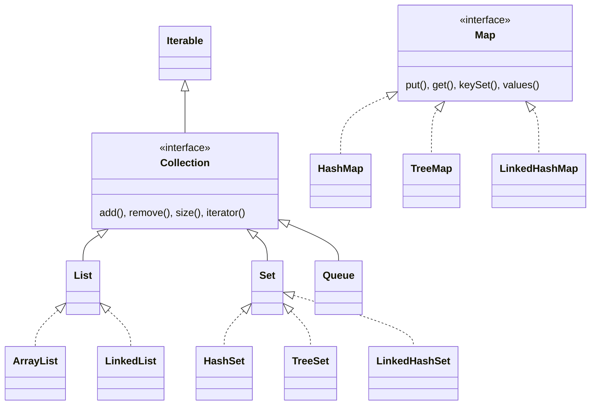

## 컬렉션 프레임워크 전체 지도

컬렉션 프레임워크는 08편, 09편, 10편에서 배운 **인터페이스와 다형성**을 실전에서 가장 크게 활용하는 예다. 자료구조의 "무엇을 할 수 있는가"(계약)를 인터페이스로 정의하고, "어떻게 구현하는가"(내부 동작)는 여러 구현 클래스가 각자 다른 방식으로 채운다.


```mermaid
classDiagram
    Iterable <|-- Collection
    Collection <|-- List
    Collection <|-- Set
    Collection <|-- Queue
    List <|.. ArrayList
    List <|.. LinkedList
    Set <|.. HashSet
    Set <|.. TreeSet
    Set <|.. LinkedHashSet
    Map <|.. HashMap
    Map <|.. TreeMap
    Map <|.. LinkedHashMap
    class Collection {
        <<interface>>
        add(), remove(), size(), iterator()
    }
    class Map {
        <<interface>>
        put(), get(), keySet(), values()
    }
```

이 지도에서 가장 먼저 확인할 것은 **`Map`이 `Collection`을 상속하지 않는다**는 점이다. `Collection`(컬렉션 인터페이스, 소문자로 시작하는 일반 명사 "collection"과 구분하기 위해 대문자로 표기)은 `List`·`Set`·`Queue`의 공통 조상이지만, `Map`은 이들과 별개의 최상위 인터페이스다.

## Collection 계열 vs Map: 왜 근본적으로 다른가

이 구분이 시험에서 특히 자주 묻는 지점이다. `Collection`을 상속하는 `List`·`Set`·`Queue`는 모두 **원소(element) 하나하나**를 저장 단위로 다룬다.

| 구분 | Collection 계열 (List, Set, Queue) | Map |
|---|---|---|
| 저장 단위 | 원소(element) 하나 | 키(key)–값(value) 쌍 |
| 대표 추가 메서드 | `add(원소)` | `put(키, 값)` |
| 대표 조회 메서드 | `get(인덱스)`(List만 해당) 또는 순회 | `get(키)` |
| 반복(순회) 방법 | `for-each`로 원소를 직접 순회 | `keySet()`, `values()`, `entrySet()`을 거쳐 순회 |
| 상속 계층 | `Iterable` → `Collection` → `List`/`Set`/`Queue` | 독립된 최상위 인터페이스 |

```java
import java.util.*;

public class CollectionVsMap {
    public static void main(String[] args) {
        List<String> 목록 = new ArrayList<>();
        목록.add("사과");
        목록.add("바나나");
        System.out.println("목록: " + 목록);

        Map<String, Integer> 재고 = new HashMap<>();
        재고.put("사과", 30);
        재고.put("바나나", 15);
        System.out.println("재고: " + 재고);
    }
}
```

```text
목록: [사과, 바나나]
재고: {사과=30, 바나나=15}
```

`목록`은 `add`로 원소만 넣고, `재고`는 `put`으로 "사과"라는 키에 30이라는 값을 짝지어 넣는다. 출력 형식도 `List`는 대괄호로 원소를 나열하고, `Map`은 중괄호 안에 `키=값` 쌍을 나열한다는 점에서 이 구조적 차이가 그대로 드러난다.

<Callout type="warning">
  시험 함정: "Map은 Collection 인터페이스를 상속한다"는 설명은 자주 나오는 오답이다. `Map`은 키–값 쌍이라는 서로 다른 저장 단위 때문에 `Collection` 계층과 **별개**로 설계되었다.
</Callout>

## List 인터페이스: 순서를 지키고 중복을 허용한다

`List`(리스트)는 원소에 **인덱스**(index, 배열처럼 0부터 시작하는 위치 번호)를 부여해, 넣은 순서를 그대로 유지한다. `get(인덱스)`로 특정 위치의 값을 바로 꺼낼 수 있다는 점에서 01편에서 다룬 배열과 사용 감각이 비슷하지만, **크기가 자동으로 늘어난다**는 점이 배열과 근본적으로 다르다.

```java
import java.util.*;

public class ListBasics {
    public static void main(String[] args) {
        List<String> 장바구니 = new ArrayList<>();
        장바구니.add("우유");
        장바구니.add("빵");
        장바구니.add("우유");
        System.out.println("전체: " + 장바구니);
        System.out.println("인덱스 0: " + 장바구니.get(0));
        System.out.println("크기: " + 장바구니.size());
        System.out.println("우유 개수: " + Collections.frequency(장바구니, "우유"));
    }
}
```

```text
전체: [우유, 빵, 우유]
인덱스 0: 우유
크기: 3
우유 개수: 2
```

"우유"를 두 번 넣었지만 `List`는 이를 걸러내지 않고 모두 저장했고, 넣은 순서(우유, 빵, 우유)를 그대로 유지했다. `List<String>`처럼 꺾쇠 안에 담을 타입을 지정하는 문법을 **제네릭**(generic, 컬렉션이 어떤 타입의 원소만 다룰지 컴파일 시점에 고정해 타입 안전성을 보장하는 문법)이라 하며, 이 방식 덕분에 `장바구니.get(0)`의 반환 타입이 `Object`가 아니라 `String`으로 정확히 결정되어 형변환 없이 바로 쓸 수 있다.

## Set 인터페이스: 중복을 허용하지 않는다

`Set`(집합)은 `List`와 반대로 **중복을 절대 허용하지 않는다**. 이미 들어 있는 값과 같은 값을 다시 `add`해도 조용히 무시되며(예외가 발생하지 않는다), 컬렉션의 크기는 늘지 않는다. 또한 `Set`은 인덱스 개념이 없으므로 `get(인덱스)` 같은 메서드를 제공하지 않는다.

```java
import java.util.*;

public class SetBasics {
    public static void main(String[] args) {
        Set<String> 참가자 = new HashSet<>();
        boolean 결과1 = 참가자.add("민수");
        boolean 결과2 = 참가자.add("영희");
        boolean 결과3 = 참가자.add("민수");
        System.out.println("민수 첫 추가: " + 결과1);
        System.out.println("영희 첫 추가: " + 결과2);
        System.out.println("민수 중복 추가: " + 결과3);
        System.out.println("최종 참가자 수: " + 참가자.size());
    }
}
```

```text
민수 첫 추가: true
영희 첫 추가: true
민수 중복 추가: false
최종 참가자 수: 2
```

**한 줄씩 실행 추적**: `add` 메서드는 `boolean`을 반환하는데, 실제로 값이 추가되면 `true`, 이미 존재해서 추가되지 않으면 `false`를 돌려준다. "민수"를 두 번째로 추가하려는 시도는 이미 집합 안에 "민수"가 있으므로 `false`를 반환하고 무시되어, 최종 크기는 2(민수, 영희)로 유지된다.

<Callout type="warning">
  시험 함정: `Set`의 `add`가 중복 시 **예외를 던진다**고 착각하기 쉽다. 실제로는 예외 없이 조용히 `false`를 반환할 뿐이며, 프로그램 흐름은 계속 이어진다.
</Callout>

`Set`의 중복 판단은 객체의 `equals()`(에퀄스, 두 객체가 논리적으로 같은지 비교하는 메서드)를 기준으로 한다는 점도 함께 기억해야 한다. `String`이나 `Integer` 같은 표준 클래스는 `equals()`가 값 비교로 이미 잘 구현되어 있어 위 예제처럼 자연스럽게 동작하지만, 사용자 정의 클래스를 `Set`에 넣을 때는 `equals()`와 `hashCode()`를 직접 재정의(오버라이딩)하지 않으면 논리적으로 같은 객체도 서로 다른 것으로 취급되어 중복이 걸러지지 않는다.

## Map 인터페이스: 키로 값을 찾는다

`Map`(맵)은 **키의 중복은 허용하지 않지만 값의 중복은 허용**한다. 같은 키로 `put`을 다시 호출하면 기존 값을 새 값으로 **덮어쓴다**(추가되는 것이 아니다).

```java
import java.util.*;

public class MapBasics {
    public static void main(String[] args) {
        Map<String, Integer> 점수 = new HashMap<>();
        점수.put("국어", 90);
        점수.put("수학", 85);
        점수.put("국어", 95);
        System.out.println("전체: " + 점수);
        System.out.println("국어 점수: " + 점수.get("국어"));
        System.out.println("영어 점수(없는 키): " + 점수.get("영어"));
        System.out.println("키 목록: " + 점수.keySet());
    }
}
```

```text
전체: {국어=95, 수학=85}
국어 점수: 95
영어 점수(없는 키): null
키 목록: [국어, 수학]
```

**한 줄씩 실행 추적**: "국어"라는 같은 키로 `put`을 두 번 호출하면, 두 번째 호출(95)이 첫 번째 값(90)을 덮어써 최종적으로 "국어"는 95 하나만 남는다. 없는 키 "영어"를 `get`하면 예외가 발생하지 않고 `null`을 반환한다는 점도 시험에서 자주 묻는 포인트다.

## 주요 구현체 한눈에 보기

각 인터페이스(`List`, `Set`, `Map`)에는 서로 다른 내부 구현 방식을 가진 여러 클래스가 있다. 상세한 성능 비교와 "언제 어떤 것을 쓸까"는 15편에서 깊게 다루고, 여기서는 이름과 큰 특징만 지도로 그려둔다.

| 인터페이스 | 대표 구현체 | 핵심 특징 한 줄 요약 |
|---|---|---|
| `List` | `ArrayList` | 배열 기반. 인덱스 접근이 빠름 |
| `List` | `LinkedList` | 노드 연결 기반. 중간 삽입·삭제가 상대적으로 유리 |
| `Set` | `HashSet` | 해시 기반. 순서 보장 안 됨, 검색이 빠름 |
| `Set` | `LinkedHashSet` | 해시 기반이면서 입력 순서를 함께 기억함 |
| `Set` | `TreeSet` | 이진 탐색 트리 기반. 항상 정렬된 순서 유지 |
| `Map` | `HashMap` | 해시 기반. 순서 보장 안 됨, 검색이 빠름 |
| `Map` | `LinkedHashMap` | 해시 기반이면서 입력 순서를 함께 기억함 |
| `Map` | `TreeMap` | 이진 탐색 트리 기반. 키 기준으로 항상 정렬됨 |

```java
import java.util.*;

public class OrderComparison {
    public static void main(String[] args) {
        Set<String> 해시셋 = new HashSet<>();
        Set<String> 트리셋 = new TreeSet<>();
        for (String s : new String[]{"바나나", "사과", "체리"}) {
            해시셋.add(s);
            트리셋.add(s);
        }
        System.out.println("HashSet 순서: " + 해시셋);
        System.out.println("TreeSet 순서: " + 트리셋);
    }
}
```

```text
HashSet 순서: [바나나, 사과, 체리]
TreeSet 순서: [바나나, 사과, 체리]
```

주의할 점은 `HashSet`의 출력 순서는 **내부 해시값 계산에 따라 결정될 뿐, 입력 순서와도 정렬 순서와도 무관**하다는 사실이다(위 실행 결과는 특정 JVM 환경의 한 예시일 뿐이며 항상 같은 순서를 보장하지 않는다). 반면 `TreeSet`은 원소를 오름차순으로 항상 정렬해 유지하므로 실행할 때마다 예측 가능한 순서가 나온다.

<Callout type="warning">
  시험 함정: "HashSet도 넣은 순서를 그대로 보장한다"는 설명은 틀렸다. 입력 순서를 보장하는 것은 `LinkedHashSet`이고, 정렬 순서를 보장하는 것은 `TreeSet`이다. `HashSet`과 `HashMap`은 **순서를 전혀 보장하지 않는다**.
</Callout>

## 자주 틀리는 점

- `Map`이 `Collection` 인터페이스를 상속한다고 착각한다. `Map`은 키–값 쌍을 다루는 독립된 최상위 인터페이스다.
- `Set`에 중복 값을 추가하면 예외가 발생한다고 착각한다. 실제로는 `add`가 조용히 `false`를 반환할 뿐이다.
- `Map.put()`을 이미 존재하는 키로 호출하면 값이 하나 더 추가된다고 착각한다. 실제로는 기존 값을 덮어쓴다.
- `Map.get()`에 없는 키를 넘기면 예외가 발생한다고 착각한다. 실제로는 `null`을 반환한다.

## 핵심 정리

- 컬렉션 프레임워크는 `Collection`(원소 하나씩 다루는 `List`·`Set`·`Queue`의 조상)과 `Map`(키–값 쌍을 다루는 독립된 인터페이스)이라는 두 갈래로 크게 나뉜다.
- `List`는 순서를 유지하고 중복을 허용하며 인덱스로 접근한다. `Set`은 중복을 허용하지 않고 인덱스가 없다. `Map`은 키의 중복은 막지만 값의 중복은 허용하며, 같은 키로 `put`하면 값을 덮어쓴다.
- 표준 인터페이스의 대표 구현체는 `List`의 `ArrayList`/`LinkedList`, `Set`의 `HashSet`/`LinkedHashSet`/`TreeSet`, `Map`의 `HashMap`/`LinkedHashMap`/`TreeMap`이다.
- `HashSet`·`HashMap`은 순서를 보장하지 않고, `LinkedHashSet`·`LinkedHashMap`은 입력 순서를, `TreeSet`·`TreeMap`은 정렬된 순서를 보장한다.
- 각 구현체를 상세히 비교하고 상황에 맞는 선택 기준을 세우는 것은 15편에서 이어서 다룬다.

## 마무리 복습

<Quiz
  questionNumber={1}
  question={"Java 컬렉션 프레임워크에서 Collection과 Map의 관계에 대한 설명으로 옳은 것은?"}
  options={["Map은 Collection 인터페이스를 상속하는 자손 인터페이스다","Map은 Collection과 별개의 독립된 최상위 인터페이스이며, 키–값 쌍을 저장 단위로 다룬다는 점이 근본적으로 다르다","Collection이 Map을 상속하는 자손 인터페이스다","Collection과 Map은 완전히 동일한 메서드 체계를 공유한다"]}
  correctAnswer={2}
  explanation={"Collection은 원소 하나를 저장 단위로 다루는 List, Set, Queue의 공통 조상이고, Map은 키와 값을 짝지어 저장하는 별개의 최상위 인터페이스다. 저장 단위가 근본적으로 다르기 때문에 상속 관계로 묶이지 않는다."}
/>

<Quiz
  questionNumber={2}
  question={"위 코드에서 r1, r2, r3의 값으로 옳은 것은?"}
  options={["r1=true, r2=true, r3=true","r1=true, r2=true, r3=false","r1=false, r2=false, r3=false","세 번째 add에서 예외가 발생해 r3에는 값이 대입되지 않는다"]}
  correctAnswer={2}
  explanation={"Set의 add 메서드는 실제로 값이 새로 추가되면 true, 이미 존재해 추가되지 않으면 false를 반환한다. A와 B는 처음 추가되므로 true지만, 세 번째로 넣으려는 A는 이미 존재하므로 false를 반환하고 예외 없이 조용히 무시된다."}
/>

<Quiz
  questionNumber={3}
  question={"위 코드의 출력 결과로 옳은 것은?"}
  options={["2와 10","1과 20","2와 20","1과 30"]}
  correctAnswer={2}
  explanation={"같은 키 apple로 put을 두 번 호출하면 추가되는 것이 아니라 값이 덮어써진다. 따라서 크기는 여전히 1이고, apple 키에 대한 값은 마지막에 저장된 20이다."}
/>

## 참고 자료

- [Oracle Java Tutorials - Collections Framework](https://docs.oracle.com/javase/tutorial/collections/index.html)
- 국가평생교육진흥원 독학학위제: https://bdes.nile.or.kr
