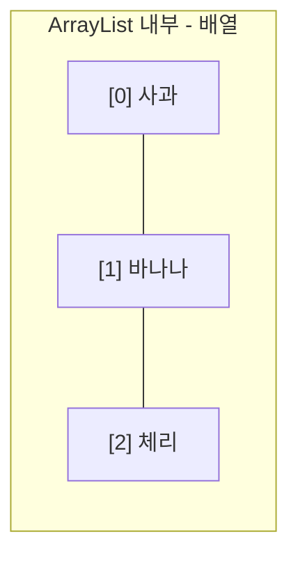
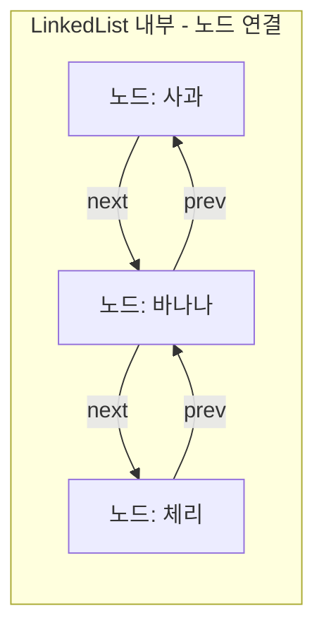
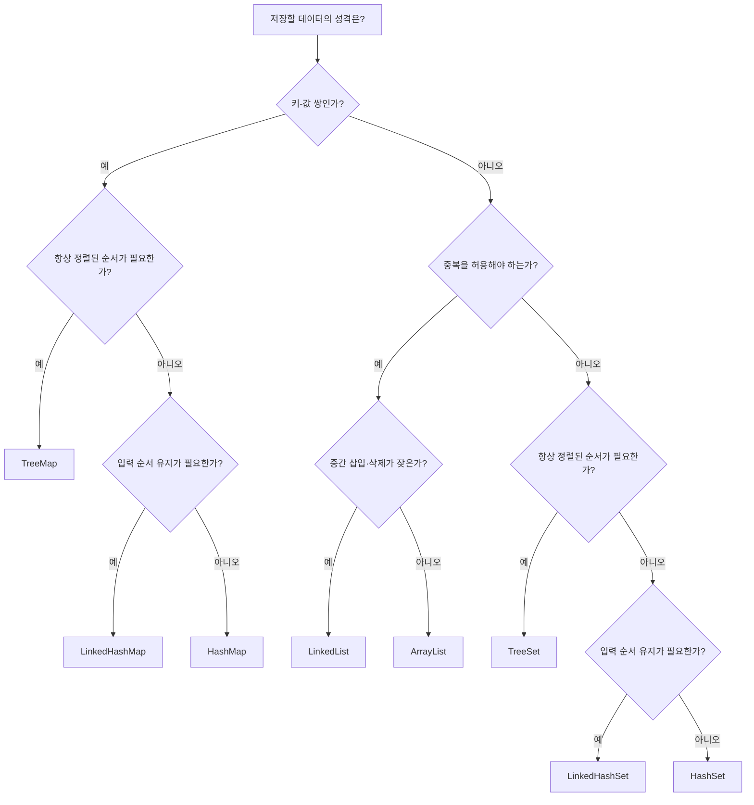

<Callout type="info">
  **이번 문서의 목표:** 이 파일을 다 읽으면 ArrayList와 LinkedList 중 어느 쪽이 특정 연산에 유리한지 내부 구조로 설명할 수 있고, 주어진 요구사항(순서·중복·정렬·검색 속도)에 맞는 컬렉션 구현체를 근거를 들어 선택할 수 있다.
</Callout>

## 왜 이 주제가 중요한가

15편에서 `List`·`Set`·`Map` 인터페이스가 각각 어떤 계약을 강제하는지 정리했다. 그런데 같은 인터페이스라도 구현체에 따라 내부 동작 방식이 전혀 다르고, 이 차이가 실행 속도에 직접 영향을 준다. 독학사 시험은 "이 상황에는 어떤 컬렉션을 쓰는 것이 적절한가"를 묻는 유형이 자주 나오는데, 정답을 고르려면 **왜 그 구현체가 그 상황에 유리한지 내부 구조로 설명할 수 있어야** 한다. 이 편에서는 `ArrayList` vs `LinkedList`, `HashSet` vs `TreeSet`, `HashMap` vs `TreeMap`을 내부 구조부터 비교하고, 컬렉션 선택 판단 흐름을 정리한다.

## ArrayList vs LinkedList: 배열이냐 연결이냐

> **쉽게 말하면:** ArrayList는 크기가 자동으로 늘어나는 배열이고, LinkedList는 기차 칸처럼 앞뒤 칸의 위치만 알고 있는 노드들이 사슬처럼 연결된 구조다.

`ArrayList`(배열리스트)는 내부적으로 **배열**을 사용한다. 원소를 추가하다가 배열이 꽉 차면, 더 큰 배열을 새로 만들어 기존 원소를 전부 복사하는 방식으로 크기를 늘린다. 이 내부 구조 때문에 `get(인덱스)`로 특정 위치의 값을 읽는 것은 배열 인덱싱 한 번으로 바로 접근할 수 있어 매우 빠르다. 반면 리스트 **중간**에 원소를 끼워 넣거나 빼려면, 그 뒤에 있는 모든 원소를 한 칸씩 밀거나 당겨야 한다.

`LinkedList`(연결리스트)는 내부적으로 각 원소를 별도의 **노드**(node) 객체로 감싸고, 각 노드가 "다음 노드"와 "이전 노드"의 참조(04편에서 배운 객체 참조)만 갖고 있는 구조다. 특정 인덱스의 값을 읽으려면 첫 노드부터 하나씩 따라가야 하므로 `ArrayList`보다 느리지만, 이미 위치를 알고 있는 노드 앞뒤에 새 노드를 끼워 넣거나 빼는 것은 그 노드의 참조 몇 개만 바꾸면 되므로 상대적으로 유리하다.





```java
import java.util.*;

public class ArrayListVsLinkedList {
    public static void main(String[] args) {
        List<String> arrayList = new ArrayList<>(List.of("A", "B", "C", "D"));
        List<String> linkedList = new LinkedList<>(List.of("A", "B", "C", "D"));

        arrayList.add(2, "X");
        linkedList.add(2, "X");

        System.out.println("ArrayList: " + arrayList);
        System.out.println("LinkedList: " + linkedList);
    }
}
```

```text
ArrayList: [A, B, X, C, D]
LinkedList: [A, B, X, C, D]
```

두 코드 모두 `List` 인터페이스의 `add(인덱스, 값)`를 호출했으므로 **최종 결과는 동일**하다. 인터페이스가 같은 계약을 강제하기 때문이다. 하지만 내부적으로 일어나는 일은 다르다 — `ArrayList`는 인덱스 2 이후의 원소들(C, D)을 배열 안에서 한 칸씩 뒤로 밀어야 하고, `LinkedList`는 인덱스 2에 해당하는 노드를 찾아간 뒤 그 앞뒤 참조만 조정하면 된다. 원소 개수가 많고 삽입 위치가 앞쪽이나 중간일수록 이 차이는 실행 속도로 뚜렷하게 나타난다.

| 연산 | ArrayList | LinkedList | 이유 |
|---|---|---|---|
| 인덱스로 조회(`get`) | 빠름 | 상대적으로 느림 | 배열은 인덱스 계산만으로 바로 접근, 연결 리스트는 처음부터 따라가야 함 |
| 끝에 추가(`add`) | 대체로 빠름(가끔 배열 재할당 발생) | 빠름 | 배열은 꽉 찼을 때만 복사 비용 발생, 연결 리스트는 항상 참조만 연결 |
| 중간 삽입·삭제 | 느림 | 상대적으로 빠름 | 배열은 뒤 원소를 전부 밀어야 함, 연결 리스트는 참조만 바꾸면 됨 |
| 메모리 사용 | 상대적으로 적음(값만 저장) | 상대적으로 많음(값 + 앞뒤 참조 2개씩 추가 저장) | 노드마다 참조 필드가 추가로 필요 |

<Callout type="warning">
  시험 함정: "LinkedList가 항상 ArrayList보다 빠르다"거나 "ArrayList가 항상 LinkedList보다 빠르다"는 절대적 진술은 둘 다 틀렸다. **어떤 연산이냐에 따라** 유리한 쪽이 달라진다는 것이 핵심이며, 조회가 많으면 `ArrayList`, 중간 삽입·삭제가 잦으면 `LinkedList`가 유리하다는 **상대적** 비교로 기억해야 한다.
</Callout>

## HashSet vs TreeSet: 해시냐 정렬이냐

> **쉽게 말하면:** HashSet은 값을 빠르게 찾기 위해 순서를 포기한 집합이고, TreeSet은 항상 정렬된 순서를 유지하는 대신 약간의 속도를 양보한 집합이다.

`HashSet`(해시셋)은 각 원소의 `hashCode()`(해시코드, 객체를 정수로 요약한 값) 값을 이용해 데이터를 저장할 위치를 계산한다. 이 방식 덕분에 특정 값이 집합에 있는지 확인하는 `contains()` 연산이 원소 개수와 거의 무관하게 빠르다. 그 대가로 원소가 저장되는 순서는 해시값 계산 결과에 좌우되어 예측할 수 없다.

`TreeSet`(트리셋)은 내부적으로 **이진 탐색 트리**(binary search tree, 각 노드가 왼쪽 자식보다 크고 오른쪽 자식보다 작은 값을 갖도록 정렬해 저장하는 트리 구조) 계열의 자료구조를 사용해, 원소를 넣는 즉시 정렬된 위치에 자리 잡는다. `contains()`도 트리를 타고 내려가며 찾으므로 `HashSet`보다는 느리지만 원소 개수 대비 여전히 효율적이며, 대신 항상 오름차순으로 정렬된 상태를 유지한다는 큰 장점이 있다.

```java
import java.util.*;

public class HashSetVsTreeSet {
    public static void main(String[] args) {
        Set<Integer> hashSet = new HashSet<>();
        Set<Integer> treeSet = new TreeSet<>();
        int[] 입력값 = {50, 10, 30, 20, 40};
        for (int v : 입력값) {
            hashSet.add(v);
            treeSet.add(v);
        }
        System.out.println("HashSet: " + hashSet);
        System.out.println("TreeSet: " + treeSet);
        System.out.println("TreeSet 최솟값: " + ((TreeSet<Integer>) treeSet).first());
        System.out.println("TreeSet 최댓값: " + ((TreeSet<Integer>) treeSet).last());
    }
}
```

```text
HashSet: [50, 20, 40, 10, 30]
TreeSet: [10, 20, 30, 40, 50]
TreeSet 최솟값: 10
TreeSet 최댓값: 50
```

`hashSet`은 입력 순서(50, 10, 30, 20, 40)와도 다르고 정렬된 순서와도 다른, 내부 해시 계산에 따른 임의의 순서로 출력된다(정수는 `Integer`의 `hashCode()`가 자기 자신의 값을 그대로 반환하지만, 저장 위치는 내부 버킷 배열의 크기에 따라 재배치되므로 겉보기엔 순서가 뒤섞인다). 반면 `treeSet`은 항상 오름차순으로 정렬되어 있으므로, "가장 작은 값"과 "가장 큰 값"을 트리의 맨 왼쪽·맨 오른쪽 끝에서 바로 얻는 `first()`/`last()` 같은 메서드를 추가로 제공한다.

| 비교 항목 | HashSet | TreeSet |
|---|---|---|
| 내부 구조 | 해시 테이블 | 이진 탐색 트리 계열 |
| 저장 순서 | 보장 안 됨 | 항상 정렬된 순서 |
| `contains()`(포함 여부 확인) 속도 | 매우 빠름 | 빠름(HashSet보다는 느림) |
| 정렬 관련 추가 기능 | 없음 | `first()`, `last()`, 범위 조회 등 |
| 사용 시나리오 | 중복만 없으면 되고 순서는 무관할 때 | 항상 정렬된 순서로 순회하거나 최솟값·최댓값이 필요할 때 |

## HashMap vs TreeMap: Set의 구분이 Map에도 그대로 적용된다

> **쉽게 말하면:** HashMap과 TreeMap의 차이는 HashSet과 TreeSet의 차이와 완전히 같은 논리이며, 다만 비교와 정렬의 기준이 "값"이 아니라 "키"라는 점만 다르다.

`HashMap`은 키를 기준으로 해시 테이블에 저장해 `get(키)`이 매우 빠르고, `TreeMap`은 키를 기준으로 정렬된 트리에 저장해 항상 키의 오름차순으로 순회할 수 있다.

```java
import java.util.*;

public class HashMapVsTreeMap {
    public static void main(String[] args) {
        Map<String, Integer> hashMap = new HashMap<>();
        Map<String, Integer> treeMap = new TreeMap<>();
        String[] 학생 = {"철수", "영희", "민수"};
        int[] 점수 = {80, 95, 70};
        for (int i = 0; i < 학생.length; i++) {
            hashMap.put(학생[i], 점수[i]);
            treeMap.put(학생[i], 점수[i]);
        }
        System.out.println("HashMap: " + hashMap);
        System.out.println("TreeMap: " + treeMap);
    }
}
```

```text
HashMap: {영희=95, 민수=70, 철수=80}
TreeMap: {민수=70, 영희=95, 철수=80}
```

`hashMap`은 입력 순서(철수, 영희, 민수)와 무관한 해시 기반 순서로 출력되지만, `treeMap`은 키(문자열)를 기준으로 가나다순으로 정렬되어 항상 "민수, 영희, 철수" 순서를 유지한다. 성적표처럼 **키 기준 정렬 출력**이 필요한 프로그램에는 `TreeMap`이 자연스러운 선택이다.

<Callout type="warning">
  시험 함정: `TreeMap`·`TreeSet`은 값을 넣을 때마다 정렬 위치를 계산해 트리에 배치하므로, 단순히 해시 테이블에 넣기만 하는 `HashMap`·`HashSet`보다 삽입·검색에 드는 비용이 대체로 더 크다. "TreeMap이 HashMap보다 모든 면에서 우월하다"는 설명은 틀렸다 — **정렬 유지**라는 장점과 **상대적으로 더 큰 비용**이라는 대가를 함께 봐야 한다.
</Callout>

## "어떤 컬렉션을 쓸까" 판단 흐름

시험에서 자주 나오는 유형은 상황을 문장으로 제시하고 그에 맞는 컬렉션을 고르게 하는 것이다. 다음 판단 순서를 코드와 함께 정리한다.



```java
import java.util.*;

public class ScenarioExample {
    public static void main(String[] args) {
        // 시나리오 1: 회원가입 순서대로 이름을 보여주되 중복 가입은 막고 싶다
        Set<String> 회원 = new LinkedHashSet<>();
        회원.add("민수");
        회원.add("영희");
        회원.add("민수");
        System.out.println("회원(가입 순서, 중복 제거): " + 회원);

        // 시나리오 2: 학생 이름과 점수를 이름 가나다순으로 항상 출력하고 싶다
        Map<String, Integer> 성적표 = new TreeMap<>();
        성적표.put("철수", 80);
        성적표.put("가영", 95);
        System.out.println("성적표(이름순 정렬): " + 성적표);

        // 시나리오 3: 대기열 앞쪽에서 자주 처리하고 중간에 새치기가 잦다
        List<String> 대기열 = new LinkedList<>();
        대기열.add("1번");
        대기열.add(0, "새치기");
        System.out.println("대기열(중간 삽입 잦음): " + 대기열);
    }
}
```

```text
회원(가입 순서, 중복 제거): [민수, 영희]
성적표(이름순 정렬): {가영=95, 철수=80}
대기열(중간 삽입 잦음): [새치기, 1번]
```

시나리오 1은 "순서 유지"와 "중복 제거"가 동시에 필요하므로 `LinkedHashSet`이 정확히 들어맞는다. 시나리오 2는 "항상 정렬된 상태로 조회"가 핵심이므로 `TreeMap`을 골랐다. 시나리오 3은 "중간 삽입이 잦다"는 조건이 `LinkedList`를 가리킨다. 이처럼 컬렉션 선택은 정답 하나를 외우는 것이 아니라, **요구사항 문장에서 판단 근거가 되는 단서를 뽑아내는 연습**이 핵심이다.

## 자주 틀리는 점

- `ArrayList`가 항상 `LinkedList`보다 빠르다거나 그 반대라고 절대적으로 암기한다. 연산 종류(조회 vs 중간 삽입·삭제)에 따라 유리한 쪽이 다르다.
- `HashSet`·`HashMap`의 출력 순서를 예측하려 한다. 이 둘은 순서를 아예 보장하지 않으므로, 출력 순서를 묻는 문제 자체가 이 두 클래스에는 성립하지 않는다(순서가 필요하면 `Linked-` 또는 `Tree-` 계열을 써야 한다는 신호다).
- `TreeSet`·`TreeMap`이 무조건 더 좋은 선택이라고 생각한다. 정렬 유지에는 비용이 따르므로, 정렬이 필요 없다면 `HashSet`·`HashMap`이 더 효율적이다.
- `List`의 `add(인덱스, 값)`가 `ArrayList`와 `LinkedList`에서 결과(최종 리스트 내용)는 같지만 **내부 동작 비용은 다르다**는 점을 놓치고, 둘의 최종 출력이 같으니 성능도 같다고 착각한다.

## 핵심 정리

- `ArrayList`는 배열 기반으로 인덱스 조회가 빠르고, `LinkedList`는 노드 연결 기반으로 중간 삽입·삭제가 상대적으로 유리하다. 어느 쪽이 "항상" 빠르다는 절대적 우열은 없다.
- `HashSet`/`HashMap`은 해시 기반으로 검색이 빠르지만 순서를 보장하지 않고, `TreeSet`/`TreeMap`은 정렬된 순서를 항상 유지하는 대신 상대적으로 더 큰 비용이 든다.
- 입력 순서를 유지하면서 중복만 제거하거나 키 중복만 막고 싶다면 `LinkedHashSet`/`LinkedHashMap`이 절충안이 된다.
- 컬렉션 선택은 "중복 허용 여부 → 정렬 필요 여부 → 순서 유지 필요 여부 → 삽입·삭제 위치 패턴" 순서로 요구사항을 따져 판단한다.
- 15편의 인터페이스 계약(무엇을 할 수 있는가)과 이 편의 구현체 특성(어떻게 동작하는가)을 함께 봐야 "이 상황에는 이 컬렉션" 유형 문제를 정확히 풀 수 있다.

## 마무리 복습

<Quiz
  questionNumber={1}
  question="ArrayList와 LinkedList의 내부 구조 차이에 대한 설명으로 옳은 것은?"
  options={['ArrayList는 노드 연결 기반이고 LinkedList는 배열 기반이다', 'ArrayList는 배열 기반으로 인덱스 조회가 빠르고, LinkedList는 노드 연결 기반으로 중간 삽입·삭제에 상대적으로 유리하다', '두 클래스는 내부 구조가 완전히 동일하며 이름만 다르다', 'LinkedList는 인덱스 조회와 중간 삽입·삭제 모두 ArrayList보다 항상 빠르다']}
  correctAnswer={2}
  explanation="ArrayList는 내부적으로 배열을 사용해 인덱스 계산만으로 바로 접근할 수 있어 조회가 빠르다. LinkedList는 노드가 앞뒤 참조로 연결된 구조라, 이미 위치를 아는 노드 주변의 삽입·삭제는 참조만 바꾸면 되어 상대적으로 유리하다."
  optionExplanations={['반대로 설명된 선택지다', '정답. 내부 구조의 차이가 연산별 성능 차이의 근거다', '내부 구조는 배열과 노드 연결로 서로 다르다', 'LinkedList는 인덱스 조회에서는 오히려 ArrayList보다 느리다']}
/>

```java
List<Integer> list = new ArrayList<>(List.of(1, 2, 3, 4, 5));
list.add(1, 100);
System.out.println(list);
```

<Quiz
  questionNumber={2}
  question="위 코드를 실행했을 때 ArrayList 내부에서 일어나는 일과 출력 결과로 옳은 것은?"
  options={['인덱스 1 이후의 원소들이 뒤로 한 칸씩 밀리고, 결과는 [1, 100, 2, 3, 4, 5]다', '기존 원소들이 모두 삭제되고 100만 남는다', '리스트 끝에 100이 추가되어 [1, 2, 3, 4, 5, 100]이 된다', '인덱스 1의 값이 100으로 덮어써져 [1, 100, 3, 4, 5]가 된다']}
  correctAnswer={1}
  explanation="add(인덱스, 값)은 지정한 인덱스에 값을 끼워 넣는 연산이다. ArrayList는 배열 기반이므로 인덱스 1부터 그 뒤의 원소(2, 3, 4, 5)를 모두 한 칸씩 뒤로 밀어낸 뒤 그 자리에 100을 넣는다."
  optionExplanations={['정답. 배열 기반이므로 뒤 원소를 밀어내는 비용이 든다', '기존 원소는 삭제되지 않고 밀려날 뿐이다', 'add(인덱스, 값)은 끝에 추가하는 것이 아니라 지정 위치에 삽입하는 것이다', '값을 덮어쓰는 것은 set() 메서드이며 add()는 삽입이다']}
/>

<Quiz
  questionNumber={3}
  question="다음 중 HashSet과 TreeSet의 차이에 대한 설명으로 옳지 않은 것은?"
  options={['HashSet은 해시 테이블 기반이고 TreeSet은 이진 탐색 트리 계열 구조를 사용한다', 'TreeSet은 원소를 항상 정렬된 순서로 유지한다', 'HashSet은 저장 순서를 예측할 수 없다', 'TreeSet은 정렬을 유지하는 대가 없이 HashSet과 완전히 같은 삽입 비용을 가진다']}
  correctAnswer={4}
  explanation="TreeSet은 원소를 삽입할 때마다 트리 안에서 정렬된 위치를 찾아 배치해야 하므로, 단순히 해시 테이블에 넣기만 하는 HashSet보다 대체로 더 큰 비용이 든다. 정렬 유지에는 대가가 따른다는 설명이 옳으므로, 대가가 없다는 설명은 틀렸다."
  optionExplanations={['옳은 설명이다', '옳은 설명이다', '옳은 설명이다', '정답(옳지 않은 설명). 정렬 유지에는 상대적으로 더 큰 비용이 따른다']}
/>

```java
Map<String, Integer> m = new TreeMap<>();
m.put("다", 3);
m.put("가", 1);
m.put("나", 2);
System.out.println(m);
```

<Quiz
  questionNumber={4}
  question="위 코드의 출력 결과로 옳은 것은?"
  options={['{다=3, 가=1, 나=2} (입력 순서 그대로)', '{가=1, 나=2, 다=3} (키 기준 가나다순 정렬)', '{나=2, 가=1, 다=3} (해시값 기준 임의 순서)', '출력 순서를 예측할 수 없다']}
  correctAnswer={2}
  explanation="TreeMap은 키를 기준으로 항상 정렬된 순서를 유지하는 구현체다. 문자열 키 가, 나, 다는 가나다순으로 정렬되어 입력 순서와 무관하게 {가=1, 나=2, 다=3} 순서로 출력된다."
  optionExplanations={['TreeMap은 입력 순서가 아니라 정렬된 순서를 유지한다', '정답. TreeMap은 키 기준으로 항상 오름차순 정렬을 유지한다', '해시 기반 임의 순서는 HashMap의 특성이며 TreeMap과는 무관하다', 'TreeMap은 정렬된 순서를 항상 예측 가능하게 보장한다']}
/>

<Quiz
  questionNumber={5}
  question="회원가입한 순서대로 목록을 보여주면서 동시에 중복 가입은 막아야 하는 요구사항에 가장 적절한 컬렉션은?"
  options={['ArrayList', 'HashSet', 'LinkedHashSet', 'TreeMap']}
  correctAnswer={3}
  explanation="LinkedHashSet은 Set의 특성(중복 불허)을 그대로 가지면서 해시 기반이라 검색도 빠르고, 동시에 입력된 순서를 기억해 순회 시 그대로 반환한다. 순서 유지와 중복 제거가 동시에 필요한 요구사항에 정확히 들어맞는다."
  optionExplanations={['ArrayList는 List이므로 중복을 막지 못한다', 'HashSet은 중복은 막지만 입력 순서를 보장하지 않는다', '정답. 입력 순서 유지와 중복 제거를 동시에 만족한다', 'TreeMap은 키-값 쌍을 다루는 Map이며 이 요구사항과 맞지 않는다']}
/>

<Quiz
  questionNumber={6}
  question="대기열의 맨 앞과 중간에서 삽입·삭제가 매우 잦고, 인덱스로 임의 접근할 일은 거의 없는 프로그램에 더 적합한 List 구현체와 그 이유로 옳은 것은?"
  options={['ArrayList, 배열은 항상 모든 연산이 가장 빠르기 때문에', 'LinkedList, 노드의 앞뒤 참조만 바꾸면 되어 중간 삽입·삭제 비용이 상대적으로 낮기 때문에', 'ArrayList, 중간 삽입 시 재정렬이 필요 없기 때문에', 'LinkedList, 인덱스 조회가 ArrayList보다 항상 빠르기 때문에']}
  correctAnswer={2}
  explanation="중간·앞쪽 삽입·삭제가 잦고 인덱스 접근이 드문 상황에서는, 뒤 원소를 밀어내야 하는 ArrayList보다 노드의 참조만 조정하면 되는 LinkedList가 유리하다. 반대로 인덱스 조회는 LinkedList가 ArrayList보다 느리다는 점도 함께 기억해야 한다."
  optionExplanations={['ArrayList가 항상 가장 빠른 것은 아니며, 중간 삽입은 오히려 불리하다', '정답. 참조 조정만으로 처리되는 구조가 잦은 중간 삽입·삭제에 유리하다', 'ArrayList의 중간 삽입은 뒤 원소를 모두 밀어야 하므로 재정렬 비용이 발생한다', 'LinkedList의 인덱스 조회는 처음부터 순차 탐색이 필요해 ArrayList보다 느리다']}
/>

## 참고 자료

- [Oracle Java Tutorials - Collections Framework](https://docs.oracle.com/javase/tutorial/collections/index.html)
- 국가평생교육진흥원 독학학위제: https://bdes.nile.or.kr
