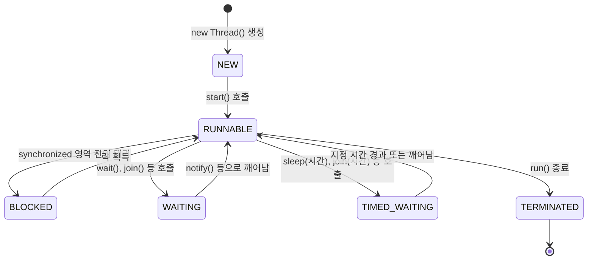

<Callout type="info">
  **이번 문서의 목표:** 이 파일을 다 읽으면 `Thread`를 상속하는 방식과 `Runnable`을 구현하는 방식으로 스레드를 만드는 코드를 각각 작성할 수 있고, 스레드가 거치는 상태를 순서대로 설명할 수 있으며, 여러 스레드가 하나의 변수를 함께 건드릴 때 왜 결과가 틀어지는지, 그리고 `synchronized`가 이를 어떻게 막는지 설명할 수 있다.
</Callout>

## 왜 스레드가 필요한가

지금까지 작성한 프로그램은 `main` 메서드에서 시작해 코드를 한 줄씩 순서대로만 실행했다. 이렇게 한 번에 한 가지 작업만 진행되는 흐름을 **단일 스레드**(single thread)라고 부른다. 하지만 실제 프로그램은 "파일을 내려받는 동안 화면은 계속 반응해야 한다"거나 "여러 요청을 동시에 처리해야 한다"처럼, 여러 작업을 동시에 진행해야 하는 경우가 많다. **스레드**(thread, 실행의 흐름을 나타내는 단위. "실"이라는 원래 뜻처럼 하나의 실행 경로를 의미한다)는 하나의 프로그램(**프로세스**, process) 안에서 독립적으로 실행되는 흐름을 여러 개 만들 수 있게 해 주는 개념이다. 이 편에서는 자바에서 스레드를 만드는 두 가지 방법과 스레드가 거치는 상태, 그리고 여러 스레드가 하나의 데이터를 함께 다룰 때 생기는 문제와 기본적인 해결책을 다룬다.

## 스레드 생성 방식 1: Thread 클래스 상속

> **쉽게 말하면:** `Thread`를 상속받은 뒤 `run()` 메서드 안에 "스레드가 할 일"을 적으면, 그 객체를 실행시켰을 때 그 일이 별도의 흐름으로 진행된다.

첫 번째 방법은 `java.lang.Thread` 클래스를 **상속**(08편에서 배운 `extends`)해 하위 클래스를 만들고, 부모 클래스의 `run()` 메서드를 **오버라이딩**(09편)해 그 안에 스레드가 실행할 코드를 작성하는 것이다.

```java
class 인사스레드 extends Thread {
    @Override
    public void run() {
        for (int i = 1; i <= 3; i++) {
            System.out.println(Thread.currentThread().getName() + ": 안녕 " + i);
        }
    }
}

public class ThreadExtendsDemo {
    public static void main(String[] args) {
        인사스레드 t1 = new 인사스레드();
        t1.start();
        System.out.println("main 스레드는 계속 진행됩니다.");
    }
}
```

```text
main 스레드는 계속 진행됩니다.
Thread-0: 안녕 1
Thread-0: 안녕 2
Thread-0: 안녕 3
```

<Callout type="warning">
  시험 함정: 위 실행 결과에서 "main 스레드는 계속 진행됩니다."가 먼저 출력되느냐, "안녕 1"이 먼저 출력되느냐는 **운영체제의 스케줄링에 따라 달라질 수 있다.** 독학사 시험에서 이런 코드의 출력 순서를 묻는다면, 정답은 대개 "두 스레드가 동시에 진행되므로 실행 순서가 보장되지 않는다"는 점 자체를 묻는 것이지, 어느 한쪽이 항상 먼저 출력된다고 단정하는 선택지는 옳지 않은 경우가 많다.
</Callout>

여기서 핵심은 `run()`을 직접 호출하지 않고 **`start()`**를 호출했다는 점이다. `start()`는 운영체제에 새로운 스레드 실행을 요청하는 메서드로, 이 요청이 받아들여지면 **새로운 실행 흐름 위에서** `run()`이 실행된다. 반면 `run()`을 직접 호출하면 새로운 스레드가 생성되지 않고, 그냥 현재 스레드(예: `main`)에서 보통의 메서드처럼 순서대로 실행되어 버린다. 이는 독학사 시험에서 가장 자주 나오는 함정 중 하나다.

<Callout type="warning">
  시험 함정: "t1.run()과 t1.start()는 결과가 같다"는 설명은 틀렸다. `run()`을 직접 호출하면 새 스레드가 만들어지지 않고 현재 스레드에서 그냥 순서대로 실행되며, `start()`를 호출해야 새로운 실행 흐름이 만들어져 다른 코드와 동시에 진행된다.
</Callout>

## 스레드 생성 방식 2: Runnable 인터페이스 구현

> **쉽게 말하면:** "스레드가 할 일"만 별도의 클래스로 정의해 두고, 그 일을 실제로 실행시키는 것은 `Thread` 객체에게 맡기는 방식이다.

두 번째 방법은 `java.lang.Runnable` 인터페이스(11편에서 배운 인터페이스)를 **구현**해 `run()` 메서드를 작성한 뒤, 그 객체를 `Thread`의 생성자에 전달하는 것이다.

```java
class 인사작업 implements Runnable {
    @Override
    public void run() {
        for (int i = 1; i <= 3; i++) {
            System.out.println(Thread.currentThread().getName() + ": 반가워 " + i);
        }
    }
}

public class ThreadRunnableDemo {
    public static void main(String[] args) {
        Thread t2 = new Thread(new 인사작업());
        t2.start();
    }
}
```

```text
Thread-0: 반가워 1
Thread-0: 반가워 2
Thread-0: 반가워 3
```

두 방식을 비교하면 다음과 같다. 독학사 시험은 "왜 `Runnable` 방식을 더 권장하는가"를 묻는 서술형·단답형으로도 자주 낸다.

| 비교 항목 | Thread 상속 | Runnable 구현 |
|---|---|---|
| 다중 상속 제약 | 이미 `Thread`를 상속했으므로 다른 클래스를 추가로 상속할 수 없다(Java는 클래스 다중 상속 금지, 08편) | 인터페이스를 구현한 것이므로 다른 클래스를 상속하는 것이 여전히 가능하다 |
| 작업과 실행의 분리 | 작업 내용과 스레드 자체가 한 클래스에 묶인다 | 작업(`Runnable`)과 실행 도구(`Thread`)가 분리되어, 같은 작업 객체를 여러 스레드에서 재사용하기 쉽다 |
| 일반적 권장 | 특수한 경우(스레드 자체의 기능을 확장해야 할 때)에만 | 대부분의 경우에 권장되는 방식 |

## 스레드의 생명주기 상태

스레드는 생성부터 종료까지 여러 **상태**(state)를 거친다. `Thread.State` 열거형(enum)이 정의하는 상태를 중심으로, 독학사 시험에 자주 나오는 흐름을 그리면 다음과 같다.



| 상태 | 의미 |
|---|---|
| NEW | `Thread` 객체는 생성되었지만 아직 `start()`가 호출되지 않은 상태 |
| RUNNABLE | `start()` 호출 후, 실행 중이거나 CPU를 배정받기 위해 대기 중인 상태(자바 명세에서는 이 둘을 하나로 묶는다) |
| BLOCKED | 다른 스레드가 점유한 락(lock)을 기다리며 `synchronized` 영역 진입을 대기하는 상태 |
| WAITING | `wait()`, `join()`(인자 없이) 등을 호출해 다른 스레드의 특정 동작(`notify()` 호출 등)을 기약 없이 기다리는 상태 |
| TIMED_WAITING | `sleep(시간)`, `join(시간)`처럼 **정해진 시간** 동안만 기다리는 상태 |
| TERMINATED | `run()` 메서드 실행이 끝나 스레드가 종료된 상태 |

<Callout type="warning">
  시험 함정: "`start()`를 호출하는 즉시 스레드가 실행된다"는 설명은 정확하지 않다. `start()`를 호출하면 스레드는 곧바로 실행되는 것이 아니라 **RUNNABLE 상태**(실행 가능하지만 CPU 배정을 기다릴 수도 있는 상태)로 들어간다. 실제로 CPU를 배정받아 코드가 실행되는 시점은 운영체제의 스케줄링에 달려 있다.
</Callout>

## 공유 자원 문제: 왜 여러 스레드가 같은 변수를 건드리면 위험한가

여러 스레드가 **같은 객체의 필드**(공유 자원, shared resource)를 동시에 읽고 쓰면, 예상과 다른 결과가 나올 수 있다. 다음 코드는 두 스레드가 같은 계좌 객체의 잔액을 각각 1000번씩 증가시키는 예제다.

```java
class 계좌 {
    int 잔액 = 0;

    void 입금() {
        잔액++;
    }
}

public class RaceConditionDemo {
    public static void main(String[] args) throws InterruptedException {
        계좌 acc = new 계좌();

        Runnable 작업 = () -> {
            for (int i = 0; i < 1000; i++) {
                acc.입금();
            }
        };

        Thread t1 = new Thread(작업);
        Thread t2 = new Thread(작업);
        t1.start();
        t2.start();
        t1.join();
        t2.join();

        System.out.println("최종 잔액: " + acc.잔액);
    }
}
```

```text
최종 잔액: 1000 ~ 2000 사이의 예측 불가능한 값 (2000이 아닐 수 있다)
```

두 스레드가 각각 1000번씩 `잔액++`을 실행했으니 언뜻 결과가 항상 2000이어야 할 것 같지만, 실제로는 그렇지 않을 수 있다. 그 이유는 `잔액++`이라는 한 줄이 실제로는 다음 세 단계로 나뉘어 실행되는 **원자적이지 않은**(not atomic, 한 번에 끊기지 않고 실행되는 것이 보장되지 않는다는 뜻) 연산이기 때문이다.

1. `잔액` 값을 읽는다.
2. 읽은 값에 1을 더한다.
3. 더한 값을 다시 `잔액`에 저장한다.

| 시각 | 스레드 t1 | 스레드 t2 | 잔액 |
|---|---|---|---|
| 1 | 잔액 값 0을 읽음 | - | 0 |
| 2 | - | 잔액 값 0을 읽음(t1이 아직 저장 전) | 0 |
| 3 | 0+1=1을 잔액에 저장 | - | 1 |
| 4 | - | 0+1=1을 잔액에 저장(t1의 결과를 덮어씀) | 1 |

이 표처럼 두 스레드의 실행 순서가 겹치면(**경쟁 상태**, race condition — 여러 스레드가 같은 자원을 두고 실행 순서에 따라 결과가 달라지는 상황), 두 번의 입금 중 한 번이 사라진 것처럼 결과가 나온다. 이런 문제를 막으려면 "값을 읽고, 더하고, 저장하는" 세 단계가 중간에 다른 스레드가 끼어들지 못하도록 **하나의 덩어리**로 묶어야 하는데, 그 방법이 다음의 `synchronized`다.

## synchronized로 공유 자원 보호하기

**`synchronized`** 키워드를 메서드에 붙이면, 그 메서드는 **한 번에 한 스레드만** 실행할 수 있게 된다. 다른 스레드가 이미 그 메서드(더 정확히는 같은 객체의 락)를 실행 중이면, 나중에 온 스레드는 앞선 스레드가 끝날 때까지 **BLOCKED 상태**로 대기한다.

```java
class 계좌 {
    int 잔액 = 0;

    synchronized void 입금() {
        잔액++;
    }
}
```

`synchronized`를 붙이는 것만으로 앞의 계좌 예제는 항상 정확히 2000이라는 결과를 보장하게 된다. `synchronized`가 만드는 "한 번에 하나씩만 통과하는 문"의 원리와, 이 키워드를 메서드가 아니라 특정 코드 블록에만 좁게 적용하는 방법, 그리고 이때 등장하는 **모니터**(monitor) 개념은 다음 19편에서 이어서 깊게 다룬다.

<Callout type="warning">
  시험 함정: "`synchronized`를 붙이면 스레드의 실행 순서가 항상 t1, t2 순서로 고정된다"는 설명은 틀렸다. `synchronized`는 **동시에 여러 스레드가 같은 임계 구역에 들어가지 못하게 막을 뿐**, 어느 스레드가 먼저 실행될지의 순서까지 결정해 주지는 않는다.
</Callout>

## 자주 틀리는 점

- `run()`을 직접 호출해 놓고 스레드가 동시에 실행되었다고 착각하는 경우가 있다 — 반드시 `start()`를 호출해야 새 실행 흐름이 생긴다.
- `Thread` 상속 방식만 알고 `Runnable` 구현 방식의 장점(다른 클래스 상속이 가능하다는 점)을 놓치는 경우가 많다.
- 스레드의 상태 이름(RUNNABLE, BLOCKED, WAITING, TIMED_WAITING)의 의미를 서로 바꿔 기억하는 경우가 잦다 — 락을 기다리는 것은 BLOCKED, 특정 신호를 기다리는 것은 WAITING이다.
- `잔액++` 같은 한 줄짜리 연산도 여러 단계로 나뉘어 실행된다는 사실을 놓쳐, "한 줄이니 안전할 것"이라고 착각하는 경우가 많다.

## 핵심 정리

- 스레드를 만드는 방법은 `Thread` 클래스를 상속해 `run()`을 오버라이딩하는 방식과, `Runnable`을 구현해 `Thread`의 생성자에 넘기는 방식 두 가지이며, 일반적으로 `Runnable` 방식이 더 권장된다.
- `run()`을 직접 호출하면 새 스레드가 생기지 않는다. 새 실행 흐름을 만들려면 `start()`를 호출해야 한다.
- 스레드는 NEW → RUNNABLE → (BLOCKED / WAITING / TIMED_WAITING을 오가며) → TERMINATED의 흐름으로 상태가 바뀐다.
- 여러 스레드가 같은 변수를 동시에 읽고 쓰면 원자적이지 않은 연산 때문에 경쟁 상태가 생겨 예측 불가능한 결과가 나올 수 있다.
- `synchronized`는 한 번에 한 스레드만 임계 구역을 실행하도록 막아 경쟁 상태를 해결하는 기본 도구다.

## 마무리 복습

<Quiz
  questionNumber={1}
  question="자바에서 스레드를 만드는 방법으로 옳지 않은 것은?"
  options={['Thread 클래스를 상속하고 run()을 오버라이딩한다', 'Runnable 인터페이스를 구현하고 그 객체를 Thread 생성자에 전달한다', 'run() 메서드를 직접 호출해 새로운 실행 흐름을 만든다', 'start() 메서드를 호출해 새로운 실행 흐름을 시작한다']}
  correctAnswer={3}
  explanation="run()을 직접 호출하면 새로운 스레드(실행 흐름)가 생기지 않는다. 새 실행 흐름을 만들려면 start()를 호출해야 한다."
  optionExplanations={['옳은 스레드 생성 방법이다', '옳은 스레드 생성 방법이다', '정답. run()을 직접 호출하면 현재 스레드에서 그냥 순서대로 실행될 뿐이다', 'start() 호출이 새 실행 흐름을 만드는 정상적인 방법이다']}
/>

<Quiz
  questionNumber={2}
  question="Thread 클래스를 상속하는 방식보다 Runnable 인터페이스를 구현하는 방식이 더 권장되는 주된 이유는?"
  options={['Runnable 방식이 항상 실행 속도가 더 빠르기 때문에', 'Runnable을 구현하면 다른 클래스를 상속하는 것이 여전히 가능하기 때문에', 'Thread를 상속하면 run() 메서드를 오버라이딩할 수 없기 때문에', 'Runnable 방식은 synchronized를 쓸 필요가 없기 때문에']}
  correctAnswer={2}
  explanation="자바는 클래스의 다중 상속을 허용하지 않으므로, Thread를 이미 상속한 클래스는 다른 클래스를 상속할 수 없다. Runnable은 인터페이스이므로 구현해도 다른 클래스를 상속하는 데 제약이 없다."
  optionExplanations={['두 방식의 실행 속도 자체는 근본적으로 다르지 않다', '정답. 다중 상속 제약을 피할 수 있다는 점이 핵심 이유다', 'Thread를 상속해도 run()을 오버라이딩하는 것은 정상적으로 가능하다', 'synchronized의 필요 여부는 공유 자원 사용 여부에 달려 있지 스레드 생성 방식과는 무관하다']}
/>

<Quiz
  questionNumber={3}
  question="Thread 객체가 생성된 직후, start()가 아직 호출되지 않은 상태는?"
  options={['RUNNABLE', 'NEW', 'TERMINATED', 'BLOCKED']}
  correctAnswer={2}
  explanation="Thread 객체를 new로 생성만 하고 start()를 호출하지 않은 상태가 NEW다."
  optionExplanations={['RUNNABLE은 start() 호출 이후의 상태다', '정답. 생성만 되고 아직 시작되지 않은 상태다', 'TERMINATED는 run()이 끝난 이후의 상태다', 'BLOCKED는 락을 기다리는 상태로 아직 시작조차 하지 않은 NEW와 다르다']}
/>

<Quiz
  questionNumber={4}
  question="여러 스레드가 같은 변수에 대해 잔액++ 같은 연산을 동시에 수행할 때 결과가 예측과 달라질 수 있는 근본적인 이유는?"
  options={['잔액++ 연산이 한 번에 끊기지 않고 실행되는 것이 보장되지 않는 원자적이지 않은 연산이기 때문에', '자바 컴파일러가 ++ 연산자를 지원하지 않기 때문에', 'int 자료형이 여러 스레드 환경에서는 자동으로 String으로 바뀌기 때문에', 'Thread 클래스가 산술 연산자를 오버라이딩하기 때문에']}
  correctAnswer={1}
  explanation="잔액++는 값을 읽고, 더하고, 저장하는 세 단계로 나뉘어 실행되는 원자적이지 않은 연산이라 여러 스레드가 끼어들면 결과가 어긋날 수 있다."
  optionExplanations={['정답. 읽기·더하기·저장의 세 단계로 쪼개져 실행되는 것이 문제의 근본 원인이다', '자바 컴파일러는 ++ 연산자를 정상적으로 지원한다', 'int가 String으로 자동 변환되는 규칙은 존재하지 않는다', 'Thread 클래스는 산술 연산자를 오버라이딩하지 않는다']}
/>

<Quiz
  questionNumber={5}
  question="메서드에 synchronized 키워드를 붙였을 때 나타나는 효과로 옳은 것은?"
  options={['그 메서드를 여러 스레드가 동시에 실행할 수 있게 된다', '한 번에 한 스레드만 그 메서드(정확히는 그 객체의 락)를 실행할 수 있게 된다', '그 메서드는 예외를 절대 던지지 않게 된다', '그 메서드의 실행 속도가 항상 더 빨라진다']}
  correctAnswer={2}
  explanation="synchronized는 한 번에 한 스레드만 해당 임계 구역(락으로 보호된 영역)을 실행하도록 제한해 경쟁 상태를 막는다."
  optionExplanations={['synchronized는 동시 실행을 오히려 제한하는 키워드다', '정답. 한 번에 한 스레드만 통과하도록 제한한다', 'synchronized와 예외 발생 여부는 관련이 없다', '락을 얻기 위해 대기하는 시간이 생길 수 있어 오히려 느려질 수 있다']}
/>

<Quiz
  questionNumber={6}
  question="스레드가 sleep(1000)을 호출해 1초 동안 대기하는 상태에 해당하는 것은?"
  options={['NEW', 'WAITING', 'TIMED_WAITING', 'TERMINATED']}
  correctAnswer={3}
  explanation="sleep(시간)처럼 정해진 시간만큼만 대기하는 상태는 TIMED_WAITING이다. 인자 없는 wait()나 join()처럼 기약 없이 기다리는 상태인 WAITING과 구분된다."
  optionExplanations={['NEW는 아직 시작조차 하지 않은 상태다', 'WAITING은 기약 없이 기다리는 상태로 정해진 시간이 있는 sleep과는 다르다', '정답. 정해진 시간 동안 대기하는 상태다', 'TERMINATED는 이미 종료된 상태다']}
/>

<Quiz
  questionNumber={7}
  question="synchronized를 붙인 메서드에 대한 설명으로 옳지 않은 것은?"
  options={['같은 객체의 synchronized 메서드를 다른 스레드가 이미 실행 중이면 나중 스레드는 대기한다', '대기 중인 스레드는 BLOCKED 상태가 된다', 'synchronized는 여러 스레드가 실행할 순서(누가 먼저인지)까지 결정해 준다', 'synchronized의 목적은 공유 자원에 대한 경쟁 상태를 막는 것이다']}
  correctAnswer={3}
  explanation="synchronized는 동시에 여러 스레드가 임계 구역에 들어가지 못하게 막을 뿐이며, 어느 스레드가 먼저 실행될지의 순서까지 보장하지는 않는다."
  optionExplanations={['옳은 설명이다', '옳은 설명이다', '정답. 실행 순서 자체를 결정해 주지는 않는다', '옳은 설명이다']}
/>

## 참고 자료

- Oracle Java Tutorials - Concurrency: https://docs.oracle.com/javase/tutorial/essential/concurrency/index.html
