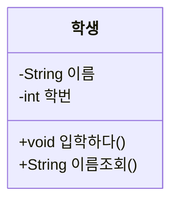
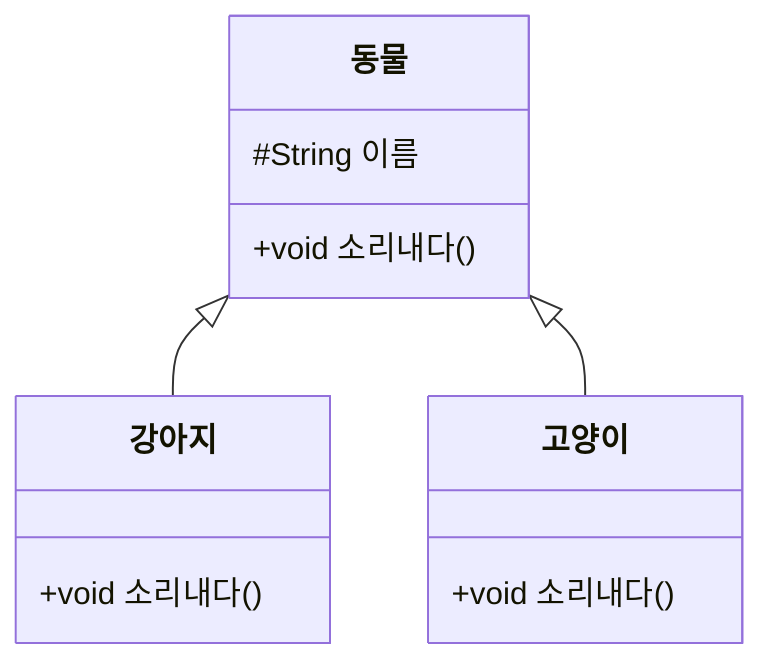
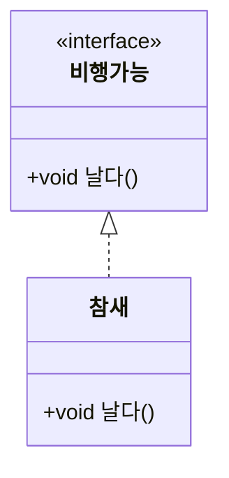
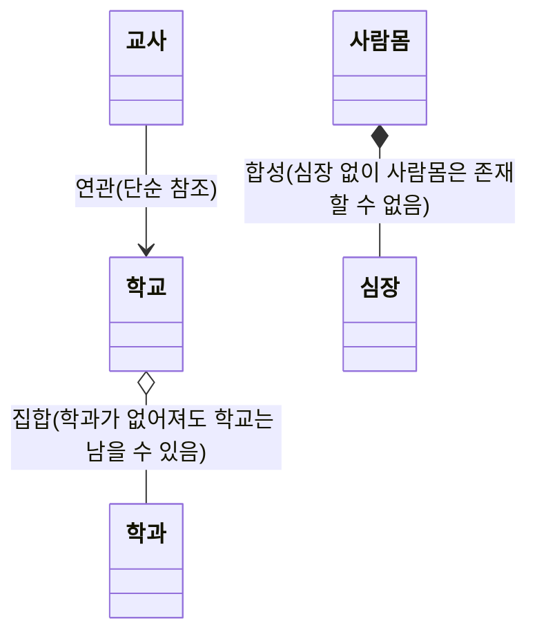
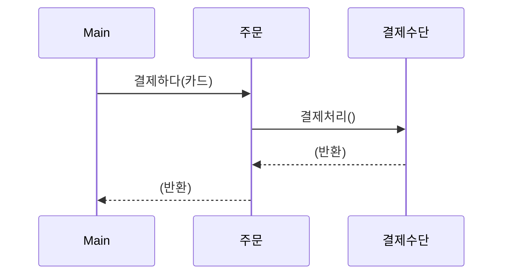

<Callout type="info">
  **이번 문서의 목표:** 이 파일을 다 읽으면 UML 클래스 다이어그램에 그려진 클래스 박스와 화살표만 보고 그 클래스들 사이의 관계(상속인지, 포함인지, 단순 연관인지)를 구분해 말할 수 있고, 간단한 시퀀스 다이어그램을 실제 Java 코드의 메서드 호출 순서와 짝지을 수 있다.
</Callout>

## 왜 UML을 알아야 하는가

지금까지는 클래스와 클래스 사이의 관계(상속, 인터페이스 구현, 필드로 다른 객체를 가지는 것 등)를 모두 Java 코드로만 표현했다. 하지만 여러 클래스가 복잡하게 얽힌 설계를 코드만 보고 한눈에 파악하기는 어렵고, 개발자끼리 설계를 논의할 때도 코드보다 그림이 훨씬 빠르게 의사소통된다. **UML**(Unified Modeling Language, 통합 모델링 언어 — 소프트웨어의 구조와 동작을 그림으로 표준화해 표현하는 언어)은 이런 목적으로 만들어진 표기법의 집합이다. 독학사 3단계 시험에서는 UML 전체를 요구하지 않고, **클래스 다이어그램**(class diagram, 클래스와 그 관계를 표현하는 그림)과 아주 간단한 **시퀀스 다이어그램**(sequence diagram, 객체 사이의 메서드 호출 순서를 표현하는 그림) 수준까지만 다룬다. 이 편에서는 그동안 04~12편에서 코드로 배운 클래스·상속·인터페이스 관계를, UML이라는 공통 그림 언어로 다시 읽는 법을 정리한다.

## 클래스 표기법: 세 칸짜리 박스

> **쉽게 말하면:** UML에서 클래스 하나는 이름, 가진 데이터, 할 수 있는 일이 위에서부터 차례로 적힌 3층짜리 상자로 그린다.

UML 클래스 다이어그램에서 클래스 하나는 위에서부터 **클래스 이름**, **속성**(attribute, 필드에 대응), **메서드**(method, 연산에 대응) 순서로 나뉜 직사각형으로 그린다.



이 그림은 다음 Java 코드와 정확히 대응한다.

```java
class 학생 {
    private String 이름;
    private int 학번;

    public void 입학하다() { /* ... */ }
    public String 이름조회() { /* ... */ return 이름; }
}
```

속성과 메서드 앞에 붙는 기호는 06편에서 배운 **접근 제어자**를 나타낸다.

| UML 기호 | 접근 제어자 |
|---|---|
| `+` | `public` |
| `-` | `private` |
| `#` | `protected` |
| `~` (물결표 대신 UML 표기에서만 쓰이며, 문서 안에서는 코드 스팬으로 표기) | 기본(package-private, 접근 제어자를 아예 쓰지 않은 경우) |

<Callout type="warning">
  시험 함정: UML 클래스 박스에서 밑줄이 그어진 속성이나 메서드는 **정적**(static) 멤버를 뜻한다. 밑줄이 없는 일반 속성·메서드와 혼동해서 "이 그림에는 static 멤버가 없다"고 잘못 판단하지 않도록, 밑줄 표시의 의미를 반드시 기억해야 한다.
</Callout>

## 관계 표기 1: 상속(일반화)

08편에서 배운 `extends`에 의한 상속 관계를 UML에서는 **일반화**(generalization)라고 부르며, **속이 빈 삼각형 화살표**로 표현한다. 화살표는 항상 하위 클래스에서 상위 클래스 쪽을 가리킨다.



이 그림은 `강아지 extends 동물`, `고양이 extends 동물`이라는 Java 코드와 대응한다. 09편에서 배운 오버라이딩(같은 시그니처의 `소리내다()`를 하위 클래스마다 다시 정의)도 이 그림의 하위 클래스 박스에 같은 이름의 메서드가 다시 나타나는 것으로 표현된다.

## 관계 표기 2: 인터페이스 구현(실체화)

11편에서 배운 인터페이스 구현 관계는 **실체화**(realization)라고 부르며, **점선 + 속이 빈 삼각형 화살표**로 표현한다. 인터페이스는 클래스 이름 위에 `<<interface>>`라는 **스테레오타입**(stereotype, 그 요소의 종류를 표시하는 꼬리표)을 붙여 구분한다.



이 그림은 `class 참새 implements 비행가능 { public void 날다() { ... } }`이라는 코드와 대응한다.

<Callout type="warning">
  시험 함정: 상속(일반화)과 인터페이스 구현(실체화)은 둘 다 속이 빈 삼각형 화살표를 쓰지만, **선의 종류가 다르다.** 상속은 **실선**, 인터페이스 구현은 **점선**이다. 이 둘을 혼동하는 문제가 자주 나온다.
</Callout>

## 관계 표기 3: 연관, 집합, 합성 — "가지고 있다"의 세 단계

클래스가 다른 클래스를 필드로 가지는 관계는 그 **결합의 강도**에 따라 세 가지로 나뉜다. 이 구분은 독학사 시험에서 "다음 그림이 나타내는 관계는?"이라는 형태로 자주 출제된다.

> **쉽게 말하면:** 연관은 "그냥 알고 지내는 사이", 집합은 "한 팀에 속해 있지만 팀이 없어져도 각자 살아남는 사이", 합성은 "몸통과 팔다리처럼 하나가 없어지면 같이 없어지는 사이"다.

- **연관**(association): 한 클래스가 다른 클래스를 필드로 참조하는, 가장 느슨한 관계. 실선으로 표현한다.
- **집합**(aggregation): "전체-부분" 관계이지만, 부분이 전체와 **독립적으로 존재**할 수 있는 관계. 전체 쪽에 **속이 빈 마름모**를 붙인 실선으로 표현한다.
- **합성**(composition): "전체-부분" 관계이면서, 부분이 전체에 **강하게 종속**되어 전체가 사라지면 부분도 함께 사라지는 관계. 전체 쪽에 **속이 채워진 마름모**를 붙인 실선으로 표현한다.



| 관계 | 화살표 표기 | Java 코드 예시 | 부분의 생존 여부 |
|---|---|---|---|
| 연관 | 실선(화살표 있을 수도 없을 수도 있음) | `class 교사 { 학교 소속학교; }` | 서로 독립적으로 생성·소멸 |
| 집합 | 실선 + 속이 빈 마름모 | `class 학교 { List&lt;학과&gt; 학과목록; }` | 학과 객체는 학교 객체가 사라져도 다른 곳에서 유지될 수 있음 |
| 합성 | 실선 + 속이 채워진 마름모 | 생성자 안에서 `new 심장()`으로 직접 만들어 필드에 대입 | 사람몸 객체가 사라지면 심장 객체도 함께 사라짐(다른 곳에서 재사용 불가) |

<Callout type="warning">
  시험 함정: "집합과 합성은 화살표 모양만 다를 뿐 의미는 같다"는 설명은 틀렸다. 두 관계의 핵심 차이는 **부분 객체의 생명주기가 전체 객체에 종속되는가**이다. 마름모가 빈 것(집합)인지 채워진 것(합성)인지는 이 생명주기 종속 여부를 나타내는 표시이지 단순한 그림 차이가 아니다.
</Callout>

## 인터페이스와 추상 클래스를 UML에서 구분하기

10편과 11편에서 다룬 추상 클래스와 인터페이스는 UML에서도 표기법으로 구분된다.

| 구분 | UML 표기 |
|---|---|
| 추상 클래스 | 클래스 이름을 *기울임꼴*로 표시하거나 `{abstract}` 표시를 덧붙임 |
| 추상 메서드 | 메서드 이름을 *기울임꼴*로 표시 |
| 인터페이스 | 이름 위에 `<<interface>>` 스테레오타입 표시 |

## 시퀀스 다이어그램과 코드의 대응

**시퀀스 다이어그램**(sequence diagram)은 여러 객체가 시간 순서에 따라 서로의 메서드를 호출하는 흐름을 표현한다. 세로선은 각 객체의 생명선(lifeline)이고, 가로 화살표는 메서드 호출을 나타낸다.

```java
class 주문 {
    void 결제하다(결제수단 수단) {
        수단.결제처리();
    }
}

class 결제수단 {
    void 결제처리() {
        System.out.println("결제 완료");
    }
}

public class SequenceDemo {
    public static void main(String[] args) {
        주문 order = new 주문();
        결제수단 카드 = new 결제수단();
        order.결제하다(카드);
    }
}
```

```text
결제 완료
```

이 코드의 호출 순서를 시퀀스 다이어그램으로 그리면 다음과 같다.



화살표 `->>`는 메서드 호출(요청)을, `-->>`는 그 호출이 끝나고 제어가 되돌아오는 반환을 나타낸다. `Main`이 `주문` 객체의 `결제하다()`를 호출하면, 그 메서드 안에서 다시 `결제수단` 객체의 `결제처리()`를 호출하는 구조가 그대로 화살표의 흐름으로 나타난다. 독학사 시험은 이런 간단한 시퀀스 다이어그램을 보여주고 "이 그림에 해당하는 코드는?" 또는 반대로 코드를 보여주고 "이 코드의 호출 순서를 옳게 나타낸 다이어그램은?"을 묻는 형태로 출제한다.

## 자주 틀리는 점

- 상속(일반화, 실선)과 인터페이스 구현(실체화, 점선)의 화살표 모양은 같은 삼각형이지만 **선의 종류**(실선/점선)가 다르다는 것을 놓친다.
- 집합(빈 마름모)과 합성(채운 마름모)을 단순히 "포함 관계"로 뭉뚱그려, 부분 객체의 생명주기가 전체에 종속되는지 여부를 구분하지 못한다.
- UML 클래스 박스에서 밑줄이 정적(static) 멤버를 뜻한다는 표기 규칙을 놓친다.
- 시퀀스 다이어그램의 화살표 방향과 실제 코드에서 "누가 누구를 호출하는지"를 반대로 읽는 경우가 있다 — 화살표는 항상 호출하는 쪽에서 호출받는 쪽으로 향한다.

## 핵심 정리

- UML 클래스 박스는 클래스 이름·속성·메서드 세 칸으로 이루어지며, `+`/`-`/`#`는 각각 `public`/`private`/`protected`에 대응한다.
- 상속(일반화)은 실선 + 속이 빈 삼각형, 인터페이스 구현(실체화)은 점선 + 속이 빈 삼각형으로 표현해 구분한다.
- "가지고 있다" 관계는 연관(단순 참조), 집합(빈 마름모, 부분이 독립적으로 생존 가능), 합성(채운 마름모, 부분이 전체에 생명주기가 종속)의 세 단계로 나뉜다.
- 추상 클래스·추상 메서드는 기울임꼴로, 인터페이스는 `<<interface>>` 스테레오타입으로 표시한다.
- 시퀀스 다이어그램의 가로 화살표는 메서드 호출과 반환을 시간 순서대로 나타내며, 실제 코드의 메서드 호출 관계와 직접 대응한다.

## 마무리 복습

<Quiz
  questionNumber={1}
  question="UML 클래스 다이어그램에서 속성이나 메서드 앞에 붙는 기호 -(마이너스)가 나타내는 접근 제어자는?"
  options={['public', 'private', 'protected', '기본(package-private)']}
  correctAnswer={2}
  explanation="UML에서 -(마이너스) 기호는 private을 나타낸다. +는 public, #은 protected에 대응한다."
  optionExplanations={['public은 + 기호로 표시한다', '정답. -는 private을 나타낸다', 'protected는 # 기호로 표시한다', '기본 접근 제어자는 별도의 물결 기호 등으로 표시하며 -가 아니다']}
/>

<Quiz
  questionNumber={2}
  question="상속(일반화) 관계와 인터페이스 구현(실체화) 관계를 UML에서 구분하는 방법으로 옳은 것은?"
  options={['둘 다 완전히 같은 표기를 사용해 구분할 수 없다', '상속은 실선, 인터페이스 구현은 점선의 속이 빈 삼각형 화살표를 사용한다', '상속은 채운 삼각형, 인터페이스 구현은 빈 삼각형 화살표를 사용한다', '상속은 화살표 없이 선만 긋고, 인터페이스 구현만 화살표를 사용한다']}
  correctAnswer={2}
  explanation="두 관계 모두 속이 빈 삼각형 화살표를 쓰지만, 상속은 실선, 인터페이스 구현(실체화)은 점선으로 구분한다."
  optionExplanations={['선의 종류(실선/점선)로 명확히 구분할 수 있다', '정답. 실선과 점선으로 구분한다', '두 관계 모두 채운 삼각형이 아니라 속이 빈 삼각형을 사용한다', '두 관계 모두 화살표를 사용하며 화살표 유무로 구분하지 않는다']}
/>

<Quiz
  questionNumber={3}
  question="집합(aggregation)과 합성(composition)의 가장 핵심적인 차이는?"
  options={['집합은 실선, 합성은 점선을 사용한다는 점', '부분 객체의 생명주기가 전체 객체에 종속되는지 여부', '집합은 클래스 사이에서만, 합성은 인터페이스 사이에서만 사용된다는 점', '집합은 1개의 부분만, 합성은 여러 개의 부분만 허용한다는 점']}
  correctAnswer={2}
  explanation="집합은 부분이 전체와 독립적으로 존재할 수 있는 관계이고, 합성은 전체가 사라지면 부분도 함께 사라지는, 생명주기가 종속된 관계다. 이 생명주기 종속 여부가 핵심 차이다."
  optionExplanations={['둘 다 실선을 사용하며 마름모가 빈 것인지 채운 것인지로 구분한다', '정답. 생명주기 종속 여부가 핵심 차이다', '두 관계 모두 클래스 사이의 관계이며 인터페이스 전용 표기가 아니다', '부분의 개수 제한과는 관련이 없는 구분이다']}
/>

<Quiz
  questionNumber={4}
  question="UML 클래스 다이어그램에서 인터페이스를 표시할 때 사용하는 표기는?"
  options={['클래스 이름에 밑줄을 긋는다', '이름 위에 interface 스테레오타입(길러멧 표기)을 붙인다', '클래스 박스를 원 모양으로 그린다', '속성 칸을 빨간색으로 칠한다']}
  correctAnswer={2}
  explanation="인터페이스는 클래스 이름 위에 interface라는 스테레오타입 표시(길러멧 기호로 감싼 형태)를 붙여 일반 클래스와 구분한다."
  optionExplanations={['밑줄은 정적(static) 멤버를 나타내는 표시이지 인터페이스 표시가 아니다', '정답. interface 스테레오타입으로 표시한다', 'UML 클래스 다이어그램에서 원 모양 표기는 표준적인 인터페이스 표기가 아니다', '색상은 UML 표준 표기 요소가 아니다']}
/>

<Quiz
  questionNumber={5}
  question="사람몸 클래스가 심장 객체를 생성자에서 직접 new로 만들어 필드로 가지고 있고, 사람몸 객체가 사라지면 그 심장 객체도 함께 사라지는 관계를 UML로 표현할 때 가장 적절한 것은?"
  options={['속이 빈 삼각형 화살표(일반화)', '속이 빈 마름모가 붙은 실선(집합)', '속이 채워진 마름모가 붙은 실선(합성)', '점선 화살표(의존)']}
  correctAnswer={3}
  explanation="부분 객체(심장)의 생명주기가 전체 객체(사람몸)에 강하게 종속되어 함께 사라지는 관계는 합성이며, 속이 채워진 마름모로 표현한다."
  optionExplanations={['일반화는 상속 관계를 나타내며 이 예시와는 맞지 않는다', '집합은 부분이 전체와 독립적으로 존재할 수 있는 관계로, 함께 사라지는 이 예시와는 다르다', '정답. 생명주기가 종속되는 합성 관계이며 채운 마름모로 표현한다', '점선 화살표(의존)는 일시적으로 다른 클래스를 사용하는 더 느슨한 관계를 나타낸다']}
/>

<Quiz
  questionNumber={6}
  question="UML 클래스 다이어그램에서 메서드 이름에 밑줄이 그어져 있을 때 나타내는 것은?"
  options={['그 메서드가 private임을 나타낸다', '그 메서드가 정적(static) 멤버임을 나타낸다', '그 메서드가 추상 메서드임을 나타낸다', '그 메서드에 예외가 선언되어 있음을 나타낸다']}
  correctAnswer={2}
  explanation="UML에서 밑줄은 정적(static) 멤버를 나타내는 표기다. private 여부는 - 기호로, 추상 여부는 기울임꼴로 별도로 표시한다."
  optionExplanations={['private 여부는 - 기호로 표시하며 밑줄과는 별개의 표기다', '정답. 밑줄은 정적(static) 멤버를 나타낸다', '추상 메서드는 기울임꼴로 표시하며 밑줄과는 다른 표기다', '예외 선언을 나타내는 별도의 표준 UML 표기는 밑줄이 아니다']}
/>

<Quiz
  questionNumber={7}
  question="시퀀스 다이어그램에서 A 생명선에서 B 생명선으로 향하는 화살표에 메서드호출()이라고 적혀 있을 때 이 화살표가 의미하는 것은?"
  options={['B 객체가 A 객체를 상속받는다', 'A 객체가 B 객체의 메서드호출()을 호출한다', 'A와 B가 서로 아무 관계가 없음을 나타낸다', 'A 객체가 삭제되고 B 객체로 대체된다']}
  correctAnswer={2}
  explanation="시퀀스 다이어그램의 가로 화살표는 메서드 호출을 나타내며, 화살표는 호출하는 쪽(A)에서 호출받는 쪽(B)으로 향한다."
  optionExplanations={['시퀀스 다이어그램의 화살표는 상속 관계가 아니라 메서드 호출 순서를 나타낸다', '정답. A가 B의 메서드를 호출한다는 뜻이다', '화살표가 있다는 것은 오히려 두 객체 사이에 호출 관계가 있다는 뜻이다', '시퀀스 다이어그램은 객체의 생성·소멸을 표시할 수도 있지만 이 화살표 자체는 단순 메서드 호출이다']}
/>

## 참고 자료

- 국가평생교육진흥원 독학학위제 - 과목별 평가영역: https://bdes.nile.or.kr/nile/study/nStudy2_1.do
- Oracle Java Tutorials - Object-Oriented Programming Concepts: https://docs.oracle.com/javase/tutorial/java/concepts/index.html
